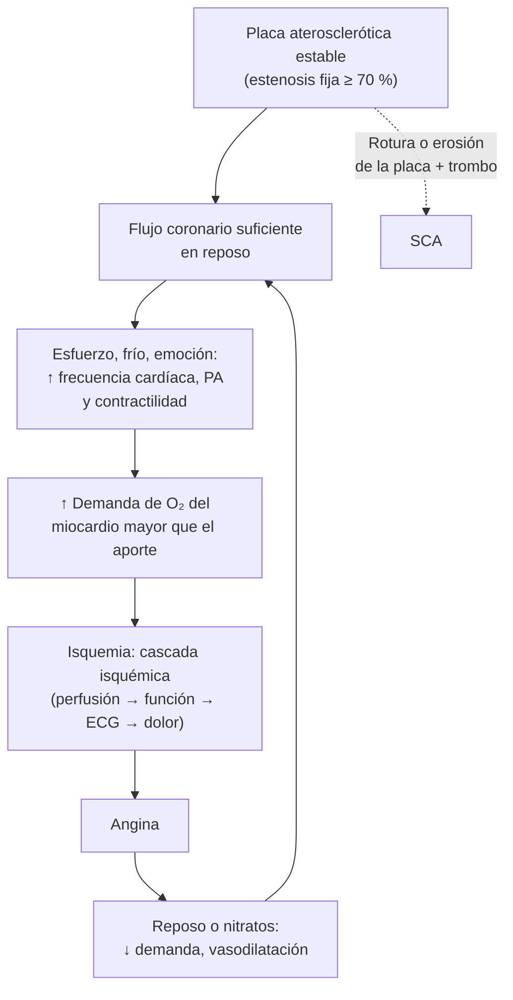

---
tags:
  - Cardiología
  - Frecuente en sala
---

# Angina crónica estable (síndrome coronario crónico)

**Subespecialidad**
Cardiología · Medicina interna · APS (Programa de Salud Cardiovascular)

**Guías principales**
ESC 2024: síndromes coronarios crónicos · AHA/ACC 2023: enfermedad coronaria crónica

**Otras fuentes**
Ensayo ISCHEMIA (2020) · Ensayo LoDoCo2 (colchicina, 2020) · Debate sobre el modelo de probabilidad RF-CL de la ESC 2024 (Andreotti 2026)

**GES**
No (sí el IAM, con su prevención secundaria, y la HTA y la diabetes, que son sus principales factores de riesgo)

**EUNACOM**
1.01.1.001 Angina crónica estable (específico, inicial, completo)

**Revisado**
Septiembre 2026

!!! abstract "Resumen en 60 segundos"
    - **Angina estable**: molestia **opresiva** retroesternal (o en el cuello, la mandíbula o el brazo), **desencadenada por el esfuerzo** o las emociones, que **cede con el reposo o los nitratos en minutos**, con un patrón **sin cambios** en las últimas semanas.
    - Si la angina es **nueva, de reposo o progresiva**, es un **SCA**: urgencia (ver [SCA](sindrome-coronario-agudo.md)).
    - **Evaluación inicial**: ECG, ecocardiograma, hemograma, perfil lipídico, glicemia o HbA1c, creatinina y TSH.
    - Luego se estima la **probabilidad de enfermedad coronaria obstructiva** con el modelo **RF-CL** de la ESC 2024 (edad, sexo, síntomas y 5 factores de riesgo) y se elige el examen:
        - **≤ 5 %**: diferir los exámenes.
        - **> 5–50 %**: **angio-TC coronaria**.
        - **> 15–85 %**: **imagen funcional** de estrés.
        - **> 85 %** o alto riesgo: **coronariografía**.
    - **Tratamiento antianginoso**:
        - **Nitrato sublingual** para las crisis.
        - **Betabloqueador y/o calcioantagonista** de primera línea.
        - Nitratos de acción larga, ranolazina, ivabradina o trimetazidina como complemento.
    - **Prevención de eventos**:
        - **Aspirina 75–100 mg** y **estatina de alta intensidad** (LDL **< 55 mg/dL** y reducción ≥ 50 %).
        - Controlar la PA y la diabetes (iSGLT2 o arGLP-1), **dejar de fumar**, ejercicio y rehabilitación.
        - Considerar la **colchicina 0,5 mg/día**.
    - **Revascularización** (angioplastía o cirugía): si la angina persiste pese al tratamiento médico óptimo, o si la anatomía es de **alto riesgo** (tronco coronario izquierdo, enfermedad de 3 vasos con disfunción ventricular). En **ISCHEMIA** (2020), revascularizar de entrada **no redujo** la muerte ni el infarto frente al tratamiento médico.

## Definición

| Término | Definición |
|---|---|
| **Síndrome coronario crónico (SCC)** | Espectro de presentaciones de la enfermedad coronaria **estable** en el tiempo, por alteraciones estructurales o funcionales de las **arterias epicárdicas o la microcirculación** (ESC 2024) |
| **Angina típica** | Cumple **3** características: (1) molestia **opresiva** retroesternal o en el cuello, la mandíbula, el hombro o el brazo; (2) **desencadenada por el esfuerzo** o el estrés emocional; (3) **cede con el reposo o los nitratos** en minutos |
| **Angina atípica** | Cumple **2** de las 3 características |
| **Dolor no anginoso** | Cumple **0–1** característica |
| **Angina estable** | Patrón **sin cambios** en frecuencia, intensidad y umbral de esfuerzo en las últimas semanas |
| **ANOCA / INOCA** | Angina o isquemia **sin enfermedad coronaria obstructiva**: **disfunción microvascular** o **vasoespasmo**. Más frecuente en **mujeres** |
| **Angina vasoespástica** (Prinzmetal) | Angina de **reposo**, a menudo en la **madrugada**, con **supradesnivel transitorio del ST**, que responde a los nitratos y calcioantagonistas |

## Epidemiología

### Mundial

- La **cardiopatía isquémica** es la **primera causa de muerte** en el mundo. La angina estable es la forma de presentación más frecuente de la enfermedad coronaria crónica.
- Su prevalencia aumenta con la **edad**; en las mujeres, la enfermedad aparece unos 10 años más tarde y con más frecuencia **sin obstrucción** (ANOCA/INOCA).
- En el modelo RF-CL de la ESC 2024, la probabilidad de enfermedad coronaria obstructiva **no supera el 45 %** en ninguna combinación de edad, sexo, síntomas y factores de riesgo. Por eso la mayoría de los pacientes con dolor torácico estable necesita un **examen no invasivo** antes de una coronariografía (Andreotti 2026).
- **ISCHEMIA** (5.179 pacientes con isquemia moderada o grave, seguimiento de 3,2 años):
    - La estrategia **invasiva** inicial no redujo el resultado principal frente a la **conservadora** (**16,4 % vs 18,2 %** a 5 años).
    - La **mortalidad** fue igual (**145 vs 144 muertes**).
    - La revascularización **mejoró la angina** en quienes tenían síntomas frecuentes.

### Chile

!!! chile "Datos nacionales"
    - Las **enfermedades cardiovasculares** son, junto al cáncer, la **principal causa de muerte** en Chile. La **cardiopatía isquémica** es una de las primeras causas específicas (ver [SCA](sindrome-coronario-agudo.md)).
    - **Factores de riesgo** muy prevalentes (ENS 2016–2017): **HTA 27,6 %**, **diabetes 12,3 %**, **tabaquismo 33 %**, colesterol total elevado ~ 28 %, **obesidad 31 %**.
    - El **Programa de Salud Cardiovascular** (PSCV) de la APS controla a los pacientes con HTA, diabetes, dislipidemia y enfermedad cardiovascular establecida, y entrega estatinas, aspirina y antihipertensivos.
    - **GES**: el **IAM** (con su prevención secundaria), la **HTA** y la **diabetes** tienen garantías. La angina estable **no** tiene garantía propia.

## Etiología y factores de riesgo

| Causa | Comentarios |
|---|---|
| **Aterosclerosis coronaria** | La causa de la gran mayoría: placa que estrecha la luz (**≥ 70 %** o ≥ 50 % en el tronco) |
| **Disfunción microvascular** | Isquemia sin obstrucción epicárdica; mujeres, diabetes, HTA |
| **Vasoespasmo** | Angina de reposo; tabaco, cocaína |
| **Aumento de la demanda o menor aporte** | **Estenosis aórtica**, **miocardiopatía hipertrófica**, HTA grave, taquiarritmias, **anemia**, **hipertiroidismo**, hipoxemia |
| **Otras** | Puentes musculares, anomalías coronarias, disección coronaria espontánea, arteritis |

**Factores de riesgo cardiovascular**: edad, sexo masculino, **tabaquismo**, **HTA**, **dislipidemia** (LDL alto, Lp(a)), **diabetes**, **obesidad**, sedentarismo, **ERC**, antecedente familiar de enfermedad coronaria **precoz** (hombres < 55 años, mujeres < 65 años), enfermedades inflamatorias crónicas.

## Fisiopatología

*Figura 1. Fisiopatología de la angina estable. Esquema propio.*

- El consumo de oxígeno del miocardio depende de la **frecuencia cardíaca**, la **contractilidad** y la **tensión de la pared** (PA, volumen).
- Una estenosis fija permite un flujo normal en **reposo**, pero **no** el aumento que exige el esfuerzo: aparece la **isquemia**, que cede al disminuir la demanda.
- **Cascada isquémica**: primero la alteración de la **perfusión**, luego la de la **motilidad** de la pared (ecocardiograma de estrés), después los cambios del **ECG** y al final el **dolor**. Por eso la isquemia puede ser **silente** (diabéticos, adultos mayores).
- **Mecanismo de los fármacos**:
    - Los **betabloqueadores** bajan la frecuencia cardíaca y la contractilidad, y alargan la diástole (más perfusión).
    - Los **calcioantagonistas** dilatan las coronarias y bajan la poscarga.
    - Los **nitratos** reducen la precarga y dilatan las coronarias.
- El **SCA** se produce por la **rotura o erosión** de una placa con **trombosis**, a menudo en placas no críticas. Por eso las estatinas y la aspirina (que estabilizan la placa y previenen la trombosis) son tan importantes como aliviar la angina.

## Clasificación

**Gravedad de la angina: Sociedad Cardiovascular Canadiense (CCS)**

| Clase | Descripción |
|---|---|
| **I** | La actividad ordinaria (caminar, subir escaleras) **no** causa angina; solo el esfuerzo intenso o prolongado |
| **II** | Limitación **leve**: angina al caminar rápido, subir escaleras rápido, en pendiente, con frío o después de comer |
| **III** | Limitación **marcada**: angina al caminar 1–2 cuadras en plano o subir un piso a paso normal |
| **IV** | Angina con **cualquier** actividad física o en **reposo** |

**Por el mecanismo**: enfermedad **obstructiva** de las arterias epicárdicas, **ANOCA/INOCA** (microvascular o vasoespástica) o mixta.

## Clínica

- **Dolor u opresión** retroesternal ("peso", "apretón"), que irradia al **cuello**, la **mandíbula**, el **brazo izquierdo** o el dorso. Dura **minutos** (2–10), no segundos ni horas.
- Aparece con el **esfuerzo**, el **frío**, las **comidas copiosas** o el estrés, y **cede con el reposo o el nitrato** en minutos.
- **Equivalentes anginosos**: **disnea de esfuerzo**, fatiga, malestar epigástrico, sobre todo en **mujeres**, **diabéticos** y **adultos mayores**.
- **Examen físico**: habitualmente **normal**. Buscar:
    - Un **soplo** de **estenosis aórtica** o de miocardiopatía hipertrófica.
    - Signos de **insuficiencia cardíaca**, soplos carotídeos o femorales, pulsos disminuidos (**enfermedad arterial periférica**).
    - Xantomas o xantelasmas, **anemia**, **hipertiroidismo**.
- **Dolor poco probable de ser anginoso**: punzante y localizado con un dedo, que dura segundos o todo el día, que cambia con la respiración o la palpación, o que cede con los antiácidos.

!!! alarma "¿Es angina estable o un SCA?"
    Es un **SCA** (derivación urgente, ECG y troponina) si la angina:

    - Es de **reposo** y prolongada (> 20 minutos).
    - Es de **inicio reciente** y limita la actividad (CCS II–III).
    - Es **progresiva**: más frecuente, más intensa o con menor esfuerzo que antes.
    - Aparece **tras un infarto** o una revascularización reciente.

## Diagnóstico

!!! guia "Evaluación inicial de la sospecha de SCC (ESC 2024)"
    1. **Anamnesis** y **examen físico**; descartar un **SCA** y causas no coronarias.
    2. **ECG de 12 derivaciones** en reposo (y durante el dolor si es posible).
    3. **Exámenes**: hemograma, perfil lipídico, glicemia o HbA1c, creatinina y **TSH**.
    4. **Ecocardiograma** en reposo: función del ventrículo izquierdo, trastornos de la motilidad, valvulopatías (estenosis aórtica), miocardiopatía hipertrófica.
    5. **Radiografía de tórax** si hay signos de insuficiencia cardíaca o se sospecha una enfermedad pulmonar.
    6. **Estimar la probabilidad clínica** de enfermedad coronaria obstructiva con el **RF-CL** (Figura 2) y ajustarla con la clínica y el score de calcio.
    7. **Elegir el examen** según esa probabilidad.

<figure markdown>
![Tabla de probabilidad clínica de enfermedad coronaria obstructiva según la ESC 2024. Arriba se explica el puntaje de síntomas, un punto por cada característica (molestia opresiva torácica, del cuello, la mandíbula, el hombro o el brazo; desencadenada por el esfuerzo; y que cede con reposo o nitratos en minutos), y los cinco factores de riesgo (antecedente familiar de enfermedad coronaria precoz, tabaquismo, dislipidemia, hipertensión arterial y diabetes). La tabla tiene tres grupos según el puntaje de síntomas (0 a 1, 2 y 3 puntos), cada uno dividido en mujeres y hombres, con columnas para 0 a 1, 2 a 3 y 4 a 5 factores de riesgo, y filas por edad desde 30 a 39 hasta 70 a 80 años. Los valores van de 0 % en mujeres jóvenes sin síntomas típicos ni factores de riesgo hasta 45 % en hombres de 70 a 80 años con angina típica y 4 a 5 factores. Los círculos son azules si la probabilidad es muy baja (5 % o menos), verdes si es baja (6 a 15 %) y amarillos si es moderada (más de 15 %). Un recuadro indica ajustar la probabilidad con la clínica (ECG alterado, disfunción ventricular, arritmias ventriculares, enfermedad arterial periférica, calcio coronario previo, angina con poco esfuerzo) y con el score de calcio. Abajo, los umbrales para decidir el examen: muy baja (5 % o menos), diferir los exámenes; baja a moderada (más de 5 a 50 %), angio-TC coronaria; moderada a alta (más de 15 a 85 %), imagen funcional de estrés; muy alta (más de 85 %), coronariografía invasiva](../assets/figuras/angina/probabilidad-clinica-rf-cl-esc-2024.svg){ loading=lazy }
<figcaption>Figura 2. Probabilidad clínica de enfermedad coronaria obstructiva según el modelo RF-CL de la ESC 2024 y examen recomendado. Adaptado y traducido de Andreotti F, Thiele H, Vrints C, et al. Great debate: the new risk factor-weighted clinical likelihood model is useful to estimate the initial pre-test probability of obstructive coronary artery disease in individuals with suspected chronic coronary syndromes. <em>Eur Heart J.</em> 2026;47:2777–2792 (figura 2). Licencia <a href="https://creativecommons.org/licenses/by/4.0/">CC BY 4.0</a>.</figcaption>
</figure>

**Exámenes según la probabilidad clínica (ESC 2024)**:

| Probabilidad | Examen | Qué muestra |
|---|---|---|
| **Muy baja (≤ 5 %)** | **Diferir** los exámenes; buscar otras causas del dolor | — |
| **Baja a moderada (> 5–50 %)** | **Angio-TC coronaria** | **Anatomía**: descarta con gran seguridad la enfermedad obstructiva; detecta placas no obstructivas (indicación de estatina) |
| **Moderada a alta (> 15–85 %)** | **Imagen funcional de estrés**: ecocardiograma de estrés (esfuerzo o dobutamina), SPECT, PET o RM de estrés | **Isquemia**: su presencia y extensión (≥ 10 % del ventrículo = isquemia grave) |
| **Muy alta (> 85 %)**, síntomas refractarios, disfunción ventricular o isquemia grave | **Coronariografía invasiva** (con evaluación funcional de las estenosis intermedias) | Anatomía y posibilidad de **revascularización** en el mismo acto |

- La **prueba de esfuerzo** (ECG de esfuerzo) tiene **menor rendimiento** diagnóstico que la imagen. Sigue siendo útil si no hay imagen disponible y para evaluar la **capacidad funcional**, los síntomas y la respuesta de la PA. Requiere un ECG basal interpretable.
- **Hallazgos de alto riesgo**: estenosis del **tronco coronario izquierdo**, **enfermedad de 3 vasos** proximal, **isquemia extensa**, **FEVI < 35 %**, angina o hipotensión con poco esfuerzo.
- **ANOCA/INOCA**: si hay angina persistente con coronarias sin obstrucción, se puede estudiar la función microvascular y el vasoespasmo en la coronariografía.

## Laboratorio

| Examen | Utilidad |
|---|---|
| **Hemograma** | **Anemia** (empeora la angina) |
| **Perfil lipídico** (± Lp(a) una vez en la vida) | Meta de LDL; riesgo residual |
| **Glicemia** o **HbA1c** | **Diabetes** (cambia el tratamiento: iSGLT2, arGLP-1) |
| **Creatinina** y TFGe, **potasio** | **ERC**; dosis de fármacos (IECA, colchicina) |
| **TSH** | **Hipertiroidismo** (desencadena angina) o hipotiroidismo |
| **Troponina** | **Solo** si se sospecha un **SCA** |
| **NT-proBNP** | Si se sospecha insuficiencia cardíaca |

## Imágenes

- **Ecocardiograma** en reposo: a todos (FEVI, motilidad, válvulas).
- **Angio-TC coronaria**: primera línea en la probabilidad baja a moderada. Requiere un ritmo regular y una frecuencia cardíaca baja; se evita con alergia al contraste o ERC avanzada. El **score de calcio** (TC sin contraste) ayuda a ajustar la probabilidad.
- **Imagen funcional** (ecocardiograma de estrés, SPECT, RM): probabilidad moderada a alta, o para evaluar la importancia de una estenosis conocida.
- **Coronariografía invasiva**: probabilidad muy alta, alto riesgo o planificación de una revascularización.
- **Radiografía de tórax**: diferencial (enfermedad pulmonar, IC).

## Diagnóstico diferencial

| Cuadro | Claves |
|---|---|
| **SCA** | Angina de reposo, nueva o progresiva; ECG y **troponina** |
| **Estenosis aórtica** | **Soplo sistólico eyectivo** irradiado al cuello, síncope de esfuerzo; ecocardiograma |
| **Miocardiopatía hipertrófica** | Joven, soplo que aumenta con Valsalva, ECG con hipertrofia |
| **ERGE** y **espasmo esofágico** | Pirosis, relación con las comidas y el decúbito, sin relación con el esfuerzo (ver [reflujo](../gastroenterologia/reflujo-gastroesofagico.md)) |
| **Dolor musculoesquelético** (costocondritis) | Se reproduce con la **palpación** o los movimientos |
| **Pericarditis** | Dolor pleurítico que mejora al sentarse; frote; supradesnivel difuso del ST (ver [pericarditis](pericarditis-y-taponamiento.md)) |
| **TEP**, **hipertensión pulmonar** | Disnea, taquicardia, factores de riesgo de trombosis |
| **Cólico biliar**, úlcera péptica | Relación con las comidas; dolor en el hipocondrio derecho o el epigastrio |
| **Ansiedad**, crisis de pánico | Palpitaciones, parestesias, sin relación con el esfuerzo; diagnóstico de exclusión |

## Tratamiento

**Objetivos**: **aliviar los síntomas** (calidad de vida) y **prevenir eventos** (infarto, muerte).

### Estilo de vida (todos)

- **Dejar de fumar** (la intervención más eficaz): consejería y fármacos (vareniclina, terapia de reemplazo de nicotina).
- **Actividad física** regular (150–300 minutos semanales de intensidad moderada) y **rehabilitación cardíaca**.
- Dieta **mediterránea**, reducir la sal y el alcohol, **bajar de peso** si hay obesidad.
- **Vacunación anual contra la influenza**.
- Manejo del **estrés** y de la depresión.

### Tratamiento antianginoso

!!! dosis "Antianginosos (ESC 2024)"
    | Fármaco | Dosis habituales | Comentarios |
    |---|---|---|
    | **Nitrato de acción corta** | **Nitroglicerina 0,4–0,6 mg SL** o **dinitrato de isosorbide 5 mg SL**; repetir cada 5 minutos, **máximo 3 dosis** | Para las **crisis** y antes de un esfuerzo que desencadena angina. Si no cede tras 3 dosis (15 minutos): **llamar al SAMU** (posible SCA). **Contraindicado** con sildenafil o tadalafil (hipotensión grave) |
    | **Betabloqueador** (primera línea) | **Bisoprolol 2,5–10 mg/día**, **atenolol 50–100 mg/día**, metoprolol succinato 50–200 mg/día, carvedilol 6,25–25 mg c/12 h | Meta de **FC en reposo de 55–60 lpm**. De elección con **FEVI ≤ 40 %**, taquiarritmias o infarto reciente. Precaución con asma grave, bradicardia y bloqueo AV |
    | **Calcioantagonista** (primera línea) | **Amlodipino 5–10 mg/día**; **diltiazem** 60–120 mg c/8 h (o de liberación prolongada 180–360 mg/día); verapamilo 80–120 mg c/8 h | De elección en la **angina vasoespástica**. El diltiazem y el verapamilo **no** se combinan con betabloqueadores (bradicardia, bloqueo AV) y se evitan con FEVI reducida |
    | **Betabloqueador + amlodipino** | — | Si no se controla con uno solo |
    | **Nitrato de acción larga** | **Mononitrato de isosorbide 30–120 mg/día** | Dejar un **período libre de nitrato** de 10–14 horas (tolerancia). Cefalea |
    | **Ranolazina** | 375–750 mg c/12 h | Segunda línea; prolonga el QT; interacciones (CYP3A4) |
    | **Ivabradina** | 5–7,5 mg c/12 h | Solo en **ritmo sinusal**; segunda línea si la FC sigue alta. No combinar con diltiazem ni verapamilo |
    | **Trimetazidina** | 35 mg c/12 h | Segunda línea; evitar en el Parkinson |

    - Ajustar la elección a la **FC**, la **PA**, la **FEVI** y las comorbilidades.
    - **ANOCA/INOCA**: la **microvascular** se trata con betabloqueadores y calcioantagonistas; la **vasoespástica**, con calcioantagonistas y nitratos, **evitando los betabloqueadores**.

### Prevención de eventos

!!! dosis "Prevención de infarto y muerte"
    | Fármaco | Indicación y dosis |
    |---|---|
    | **Aspirina 75–100 mg/día** | Todos con infarto o revascularización previos; considerarla si hay enfermedad coronaria demostrada en una imagen. **Clopidogrel 75 mg/día** si hay intolerancia a la aspirina |
    | **Estatina de alta intensidad** | **Atorvastatina 40–80 mg** o **rosuvastatina 20–40 mg**. Meta de **LDL < 55 mg/dL** y reducción ≥ 50 %; agregar **ezetimibe 10 mg** y luego un iPCSK9 si no se alcanza (ver [dislipidemia](../endocrinologia/dislipidemia.md)) |
    | **IECA o ARA-II** | Con **HTA**, **diabetes**, **FEVI ≤ 40 %** o **ERC** |
    | **iSGLT2** o **arGLP-1** | En los **diabéticos** (beneficio cardiovascular demostrado) (ver [diabetes](../endocrinologia/diabetes-mellitus-tipo-2.md)) |
    | **Colchicina 0,5 mg/día** | Considerarla para reducir los eventos: en **LoDoCo2** bajó el resultado principal de **9,6 % a 6,8 %** (HR **0,69**). Evitarla en la ERC avanzada y con inhibidores potentes del CYP3A4 o de la glicoproteína P |
    | **Control de la PA** | Meta habitual < 130/80 mmHg si se tolera (ver [HTA](hipertension-arterial.md)) |

### Revascularización (derivación a cardiología)

- **Para aliviar los síntomas**: angina que **persiste** pese al tratamiento médico **óptimo**.
- **Para mejorar el pronóstico**: estenosis significativa del **tronco coronario izquierdo**, **enfermedad de 3 vasos** (sobre todo con diabetes o FEVI ≤ 35 %), isquemia extensa.
- **Angioplastía con stent** o **cirugía de revascularización** (bypass): la decide el **equipo cardiológico** según la anatomía, la diabetes y la FEVI.
- Tras una angioplastía: **doble antiagregación** (aspirina + clopidogrel) por **6 meses** en general, y luego un solo antiagregante.

## Complicaciones

- **SCA** (infarto) y **muerte súbita** por arritmias ventriculares.
- **Insuficiencia cardíaca** por miocardiopatía isquémica.
- **Arritmias**: fibrilación auricular, taquicardia ventricular.
- **Del tratamiento**: bradicardia y bloqueo AV (betabloqueador + diltiazem o verapamilo), hipotensión (nitratos con inhibidores de la PDE-5), cefalea, edema maleolar (amlodipino), sangrado (antiagregantes), mialgias (estatinas).
- **De la revascularización**: reestenosis y trombosis del stent, complicaciones quirúrgicas.

## Pronóstico y seguimiento

- El pronóstico depende de la **FEVI**, la **extensión** de la enfermedad (tronco, 3 vasos), la **isquemia**, la edad y el control de los **factores de riesgo**.
- Con un **tratamiento médico óptimo**, muchos pacientes tienen un pronóstico similar al de la revascularización (ISCHEMIA).
- **Seguimiento** (APS, PSCV y cardiología):
    - Control de los **síntomas** (clase CCS), la **adherencia**, la PA, el LDL, la HbA1c y el peso.
    - **ECG** anual o si cambian los síntomas; ecocardiograma si hay síntomas nuevos de IC.
    - Educar sobre el uso del **nitrato SL** y los signos de alarma de un **SCA**.
    - **Actividad sexual**: permitida si tolera un esfuerzo moderado; nunca con nitratos en las 24–48 horas previas si usa inhibidores de la PDE-5.

## Perlas para el internado

!!! perla "Para la sala y el turno"
    - La angina **nueva, de reposo o progresiva** no es "estable": es un **SCA**. Pide un **ECG en 10 minutos** y una troponina.
    - En el **diabético**, la mujer y el adulto mayor, la angina puede ser solo **disnea** o fatiga con el esfuerzo.
    - Todo paciente coronario necesita **aspirina y estatina de alta intensidad**, además del antianginoso.
    - Pregunta siempre por el **sildenafil o tadalafil** antes de indicar un nitrato.
    - No combines un **betabloqueador con diltiazem o verapamilo**: combina con **amlodipino**.
    - Ausculta buscando un **soplo aórtico**: la **estenosis aórtica** también da angina (y la prueba de esfuerzo está contraindicada si es grave y sintomática).
    - Enseña al paciente a usar el **nitrato SL**: sentado, hasta 3 dosis cada 5 minutos; si no cede, **SAMU**.

## Preguntas de repaso

??? repaso "1. Hombre de 58 años, fumador e hipertenso, con opresión retroesternal al subir 2 pisos desde hace 3 meses, que cede en 3 minutos con el reposo. El patrón no ha cambiado. ECG de reposo normal. ¿Cómo lo estudias?"
    **Angina típica estable** (3 características) en un hombre de 50–59 años con 2 factores de riesgo (tabaco, HTA): su probabilidad RF-CL es de **~ 27 %**, moderada.

    - **Exámenes**: hemograma, perfil lipídico, glicemia o HbA1c, creatinina, TSH y **ecocardiograma**.
    - Con una probabilidad de ~ 27 %: **angio-TC coronaria** o **imagen funcional** de estrés (ecocardiograma de estrés, SPECT).
    - Mientras tanto: **aspirina**, **estatina de alta intensidad**, **nitrato SL** para las crisis y un **betabloqueador**. **Dejar de fumar**.

??? repaso "2. Mujer de 45 años sin factores de riesgo, con dolor punzante inframamario izquierdo de segundos de duración, que aparece en reposo y se reproduce al presionar el tórax. ECG normal. ¿Qué haces?"
    **Dolor no anginoso** (0 características típicas) en una mujer joven sin factores de riesgo: probabilidad de enfermedad coronaria obstructiva **muy baja (≤ 5 %)**.

    - **Diferir** los exámenes coronarios (ESC 2024).
    - Buscar otras causas: **dolor musculoesquelético** (costocondritis), reflujo, ansiedad.
    - Tranquilizar, analgesia y control de los factores de riesgo.

??? repaso "3. Hombre de 66 años con angina estable CCS II, FC 88 lpm en reposo y PA 150/90. Usa aspirina y atorvastatina. ¿Qué antianginoso inicias?"
    **Betabloqueador** de primera línea: **bisoprolol 2,5–5 mg/día**, subiendo hasta una **FC en reposo de 55–60 lpm**. También baja la PA.

    - **Nitrato SL** para las crisis (sin inhibidores de la PDE-5).
    - Si no se controla: agregar **amlodipino 5–10 mg/día** (no diltiazem ni verapamilo con el betabloqueador).
    - Verificar que el **LDL < 55 mg/dL** (agregar ezetimibe si no se alcanza) y controlar la PA.

??? repaso "4. Mujer de 52 años con angina de reposo a las 5 de la madrugada, de 10 minutos, con supradesnivel transitorio del ST que se normaliza con nitroglicerina. La coronariografía no muestra lesiones obstructivas. ¿Diagnóstico y tratamiento?"
    **Angina vasoespástica** (Prinzmetal): angina de reposo, en la madrugada, con supradesnivel **transitorio** del ST y coronarias sin obstrucción (se confirma con una prueba de provocación en la coronariografía).

    - **Calcioantagonista** (diltiazem, verapamilo o amlodipino) como base, más **nitratos** (SL en las crisis y de acción larga).
    - **Evitar los betabloqueadores** (pueden empeorar el espasmo).
    - **Dejar de fumar** y evitar la **cocaína** y otros desencadenantes.

??? repaso "5. Hombre de 62 años con angina estable que usa atenolol, amlodipino e isosorbide y aún tiene angina al caminar 2 cuadras (CCS III). La imagen de estrés muestra isquemia en el 15 % del ventrículo. ¿Qué haces?"
    **Angina refractaria** al tratamiento médico con **isquemia extensa** (≥ 10 %).

    - **Coronariografía** con miras a una **revascularización** (angioplastía o cirugía) para **aliviar los síntomas**. Revisar la anatomía: el tronco y la enfermedad de 3 vasos también tienen indicación pronóstica.
    - Mientras tanto: revisar la adherencia, la FC y la PA; considerar la ranolazina o la ivabradina (si está en ritmo sinusal).
    - Mantener la **prevención de eventos**: aspirina, estatina de alta intensidad (LDL < 55), control de factores de riesgo.
    - Recordar que en **ISCHEMIA** la revascularización no redujo la muerte ni el infarto, pero **sí mejoró la angina**.

??? repaso "6. Hombre de 70 años con enfermedad coronaria estable (angioplastía hace 3 años), diabético y con LDL de 88 mg/dL con atorvastatina 20 mg. ¿Cómo optimizas la prevención?"
    - **Estatina de alta intensidad**: subir a **atorvastatina 80 mg** (o rosuvastatina 20–40 mg). Si el LDL sigue ≥ 55 mg/dL, agregar **ezetimibe 10 mg** y luego un iPCSK9.
    - **Aspirina 75–100 mg/día** de por vida.
    - **iSGLT2** o **arGLP-1** por su diabetes (beneficio cardiovascular) e **IECA** si tiene HTA, albuminuria o ERC.
    - Considerar la **colchicina 0,5 mg/día** (LoDoCo2) si la función renal lo permite.
    - PA < 130/80, dejar de fumar si fuma, ejercicio, rehabilitación cardíaca y vacuna contra la influenza.

## Referencias

1. Vrints C, Andreotti F, Koskinas KC, et al. 2024 ESC Guidelines for the management of chronic coronary syndromes. *Eur Heart J.* 2024;45:3415–3537. doi:[10.1093/eurheartj/ehae177](https://doi.org/10.1093/eurheartj/ehae177)
2. Writing Committee Members, Virani SS, Newby LK, et al. 2023 AHA/ACC/ACCP/ASPC/NLA/PCNA guideline for the management of patients with chronic coronary disease. *J Am Coll Cardiol.* 2023;82:833–955. doi:[10.1016/j.jacc.2023.04.003](https://doi.org/10.1016/j.jacc.2023.04.003)
3. Andreotti F, Thiele H, Vrints C, et al. Great debate: the new risk factor-weighted clinical likelihood model is useful to estimate the initial pre-test probability of obstructive coronary artery disease in individuals with suspected chronic coronary syndromes. *Eur Heart J.* 2026;47:2777–2792. doi:[10.1093/eurheartj/ehag091](https://doi.org/10.1093/eurheartj/ehag091)
4. Maron DJ, Hochman JS, Reynolds HR, et al. Initial invasive or conservative strategy for stable coronary disease. *N Engl J Med.* 2020;382:1395–1407. doi:[10.1056/NEJMoa1915922](https://doi.org/10.1056/NEJMoa1915922)
5. Nidorf SM, Fiolet ATL, Mosterd A, et al. Colchicine in patients with chronic coronary disease. *N Engl J Med.* 2020;383:1838–1847. doi:[10.1056/NEJMoa2021372](https://doi.org/10.1056/NEJMoa2021372)
