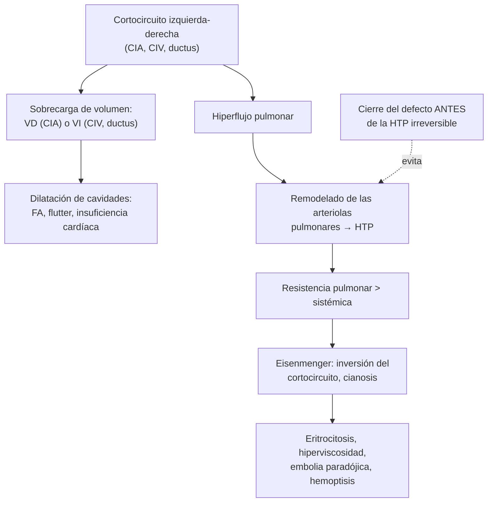
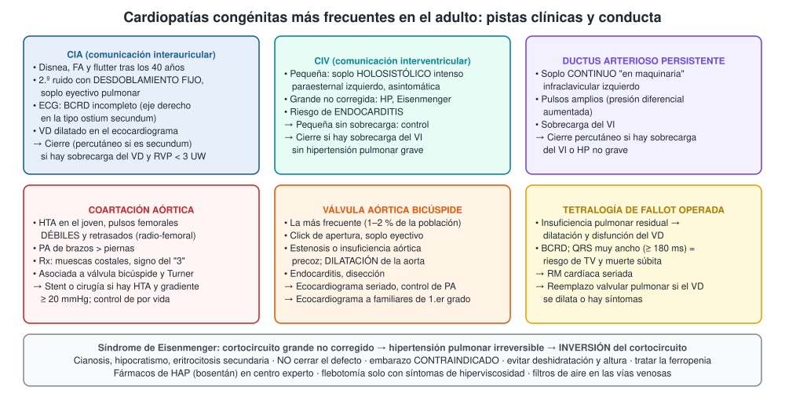
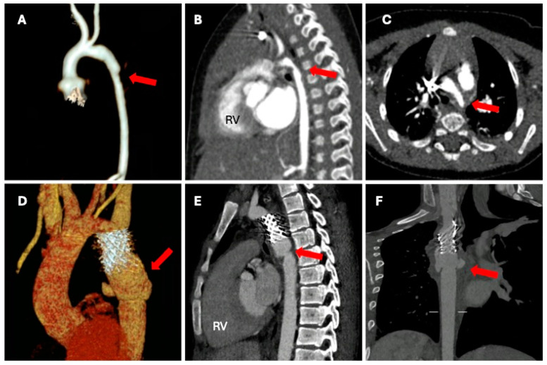

---
tags:
  - Cardiología
---

# Cardiopatías congénitas en el adulto

**Subespecialidad**
Cardiología · Cardiopatías congénitas del adulto · Cardiología intervencional · Cirugía cardíaca

**Guías principales**
ESC 2020: manejo de las cardiopatías congénitas del adulto · AHA/ACC 2018: adultos con cardiopatías congénitas · Posición europea sobre el foramen oval permeable (2019)

**Otras fuentes**
Comparación de las guías AHA/ACC y ESC (*J Am Coll Cardiol* 2021) · SCAI 2022: manejo del foramen oval permeable · Posición de la Sociedad Interamericana de Cardiología sobre unidades de cardiopatías congénitas del adulto en Latinoamérica (2023) · Metaanálisis de prevalencia al nacer (van der Linde 2011)

**GES**
Sí en la infancia: **cardiopatías congénitas operables en menores de 15 años** (problema de salud n.º 2). En el adulto no hay garantía específica.

**EUNACOM**
1.01.1.003 Cardiopatía congénita en adulto (sospecha, inicial, derivar)

**Revisado**
Octubre 2026

!!! abstract "Resumen en 60 segundos"
    - Las cardiopatías congénitas afectan a ~ **9 de cada 1.000 nacidos vivos**. Hoy **más del 90 %** de los niños operados llega a la adultez: hay **más adultos que niños** con cardiopatía congénita.
    - **Dos escenarios en el adulto**:
        - **No diagnosticadas**: **CIA**, **válvula aórtica bicúspide**, **coartación**, CIV pequeña, ductus, foramen oval permeable.
        - **Operadas en la infancia**: tetralogía de Fallot, transposición, Fontan, con **lesiones residuales** y secuelas.
    - **Pistas**: **desdoblamiento fijo del 2.º ruido** (CIA), soplo **holosistólico** intenso (CIV), soplo **continuo** (ductus), **HTA en el joven con pulsos femorales débiles** (coartación), click y soplo eyectivo (bicúspide).
    - **Examen clave**: **ecocardiograma**; RM y TC para la anatomía.
    - **Regla general**: se **cierra el defecto** si hay **sobrecarga de volumen** y **sin hipertensión pulmonar grave**. Casi siempre por **vía percutánea**.
    - **Eisenmenger**: el cortocircuito se invierte por hipertensión pulmonar irreversible. Hay **cianosis** y eritrocitosis. **No se cierra** el defecto y el **embarazo está contraindicado**.
    - Riesgos de por vida: **arritmias**, **insuficiencia cardíaca**, **endocarditis**, hipertensión pulmonar y **embarazo de alto riesgo**. Deben seguirse en **unidades especializadas**.

## Definición

- **Cardiopatía congénita**: anomalía estructural del corazón o de los grandes vasos presente al nacer, con repercusión funcional real o potencial.
- **Cardiopatía congénita del adulto**: incluye a los pacientes con cardiopatía **no diagnosticada** hasta la adultez y a los **operados o tratados** en la infancia, que mantienen lesiones residuales y secuelas.
- **Cortocircuito (shunt)**: paso de sangre entre las circulaciones sistémica y pulmonar.
    - **Izquierda-derecha** (CIA, CIV, ductus): aumenta el flujo pulmonar; **sin cianosis**.
    - **Derecha-izquierda**: sangre desaturada a la circulación sistémica → **cianosis**.
- **Qp/Qs**: relación entre el flujo pulmonar y el sistémico. Un **Qp/Qs ≥ 1,5** indica un cortocircuito significativo.
- **Síndrome de Eisenmenger**: cortocircuito grande no corregido que produjo **hipertensión arterial pulmonar irreversible**, con **inversión** del cortocircuito (derecha-izquierda) y cianosis.
- **Foramen oval permeable (FOP)**: falta de fusión del septum primum y secundum después del nacimiento; comunicación potencial entre las aurículas.

## Epidemiología

### Mundial

- **Prevalencia al nacer**: ~ **9,1 por 1.000** nacidos vivos (metaanálisis de van der Linde 2011), con un aumento en las últimas décadas por el mejor diagnóstico.
- Gracias a la cirugía y al cateterismo, **> 90 %** de los niños con cardiopatía congénita llega a adulto. Hoy hay más adultos que niños con estas enfermedades.
- **Válvula aórtica bicúspide**: la cardiopatía congénita más frecuente (~ **1–2 %** de la población).
- **Foramen oval permeable**: presente en ~ **1 de cada 4** adultos; casi siempre sin consecuencias.
- **CIA tipo ostium secundum**: la cardiopatía congénita más frecuente **diagnosticada en el adulto**; más frecuente en **mujeres**.

### Chile

!!! chile "Datos nacionales"
    - **GES n.º 2: cardiopatías congénitas operables en menores de 15 años**: garantiza diagnóstico y cirugía en la infancia (excluye el trasplante). Gracias a esto, una cohorte creciente de **operados** llega a la adultez.
    - **Latinoamérica** (posición de la Sociedad Interamericana de Cardiología, 2023):
        - Se estiman **1,8 millones** de adultos con cardiopatía congénita en Sudamérica, con un crecimiento de **5–6 % al año**.
        - La prevalencia se extrapola a ~ **3.000 por millón** de habitantes.
        - Hay **pocos especialistas y unidades** dedicadas; se recomienda **una unidad por cada 4–6 millones** de habitantes.
    - El **paso de la cardiología infantil a la del adulto** es crítico: muchos pacientes **abandonan los controles** al cumplir 15 años y reaparecen con complicaciones (arritmias, insuficiencia cardíaca, embarazo de riesgo).

## Etiología y factores de riesgo

| Grupo | Ejemplos |
|---|---|
| **Genéticos** | **Síndrome de Down** (canal AV, CIV), **síndrome de Turner** (coartación, bicúspide), **deleción 22q11** (tronco arterioso, Fallot), **Marfan** (aorta), **Williams** (estenosis aórtica supravalvular), **Holt-Oram** (CIA) |
| **Maternos** | **Diabetes pregestacional**, obesidad, fenilcetonuria, lupus (bloqueo AV congénito) |
| **Infecciones** | **Rubéola** congénita (ductus, estenosis pulmonar) |
| **Fármacos y tóxicos** | **Alcohol**, **ácido valproico**, **isotretinoína**, litio (anomalía de Ebstein), warfarina, IECA |
| **Herencia** | Riesgo de cardiopatía en los hijos **mayor que en la población general**; varía según la lesión y es mayor si la madre es la afectada |

**Clasificación por complejidad (ESC 2020)**:

| Complejidad | Ejemplos |
|---|---|
| **Leve** | Válvula aórtica bicúspide aislada, estenosis pulmonar leve, CIA o CIV pequeña, ductus cerrado, CIA/CIV/ductus corregidos sin secuelas |
| **Moderada** | Coartación aórtica, CIA tipo seno venoso, canal AV, Ebstein, tetralogía de Fallot corregida, drenaje venoso pulmonar anómalo |
| **Grave** | **Eisenmenger**, cardiopatías **cianóticas** no corregidas o paliadas, **ventrículo único y Fontan**, transposición de grandes arterias, tronco arterioso |

## Fisiopatología

- **Cortocircuitos izquierda-derecha**:
    - **CIA**: el flujo pasa en diástole de la aurícula izquierda a la derecha → **sobrecarga de volumen del VD** y aumento del flujo pulmonar. El VD dilatado causa **FA, flutter**, insuficiencia tricuspídea y, a la larga, hipertensión pulmonar.
    - **CIV y ductus**: el flujo extra vuelve a la aurícula y al ventrículo **izquierdos** → **sobrecarga de volumen del VI**. Si son grandes, transmiten **presión** a la circulación pulmonar.
- **Hipertensión pulmonar y Eisenmenger**: el hiperflujo y la presión elevada **remodelan** las arteriolas pulmonares. Cuando la resistencia pulmonar supera a la sistémica, el cortocircuito **se invierte** → cianosis, eritrocitosis secundaria, hiperviscosidad y riesgo de **embolia paradójica**.
- **Coartación**: estrechez de la aorta descendente (cerca del ligamento arterioso) → **HTA proximal** (brazos) e hipoperfusión distal (piernas), **colaterales** intercostales (muescas costales) y sobrecarga de presión del VI.
- **Válvula bicúspide**: flujo turbulento → **calcificación precoz** (estenosis) o insuficiencia, y **aortopatía** propia (dilatación de la aorta ascendente por fragilidad de la pared).
- **Tetralogía de Fallot operada**: la reparación suele dejar **insuficiencia pulmonar** → dilatación progresiva y disfunción del VD, arritmias ventriculares.
- **Foramen oval permeable**: con un aumento de la presión de la aurícula derecha (Valsalva, tos), un trombo venoso puede pasar a la circulación sistémica (**embolia paradójica**, ACV).

*Figura 1. Historia natural de los cortocircuitos izquierda-derecha. Esquema propio basado en la guía ESC 2020.*

## Clasificación

<figure markdown>
{ loading=lazy }
<figcaption>Figura 2. Cardiopatías congénitas más frecuentes en el adulto: pistas clínicas y conducta. Esquema propio basado en las guías ESC 2020 y AHA/ACC 2018.</figcaption>
</figure>

**Tipos de CIA**:

| Tipo | Frecuencia | Características |
|---|---|---|
| **Ostium secundum** | ~ **80 %** | Centro del septum; **cierre percutáneo** si la anatomía lo permite |
| **Ostium primum** (canal AV parcial) | ~ 15 % | Parte baja del septum; **hendidura mitral**; eje **izquierdo** en el ECG; síndrome de Down; cirugía |
| **Seno venoso** | ~ 5–10 % | Cerca de la vena cava; **drenaje venoso pulmonar anómalo** asociado; cirugía (o stent cubierto en casos seleccionados) |
| **Seno coronario** | < 1 % | Rara |

## Clínica

- **Asintomáticos** durante años, con un soplo o un ECG anormal como único hallazgo.
- **Síntomas en el adulto**: disnea de esfuerzo, **palpitaciones** (FA, flutter), intolerancia al ejercicio, **cianosis**, síncope, ACV (embolia paradójica).
- **Por lesión**:
    - **CIA**: disnea y **arritmias auriculares** después de los 30–40 años. **Desdoblamiento amplio y fijo del 2.º ruido**, soplo sistólico eyectivo pulmonar (por hiperflujo, no por el defecto) y rodada tricuspídea si el cortocircuito es grande.
    - **CIV**: la pequeña (restrictiva) da un **soplo holosistólico rudo** e intenso en el borde paraesternal izquierdo bajo, con frémito; "**mucho ruido, poca enfermedad**".
    - **Ductus**: **soplo continuo "en maquinaria"** infraclavicular izquierdo, pulsos amplios.
    - **Coartación**:
        - **HTA en un joven**, cefalea, epistaxis, claudicación de piernas.
        - **Pulsos femorales débiles y retrasados** respecto de los radiales.
        - **Presión de los brazos mayor que la de las piernas**.
        - Soplo interescapular.
    - **Válvula bicúspide**: **click de eyección** y soplo eyectivo aórtico; estenosis o insuficiencia aórtica a edades más jóvenes que la degenerativa.
    - **Fallot operado**: soplo diastólico de insuficiencia pulmonar, palpitaciones, síncope (TV).
    - **Eisenmenger**: **cianosis central**, **hipocratismo**, 2.º ruido pulmonar intenso, disnea, **hemoptisis**, síntomas de hiperviscosidad (cefalea, alteraciones visuales), **gota**, abscesos cerebrales.
- **Embarazo**: las cardiopatías congénitas son la principal causa de cardiopatía en la embarazada en los países desarrollados. Requieren **evaluación previa a la concepción**.

## Diagnóstico

- **Anamnesis**: cirugías o cateterismos de la infancia (pedir los informes), síntomas, arritmias, embarazos.
- **Examen físico**: soplos, segundo ruido, **pulsos en las 4 extremidades**, **presión arterial en brazos y piernas**, saturación, cianosis, hipocratismo.
- **ECG**:
    - **CIA secundum**: **BCRD incompleto** con **eje derecho**. **CIA primum**: BCRD con **eje izquierdo** y PR largo.
    - **Fallot operado**: **BCRD** (medir el QRS).
    - **Coartación y estenosis aórtica**: HVI.
    - **Eisenmenger**: hipertrofia del VD.
- **Radiografía de tórax**:
    - **Hiperflujo pulmonar** y crecimiento de cavidades derechas (CIA).
    - **Coartación**: **muescas costales** (escotaduras en el borde inferior de las costillas por las colaterales) y **signo del "3"** en el botón aórtico.
- **Ecocardiograma transtorácico**: examen central. Define la anatomía, el tamaño de las cavidades (sobrecarga), las válvulas, la presión pulmonar estimada y la dirección del flujo.
    - **Ecocardiograma con burbujas** (suero agitado): detecta cortocircuitos (FOP, CIA).
    - **Ecocardiograma transesofágico**: anatomía de los bordes de la CIA antes del cierre percutáneo, seno venoso, FOP.
- **RM cardíaca**: volúmenes y función del VD (Fallot), Qp/Qs, aorta, drenaje venoso pulmonar.
- **Angio-TC**: coartación, aorta, coronarias anómalas.
- **Cateterismo**: mide la **resistencia vascular pulmonar** (define si el defecto se puede cerrar) y permite el tratamiento percutáneo.
- **Test cardiopulmonar de esfuerzo**: capacidad funcional objetiva.

!!! guia "Indicaciones de cierre de los cortocircuitos (ESC 2020)"
    - **CIA**: cierre si hay **sobrecarga de volumen del VD** y **resistencia vascular pulmonar < 3 UW**, **con o sin síntomas**. Preferir el **cierre percutáneo** en la CIA secundum con anatomía adecuada. **No cerrar** si la resistencia es **≥ 5 UW** (Eisenmenger) salvo situaciones especiales en un centro experto.
    - **CIV**: cierre si hay **sobrecarga de volumen del VI** sin hipertensión pulmonar grave. La CIV pequeña sin sobrecarga **no se cierra** (solo control).
    - **Ductus**: cierre (percutáneo) si hay sobrecarga del VI y resistencia pulmonar < 3 UW.
    - **Coartación**: reparación (de preferencia **stent** en el adulto) si hay un gradiente **> 20 mmHg** entre brazos y piernas con **HTA**, respuesta hipertensiva al ejercicio o HVI.

## Laboratorio

| Examen | Interpretación |
|---|---|
| **Hemograma** | **Eritrocitosis secundaria** en los cianóticos (hematocrito alto) |
| **Ferritina, saturación de transferrina** | **Ferropenia** frecuente en los cianóticos (empeora la hiperviscosidad y la capacidad física): tratarla |
| **Saturación de oxígeno** | En reposo y con ejercicio; baja en los cortocircuitos derecha-izquierda |
| **NT-proBNP** | Disfunción ventricular, seguimiento |
| **Función renal, ácido úrico** | Nefropatía y **gota** en los cianóticos |
| **Pruebas de coagulación, plaquetas** | Alteradas en los cianóticos (riesgo de sangrado y trombosis) |
| **Función tiroidea y hepática** | Amiodarona; hepatopatía en el **Fontan** |
| **Cariotipo o estudio genético** | Turner (mujer con coartación), deleción 22q11, sospecha sindrómica |

## Imágenes

- **Ecocardiograma** (transtorácico, transesofágico, con burbujas): diagnóstico y seguimiento.
- **RM cardíaca**: estándar para cuantificar el **VD** (Fallot operado, CIA) y medir el Qp/Qs y la aorta.
- **Angio-TC**: coartación, aorta, coronarias, stents.
- **Radiografía de tórax**: muescas costales, hiperflujo o "poda" pulmonar en el Eisenmenger, cardiomegalia.

<figure markdown>
{ loading=lazy }
<figcaption>Figura 3. Coartación aórtica en la angio-TC (flechas rojas). (A–C) Lactante de 4 meses: resultado posquirúrgico en la reconstrucción volumétrica (A) y coartación grave antes de la cirugía en cortes sagital (B) y axial (C). (D–F) Joven de 17 años con coartación tratada con stent y un seudoaneurisma posoperatorio: reconstrucción volumétrica (D) y reconstrucciones multiplanares (E, F). RV: ventrículo derecho. Tomada de Leo I, Sabatino J, Avesani M, et al. <em>Non-invasive imaging assessment in patients with aortic coarctation: a contemporary review.</em> J Clin Med. 2023;13(1):28 (figura 4). Licencia CC BY 4.0.</figcaption>
</figure>

## Diagnóstico diferencial

| Diagnóstico | Diferencias |
|---|---|
| **Soplo inocente** | Eyectivo suave, varía con la posición, sin otros hallazgos; ecocardiograma normal |
| **Hipertensión arterial esencial** (vs coartación) | Pulsos femorales normales y simultáneos, PA similar en brazos y piernas |
| **Estenosis aórtica degenerativa** (vs bicúspide) | Adulto mayor, válvula tricúspide calcificada |
| **Insuficiencia mitral o estenosis mitral reumática** | Soplos característicos; antecedente de fiebre reumática |
| **Hipertensión pulmonar de otras causas** | Sin cortocircuito en el ecocardiograma con burbujas |
| **EPOC o enfermedad pulmonar con hipoxemia** (vs cianosis cardíaca) | La saturación mejora con oxígeno; espirometría alterada |
| **Policitemia vera** (vs eritrocitosis secundaria) | Saturación normal, esplenomegalia, leucocitosis y trombocitosis, mutación JAK2 |

## Tratamiento

### Principios generales

- **Derivar** a una **unidad de cardiopatías congénitas del adulto** (o a cardiología con experiencia): todo paciente operado en la infancia o con una cardiopatía moderada o grave debe tener un **seguimiento de por vida**.
- **Indicaciones de cierre**: ver el recuadro de la ESC 2020. La mayoría de las **CIA secundum**, los **ductus** y muchas CIV se cierran por **vía percutánea**.
- **Arritmias**: anticoagular la FA y el flutter según el riesgo (en las cardiopatías moderadas o graves, en general **siempre**); ablación en centros con experiencia.
- **Insuficiencia cardíaca**: tratamiento estándar adaptado a la anatomía (el VD sistémico y el Fontan responden de forma distinta).
- **Profilaxis de endocarditis** antes de procedimientos dentales de riesgo en: cardiopatías **cianóticas** no corregidas, reparaciones con **material protésico** (los primeros **6 meses** o de por vida si hay cortocircuito residual) y prótesis valvulares. Ver [Endocarditis infecciosa](../infectologia/endocarditis-infecciosa.md).
- **Higiene dental** y vacunas (influenza, neumococo, COVID-19).
- **Actividad física**: recomendada y adaptada a la lesión.
- **Embarazo**: **consejería previa a la concepción** y clasificación del riesgo materno (OMS modificada). **Contraindicado** en el **Eisenmenger** y en la hipertensión arterial pulmonar. Anticoncepción segura.

### Por lesión

| Lesión | Tratamiento |
|---|---|
| **CIA secundum** | **Cierre percutáneo** con dispositivo si hay sobrecarga del VD y resistencia pulmonar < 3 UW; cirugía si la anatomía no lo permite |
| **CIA primum, seno venoso** | Cirugía (o stent cubierto en el seno venoso en casos seleccionados) |
| **CIV** | Pequeña sin sobrecarga: **control** y profilaxis de endocarditis según el caso; con sobrecarga del VI: **cierre** quirúrgico o percutáneo |
| **Ductus** | **Cierre percutáneo** si hay sobrecarga del VI |
| **Coartación** | **Stent** (de elección en el adulto) o cirugía; **control de la PA de por vida** (la HTA puede persistir); imagen de la aorta periódica |
| **Válvula bicúspide** | Ecocardiograma seriado, **control de la PA**; reemplazo valvular según la estenosis o la insuficiencia; cirugía de la aorta si se dilata mucho; **ecocardiograma a los familiares de primer grado** |
| **Fallot operado** | RM seriada; **reemplazo de la válvula pulmonar** (quirúrgico o percutáneo) si el VD se dilata, disminuye su función o hay síntomas; evaluación del riesgo de TV |
| **Foramen oval permeable** | Sin tratamiento si es un hallazgo. **Cierre percutáneo** en pacientes de **18–60/65 años** con **ACV isquémico criptogénico** en que el FOP es la causa probable (posición europea 2019; SCAI 2022) |

### Síndrome de Eisenmenger

!!! alarma "Eisenmenger: lo que hay que hacer y lo que no"
    - **No cerrar** el defecto: el cortocircuito actúa como "válvula de escape" del VD.
    - **Embarazo contraindicado** (mortalidad materna muy alta). Anticoncepción eficaz; evitar los estrógenos (trombosis).
    - **Evitar** la deshidratación, la altura, el ejercicio intenso, el calor excesivo y los vasodilatadores sistémicos.
    - **Filtros de aire** en todas las vías venosas (embolia paradójica).
    - **Flebotomía** solo si hay síntomas de hiperviscosidad con hematocrito > 65 % y sin deshidratación; **no** de rutina.
    - **Tratar la ferropenia** (aunque el hematocrito esté alto).
    - **Fármacos de HAP** (bosentán, inhibidores de PDE5) en un centro experto.
    - Cirugía no cardíaca y anestesia en centros con experiencia.
    - Trasplante cardiopulmonar en casos seleccionados.

## Complicaciones

- **Arritmias**: FA y flutter (CIA, cirugías auriculares), **TV** y **muerte súbita** (Fallot, VD sistémico), bloqueo AV (CIV corregida).
- **Insuficiencia cardíaca** (VD sistémico, Fallot, Fontan).
- **Hipertensión pulmonar** y **Eisenmenger**.
- **Endocarditis infecciosa** (CIV, ductus, válvula bicúspide, cianóticos).
- **Embolia paradójica** y **ACV** (FOP, CIA, Eisenmenger), **absceso cerebral** en los cianóticos.
- **Disección o aneurisma aórtico** (bicúspide, coartación, Turner, Marfan).
- **HTA persistente** y enfermedad coronaria precoz tras la reparación de la coartación; **aneurismas cerebrales** asociados a la coartación.
- **Complicaciones del embarazo**: insuficiencia cardíaca, arritmias, muerte materna; cardiopatía congénita en el hijo.
- **Hepatopatía y enteropatía perdedora de proteínas** en el **Fontan**.

## Pronóstico y seguimiento

- **Lesiones simples corregidas a tiempo** (CIA, ductus, CIV): expectativa de vida casi normal. El cierre de la CIA **después de los 40 años** mejora los síntomas, pero no elimina las arritmias.
- **Coartación reparada**: buena supervivencia, pero con más HTA, enfermedad coronaria y aneurismas a largo plazo.
- **Eisenmenger**: sobrevida hasta la 3.ª–5.ª década; peor con insuficiencia cardíaca, síncope o embarazo.
- **Cardiopatías complejas** (Fontan, VD sistémico): seguimiento estrecho en centros especializados.
- **Frecuencia del seguimiento** (ESC 2020): desde controles espaciados (cada algunos años) en las lesiones leves corregidas sin secuelas hasta controles cada **6–12 meses** en las complejas.

## Perlas para el internado

!!! perla "Para recordar en la sala"
    - **HTA en un joven**: palpe los **pulsos femorales** y mida la **PA en las piernas** (coartación).
    - **Desdoblamiento fijo del 2.º ruido + BCRD incompleto** = **CIA**; pida un ecocardiograma.
    - **FA en una mujer de 40 años sin cardiopatía conocida**: busque una **CIA** en el ecocardiograma.
    - **Soplo holosistólico muy intenso en un joven sano**: probable **CIV pequeña**; benigna pero con riesgo de endocarditis.
    - **Soplo continuo en maquinaria** = ductus.
    - **ACV en un joven sin causa clara**: ecocardiograma con **burbujas** (FOP).
    - Paciente con **Eisenmenger**: **no** lo deshidrate, use **filtros de aire** en las vías, no haga flebotomías de rutina y trate la ferropenia.
    - Toda mujer con cardiopatía congénita en edad fértil necesita **consejería antes del embarazo**.
    - El paciente operado en la infancia **no está curado**: necesita control de por vida.

## Preguntas de repaso

??? repaso "1. Mujer de 42 años consulta por palpitaciones y disnea de esfuerzo. Tiene FA de reciente comienzo. Al examen hay un desdoblamiento amplio y fijo del 2.º ruido y un soplo eyectivo suave en el foco pulmonar. ¿Qué sospecha y cómo la estudia?"
    - **Comunicación interauricular**, probablemente **ostium secundum**, que debuta con **FA** en la cuarta década.
    - **ECG** (BCRD incompleto, eje derecho), **ecocardiograma** (VD dilatado, defecto septal, presión pulmonar), **ecocardiograma transesofágico** (bordes del defecto) y eventualmente RM (Qp/Qs).
    - Manejo de la FA (control de la frecuencia y **anticoagulación**).
    - **Cierre percutáneo** si hay sobrecarga del VD y resistencia pulmonar < 3 UW.

??? repaso "2. Hombre de 22 años con PA de 168/96 mmHg en el brazo derecho en un examen preocupacional. Refiere cefalea y frío en los pies. Los pulsos femorales son débiles y retrasados respecto de los radiales. ¿Qué diagnóstico sospecha y qué examen pide?"
    - **Coartación aórtica** (HTA secundaria en el joven, pulsos femorales débiles y retrasados).
    - **PA en los brazos y en las piernas** (gradiente), **ecocardiograma** (buscar también **válvula bicúspide**) y **angio-TC o RM** de la aorta.
    - Radiografía: muescas costales, signo del "3".
    - **Reparación** (stent de preferencia) si el gradiente es **> 20 mmHg** con HTA; control de la PA de por vida.

??? repaso "3. Hombre de 35 años con una CIV no corregida conocida desde la infancia. Hoy tiene cianosis, hipocratismo, saturación de 82 % y hematocrito de 62 %. El ecocardiograma muestra flujo derecha-izquierda por la CIV con presión pulmonar sistémica. ¿Qué diagnóstico tiene y qué NO debe hacer?"
    - **Síndrome de Eisenmenger** (hipertensión pulmonar irreversible con inversión del cortocircuito).
    - **No cerrar** la CIV.
    - **No** hacer flebotomías de rutina (solo si hay síntomas de hiperviscosidad con hematocrito > 65 %), **no** deshidratarlo, **no** exponerlo a la altura.
    - **Filtros de aire** en las vías venosas, tratar la ferropenia, fármacos de HAP en un centro experto.
    - Si es mujer: **embarazo contraindicado**.

??? repaso "4. Hombre de 45 años con una válvula aórtica bicúspide conocida y estenosis leve. El ecocardiograma muestra la aorta ascendente de 45 mm. ¿Qué seguimiento y qué medidas indica?"
    - **Aortopatía asociada a la válvula bicúspide**: riesgo de dilatación progresiva y disección.
    - **Control estricto de la PA**, evitar el ejercicio isométrico intenso.
    - **Imagen seriada** de la aorta (ecocardiograma, angio-TC o RM) y de la válvula.
    - **Cirugía de la aorta** si alcanza el umbral de la guía o crece rápido, o si se opera la válvula.
    - **Ecocardiograma a los familiares de primer grado**.

??? repaso "5. Mujer de 26 años con tetralogía de Fallot operada a los 2 años, perdida de control desde los 15. Consulta por palpitaciones y disnea. El ECG muestra BCRD con QRS de 185 ms. ¿Qué le preocupa y qué hace?"
    - **Insuficiencia pulmonar residual** con **dilatación y disfunción del VD** y **riesgo de TV y muerte súbita** (QRS ≥ 180 ms).
    - **Derivar** a una unidad de cardiopatías congénitas del adulto: **RM cardíaca**, Holter, test de esfuerzo.
    - Probable **reemplazo de la válvula pulmonar**; evaluar el riesgo arrítmico (estudio electrofisiológico, DAI).
    - Consejería anticonceptiva y sobre el embarazo.

??? repaso "6. Hombre de 38 años con un ACV isquémico sin factores de riesgo; los estudios (angio-TC, Holter, ecocardiograma transtorácico) son normales. ¿Qué examen pide y qué opción de tratamiento hay?"
    - Sospecha de **embolia paradójica** por un **foramen oval permeable**.
    - **Ecocardiograma con burbujas** (transtorácico o transesofágico) con Valsalva; buscar trombosis venosa y trombofilias según el caso.
    - Si el FOP es la causa probable (ACV criptogénico, < 60–65 años, FOP de alto riesgo): **cierre percutáneo** + antiagregación (posición europea 2019).

## Referencias

1. Baumgartner H, De Backer J, Babu-Narayan SV, et al. 2020 ESC Guidelines for the management of adult congenital heart disease. *Eur Heart J.* 2021;42(6):563–645. doi:[10.1093/eurheartj/ehaa554](https://doi.org/10.1093/eurheartj/ehaa554)
2. Stout KK, Daniels CJ, Aboulhosn JA, et al. 2018 AHA/ACC guideline for the management of adults with congenital heart disease. *Circulation.* 2019;139(14):e698–e800. doi:[10.1161/CIR.0000000000000603](https://doi.org/10.1161/CIR.0000000000000603)
3. Egidy Assenza G, Krieger EV, Baumgartner H, et al. AHA/ACC vs ESC guidelines for management of adults with congenital heart disease: JACC guideline comparison. *J Am Coll Cardiol.* 2021;78(19):1904–1918. doi:[10.1016/j.jacc.2021.09.010](https://doi.org/10.1016/j.jacc.2021.09.010)
4. Pristipino C, Sievert H, D'Ascenzo F, et al. European position paper on the management of patients with patent foramen ovale. General approach and left circulation thromboembolism. *Eur Heart J.* 2019;40(38):3182–3195. doi:[10.1093/eurheartj/ehy649](https://doi.org/10.1093/eurheartj/ehy649)
5. Kavinsky CJ, Szerlip M, Goldsweig AM, et al. SCAI guidelines for the management of patent foramen ovale. *J Soc Cardiovasc Angiogr Interv.* 2022;1(4):100039. doi:[10.1016/j.jscai.2022.100039](https://doi.org/10.1016/j.jscai.2022.100039)
6. van der Linde D, Konings EE, Slager MA, et al. Birth prevalence of congenital heart disease worldwide: a systematic review and meta-analysis. *J Am Coll Cardiol.* 2011;58(21):2241–2247. doi:[10.1016/j.jacc.2011.08.025](https://doi.org/10.1016/j.jacc.2011.08.025)
7. Araujo JJ, Rodríguez-Monserrate CP, Elizari A, et al. Position statement for the development of adult congenital heart disease units in Latin America and the Caribbean. *Int J Cardiol Congenit Heart Dis.* 2023;13:100461. doi:[10.1016/j.ijcchd.2023.100461](https://doi.org/10.1016/j.ijcchd.2023.100461)
8. Leo I, Sabatino J, Avesani M, et al. Non-invasive imaging assessment in patients with aortic coarctation: a contemporary review. *J Clin Med.* 2023;13(1):28. doi:[10.3390/jcm13010028](https://doi.org/10.3390/jcm13010028)
9. Superintendencia de Salud. Problema de salud 2: cardiopatías congénitas operables en menores de 15 años. [superdesalud.gob.cl](https://www.superdesalud.gob.cl/orientacion-en-salud/cardiopatias-congenitas-operables/)
