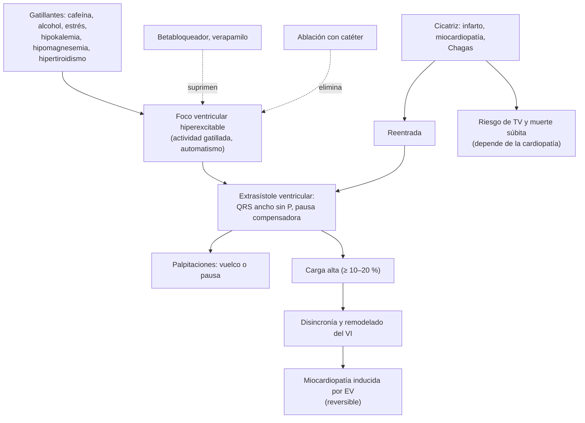
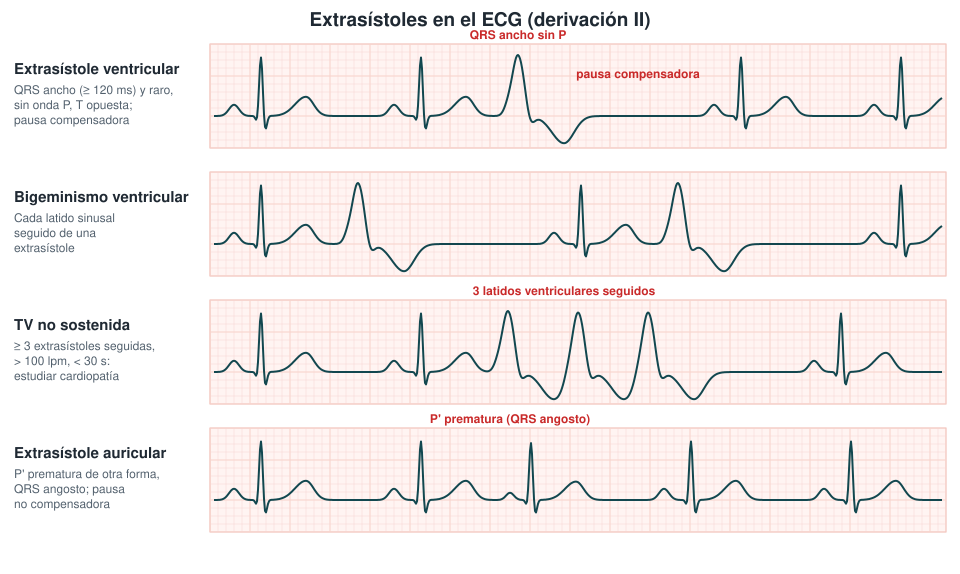
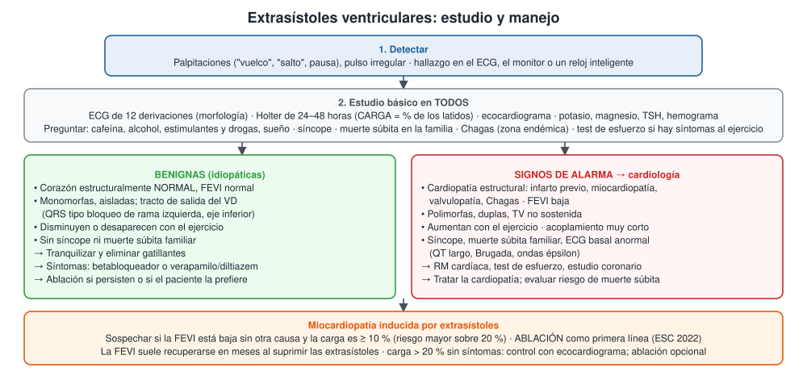

---
tags:
  - Cardiología
---

# Extrasistolía ventricular y supraventricular

**Subespecialidad**
Cardiología · Electrofisiología · Atención primaria

**Guías principales**
ESC 2022: arritmias ventriculares y prevención de la muerte súbita · AHA/ACC/HRS 2017: arritmias ventriculares · Consenso HRS/EHRA/APHRS/LAHRS 2019: ablación de arritmias ventriculares

**Otras fuentes**
Ensayo CRAVE (café y extrasístoles, *N Engl J Med* 2023) · Declaración AHA sobre cafeína y enfermedad cardiovascular (2026) · Revisión sistemática de ablación frente a antiarrítmicos (*JACC Clin Electrophysiol* 2023) · Primera serie chilena de ablación de extrasístoles (*Rev Med Chil* 2001)

**GES**
No.

**EUNACOM**
1.01.1.011 Extrasistolía ventricular benigna (específico, inicial, completo)

**Revisado**
Octubre 2026

!!! abstract "Resumen en 60 segundos"
    - **Extrasístole ventricular (EV)**: latido prematuro que nace en el ventrículo. **QRS ancho (≥ 120 ms) y raro, sin onda P**, con T opuesta y **pausa compensadora**.
    - Es **muy frecuente**: la mayoría de los adultos sanos tiene alguna en un Holter de 24 horas. Se siente como "vuelco", "salto" o "pausa".
    - **Estudio en todos**: **ECG de 12 derivaciones**, **Holter de 24–48 horas** (la **carga** es el % de latidos que son extrasístoles), **ecocardiograma**, potasio, magnesio y TSH.
    - **Benigna (idiopática)**: corazón **normal**, **monomorfa**, típicamente del **tracto de salida del VD** (QRS tipo bloqueo de rama izquierda con eje inferior), que **desaparece con el ejercicio**.
    - **Tratamiento de la benigna**:
        - **Tranquilizar** y reducir gatillantes (café, alcohol, estimulantes, falta de sueño).
        - Si hay síntomas: **betabloqueador** o **verapamilo/diltiazem**.
        - **Ablación con catéter**: primera línea en las del tracto de salida del VD sintomáticas (ESC 2022).
    - **Alarma**: cardiopatía estructural, **FEVI baja**, polimorfas, **TV no sostenida**, aumentan con el ejercicio, **síncope** o **muerte súbita familiar** → cardiología.
    - **Carga ≥ 10 % con FEVI baja** → pensar en **miocardiopatía inducida por extrasístoles**: es **reversible** con la ablación.

## Definición

- **Extrasístole**: latido **prematuro** (antes de lo esperado por el ritmo de base) originado en un foco distinto del nódulo sinusal.
- **Extrasístole ventricular (EV)**: nace en el ventrículo. El impulso no usa el sistema de conducción normal, por eso el **QRS es ancho** y de morfología anormal.
- **Extrasístole supraventricular o auricular (EA)**: nace en las aurículas (o en la unión AV). Tiene una **onda P' prematura** de forma distinta y un **QRS angosto** (salvo conducción aberrante).
- **Carga de extrasístoles**: porcentaje de latidos de 24 horas que son extrasístoles en el Holter. Con ~ 100.000 latidos al día, una carga de **10 %** equivale a ~ **10.000 EV en 24 horas**.
- **Extrasistolía ventricular benigna (idiopática)**: EV en un **corazón estructuralmente normal**, sin canalopatía ni otros signos de alarma.
- **Patrones**:
    - **Bigeminismo**: cada latido normal seguido de una EV. **Trigeminismo**: una EV cada dos latidos normales.
    - **Dupla** (par): 2 EV seguidas.
    - **TV no sostenida**: **≥ 3 EV seguidas** a > 100 lpm que duran **< 30 segundos**.
    - **Monomorfas** (una sola forma) o **polimorfas** (varias formas).
- **Miocardiopatía inducida por extrasístoles**: disfunción del VI causada por EV frecuentes, que **mejora** al suprimirlas.

## Epidemiología

### Mundial

- Las EV son **muy frecuentes**: aparecen en una minoría de los ECG de reposo, pero en la **mayoría de los Holter de 24 horas** de personas sanas.
- Aumentan con la **edad**, la **hipertensión**, la cardiopatía estructural, la hipokalemia y la hipomagnesemia.
- **Café** (ensayo CRAVE, 2023; 100 adultos con monitoreo continuo, días con y sin café asignados al azar):
    - Los días con café hubo **154 EV diarias** frente a **102** sin café (**51 % más**).
    - Las **extrasístoles auriculares no aumentaron** (58 frente a 53).
- **Declaración AHA 2026**: el café **no aumenta** la fibrilación auricular (incluso la reduce en los consumidores habituales), pero **sí aumenta la frecuencia de EV**.
- **Riesgo**: en personas con corazón sano, las EV aisladas tienen buen pronóstico. Las **muy frecuentes** se asocian a más insuficiencia cardíaca y mortalidad en la población general.

### Chile

!!! chile "Datos nacionales"
    - No hay registros nacionales de extrasistolía; es un motivo de consulta frecuente en la **APS** y en cardiología.
    - **Primera serie chilena de ablación** de EV sintomáticas con corazón normal (Seguel 2001; 4 pacientes de 12–46 años, refractarios a fármacos):
        - **3 de 4** nacían en el **tracto de salida del VD** (bloqueo de rama izquierda con eje inferior).
        - Se eliminaron en todos, sin complicaciones; a los **18 meses**, solo un paciente tenía una posible recurrencia.
        - Hoy la ablación se hace en varios centros del país.
    - **Enfermedad de Chagas**: endémica en el norte y centro-norte (Arica a O'Higgins). La **miocardiopatía chagásica** causa EV, TV y bloqueos (bloqueo de rama derecha + hemibloqueo anterior izquierdo). En pacientes de zonas endémicas o de países vecinos, pedir **serología para Chagas**.
    - La extrasistolía benigna **no es GES**. Sí lo son los **trastornos de conducción que requieren marcapaso** en personas de 15 años y más.

## Etiología y factores de riesgo

| Grupo | Causas |
|---|---|
| **Idiopáticas** (corazón normal) | **Tracto de salida del VD** (la más frecuente), tracto de salida del VI y cúspides aórticas, fascículos del ventrículo izquierdo, músculos papilares, anillos mitral y tricuspídeo |
| **Estimulantes** | **Cafeína** (café, bebidas energéticas), **alcohol**, tabaco, **cocaína** y anfetaminas, descongestionantes (pseudoefedrina), salbutamol, falta de sueño, estrés |
| **Alteraciones metabólicas** | **Hipokalemia**, **hipomagnesemia**, hipercalcemia, **hipertiroidismo**, hipoxemia, acidosis |
| **Fármacos** | **Digoxina** (toxicidad: bigeminismo), antiarrítmicos (proarritmia), fármacos que **alargan el QT** |
| **Cardiopatía isquémica** | Infarto agudo o antiguo (cicatriz), isquemia |
| **Miocardiopatías** | Dilatada, hipertrófica, **arritmogénica del VD**, **Chagas**, sarcoidosis, miocarditis |
| **Otras cardiopatías** | **Insuficiencia cardíaca**, valvulopatías (**prolapso mitral**), hipertensión con HVI |
| **Canalopatías** | QT largo, Brugada, taquicardia ventricular polimórfica catecolaminérgica |

## Fisiopatología

- **Mecanismos** de las EV:
    1. **Automatismo anormal** o aumentado: un grupo de células ventriculares despolariza antes que el nódulo sinusal (catecolaminas, isquemia, hipokalemia).
    2. **Actividad gatillada**: pospotenciales tardíos por sobrecarga de **calcio** intracelular. Es el mecanismo de las EV del **tracto de salida** (sensibles a las catecolaminas y al AMPc; por eso responden a betabloqueadores y verapamilo) y de la toxicidad digitálica.
    3. **Reentrada**: alrededor de una **cicatriz** (infarto, miocardiopatía); típica de la cardiopatía estructural.
- **ECG**: el impulso viaja de miocito a miocito → **QRS ancho**. La repolarización también es anormal → **T opuesta** al QRS.
- **Pausa compensadora**: la EV no despolariza el nódulo sinusal, que sigue su ritmo; el siguiente latido sinusal llega a tiempo. La EA sí reinicia el nódulo sinusal → **pausa no compensadora**.
- **Síntomas**: el latido prematuro tiene **poco volumen** (llenado incompleto). Lo que se siente es el **latido siguiente**, más fuerte tras la pausa ("vuelco") o la pausa misma.
- **Miocardiopatía inducida por EV**: las EV frecuentes producen **disincronía** del VI, mal llenado, alteración del manejo del calcio y remodelado. Es **reversible** si se suprimen.

*Figura 1. Mecanismos de la extrasistolía ventricular y sus consecuencias. Esquema propio basado en la guía ESC 2022.*

## Clasificación

**Según el corazón de base** (lo que define el pronóstico):

| Tipo | Características | Pronóstico |
|---|---|---|
| **Idiopática (benigna)** | Corazón y ECG basal normales; monomorfa; tracto de salida o fascicular | Bueno; el riesgo es la miocardiopatía si la carga es alta |
| **Con cardiopatía estructural** | Infarto previo, miocardiopatía, valvulopatía, Chagas, FEVI baja | Depende de la cardiopatía; marcador de riesgo |
| **Con canalopatía** | QT largo, Brugada, catecolaminérgica | Riesgo de muerte súbita |

**Origen según la morfología del QRS** (ECG de 12 derivaciones):

| Morfología de la EV | Origen probable | Comentario |
|---|---|---|
| **Bloqueo de rama izquierda + eje inferior** (QRS positivo en DII, DIII y aVF) | **Tracto de salida del VD** | **La más frecuente** de las idiopáticas; benigna; ablación de primera línea si da síntomas |
| Bloqueo de rama izquierda o derecha con eje inferior y transición precoz en V1–V2 | Tracto de salida del VI, cúspides aórticas | Idiopática |
| **Bloqueo de rama derecha + eje superior**, QRS relativamente angosto | **Fascículo posterior izquierdo** | Idiopática ("fascicular"); responde a **verapamilo** |
| Bloqueo de rama izquierda con eje superior, QRS muy ancho, polimorfa | VD (miocardiopatía arritmogénica) u otro sitio | **No típica de idiopática**: estudiar con RM |

**Extrasístoles supraventriculares**: aisladas, en bigeminismo, en salvas (taquicardia auricular no sostenida). Son benignas, pero las muy frecuentes se asocian a más riesgo de **fibrilación auricular** y ACV.

## Clínica

- **Asintomáticas**: muy a menudo se descubren en un ECG, un monitor o un **reloj inteligente**.
- **Palpitaciones**:
    - "**Vuelco**" en el pecho, "**salto**", "golpe" o sensación de que el corazón "**se detiene**" un momento.
    - Más notorias **en reposo**, al acostarse sobre el lado izquierdo o de noche (frecuencia sinusal más baja).
    - Las idiopáticas típicamente **disminuyen con el ejercicio**.
- **Otros**: tos seca, molestia cervical (ondas "a" cañón por contracción auricular contra la válvula tricúspide cerrada), ansiedad.
- **Examen físico**:
    - **Pulso irregular** con latidos "perdidos" (la EV puede no generar pulso palpable: **déficit de pulso**).
    - Ondas a "cañón" en el pulso venoso yugular.
    - Buscar **cardiopatía**: soplos, signos de insuficiencia cardíaca, hipertensión.
- **Signos de alarma** en la anamnesis:
    - **Síncope** o presíncope (sobre todo con el ejercicio).
    - **Disnea**, edema o baja de la capacidad física (miocardiopatía).
    - **Dolor torácico**.
    - **Muerte súbita** en familiares jóvenes (< 40–50 años).
    - Palpitaciones **sostenidas** (taquicardia).

## Diagnóstico

!!! guia "Estudio de las extrasístoles ventriculares (ESC 2022)"
    - **ECG de 12 derivaciones**: confirma que son EV, define la **morfología** (origen) y busca alteraciones del ritmo de base (infarto antiguo, HVI, QT largo, Brugada, ondas épsilon).
    - **Holter de 24–48 horas**: **carga** de EV (%), número de morfologías, duplas y TV no sostenida, relación con la frecuencia cardíaca y los síntomas.
    - **Ecocardiograma** en todos: descarta cardiopatía estructural y mide la **FEVI**.
    - **Test de esfuerzo**: si los síntomas aparecen con el ejercicio o hay sospecha de cardiopatía coronaria. Las idiopáticas **disminuyen** con el esfuerzo; las que **aumentan** o generan TV sugieren cardiopatía o canalopatía.
    - **RM cardíaca** (IIa): si la EV **no tiene una morfología típica de idiopática**, si hay sospecha de cardiopatía estructural o de **miocardiopatía inducida por EV**.
    - **Sospechar miocardiopatía inducida por EV** (IIa) en todo paciente con **FEVI reducida sin otra causa** y una carga de **≥ 10 %**.

- **Diagnóstico de extrasistolía ventricular benigna**: EV **monomorfas**, de origen **típico** (tracto de salida o fascicular), con **ECG basal normal**, **ecocardiograma normal**, sin síncope ni antecedentes familiares de muerte súbita, que disminuyen con el ejercicio.

<figure markdown>
{ loading=lazy }
<figcaption>Figura 2. Extrasístoles en el ECG (esquema). Extrasístole ventricular: QRS ancho y raro, sin onda P, con pausa compensadora. Bigeminismo ventricular. TV no sostenida (3 o más extrasístoles seguidas). Extrasístole auricular: P' prematura, QRS angosto y pausa no compensadora. Esquema propio.</figcaption>
</figure>

## Laboratorio

| Examen | Interpretación |
|---|---|
| **Potasio y magnesio** | **Hipokalemia e hipomagnesemia** aumentan las EV; corregirlas (K ≥ 4, Mg ≥ 2 mg/dL en cardiópatas) |
| **TSH** | **Hipertiroidismo** |
| **Hemograma** | Anemia (taquicardia, palpitaciones) |
| **Calcio, función renal** | Alteraciones electrolíticas, uso de diuréticos |
| **Niveles de digoxina** | Si la usa: bigeminismo por toxicidad |
| **Troponina** | Solo si hay dolor torácico o sospecha de isquemia aguda |
| **NT-proBNP** | Si hay sospecha de insuficiencia cardíaca |
| **Serología para Chagas** | Pacientes de zonas endémicas (norte y centro-norte de Chile, países vecinos) |
| **Drogas en orina** | Sospecha de cocaína o anfetaminas |

## Imágenes

- **Ecocardiograma transtorácico**: examen central para clasificar al paciente (corazón normal o cardiopatía). Mide la FEVI y busca valvulopatías, HVI, alteraciones segmentarias y prolapso mitral.
- **RM cardíaca**: detecta **cicatriz** (realce tardío) que el ecocardiograma no ve (miocarditis, sarcoidosis, miocardiopatía arritmogénica, Chagas). Indicada en las EV de morfología atípica y en la sospecha de miocardiopatía.
- **Estudio coronario** (angio-TC o coronariografía): si hay sospecha de cardiopatía isquémica.
- **Radiografía de tórax**: cardiomegalia en la miocardiopatía; no es necesaria en la EV benigna típica.

<figure markdown>
{ loading=lazy }
<figcaption>Figura 3. Estudio y manejo de las extrasístoles ventriculares. Esquema propio basado en la guía ESC 2022 y la guía AHA/ACC/HRS 2017.</figcaption>
</figure>

## Diagnóstico diferencial

| Diagnóstico | Diferencias |
|---|---|
| **Extrasístole auricular con conducción aberrante** | P' prematura antes del QRS ancho; pausa no compensadora |
| **Fibrilación auricular** | Ritmo **irregularmente irregular** sin ondas P; no hay latidos normales intercalados regulares |
| **Bloqueo AV de segundo grado** | La "pausa" es una P no conducida, sin latido prematuro |
| **Arritmia sinusal respiratoria** | Variación del RR con la respiración; P normales en todos los latidos |
| **Taquicardia supraventricular paroxística** | Palpitaciones **sostenidas** de inicio y fin bruscos |
| **Ritmo idioventricular acelerado** | Latidos ventriculares a 50–110 lpm, no prematuros (reperfusión del infarto) |
| **Artefacto del monitor** | Sin pausa ni alteración del ritmo de base; el pulso es regular |
| **Ansiedad o crisis de pánico** | Taquicardia sinusal; el Holter correlaciona los síntomas con ritmo sinusal |

## Tratamiento

### Extrasistolía ventricular benigna (idiopática)

- **Explicar y tranquilizar**: en un corazón normal, las EV **no aumentan el riesgo de muerte**. Muchos pacientes no necesitan fármacos.
- **Reducir gatillantes**:
    - **Cafeína** (café, bebidas energéticas; el ensayo CRAVE mostró 51 % más EV con café), **alcohol**, tabaco, drogas, descongestionantes.
    - **Dormir bien**, manejar el estrés, actividad física regular.
- **Corregir** la hipokalemia, la hipomagnesemia y el hipertiroidismo.
- **Si los síntomas son molestos** (o hay carga alta):

!!! dosis "Tratamiento farmacológico de las EV sintomáticas"
    | Fármaco | Dosis habitual | Comentarios |
    |---|---|---|
    | **Bisoprolol** | 2,5–10 mg/día | Primera línea; precaución en asma, bradicardia, bloqueo AV |
    | **Metoprolol** | 25–100 mg cada 12 horas (tartrato) | Igual |
    | **Propranolol** | 10–40 mg cada 8 horas | Útil si hay ansiedad o temblor |
    | **Verapamilo** | 80–120 mg cada 8 horas (o liberación prolongada 240 mg/día) | **Alternativa** al betabloqueador; de elección en las **fasciculares**. **Contraindicado con FEVI baja** |
    | **Diltiazem** | 60–90 mg cada 8 horas (o 120–240 mg/día de liberación prolongada) | Igual que el verapamilo |
    | **Flecainida** | 50–100 mg cada 12 horas (especialista) | Solo con **corazón estructuralmente normal** (contraindicada en cardiopatía isquémica o FEVI baja) |

    - Los antiarrítmicos son eficaces en una minoría y tienen efectos adversos frecuentes; la **amiodarona** no se usa en la EV benigna por su toxicidad.

- **Ablación con catéter** (ESC 2022):
    - **Primera línea (clase I)** en las EV **sintomáticas** del **tracto de salida del VD** o de los **fascículos izquierdos**.
    - **Clase IIa** en las sintomáticas de otros orígenes con FEVI normal, si fallan o no se desean los fármacos.
    - **Clase IIb** en pacientes **asintomáticos** con carga **> 20 %** (la carga varía en el tiempo y no se ha demostrado beneficio pronóstico).
    - Éxito alto en el tracto de salida del VD y complicaciones poco frecuentes. En la revisión sistemática de 2023, la ablación fue **superior a los antiarrítmicos** en recurrencia y carga, con menos efectos adversos.
- **Seguimiento**: si la carga es **> 10 %** y el paciente está asintomático, **ecocardiograma periódico** (por ejemplo, anual) para detectar caída de la FEVI.

### Miocardiopatía inducida por extrasístoles

- **Ablación con catéter como primera línea** (clase I, ESC 2022), cualquiera sea el origen de las EV.
- **Tratamiento de la insuficiencia cardíaca** según las guías mientras tanto (betabloqueador, IECA/ARA-II/ARNI, antagonista de mineralocorticoides, iSGLT2).
- Si no se puede ablacionar: **amiodarona** (especialista) para bajar la carga.
- La **FEVI suele normalizarse** en meses tras suprimir las EV: confirma el diagnóstico.

### EV con cardiopatía estructural

- **Derivar a cardiología**.
- **Tratar la cardiopatía**: revascularización, tratamiento óptimo de la insuficiencia cardíaca (el **betabloqueador** reduce EV y muerte súbita).
- **No usar** antiarrítmicos de clase I (flecainida, propafenona) después de un infarto: **aumentan la mortalidad** (ensayo CAST).
- Evaluar el **riesgo de muerte súbita** y la indicación de **desfibrilador implantable** según la FEVI y la cardiopatía (no según el número de EV).

### Extrasístoles supraventriculares

- Tranquilizar y reducir gatillantes. **Betabloqueador** si dan síntomas.
- Si son muy frecuentes: controlar la **presión arterial** y vigilar la aparición de **fibrilación auricular**.

!!! alarma "Derivar a cardiología (o a urgencia si corresponde)"
    - **Síncope**, presíncope o palpitaciones con el **ejercicio**.
    - **Cardiopatía estructural** o **FEVI baja**.
    - **TV no sostenida**, EV **polimorfas**, duplas frecuentes o EV que **aumentan con el esfuerzo**.
    - **ECG basal anormal**: QT largo, patrón de Brugada, ondas épsilon, ondas Q, HVI.
    - **Muerte súbita** en familiares jóvenes.
    - Carga **≥ 10 %** o síntomas que no ceden con las medidas iniciales.
    - **Urgencia**: TV sostenida, EV en el contexto de un **SCA**, hipokalemia grave, intoxicación digitálica.

## Complicaciones

- **Miocardiopatía inducida por EV**: la principal complicación de la EV benigna frecuente; reversible.
- **Ansiedad** y deterioro de la calidad de vida.
- **TV o FV** desencadenada por una EV con **acoplamiento muy corto** ("R sobre T"), sobre todo en cardiopatía isquémica aguda, QT largo o canalopatías.
- **Efectos adversos de los antiarrítmicos**: bradicardia, bloqueo AV, **proarritmia** (flecainida), hipotensión.
- **Complicaciones de la ablación** (poco frecuentes): hematoma inguinal, taponamiento, bloqueo AV.

## Pronóstico y seguimiento

- **EV benigna en corazón normal**: **excelente pronóstico**. Muchas disminuyen o desaparecen con el tiempo.
- **Riesgo de miocardiopatía** mayor con:
    - **Carga ≥ 10 %**, sobre todo **> 20 %**.
    - QRS de la EV muy ancho, EV interpoladas, origen epicárdico, mayor tiempo de evolución.
- **EV con cardiopatía**: el pronóstico depende de la cardiopatía de base y de la FEVI.
- **Seguimiento**:
    - **Benigna con carga baja y sin síntomas**: alta; control solo si cambian los síntomas.
    - **Carga > 10 %**: **ecocardiograma y Holter** cada 6–12 meses (o antes si hay síntomas).
    - **Tras la ablación**: Holter y ecocardiograma a los 3–6 meses.

## Perlas para el internado

!!! perla "Para recordar en la sala"
    - **Vuelco en el pecho + corazón normal + EV monomorfas que desaparecen con el ejercicio** = extrasistolía benigna: **tranquilizar** es parte del tratamiento.
    - Pida siempre **ECG de 12 derivaciones, Holter y ecocardiograma**: el pronóstico lo da el **corazón**, no el número de EV.
    - **BRI + eje inferior** = tracto de salida del VD, la EV idiopática más frecuente; la **ablación** es de primera línea si da síntomas.
    - **FEVI baja + carga ≥ 10 %**: piense en **miocardiopatía inducida por EV**, que se **revierte** con la ablación.
    - Revise el **potasio y el magnesio** en el paciente hospitalizado con EV, sobre todo si usa diuréticos o digoxina.
    - **Bigeminismo en un paciente con digoxina**: piense en **toxicidad digitálica**.
    - **No** indique flecainida ni propafenona a un paciente con infarto previo o FEVI baja.
    - Verapamilo y diltiazem: **no** en la insuficiencia cardíaca con FEVI reducida.
    - Paciente del **norte de Chile** con EV, bloqueo de rama derecha y hemibloqueo anterior izquierdo: **serología para Chagas**.

## Preguntas de repaso

??? repaso "1. Mujer de 32 años consulta por sensación de \"vuelco\" en el pecho de predominio nocturno, desde hace 3 meses. Toma 4 tazas de café al día y duerme poco. El examen es normal y el ECG muestra EV aisladas con QRS tipo bloqueo de rama izquierda y eje inferior. ¿Qué estudio pide y cuál es su conducta inicial?"
    - Probable **extrasistolía ventricular idiopática del tracto de salida del VD** (BRI + eje inferior).
    - Estudio: **Holter de 24–48 horas** (carga), **ecocardiograma**, **potasio, magnesio y TSH**; test de esfuerzo si hay síntomas al ejercicio.
    - Conducta: **explicar que es benigna**, reducir la **cafeína** (CRAVE: más EV con café), dormir bien, evitar el alcohol y los estimulantes.
    - Si persisten los síntomas: **betabloqueador** (bisoprolol) o verapamilo; **ablación** como primera línea si sigue sintomática.

??? repaso "2. Hombre de 45 años, asintomático, con un Holter que muestra 28.000 EV monomorfas en 24 horas (carga 27 %). Su ecocardiograma muestra una FEVI de 38 % sin otra causa. ¿Qué diagnóstico sospecha y cuál es el tratamiento?"
    - **Miocardiopatía inducida por extrasístoles** (FEVI baja sin otra causa con carga ≥ 10 %).
    - **RM cardíaca** para descartar cicatriz (miocarditis, sarcoidosis, otra miocardiopatía).
    - **Ablación con catéter** como primera línea (clase I, ESC 2022), además del tratamiento de la insuficiencia cardíaca.
    - Control con ecocardiograma: la **FEVI suele recuperarse** en meses si se suprimen las EV.

??? repaso "3. Hombre de 68 años con infarto anterior hace 2 años y FEVI de 30 %. En el Holter tiene EV polimorfas y episodios de TV no sostenida. ¿Corresponde a una extrasistolía benigna? ¿Qué hace?"
    - **No**: EV en una **cardiopatía estructural** (cicatriz de infarto) con FEVI baja y TV no sostenida → **riesgo de muerte súbita**.
    - **Derivar a cardiología** (electrofisiología).
    - **Optimizar** el tratamiento de la insuficiencia cardíaca (betabloqueador, ARNI, antagonista de mineralocorticoides, iSGLT2) y descartar isquemia.
    - Evaluar **desfibrilador implantable**.
    - **No** usar flecainida ni propafenona (aumentan la mortalidad post-infarto).

??? repaso "4. Paciente de 78 años con insuficiencia cardíaca, en tratamiento con furosemida y digoxina, presenta bigeminismo ventricular en el monitor. ¿Qué causas busca y qué hace?"
    - Buscar **hipokalemia e hipomagnesemia** (diurético) y **toxicidad por digoxina** (náuseas, alteraciones visuales, bradicardia; nivel plasmático, función renal).
    - **Corregir** el potasio (≥ 4 mEq/L) y el magnesio.
    - **Suspender la digoxina** si hay toxicidad; anticuerpos antidigoxina si hay arritmias graves.
    - Revisar la isquemia y la descompensación de la insuficiencia cardíaca.

??? repaso "5. Joven de 19 años, deportista, consulta por palpitaciones y un episodio de síncope durante un partido. En el test de esfuerzo las EV aumentan con el ejercicio y aparecen duplas polimorfas. Un tío murió súbitamente a los 30 años. ¿Qué hace?"
    - **Signos de alarma**: síncope con el ejercicio, EV que **aumentan con el esfuerzo**, **polimorfas** y **muerte súbita familiar**.
    - Sospechar canalopatía (taquicardia ventricular polimórfica catecolaminérgica, QT largo) o miocardiopatía (hipertrófica, arritmogénica).
    - **Suspender el deporte** hasta completar el estudio y **derivar con urgencia a cardiología**: ECG, ecocardiograma, **RM cardíaca**, Holter, estudio genético.

??? repaso "6. Mujer de 55 años, hipertensa, con palpitaciones. El Holter muestra 2.000 extrasístoles auriculares en 24 horas, sin fibrilación auricular. El ecocardiograma muestra HVI leve. ¿Cuál es su conducta?"
    - **Extrasístoles supraventriculares** frecuentes, en general benignas.
    - Reducir gatillantes (alcohol, cafeína según la tolerancia), **controlar la presión arterial**.
    - **Betabloqueador** si los síntomas son molestos (sirve además para la hipertensión).
    - Son un marcador de mayor riesgo de **fibrilación auricular**: control del ritmo y de la presión en los controles; Holter si aparecen palpitaciones sostenidas.

## Referencias

1. Zeppenfeld K, Tfelt-Hansen J, de Riva M, et al. 2022 ESC Guidelines for the management of patients with ventricular arrhythmias and the prevention of sudden cardiac death. *Eur Heart J.* 2022;43(40):3997–4126. doi:[10.1093/eurheartj/ehac262](https://doi.org/10.1093/eurheartj/ehac262)
2. Könemann H, Dagres N, Merino JL, et al. Spotlight on the 2022 ESC guideline management of ventricular arrhythmias and prevention of sudden cardiac death: 10 novel key aspects. *Europace.* 2023;25(5):euad091. doi:[10.1093/europace/euad091](https://doi.org/10.1093/europace/euad091)
3. Al-Khatib SM, Stevenson WG, Ackerman MJ, et al. 2017 AHA/ACC/HRS guideline for management of patients with ventricular arrhythmias and the prevention of sudden cardiac death. *J Am Coll Cardiol.* 2018;72(14):e91–e220. doi:[10.1016/j.jacc.2017.10.054](https://doi.org/10.1016/j.jacc.2017.10.054)
4. Marcus GM, Rosenthal DG, Nah G, et al. Acute effects of coffee consumption on health among ambulatory adults. *N Engl J Med.* 2023;388(12):1092–1100. doi:[10.1056/NEJMoa2204737](https://doi.org/10.1056/NEJMoa2204737)
5. Marcus GM, Hu FB, van Dam RM, et al. Caffeine and cardiovascular disease: a scientific statement from the American Heart Association. *Circulation.* 2026;154(9):e345–e355. doi:[10.1161/CIR.0000000000001454](https://doi.org/10.1161/CIR.0000000000001454)
6. De Silva K, Haqqani H, Mahajan R, et al. Catheter ablation vs antiarrhythmic drug therapy for treatment of premature ventricular complexes: a systematic review. *JACC Clin Electrophysiol.* 2023;9(6):873–885. doi:[10.1016/j.jacep.2023.01.035](https://doi.org/10.1016/j.jacep.2023.01.035)
7. Limpitikul WB, Dewland TA, Vittinghoff E, et al. Premature ventricular complexes and development of heart failure in a community-based population. *Heart.* 2022;108(2):105–110. doi:[10.1136/heartjnl-2021-319473](https://doi.org/10.1136/heartjnl-2021-319473)
8. Seguel M, Schumacher E, González R. Ablación por radiofrecuencia de extrasistolía ventricular aislada sintomática en corazón sano. *Rev Med Chil.* 2001;129(1):60–66. [PubMed](https://pubmed.ncbi.nlm.nih.gov/11265206/)
