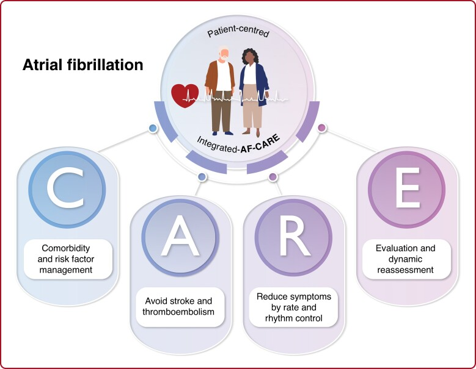
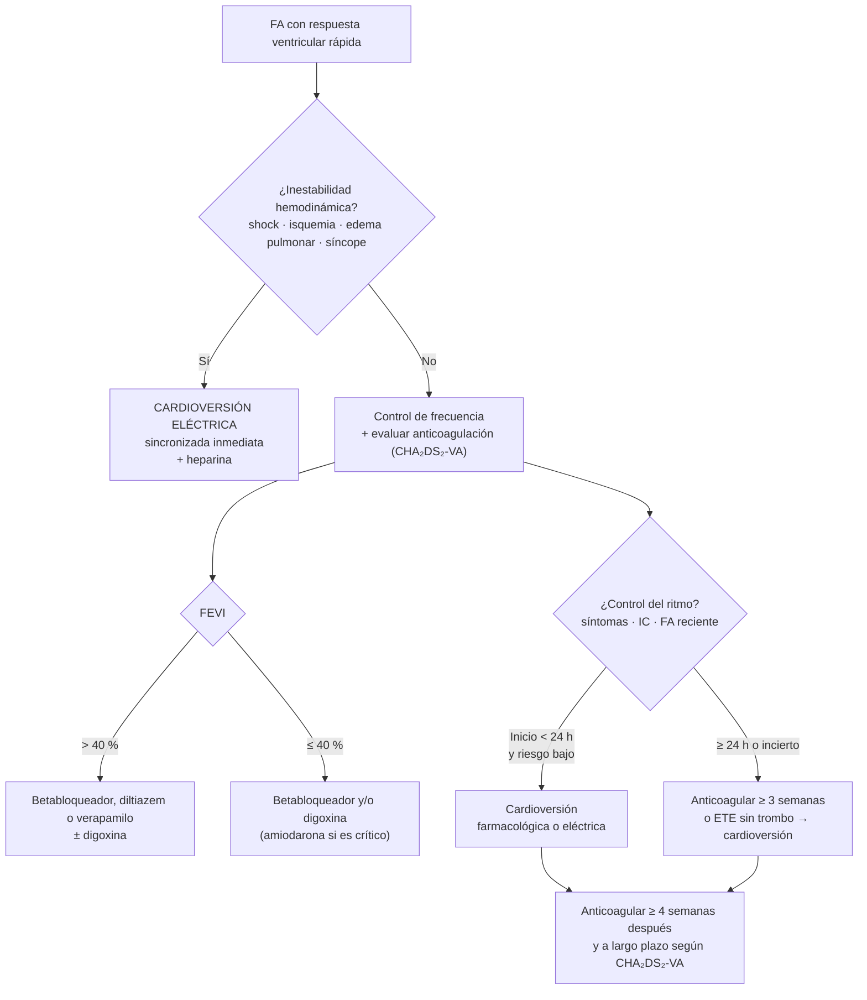

---
tags:
  - Cardiología
  - Frecuente en sala
  - Urgencia
---

# Fibrilación y flutter auricular

**Subespecialidad**
Cardiología

**Guía principal**
ESC/EACTS 2024 (fibrilación auricular)

**Otras fuentes**
ACC/AHA/ACCP/HRS 2023 · EHRA 2021 (uso de anticoagulantes orales directos) · Estudios EAST-AFNET 4, CASTLE-AF, RACE II

**EUNACOM**
1.01.1.012 FA crónica · 1.01.1.013 FA paroxística · 1.01.1.014 Flutter auricular · 1.01.2.003 Embolia cardiogénica

**Revisado**
Septiembre 2026

!!! abstract "Resumen en 60 segundos"
    - **FA**: la arritmia sostenida más frecuente. ECG con **RR irregularmente irregular** y **sin ondas P**.
    - Multiplica por **5 el riesgo de ACV**: la decisión más importante es la **anticoagulación**.
    - **ESC 2024**: marco **AF-CARE** (comorbilidades, evitar el ACV, reducir síntomas, reevaluar) y nuevo score **CHA₂DS₂-VA** (sin el sexo femenino): anticoagular con **≥ 2 puntos**, considerar con 1.
    - Preferir los **anticoagulantes orales directos** (apixabán, rivaroxabán, dabigatrán, edoxabán) sobre los antagonistas de vitamina K, excepto en **válvula mecánica** o **estenosis mitral moderada-grave**.
    - **Control de frecuencia** (betabloqueador, diltiazem o verapamilo, digoxina) para casi todos; **control del ritmo** precoz si hay síntomas o IC. La **ablación** es de primera línea en la FA paroxística sintomática.
    - **Inestabilidad hemodinámica** → **cardioversión eléctrica** inmediata.
    - **Flutter**: ondas F en "dientes de sierra", conducción 2:1 (~ 150 lpm). Se anticoagula igual que la FA y responde muy bien a la **ablación del istmo cavotricuspídeo**.

## Definición

**Fibrilación auricular (FA)**: taquiarritmia supraventricular con **activación auricular desorganizada** y pérdida de la contracción auricular efectiva. Diagnóstico: registro de ECG (12 derivaciones o una derivación) con:

- **Intervalos RR irregularmente irregulares** (si la conducción AV está intacta).
- **Ausencia de ondas P** definidas (reemplazadas por ondas "f" fibrilatorias de 350–600/min).
- Duración de **≥ 30 segundos** en un registro de una derivación, o un ECG de 12 derivaciones completo.

**Flutter auricular típico**: **macrorreentrada** en la aurícula derecha alrededor del anillo tricuspídeo, que pasa por el **istmo cavotricuspídeo**. Produce ondas **F** regulares a **~ 250–350/min**, con conducción AV habitualmente **2:1** (FC ~ 150 lpm).

<figure markdown>
{ loading=lazy }
<figcaption>Figura 1. Ritmo sinusal, fibrilación auricular y flutter auricular 2:1. Esquema propio.</figcaption>
</figure>

## Epidemiología

### Mundial

- Cerca de **60 millones** de personas tienen FA o flutter (GBD 2019), y la cifra aumenta con el envejecimiento poblacional.
- Prevalencia de **2–4 % en adultos**; sube a **> 10 % en ≥ 80 años**.
- **Riesgo de por vida**: ~ **1 de cada 3–5** personas mayores de 55 años.
- **Multiplica por 5 el riesgo de ACV** y explica **~ 20–30 % de los ACV isquémicos**; los ACV por FA son más graves.
- Aumenta el riesgo de **IC**, **demencia** y **mortalidad** (1,5–2 veces).
- Hasta **1/3 de los pacientes son asintomáticos**: el ACV puede ser la primera manifestación.

### Chile

!!! chile "Datos nacionales"
    - No hay una encuesta nacional de prevalencia de FA; se estima similar a la de otros países con población que envejece (~ 1–2 % de la población general).
    - La **FA es la principal causa de ACV cardioembólico**. El **ACV isquémico** es un problema de salud **GES** (≥ 15 años), pero la FA en sí no lo es.
    - En el sistema público chileno se usa con frecuencia **acenocumarol** como antagonista de vitamina K (control con INR en policlínicos de TACO). El acceso a los anticoagulantes directos ha aumentado, pero su cobertura sigue siendo limitada.
    - Factores de riesgo prevalentes: HTA 27,6 %, obesidad 31 %, consumo de alcohol de riesgo, SAHOS subdiagnosticado.

## Etiología y factores de riesgo

| Tipo | Factores |
|---|---|
| **Cardiovasculares** | **HTA** (el más frecuente), **IC**, **valvulopatías** (sobre todo mitral), cardiopatía coronaria, miocardiopatías, cardiopatías congénitas |
| **Metabólicos y estilo de vida** | **Edad**, **obesidad**, **diabetes**, **alcohol** ("corazón de fin de semana"), tabaco, sedentarismo y también deportes de resistencia extremos |
| **Otros** | **SAHOS**, **ERC**, **EPOC**, **hipertiroidismo**, genética |
| **Gatillantes agudos** (FA secundaria) | **Cirugía** (sobre todo cardíaca y torácica), **sepsis**, **neumonía**, **TEP**, **pericarditis**, **alcohol**, hipokalemia, hipomagnesemia, estimulantes (cocaína, anfetaminas), teofilina |

## Fisiopatología

- **Gatillantes**: focos ectópicos, principalmente en las **venas pulmonares** (por eso la ablación las aísla).
- **Sustrato**: **remodelado auricular** (dilatación, **fibrosis**, alteraciones eléctricas) por HTA, obesidad, envejecimiento, IC y la propia FA: "**la FA engendra FA**". Explica la progresión de paroxística a persistente y permanente.
- **Consecuencias hemodinámicas**: pérdida de la contracción auricular (hasta 20–30 % del gasto cardíaco, más en IC-FEp y estenosis aórtica), **FC rápida e irregular**, **taquicardiomiopatía** si la FC se mantiene alta por semanas.
- **Tromboembolismo**: estasis sanguínea, disfunción endotelial e hipercoagulabilidad (**tríada de Virchow**). En la FA no valvular, **> 90 % de los trombos se forman en la orejuela izquierda**.

## Clasificación

### Según la duración (ESC 2024)

| Tipo | Definición |
|---|---|
| **Diagnosticada por primera vez** | Primer diagnóstico, independiente de su duración o síntomas |
| **Paroxística** | Termina espontáneamente o con intervención en **≤ 7 días** |
| **Persistente** | Dura **> 7 días** (incluye la que se cardiovierte después de 7 días) |
| **Persistente de larga duración** | **> 12 meses** cuando se decide una estrategia de control del ritmo |
| **Permanente** | Paciente y médico **aceptan** la FA y **no se intentará** restaurar el ritmo sinusal |

**Otros conceptos**

- **FA "valvular"**: término que se reserva para la FA con **estenosis mitral moderada-grave** o **válvula mecánica**. En ellos **no** se usan anticoagulantes directos (solo antagonistas de vitamina K).
- **FA subclínica**: episodios detectados por marcapasos, desfibriladores o dispositivos implantables (ESC 2024: considerar anticoagulación en pacientes de alto riesgo sin riesgo alto de sangrado).
- **FA secundaria**: gatillada por una causa aguda reversible (sepsis, cirugía); **recurre con frecuencia** y no debe considerarse "resuelta".

### Síntomas (escala EHRA modificada)

| Clase | Síntomas |
|---|---|
| **1** | Ninguno |
| **2a** | Leves: no afectan la actividad diaria |
| **2b** | Moderados: no afectan la actividad diaria, pero molestan al paciente |
| **3** | Graves: afectan la actividad diaria |
| **4** | Incapacitantes |

## Clínica

- **Palpitaciones** (irregulares), disnea, fatiga, intolerancia al ejercicio, mareos, dolor torácico, poliuria (por péptido natriurético auricular).
- **Síncope**: poco frecuente; sugiere **enfermedad del nódulo sinusal** (síndrome taqui-bradi, pausas al terminar la FA) o FC muy rápida.
- Descompensación de **IC** o **angina**.
- **ACV o embolía sistémica** como primera manifestación (isquemia aguda de extremidad, isquemia mesentérica, infarto renal o esplénico).
- **Examen físico**: **pulso irregularmente irregular**, **déficit de pulso** (FC apical mayor que la radial), primer ruido de intensidad variable, ausencia de onda "a" en el pulso venoso yugular.

!!! perla "Embolía arterial aguda de extremidad: las 6 P"
    **Dolor** (*pain*), **palidez**, **ausencia de pulso**, **parestesias**, **parálisis** y **frialdad** (*poikilothermia*). En un paciente con FA, es una **urgencia vascular**: heparina EV y evaluación inmediata por cirugía vascular.

## Diagnóstico

- **ECG de 12 derivaciones**: confirma la FA o el flutter, mide la FC y busca HVI, preexcitación (WPW), isquemia, QT.
- **Holter de ritmo** o monitores de eventos: FA paroxística, correlación con síntomas, control de la FC.
- **Tamizaje oportunista**: palpar el pulso o hacer un ECG a personas ≥ 65 años en controles de salud.

### Evaluación del riesgo embólico: CHA₂DS₂-VA (ESC 2024)

| Letra | Factor | Puntos |
|---|---|---|
| **C** | Insuficiencia cardíaca (o FEVI reducida) | 1 |
| **H** | Hipertensión arterial | 1 |
| **A₂** | Edad **≥ 75 años** | **2** |
| **D** | Diabetes | 1 |
| **S₂** | **ACV, AIT o embolía** previa | **2** |
| **V** | Enfermedad vascular (IAM, EAP, placa aórtica) | 1 |
| **A** | Edad **65–74 años** | 1 |

!!! guia "Indicación de anticoagulación (ESC 2024)"
    - **CHA₂DS₂-VA ≥ 2**: **anticoagulación oral recomendada**.
    - **CHA₂DS₂-VA = 1**: **considerar** anticoagulación (decisión compartida).
    - **CHA₂DS₂-VA = 0**: no anticoagular.
    - La **miocardiopatía hipertrófica** y la **amiloidosis cardíaca** con FA se anticoagulan **siempre**, sin importar el score.
    - La ESC 2024 retiró el **sexo femenino** del score (antes CHA₂DS₂-**VASc**). La guía estadounidense 2023 mantiene el CHA₂DS₂-VASc con umbrales equivalentes (≥ 2 en hombres, ≥ 3 en mujeres).

**Riesgo de sangrado**: usar **HAS-BLED** u otros scores para **identificar y corregir factores modificables** (HTA no controlada, AINE, antiagregantes innecesarios, alcohol, INR lábil, anemia). Un riesgo de sangrado alto **no es motivo para no anticoagular**.

## Laboratorio

- **TSH** (hipertiroidismo), **electrolitos** (K⁺, Mg²⁺), **creatinina con depuración de creatinina** (dosis de anticoagulantes directos), **hemograma**, **pruebas hepáticas**, glicemia y HbA1c.
- **INR** basal si se usará antagonista de vitamina K; **pruebas de coagulación**.
- **Troponina y BNP** según el contexto (dolor torácico, IC).

## Imágenes

- **Ecocardiograma transtorácico**: a todos. Tamaño de la aurícula izquierda, **FEVI**, **valvulopatías** (estenosis mitral), HVI, miocardiopatías. Define el tratamiento.
- **Ecocardiograma transesofágico**: descartar **trombo en la orejuela** antes de una cardioversión cuando el paciente no ha estado anticoagulado ≥ 3 semanas; evaluar valvulopatías.
- **Radiografía de tórax**: IC, enfermedad pulmonar.
- **TC o RM cerebral** si hay déficit neurológico.

## Diagnóstico diferencial

- **Taquicardia sinusal** con extrasístoles frecuentes (supraventriculares o ventriculares).
- **Taquicardia auricular multifocal** (≥ 3 morfologías de onda P distintas; típica de **EPOC** descompensada).
- **Flutter auricular con conducción variable** (puede parecer irregular).
- **Taquicardia paroxística supraventricular** (regular, QRS estrecho, ~ 150–250 lpm).
- **FA preexcitada** (WPW): QRS **ancho e irregular**, muy rápido.

## Tratamiento

### Marco AF-CARE (ESC 2024)

<figure markdown>
{ loading=lazy width="560" }
<figcaption>Figura 2. Marco AF-CARE de la guía ESC 2024: <strong>C</strong>omorbilidades y factores de riesgo, evitar el ACV (<strong>A</strong>void), <strong>R</strong>educir síntomas (control de frecuencia y ritmo) y <strong>E</strong>valuación dinámica. Fuente: Rienstra M, et al. Spotlight on the 2024 ESC/EACTS management of atrial fibrillation guidelines: 10 novel key aspects. <em>Europace</em>. 2024;26:euae298. doi:<a href="https://doi.org/10.1093/europace/euae298">10.1093/europace/euae298</a>. Licencia <a href="https://creativecommons.org/licenses/by/4.0/">CC BY 4.0</a>. Texto de la figura en inglés.</figcaption>
</figure>

### C: comorbilidades y factores de riesgo

- **Control de la HTA**, **baja de peso** (meta ≥ 10 % en obesos), **abstinencia o reducción del alcohol**, **actividad física**, tratamiento del **SAHOS**, control de la **diabetes** y tratamiento de la **IC** (iSGLT2 en IC).
- Reducen la carga de FA y mejoran el éxito del control del ritmo.

### A: prevención del ACV (anticoagulación)

!!! dosis "Anticoagulantes orales"
    | Fármaco | Dosis habitual | Dosis reducida |
    |---|---|---|
    | **Apixabán** | **5 mg c/12 h** | **2,5 mg c/12 h** si cumple ≥ 2 de: edad ≥ 80 años, peso ≤ 60 kg, creatinina ≥ 1,5 mg/dL |
    | **Rivaroxabán** | **20 mg/día** (con la cena) | **15 mg/día** si depuración de creatinina 15–49 mL/min |
    | **Dabigatrán** | **150 mg c/12 h** | **110 mg c/12 h** si edad ≥ 80 años, uso de verapamilo o alto riesgo de sangrado. **Contraindicado** con depuración < 30 mL/min |
    | **Edoxabán** | **60 mg/día** | **30 mg/día** si depuración 15–50 mL/min, peso ≤ 60 kg o inhibidores de la P-gp |
    | **Acenocumarol / warfarina** | Dosis según **INR 2,0–3,0** | Meta de tiempo en rango terapéutico ≥ 70 % |

    - Usar la **depuración de creatinina (Cockcroft-Gault)** para ajustar los anticoagulantes directos.
    - **Antagonistas de vitamina K obligatorios** en **válvula mecánica** y **estenosis mitral moderada-grave**.
    - **No usar aspirina ni otros antiagregantes** para prevenir el ACV en la FA: no son eficaces.
    - **Cierre percutáneo de la orejuela izquierda**: si hay contraindicación absoluta y permanente a la anticoagulación.

### R: reducir síntomas

*Figura 3. Manejo de la FA con respuesta ventricular rápida. Esquema propio basado en ESC 2024.*

**Control de la frecuencia** (todos los pacientes, sola o combinada con control del ritmo)

- **Meta inicial**: **FC en reposo < 110 lpm** (control "permisivo", estudio RACE II); más estricta si persisten los síntomas.

!!! dosis "Fármacos para controlar la frecuencia"
    | Fármaco | EV (agudo) | Oral (mantención) | Precauciones |
    |---|---|---|---|
    | **Metoprolol** | 2,5–5 mg EV en 2 min, repetir hasta 15 mg | Tartrato 25–100 mg c/12 h o succinato 50–200 mg/día | Broncoespasmo, hipotensión |
    | **Bisoprolol** | — | 1,25–10 mg/día | |
    | **Diltiazem** | 0,25 mg/kg EV en 2 min (~ 15–20 mg), luego infusión 5–15 mg/h | 60 mg c/8 h → 120–360 mg/día | **Evitar si FEVI ≤ 40 %** |
    | **Verapamilo** | 2,5–10 mg EV en 2 min | 40–120 mg c/8 h | **Evitar si FEVI ≤ 40 %** |
    | **Digoxina** | 0,25–0,5 mg EV; repetir 0,25 mg c/6 h hasta 0,75–1,5 mg en 24 h | 0,0625–0,25 mg/día | Útil en **IC** o hipotensión; ajustar por función renal; niveles < 1,2 ng/mL |
    | **Amiodarona** | 300 mg EV en 1 h, luego 900–1200 mg en 24 h | 200 mg/día | Pacientes críticos o con IC grave; puede cardiovertir (anticoagular) |

**Control del ritmo**

- **Indicaciones**: síntomas pese al control de frecuencia, **IC** (sobre todo IC-FEr), FA de diagnóstico reciente (el **control precoz del ritmo**, dentro del primer año, redujo eventos cardiovasculares en el estudio EAST-AFNET 4), pacientes jóvenes, taquicardiomiopatía.
- **Cardioversión**:
    - **Eléctrica sincronizada**: de elección si hay **inestabilidad**; bifásica 120–200 J, con sedación.
    - **Farmacológica**: **flecainida** (200–300 mg VO o 2 mg/kg EV) o **propafenona** (450–600 mg VO) si **no hay cardiopatía estructural** (también como "píldora de bolsillo"); **amiodarona** (5–7 mg/kg EV) si hay **cardiopatía estructural** o IC; vernakalant según disponibilidad.
- **Anticoagulación y cardioversión**:
    - FA de **< 24 horas** en pacientes de bajo riesgo: se puede cardiovertir (ESC 2024 prefiere la estrategia de "esperar y ver" en la FA de inicio reciente, porque muchas revierten solas en 48 horas).
    - FA de **≥ 24 horas o duración desconocida**: **anticoagular ≥ 3 semanas** antes o hacer un **ecocardiograma transesofágico** que descarte trombo.
    - **Después de toda cardioversión**: anticoagular **≥ 4 semanas**, y luego a largo plazo según CHA₂DS₂-VA.
- **Antiarrítmicos a largo plazo**: **flecainida o propafenona** (sin cardiopatía estructural; asociar un bloqueador del nodo AV), **amiodarona** (IC o cardiopatía estructural; toxicidad tiroidea, pulmonar, hepática, cutánea y ocular), **dronedarona** (evitar en IC avanzada), **sotalol** (vigilar el QT).
- **Ablación por catéter** (aislamiento de venas pulmonares): **primera línea** en la **FA paroxística sintomática** (decisión compartida); también en la FA con **IC-FEr** para mejorar sobrevida y hospitalizaciones (estudio CASTLE-AF) y cuando fallan los antiarrítmicos.

### E: evaluación dinámica

Reevaluar periódicamente síntomas, FC, adherencia, **función renal** (dosis de anticoagulantes), **hemoglobina**, eventos de sangrado, comorbilidades y el tipo de FA.

### Flutter auricular: particularidades

- **ECG**: ondas **F** negativas en **II, III y aVF** ("dientes de sierra"), sin línea isoeléctrica; FC ~ **150 lpm** (conducción 2:1). Sospecha flutter ante toda **taquicardia regular a 150 lpm**.
- **Anticoagulación**: mismos criterios que la FA.
- El **control de frecuencia es más difícil** que en la FA.
- **Cardioversión eléctrica** muy eficaz (con menos energía, 50–100 J).
- **Ablación del istmo cavotricuspídeo**: tratamiento de elección en el flutter típico recurrente (éxito > 90 %).
- **Cuidado**: los antiarrítmicos **IC** (flecainida, propafenona) pueden enlentecer el flutter y permitir una **conducción 1:1** con FC muy alta: siempre asociarlos a un bloqueador del nodo AV.

## Complicaciones

- **ACV isquémico** y **embolía sistémica** (extremidades, mesentérica, renal).
- **IC** y **taquicardiomiopatía** (reversible al controlar la FC o el ritmo).
- **Deterioro cognitivo y demencia**.
- **Sangrado** asociado a la anticoagulación (intracraneano, digestivo).
- **Toxicidad por antiarrítmicos**: proarritmia, bradicardia, efectos de la amiodarona.
- **Bradiarritmias** (enfermedad del nódulo sinusal, síndrome taqui-bradi) que pueden requerir marcapaso.

## Pronóstico y seguimiento

- La FA duplica la mortalidad; la **anticoagulación** reduce el ACV en ~ **65 %** y la mortalidad en ~ **25 %**.
- Los anticoagulantes directos reducen la **hemorragia intracraneana** a la mitad respecto de la warfarina.
- **Seguimiento**: a los 6 meses del diagnóstico y luego al menos anual (antes si hay cambios): síntomas (EHRA), FC, CHA₂DS₂-VA, HAS-BLED, **creatinina y hemograma** (cada 6–12 meses con anticoagulantes directos; más frecuente en ERC o adultos mayores), INR si usa acenocumarol.

## Perlas para el internado

!!! perla "Para la sala y el turno"
    - En toda FA, dos preguntas: **"¿Está estable?"** (si no, cardioversión eléctrica) y **"¿Necesita anticoagulación?"** (CHA₂DS₂-VA).
    - **FA con QRS ancho, irregular y muy rápida** (> 200–250 lpm): piensa en **FA preexcitada (WPW)**. **No uses adenosina, betabloqueadores, calcioantagonistas, digoxina ni amiodarona EV**: cardioversión eléctrica o procainamida.
    - Toda FA nueva en un paciente hospitalizado: busca el **gatillante** (sepsis, hipoxemia, hipokalemia, hipomagnesemia, hipertiroidismo, alcohol, TEP, dolor, dispositivos).
    - **No cardioviertas una FA de ≥ 24 horas** (o de duración desconocida) sin anticoagulación previa o ETE, salvo inestabilidad.
    - **Diltiazem y verapamilo están contraindicados en IC-FEr**.
    - Ajusta el anticoagulante directo por **depuración de creatinina**, edad y peso; los errores de dosis (por exceso o defecto) son frecuentes.
    - La **aspirina no sirve** para prevenir el ACV en la FA.
    - Taquicardia **regular a 150 lpm**: busca ondas F de flutter en II, III y aVF (maniobras vagales o adenosina pueden desenmascararlas).

## Preguntas de repaso

??? repaso "1. Mujer de 72 años, hipertensa y diabética, con FA recién diagnosticada. ¿Cuál es su CHA₂DS₂-VA y qué indicas?"
    **Edad 65–74 (1) + HTA (1) + diabetes (1) = 3 puntos**. Tiene indicación de **anticoagulación oral**, de preferencia con un **anticoagulante directo** (por ejemplo apixabán 5 mg c/12 h, ajustando según edad, peso y creatinina), más control de frecuencia y de factores de riesgo.

??? repaso "2. Paciente con FA a 160 lpm, PA de 75/40 mmHg y compromiso de conciencia. ¿Qué haces?"
    **FA con inestabilidad hemodinámica**: **cardioversión eléctrica sincronizada inmediata** (con sedación si es posible) y **heparina**; luego anticoagulación por ≥ 4 semanas y según CHA₂DS₂-VA.

??? repaso "3. Hombre de 60 años con FA de 3 días de evolución, estable, que desea volver a ritmo sinusal. ¿Cómo procedes?"
    Controlar la frecuencia y **anticoagular ≥ 3 semanas antes** de la cardioversión, o hacer un **ecocardiograma transesofágico** que descarte trombo y cardiovertir bajo anticoagulación. Después, **anticoagular ≥ 4 semanas** y luego según CHA₂DS₂-VA.

??? repaso "4. ¿En qué pacientes con FA no se deben usar anticoagulantes orales directos?"
    En portadores de **válvula cardíaca mecánica** y en la **estenosis mitral moderada-grave**: se usan **antagonistas de vitamina K** (acenocumarol o warfarina) con meta de INR según la indicación. Tampoco con ERC terminal para algunos de ellos (dabigatrán con depuración < 30 mL/min).

??? repaso "5. Taquicardia regular de QRS estrecho a 150 lpm con ondas negativas en dientes de sierra en II, III y aVF. ¿Diagnóstico y tratamiento definitivo?"
    **Flutter auricular típico con conducción 2:1**. Anticoagulación según CHA₂DS₂-VA, control de frecuencia o cardioversión eléctrica, y tratamiento definitivo con **ablación del istmo cavotricuspídeo**.

## Referencias

1. Van Gelder IC, et al. 2024 ESC Guidelines for the management of atrial fibrillation developed in collaboration with the European Association for Cardio-Thoracic Surgery (EACTS). *Eur Heart J.* 2024;45:3314–3414. [Texto en la revista](https://academic.oup.com/eurheartj/article/45/36/3314/7738779)
2. Joglar JA, et al. 2023 ACC/AHA/ACCP/HRS Guideline for the Diagnosis and Management of Atrial Fibrillation. *Circulation.* 2024;149:e1–e156.
3. Rienstra M, et al. Spotlight on the 2024 ESC/EACTS management of atrial fibrillation guidelines: 10 novel key aspects. *Europace.* 2024;26:euae298. doi:[10.1093/europace/euae298](https://doi.org/10.1093/europace/euae298)
4. Steffel J, et al. 2021 European Heart Rhythm Association Practical Guide on the Use of Non-Vitamin K Antagonist Oral Anticoagulants in Patients with Atrial Fibrillation. *Europace.* 2021;23:1612–1676.
5. Kirchhof P, et al. Early Rhythm-Control Therapy in Patients with Atrial Fibrillation (EAST-AFNET 4). *N Engl J Med.* 2020;383:1305–1316.
6. Marrouche NF, et al. Catheter Ablation for Atrial Fibrillation with Heart Failure (CASTLE-AF). *N Engl J Med.* 2018;378:417–427.
7. Van Gelder IC, et al. Lenient versus Strict Rate Control in Patients with Atrial Fibrillation (RACE II). *N Engl J Med.* 2010;362:1363–1373.
8. Hart RG, Pearce LA, Aguilar MI. Meta-analysis: antithrombotic therapy to prevent stroke in patients who have nonvalvular atrial fibrillation. *Ann Intern Med.* 2007;146:857–867.
