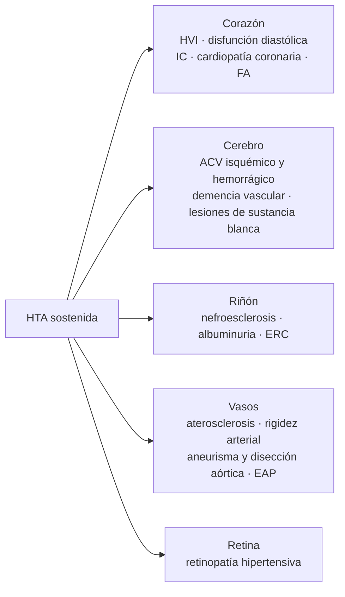
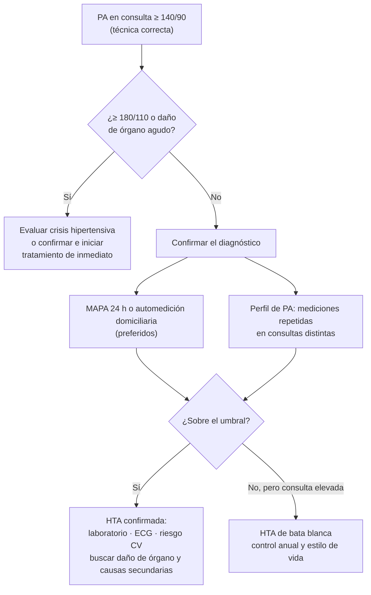
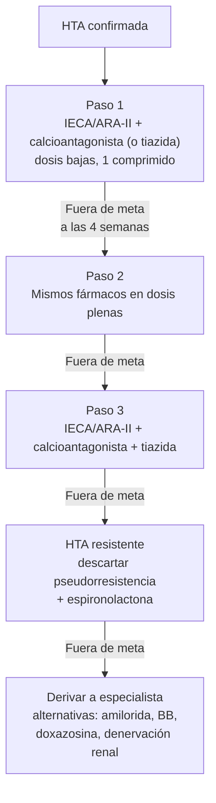

---
tags:
  - Cardiología
  - Nefrología
  - GES
  - Frecuente en sala
---

# Hipertensión arterial

**Subespecialidad**
Cardiología · Nefrología · Geriatría

**Guías principales**
ESC 2024 (presión arterial elevada e hipertensión) · AHA/ACC 2025

**Otras fuentes**
ESH 2023 · Guía GES MINSAL HTA 2018 · Vía clínica HEARTS Chile (OPS/MINSAL) · OMS: informe mundial de hipertensión 2025

**GES**
Sí: hipertensión arterial primaria o esencial en personas de 15 años y más

**Revisado**
Septiembre 2026

!!! abstract "Resumen en 60 segundos"
    - **HTA**: PA en consulta **≥ 140/90 mmHg** (ESC 2024, OMS, Chile) o **≥ 130/80** (AHA/ACC 2025), **confirmada** con mediciones repetidas o fuera de la consulta (MAPA o automedición).
    - Afecta a **~ 1 de cada 3 adultos**; en Chile, **27,6 %** de los mayores de 15 años, y solo **1 de cada 3 hipertensos está controlado**.
    - **90–95 % es primaria**. Sospecha HTA secundaria en jóvenes, HTA resistente, inicio brusco, hipokalemia o daño de órgano desproporcionado. La causa secundaria más frecuente es el **hiperaldosteronismo primario**.
    - **Tratamiento**: estilo de vida + fármacos de primera línea (**IECA/ARA-II, calcioantagonistas dihidropiridínicos, tiazidas**). La mayoría debe **partir con una combinación de dos fármacos**, idealmente en un solo comprimido.
    - **Protocolo HEARTS Chile**: **losartán 50 mg + amlodipino 5 mg** al confirmar el diagnóstico, con subida de dosis mensual hasta la meta.
    - **Metas**: ESC 2024 **PAS 120–129 mmHg** si se tolera; AHA/ACC **< 130/80**; HEARTS Chile **< 140/90** (**< 130/80** con diabetes, ERC o enfermedad cardiovascular; < 150/90 en ≥ 80 años).
    - **HTA resistente**: descartar pseudorresistencia y agregar **espironolactona**.

## Definición

La hipertensión arterial (HTA) es la **elevación persistente de la presión arterial** sobre el umbral a partir del cual el tratamiento reduce los eventos cardiovasculares. El riesgo aumenta de forma **continua** desde ~ 115/75 mmHg, así que los umbrales son convenciones.

| Categoría | ESC 2024 (PA en consulta) | AHA/ACC 2025 |
|---|---|---|
| **No elevada / normal** | < 120/70 | < 120/80 |
| **Elevada** | PAS 120–139 o PAD 70–89 | PAS 120–129 y PAD < 80 |
| **Hipertensión** | **≥ 140/90** | **Etapa 1**: 130–139 o 80–89 · **Etapa 2**: ≥ 140 o ≥ 90 |

En **Chile** (guía GES y programa HEARTS) se usa el umbral **≥ 140/90 mmHg**.

**Umbrales fuera de la consulta** (equivalentes a 140/90 en consulta)

| Método | Umbral de HTA |
|---|---|
| **Automedición domiciliaria (AMPA)** | ≥ 135/85 mmHg |
| **MAPA de 24 horas**: promedio de 24 h | ≥ 130/80 mmHg |
| MAPA: promedio diurno | ≥ 135/85 mmHg |
| MAPA: promedio nocturno | ≥ 120/70 mmHg |

**Fenotipos según las mediciones**

- **HTA de bata blanca**: elevada en consulta, normal fuera de ella (~ 15–30 % de los "hipertensos" de consulta).
- **HTA enmascarada**: normal en consulta, elevada fuera de ella. Tiene un riesgo similar a la HTA sostenida.
- **HTA sistólica aislada**: PAS ≥ 140 con PAD < 90. Es la forma más frecuente en adultos mayores (por rigidez arterial).
- **HTA nocturna / patrón "non-dipper"**: la PA no baja ≥ 10 % durante la noche; se asocia a SAHOS, ERC y diabetes.

## Epidemiología

### Mundial

- **~ 1.400 millones** de adultos de 30–79 años tenían HTA en 2024: **1 de cada 3** (informe mundial de la OMS 2025).
- **44 %** no sabe que la tiene y solo **~ 23 %** (320 millones) tiene la PA controlada.
- La PA elevada es el **principal factor de riesgo de muerte** en el mundo: se le atribuyen ~ **10 millones de muertes al año** (GBD), sobre todo por ACV, cardiopatía coronaria, IC y ERC.
- Dos tercios de los hipertensos viven en países de ingresos bajos y medios.

### Chile

!!! chile "Datos nacionales"
    - **ENS 2016–2017**: prevalencia de **27,6 %** en ≥ 15 años, que sube a más de **70 % en ≥ 65 años**.
    - De los hipertensos, **68,7 % conoce** su diagnóstico, **60 % está en tratamiento** y solo **33,3 % está controlado**.
    - **GES**: garantiza el diagnóstico y tratamiento de la **HTA primaria o esencial en personas de 15 años y más**.
    - En la APS se maneja en el **Programa de Salud Cardiovascular (PSCV)**. Desde 2018 se implementa la **Iniciativa HEARTS** (OPS/OMS), con un **protocolo estandarizado** de tratamiento que mejoró las tasas de control.
    - Factores de riesgo muy prevalentes: **exceso de peso 74 %**, consumo de sal ~ 9–10 g/día (el doble de lo recomendado), sedentarismo ~ 87 %.

## Etiología y factores de riesgo

### HTA primaria (esencial): 90–95 %

Multifactorial: **genética** + **ambiente**. Factores de riesgo: edad, antecedente familiar, **obesidad** (sobre todo abdominal), **alto consumo de sodio** y bajo de potasio, **sedentarismo**, **alcohol**, tabaco, estrés, diabetes, SAHOS, bajo nivel socioeconómico y afrodescendencia.

### HTA secundaria: 5–10 % (hasta ~ 20 % en HTA resistente)

| Causa | Pistas clínicas | Estudio inicial |
|---|---|---|
| **Hiperaldosteronismo primario** (la más frecuente) | HTA resistente, **hipokalemia** espontánea o inducida por diuréticos (solo en ~ 30 %), incidentaloma suprarrenal, FA, SAHOS, familiar con HTA precoz | **Razón aldosterona/renina** |
| **Enfermedad renal parenquimatosa** | Creatinina elevada, albuminuria, hematuria, riñones anormales | Creatinina, orina completa, RAC, ecografía renal |
| **Estenosis de arteria renal** | **Aterosclerótica** (> 55 años, vasculopatía, caída de TFG > 30 % con IECA/ARA-II, edema pulmonar "flash", asimetría renal); **displasia fibromuscular** (mujer joven, soplo abdominal) | Eco-Doppler, angioTC o angioRM renal |
| **Síndrome de apnea obstructiva del sueño** | Ronquido, apneas, somnolencia, obesidad, HTA nocturna | Poligrafía o polisomnografía |
| **Feocromocitoma / paraganglioma** | Crisis de **cefalea, sudoración y palpitaciones**, HTA paroxística, incidentaloma | Metanefrinas plasmáticas o urinarias |
| **Síndrome de Cushing** | Obesidad central, estrías violáceas, debilidad proximal, hiperglicemia | Cortisol libre urinario, cortisol salival nocturno o supresión con dexametasona 1 mg |
| **Disfunción tiroidea y paratiroidea** | Hipertiroidismo (HTA sistólica), hipotiroidismo (diastólica), hipercalcemia | TSH, calcio |
| **Coartación aórtica** | Joven, **diferencia de PA brazos-piernas**, pulsos femorales débiles, soplo interescapular | Ecocardiograma, angioTC |
| **Fármacos y sustancias** | **AINE**, **corticoides**, anticonceptivos orales, descongestionantes, venlafaxina, ciclosporina y tacrolimus, eritropoyetina, inhibidores de VEGF, **regaliz**, **cocaína**, anfetaminas, **alcohol** | Historia dirigida |

!!! alarma "Cuándo sospechar HTA secundaria"
    - Inicio antes de los **40 años** (ESC sugiere estudio en < 40 años con HTA grado 2 o más).
    - **HTA resistente** o inicio o empeoramiento brusco en un paciente antes controlado.
    - **Hipokalemia** espontánea o marcada con diuréticos.
    - **Emergencia hipertensiva** o HTA grado 3.
    - **Daño de órgano desproporcionado** a la duración o magnitud de la HTA.
    - Pistas clínicas de una causa específica (tabla).

## Fisiopatología

La PA depende del **gasto cardíaco** (volumen intravascular, contractilidad) y de la **resistencia vascular periférica**. En la HTA primaria interactúan:

- **Activación del sistema renina-angiotensina-aldosterona**: vasoconstricción, retención de sodio, hipertrofia y fibrosis.
- **Hiperactividad simpática**: taquicardia, vasoconstricción, liberación de renina (obesidad, SAHOS, estrés).
- **Sensibilidad a la sal** y alteración de la natriuresis de presión: el riñón necesita más presión para excretar el sodio.
- **Rigidez arterial**: con la edad la aorta pierde distensibilidad; sube la PAS y baja la PAD (HTA sistólica aislada).
- **Disfunción endotelial**: menos óxido nítrico y más endotelina; inflamación e inmunidad.

<figure markdown>
{ loading=lazy width="700" }
<figcaption>Figura 1. (A) La PA depende de la capacidad de vasodilatación y del volumen intravascular, sobre los que actúan la activación del SRAA, la desregulación simpática, la rigidez arterial, la retención de agua y sodio y la genética. (B) Estos mecanismos interactúan entre sí y predominan en distintos fenotipos: HTA sensible a la sal, HTA simpática e HTA por rigidez arterial. Fuente: Ma J, Chen X. Advances in pathogenesis and treatment of essential hypertension. <em>Front Cardiovasc Med</em>. 2022;9:1003852. doi:<a href="https://doi.org/10.3389/fcvm.2022.1003852">10.3389/fcvm.2022.1003852</a>. Licencia <a href="https://creativecommons.org/licenses/by/4.0/">CC BY 4.0</a>. Texto de la figura en inglés.</figcaption>
</figure>

**Daño de órgano blanco mediado por la HTA**

*Figura 2. Órganos blanco de la hipertensión arterial. Esquema propio.*

## Clasificación

### Por etiología

1. **Primaria o esencial** (90–95 %).
2. **Secundaria** (5–10 %).

### Por riesgo cardiovascular global

El tratamiento no depende solo de la cifra de PA, sino del **riesgo cardiovascular** del paciente:

- **Chile (PSCV)**: se clasifica en riesgo **bajo, moderado o alto** con la **tabla de Framingham adaptada a la población chilena**. Se consideran de **alto riesgo** sin necesidad de calcular: enfermedad cardiovascular establecida, diabetes con daño de órgano, ERC etapa 3b o más, y PA ≥ 160/100 mantenida.
- **ESC 2024**: **SCORE2** (40–69 años) y **SCORE2-OP** (≥ 70 años). Riesgo a 10 años ≥ 10 % se considera alto.
- **AHA/ACC 2025**: ecuaciones **PREVENT** (sin raza). Umbral de **7,5 % a 10 años** para iniciar fármacos en la etapa 1.

### Situaciones especiales

- **HTA resistente**: PA sobre la meta pese a **≥ 3 fármacos** (incluido un diurético) en dosis óptimas, con buena adherencia y confirmada fuera de la consulta.
- **HTA refractaria**: no controlada con ≥ 5 fármacos, incluida la espironolactona.
- **Crisis hipertensiva**: urgencia y emergencia (ver [Crisis hipertensiva](crisis-hipertensiva.md)).

## Clínica

- La mayoría de los pacientes está **asintomático**: por eso hay que **medir la PA en todas las consultas**.
- Síntomas inespecíficos: cefalea occipital matinal (sobre todo con PA muy alta), mareos, tinnitus, epistaxis.
- **Síntomas de daño de órgano**: disnea, angina, claudicación, déficit neurológico, alteraciones visuales, nicturia.
- **Síntomas de causas secundarias** (ver tabla de HTA secundaria).

**Examen físico dirigido**

- PA en **ambos brazos** en la primera consulta (diferencia > 15 mmHg sugiere enfermedad arterial) y **PA de pie** en adultos mayores y diabéticos (hipotensión ortostática).
- IMC, **circunferencia de cintura**.
- **Pulsos periféricos** y soplos (carotídeos, abdominales, femorales).
- Examen cardíaco (choque de la punta desplazado, cuarto ruido), signos de IC.
- **Fondo de ojo**: estrechamiento arteriolar, cruces arteriovenosos, hemorragias, exudados, **edema de papila** (este último indica emergencia hipertensiva).
- Signos de endocrinopatías (Cushing, hipertiroidismo).

## Diagnóstico

### Medición correcta de la presión arterial

!!! guia "Técnica de medición (HEARTS / ESC 2024)"
    - Usar un **equipo automático validado** de brazo, siempre que esté disponible.
    - **5 minutos de reposo**, sentado, **espalda apoyada**, **pies en el suelo**, **piernas sin cruzar**, **vejiga vacía**, **sin conversar**.
    - Sin café, tabaco ni ejercicio en los 30 minutos previos.
    - **Brazo descubierto**, apoyado a la **altura del corazón**, con un **manguito del tamaño adecuado** (un manguito pequeño sobreestima la PA).
    - Tomar **2–3 mediciones** separadas por 1–2 minutos y promediar las dos últimas.

*Figura 3. Confirmación del diagnóstico de HTA. Esquema propio basado en ESC 2024 y la guía GES.*

- **ESC 2024**: confirmar con **MAPA o automedición** siempre que sea posible.
- **Chile (GES)**: se confirma con un **perfil de PA** (mediciones en al menos dos días distintos) o con MAPA/AMPA.
- Si la PA es **≥ 180/110 mmHg** sin síntomas de daño agudo, se puede **iniciar tratamiento sin esperar la confirmación**.

## Laboratorio

**Estudio básico de todo hipertenso (al diagnóstico y luego anual)**

- **Creatinina y TFGe**.
- **Electrolitos plasmáticos** (Na, **K**): la hipokalemia orienta a hiperaldosteronismo.
- **Glicemia en ayunas o HbA1c**.
- **Perfil lipídico**.
- **Orina completa** y **razón albúmina/creatinina** (RAC) en orina aislada.
- Ácido úrico y hemograma (opcional según guía).
- **ECG de 12 derivaciones**: HVI (criterios de Sokolow-Lyon > 35 mm o Cornell), FA, isquemia previa.

**Estudio adicional según el caso**

- **Razón aldosterona/renina** (idealmente con potasio normal): se recomienda cada vez más como tamizaje amplio en hipertensos (ESC 2024; Endocrine Society 2025).
- TSH, calcio, metanefrinas, cortisol, estudio de SAHOS, según la sospecha.
- **Ecocardiograma** si el ECG es anormal o hay síntomas: HVI, disfunción diastólica, dilatación aórtica.

## Imágenes

- **Ecocardiograma**: HVI (índice de masa VI > 95 g/m² en mujeres y > 115 g/m² en hombres), disfunción diastólica, aorta.
- **Eco-Doppler, angioTC o angioRM de arterias renales**: si se sospecha estenosis de arteria renal.
- **Ecografía renal**: tamaño y asimetría renal, poliquistosis.
- **TC o RM suprarrenal**: después de confirmar bioquímicamente un hiperaldosteronismo, Cushing o feocromocitoma.
- **Fondo de ojo o retinografía**: en HTA grado 2–3, diabéticos y crisis hipertensiva.
- **Eco-Doppler carotídeo**: placas en pacientes seleccionados (reclasifica el riesgo).
- **RM cerebral**: si hay síntomas neurológicos o deterioro cognitivo.

## Diagnóstico diferencial

- **Error de medición** (manguito pequeño, paciente que habla o con piernas cruzadas, medición única).
- **HTA de bata blanca**.
- **Elevación transitoria por dolor, ansiedad, retención urinaria, abstinencia alcohólica o fármacos** (muy frecuente en pacientes hospitalizados: tratar la causa, no la cifra).
- **Pseudohipertensión** en adultos mayores con arterias muy calcificadas.
- **HTA secundaria**.

## Tratamiento

### Metas

| Guía | Meta general | Comentarios |
|---|---|---|
| **ESC 2024** | **PAS 120–129 mmHg** y PAD 70–79 | Si no se tolera: "tan baja como sea razonablemente posible". En ≥ 85 años, frágiles o con hipotensión ortostática, individualizar |
| **AHA/ACC 2025** | **< 130/80 mmHg** | Considerar **PAS < 120** en pacientes seleccionados de alto riesgo |
| **HEARTS Chile / PSCV** | **< 140/90 mmHg** | **< 130/80** con **diabetes**, **ERC** o **enfermedad cardiovascular**; **< 150/90** en **≥ 80 años** |
| **KDIGO 2021 (ERC)** | **PAS < 120** si se tolera | Con medición estandarizada |

### ¿Cuándo iniciar fármacos?

| Situación | Conducta |
|---|---|
| **PA ≥ 140/90** confirmada | **Fármacos de inmediato** + estilo de vida (ESC 2024, AHA/ACC 2025, HEARTS) |
| **PA 130–139/80–89** con enfermedad CV, diabetes, ERC o riesgo alto (ESC ≥ 10 %; AHA PREVENT ≥ 7,5 %) | Estilo de vida por 3 meses y fármacos si persiste ≥ 130/80 (ESC); fármacos de inmediato (AHA/ACC) |
| **PA 130–139/80–89** con riesgo bajo | Estilo de vida por 3–6 meses; fármacos si persiste (AHA/ACC) |
| **PA 120–139/70–89** sin riesgo alto (ESC: "PA elevada") | Estilo de vida y control anual |

### Medidas no farmacológicas (todos)

| Medida | Reducción aproximada de la PAS |
|---|---|
| **Reducir el sodio** a < 2 g/día (~ 5 g de sal); usar **sustitutos de sal con potasio** si no hay ERC ni hiperkalemia (ESC 2024) | 5–6 mmHg |
| **Dieta DASH o mediterránea** (frutas, verduras, lácteos descremados, legumbres; potasio 3,5–5 g/día) | 8–11 mmHg |
| **Bajar de peso** (~ 1 mmHg por kg perdido) | 5 mmHg |
| **Actividad física** aeróbica ≥ 150 min/semana + ejercicios de fuerza (incluidos isométricos) | 4–8 mmHg |
| **Reducir el alcohol** (idealmente no consumir) | 4 mmHg |
| Dejar de fumar | Reduce el riesgo CV global |

### Tratamiento farmacológico

**Fármacos de primera línea**: **IECA o ARA-II**, **calcioantagonistas dihidropiridínicos** y **diuréticos tiazídicos o similares** (clortalidona, indapamida). Los **betabloqueadores** son primera línea cuando hay una indicación específica (cardiopatía coronaria, IC-FEr, FA, embarazo, migraña).

!!! guia "Combinación inicial"
    La ESC 2024 y la AHA/ACC 2025 recomiendan **iniciar con una combinación de dos fármacos en dosis bajas**, idealmente **en un solo comprimido**, en la mayoría de los hipertensos (IECA/ARA-II + calcioantagonista o tiazida). Se puede partir con monoterapia en adultos mayores frágiles, con hipotensión ortostática o con PA solo levemente elevada.

*Figura 4. Escalamiento del tratamiento antihipertensivo. Esquema propio basado en ESC 2024 y AHA/ACC 2025.*

!!! chile "Protocolo HEARTS Chile (APS)"
    Iniciar tratamiento **al confirmar el diagnóstico** (PA ≥ 140/90, o PAS ≥ 130 con diabetes, albuminuria ≥ 30 mg/g, riesgo CV alto ≥ 10 % o enfermedad CV establecida). Reevaluar **cada 1 mes** y subir un paso si está fuera de meta:

    1. **Losartán 50 mg/día + amlodipino 5 mg/día**.
    2. **Losartán 100 mg/día + amlodipino 10 mg/día**.
    3. Losartán 100 mg/día + amlodipino 10 mg/día + **hidroclorotiazida 25 mg/día**.
    4. Losartán 100 mg/día + amlodipino 10 mg/día + hidroclorotiazida 50 mg/día.
    5. Si sigue fuera de meta: **consulta con el siguiente nivel de atención**.

    Se recomienda dar **todos los fármacos en una sola toma** (el losartán una vez al día mejora la adherencia). Además: **aspirina 100 mg** si hay enfermedad cardiovascular establecida, y **atorvastatina** 20 mg (riesgo moderado) o 40–80 mg (riesgo alto). **No aplica** a mujeres en edad fértil o embarazadas, ≥ 80 años, IAM o IC, ERC etapa 4–5, insuficiencia hepática grave ni alergias a los componentes.

### Dosis de los principales antihipertensivos

| Clase | Fármaco | Dosis habitual | Efectos adversos y precauciones |
|---|---|---|---|
| **ARA-II** | **Losartán** | 50–100 mg/día (1–2 tomas) | Hiperkalemia, alza de creatinina. **Contraindicado en el embarazo**. El losartán además baja el ácido úrico |
| | Valsartán · candesartán · telmisartán | 80–320 · 8–32 · 40–80 mg/día | Igual |
| **IECA** | **Enalapril** | 5–20 mg c/12 h | **Tos seca** (~ 10 %), **angioedema**, hiperkalemia. **Contraindicado en el embarazo** y en estenosis bilateral de arterias renales |
| | Ramipril · perindopril | 2,5–10 · 4–8 mg/día | Igual |
| **Calcioantagonistas dihidropiridínicos** | **Amlodipino** | 5–10 mg/día | **Edema maleolar** (dosis dependiente), rubor, cefalea, hiperplasia gingival |
| | Nifedipino de liberación prolongada | 30–60 mg/día | Evitar el nifedipino de acción corta |
| **Calcioantagonistas no dihidropiridínicos** | Diltiazem · verapamilo | 120–360 · 120–480 mg/día | Bradicardia, bloqueo AV, constipación (verapamilo). **Evitar en IC-FEr** y con betabloqueadores |
| **Tiazidas y similares** | **Hidroclorotiazida** | 12,5–25 (hasta 50) mg/día | **Hipokalemia**, **hiponatremia**, hiperuricemia (**gota**), hiperglicemia, hipercalcemia, fotosensibilidad |
| | **Clortalidona** · indapamida | 12,5–25 · 1,5 mg/día (liberación prolongada) | Más potentes y de acción más larga; la clortalidona sirve incluso con TFGe < 30 |
| **Antagonistas de la aldosterona** | **Espironolactona** | 25–50 mg/día | Hiperkalemia, **ginecomastia**, alteraciones menstruales. Precaución con TFGe < 45 o K⁺ > 4,5 |
| **Betabloqueadores** | Bisoprolol · carvedilol · nebivolol · atenolol | 2,5–10 · 6,25–25 c/12 h · 5 · 50–100 mg/día | Bradicardia, fatiga, broncoespasmo (no selectivos), disfunción eréctil, hiperglicemia. El atenolol es menos efectivo en prevenir ACV |
| **Alfabloqueadores** | Doxazosina | 1–8 mg/día | **Hipotensión ortostática**. Útil con hiperplasia prostática |
| **Vasodilatadores y de acción central** | Hidralazina · metildopa · clonidina | 25–100 mg c/8–12 h · 250–1000 mg c/12 h · 0,1–0,3 mg c/12 h | Taquicardia refleja y lupus inducido (hidralazina); sedación (metildopa); **rebote** al suspender la clonidina |

!!! alarma "Combinaciones que no se deben usar"
    - **IECA + ARA-II** (o cualquiera de ellos + aliskiren): más hiperkalemia y falla renal, sin beneficio.
    - **Betabloqueador + verapamilo o diltiazem**: bradicardia y bloqueo AV.
    - **IECA o ARA-II en el embarazo**: teratogénicos (fetopatía renal). Suspenderlos al planificar un embarazo.

### Elección según comorbilidad

| Situación | Preferir | Evitar |
|---|---|---|
| **Diabetes, ERC con albuminuria** | IECA o ARA-II (+ iSGLT2 y finerenona según indicación) | — |
| **Cardiopatía coronaria** | Betabloqueador + IECA/ARA-II | — |
| **IC con FE reducida** | IECA/ARA-II/ARNI + BB + ARM + iSGLT2 | Diltiazem, verapamilo |
| **FA** | Betabloqueador (control de frecuencia) | — |
| **Embarazo** | **Labetalol, nifedipino de liberación prolongada, metildopa** | IECA, ARA-II, espironolactona, atenolol |
| **Gota** | Losartán, calcioantagonista | Tiazidas y diuréticos de asa |
| **Asma o EPOC grave** | Calcioantagonista, IECA/ARA-II | Betabloqueadores no selectivos |
| **Hiperplasia prostática** | Agregar alfabloqueador | — |
| **Adulto mayor frágil** | Monoterapia en dosis bajas, subida lenta | Alfabloqueadores, fármacos de acción central (hipotensión ortostática, caídas) |

### HTA resistente

1. **Descartar pseudorresistencia**: técnica de medición, **bata blanca** (MAPA), **mala adherencia** (la causa más frecuente), dosis insuficientes, **sal** en exceso, **AINE** u otros fármacos, alcohol.
2. Buscar **causas secundarias** (hiperaldosteronismo, SAHOS, ERC, estenosis renal).
3. **Espironolactona 25–50 mg/día** como cuarto fármaco (la más eficaz; estudio PATHWAY-2), con control de K⁺ y creatinina. Alternativas: amilorida, bisoprolol, doxazosina.
4. Pasar la tiazida a **clortalidona** o a un diurético de asa si la TFGe es < 30.
5. Derivar a especialista. **Denervación renal** en pacientes seleccionados en centros con experiencia (ESC 2024). Hay fármacos nuevos en desarrollo o recién aprobados en algunos países (antagonistas de endotelina como aprocitentán e inhibidores de la aldosterona sintasa).

## Complicaciones

- **ACV** (la complicación más ligada a la HTA), **cardiopatía coronaria**, **IC**, **FA**.
- **ERC** y albuminuria.
- **Retinopatía hipertensiva**.
- **Demencia vascular** y deterioro cognitivo.
- **Aneurisma y disección aórtica**, enfermedad arterial periférica.
- **Crisis hipertensiva** (urgencia y emergencia).
- **Efectos adversos del tratamiento**: hipotensión ortostática y caídas, hiponatremia, hipokalemia, hiperkalemia, lesión renal aguda.

## Pronóstico y seguimiento

- Entre los 40 y 69 años, **cada aumento de 20 mmHg de PAS (o 10 de PAD) duplica** la mortalidad por ACV y por cardiopatía coronaria (Prospective Studies Collaboration).
- **Bajar 10 mmHg la PAS** reduce ~ **20 %** los eventos cardiovasculares mayores, ~ **27 %** los ACV, ~ **28 %** la IC y ~ **13 %** la mortalidad total (metaanálisis de Ettehad, *Lancet* 2016).
- **Seguimiento**:
    - **Mensual** hasta lograr la meta (protocolo HEARTS); luego cada **3 meses** (riesgo alto) o **6 meses** (riesgo bajo o moderado).
    - Evaluar **adherencia** en cada control.
    - Creatinina y **K⁺ 1–2 semanas** después de iniciar o subir IECA, ARA-II, diuréticos o espironolactona.
    - Laboratorio, ECG y RAC **anuales**.
    - Promover la **automedición domiciliaria** con un equipo validado.

## Perlas para el internado

!!! perla "Para la sala y el turno"
    - **No trates la cifra, trata al paciente**: en el hospitalizado, una PA elevada suele deberse a dolor, ansiedad, globo vesical, abstinencia o suspensión de fármacos. Corrige la causa antes de indicar un antihipertensivo "SOS".
    - **Evita el nifedipino sublingual** y la captopril "de rescate" para bajar la PA rápido: los descensos bruscos producen isquemia cerebral y coronaria.
    - Paciente joven con HTA e **hipokalemia**: piensa en **hiperaldosteronismo primario**.
    - Diferencia de PA entre brazos > 15 mmHg: enfermedad arterial subclavia o **disección aórtica** si hay dolor torácico.
    - Mujer en edad fértil: **evita IECA y ARA-II** o asegúrate de que use un método anticonceptivo; en el embarazo usa labetalol, nifedipino de liberación prolongada o metildopa.
    - Tos seca con enalapril: cambia a **ARA-II** (no produce tos).
    - Edema maleolar con amlodipino: baja la dosis o combina con IECA/ARA-II (reduce el edema).
    - Con tiazidas, controla **Na⁺ y K⁺**, sobre todo en **mujeres mayores** (hiponatremia grave).
    - Siempre mide la **PA de pie** en adultos mayores antes de intensificar el tratamiento.

## Preguntas de repaso

??? repaso "1. Hombre de 52 años con PA de 152/96 y 148/94 mmHg en dos consultas distintas, sin comorbilidades. ¿Cómo lo manejas según el protocolo HEARTS?"
    Tiene **HTA confirmada** (≥ 140/90). Iniciar de inmediato **losartán 50 mg + amlodipino 5 mg** una vez al día, más cambios de estilo de vida; estimar el riesgo cardiovascular, pedir el laboratorio básico y ECG, y **controlar en 1 mes** para subir de paso si sigue ≥ 140/90.

??? repaso "2. Mujer de 34 años con HTA de difícil manejo y potasio de 3,1 mEq/L sin diuréticos. ¿Qué sospechas y qué examen pides?"
    **Hiperaldosteronismo primario**. Pedir la **razón aldosterona/renina** (con potasio corregido) y derivar a endocrinología para la confirmación y, si corresponde, TC suprarrenal y cateterismo de venas suprarrenales.

??? repaso "3. Paciente en tratamiento con losartán 100 mg, amlodipino 10 mg e hidroclorotiazida 25 mg, con PA de 150/92 mmHg en consulta. ¿Qué haces antes de agregar un cuarto fármaco?"
    Descartar **pseudorresistencia**: revisar la **técnica de medición**, confirmar con **MAPA** o automedición (bata blanca), evaluar la **adherencia**, el consumo de **sal**, **AINE** u otros fármacos y alcohol, y buscar **causas secundarias** (hiperaldosteronismo, SAHOS, ERC). Si se confirma la HTA resistente, agregar **espironolactona 25 mg**.

??? repaso "4. ¿Qué antihipertensivos se contraindican en el embarazo y cuáles se prefieren?"
    **Contraindicados**: **IECA, ARA-II** (y aliskiren), además de espironolactona y atenolol (restricción del crecimiento). **Preferidos**: **labetalol**, **nifedipino de liberación prolongada** y **metildopa**.

??? repaso "5. ¿Cuál es la meta de PA de un paciente de 60 años, diabético, según HEARTS Chile y según la ESC 2024?"
    **HEARTS Chile**: **< 130/80 mmHg** (por la diabetes). **ESC 2024**: **PAS 120–129 mmHg** (y PAD 70–79) si se tolera.

## Referencias

1. McEvoy JW, et al. 2024 ESC Guidelines for the management of elevated blood pressure and hypertension. *Eur Heart J.* 2024;45:3912–4018. [Texto en la revista](https://academic.oup.com/eurheartj/article/45/38/3912/7741010)
2. 2025 AHA/ACC/AANP/AAPA/ABC/ACCP/ACPM/AGS/AMA/ASPC/NMA/PCNA/SGIM Guideline for the Prevention, Detection, Evaluation and Management of High Blood Pressure in Adults. *J Am Coll Cardiol / Hypertension.* 2025. [Resumen en JACC](https://www.jacc.org/doi/10.1016/j.jacc.2025.07.010)
3. Mancia G, et al. 2023 ESH Guidelines for the management of arterial hypertension. *J Hypertens.* 2023;41:1874–2071.
4. Organización Mundial de la Salud. *Global report on hypertension 2025: high stakes: turning evidence into action.* Ginebra: OMS; 2025. [who.int](https://www.who.int/publications/i/item/9789240115569)
5. Ministerio de Salud de Chile. *Guía de Práctica Clínica Hipertensión arterial primaria o esencial en personas de 15 años y más.* 2018. [diprece.minsal.cl](https://diprece.minsal.cl/wp-content/uploads/2019/05/08.-RE_GPC-HTA-Final_2018v5.pdf)
6. Organización Panamericana de la Salud, Ministerio de Salud de Chile. *Vía clínica de hipertensión arterial para personal de salud (HEARTS Chile).* 2024. [paho.org](https://www.paho.org/sites/default/files/2024-07/clinica-hipertension-chile.pdf)
7. Ministerio de Salud de Chile. *Encuesta Nacional de Salud 2016–2017: primeros resultados.* 2017.
8. Kidney Disease: Improving Global Outcomes (KDIGO) Blood Pressure Work Group. KDIGO 2021 Clinical Practice Guideline for the Management of Blood Pressure in Chronic Kidney Disease. *Kidney Int.* 2021;99(3S):S1–S87.
9. Ettehad D, et al. Blood pressure lowering for prevention of cardiovascular disease and death: a systematic review and meta-analysis. *Lancet.* 2016;387:957–967.
10. Lewington S, et al. Age-specific relevance of usual blood pressure to vascular mortality: a meta-analysis of individual data for one million adults in 61 prospective studies. *Lancet.* 2002;360:1903–1913.
11. Williams B, et al. Spironolactone versus placebo, bisoprolol, and doxazosin to determine the optimal treatment for drug-resistant hypertension (PATHWAY-2). *Lancet.* 2015;386:2059–2068.
12. Ma J, Chen X. Advances in pathogenesis and treatment of essential hypertension. *Front Cardiovasc Med.* 2022;9:1003852. doi:[10.3389/fcvm.2022.1003852](https://doi.org/10.3389/fcvm.2022.1003852)
