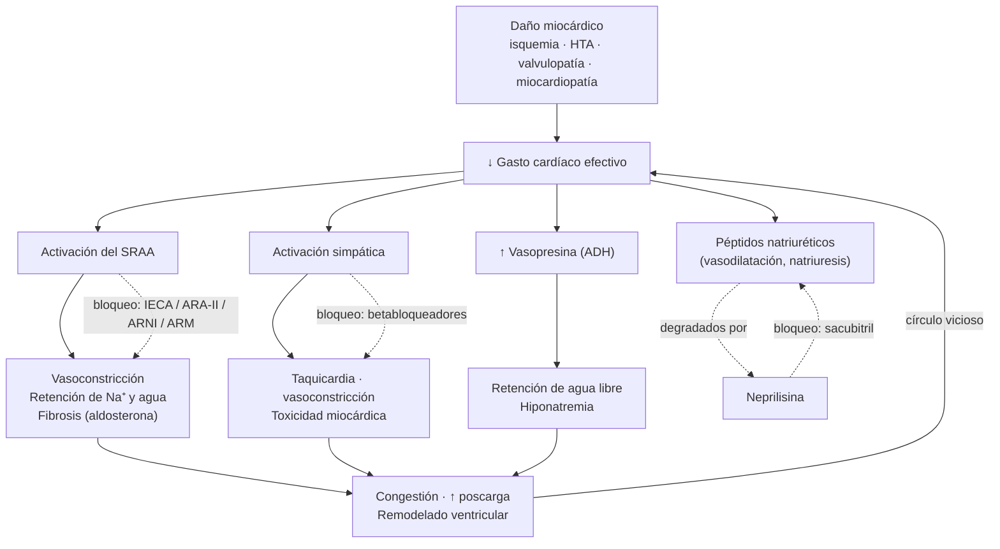
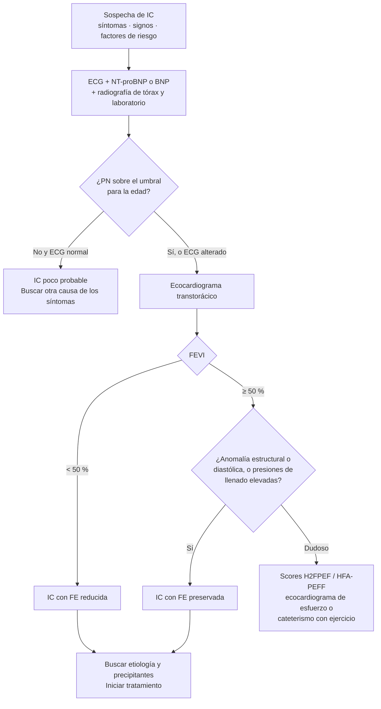
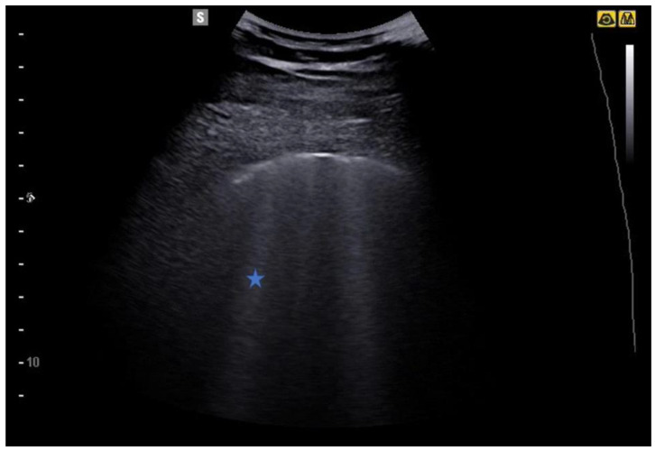
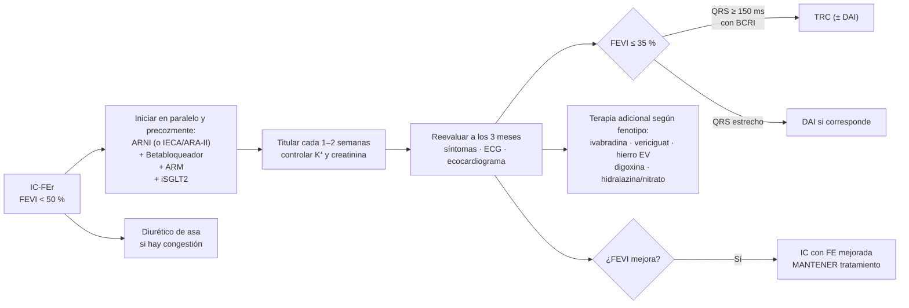
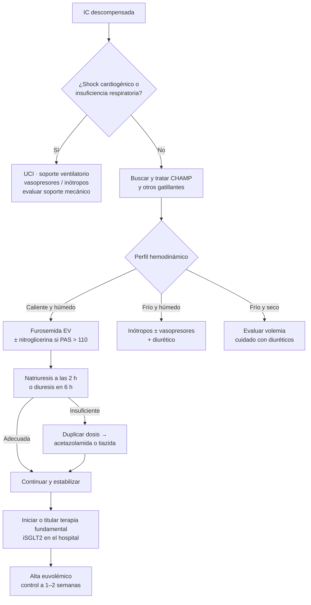

---
tags:
  - Cardiología
  - Frecuente en sala
  - Urgencia
---

# Insuficiencia cardíaca

**Subespecialidad**
Cardiología

**Guía principal**
ESC 2026 (Eur Heart J, agosto 2026)

**Otras fuentes**
Segunda Definición Universal de IC 2026 · AHA/ACC/HFSA 2022 · ACC ECDP 2024 · Guía MINSAL-SOCHICAR 2015

**Revisado**
Septiembre 2026

!!! abstract "Resumen en 60 segundos"
    - La IC es un **síndrome clínico**: síntomas o signos por una alteración cardíaca estructural o funcional, corroborada por **péptidos natriuréticos elevados** o evidencia objetiva de **congestión**.
    - **ESC 2026 cambió la clasificación**: solo quedan **IC con FE reducida (FEVI < 50 %)** e **IC con FE preservada (FEVI ≥ 50 %)**. Se eliminó la IC con FE levemente reducida (41–49 %). La definición universal 2026 agrega la **IC con FE mejorada**.
    - Se adoptan los **estadios A–D** (en riesgo, pre-IC, IC sintomática, IC avanzada).
    - Diagnóstico: sospecha clínica → **ECG + NT-proBNP** (umbrales ajustados por edad) → **ecocardiograma**.
    - **IC-FEr**: cuatro fármacos **fundamentales** (IECA/ARA-II o **ARNI** + **betabloqueador** + **ARM** + **iSGLT2**), iniciados lo antes posible y titulados rápido.
    - **IC-FEp**: **iSGLT2** + **ARM** (finerenona) + diuréticos si hay congestión + tratar comorbilidades; **semaglutida o tirzepatida** si hay obesidad.
    - La IC "aguda" pasa a llamarse **IC descompensada**, con tres fases de manejo: inicial, estabilización y prealta/postalta precoz.

## Definición

La **Definición Universal de IC** (2021, reafirmada y ampliada en la segunda versión de 2026) la describe como un síndrome clínico con síntomas y/o signos causados por una anomalía cardíaca estructural y/o funcional, y corroborado por al menos uno de:

- Niveles elevados de **péptidos natriuréticos** (BNP o NT-proBNP).
- Evidencia objetiva de **congestión pulmonar o sistémica** de origen cardiogénico (imagen, como radiografía de tórax o ecocardiograma, o hemodinamia en reposo o con ejercicio).

La ESC la define de forma equivalente: síntomas cardinales (disnea, fatiga, edema de tobillos) con o sin signos (presión venosa yugular elevada, crépitos, edema periférico), por una alteración cardíaca que produce **presiones intracardíacas elevadas y/o gasto cardíaco inadecuado** en reposo o ejercicio.

!!! guia "Cambio de terminología ESC 2026"
    El término **"IC aguda"** se reemplaza por **"IC descompensada"**, porque el empeoramiento suele ser progresivo (días a semanas) y no súbito.

## Epidemiología

### Mundial

- **~56 millones** de personas vivían con IC en 2021 (Global Burden of Disease 2021). Los casos prevalentes se duplicaron desde 1990, sobre todo por el envejecimiento poblacional y la mayor sobrevida tras el infarto.
- Prevalencia de **1–3 % en adultos** y **> 10 % en mayores de 70 años**.
- Riesgo de desarrollar IC a lo largo de la vida: aproximadamente **1 de cada 4 personas** mayores de 55 años.
- Causas subyacentes de los casos prevalentes (GBD 2021): **cardiopatía isquémica 34 %**, **cardiopatía hipertensiva 23 %**, otras miocardiopatías 8 %.
- Alrededor de **la mitad** de los pacientes tiene **FE preservada**, proporción que aumenta con la edad, la obesidad y la diabetes.
- Mortalidad al año: ~**24 %** después de una hospitalización por IC descompensada versus ~**6 %** en IC crónica ambulatoria estable (registro ESC-HF-LT).

### Chile

!!! chile "Datos nacionales"
    - No existe un estudio poblacional de prevalencia. Se estima en torno a **1,5–3 %** de la población adulta, y hasta **10 % en mayores de 70 años**.
    - **Registro ICARO** (hospitales chilenos): estadía promedio **10–11 días** y mortalidad intrahospitalaria **~4,5 %**. Cerca de la mitad de los pacientes tenía FE preservada.
    - En **atención primaria**, entre pacientes que consultan por disnea o edema de extremidades inferiores, hasta **50 %** tiene IC al estudiarlos con NT-proBNP y ecocardiograma: **8 % IC-FEr** y **42 % IC-FEp** (Palma et al., Rev Chil Cardiol 2024).
    - Factores de riesgo muy prevalentes (Encuesta Nacional de Salud 2016–2017): **hipertensión 27,6 %**, **diabetes 12,3 %**, **obesidad 31,2 %**, tabaquismo 33 %.
    - **Enfermedad de Chagas**: endémica en el norte y centro-norte (Arica a O'Higgins). La miocardiopatía chagásica es una causa a considerar en pacientes de esas zonas o de países vecinos.
    - Guía nacional de referencia: **Guía Clínica de Insuficiencia Cardíaca MINSAL-SOCHICAR (2015)**. La IC no es un problema de salud GES propio, pero sí lo son varias de sus causas y comorbilidades (infarto agudo al miocardio, hipertensión arterial, diabetes tipo 2, enfermedad renal crónica, trastornos de conducción que requieren marcapaso y valvulopatías quirúrgicas).

## Etiología y factores de riesgo

La Definición Universal 2026 propone una **clasificación estandarizada por causa**. Siempre hay que buscar la etiología, porque algunas tienen tratamiento específico.

| Grupo | Ejemplos |
|---|---|
| **Isquémica** | Infarto previo, enfermedad coronaria multivaso, miocardio hibernado |
| **Hipertensiva** | Hipertrofia ventricular izquierda, disfunción diastólica |
| **Valvular** | Estenosis aórtica, insuficiencia mitral o aórtica |
| **Infecciosa** | Miocarditis viral, **Chagas**, VIH |
| **Inflamatoria / autoinmune** | Miocarditis de células gigantes, sarcoidosis, lupus, miocarditis por inhibidores de checkpoint |
| **Tóxica** | **Alcohol**, cocaína, anfetaminas, **antraciclinas**, trastuzumab, radioterapia |
| **Genética / familiar** | Miocardiopatía dilatada familiar, hipertrófica, arritmogénica, no compactación |
| **Infiltrativa** | **Amiloidosis** (transtiretina o de cadenas livianas), hemocromatosis, Fabry |
| **Endocrino-metabólica** | Hipo e hipertiroidismo, feocromocitoma, acromegalia, diabetes, déficit de tiamina |
| **Arritmias** | Taquicardiomiopatía (FA con respuesta rápida), extrasistolía ventricular frecuente |
| **Periparto** | Último mes de embarazo hasta 5 meses posparto |
| **Pericárdica** | Pericarditis constrictiva, derrame pericárdico |
| **Alto gasto** | Anemia grave, fístulas arteriovenosas, tirotoxicosis, sepsis, enfermedad de Paget |

### Factores que desencadenan una descompensación

!!! perla "Nemotecnia de descompensación: busca siempre el gatillante"
    - **Adherencia**: suspensión de fármacos o transgresión de sal y líquidos (la causa más frecuente).
    - **Isquemia**: síndrome coronario agudo.
    - **Arritmia**: FA con respuesta ventricular rápida, bradiarritmias.
    - **Infección**: neumonía, infección urinaria, sepsis.
    - **Hipertensión** no controlada o crisis hipertensiva.
    - **Fármacos**: AINE, corticoides, glitazonas, verapamilo o diltiazem, antraciclinas, exceso de volumen EV.
    - **Otras**: tromboembolismo pulmonar, anemia, disfunción tiroidea, alcohol, deterioro de la función renal, embarazo.

## Fisiopatología

Tras un daño miocárdico (o una sobrecarga de presión o volumen) cae el gasto cardíaco efectivo. Se activan mecanismos compensatorios que al principio sostienen la perfusión, pero que a largo plazo empeoran la función cardíaca: el **sistema renina-angiotensina-aldosterona (SRAA)**, el **sistema nervioso simpático** y la **vasopresina (ADH)**. El resultado es vasoconstricción, retención de sodio y agua, aumento de la precarga y la poscarga, fibrosis y **remodelado ventricular**. El sistema contrarregulador de los **péptidos natriuréticos** (vasodilatación, natriuresis) se agota y es degradado por la **neprilisina**.

*Figura 1. Mecanismos neurohormonales de la IC y sitio de acción de los fármacos que modifican la mortalidad. Esquema propio basado en la guía ESC 2026.*

**IC con FE preservada**: predominan la rigidez ventricular y la disfunción diastólica, con presiones de llenado elevadas sobre todo en ejercicio. Contribuye un estado **inflamatorio sistémico** por comorbilidades (obesidad, diabetes, HTA, ERC) que produce disfunción microvascular, fibrosis e hipertrofia. Es frecuente en **mujeres y adultos mayores**, y con frecuencia se asocia a **FA** e **hipertensión pulmonar**.

<figure markdown>
{ loading=lazy width="620" }
<figcaption>Figura 2. Paradigma comorbilidad-inflamación en la IC-FEp. Las comorbilidades (HTA, envejecimiento, FA, EPOC, valvulopatías, obesidad, DM2, amiloidosis, aterosclerosis, ERC, enfermedad periodontal, EII) mantienen un estado inflamatorio sistémico de bajo grado que lleva del miocardio sano a la hipertrofia, la rigidez y fibrosis miocárdica y la disfunción microvascular coronaria. Fuente: Pugliese NR, et al. <em>Cardiovasc Res</em>. 2022;118:3536. doi:<a href="https://doi.org/10.1093/cvr/cvac133">10.1093/cvr/cvac133</a>. Licencia <a href="https://creativecommons.org/licenses/by/4.0/">CC BY 4.0</a>. Texto de la figura en inglés.</figcaption>
</figure>

## Clasificación

### Según fracción de eyección

| Fenotipo | ESC 2021 | **ESC 2026** | Comentario |
|---|---|---|---|
| IC con FE reducida (**IC-FEr**) | FEVI ≤ 40 % | **FEVI < 50 %** | Absorbe a la antigua FE levemente reducida: fisiopatología y respuesta a fármacos similares |
| IC con FE levemente reducida | FEVI 41–49 % | **Eliminada** | Nunca tuvo ensayos clínicos propios |
| IC con FE preservada (**IC-FEp**) | FEVI ≥ 50 % | **FEVI ≥ 50 %** | Requiere evidencia de anomalía estructural o funcional y/o presiones de llenado elevadas |
| IC con FE mejorada | FEVI previa ≤ 40 % que sube ≥ 10 puntos y queda > 40 % | Categoría reconocida en la definición universal 2026 | **No se suspende el tratamiento**: la recaída es frecuente |

!!! warning "Ojo con la bibliografía"
    Casi toda la literatura previa a 2026 (incluida la guía AHA/ACC/HFSA 2022) usa el corte de 40 % y la categoría "levemente reducida". En el EUNACOM y en la sala vas a ver ambos sistemas durante un tiempo.

### Según estadio (ESC 2026 y definición universal)

| Estadio | Descripción | Ejemplo |
|---|---|---|
| **A: en riesgo** | Factores de riesgo sin cardiopatía estructural ni síntomas | HTA, diabetes, obesidad, ERC, cardiotóxicos |
| **B: pre-IC** | Cardiopatía estructural, disfunción o PN elevados, **sin síntomas** | HVI, IAM previo, FEVI reducida asintomática |
| **C: IC** | Síntomas actuales o previos de IC | La mayoría de los pacientes hospitalizados |
| **D: IC avanzada** | Síntomas graves y refractarios pese a tratamiento óptimo | Hospitalizaciones repetidas, dependencia de inótropos |

### Según capacidad funcional (NYHA)

| Clase | Descripción |
|---|---|
| **I** | Sin limitación de la actividad física habitual |
| **II** | Limitación leve: la actividad habitual produce síntomas |
| **III** | Limitación marcada: actividad menor a la habitual produce síntomas |
| **IV** | Síntomas en reposo o con cualquier actividad |

### Perfiles hemodinámicos en la IC descompensada (Stevenson)

Se evalúan dos ejes a la cabecera del paciente: **congestión** ("húmedo" o "seco") y **perfusión** ("caliente" o "frío").

| | **Seco** (sin congestión) | **Húmedo** (con congestión) |
|---|---|---|
| **Caliente** (perfusión conservada) | **A: caliente y seco**. Compensado; optimizar tratamiento oral | **B: caliente y húmedo**. El más frecuente (~70 %); **diuréticos** ± vasodilatadores |
| **Frío** (hipoperfusión) | **L: frío y seco**. Poco frecuente; evaluar volemia, cuidado con diuréticos | **C: frío y húmedo**. Peor pronóstico; **inótropos o vasopresores** + diuréticos; descartar shock cardiogénico |

- **Signos de congestión**: ortopnea, ingurgitación yugular, reflujo hepatoyugular, crépitos, edema, ascitis, tercer ruido.
- **Signos de hipoperfusión**: extremidades frías, llene capilar lento, presión de pulso estrecha, oliguria, compromiso de conciencia, lactato elevado.

### Formas de presentación de la IC descompensada

1. **IC crónica descompensada** (la más frecuente): congestión progresiva en días.
2. **Edema pulmonar agudo**: disnea súbita, frecuentemente con PA elevada ("IC hipertensiva").
3. **Falla ventricular derecha aislada**: congestión sistémica sin congestión pulmonar (TEP, infarto de VD, hipertensión pulmonar).
4. **Shock cardiogénico**: hipoperfusión con PAS < 90 mmHg o necesidad de vasopresores.

## Clínica

| Síntomas típicos | Síntomas menos típicos |
|---|---|
| Disnea de esfuerzo | Tos nocturna, sibilancias ("asma cardíaca") |
| **Ortopnea** | Distensión abdominal, saciedad precoz, anorexia |
| **Disnea paroxística nocturna** | Confusión y delirium (adulto mayor) |
| **Bendopnea** (disnea al inclinarse hacia adelante) | Nicturia |
| Fatiga, intolerancia al ejercicio | Palpitaciones, síncope |
| Edema de tobillos | Ánimo depresivo |

| Signos más específicos | Signos menos específicos |
|---|---|
| **Ingurgitación yugular** | Aumento de peso > 2 kg en una semana |
| **Reflujo hepatoyugular** | Crépitos pulmonares |
| **Tercer ruido** (galope protodiastólico) | Edema periférico, derrame pleural |
| Choque de la punta desplazado lateralmente | Taquicardia, pulso irregular, taquipnea |
| | Hepatomegalia, ascitis |
| | Caquexia, respiración de Cheyne-Stokes |

### Criterios de Framingham

Clásicos y todavía preguntados. Diagnóstico con **2 criterios mayores** o **1 mayor + 2 menores**.

| Mayores | Menores |
|---|---|
| Disnea paroxística nocturna | Edema bilateral de tobillos |
| Ingurgitación yugular | Tos nocturna |
| Crépitos | Disnea de esfuerzo |
| Cardiomegalia en la radiografía | Hepatomegalia |
| Edema pulmonar agudo | Derrame pleural |
| Tercer ruido | Capacidad vital reducida en ⅓ del máximo |
| Presión venosa central > 16 cmH₂O | Taquicardia > 120 lpm |
| Reflujo hepatoyugular positivo | |
| Baja de peso > 4,5 kg en 5 días con tratamiento (mayor o menor) | |

## Diagnóstico

*Figura 3. Algoritmo diagnóstico de la IC. Esquema propio basado en ESC 2026 y el consenso HFA sobre NT-proBNP.*

### Umbrales de péptidos natriuréticos

| Contexto | Descarta IC (valor bajo) | Sugiere IC (valor alto) |
|---|---|---|
| **Ambulatorio / inicio gradual** | NT-proBNP **< 125 pg/mL** · BNP **< 35 pg/mL** | NT-proBNP ajustado por edad: **≥ 125** (< 50 años), **≥ 250** (50–75 años), **≥ 500 pg/mL** (> 75 años) |
| **Urgencia / inicio agudo** | NT-proBNP **< 300 pg/mL** · BNP **< 100 pg/mL** | NT-proBNP **> 450** (< 50 años), **> 900** (50–75 años), **> 1800 pg/mL** (> 75 años) |

!!! guia "Novedad ESC 2026"
    La guía incorpora **umbrales de NT-proBNP ajustados por edad** para confirmar la IC en el paciente ambulatorio, porque un corte único de 125 pg/mL es sensible pero poco específico en adultos mayores. El valor < 125 pg/mL se mantiene para descartarla. La guía también recomienda medir la **razón albúmina/creatinina urinaria** (RAC) en el estudio inicial de todo paciente con IC.

**Factores que alteran los péptidos natriuréticos**

- **Los elevan**: edad avanzada, **FA**, **ERC**, TEP, síndrome coronario agudo, sepsis, hipertensión pulmonar, anemia, hipertiroidismo, quimioterapia cardiotóxica.
- **Los disminuyen**: **obesidad** (valores falsamente bajos), edema pulmonar "flash" en las primeras horas, pericarditis constrictiva, taponamiento.
- El **sacubitril/valsartán eleva el BNP** (la neprilisina lo degrada) pero **no el NT-proBNP**. En pacientes con ARNI, controla con NT-proBNP.

<figure markdown>
{ loading=lazy width="420" }
<figcaption>Figura 4. Procesamiento de los péptidos natriuréticos tipo B. El proBNP se divide en cantidades equimolares de <strong>NT-proBNP</strong> (inactivo, vida media más larga, no lo degrada la neprilisina) y <strong>BNP</strong> (activo). Fuente: Castiglione V, et al. Biomarkers for the diagnosis and management of heart failure. <em>Heart Fail Rev</em>. 2022;27:625. doi:<a href="https://doi.org/10.1007/s10741-021-10105-w">10.1007/s10741-021-10105-w</a>. Licencia <a href="https://creativecommons.org/licenses/by/4.0/">CC BY 4.0</a>. Texto de la figura en inglés.</figcaption>
</figure>

### Diagnóstico de IC-FEp

Es el más difícil: los síntomas son inespecíficos y la FEVI es normal. Se apoya en:

- **Péptidos natriuréticos elevados** (considera que en obesos pueden ser normales).
- **Ecocardiograma**: masa VI aumentada (≥ 95 g/m² en mujeres, ≥ 115 g/m² en hombres), grosor parietal relativo > 0,42, **volumen de aurícula izquierda > 34 mL/m²** (en ritmo sinusal), **E/e' ≥ 9** en reposo, **PSAP > 35 mmHg** o velocidad de insuficiencia tricuspídea > 2,8 m/s.
- **Score H2FPEF** (0–9 puntos): obesidad IMC > 30 (**2**), ≥ 2 antihipertensivos (**1**), FA (**3**), PSAP > 35 mmHg (**1**), edad > 60 años (**1**), E/e' > 9 (**1**). Con ≥ 6 puntos la probabilidad de IC-FEp es alta; con 0–1, baja.
- Si persiste la duda: **ecocardiograma de esfuerzo** o **cateterismo derecho con ejercicio** (presión de enclavamiento ≥ 25 mmHg en ejercicio).

## Laboratorio

**Estudio inicial para todos los pacientes**

- **NT-proBNP o BNP**.
- Hemograma (anemia).
- **Electrolitos plasmáticos** (Na, K), **creatinina y TFGe**, BUN.
- Glicemia y HbA1c; perfil lipídico; pruebas hepáticas.
- **TSH**.
- **Perfil de hierro**: ferritina y saturación de transferrina.
- **Razón albúmina/creatinina en orina** (clase I, ESC 2026).

!!! perla "Déficit de hierro en IC"
    Se define como **ferritina < 100 ng/mL**, o **ferritina 100–299 ng/mL con saturación de transferrina < 20 %**, **con o sin anemia**. Se trata con **hierro endovenoso** (carboximaltosa férrica o derisomaltosa férrica), no oral: el hierro oral no repleta los depósitos en la IC.

**Según contexto o sospecha etiológica**

- **Troponina** en IC descompensada (descartar síndrome coronario y como marcador pronóstico).
- Gases arteriales y **lactato** si hay insuficiencia respiratoria o hipoperfusión.
- **Serología para Chagas** en pacientes de zonas endémicas o con trastornos de conducción típicos.
- Electroforesis de proteínas, **cadenas livianas libres** e inmunofijación en suero y orina (amiloidosis AL).
- VIH, ferritina y saturación elevadas (hemocromatosis), metanefrinas, pruebas genéticas según el caso.
- Procalcitonina si se sospecha infección como gatillante.

## Imágenes

### Electrocardiograma

- Un **ECG completamente normal** hace poco probable la IC-FEr (alto valor predictivo negativo).
- Busca: **FA** u otras arritmias, **ondas Q** (infarto previo), **HVI**, **bloqueo de rama izquierda** (y medir QRS: define terapia de resincronización), bajo voltaje (amiloidosis, derrame pericárdico).
- **Bloqueo de rama derecha + hemibloqueo anterior izquierdo**: sugiere **Chagas**.

### Radiografía de tórax

Hallazgos en orden de progresión de la congestión:

1. **Cardiomegalia** (índice cardiotorácico > 0,5 en proyección PA).
2. **Redistribución del flujo** hacia los vértices ("cefalización"), presión capilar pulmonar ~ 13–18 mmHg.
3. **Edema intersticial**: **líneas B de Kerley**, manguitos peribronquiales, borramiento hiliar (~ 18–25 mmHg).
4. **Edema alveolar**: opacidades perihiliares en **"alas de mariposa"** (> 25 mmHg).
5. **Derrame pleural** bilateral o derecho.

Una radiografía normal **no descarta** IC; es más útil para buscar diagnósticos alternativos (neumonía, neumotórax).

### Ecocardiograma transtorácico

Es el **examen clave**. Entrega: **FEVI** (método de Simpson biplano), diámetros y volúmenes, espesor parietal, función diastólica (E/e', volumen AI), **valvulopatías**, **PSAP**, función del VD (**TAPSE** < 17 mm indica disfunción) y vena cava inferior (congestión). Repetir a los **3–6 meses** de tratamiento optimizado antes de decidir dispositivos.

### Ecografía pulmonar

En la urgencia, **≥ 3 líneas B en ≥ 2 zonas de cada hemitórax** sugiere edema pulmonar cardiogénico. Es más sensible que la radiografía y útil para seguir la descongestión.

<figure markdown>
{ loading=lazy width="520" }
<figcaption>Figura 5. <strong>Líneas B</strong> (estrella): artefactos verticales hiperecogénicos que nacen de la línea pleural, llegan al fondo de la pantalla sin atenuarse y se mueven con el deslizamiento pleural. Múltiples líneas B bilaterales indican síndrome intersticial (en la IC, edema pulmonar). Fuente: Boccatonda A, et al. Infectious Pneumonia and Lung Ultrasound: A Review. <em>J Clin Med</em>. 2023;12:1402. doi:<a href="https://doi.org/10.3390/jcm12041402">10.3390/jcm12041402</a>. Licencia <a href="https://creativecommons.org/licenses/by/4.0/">CC BY 4.0</a>.</figcaption>
</figure>

### Otros estudios de imagen

- **Resonancia magnética cardíaca**: estándar de oro para volúmenes y FEVI; **caracterización tisular** con realce tardío de gadolinio (patrón subendocárdico en isquemia; mesocárdico o epicárdico en miocarditis, sarcoidosis y Chagas; difuso subendocárdico en amiloidosis).
- **Coronariografía o angioTC coronaria**: para confirmar o descartar etiología isquémica.
- **Cintigrafía con pirofosfato o DPD-Tc99m**: diagnóstico no invasivo de amiloidosis por transtiretina (si se descarta la amiloidosis AL con cadenas livianas).

## Diagnóstico diferencial

| Si predomina… | Considera |
|---|---|
| Disnea | EPOC o asma, neumonía, **TEP**, anemia, obesidad y desacondicionamiento, enfermedad intersticial, hipertensión pulmonar, ansiedad |
| Edema | **ERC y síndrome nefrótico**, cirrosis e hipoalbuminemia, insuficiencia venosa, **fármacos** (antagonistas del calcio dihidropiridínicos, pregabalina, glitazonas), hipotiroidismo, trombosis venosa profunda |
| Congestión pulmonar con FEVI normal | Sobrecarga de volumen por ERC, estenosis mitral, edema pulmonar no cardiogénico (SDRA) |

## Tratamiento

### Objetivos

1. **Reducir mortalidad** y **hospitalizaciones**.
2. Mejorar **síntomas**, capacidad funcional y calidad de vida.
3. Tratar la **causa** y los **gatillantes**.

La ESC 2026 organiza el tratamiento farmacológico en tres grupos: **terapia médica fundamental** (reduce mortalidad y hospitalización en todos los pacientes candidatos), **terapia médica adicional** (indicaciones más acotadas o sintomáticas) y **terapia intervencional** guiada por guías (dispositivos y procedimientos).

### Medidas generales (todos los estadios)

- **Educación y autocuidado** (sección nueva en ESC 2026): conocer los síntomas de alarma y pesarse a diario. Consultar si sube **> 2 kg en 3 días**.
- **Sodio**: evitar el exceso (> 5 g de sal al día). La restricción estricta no demostró beneficio en eventos (SODIUM-HF).
- **Restricción hídrica** (1,5–2 L/día) solo en congestión importante o hiponatremia.
- **Ejercicio y rehabilitación cardíaca** en pacientes estables: mejoran capacidad funcional y calidad de vida.
- **Vacunación**: influenza, neumococo y COVID-19.
- Suspender tabaco; limitar el alcohol (abstinencia total si la causa es alcohólica).
- Evitar **AINE**, glitazonas, **verapamilo y diltiazem** (en IC-FEr), dronedarona y antiarrítmicos clase I.

### Prevención (estadios A y B)

- Control de **HTA**, **diabetes**, obesidad, dislipidemia y tabaquismo.
- **iSGLT2** en diabetes tipo 2 con enfermedad cardiovascular o alto riesgo, y en ERC: reducen hospitalización por IC.
- **Finerenona** en diabetes tipo 2 con ERC y albuminuria: reduce hospitalización por IC.
- **Agonistas GLP-1** en diabetes tipo 2 con al menos un factor de riesgo cardiovascular adicional (IIa, ESC 2026).
- Estadio B con FEVI reducida (por ejemplo, tras un infarto): **IECA y betabloqueador**.

### IC con FE reducida (FEVI < 50 %)

=== "Terapia fundamental"

    Los **cuatro pilares** reducen la mortalidad de forma independiente y aditiva. En conjunto disminuyen la mortalidad en ~ 60 % respecto de no tratar (metaanálisis en red de los ensayos). La guía recomienda **iniciarlos lo antes posible**, idealmente durante la hospitalización, y **titular rápido** (cada 1–2 semanas). El orden clásico (primero IECA y BB, después ARM, después iSGLT2) **ya no es obligatorio**: se pueden iniciar en paralelo en dosis bajas.

    | Clase | Fármaco | Dosis inicial | Dosis objetivo |
    |---|---|---|---|
    | **ARNI** (preferido) | Sacubitril/valsartán | 24/26–49/51 mg c/12 h | **97/103 mg c/12 h** |
    | **IECA** | Enalapril | 2,5 mg c/12 h | **10–20 mg c/12 h** |
    | | Captopril | 6,25 mg c/8 h | 50 mg c/8 h |
    | | Ramipril | 2,5 mg/día | 10 mg/día |
    | | Lisinopril | 2,5–5 mg/día | 20–35 mg/día |
    | **ARA-II** (si no tolera IECA ni ARNI) | Candesartán | 4–8 mg/día | 32 mg/día |
    | | Losartán | 50 mg/día | **150 mg/día** |
    | | Valsartán | 40 mg c/12 h | 160 mg c/12 h |
    | **Betabloqueador** | Bisoprolol | 1,25 mg/día | **10 mg/día** |
    | | Carvedilol | 3,125 mg c/12 h | **25 mg c/12 h** (50 mg c/12 h si > 85 kg) |
    | | Metoprolol succinato | 12,5–25 mg/día | 200 mg/día |
    | | Nebivolol | 1,25 mg/día | 10 mg/día |
    | **ARM** | Espironolactona | 12,5–25 mg/día | **50 mg/día** |
    | | Eplerenona | 25 mg/día | 50 mg/día |
    | **iSGLT2** | Dapagliflozina | 10 mg/día | 10 mg/día |
    | | Empagliflozina | 10 mg/día | 10 mg/día |

    !!! dosis "Precauciones clave"
        - **ARNI**: esperar **36 horas** después de la última dosis de IECA (riesgo de **angioedema**). Nunca combinar ARNI con IECA.
        - **IECA, ARA-II, ARNI y ARM**: controlar **creatinina y potasio a las 1–2 semanas** de iniciar o subir la dosis. Es aceptable un aumento de creatinina de hasta **50 %** sobre el basal (o hasta 3,5 mg/dL) y un potasio de hasta **5,5 mEq/L**.
        - **ARM**: evitar si K⁺ > 5,0 mEq/L o TFGe < 30 mL/min. Si K⁺ > 5,5, reducir la dosis a la mitad; si K⁺ > 6,0, suspender.
        - **Betabloqueador**: iniciar en paciente **euvolémico**; puede empeorar transitoriamente la congestión. Solo los cuatro de la tabla tienen evidencia en IC-FEr.
        - **iSGLT2**: caída inicial de la TFGe esperable y reversible; no suspender por eso. Usar con TFGe ≥ 20 mL/min. Riesgo de infecciones genitales micóticas y de **cetoacidosis euglicémica** (suspender 3 días antes de cirugías y en ayuno prolongado).

=== "Terapia adicional"

    | Fármaco | Indicación |
    |---|---|
    | **Diuréticos de asa** (furosemida 20–40 mg/día → hasta 240 mg/día; torasemida; bumetanida) | Congestión. Alivian síntomas, **no reducen mortalidad**. Usar la menor dosis que mantenga euvolemia |
    | **Tiazidas** (hidroclorotiazida, clortalidona, metolazona) | Resistencia a diuréticos de asa (bloqueo secuencial de la nefrona) |
    | **Ivabradina** 5 mg c/12 h → 7,5 mg c/12 h | Ritmo sinusal con **FC ≥ 70 lpm** pese a betabloqueador en dosis máxima tolerada, FEVI ≤ 35 % |
    | **Vericiguat** 2,5 mg/día → 10 mg/día | Empeoramiento reciente de la IC pese a tratamiento óptimo |
    | **Hidralazina + dinitrato de isosorbida** | Intolerancia a IECA, ARA-II y ARNI (por ERC avanzada o hiperkalemia); población afrodescendiente |
    | **Digoxina** 0,125–0,25 mg/día | FA con respuesta ventricular rápida pese a betabloqueador, o síntomas persistentes. Niveles 0,5–0,9 ng/mL |
    | **Hierro endovenoso** (carboximaltosa o derisomaltosa férrica) | Déficit de hierro sintomático: mejora síntomas y reduce hospitalizaciones |
    | **Patiromer o ciclosilicato de sodio y zirconio** | Hiperkalemia que impide usar o titular IECA, ARNI o ARM |
    | **Anticoagulación** | Solo si hay FA, trombo intracavitario u otra indicación. No en ritmo sinusal sin otra indicación |

=== "Dispositivos y procedimientos"

    | Intervención | Indicación principal |
    |---|---|
    | **DAI en prevención secundaria** | Sobreviviente de TV o FV con inestabilidad hemodinámica, sin causa reversible, con expectativa de vida > 1 año |
    | **DAI en prevención primaria** | FEVI **≤ 35 %** sintomática pese a **≥ 3 meses** de tratamiento óptimo; indicación más firme en etiología **isquémica** (> 40 días post-IAM) |
    | **Terapia de resincronización (TRC)** | FEVI ≤ 35 %, ritmo sinusal, **QRS ≥ 150 ms con morfología de BCRI** (indicación más fuerte); QRS 130–149 ms con BCRI (más débil) |
    | **Reparación mitral percutánea borde a borde** | Insuficiencia mitral secundaria moderada-severa o severa sintomática pese a tratamiento óptimo, con anatomía favorable |
    | **Revascularización coronaria** | Etiología isquémica con anatomía apropiada (la cirugía de bypass mejora la sobrevida a largo plazo) |
    | **Ablación de FA** | Pacientes seleccionados con FA y FEVI reducida |
    | **Asistencia ventricular o trasplante cardíaco** | IC avanzada (estadio D) en centros especializados |

*Figura 6. Esquema de tratamiento de la IC-FEr. Esquema propio basado en ESC 2026 y ACC ECDP 2024.*

### IC con FE preservada (FEVI ≥ 50 %)

| Intervención | Comentario |
|---|---|
| **iSGLT2** (dapagliflozina o empagliflozina 10 mg/día) | Reducen hospitalización por IC y muerte cardiovascular (recomendación clase I) |
| **ARM** | La ESC 2026 recomienda ARM en IC crónica **independiente de la FEVI**. La evidencia más sólida en FE preservada es con **finerenona** (FINEARTS-HF: −16 % muerte cardiovascular y empeoramiento de IC) |
| **Diuréticos** | Para la congestión |
| **Semaglutida o tirzepatida** | IC-FEp con **obesidad**: mejoran síntomas, capacidad funcional y peso; tirzepatida redujo eventos de IC (SUMMIT). Clase IIa en ESC 2026 |
| **ARNI o ARA-II** | Beneficio modesto, concentrado en FEVI en rango bajo-normal y en mujeres |
| **Tratar comorbilidades** | HTA, FA (control de ritmo o frecuencia), isquemia, diabetes, ERC, apnea del sueño |
| **Ejercicio y rehabilitación** | Mejoran capacidad funcional y calidad de vida |
| **Tratamiento etiológico** | Amiloidosis por transtiretina: **tafamidis** o acoramidis; miocardiopatía hipertrófica obstructiva: mavacamten |

### IC con FE mejorada

**Mantener todo el tratamiento.** En el estudio TRED-HF, ~ 40 % de los pacientes con miocardiopatía dilatada recuperada recayó dentro de 6 meses tras suspender los fármacos.

### IC descompensada

La ESC 2026 ordena el manejo hospitalario en **tres fases**:

=== "1. Manejo inicial"

    **Identificar de inmediato las causas que requieren tratamiento específico (CHAMP)**:

    - **C**: síndrome **c**oronario agudo → estrategia de reperfusión.
    - **H**: emergencia **h**ipertensiva → vasodilatadores EV.
    - **A**: **a**rritmia grave → cardioversión eléctrica o farmacológica, marcapaso.
    - **M**: causa **m**ecánica aguda (ruptura septal o de músculo papilar, disección aórtica, endocarditis) → cirugía.
    - **P**: tromboembolismo **p**ulmonar → anticoagulación o reperfusión.

    **Oxigenación y ventilación**

    - O₂ solo si **SatO₂ < 90 %** o PaO₂ < 60 mmHg.
    - **Ventilación no invasiva** (CPAP o BiPAP) si hay distrés respiratorio (FR > 25/min, SatO₂ < 90 %) con edema pulmonar.
    - Intubación si hay insuficiencia respiratoria refractaria o compromiso de conciencia.

    **Diuréticos (la base del tratamiento en el paciente congestivo)**

    !!! dosis "Furosemida EV"
        - **Sin uso previo de diuréticos**: 20–40 mg EV en bolo.
        - **Con uso crónico de diuréticos**: **1 a 2,5 veces la dosis oral diaria total**, por vía EV, en bolos (c/8–12 h) o infusión continua.
        - **Evaluar la respuesta**: a las **2 horas**, sodio urinario en muestra aislada **≥ 50–70 mEq/L**, o diuresis **≥ 100–150 mL/h** durante las primeras 6 horas.
        - **Respuesta insuficiente**: **duplicar** la dosis (máximo ~ 400–600 mg/día).
        - **Si persiste**: bloqueo secuencial de la nefrona con **acetazolamida 500 mg EV/día** (ADVOR), una **tiazida** (hidroclorotiazida; CLOROTIC) o ultrafiltración.

    La ESC 2026 incorpora el **uso del sodio urinario** en los primeros días (más útil en las primeras 24–48 horas) para guiar la dosis de diuréticos.

    **Vasodilatadores**

    - **Nitroglicerina EV** (10–20 µg/min, subir hasta 200 µg/min) si **PAS > 110 mmHg**, especialmente en edema pulmonar hipertensivo. Evitar si PAS < 90 mmHg o estenosis aórtica severa.

    **Inótropos y vasopresores (solo en hipoperfusión)**

    - **Dobutamina** (2–20 µg/kg/min), **milrinona** o **levosimendán** si hay hipoperfusión con PAS baja (perfil frío). No usar de rutina: aumentan arritmias e isquemia.
    - **Noradrenalina** si hay **shock cardiogénico** con hipotensión persistente.
    - En shock cardiogénico: evaluar **soporte circulatorio mecánico** en un centro terciario.

    **Otros**

    - **Profilaxis de tromboembolismo** (enoxaparina 40 mg SC/día o heparina no fraccionada) si no está anticoagulado.
    - **Morfina**: no se recomienda de rutina (asociada a más ventilación mecánica y mortalidad).

=== "2. Estabilización"

    - **Continuar o iniciar la terapia fundamental** durante la hospitalización.
    - **Betabloqueador**: **no suspender** salvo shock, hipoperfusión o bradicardia sintomática; si hay hipotensión, reducir la dosis.
    - **iSGLT2**: **iniciarlo en el hospital** una vez estabilizado el paciente (recomendación ESC 2026; estudio EMPULSE): mejora síntomas y calidad de vida.
    - **Titulación intensiva antes del alta** (estudio STRONG-HF): subir dosis de forma rápida redujo la muerte y la rehospitalización a 180 días.
    - Seguir la **descongestión** con peso diario, balance hídrico, examen físico, electrolitos y creatinina.

=== "3. Prealta y postalta precoz"

    - Alta con el paciente **euvolémico**, con diurético oral estable ≥ 24 horas y sin congestión residual.
    - Educación: dieta, peso diario, síntomas de alarma, adherencia.
    - **Control clínico a las 1–2 semanas del alta** (recomendación clase I): síntomas, congestión, PA, FC, potasio, creatinina y titulación de fármacos.
    - Derivar a un **programa de IC** multidisciplinario y a rehabilitación cardíaca.

*Figura 7. Manejo de la IC descompensada. Esquema propio basado en ESC 2026.*

## Complicaciones

- **Arritmias**: FA (causa y consecuencia de la IC), **taquicardia y fibrilación ventricular**; la **muerte súbita** explica una proporción importante de las muertes en IC-FEr.
- **Síndrome cardiorrenal**: deterioro de la función renal por bajo gasto y congestión venosa renal.
- **Trastornos electrolíticos**: **hiponatremia** (marcador de mal pronóstico), hipokalemia (diuréticos) o **hiperkalemia** (IECA, ARM, ERC).
- **Tromboembolismo**: trombos intraventriculares (aneurisma apical, FEVI muy baja) y embolía sistémica.
- **Hepatopatía congestiva** ("hígado de estasis") y, a largo plazo, cirrosis cardíaca.
- **Hipertensión pulmonar** del grupo 2 e insuficiencia del VD.
- **Insuficiencia mitral funcional** por dilatación del VI.
- **Caquexia cardíaca**, sarcopenia y fragilidad.
- **Depresión** y deterioro cognitivo.
- **Shock cardiogénico** y edema pulmonar agudo.

## Pronóstico y seguimiento

- Mortalidad a 5 años cercana al **50 %** desde el diagnóstico, similar en IC-FEr e IC-FEp.
- La **hospitalización por IC** marca un punto de inflexión: ~ 24 % de mortalidad al año y alta tasa de reingreso (~ 20–25 % a 30 días).
- **Marcadores de mal pronóstico**: edad avanzada, NYHA III–IV, **PN persistentemente elevados**, **hiponatremia**, ERC, hospitalizaciones repetidas, FEVI muy baja, PAS baja, intolerancia a la terapia fundamental, caquexia, anemia, troponina elevada.
- Scores de riesgo: **MAGGIC** y **Seattle Heart Failure Model**.

!!! alarma "Señales de IC avanzada: derivar a un centro de IC (nemotecnia I-NEED-HELP)"
    - **I**: necesidad de **inótropos** EV.
    - **N**: NYHA III–IV o PN persistentemente elevados.
    - **E**: daño de órgano blanco (renal o hepático).
    - **E**: FEVI ≤ 35 %.
    - **D**: descargas del DAI (**defibrillator shocks**).
    - **H**: **hospitalizaciones** > 1 en los últimos 12 meses.
    - **E**: **edema** persistente pese a diuréticos crecientes.
    - **L**: PAS baja (≤ 90 mmHg), FC alta.
    - **P**: intolerancia a la terapia fundamental ("**prognostic medication**").

**Seguimiento**

- Control 1–2 semanas tras cada alta o cambio relevante de dosis.
- Potasio y creatinina 1–2 semanas después de iniciar o titular IECA, ARA-II, ARNI o ARM.
- Ecocardiograma de control a los 3–6 meses de tratamiento optimizado (define dispositivos y detecta IC con FE mejorada).
- En estadio D: considerar trasplante o asistencia ventricular, y **cuidados paliativos** en paralelo.

## Perlas para el internado

!!! perla "Para la sala y el turno"
    - **ECG normal + NT-proBNP < 125 pg/mL** hacen muy improbable la IC crónica.
    - En la visita diaria de un paciente con IC descompensada: **peso**, **balance hídrico**, **ortopnea**, **yugulares**, **crépitos**, **edema**, **creatinina** y **K⁺**.
    - Un **aumento moderado de la creatinina** durante una descongestión efectiva **no es motivo para suspender** diuréticos ni la terapia fundamental ("hemoconcentración" suele ser signo de buen pronóstico).
    - **No suspender el betabloqueador** en la descompensación salvo shock, hipoperfusión o bradicardia sintomática.
    - Los **diuréticos** son los únicos fármacos de la IC que **no reducen mortalidad**, pero sin ellos el paciente no se descongestiona.
    - **Nunca IECA + ARNI** (36 horas de lavado). No combinar IECA + ARA-II + ARM (hiperkalemia).
    - Pregunta por **AINE** en todo paciente descompensado: es un gatillante frecuente y evitable.
    - Paciente del norte de Chile con **BCRD + HBAI**, arritmias ventriculares o **aneurisma apical**: pide **serología para Chagas**.
    - Obeso con disnea y **NT-proBNP "normal"**: la obesidad baja los PN; no descartes IC-FEp solo por eso.
    - El **iSGLT2** se puede iniciar en el hospital una vez que el paciente está estable, sin esperar el control ambulatorio.

## Preguntas de repaso

??? repaso "1. Hombre de 64 años con disnea NYHA II y FEVI de 45 % en el ecocardiograma. ¿Cómo se clasifica según la ESC 2026 y qué tratamiento corresponde?"
    **IC con FE reducida** (FEVI < 50 %). Antes de 2026 habría sido "levemente reducida". Corresponde la **terapia fundamental**: ARNI (o IECA/ARA-II) + betabloqueador + ARM + iSGLT2, más diurético si tiene congestión.

??? repaso "2. Mujer de 78 años llega a urgencia con disnea súbita, PA 200/110 mmHg, SatO₂ 84 % y crépitos hasta los vértices. ¿Cuál es el manejo inicial?"
    **Edema pulmonar agudo hipertensivo**: sentar a la paciente, **ventilación no invasiva** (CPAP o BiPAP), **nitroglicerina EV** en dosis crecientes (PAS > 110 mmHg) y **furosemida EV**. Buscar gatillantes (síndrome coronario, arritmia). La morfina no está indicada de rutina.

??? repaso "3. Paciente hospitalizado por IC descompensada; 2 horas después de 80 mg de furosemida EV, el sodio urinario es 35 mEq/L. ¿Qué haces?"
    La respuesta natriurética es **insuficiente** (< 50–70 mEq/L). Hay que **duplicar la dosis** de furosemida. Si persiste la resistencia, agregar **acetazolamida** o una **tiazida** (bloqueo secuencial de la nefrona).

??? repaso "4. ¿Cuándo está indicada la terapia de resincronización cardíaca?"
    Con **FEVI ≤ 35 %** sintomática pese a ≥ 3 meses de tratamiento óptimo, en **ritmo sinusal**, con **QRS ≥ 150 ms y morfología de bloqueo de rama izquierda** (indicación más fuerte). Con QRS 130–149 ms y BCRI la indicación es más débil.

??? repaso "5. Paciente con IC-FEr en tratamiento con espironolactona 25 mg y enalapril 10 mg c/12 h. Control: K⁺ 5,8 mEq/L y creatinina estable. ¿Qué haces?"
    Con K⁺ > 5,5 mEq/L se **reduce la dosis del ARM a la mitad** (y se revisan suplementos de potasio, AINE y dieta); si supera 6,0 mEq/L, se **suspende**. Considerar un **quelante de potasio** (patiromer o ciclosilicato de sodio y zirconio) para poder mantener la terapia fundamental.

??? repaso "6. Paciente con IC descompensada, extremidades frías, llene capilar de 5 segundos, PAS 82 mmHg, ortopnea e ingurgitación yugular. ¿Qué perfil tiene y cuál es el tratamiento?"
    Perfil **frío y húmedo** (C): congestión con hipoperfusión. Requiere **inótropos** (dobutamina) ± **vasopresor** (noradrenalina) y diurético una vez mejorada la perfusión. Evaluar **shock cardiogénico** y traslado a una unidad de cuidados intensivos.

## Referencias

1. 2026 ESC Guidelines for the management of heart failure. *Eur Heart J.* 2026. doi:[10.1093/eurheartj/ehag100](https://doi.org/10.1093/eurheartj/ehag100)
2. AHA/ACC/ESC/WHF Expert Consensus Document: Second Universal Definition of Heart Failure (2026). *Circulation.* 2026. doi:[10.1161/CIR.0000000000001455](https://doi.org/10.1161/CIR.0000000000001455)
3. Heidenreich PA, et al. 2022 AHA/ACC/HFSA Guideline for the Management of Heart Failure. *Circulation.* 2022;145:e895–e1032. doi:[10.1161/CIR.0000000000001063](https://doi.org/10.1161/CIR.0000000000001063)
4. McDonagh TA, et al. 2023 Focused Update of the 2021 ESC Guidelines for the diagnosis and treatment of acute and chronic heart failure. *Eur Heart J.* 2023;44:3627–3639.
5. Maddox TM, et al. 2024 ACC Expert Consensus Decision Pathway for Treatment of Heart Failure With Reduced Ejection Fraction. *J Am Coll Cardiol.* 2024;83:1444–1488.
6. Bayes-Genis A, et al. Practical algorithms for early diagnosis of heart failure and heart stress using NT-proBNP: a clinical consensus statement from the Heart Failure Association of the ESC. *Eur J Heart Fail.* 2023. doi:[10.1002/ejhf.3036](https://doi.org/10.1002/ejhf.3036)
7. Global, regional, and national burden of heart failure and its underlying causes, 1990–2021: results from the Global Burden of Disease Study 2021. *Biomark Res.* 2025. doi:[10.1186/s40364-025-00728-8](https://doi.org/10.1186/s40364-025-00728-8)
8. Crespo-Leiro MG, et al. European Society of Cardiology Heart Failure Long-Term Registry (ESC-HF-LT): 1-year follow-up outcomes. *Eur J Heart Fail.* 2016;18:613–625.
9. Castro P, et al. Insuficiencia cardíaca en hospitales chilenos: resultados del Registro Nacional de Insuficiencia Cardíaca, Grupo ICARO. *Rev Méd Chile.* 2004;132:655–662.
10. Palma G, et al. Prevalencia, caracterización y pronóstico de pacientes con sospecha de insuficiencia cardíaca en atención primaria de salud en Chile. *Rev Chil Cardiol.* 2024;43(1):9–21.
11. Ministerio de Salud de Chile, Sociedad Chilena de Cardiología. *Guía Clínica Insuficiencia Cardíaca.* 2015.
12. Ministerio de Salud de Chile. *Encuesta Nacional de Salud 2016–2017: primeros resultados.* 2017.
13. Mebazaa A, et al. Safety, tolerability and efficacy of up-titration of guideline-directed medical therapies for acute heart failure (STRONG-HF). *Lancet.* 2022;400:1938–1952.
14. Mullens W, et al. Acetazolamide in Acute Decompensated Heart Failure with Volume Overload (ADVOR). *N Engl J Med.* 2022;387:1185–1195.
15. Voors AA, et al. The SGLT2 inhibitor empagliflozin in patients hospitalized for acute heart failure (EMPULSE). *Nat Med.* 2022;28:568–574.
16. Solomon SD, et al. Finerenone in Heart Failure with Mildly Reduced or Preserved Ejection Fraction (FINEARTS-HF). *N Engl J Med.* 2024;391:1475–1485.
17. Kosiborod MN, et al. Semaglutide in Patients with Heart Failure with Preserved Ejection Fraction and Obesity (STEP-HFpEF). *N Engl J Med.* 2023;389:1069–1084.
18. Packer M, et al. Tirzepatide for Heart Failure with Preserved Ejection Fraction and Obesity (SUMMIT). *N Engl J Med.* 2025;392:427–437.
19. Halliday BP, et al. Withdrawal of pharmacological treatment for heart failure in patients with recovered dilated cardiomyopathy (TRED-HF). *Lancet.* 2019;393:61–73.
20. Pugliese NR, et al. Inflammatory pathways in heart failure with preserved left ventricular ejection fraction: implications for future interventions. *Cardiovasc Res.* 2022;118:3536. doi:[10.1093/cvr/cvac133](https://doi.org/10.1093/cvr/cvac133)
21. Castiglione V, et al. Biomarkers for the diagnosis and management of heart failure. *Heart Fail Rev.* 2022;27:625. doi:[10.1007/s10741-021-10105-w](https://doi.org/10.1007/s10741-021-10105-w)
22. Boccatonda A, et al. Infectious Pneumonia and Lung Ultrasound: A Review. *J Clin Med.* 2023;12:1402. doi:[10.3390/jcm12041402](https://doi.org/10.3390/jcm12041402)
