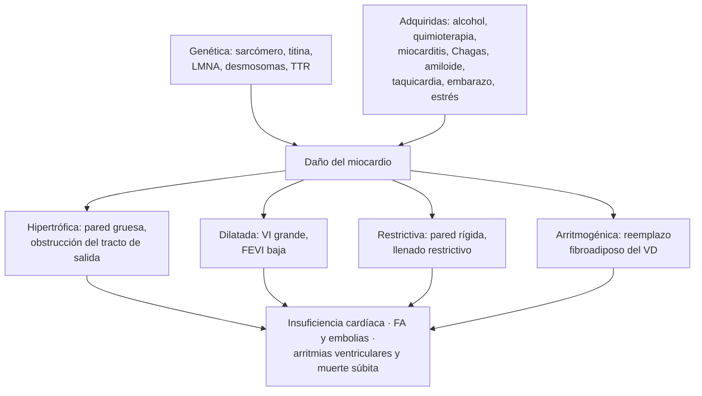
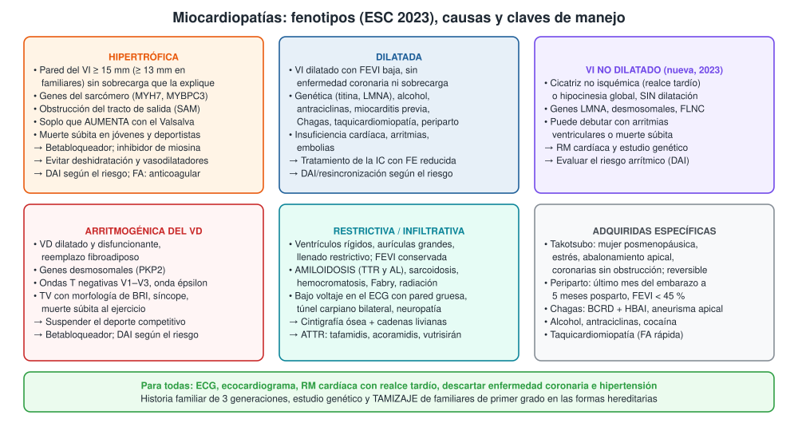
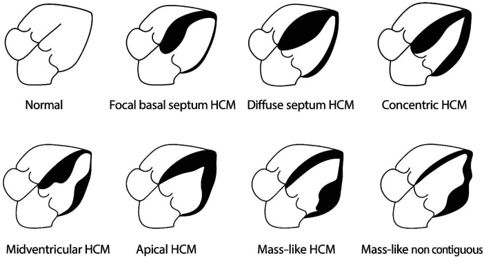
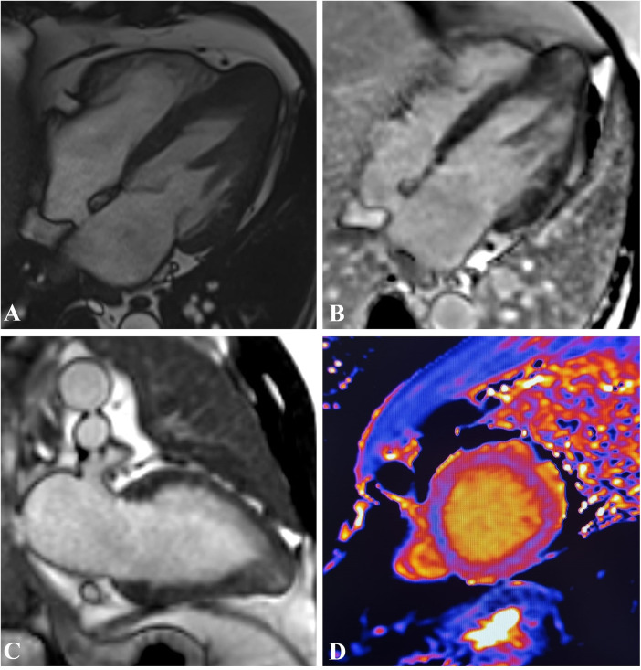

---
tags:
  - Cardiología
---

# Miocardiopatías

**Subespecialidad**
Cardiología · Insuficiencia cardíaca · Electrofisiología · Genética

**Guías principales**
ESC 2023: manejo de las miocardiopatías · AHA/ACC 2024: miocardiopatía hipertrófica · ESC 2025: miocarditis y pericarditis

**Otras fuentes**
Consenso internacional sobre Takotsubo (2018) · Posición de la ESC sobre miocardiopatía periparto (2019) · Declaración AHA sobre miocardiopatía chagásica (2018) · EXPLORER-HCM (mavacamten, 2020) y SEQUOIA-HCM (aficamten, 2024) · ATTR-ACT (tafamidis, 2018), ATTRibute-CM (acoramidis, 2024) y HELIOS-B (vutrisirán, 2025) · Registro chileno de amiloidosis cardíaca RAMICAR (2026)

**GES**
No como tal. Son GES algunas complicaciones y causas relacionadas: **trastornos de conducción que requieren marcapaso** (15 años y más) e **infarto agudo al miocardio**.

**EUNACOM**
1.01.1.020 Miocardiopatías (sospecha, inicial, derivar)

**Revisado**
Octubre 2026

!!! abstract "Resumen en 60 segundos"
    - **Miocardiopatía**: enfermedad del **músculo cardíaco** con alteración estructural y funcional **no explicada** por enfermedad coronaria, hipertensión, valvulopatía ni cardiopatía congénita.
    - **Cinco fenotipos (ESC 2023)**: **hipertrófica**, **dilatada**, **del VI no dilatado** (nueva), **arritmogénica del VD** y **restrictiva**. Muchas son **genéticas**: se estudia a los familiares.
    - **Hipertrófica (MCH)**: pared ≥ **15 mm**, ~ 1 de cada 500 personas. **Soplo que aumenta con el Valsalva**, **muerte súbita** en jóvenes. Betabloqueador; **inhibidores de la miosina** (mavacamten, aficamten) en la obstructiva; DAI según el riesgo.
    - **Dilatada**: VI dilatado con **FEVI baja**. Causas: genética, **alcohol**, quimioterapia, miocarditis, **Chagas**, taquicardia, periparto. Se trata como la **insuficiencia cardíaca con FE reducida**.
    - **Restrictiva / infiltrativa**: sobre todo **amiloidosis** (TTR en el adulto mayor; AL en el mieloma). **Pared gruesa con bajo voltaje** en el ECG. **Cintigrafía ósea + cadenas livianas**.
    - **Adquiridas**: **Takotsubo** (mujer posmenopáusica tras estrés, reversible), **periparto**, **Chagas** (norte de Chile).
    - **Estudio**: ECG, **ecocardiograma**, **RM cardíaca** con realce tardío, descartar enfermedad coronaria, **historia familiar** y estudio genético.
    - En Chile, la **miocardiopatía dilatada** es la primera causa registrada de **muerte súbita cardíaca** (37 %); en menores de 35 años le sigue la **hipertrófica** (16 %).

## Definición

- **Miocardiopatía** (ESC 2023): trastorno del miocardio en que el músculo cardíaco es **estructural y funcionalmente anormal**, en ausencia de enfermedad coronaria, hipertensión, valvulopatía o cardiopatía congénita **suficientes** para explicarlo.
- **Fenotipos** (ESC 2023):
    - **Miocardiopatía hipertrófica (MCH)**: grosor de la pared del VI **≥ 15 mm** en cualquier segmento (≥ **13 mm** en familiares de primer grado) no explicado solo por sobrecarga de presión.
    - **Miocardiopatía dilatada (MCD)**: **dilatación del VI** con **disfunción sistólica** global, sin enfermedad coronaria ni sobrecarga que la expliquen.
    - **Miocardiopatía del VI no dilatado** (*NDLVC*, nueva en 2023): **cicatriz no isquémica** o reemplazo graso del VI, con o sin hipocinesia global, **sin dilatación**.
    - **Miocardiopatía arritmogénica del VD (MAVD)**: dilatación y disfunción del **VD** con **reemplazo fibroadiposo** y arritmias ventriculares.
    - **Miocardiopatía restrictiva (MCR)**: ventrículos rígidos de tamaño normal o pequeño, con **llenado restrictivo** y aurículas dilatadas.
- **Miocarditis**: inflamación del miocardio (por virus, autoinmunidad, fármacos o tóxicos); puede evolucionar a miocardiopatía dilatada (**miocardiopatía inflamatoria**).
- **Takotsubo**: disfunción ventricular **transitoria** (habitualmente abalonamiento apical) gatillada por estrés, sin enfermedad coronaria obstructiva que la explique.
- **Miocardiopatía periparto**: insuficiencia cardíaca con **FEVI < 45 %** en el **último mes del embarazo** o en los **meses siguientes al parto**, sin otra causa.

## Epidemiología

### Mundial

- **MCH**: ~ **1 de cada 500** adultos (0,2 %); la cardiopatía genética más frecuente. Causa importante de **muerte súbita en jóvenes y deportistas**.
- **MCD**: causa frecuente de insuficiencia cardíaca en adultos jóvenes y de **trasplante cardíaco**. Hasta un tercio tiene una causa **genética** (la más frecuente, variantes truncantes de la **titina**).
- **Amiloidosis por transtiretina (ATTR) de tipo silvestre**: subdiagnosticada; afecta sobre todo a **hombres > 70 años** y se encuentra en una proporción importante de los pacientes con insuficiencia cardíaca con FE preservada y estenosis aórtica del adulto mayor.
- **Takotsubo** (consenso 2018):
    - **1–3 %** de los pacientes con sospecha de infarto con supradesnivel del ST (**5–6 %** en las mujeres).
    - ~ **90 % mujeres**, edad media de 67–70 años.
- **Miocardiopatía periparto**: más frecuente en mujeres de ascendencia africana, con preeclampsia, embarazo múltiple y edad materna mayor. Hasta **20 %** tiene una base genética (titina).
- **Enfermedad de Chagas**: causa importante de insuficiencia cardíaca, arritmias, ACV y muerte súbita en Latinoamérica.

### Chile

!!! chile "Datos nacionales"
    - **Muerte súbita cardíaca en Chile 2010–2020** (Vergara 2025, datos DEIS):
        - **12.481** muertes súbitas cardíacas (**1,1 %** del total de muertes), con tendencia a la baja en la población general.
        - Causas: **miocardiopatía dilatada 37 %**, disección aórtica 17 % y bloqueo AV completo 10 %.
        - **Menores de 35 años**: **dilatada 33 %**, **hipertrófica 16 %** y disección aórtica 11 %. En este grupo **no** bajó la mortalidad.
    - **Registro de amiloidosis cardíaca de Santiago (RAMICAR, 2026)**: 60 pacientes, edad media **68 años**.
        - **36 AL** y **24 TTR** (10 con mutación).
        - Banderas rojas más frecuentes: alteración del strain (97 %), insuficiencia cardíaca (95 %), llenado restrictivo (72 %), patrón de seudoinfarto en el ECG (62 %), troponina elevada (75 %).
        - **Acceso a terapias específicas**: **87 %** en la AL frente a solo **17 %** en la TTR.
    - **Enfermedad de Chagas**: endémica en el **norte y centro-norte** (Arica a O'Higgins). La miocardiopatía chagásica se sospecha con **bloqueo de rama derecha + hemibloqueo anterior izquierdo**, arritmias ventriculares o **aneurisma apical**.
    - El primer **desfibrilador implantable** en Chile se puso en 1994 a un paciente con **MCH** que había sobrevivido a dos paros cardíacos.

## Etiología y factores de riesgo

| Fenotipo | Causas genéticas | Causas adquiridas |
|---|---|---|
| **Hipertrófica** | **Sarcómero** (MYH7, MYBPC3; herencia autosómica dominante) | Fenocopias: **amiloidosis**, **Fabry**, Danon, ataxia de Friedreich, atletas, hipertensión |
| **Dilatada** | **Titina** (TTN), **LMNA** (alto riesgo arrítmico), FLNC, desmosomales, distrofias musculares | **Alcohol**, **antraciclinas**, trastuzumab, cocaína, **miocarditis**, **Chagas**, **taquicardiomiopatía**, **periparto**, hipotiroidismo, déficit de tiamina, VIH, inhibidores de checkpoint |
| **VI no dilatado** | LMNA, desmosomales, FLNC, DSP | Miocarditis previa, sarcoidosis |
| **Arritmogénica del VD** | **Desmosomales** (PKP2, DSP, DSG2) | El **ejercicio intenso** acelera la enfermedad |
| **Restrictiva** | TTR variante, Fabry, hemocromatosis hereditaria | **Amiloidosis AL** y **TTR silvestre**, sarcoidosis, radiación, fibrosis endomiocárdica, síndrome hipereosinofílico |
| **Takotsubo** | — | **Estrés emocional o físico** (cirugía, infección, ACV, asma), feocromocitoma, catecolaminas |

## Fisiopatología

- **MCH**:
    - Mutaciones del sarcómero → **hipercontractilidad** y desorganización de los miocitos, fibrosis.
    - **Obstrucción dinámica del tracto de salida del VI**: el septum engrosado y el **movimiento sistólico anterior (SAM)** de la válvula mitral obstruyen el flujo. Causa además **insuficiencia mitral**.
    - La obstrucción **aumenta** cuando baja la precarga o la poscarga o sube la contractilidad: **Valsalva**, ponerse de pie, deshidratación, **vasodilatadores**, taquicardia.
    - **Disfunción diastólica** e isquemia microvascular.
    - **Arritmias ventriculares** por fibrosis → muerte súbita.
- **MCD**: pérdida de miocitos y fibrosis → dilatación y **FEVI baja** → activación neurohormonal (sistema renina-angiotensina-aldosterona, simpático) → remodelado progresivo. Ver [Insuficiencia cardíaca](insuficiencia-cardiaca.md).
- **Restrictiva (amiloidosis)**: depósito extracelular de **fibrillas amiloides** (transtiretina mal plegada o cadenas livianas) → pared gruesa y rígida, llenado restrictivo, **bajo gasto** y arritmias. El ECG muestra **bajo voltaje** porque el depósito no es músculo.
- **MAVD**: fallas de los **desmosomas** (uniones entre miocitos) → muerte celular con el estrés mecánico (ejercicio) → **reemplazo fibroadiposo** → TV por reentrada.
- **Takotsubo**: descarga de **catecolaminas** → aturdimiento miocárdico (sobre todo apical) y disfunción microvascular. **Reversible** en días a semanas.
- **Periparto**: estrés oxidativo que corta la **prolactina** en un fragmento cardiotóxico (base del uso de **bromocriptina**) + predisposición genética.
- **Chagas**: miocarditis crónica por *Trypanosoma cruzi* con daño del sistema de conducción y del sistema nervioso autónomo, fibrosis y aneurisma apical.

*Figura 1. Mecanismos y consecuencias de las miocardiopatías. Esquema propio basado en la guía ESC 2023.*

## Clasificación

<figure markdown>
{ loading=lazy }
<figcaption>Figura 2. Fenotipos de miocardiopatía, causas y claves de manejo. Esquema propio basado en la guía ESC 2023, la guía AHA/ACC 2024 de MCH y los consensos de Takotsubo y miocardiopatía periparto.</figcaption>
</figure>

**MCH según la obstrucción** (gradiente del tracto de salida del VI en reposo o con maniobras):

| Tipo | Gradiente | Implicancia |
|---|---|---|
| **No obstructiva** | < 30 mmHg en reposo y con maniobras | Síntomas por disfunción diastólica y arritmias |
| **Obstructiva latente** | < 30 en reposo, **≥ 30 mmHg** con Valsalva o ejercicio | Evaluar con ecocardiograma de esfuerzo |
| **Obstructiva** | **≥ 30 mmHg** en reposo (significativa **≥ 50 mmHg**) | Candidata a fármacos, inhibidores de miosina o reducción septal si hay síntomas |

**Amiloidosis cardíaca**:

| Tipo | Proteína | Paciente típico | Tratamiento |
|---|---|---|---|
| **ATTR silvestre** | Transtiretina normal | Hombre > 70 años, **túnel carpiano bilateral**, estenosis del canal lumbar | Estabilizadores (tafamidis, acoramidis) o silenciadores (vutrisirán) |
| **ATTR variante** | Transtiretina mutada | Antecedente familiar, **polineuropatía** | Igual + estudio familiar |
| **AL** | Cadenas livianas (gammapatía monoclonal) | Mieloma o gammapatía, proteinuria, macroglosia | **Hematología urgente** (quimioterapia): evolución rápida |

## Clínica

- **Insuficiencia cardíaca**: disnea, ortopnea, fatiga, edema (ver [Insuficiencia cardíaca](insuficiencia-cardiaca.md)).
- **Arritmias**: palpitaciones, **FA**, **síncope**, **muerte súbita**.
- **Dolor torácico**: angina en la MCH (isquemia microvascular), Takotsubo.
- **Embolias**: trombos en el VI dilatado o en la FA.
- **Por fenotipo**:
    - **MCH**:
        - Disnea de esfuerzo, angina, **síncope de esfuerzo** o posprandial.
        - **Soplo sistólico eyectivo** en el borde esternal izquierdo que **aumenta con el Valsalva y al ponerse de pie** y disminuye en cuclillas (lo contrario de la estenosis aórtica).
        - Muchos son **asintomáticos** y se diagnostican por un ECG o por estudio familiar.
    - **MCD**: insuficiencia cardíaca progresiva, galope (R3), soplo de insuficiencia mitral funcional.
    - **Amiloidosis**: **insuficiencia cardíaca con FE preservada** que tolera mal los betabloqueadores y los antihipertensivos, **hipotensión ortostática**, **túnel carpiano bilateral**, neuropatía, **rotura del tendón del bíceps**; en la AL, **macroglosia**, púrpura periorbitaria y proteinuria.
    - **MAVD**: palpitaciones, síncope o **muerte súbita durante el ejercicio** en jóvenes.
    - **Takotsubo**: **dolor torácico** y cambios del ECG que **simulan un infarto**, tras un estrés emocional (duelo, discusión) o físico, en una **mujer posmenopáusica**.
    - **Periparto**: disnea, ortopnea y edema en el **último mes del embarazo** o en el **posparto** (fácil de confundir con síntomas normales del embarazo).
    - **Chagas**: bloqueos (BCRD + HBAI, bloqueo AV), arritmias ventriculares, insuficiencia cardíaca, embolias, muerte súbita; antecedente de vivir en zona endémica.

## Diagnóstico

!!! guia "Evaluación del paciente con sospecha de miocardiopatía (ESC 2023)"
    1. **Anamnesis** con **árbol familiar de 3 generaciones** (muerte súbita, insuficiencia cardíaca, marcapasos o trasplante en jóvenes).
    2. **Examen físico** y signos extracardíacos (neuromusculares, cutáneos, oculares, renales).
    3. **ECG** y **Holter**.
    4. **Ecocardiograma** (fenotipo, FEVI, gradiente del tracto de salida, función diastólica).
    5. **RM cardíaca con realce tardío de gadolinio** en todos los pacientes al inicio (clase I): caracteriza el tejido (fibrosis, edema, infiltración) y orienta la causa.
    6. **Laboratorio** dirigido (ver más abajo) y **descartar enfermedad coronaria** cuando corresponda.
    7. **Estudio genético** del paciente y, si se encuentra una variante patogénica, **en cascada** a los familiares.
    8. **Tamizaje clínico** (ECG y ecocardiograma) de los **familiares de primer grado**.

- **MCH**:
    - **Ecocardiograma o RM**: pared ≥ 15 mm (≥ 13 mm en familiares), con o sin obstrucción.
    - **Ecocardiograma con maniobras** (Valsalva, bipedestación, ejercicio) si el gradiente en reposo es < 50 mmHg y hay síntomas.
    - Diferenciar de la **hipertrofia del deportista** y de la **hipertensiva** (y buscar fenocopias: amiloidosis, Fabry).
- **Amiloidosis** (algoritmo no invasivo):
    1. **Sospecha** (banderas rojas): pared ≥ 12 mm con bajo voltaje, insuficiencia cardíaca con FE preservada, estenosis aórtica de bajo flujo, túnel carpiano bilateral, troponina persistentemente elevada.
    2. **Cadenas livianas libres en suero**, **inmunofijación** en suero y orina (descartar AL).
    3. **Cintigrafía ósea** (pirofosfato, DPD o HMDP): captación cardíaca **grado 2–3** **sin** proteína monoclonal = **ATTR** **sin biopsia**.
    4. Si hay proteína monoclonal: **biopsia** (hematología).
    5. ATTR confirmada: **estudio genético** de TTR.
- **Takotsubo**: **coronariografía** (o angio-TC) para descartar un infarto. Ventriculografía o ecocardiograma con **abalonamiento apical** que excede el territorio de una coronaria; RM sin realce tardío isquémico. Recuperación de la función en semanas.
- **Miocardiopatía periparto**: **NT-proBNP**, ECG y **ecocardiograma** (FEVI < 45 %) en toda embarazada o puérpera con disnea; descartar TEP, infarto y preeclampsia.
- **Chagas**: **serología** para *T. cruzi* (dos técnicas distintas) en pacientes de zonas endémicas.

## Laboratorio

| Examen | Interpretación |
|---|---|
| **NT-proBNP / BNP** | Elevado en la insuficiencia cardíaca; **desproporcionadamente alto** en la amiloidosis |
| **Troponina** | Elevada en miocarditis, Takotsubo y, de forma **persistente**, en la amiloidosis |
| **Cadenas livianas libres en suero, inmunofijación** | **Amiloidosis AL** (descartar siempre antes de diagnosticar ATTR) |
| **TSH** | Hipo e hipertiroidismo |
| **Ferritina y saturación de transferrina** | Hemocromatosis |
| **Serología para Chagas** | Pacientes de zonas endémicas |
| **CK** | Distrofias musculares, miositis |
| **Función renal, proteinuria** | Amiloidosis, Fabry |
| **Actividad de α-galactosidasa A** | **Fabry** (hombres con hipertrofia, insuficiencia renal, dolor neuropático) |
| **VIH**, tiamina | Causas específicas de MCD |
| **Estudio genético** | Formas hereditarias; define el riesgo (LMNA) y permite estudiar a la familia |

## Imágenes

- **ECG**: casi siempre anormal.
    - **MCH**: criterios de **HVI**, **ondas T negativas** profundas (gigantes en la variante **apical**), ondas Q septales.
    - **MCD**: bloqueo de rama izquierda, FA.
    - **Amiloidosis**: **bajo voltaje** con pared gruesa, **seudoinfarto**, bloqueos.
    - **MAVD**: **T negativas en V1–V3**, **onda épsilon**, extrasístoles con morfología de BRI.
    - **Chagas**: **BCRD + HBAI**, bloqueo AV.
- **Ecocardiograma**: fenotipo, FEVI, gradiente del tracto de salida, SAM, función diastólica, strain (en la amiloidosis, **respeto del ápex**).
- **RM cardíaca**: realce tardío (fibrosis), mapas T1 y T2, volumen extracelular. Patrones: parcheado en los puntos de unión del VD (MCH), mesocárdico septal (MCD, LMNA), **subendocárdico difuso** (amiloidosis), inferolateral (Fabry).
- **Cintigrafía ósea** (pirofosfato, DPD): diagnóstico de ATTR.
- **Coronariografía o angio-TC coronaria**: descartar la causa isquémica.

<figure markdown>
{ loading=lazy }
<figcaption>Figura 3. Fenotipos de la miocardiopatía hipertrófica (en negro, el segmento hipertrófico): septal basal focal, septal difusa, concéntrica, medioventricular, apical y en forma de masa. Tomada de Maggialetti N, Scardapane A, Muscogiuri E, et al. <em>Cardiac imaging in hypertrophic cardiomyopathy and cardiac amyloidosis: a narrative review.</em> Front Cardiovasc Med. 2026;13:1752135 (figura 1). Licencia CC BY 4.0.</figcaption>
</figure>

<figure markdown>
{ loading=lazy }
<figcaption>Figura 4. Miocardiopatía hipertrófica obstructiva en la RM cardíaca de un paciente de 47 años: engrosamiento asimétrico del septum interventricular (máximo 24 mm) con obstrucción del tracto de salida del VI. Tomada de Maggialetti N, Scardapane A, Muscogiuri E, et al. <em>Cardiac imaging in hypertrophic cardiomyopathy and cardiac amyloidosis: a narrative review.</em> Front Cardiovasc Med. 2026;13:1752135 (figura 4). Licencia CC BY 4.0.</figcaption>
</figure>

## Diagnóstico diferencial

| Diagnóstico | Diferencias |
|---|---|
| **Cardiopatía isquémica** | Antecedentes coronarios, alteraciones segmentarias en el territorio de una arteria, realce tardío **subendocárdico** en la RM; coronariografía |
| **Cardiopatía hipertensiva** | HTA de larga data, hipertrofia concéntrica moderada (en general < 15 mm), regresa con el control de la presión |
| **Corazón de deportista** | Hipertrofia leve (≤ 13–15 mm) con cavidad grande, buena función diastólica; **regresa** con el desentrenamiento |
| **Estenosis aórtica** | Soplo que **disminuye** con el Valsalva; válvula calcificada en el ecocardiograma (puede coexistir con amiloidosis) |
| **Valvulopatía mitral primaria** | Lesión estructural de la válvula en el ecocardiograma |
| **Infarto agudo** (vs Takotsubo) | Lesión coronaria culpable en la coronariografía |
| **Miocarditis aguda** | Pródromo viral, troponina alta, edema en la RM, puede evolucionar a MCD |
| **Pericarditis constrictiva** (vs restrictiva) | Pericardio engrosado o calcificado, interdependencia ventricular, NT-proBNP bajo |

## Tratamiento

### Medidas comunes

- **Derivar a cardiología** (centro de miocardiopatías o insuficiencia cardíaca).
- **Insuficiencia cardíaca con FE reducida** (MCD, MCVINoD, fases avanzadas): **tratamiento cuádruple** (betabloqueador, ARNI/IECA/ARA-II, antagonista de mineralocorticoides, iSGLT2) y dispositivos según las guías de [insuficiencia cardíaca](insuficiencia-cardiaca.md).
- **FA**: anticoagular. En la **MCH** y la **amiloidosis** se anticoagula **siempre**, **sin importar el CHA₂DS₂-VA**.
- **Prevención de la muerte súbita**: **desfibrilador implantable (DAI)** según el riesgo de cada fenotipo (sobreviviente de paro, TV sostenida, FEVI ≤ 35 % persistente, genes de alto riesgo como **LMNA**, cicatriz extensa en la RM).
- **Ejercicio**: individualizado. Evitar el deporte competitivo intenso en la **MAVD**; en la MCH, la guía AHA 2024 permite el ejercicio de intensidad leve a moderada tras una evaluación experta.
- **Estudio y consejo genético** de la familia.
- **Abstinencia total de alcohol** en la miocardiopatía alcohólica; suspender cardiotóxicos.
- **Trasplante cardíaco** o asistencia ventricular en la enfermedad avanzada.

### Miocardiopatía hipertrófica obstructiva sintomática

!!! dosis "Tratamiento farmacológico de la MCH obstructiva"
    | Línea | Fármaco | Dosis habitual | Comentarios |
    |---|---|---|---|
    | **Primera** | **Betabloqueador** sin efecto vasodilatador (bisoprolol, metoprolol, propranolol) | Bisoprolol 2,5–10 mg/día; metoprolol 50–200 mg/día | Titular a FC de reposo ~ 60 lpm |
    | **Alternativa** | **Verapamilo** o diltiazem | Verapamilo 80–120 mg cada 8 horas | Si no tolera el betabloqueador; **evitar** con gradiente muy alto e hipotensión |
    | **Segunda** | **Inhibidor de la miosina cardíaca**: **mavacamten** o **aficamten** | Mavacamten 2,5–15 mg/día ajustado por ecocardiograma | Reduce la hipercontractilidad y el gradiente; **controlar la FEVI** (suspender si baja de 50 %); centro experto |
    | **Segunda** | **Disopiramida** | 100–250 mg cada 12 horas | Efectos anticolinérgicos; alarga el QT |

    - **Evitar**: **deshidratación**, **vasodilatadores** (nitratos, inhibidores de PDE5, dihidropiridinas), **digoxina** y dosis altas de diuréticos: **aumentan la obstrucción**.
    - **Hipotensión aguda** en la MCH obstructiva: **volumen** y **fenilefrina**; **no** usar inótropos.

- **Reducción septal** (miectomía quirúrgica o ablación septal con alcohol) en centros con experiencia, si persisten los síntomas con **gradiente ≥ 50 mmHg** pese al tratamiento médico.
- **DAI**: sobrevivientes de paro o TV sostenida; en prevención primaria según el **riesgo estimado de muerte súbita a 5 años** (calculadora HCM Risk-SCD) y marcadores como el realce tardío extenso, el aneurisma apical o la FEVI < 50 %.

### Amiloidosis cardíaca

- **ATTR**:
    - **Tafamidis** (ATTR-ACT 2018): menor mortalidad (29,5 % frente a 42,9 %; HR 0,70) y menos hospitalizaciones.
    - **Acoramidis** (ATTRibute-CM 2024): beneficio en el compuesto de muerte, hospitalización, NT-proBNP y test de marcha.
    - **Vutrisirán** 25 mg SC cada 12 semanas (HELIOS-B 2025): **silencia** la producción hepática de TTR; menos muerte y eventos (HR 0,72).
- **AL**: **derivación urgente a hematología** (quimioterapia basada en daratumumab, bortezomib).
- **Medidas de soporte**: diuréticos con cuidado (precarga dependiente); **evitar** dosis altas de betabloqueadores, IECA y **digoxina** (se une a las fibrillas); marcapaso si hay bloqueo AV; anticoagular la FA.

### Otras miocardiopatías

- **Arritmogénica del VD**: suspender el deporte competitivo, **betabloqueador**, DAI según el riesgo, ablación de las TV recurrentes.
- **Takotsubo**:
    - Manejo de **soporte**; betabloqueador e IECA si no hay contraindicación.
    - Si hay **obstrucción del tracto de salida** con shock: **evitar inótropos** (empeoran la obstrucción); volumen y betabloqueador cauteloso.
    - Anticoagular si hay **trombo** en el VI.
- **Periparto**:
    - Tratamiento de la insuficiencia cardíaca **respetando el embarazo** (en la embarazada: **no** IECA, ARA-II, ARNI ni antagonistas de mineralocorticoides; usar betabloqueador, hidralazina-nitratos, diuréticos).
    - **Bromocriptina** (2,5 mg cada 12 horas por 2 semanas y luego 2,5 mg/día por 6 semanas en los casos graves) **con anticoagulación** profiláctica.
    - Contraindicar nuevos embarazos si la FEVI no se recupera.
- **Chagas**: tratamiento de la insuficiencia cardíaca y de las arritmias (amiodarona, DAI), anticoagulación si hay aneurisma con trombo o embolias. El **benznidazol** no frena la miocardiopatía ya establecida; se indica en la infección aguda, en niños y en adultos sin cardiopatía avanzada (infectología).
- **Taquicardiomiopatía**: control de la frecuencia o del ritmo (ablación de la FA o de la taquicardia); la FEVI suele recuperarse.
- **Miocarditis** (ESC 2025): hospitalizar si hay disfunción ventricular, arritmias o insuficiencia cardíaca; **RM cardíaca**; biopsia endomiocárdica en las formas fulminantes o graves; **restringir el ejercicio intenso** por 3–6 meses. Ver [Pericarditis y taponamiento](pericarditis-y-taponamiento.md).

!!! alarma "Derivar con urgencia"
    - **Síncope** de esfuerzo o inexplicado, **TV**, sobreviviente de paro.
    - **Insuficiencia cardíaca** descompensada o shock (miocarditis fulminante, periparto, Takotsubo con obstrucción).
    - **Amiloidosis AL** (evolución rápida; hematología).
    - **Muerte súbita** de un familiar joven: estudiar a toda la familia.

## Complicaciones

- **Insuficiencia cardíaca** progresiva, shock cardiogénico.
- **Muerte súbita** por arritmias ventriculares (MCH, MAVD, MCD por LMNA, Chagas, sarcoidosis).
- **Fibrilación auricular** y **embolias** (ACV); trombo en el VI.
- **Bloqueos AV** (amiloidosis, sarcoidosis, Chagas, LMNA).
- **Insuficiencia mitral** (SAM en la MCH, funcional en la MCD).
- **Endocarditis** sobre la válvula mitral en la MCH obstructiva.
- **Takotsubo**: obstrucción del tracto de salida, shock, trombo apical, rotura (rara), recurrencia.

## Pronóstico y seguimiento

- **MCH**: la mayoría tiene una **expectativa de vida casi normal** con el tratamiento actual; riesgo de muerte súbita bajo (< 1 % al año) que se estratifica de forma individual.
- **MCD**: variable; muchos **mejoran** con el tratamiento óptimo (miocardiopatía con FE recuperada). Peor pronóstico con LMNA, fibrosis extensa y causas no reversibles.
- **Amiloidosis**: la **AL** no tratada tiene mal pronóstico a corto plazo; la **ATTR** progresa más lento y los fármacos actuales reducen la mortalidad.
- **Takotsubo**: recuperación de la función en semanas, pero con mortalidad hospitalaria no despreciable y riesgo de recurrencia.
- **Periparto**: alta probabilidad de **recuperación** parcial o total; riesgo alto en un nuevo embarazo si la FEVI no se normalizó.
- **Seguimiento**:
    - Control clínico, **ECG, Holter y ecocardiograma** periódicos (cada 1–2 años en los estables) y **reestratificación del riesgo de muerte súbita**.
    - **Familiares de primer grado** de las formas genéticas: ECG y ecocardiograma desde la adolescencia y en forma periódica (o según el resultado del estudio genético).

## Perlas para el internado

!!! perla "Para recordar en la sala"
    - **Joven con síncope de esfuerzo + soplo que aumenta con el Valsalva** = **MCH obstructiva** hasta demostrar lo contrario.
    - En la **MCH obstructiva** evite los **nitratos**, la deshidratación, los vasodilatadores y la digoxina; trate la hipotensión con **volumen y fenilefrina**.
    - **Pared gruesa + bajo voltaje en el ECG** = **amiloidosis** hasta demostrar lo contrario. Pida **cadenas livianas** antes que la cintigrafía.
    - Hombre > 70 años con **IC con FE preservada**, **túnel carpiano bilateral** y estenosis del canal lumbar: piense en **ATTR**.
    - **Mujer posmenopáusica con "infarto" tras un duelo** y coronarias normales: **Takotsubo**.
    - **Puérpera con disnea y edema**: pida **NT-proBNP y ecocardiograma** (miocardiopatía periparto).
    - **Paciente del norte de Chile con BCRD + HBAI**: serología para **Chagas**.
    - Miocardiopatía dilatada en un bebedor: la **abstinencia** puede normalizar la FEVI.
    - **FA en MCH o amiloidosis**: anticoagular **siempre**.
    - Ante una miocardiopatía, pregunte por **muerte súbita en la familia** y derive a los familiares a tamizaje.

## Preguntas de repaso

??? repaso "1. Hombre de 19 años, futbolista, presenta un síncope durante un partido. Tiene un soplo sistólico en el borde esternal izquierdo que aumenta al ponerse de pie y con el Valsalva. Un tío murió súbitamente a los 35 años. ¿Qué sospecha y qué hace?"
    - **Miocardiopatía hipertrófica obstructiva** con **síncope de esfuerzo** (alto riesgo).
    - **ECG** (HVI, T negativas) y **ecocardiograma** (pared ≥ 15 mm, SAM, gradiente del tracto de salida); **RM cardíaca** y Holter.
    - **Suspender el deporte** y derivar con urgencia a cardiología: estratificar el riesgo de muerte súbita (síncope inexplicado y muerte súbita familiar → probable **DAI**).
    - **Betabloqueador**; evitar deshidratación y vasodilatadores.
    - **Estudio genético** y **tamizaje de los familiares de primer grado**.

??? repaso "2. Hombre de 76 años con insuficiencia cardíaca con FE preservada, cirugía de túnel carpiano bilateral y estenosis del canal lumbar. El ECG muestra bajo voltaje y el ecocardiograma, pared de 17 mm. ¿Cuál es el diagnóstico más probable y cómo lo confirma?"
    - **Amiloidosis cardíaca por transtiretina de tipo silvestre (ATTR)**.
    - Primero **cadenas livianas libres en suero e inmunofijación** en suero y orina (descartar AL).
    - **Cintigrafía ósea** (pirofosfato o DPD): captación **grado 2–3** sin proteína monoclonal confirma ATTR **sin biopsia**.
    - **Estudio genético** de TTR. Tratamiento: **tafamidis**, **acoramidis** o **vutrisirán** (especialista); evitar la digoxina y las dosis altas de betabloqueadores.

??? repaso "3. Mujer de 68 años consulta por dolor torácico opresivo 2 horas después del funeral de su esposo. El ECG muestra supradesnivel del ST en V2–V5 y la troponina está elevada. La coronariografía no muestra lesiones obstructivas; la ventriculografía muestra abalonamiento apical. ¿Diagnóstico y manejo?"
    - **Síndrome de Takotsubo** (miocardiopatía por estrés).
    - **Hospitalizar** con monitoreo: riesgo de arritmias, shock, **obstrucción del tracto de salida** y **trombo apical**.
    - Manejo de **soporte**; betabloqueador e IECA si la presión lo permite; anticoagular si hay trombo.
    - Si hay obstrucción con hipotensión: **evitar inótropos**.
    - Ecocardiograma de control: la función se **recupera en semanas**.

??? repaso "4. Puérpera de 32 años, 3 semanas después de una cesárea por preeclampsia, consulta por disnea, ortopnea y edema. NT-proBNP 3.200 pg/mL; ecocardiograma con VI levemente dilatado y FEVI de 30 %. ¿Diagnóstico y tratamiento?"
    - **Miocardiopatía periparto** (FEVI < 45 % en el posparto sin otra causa).
    - **Tratamiento de la insuficiencia cardíaca con FE reducida** (en el posparto se pueden usar IECA compatibles con la lactancia como enalapril, betabloqueador, antagonista de mineralocorticoides, diuréticos).
    - Considerar **bromocriptina** + **anticoagulación** (especialista); suspende la lactancia.
    - Seguimiento con ecocardiograma; consejería sobre **futuros embarazos** (alto riesgo si la FEVI no se recupera).

??? repaso "5. Hombre de 55 años, nacido en Arica, con palpitaciones y un episodio de síncope. El ECG muestra bloqueo de rama derecha con hemibloqueo anterior izquierdo y extrasístoles ventriculares frecuentes. El ecocardiograma muestra un aneurisma apical. ¿Qué sospecha?"
    - **Miocardiopatía chagásica** (zona endémica, BCRD + HBAI, arritmias ventriculares, aneurisma apical).
    - **Serología para *Trypanosoma cruzi*** (dos técnicas).
    - Holter, RM cardíaca y derivación a cardiología: riesgo de **muerte súbita** (evaluar DAI) y de embolias (trombo en el aneurisma).
    - Notificar y estudiar a la familia (transmisión vertical).

??? repaso "6. Hombre de 48 años, bebedor de 10 tragos al día por 15 años, con insuficiencia cardíaca y FEVI de 25 %. La coronariografía es normal. ¿Qué diagnóstico plantea y cuál es la medida más importante?"
    - **Miocardiopatía dilatada alcohólica** (descartadas la enfermedad coronaria y otras causas).
    - **Abstinencia total** de alcohol (puede normalizar la FEVI) + **tiamina** y apoyo para la dependencia.
    - **Tratamiento cuádruple** de la insuficiencia cardíaca con FE reducida.
    - Reevaluar la FEVI a los 3–6 meses antes de decidir un DAI.

## Referencias

1. Arbelo E, Protonotarios A, Gimeno JR, et al. 2023 ESC Guidelines for the management of cardiomyopathies. *Eur Heart J.* 2023;44(37):3503–3626. doi:[10.1093/eurheartj/ehad194](https://doi.org/10.1093/eurheartj/ehad194)
2. Ommen SR, Ho CY, Asif IM, et al. 2024 AHA/ACC/AMSSM/HRS/PACES/SCMR guideline for the management of hypertrophic cardiomyopathy. *J Am Coll Cardiol.* 2024;83(23):2324–2405. doi:[10.1016/j.jacc.2024.02.014](https://doi.org/10.1016/j.jacc.2024.02.014)
3. Schulz-Menger J, Collini V, Gröschel J, et al. 2025 ESC Guidelines for the management of myocarditis and pericarditis. *Eur Heart J.* 2025;46(40):3952–4041. doi:[10.1093/eurheartj/ehaf192](https://doi.org/10.1093/eurheartj/ehaf192)
4. Ghadri JR, Wittstein IS, Prasad A, et al. International expert consensus document on Takotsubo syndrome (part I): clinical characteristics, diagnostic criteria, and pathophysiology. *Eur Heart J.* 2018;39(22):2032–2046. doi:[10.1093/eurheartj/ehy076](https://doi.org/10.1093/eurheartj/ehy076)
5. Bauersachs J, König T, van der Meer P, et al. Pathophysiology, diagnosis and management of peripartum cardiomyopathy: a position statement from the Heart Failure Association of the European Society of Cardiology Study Group on peripartum cardiomyopathy. *Eur J Heart Fail.* 2019;21(7):827–843. doi:[10.1002/ejhf.1493](https://doi.org/10.1002/ejhf.1493)
6. Nunes MCP, Beaton A, Acquatella H, et al. Chagas cardiomyopathy: an update of current clinical knowledge and management: a scientific statement from the American Heart Association. *Circulation.* 2018;138(12):e169–e209. doi:[10.1161/CIR.0000000000000599](https://doi.org/10.1161/CIR.0000000000000599)
7. Olivotto I, Oreziak A, Barriales-Villa R, et al. Mavacamten for treatment of symptomatic obstructive hypertrophic cardiomyopathy (EXPLORER-HCM): a randomised, double-blind, placebo-controlled, phase 3 trial. *Lancet.* 2020;396(10253):759–769. doi:[10.1016/S0140-6736(20)31792-X](https://doi.org/10.1016/S0140-6736(20)31792-X)
8. Maron MS, Masri A, Nassif ME, et al. Aficamten for symptomatic obstructive hypertrophic cardiomyopathy. *N Engl J Med.* 2024;390(20):1849–1861. doi:[10.1056/NEJMoa2401424](https://doi.org/10.1056/NEJMoa2401424)
9. Maurer MS, Schwartz JH, Gundapaneni B, et al. Tafamidis treatment for patients with transthyretin amyloid cardiomyopathy. *N Engl J Med.* 2018;379(11):1007–1016. doi:[10.1056/NEJMoa1805689](https://doi.org/10.1056/NEJMoa1805689)
10. Gillmore JD, Judge DP, Cappelli F, et al. Efficacy and safety of acoramidis in transthyretin amyloid cardiomyopathy. *N Engl J Med.* 2024;390(2):132–142. doi:[10.1056/NEJMoa2305434](https://doi.org/10.1056/NEJMoa2305434)
11. Fontana M, Berk JL, Gillmore JD, et al. Vutrisiran in patients with transthyretin amyloidosis with cardiomyopathy. *N Engl J Med.* 2025;392(1):33–44. doi:[10.1056/NEJMoa2409134](https://doi.org/10.1056/NEJMoa2409134)
12. Maggialetti N, Scardapane A, Muscogiuri E, et al. Cardiac imaging in hypertrophic cardiomyopathy and cardiac amyloidosis: a narrative review. *Front Cardiovasc Med.* 2026;13:1752135. doi:[10.3389/fcvm.2026.1752135](https://doi.org/10.3389/fcvm.2026.1752135)
13. Vergara M, Valderrama P, González Á, et al. Muerte súbita cardíaca: análisis de tendencia según sexo y edad, Chile 2010 a 2020. *Rev Med Chil.* 2025;153(11):760–772. doi:[10.4067/s0034-98872025001100760](https://doi.org/10.4067/s0034-98872025001100760)
14. Álvarez G J, Verdugo T F, Jalil M J, et al. Registro de amiloidosis cardiaca en Santiago de Chile (RAMICAR). Resultados a 3 años de seguimiento. *Rev Med Chil.* 2026;154(4):508–520. doi:[10.4067/s0034-98872026000400508](https://doi.org/10.4067/s0034-98872026000400508)
15. Zalaquett R, Fajuri A, Irarrázaval MJ, et al. Miocardiopatía hipertrófica y doble episodio de muerte súbita recuperada. Primer cardiovertor desfibrilador automático implantable colocado en Chile. *Rev Med Chil.* 1994;122(10):1171–1177. [PubMed](https://pubmed.ncbi.nlm.nih.gov/7659885/)
