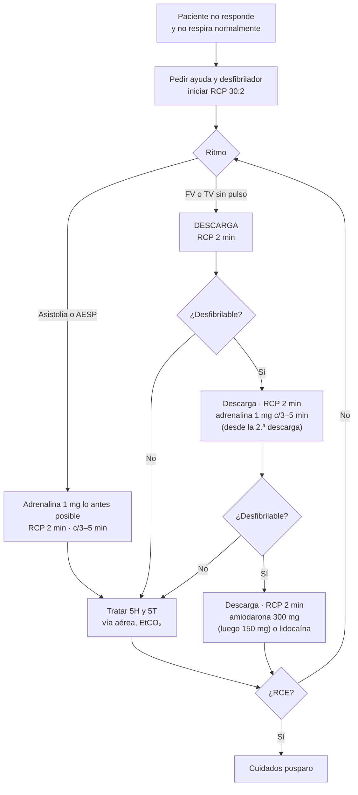

---
tags:
  - Cardiología
  - Urgencia
---

# Paro cardiorrespiratorio y arritmias con compromiso hemodinámico

**Subespecialidad**
Cardiología · Medicina de urgencia · Medicina intensiva

**Guías principales**
AHA 2025: guías de reanimación cardiopulmonar y atención cardiovascular de emergencia (soporte vital básico, avanzado y cuidados posparo; *Circulation*, 2025) · ERC 2025: soporte vital avanzado del adulto (*Resuscitation*, 2025) · ERC/ESICM 2025: cuidados posresucitación

**Otras fuentes**
ACC/AHA/HRS 2018: bradicardia y trastornos de la conducción · ESC 2019: taquicardias supraventriculares · Ensayos PARAMEDIC2 (2018), ALPS y TTM2 (2021) · Ley 21.156 (Chile, 2019) sobre desfibriladores

**GES**
No como problema propio. El IAM, una causa frecuente de paro, tiene GES

**EUNACOM**
1.01.2.006 y 1.05.2.012 Paro cardiorrespiratorio (específico, completo, derivar) · 1.01.2.009 Taqui y bradiarritmia con compromiso hemodinámico (específico, inicial, derivar)

**Revisado**
Septiembre 2026

!!! abstract "Resumen en 60 segundos"
    - **Paro cardiorrespiratorio (PCR)**: el paciente **no responde** y **no respira normalmente** (el *gasping* no es respirar). Hay que **pedir ayuda**, iniciar las **compresiones de inmediato** y pedir un **desfibrilador**. No perder tiempo buscando el pulso (máximo 10 s).
    - **RCP de alta calidad**:
        - **100–120 compresiones por minuto**, **5–6 cm** de profundidad, **reexpansión completa**.
        - **Mínimas interrupciones**; **30:2** sin vía aérea avanzada.
        - Cambiar al compresor cada 2 minutos.
        - **Evitar la hiperventilación**.
    - **Ritmos desfibrilables** (FV y TV sin pulso):
        1. **Descarga** lo antes posible, y RCP por 2 minutos.
        2. **Adrenalina 1 mg** tras la 2.ª descarga, luego cada 3–5 min.
        3. **Amiodarona 300 mg** tras la 3.ª descarga (luego 150 mg), o lidocaína.
    - **Ritmos no desfibrilables** (asistolia y AESP): **adrenalina 1 mg lo antes posible**, RCP y búsqueda de las **causas reversibles (5H y 5T)**.
    - **Tras la recuperación de la circulación espontánea**:
        - SpO₂ **92–98 %**, PaCO₂ 35–45 mmHg, **PAM ≥ 65 mmHg**.
        - **ECG de 12 derivaciones** (coronariografía si hay SDST).
        - **Control de temperatura** (32–37,5 °C por ≥ 36 h; **evitar la fiebre**).
        - **Pronóstico neurológico** no antes de las **72 h**.
    - **Arritmia con pulso e inestable** (hipotensión, compromiso de conciencia, shock, dolor isquémico o insuficiencia cardíaca aguda):
        - **Taquicardia**: **cardioversión eléctrica sincronizada**.
        - **Bradicardia**: **atropina 1 mg**, y si no responde, **marcapaso transcutáneo** o dopamina o adrenalina en infusión.

## Definición

- **Paro cardiorrespiratorio**: cese de la actividad mecánica cardíaca eficaz. El paciente **no responde**, **no tiene pulso** y **no respira** o sólo tiene *gasping*.
    - **Extrahospitalario (PCREH)** o **intrahospitalario (PCRIH)**.
- **Recuperación de la circulación espontánea (RCE, ROSC)**: vuelve el pulso palpable o hay evidencia de circulación. Se sospecha por un **aumento brusco del EtCO₂** o una PA arterial medible.
- **Arritmia con compromiso hemodinámico (inestable)**: taquicardia o bradicardia **con pulso** que produce **cualquiera** de estos signos:
    1. **Hipotensión** o signos de **shock**.
    2. **Compromiso agudo de conciencia**.
    3. **Dolor torácico isquémico**.
    4. **Insuficiencia cardíaca aguda** (edema pulmonar).
- En general, una taquicardia produce síntomas por sí misma cuando la FC es **> 150 lpm**. Si la FC es menor, buscar otra causa (sepsis, hipovolemia, anemia): la taquicardia sinusal **compensatoria no se cardiovierte**.

## Epidemiología

### Mundial

- El **PCR extrahospitalario** tiene una incidencia de **~ 50–100 por 100.000** habitantes por año. La **sobrevida al alta** es de **~ 8–10 %** en promedio, con grandes diferencias entre sistemas.
- La sobrevida mejora mucho con:
    - La **RCP por testigos**: la duplica o triplica.
    - La **desfibrilación precoz**: cada minuto sin RCP ni desfibrilación reduce la sobrevida en **~ 7–10 %**.
    - El **acceso público a desfibriladores (DEA)**.
- El **PCR intrahospitalario** ocurre en **~ 1–5 por 1.000** ingresos, con sobrevida al alta de **~ 20–25 %**. El ritmo inicial suele ser **no desfibrilable**, y el paro suele estar **precedido** de deterioro fisiológico por horas (de ahí los **equipos de respuesta rápida** y las escalas de alerta temprana).
- **Causas**: en el adulto, la **cardiopatía isquémica** es la principal causa del PCR extrahospitalario. En el hospital predominan la **insuficiencia respiratoria**, la **sepsis**, las **arritmias** y la hemorragia.

### Chile

!!! chile "Datos nacionales"
    - La **Ley 21.156 (2019)** obliga a tener **desfibriladores externos automáticos (DEA)** en los recintos con gran afluencia de público (centros comerciales, terminales, recintos deportivos, establecimientos educacionales, entre otros), con personal capacitado.
    - El número de emergencia para la atención prehospitalaria es el **SAMU 131**. Se recomienda la **RCP guiada por teléfono** por el despachador.
    - La **cardiopatía isquémica** es la **primera causa específica de muerte** en Chile. Muchos pacientes con IAM mueren de muerte súbita antes de llegar al hospital, por lo que la **RCP por testigos** y los **DEA** son la principal oportunidad de sobrevida.
    - El **IAM** tiene **GES**, que incluye la reperfusión, relevante en el posparo con SDST.

## Etiología y factores de riesgo

**Causas reversibles del paro: 5H y 5T** (buscarlas en todo paro, sobre todo en la AESP):

| H | T |
|---|---|
| **Hipovolemia** (hemorragia) | **Neumotórax a tensión** |
| **Hipoxia** | **Taponamiento cardíaco** |
| **Hidrogeniones** (acidosis) | **Tóxicos** (opioides, antidepresivos tricíclicos, betabloqueadores, bloqueadores del calcio, digoxina, anestésicos locales) |
| **Hipo o hiperkalemia** (y otros trastornos metabólicos) | **Trombosis pulmonar** (TEP) |
| **Hipotermia** | **Trombosis coronaria** (IAM) |

**Arritmias**:

- **Taquicardias**:
    - **Supraventriculares**: taquicardia sinusal, FA y flutter auricular, taquicardia por reentrada nodal o por vía accesoria, taquicardia auricular.
    - **Ventriculares**: **TV monomorfa** (cicatriz de un infarto antiguo, miocardiopatías) y **TV polimorfa**. La polimorfa es **isquémica** o se debe a un **QT largo** (*torsades de pointes*: fármacos, hipokalemia, hipomagnesemia).
- **Bradicardias**:
    - Disfunción sinusal.
    - **Bloqueo AV** de 2.º grado Mobitz II y de **3.er grado**.
    - Causas **reversibles**:
        - **IAM inferior**.
        - **Fármacos**: betabloqueadores, bloqueadores del calcio no dihidropiridínicos, **digoxina**, amiodarona, ivabradina.
        - **Hiperkalemia**, hipotiroidismo, hipotermia.
        - **Hipertensión endocraneana** (reflejo de Cushing).
        - **Enfermedad de Chagas**, enfermedad de Lyme.

## Fisiopatología

- En el paro no hay flujo cerebral ni coronario. Las **compresiones torácicas** generan un **~ 25–30 %** del gasto cardíaco normal. Cada interrupción hace caer la **presión de perfusión coronaria**, que tarda varias compresiones en recuperarse. Por eso importan las **mínimas interrupciones**.
- **FV**: su probabilidad de responder a la descarga es máxima en los primeros minutos. Luego el miocardio consume su energía y la FV se vuelve "fina" y resistente, hasta pasar a **asistolia**.
- La **adrenalina** (efecto α) produce vasoconstricción periférica y aumenta la **presión de perfusión coronaria y cerebral**. Aumenta la RCE y la sobrevida (PARAMEDIC2), aunque con un beneficio neurológico menor.
- **Síndrome posparo**:
    - **Daño cerebral hipóxico-isquémico**: la principal causa de muerte tras la RCE.
    - **Disfunción miocárdica** (aturdimiento).
    - **Respuesta inflamatoria sistémica** por la isquemia-reperfusión, similar a la sepsis.
    - La **causa** persistente del paro.

*Figura 1. Algoritmo simplificado del paro cardiorrespiratorio del adulto, basado en AHA 2025 y ERC 2025. Esquema propio.*

## Clasificación

**Ritmos del paro**:

- **Desfibrilables**:
    - **Fibrilación ventricular (FV)**.
    - **Taquicardia ventricular sin pulso**.
- **No desfibrilables**:
    - **Asistolia**.
    - **Actividad eléctrica sin pulso (AESP)**: ritmo organizado en el monitor, pero sin pulso.

<figure markdown>
{ loading=lazy }
<figcaption>Figura 2. Ritmos del paro cardiorrespiratorio: desfibrilables (rojo) y no desfibrilables (azul). Esquema propio.</figcaption>
</figure>

**Taquicardias con pulso**, según el QRS y el ritmo:

| QRS | Regular | Irregular |
|---|---|---|
| **Estrecho (< 120 ms)** | Taquicardia sinusal, **taquicardia por reentrada nodal o por vía accesoria**, flutter con conducción fija, taquicardia auricular | **Fibrilación auricular**, flutter con conducción variable, taquicardia auricular multifocal |
| **Ancho (≥ 120 ms)** | **TV monomorfa** (la más frecuente, sobre todo con cardiopatía), TSV con aberrancia o preexcitación | FA con bloqueo de rama o **preexcitación (WPW)**, **TV polimorfa** o *torsades* |

**Bradicardias**:

| Tipo | ECG | Riesgo |
|---|---|---|
| **Bradicardia sinusal** | P normal antes de cada QRS | Bajo (deportistas, sueño, fármacos) |
| **Bloqueo AV de 1.er grado** | PR > 200 ms | Bajo |
| **Bloqueo AV de 2.º grado Mobitz I** (Wenckebach) | PR que se alarga hasta que una P no conduce | Bajo (nodal; IAM inferior) |
| **Bloqueo AV de 2.º grado Mobitz II** | P que no conducen sin alargamiento previo del PR; QRS a menudo ancho | **Alto**: progresa a bloqueo completo |
| **Bloqueo AV de 3.er grado** (completo) | Disociación AV: P y QRS independientes, escape lento | **Alto**: marcapaso |

## Clínica

- **Paro**:
    - Pérdida brusca de conciencia.
    - **Ausencia de respiración normal**: el ***gasping*** (respiración agónica) aparece en hasta la mitad de los paros y **no** indica que el paciente respira.
    - Sin pulso central (carotídeo o femoral).
    - A veces una **convulsión breve** al inicio: no confundirla con una crisis epiléptica.
- **Pródromos**: dolor torácico, disnea, palpitaciones o síncope en las horas o días previos. En el hospital: deterioro de los signos vitales (taquipnea, hipotensión, compromiso de conciencia).
- **Arritmia inestable**: palpitaciones, **síncope o presíncope**, disnea, dolor torácico, hipotensión, piel fría, confusión.
- **Signos de las causas reversibles**:
    - **Ingurgitación yugular** con ruidos apagados: taponamiento.
    - **Asimetría del murmullo y desviación traqueal**: neumotórax a tensión.
    - Hemorragia, **trauma**.
    - ERC y fístula de diálisis: **hiperkalemia**.
    - Fármacos o intentos suicidas: tóxicos.
    - TVP o cirugía reciente: TEP.

!!! alarma "No perder tiempo"
    - **No busques el pulso más de 10 segundos**. Si dudas, **inicia las compresiones**.
    - **Desfibrila apenas llegue el desfibrilador** si el ritmo es desfibrilable. Retoma las compresiones **de inmediato** después de la descarga, **sin** revisar el pulso.
    - **Interrupciones de < 10 segundos** para analizar el ritmo o intubar.

## Diagnóstico

**Paso 1. Reconocimiento del paro**: no responde + no respira normalmente → activar el código azul o llamar al 131, pedir el desfibrilador e iniciar la RCP.

**Paso 2. Análisis del ritmo** con el monitor o el DEA **cada 2 minutos** (cada ciclo de RCP).

**Paso 3. Monitoreo de la calidad de la RCP**:

- **EtCO₂** por capnografía:
    - **< 10 mmHg** indica una RCP de mala calidad o un mal pronóstico.
    - Un **aumento brusco** (> 35–40 mmHg) sugiere la RCE.
    - También confirma la posición del tubo endotraqueal.
- Presión arterial diastólica, si hay una línea arterial.

**Paso 4. Búsqueda de las causas reversibles (5H y 5T)**:

- Anamnesis rápida con los testigos.
- **Gases con potasio** en el punto de atención.
- **Ecografía** en el punto de atención: taponamiento, neumotórax, dilatación del VD en el TEP, hipovolemia. Se hace **durante la pausa del análisis del ritmo**, sin prolongarla.

**Paso 5. Arritmias con pulso**:

1. **Evaluar la estabilidad**.
2. **ECG de 12 derivaciones** si el paciente está estable; si está inestable, **no retrasar el tratamiento** por el ECG.
3. **Monitor**, oxígeno si la SpO₂ < 92–94 %, vía venosa.

## Laboratorio

| Examen | Uso |
|---|---|
| **Gases arteriales o venosos con electrolitos** | **Potasio** (hiper o hipokalemia), acidosis, lactato, hemoglobina, calcio iónico |
| **Glicemia capilar** | Hipoglicemia |
| **Troponina** | IAM como causa (sube también tras la RCP y las descargas) |
| **Magnesio** | *Torsades de pointes*, arritmias refractarias |
| **Niveles de fármacos y tóxicos** | Digoxina, tricíclicos, etc. |
| **Posparo**: función renal y hepática, lactato seriado, **enolasa neuronal específica** (a las 48–72 h, para el pronóstico) | Síndrome posparo, pronóstico neurológico |

## Imágenes

- **Ecografía en el punto de atención** durante el paro (sin interrumpir la RCP): taponamiento, neumotórax, VD dilatado, actividad cardíaca en la AESP.
- **ECG de 12 derivaciones** tras la RCE: SDST o equivalentes (coronariografía urgente).
- **Radiografía de tórax** tras la RCE: posición del tubo, neumotórax, fracturas costales.
- **TC de cerebro** (y de tórax con angio-TC si se sospecha un TEP) en el posparo sin causa clara. **Hemorragia subaracnoidea**: una causa de paro que se busca en el paciente en coma.
- **Ecocardiograma**: función ventricular posparo, causa del paro.

## Diagnóstico diferencial

| Situación | Claves |
|---|---|
| **Síncope** | Recupera la conciencia en forma espontánea y rápida; tiene pulso |
| **Crisis epiléptica** | Tiene pulso; movimientos tónico-clónicos prolongados. El paro puede iniciarse con mioclonías breves |
| **AESP vs. pseudo-AESP** | En la pseudo-AESP hay actividad cardíaca en la ecografía, pero con un pulso no palpable (shock profundo). Se maneja como un shock, con vasopresores |
| **TV vs. TSV con aberrancia** (taquicardia de QRS ancho) | **Ante la duda, tratar como TV**, sobre todo si hay cardiopatía estructural o un infarto previo. Disociación AV, latidos de fusión y de captura: TV |
| **Taquicardia sinusal compensatoria** | Causa subyacente (fiebre, sepsis, hipovolemia, anemia, dolor, TEP). Tratar la causa; **no** cardiovertir |
| **Artefacto** (temblor, movimientos) | Paciente conciente con pulso; revisar las derivaciones |

## Tratamiento

### Soporte vital básico y avanzado en el paro

!!! guia "AHA 2025 y ERC 2025"
    - **RCP de alta calidad**:
        - Compresiones de **100–120/min**, **5–6 cm** de profundidad, con reexpansión completa.
        - Fracción de compresión > 60–80 %.
        - Relación **30:2** hasta la vía aérea avanzada. Luego, **1 ventilación cada 6 s** (10/min) sin pausar las compresiones.
    - **Desfibrilación** precoz en la FV o la TV sin pulso: una descarga (bifásica de 120–200 J según el equipo, o la máxima), seguida de inmediato de 2 minutos de RCP.
        - La **doble descarga secuencial** y el **cambio de vector** **no** se recomiendan de rutina (AHA 2025).
    - **Acceso vascular**: intentar primero la **vía venosa** periférica. Si falla, la **intraósea** (AHA 2025: tres ensayos no mostraron ventaja de la intraósea inicial).
    - **Adrenalina 1 mg EV cada 3–5 min**:
        - En los **ritmos no desfibrilables**, **lo antes posible**.
        - En los **desfibrilables**, **después de la 2.ª descarga** fallida (ERC: después de la 3.ª).
    - **Antiarrítmicos** en la FV o TV **refractaria** (tras la 3.ª descarga): **amiodarona** o **lidocaína**.
    - **Vía aérea**: basta la bolsa-mascarilla o un dispositivo supraglótico si la ventilación es eficaz. Se intuba si hay un operador experto, **sin interrumpir** las compresiones más de 10 segundos. Confirmar con **capnografía**.
    - **RCP extracorpórea** (ECMO) en pacientes seleccionados, en centros con el recurso.

!!! dosis "Fármacos en el paro del adulto"
    - **Adrenalina 1 mg EV o IO** (1 mL de la ampolla de 1 mg/mL, **diluida**, o 10 mL de una solución de 0,1 mg/mL) **cada 3–5 minutos**, seguida de un bolo de 20 mL de suero.
    - **Amiodarona 300 mg EV** en bolo tras la 3.ª descarga; **150 mg** en una segunda dosis tras la 5.ª.
    - **Lidocaína 1–1,5 mg/kg EV**, luego 0,5–0,75 mg/kg (máximo 3 mg/kg), como alternativa a la amiodarona.
    - **Sulfato de magnesio 1–2 g EV** en la ***torsades de pointes*** o la hipomagnesemia.
    - **Gluconato de calcio 10 %** (30 mL) o **cloruro de calcio 10 %** (10 mL): en la **hiperkalemia**, la hipocalcemia o la intoxicación por bloqueadores del calcio.
    - **Bicarbonato de sodio 1 mEq/kg**: **no de rutina**. Se usa en la **hiperkalemia** y la intoxicación por **tricíclicos**.
    - **Trombólisis** (alteplasa 50 mg o tenecteplase) si se sospecha un **TEP**: continuar la RCP 60–90 minutos después.
    - **Naloxona** en la sospecha de intoxicación por opioides (en un paro, lo prioritario sigue siendo la RCP y la ventilación).

**Cuándo detener la reanimación**:

- Es una decisión del equipo, según:
    - El ritmo, el tiempo sin RCP y la duración del paro.
    - El **EtCO₂ persistentemente < 10 mmHg** tras 20 minutos de RCP avanzada.
    - Las causas y la voluntad previa del paciente.
- Se prolonga en la **hipotermia**, las intoxicaciones, el TEP trombolizado, los niños y cuando hay ECMO disponible.
- **Órdenes de no reanimar**: conversarlas con el paciente y la familia **antes** del deterioro, en los pacientes con enfermedad avanzada.

### Cuidados posparo

!!! dosis "Tras la recuperación de la circulación espontánea (AHA 2025, ERC/ESICM 2025)"
    - **Vía aérea y ventilación**:
        - **SpO₂ 92–98 %**: evitar la hipoxemia y la hiperoxia.
        - **PaCO₂ 35–45 mmHg**.
        - Ventilación protectora.
    - **Hemodinamia**:
        - **PAM ≥ 65 mmHg** y PAS > 90 mmHg.
        - Volumen y vasopresores (**noradrenalina**); inótropos si hay disfunción ventricular.
    - **ECG de 12 derivaciones** lo antes posible:
        - **Coronariografía urgente** si hay **SDST** o un equivalente.
        - Sin SDST: coronariografía **diferida**, según la sospecha de una causa coronaria y la inestabilidad.
    - **Control de la temperatura**: en los pacientes que **no obedecen órdenes**, mantener la temperatura entre **32 y 37,5 °C** por **≥ 36 horas**, y **prevenir la fiebre** (≤ 37,5 °C) por al menos **72 horas**. El ensayo **TTM2** no mostró beneficio de la hipotermia a 33 °C frente a la normotermia con prevención activa de la fiebre.
    - **Glicemia** 140–180 mg/dL. **Crisis epilépticas**: tratarlas; EEG si hay sospecha. No usar anticonvulsivantes profilácticos.
    - **Pronóstico neurológico**: **no antes de las 72 horas** de la normotermia, y **multimodal**:
        - Examen clínico sin sedación.
        - EEG.
        - Potenciales evocados somatosensoriales.
        - Enolasa neuronal específica.
        - TC o RM cerebral.
    - Buscar y tratar la **causa del paro**. Evaluar la indicación de un **desfibrilador implantable** (DAI) en los sobrevivientes de una FV o TV sin causa reversible.

### Taquicardia con pulso

!!! dosis "Taquicardia con pulso (AHA 2025)"
    **Inestable**: **cardioversión eléctrica SINCRONIZADA** (con sedoanalgesia si el paciente está conciente, sin retrasarla):

    | Ritmo | Energía inicial (bifásica) |
    |---|---|
    | QRS estrecho regular (reentrada, flutter) | **50–100 J** |
    | QRS estrecho irregular (**FA**) | **120–200 J** |
    | QRS ancho regular (**TV monomorfa**) | **100 J** |
    | QRS ancho irregular polimorfo (TV polimorfa, *torsades*) | **Desfibrilación NO sincronizada** (dosis de desfibrilación) |

    Aumentar la energía si no hay respuesta.

    **Estable, QRS estrecho regular** (taquicardia supraventricular paroxística):

    1. **Maniobras vagales**: **Valsalva modificada** (soplar una jeringa de 10 mL por 15 s en semisentado, y luego acostar y elevar las piernas). Masaje carotídeo sólo sin soplos ni antecedentes de ACV.
    2. **Adenosina 6 mg EV** en bolo rápido, en una vena proximal, seguida de 20 mL de suero. Si no responde, **12 mg** (se puede repetir 12 mg).
        - Advertir la sensación de muerte inminente.
        - Precaución en el asma.
        - Revela un flutter o una taquicardia auricular.
    3. Si no responde o recurre: **betabloqueador** (metoprolol 2,5–5 mg EV) o **bloqueador del calcio** (diltiazem 0,25 mg/kg o **verapamilo 5 mg EV**), si no hay insuficiencia cardíaca ni preexcitación.

    **Estable, QRS ancho regular**:

    - **Asumir una TV**, sobre todo si hay cardiopatía.
    - **Amiodarona 150 mg EV en 10 minutos** (se puede repetir), luego una infusión de 1 mg/min por 6 h. Alternativa: procainamida.
    - **Adenosina** sólo si el ritmo es regular y monomorfo (diagnóstica y terapéutica en la TSV con aberrancia).
    - **Nunca verapamilo** en una taquicardia de QRS ancho: puede producir un colapso si es una TV.
    - Cardioversión sincronizada si no responde.

    **FA con respuesta ventricular rápida estable**: control de la frecuencia (ver [fibrilación auricular](fibrilacion-auricular.md)).

    **FA preexcitada (WPW, QRS ancho irregular)**: **cardioversión** o procainamida. **Evitar** los bloqueadores del nodo AV (adenosina, betabloqueadores, bloqueadores del calcio, digoxina, amiodarona).

### Bradicardia con pulso

!!! dosis "Bradicardia sintomática o inestable (AHA 2025, ACC/AHA/HRS 2018)"
    1. Vía aérea y oxígeno si es necesario, monitor, vía venosa, **ECG de 12 derivaciones**.
    2. Buscar y tratar las **causas reversibles**: **IAM**, **hiperkalemia**, **fármacos** (betabloqueadores, bloqueadores del calcio, digoxina), hipotiroidismo, hipotermia, hipoxia.
    3. **Atropina 1 mg EV**, repetir cada 3–5 min hasta un **máximo de 3 mg**. Suele ser **ineficaz** en el bloqueo AV de alto grado **infranodal** (Mobitz II y bloqueo completo con QRS ancho) y en el corazón trasplantado.
    4. Si no responde:
        - **Marcapaso transcutáneo**, con sedoanalgesia; verificar la captura mecánica (pulso).
        - O una infusión de **dopamina 5–20 µg/kg/min** o de **adrenalina 2–10 µg/min**.
        - Isoproterenol si está disponible.
    5. **Marcapaso transvenoso** transitorio y evaluación por cardiología para un **marcapaso definitivo**.
    - **Antídotos específicos**:
        - **Betabloqueadores**: **glucagón**; insulina en dosis altas.
        - **Bloqueadores del calcio**: **calcio EV**, insulina en dosis altas.
        - **Digoxina**: **anticuerpos antidigoxina**.
        - **Hiperkalemia**: **calcio EV** y tratamiento estándar.

## Complicaciones

- **De la RCP**: **fracturas costales** y esternales, neumotórax, lesiones hepáticas o esplénicas, aspiración.
- **Del paro**: **encefalopatía hipóxico-isquémica**, estado vegetativo, **disfunción miocárdica**, shock, LRA, isquemia intestinal, **crisis epilépticas** y mioclonías posanóxicas.
- **De la desfibrilación y la cardioversión**: quemaduras cutáneas, arritmias posdescarga, embolia en la FA de más de 48 h sin anticoagulación.
- **De los fármacos**: la **adenosina** produce asistolia transitoria y broncoespasmo; la **amiodarona**, hipotensión y bradicardia; la **atropina**, taquicardia e isquemia.

## Pronóstico y seguimiento

- **Mejor pronóstico**:
    - **Paro presenciado** con **RCP por testigos**.
    - **Ritmo inicial desfibrilable**.
    - **Desfibrilación precoz** (< 3–5 minutos).
    - Causa cardíaca reversible (IAM).
    - RCE rápida.
- **Peor pronóstico**:
    - Asistolia.
    - Paro no presenciado.
    - RCP prolongada sin RCE.
    - EtCO₂ persistentemente bajo.
    - Comorbilidad grave.
- **Perfil EUNACOM**:
    - **Paro cardiorrespiratorio**: diagnóstico específico, **tratamiento completo** (soporte vital básico y avanzado) y derivación a la UCI.
    - **Arritmias inestables**: diagnóstico específico, tratamiento **inicial** (cardioversión, atropina, marcapaso transcutáneo) y derivación.
- **Seguimiento**:
    - Rehabilitación física y cognitiva.
    - Evaluación del **DAI** en la prevención secundaria.
    - Estudio de la cardiopatía de base.
    - **Tamizaje familiar** en la muerte súbita sin causa en jóvenes (canalopatías, miocardiopatías).

## Perlas para el internado

!!! perla "Para la sala y el turno"
    - **Ante un paciente que no responde**: ¿respira normalmente? Si no, **compresiones ya**. El *gasping* **no** es respirar.
    - **Tú puedes cambiar el pronóstico** con compresiones de buena calidad: fuerte, rápido, sin interrupciones, dejando reexpandir el tórax.
    - **Carga el desfibrilador mientras se comprime**: la pausa para descargar debe ser de < 5 segundos.
    - Tras la descarga, **no busques el pulso**: vuelve a comprimir por 2 minutos.
    - En la **AESP**, piensa en **las 5H y las 5T**: el potasio (paciente en diálisis), el taponamiento, el neumotórax y el TEP se tratan.
    - **Adrenalina**: 1 mg cada 3–5 min, es decir, **cada dos ciclos**. Anota la hora de cada dosis.
    - **Taquicardia de QRS ancho**: si dudas, **es una TV**. **Nunca verapamilo**.
    - **Bradicardia en un paciente en diálisis o con ERC**: **potasio** (y calcio EV si hay alteraciones del ECG).
    - **Cardioversión sincronizada**: aprieta el botón "SYNC" y verifica que el equipo marque cada QRS. Se desactiva tras cada descarga en muchos equipos.
    - **Conversa sobre el estado de reanimación** con los pacientes con enfermedad avanzada al ingreso, no durante el paro.

## Preguntas de repaso

??? repaso "1. Hombre de 62 años que colapsa en la sala de espera. No responde, tiene respiración agónica y no se palpa pulso. El DEA muestra una FV. ¿Qué haces?"
    **Paro cardiorrespiratorio** con un ritmo **desfibrilable**.

    1. Pedir ayuda e **iniciar las compresiones** mientras se prepara el desfibrilador.
    2. **Descarga** (bifásica, 120–200 J o la máxima) lo antes posible y **RCP 2 minutos de inmediato**.
    3. Obtener una vía venosa.
    4. Si persiste la FV: nueva descarga, RCP y **adrenalina 1 mg** (cada 3–5 min).
    5. Tras la **3.ª descarga**: **amiodarona 300 mg** (luego 150 mg) o lidocaína.
    6. En paralelo: capnografía, vía aérea, búsqueda de las causas (probable IAM).
    7. Tras la RCE: **ECG de 12 derivaciones** (coronariografía si hay SDST) y cuidados posparo.

??? repaso "2. Mujer de 70 años en hemodiálisis que hace un paro en la sala. El monitor muestra complejos anchos y lentos sin pulso. ¿Qué ritmo es y qué causa buscas?"
    **Actividad eléctrica sin pulso** (no desfibrilable).

    - **RCP** y **adrenalina 1 mg** lo antes posible, cada 3–5 min.
    - Buscar las **5H y 5T**. En una paciente en diálisis, la **hiperkalemia** es la causa más probable: **gluconato o cloruro de calcio EV**, **bicarbonato**, **insulina con glucosa**, y diálisis de urgencia tras la RCE.
    - Descartar también el taponamiento, la hipovolemia y la hipoxia (ecografía en el punto de atención).

??? repaso "3. Paciente con palpitaciones, PA 75/40, confusión y un ECG con taquicardia de QRS ancho regular a 190 lpm. ¿Cuál es el tratamiento?"
    **Taquicardia de QRS ancho inestable**: se asume una **TV**.

    - **Cardioversión eléctrica sincronizada** inmediata (100 J bifásica, aumentando si no responde), con sedoanalgesia si no retrasa el procedimiento.
    - Luego: **amiodarona** EV para prevenir la recurrencia, corrección del **K** y del **Mg**, y estudio de la causa (isquemia).
    - **No** usar verapamilo ni adenosina en un paciente inestable.

??? repaso "4. Hombre de 25 años con palpitaciones de inicio súbito, estable, con una taquicardia de QRS estrecho regular a 180 lpm. ¿Cómo lo tratas?"
    Taquicardia supraventricular paroxística (probable reentrada nodal), **estable**.

    1. **Maniobra de Valsalva modificada**.
    2. Si no responde: **adenosina 6 mg EV** en bolo rápido con 20 mL de suero, y luego **12 mg** si es necesario. Advertir al paciente de la sensación transitoria de malestar.
    3. Alternativas: **verapamilo** o **diltiazem** EV, o un betabloqueador.
    4. Si se vuelve inestable: cardioversión sincronizada (50–100 J).
    5. **Derivar** a cardiología para evaluar una ablación.

??? repaso "5. Mujer de 78 años con mareos y síncope, FC 32 lpm, PA 80/50, en tratamiento con atenolol y verapamilo. El ECG muestra un bloqueo AV completo con QRS ancho. ¿Qué haces?"
    **Bradicardia inestable** por un **bloqueo AV completo**, probablemente agravado por los fármacos.

    1. Monitor, vía venosa, oxígeno si la necesita.
    2. **Atropina 1 mg EV**, hasta 3 mg (puede no responder, porque el bloqueo es infranodal).
    3. Si no responde: **marcapaso transcutáneo** o infusión de **dopamina** o **adrenalina**.
    4. **Suspender** el atenolol y el verapamilo. Considerar **calcio EV** y **glucagón** si se sospecha una intoxicación.
    5. Medir el **potasio**.
    6. **Marcapaso transvenoso** y derivación a cardiología para un **marcapaso definitivo** si el bloqueo persiste.

## Referencias

1. Del Rios M, Bartos JA, Panchal AR, et al. Part 1: Executive Summary: 2025 American Heart Association Guidelines for Cardiopulmonary Resuscitation and Emergency Cardiovascular Care. *Circulation.* 2025;152(16 Suppl 2):S284–S312. doi:[10.1161/CIR.0000000000001372](https://doi.org/10.1161/CIR.0000000000001372)
2. Kleinman ME, Buick JE, Huber N, et al. Part 7: Adult Basic Life Support: 2025 American Heart Association Guidelines for Cardiopulmonary Resuscitation and Emergency Cardiovascular Care. *Circulation.* 2025;152(16 Suppl 2):S448–S478. doi:[10.1161/CIR.0000000000001369](https://doi.org/10.1161/CIR.0000000000001369)
3. Wigginton JG, Agarwal S, Bartos JA, et al. Part 9: Adult Advanced Life Support: 2025 American Heart Association Guidelines for Cardiopulmonary Resuscitation and Emergency Cardiovascular Care. *Circulation.* 2025;152(16 Suppl 2):S538–S577. doi:[10.1161/CIR.0000000000001376](https://doi.org/10.1161/CIR.0000000000001376)
4. Hirsch KG, Amorim E, Coppler PJ, et al. Part 11: Post-Cardiac Arrest Care: 2025 American Heart Association Guidelines for Cardiopulmonary Resuscitation and Emergency Cardiovascular Care. *Circulation.* 2025;152(16 Suppl 2):S673–S718. doi:[10.1161/CIR.0000000000001375](https://doi.org/10.1161/CIR.0000000000001375)
5. Soar J, Böttiger BW, Carli P, et al. European Resuscitation Council Guidelines 2025 Adult Advanced Life Support. *Resuscitation.* 2025;215(Suppl 1):110769. doi:[10.1016/j.resuscitation.2025.110769](https://doi.org/10.1016/j.resuscitation.2025.110769)
6. Nolan JP, Sandroni C, Cariou A, et al. European Resuscitation Council and European Society of Intensive Care Medicine guidelines 2025: post-resuscitation care. *Intensive Care Med.* 2025;51:2213–2288. doi:[10.1007/s00134-025-08117-3](https://doi.org/10.1007/s00134-025-08117-3)
7. Kusumoto FM, Schoenfeld MH, Barrett C, et al. 2018 ACC/AHA/HRS Guideline on the Evaluation and Management of Patients With Bradycardia and Cardiac Conduction Delay. *Circulation.* 2019;140:e382–e482. doi:[10.1161/CIR.0000000000000628](https://doi.org/10.1161/CIR.0000000000000628)
8. Brugada J, Katritsis DG, Arbelo E, et al. 2019 ESC Guidelines for the management of patients with supraventricular tachycardia. *Eur Heart J.* 2020;41:655–720. doi:[10.1093/eurheartj/ehz467](https://doi.org/10.1093/eurheartj/ehz467)
9. Perkins GD, Ji C, Deakin CD, et al. A Randomized Trial of Epinephrine in Out-of-Hospital Cardiac Arrest (PARAMEDIC2). *N Engl J Med.* 2018;379:711–721. doi:[10.1056/NEJMoa1806842](https://doi.org/10.1056/NEJMoa1806842)
10. Dankiewicz J, Cronberg T, Lilja G, et al. Hypothermia versus Normothermia after Out-of-Hospital Cardiac Arrest (TTM2). *N Engl J Med.* 2021;384:2283–2294. doi:[10.1056/NEJMoa2100591](https://doi.org/10.1056/NEJMoa2100591)
11. Kudenchuk PJ, Leroux BG, Daya M, et al. Antiarrhythmic Drugs for Nonshockable-Turned-Shockable Out-of-Hospital Cardiac Arrest: The ALPS Study. *Circulation.* 2017;136:2119–2131. doi:[10.1161/CIRCULATIONAHA.117.028624](https://doi.org/10.1161/CIRCULATIONAHA.117.028624)
12. Chile. Ley 21.156: Establece la obligación de disponer de desfibriladores externos automáticos portátiles en los establecimientos y recintos que indica. 2019. [bcn.cl](https://www.bcn.cl/leychile/)
