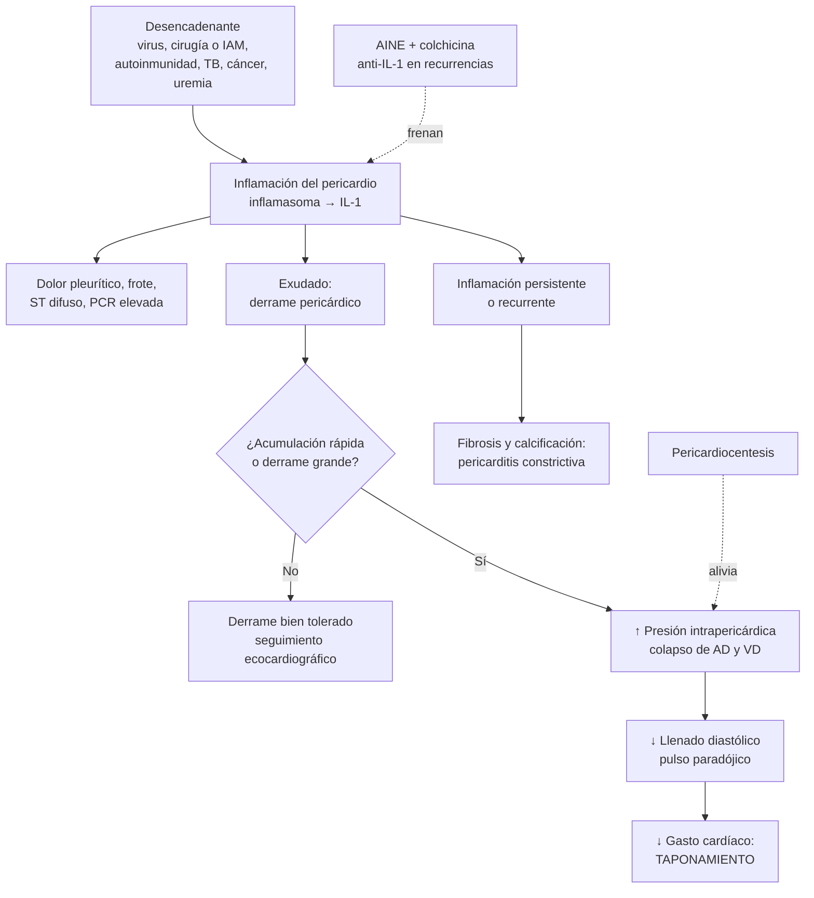

---
tags:
  - Cardiología
  - Urgencia
---

# Pericarditis aguda, derrame pericárdico y taponamiento cardíaco

**Subespecialidad**
Cardiología · Medicina de urgencia

**Guías principales**
ESC 2025: miocarditis y pericarditis (*Eur Heart J*) · ACC 2025: consenso de expertos sobre diagnóstico y manejo de la pericarditis (*J Am Coll Cardiol*)

**Otras fuentes**
Ensayo ICAP (colchicina, *NEJM* 2013) · RHAPSODY (rilonacept, *NEJM* 2021) · IMPI (prednisolona en pericarditis tuberculosa, *NEJM* 2014) · Puntaje de triage del taponamiento (grupo de trabajo ESC, 2014)

**GES**
No

**EUNACOM**
1.01.1.022 Pericarditis aguda (sospecha, inicial, no requiere) · 1.01.2.008 Taponamiento pericárdico (específico, inicial, derivar)

**Revisado**
Septiembre 2026

!!! abstract "Resumen en 60 segundos"
    - **Pericarditis aguda**: inflamación del pericardio. Causa **~ 5 %** de las consultas en urgencia por dolor torácico. En los países de ingresos altos, la mayoría es **idiopática o viral** (**~ 50 %** de los hospitalizados y **> 80 %** de los ambulatorios).
    - **Clínica**: **dolor torácico agudo, pleurítico**, que **mejora al sentarse inclinado hacia adelante** e irradia al **trapecio**. Puede haber **frote pericárdico**.
    - **ECG**: **supradesnivel del ST difuso y cóncavo** con **infradesnivel del PR** (y espejo en aVR).
    - **Diagnóstico (ESC 2025)**: cuadro clínico compatible + **al menos 2 criterios adicionales** (frote, ECG, **PCR elevada**, derrame nuevo o que aumenta, inflamación pericárdica en la RM). Con 1 criterio es una pericarditis "posible".
    - **Hospitalizar si hay criterios de alto riesgo**: **fiebre > 38 °C**, inicio **subagudo**, **derrame > 20 mm**, **taponamiento**, **falta de respuesta** a los AINE en 1 semana, miocarditis asociada, inmunosupresión, trauma o anticoagulantes orales. Sin ellos: **manejo ambulatorio** y control en 1–2 semanas.
    - **Tratamiento**:
        - **AINE o aspirina en dosis altas + colchicina** (**3 meses**) + **IBP** + **restricción del ejercicio** (≥ 1 mes, hasta la remisión).
        - **No usar corticoides de primera línea**: favorecen las **recurrencias**.
    - **Taponamiento**: **tríada de Beck** (hipotensión, ingurgitación yugular, ruidos apagados), taquicardia, **pulso paradójico** > 10 mmHg. Se confirma con **ecocardiograma**; se trata con **pericardiocentesis urgente**.
        - **Evitar diuréticos y la ventilación con presión positiva**; dar volumen mientras se prepara el drenaje.

## Definición

- **Pericarditis**: inflamación del pericardio (el saco de 2 capas que envuelve el corazón y contiene normalmente **10–50 mL** de líquido).
- **Síndrome inflamatorio miopericárdico** (*IMPS*, ESC 2025): término paraguas para el espectro de **pericarditis aislada**, **miopericarditis** (predomina la pericarditis, troponina elevada, función ventricular normal), **perimiocarditis** (predomina la miocarditis) y **miocarditis**. Se usa al inicio, hasta definir el diagnóstico final.
- **Etapas según la duración** (ESC 2025):

| Etapa | Duración |
|---|---|
| **Aguda** | **≤ 4 semanas** |
| **Subaguda** | **> 4 semanas y ≤ 3 meses** |
| **Crónica** | **> 3 meses** |
| **Incesante** | Síntomas persistentes **sin un intervalo libre de > 4 semanas**, pese al tratamiento en dosis plenas (o recaída precoz durante la disminución de las dosis) |
| **Recurrente** | **Nuevo episodio** (síntomas o actividad de la enfermedad) **después de una remisión clínica** |

- **Derrame pericárdico**: aumento del líquido pericárdico. Tamaño por el **espacio libre de ecos en diástole**: **leve < 10 mm**, **moderado 10–20 mm**, **grande > 20 mm**.
- **Taponamiento cardíaco**: compresión del corazón por el líquido (o sangre, pus o gas) acumulado en el pericardio, que **impide el llenado** de las cavidades y produce **bajo gasto** y shock. Es un **diagnóstico clínico** apoyado por el ecocardiograma.

## Epidemiología

### Mundial

- **Incidencia**: **~ 3–32 casos por 100.000** personas-año. Más frecuente en **hombres** y **jóvenes**.
    - En un registro nacional finlandés, las hospitalizaciones por pericarditis aguda fueron **3,32 por 100.000** personas-año, con **65 %** de hombres y **mortalidad hospitalaria de 1,1 %** (mayor en los ancianos y con neumonía o sepsis concomitante) (Kytö, 2014).
- Causa **0,2 %** de las hospitalizaciones cardiovasculares y **~ 5 %** de las consultas en urgencia por dolor torácico.
- **Recurrencia**: **20–30 %** a los 18 meses tras un primer episodio **sin colchicina**, y hasta **50 %** después de la primera recurrencia.
- **Causa específica**: se encontró en **~ 17 %** de 453 pacientes de una cohorte italiana (autoinmune 7,3 %, neoplásica 5,1 %, tuberculosa 3,8 %, purulenta 0,7 %) (Imazio, 2007).
- **Derrame pericárdico**: en las series de derrames moderados o grandes de los países desarrollados, **~ 50 %** es idiopático; el resto, cáncer (10–32 %), infecciones (15–30 %), iatrogenia (15–20 %) y mesenquimopatías (5–15 %). En los países con **TB endémica**, la **tuberculosis** causa **> 60 %**.

### Chile

!!! chile "Contexto nacional"
    - No hay un **registro nacional** de pericarditis ni de taponamiento, y la pericarditis **no es GES**. En la práctica se aplican las guías europeas y estadounidenses.
    - **Tuberculosis**: Chile tiene una incidencia de **15,6 por 100.000** (2024), con tasas mucho mayores en el norte, en migrantes, en personas privadas de libertad y en situación de calle (ver [tuberculosis](../respiratorio/tuberculosis.md)).
        - La **pericarditis tuberculosa** es poco frecuente (compromete al **1–2 %** de los pacientes con TB), pero debe buscarse en el **derrame moderado o grande sin causa clara**, sobre todo en estos grupos.
        - Hay casos chilenos publicados de pericarditis tuberculosa con **taponamiento** que requirieron pericardiectomía de urgencia (Jorquera-Román, 2021).
    - **Pericarditis urémica y asociada a diálisis**: Chile tiene **~ 25.800 pacientes en hemodiálisis crónica** (**1.286 por millón**, 2024), una de las tasas más altas de Latinoamérica (ver [enfermedad renal crónica](../nefrologia/enfermedad-renal-cronica.md)).
    - **Derrame neoplásico** (pulmón, mama, linfomas): es la **primera causa de taponamiento** en los hospitales generales (ver [urgencias oncológicas](../hematologia/urgencias-oncologicas.md)).

## Etiología

| Grupo | Causas |
|---|---|
| **Idiopática o viral** (la más frecuente) | Enterovirus (coxsackie), adenovirus, parvovirus B19, VEB, CMV, influenza, **SARS-CoV-2**; VIH y virus hepatitis C (buscar) |
| **Bacteriana** | **Tuberculosis** (principal causa en los países endémicos); **purulenta** (estafilococo, estreptococo, neumococo), poco frecuente (< 1 %) y grave |
| **Autoinmune o inflamatoria sistémica** | **LES**, artritis reumatoide, esclerodermia, Sjögren, vasculitis, sarcoidosis, enfermedad inflamatoria intestinal; síndromes autoinflamatorios (**fiebre mediterránea familiar**, TRAPS) en las recurrencias |
| **Síndrome poslesión cardíaca** | **Pospericardiotomía** (cirugía cardíaca), **post-IAM tardía (Dressler)**, **postraumática** o **posprocedimiento** (ablación de FA, marcapasos, intervención coronaria) |
| **Neoplásica** | **Metástasis** (pulmón, mama, linfoma, leucemia, melanoma), primaria (mesotelioma, rara), **radioterapia** |
| **Metabólica** | **Uremia** (pericarditis urémica y asociada a diálisis), **hipotiroidismo** (derrame sin taponamiento, en general) |
| **Otras** | **Post-IAM temprana** (epistenocárdica), **disección aórtica** (hemopericardio), fármacos (hidralazina, procainamida, isoniazida, inhibidores de puntos de control inmunitario), **vacunas de ARNm** (rara) |

!!! guia "Causas de taponamiento cardíaco (ESC 2025), por frecuencia"
    - **Frecuentes**: (1) **neoplasia**; (2) **iatrogenia o trauma** (procedimientos, cirugía); (3) **pericarditis**; (4) **tuberculosis** (la más frecuente en los países en desarrollo).
    - **Menos frecuentes**: mesenquimopatías, síndrome poslesión cardíaca, **IAM** (rotura de la pared libre), **disección aórtica**, **uremia**, infección bacteriana y neumopericardio.

## Fisiopatología

1. **Pericarditis**:
    - Un desencadenante (virus, lesión cardíaca, autoinmunidad) activa la **inmunidad innata**. El **inflamasoma** libera **interleucina 1 (IL-1)**, que amplifica la inflamación.
    - El roce de las hojas inflamadas produce el **dolor** y el **frote**. La inflamación del **epicardio subyacente** produce los cambios del **ST**.
    - En las recurrencias con fenotipo inflamatorio (fiebre, **PCR alta**) predomina un mecanismo **autoinflamatorio mediado por IL-1**: por eso responden a la **colchicina** y a los **bloqueadores de la IL-1**.
2. **Derrame**: el exudado inflamatorio (o el trasudado de la insuficiencia cardíaca, o el bloqueo linfático tumoral) aumenta el líquido.
3. **Taponamiento**:
    - El pericardio es **poco distensible**. Lo que importa es la **velocidad** de acumulación, no sólo el volumen: un volumen **pequeño** acumulado en forma **aguda** (hemopericardio) puede producir taponamiento, mientras que un derrame **crónico** de gran volumen puede ser bien tolerado, porque el pericardio se distiende lentamente (Figura 3).
    - Cuando la presión intrapericárdica supera la presión de llenado, **colapsan las cavidades de baja presión** (aurícula y ventrículo derechos), disminuye el **llenado diastólico** y cae el **gasto cardíaco**.
    - **Interdependencia ventricular**: con la inspiración aumenta el retorno al VD, el tabique se desplaza hacia el VI y disminuye el volumen sistólico izquierdo: **pulso paradójico**.
4. **Constricción**: la inflamación persistente produce **fibrosis y calcificación**; el pericardio rígido limita el llenado (insuficiencia cardíaca derecha).

*Figura 1. Fisiopatología de la pericarditis, el derrame y el taponamiento. Esquema propio.*

## Clasificación

- **Por la duración**: aguda, subaguda, crónica, incesante y recurrente (ver la tabla de la definición).
- **Por la forma clínica** (ESC 2025):
    - **Seca** (40–50 %): sin derrame.
    - **Con derrame** (50–60 %): un derrame moderado o grande sugiere una causa **no idiopática**.
    - **Con taponamiento**.
    - **Efusivo-constrictiva**: derrame con constricción, que se hace evidente al drenar el líquido.
    - **Constrictiva**, **constrictiva transitoria** (reversible con antiinflamatorios) y **con poliserositis** (pleura, peritoneo).
- **Por el fenotipo**: **inflamatorio** (fiebre, PCR alta, derrame pericárdico o pleural; responde a colchicina y anti-IL-1) o **no inflamatorio** (PCR normal, **10–20 %**; más difícil de tratar).
- **Por el riesgo** (define dónde se trata):

| Riesgo | Pericarditis (ESC 2025) |
|---|---|
| **Alto** (hospitalizar) | Signos de **taponamiento**; **fiebre > 38 °C**; **derrame grande (> 20 mm)**; pericarditis **efusivo-constrictiva**; realce tardío extenso en la RM |
| **Intermedio** | **Falla de los AINE**; pericarditis **incesante**; signos de **insuficiencia cardíaca derecha**; derrame **moderado a grande (10–20 mm)**; fisiología constrictiva |
| **Bajo** (ambulatorio) | **Respuesta** al tratamiento en **1–2 semanas**; derrame ausente o leve; sin realce pericárdico en la RM |

!!! alarma "Predictores de mal pronóstico y de causa no viral (hospitalizar)"
    - **Mayores** (validados en una cohorte prospectiva):
        - **Fiebre > 38 °C** (HR 3,56).
        - **Inicio subagudo** (días o semanas; HR 3,97).
        - **Derrame grande** (> 20 mm en el ecocardiograma) o **taponamiento** (HR 2,15).
        - **Falta de respuesta** a la aspirina o los AINE tras **al menos 1 semana** (HR 2,50).
    - **Menores**: **miopericarditis**, **inmunosupresión**, **trauma**, **anticoagulantes orales**.
    - En la práctica, **~ 25 %** de los pacientes con pericarditis aguda tiene al menos uno y requiere hospitalización. El resto puede manejarse en forma **ambulatoria** sin estudio etiológico extenso, si responde al tratamiento.

## Clínica

### Pericarditis aguda

- **Dolor torácico** (**85–90 %**):
    - **Agudo, punzante, pleurítico** (aumenta con la inspiración profunda y la tos).
    - **Posicional**: **empeora en decúbito supino** y **mejora al sentarse inclinado hacia adelante**.
    - Irradia al **borde del trapecio** (inervación del nervio frénico): muy característico.
- **Frote pericárdico**: sonido rasposo, superficial, con **1 a 3 componentes**, que se oye mejor en el **borde esternal izquierdo** con el paciente sentado e inclinado hacia adelante, en espiración. Es **evanescente** (hay que auscultar varias veces) y está presente en una minoría (~ 1/3).
- **Pródromo viral** (cuadro respiratorio o gastrointestinal reciente), fiebre baja.
- **Fiebre > 38 °C** alta y persistente: sugiere una causa **bacteriana** (TB, purulenta) o **sistémica**.
- **Síntomas de la causa**: artritis, rash (LES), baja de peso y sudoración nocturna (TB, cáncer), uremia, cirugía o IAM reciente.
- **Taquiarritmias supraventriculares** (FA) en algunos pacientes.

### Derrame pericárdico

- Muchos son **asintomáticos** (hallazgo en un ecocardiograma o una TC).
- **Disnea de esfuerzo** que progresa a **ortopnea**, **plenitud torácica**.
- **Compresión de estructuras vecinas**: náuseas (diafragma), **disfagia** (esófago), **disfonía** (nervio laríngeo recurrente), **hipo** (nervio frénico).

### Taponamiento cardíaco

- **Síntomas**: disnea, **ortopnea**, malestar torácico, fatiga, **síncope**, compromiso de conciencia.
- **Signos**:
    - **Tríada de Beck**: **hipotensión**, **ingurgitación yugular** y **ruidos cardíacos apagados**.
    - **Taquicardia** (casi constante; la bradicardia es un signo tardío o de uremia o hipotiroidismo).
    - **Pulso paradójico**: caída de la **PA sistólica > 10 mmHg en la inspiración**.
    - Oliguria, frialdad, taquipnea.
- En el **taponamiento agudo** (trauma, rotura, disección, perforación en un procedimiento), el paciente llega en **shock** con poco líquido y **sin cardiomegalia**. En el **subagudo** (cáncer, TB, uremia) predominan la disnea y la ingurgitación, con una silueta cardíaca grande.

!!! alarma "Sospechar taponamiento"
    - **Hipotensión + ingurgitación yugular + taquicardia**, sin congestión pulmonar (**pulmones limpios**).
    - **Paciente con cáncer**, **TB**, **ERC en diálisis**, **cirugía cardíaca** o **procedimiento percutáneo reciente** (ablación, marcapasos, angioplastía) que se descompensa.
    - **Disección aórtica tipo A** o **IAM** con shock (rotura de la pared libre).
    - **Actividad eléctrica sin pulso** (AESP): el taponamiento es una de las **causas reversibles** ("4H y 4T"; ver [paro cardiorrespiratorio](paro-cardiorrespiratorio-y-arritmias.md)).
    - **No esperar el ecocardiograma formal**: la **ecografía en el punto de atención** muestra el derrame y el colapso de las cavidades en minutos.

## Diagnóstico

!!! guia "Criterios diagnósticos de pericarditis (ESC 2025)"
    Cuadro clínico compatible (dolor torácico típico u otras presentaciones) **más** criterios adicionales:

    1. **Frote pericárdico**.
    2. **ECG**: **infradesnivel del PR** y **supradesnivel difuso del ST**.
    3. **PCR elevada**.
    4. **Derrame pericárdico nuevo o que aumenta**.
    5. **Edema o realce tardío pericárdico** en la **RM cardíaca**.

    - **Pericarditis definitiva**: cuadro clínico + **≥ 2** criterios adicionales.
    - **Posible**: cuadro clínico + **1** criterio.
    - **Improbable**: sólo el cuadro clínico.
    - El **consenso ACC 2025** es más amplio: **dolor pericárdico + ≥ 1** de los mismos criterios.

**Estudio inicial en todos** (ESC 2025, clase I):

1. **Anamnesis y examen físico** (buscar el frote, signos de taponamiento, pulso paradójico, fiebre y signos de una enfermedad sistémica).
2. **ECG** (Figura 2).
3. **Radiografía de tórax**.
4. **Laboratorio**: **PCR**, VHS, hemograma, **troponina**, creatinina y electrolitos, TSH, pruebas hepáticas, NT-proBNP.
5. **Ecocardiograma transtorácico**.

**Estudio etiológico** (sólo si hay criterios de **alto riesgo**, una sospecha clínica específica o **falta de respuesta** al tratamiento):

- **VIH** y **virus hepatitis C**. La **serología viral de rutina no se recomienda** (clase III).
- **ANA** y otros anticuerpos si se sospecha una enfermedad autoinmune.
- **Estudio de TB** (baciloscopia y cultivo de expectoración, PCR para *M. tuberculosis*, radiografía y TC de tórax); **IGRA** y PPD son de valor limitado.
- **TC de tórax** (cáncer, adenopatías, compromiso pleuropulmonar).
- **Pericardiocentesis diagnóstica** si hay sospecha de **TB, pus o cáncer**, o un derrame sintomático que no responde.

<figure markdown>
![Cuatro tiras de ECG sobre papel milimetrado. La primera, pericarditis aguda en la derivación II, muestra un segmento PR descendido bajo la línea isoeléctrica y un segmento ST elevado de forma cóncava que se continúa con la onda T. La segunda, aVR en la pericarditis, muestra la imagen especular, con el PR elevado y el ST descendido. La tercera, un infarto con supradesnivel del ST, muestra un ST convexo y alto que arrastra la onda T. La cuarta, un taponamiento, muestra una taquicardia sinusal con complejos QRS de bajo voltaje que alternan su altura latido a latido](../assets/figuras/pericardio/ecg-pericarditis.svg){ loading=lazy }
<figcaption>Figura 2. ECG en la pericarditis aguda (supradesnivel del ST difuso y cóncavo con infradesnivel del PR, y espejo en aVR), comparado con el IAMCEST (ST convexo y territorial) y con el taponamiento (bajo voltaje y alternancia eléctrica). Esquema propio.</figcaption>
</figure>

**El ECG de la pericarditis**:

- **Supradesnivel del ST difuso**, **cóncavo** hacia arriba, en **casi todas las derivaciones** (excepto aVR y V1), **sin imagen en espejo** territorial y **sin ondas Q**. Se ve en **20–60 %** de los casos.
- **Infradesnivel del PR** (el hallazgo más específico y precoz), con **PR elevado en aVR**.
- Evolución clásica en 4 etapas (horas a semanas): ST elevado y PR descendido → normalización → **inversión de la onda T** difusa → normalización.
- **Bajo voltaje** y **alternancia eléctrica** (el corazón "oscila" en un derrame grande): sugieren un derrame grande o taponamiento.
- **Un ECG normal no descarta** la pericarditis.

## Laboratorio

| Examen | Hallazgo y uso |
|---|---|
| **PCR** (y VHS) | Elevada en **~ 80 %**. Apoya el diagnóstico y **guía la duración** del tratamiento (disminuir las dosis sólo con **PCR normal**). Una PCR normal no descarta la pericarditis (fenotipo no inflamatorio) |
| **Troponina** | Elevada en **20–30 %**: **miopericarditis**. Con función ventricular normal, **no empeora el pronóstico**, pero obliga a descartar un SCA y a restringir el ejercicio |
| **Hemograma** | Leucocitosis leve; marcada en la purulenta; citopenias en el LES o las neoplasias hematológicas |
| **Creatinina, BUN** | **Uremia** (pericarditis urémica); ajuste de dosis de AINE y colchicina |
| **TSH** | **Hipotiroidismo** (derrame sin taponamiento, frecuentemente) |
| **NT-proBNP** | Insuficiencia cardíaca, miocarditis. En la **constricción** suele ser **normal o poco elevado** |
| **VIH, VHC; ANA y otros autoanticuerpos** | Según el contexto clínico |
| **Hemocultivos** | Si hay fiebre alta o sospecha de pericarditis **purulenta** |
| **Líquido pericárdico** | **Citología** (cáncer), **Gram y cultivo**, **ADA** (TB: sensibilidad **~ 90 %**, especificidad **~ 86 %**), **Xpert MTB/RIF** (muy específico, sensibilidad ~ 64 %), **IFN-γ no estimulado** (TB, muy preciso), cultivo de micobacterias (lento), recuento celular, proteínas, LDH, glucosa |

## Imágenes

- **Ecocardiograma transtorácico**: el examen clave.
    - Es **normal en 40–50 %** de los primeros episodios de pericarditis.
    - **Mide el derrame** (leve < 10 mm, moderado 10–20 mm, grande > 20 mm) y su distribución (circunferencial o tabicado).
    - Evalúa la **repercusión hemodinámica** (taponamiento), la **función ventricular** (miocarditis) y la **constricción**.
- **Signos ecocardiográficos de taponamiento** (ESC 2025):

| Signo | Sensibilidad / especificidad |
|---|---|
| **Derrame grande con "corazón oscilante"** (*swinging heart*) | — |
| **Colapso diastólico de la aurícula derecha** (el más precoz) | 50–100 % / 33–100 % |
| **Colapso de la AD que dura > 1/3 del ciclo** | **> 90 % / 100 %** |
| **Colapso diastólico del ventrículo derecho** | 48–100 % / 72–100 % |
| **Variación respiratoria** del flujo mitral (> 25–30 %) y tricuspídeo (> 40–60 %) | — |
| **Vena cava inferior pletórica** (> 20 mm, colapso inspiratorio < 50 %) | **97 %** / 40 % (su ausencia hace improbable el taponamiento) |

<figure markdown>
{ loading=lazy }
<figcaption>Figura 3. Relación presión-volumen del pericardio: un derrame rápido (verde) produce taponamiento con poco volumen; uno lento (rojo) permite que el pericardio se distienda y tolere volúmenes mayores antes del taponamiento. Tomado de Pérez-Casares A, et al. <em>Front Pediatr</em> 2017;5:79 (figura 2). Licencia <a href="https://creativecommons.org/licenses/by/4.0/">CC BY 4.0</a>.</figcaption>
</figure>

<figure markdown>
{ loading=lazy }
<figcaption>Figura 4. Signos ecocardiográficos de taponamiento: colapso diastólico del ventrículo derecho (izquierda) y colapso de ambas aurículas (derecha). PEff: derrame pericárdico; RV/LV: ventrículos derecho e izquierdo; RA/LA: aurículas. Tomado de Pérez-Casares A, Cesar S, Brunet-Garcia L, Sanchez-de-Toledo J. <em>Front Pediatr</em> 2017;5:79 (figura 8). Licencia <a href="https://creativecommons.org/licenses/by/4.0/">CC BY 4.0</a>.</figcaption>
</figure>

- **Radiografía de tórax**: normal en la pericarditis seca. Con derrames grandes, **cardiomegalia en "botellón" o "garrafa"** con pulmones limpios. Derrame pleural (poliserositis). Lesiones pulmonares o mediastínicas (TB, cáncer).
- **RM cardíaca** (clase I en la sospecha de pericarditis o miocarditis): **edema y realce tardío** del pericardio (confirma la inflamación), compromiso miocárdico, constricción. Útil en los casos **dudosos, recurrentes o refractarios** y para decidir cuándo suspender el tratamiento.
- **TC**: engrosamiento y **calcificación** pericárdica (constricción), derrames tabicados, masas, adenopatías, cáncer y compromiso pulmonar. Planifica procedimientos.
- **Coronariografía o angio-TC coronaria**: si no se puede descartar un **SCA**.

## Diagnóstico diferencial

| Cuadro | Claves para distinguirlo de la pericarditis |
|---|---|
| **IAMCEST** | Dolor opresivo, no posicional. ST **convexo**, **territorial**, con **imagen en espejo** y ondas Q. Troponina con curva marcada. **Alteración segmentaria** de la motilidad (ver [síndrome coronario agudo](sindrome-coronario-agudo.md)) |
| **Repolarización precoz** | Asintomático, joven. Sin PR descendido; **cociente ST/T en V6 < 0,25** (> 0,25 sugiere pericarditis). No cambia en el tiempo |
| **TEP** | Disnea, taquicardia, factores de riesgo, hipoxemia, VD dilatado. Angio-TC (ver [TEP](../respiratorio/tromboembolismo-pulmonar.md)) |
| **Disección aórtica** | Dolor súbito, desgarrador, que migra; déficit de pulso. El **hemopericardio** puede simular una pericarditis con derrame (ver [síndrome aórtico agudo](sindrome-aortico-agudo.md)) |
| **Neumonía con pleuritis** | Fiebre, tos, crepitaciones, consolidación en la radiografía |
| **Neumotórax** | Dolor pleurítico súbito, murmullo abolido, radiografía |
| **Dolor osteomuscular (costocondritis)** | Dolor a la **palpación**, sin cambios en el ECG ni la PCR |
| **Miocarditis** | Troponina alta con **disfunción ventricular**, arritmias ventriculares, insuficiencia cardíaca. RM cardíaca |

**Diferencial del taponamiento** (hipotensión con ingurgitación yugular): **neumotórax a tensión**, **TEP masivo**, **infarto del VD**, shock cardiogénico, insuficiencia cardíaca derecha, **pericarditis constrictiva** (ingurgitación con signo de Kussmaul, sin colapso de las cavidades).

## Tratamiento

### Pericarditis aguda

!!! guia "ESC 2025: tratamiento médico de la pericarditis"
    - **Aspirina o AINE en dosis altas + IBP** como primera línea (clase I).
    - **Colchicina** como complemento de la aspirina, los AINE o los corticoides, para **reducir las recurrencias** (clase I, nivel A).
    - **Restricción del ejercicio** hasta la remisión, **al menos 1 mes**, en deportistas y no deportistas, en forma individualizada (clase I).
    - **Betabloqueador** si persisten los síntomas con el tratamiento completo y la **FC en reposo es > 75 lpm** (clase IIa).
    - **Corticoides en dosis bajas a moderadas** sólo si hay **contraindicación o falla** de la aspirina, los AINE y la colchicina, o una **indicación específica** (clase IIa).
    - **No usar corticoides como primera opción** sin una indicación específica (clase III): aumentan las **recurrencias** y la cronicidad, sobre todo en dosis altas con disminución rápida.
    - **Anti-IL-1** (anakinra o rilonacept) en la **pericarditis recurrente** con **PCR elevada**, tras la falla de la primera línea y de los corticoides (clase I, nivel A).
    - **Hidroxicloroquina** en las recurrencias refractarias (clase IIb).

!!! dosis "Dosis (ESC 2025)"
    **Primer episodio**:

    | Fármaco | Dosis inicial | Duración de la dosis plena | Disminución |
    |---|---|---|---|
    | **Aspirina** | **750–1.000 mg cada 8 h** | 1–2 semanas | 250 mg cada 1–2 semanas |
    | **Ibuprofeno** | **600–800 mg cada 8 h** | 1–2 semanas | 200 mg cada 1–2 semanas |
    | **Indometacina** | 25–50 mg cada 8 h | 1–2 semanas | 25 mg cada 1–2 semanas |
    | **Colchicina** | **0,5 mg cada 12 h**; **0,5 mg/día** si pesa **< 70 kg** o tiene **ERC grave** | **3 meses** (≥ **6 meses** en la recurrente o incesante) | No requiere |
    | **Prednisona** (sólo si está indicada) | **0,2–0,5 mg/kg/día** | 2–4 semanas | **Lenta**, en varios meses |

    - **Siempre con IBP** (omeprazol 20 mg/día) mientras use aspirina o AINE.
    - La **aspirina** es la de elección si el paciente ya usa aspirina (enfermedad coronaria) o en la pericarditis **post-IAM**. El **ibuprofeno** es el AINE de elección en los demás.
    - Mantener la **dosis plena** hasta que desaparezcan los síntomas y se **normalice la PCR**; luego **disminuir** (reduce las recurrencias).
    - **Colchicina en > 70 años**: **reducir la dosis a la mitad**; controlar la función renal y las **interacciones** (claritromicina, azoles, ciclosporina, verapamilo, diltiazem, estatinas). Efecto adverso principal: **diarrea**. Es el **último fármaco en suspenderse**.
    - **ERC moderada a grave**: ajustar o evitar los AINE (considerar corticoides).
    - **Disminución de la prednisona**: > 50 mg: 10 mg/día cada 1–2 semanas; 50–25 mg: 5–10 mg/día cada 1–2 semanas; 25–15 mg: 2,5 mg/día cada 2–4 semanas; **< 15 mg: 1,25–2,5 mg/día cada 2–6 semanas** (el umbral habitual de las recurrencias). Cada reducción sólo con el paciente **asintomático y PCR normal**. Calcio y vitamina D.

!!! perla "La evidencia de la colchicina: ensayo ICAP (NEJM 2013)"
    - 240 pacientes con un **primer episodio** de pericarditis aguda recibieron aspirina o ibuprofeno más **colchicina o placebo** por **3 meses**.
    - La **pericarditis incesante o recurrente** bajó de **37,5 % a 16,7 %** (reducción relativa de riesgo **0,56**).
    - La colchicina también redujo la **persistencia de los síntomas a las 72 h** (19,2 % vs 40,0 %) y las **hospitalizaciones** (5,0 % vs 14,2 %), sin más efectos adversos que el placebo.

### Pericarditis recurrente e incesante

1. **Aspirina o AINE + colchicina (≥ 6 meses)**. La **indometacina** se usa sobre todo en estos casos.
2. Si no responde o hay contraindicación: **corticoides en dosis bajas a moderadas + colchicina**, o **triple terapia** (corticoide + AINE + colchicina). Si recurre durante la disminución del corticoide: **agregar un AINE** en lugar de subir el corticoide.
3. **Anti-IL-1** (recurrencias con **PCR elevada** o inflamación en la RM, con dependencia de corticoides y resistencia a la colchicina):
    - **Anakinra**: 1–2 mg/kg/día SC, máximo **100 mg/día**, por **≥ 6 meses**, con disminución gradual.
    - **Rilonacept**: **320 mg SC** el día 1 y luego **160 mg SC semanal** (aprobado en EE. UU.; no disponible en Europa).
    - En **RHAPSODY** (NEJM 2021), la recurrencia durante el retiro aleatorizado fue de **7 %** con rilonacept vs **74 %** con placebo.
    - El **consenso ACC 2025** los prefiere como **segunda línea** (antes de los corticoides) en el fenotipo inflamatorio; la **ESC 2025** mantiene el esquema escalonado, en parte por el **costo y la disponibilidad**.
4. Otros: **azatioprina** (ahorradora de corticoides), **inmunoglobulina EV**, **hidroxicloroquina**. **Pericardiectomía** en casos muy refractarios, en centros con experiencia.
- Estudiar **causas específicas** y **síndromes autoinflamatorios** (antecedentes familiares, fiebre periódica). Manejo con **reumatología** y un equipo multidisciplinario.

### Situaciones específicas

- **Miopericarditis** (troponina alta, FEVI normal): se trata **como una pericarditis** (AINE + colchicina), con **restricción del ejercicio** y control de la troponina. Si hay **disfunción ventricular** (perimiocarditis o miocarditis): **hospitalizar**, RM cardíaca y manejo de la miocarditis.
- **Pericarditis post-IAM**:
    - **Temprana** (primeros días; infartos extensos): **aspirina en dosis altas** (clase I). Evitar los otros AINE y los corticoides (alteran la cicatrización).
    - **Síndrome de Dressler** (1–2 semanas después; **< 1 %** en la era de la reperfusión): aspirina + colchicina.
    - Un **derrame post-IAM > 10 mm** obliga a descartar una **rotura subaguda** de la pared libre.
- **Síndrome pospericardiotomía** y posprocedimiento: antiinflamatorios; **colchicina** iniciada **48–72 h antes** de la cirugía cardíaca y mantenida **1 mes** lo previene (clase IIa, nivel A).
- **Pericarditis tuberculosa** (ver [tuberculosis](../respiratorio/tuberculosis.md)):
    - **Pericardiocentesis diagnóstica** (ADA, Xpert MTB/RIF, cultivo) si no se confirmó por otra vía.
    - **Tratamiento antituberculoso estándar por 6 meses** (2 meses con 4 fármacos y 4 meses con isoniazida y rifampicina).
    - **Corticoides adyuvantes** en los pacientes **VIH negativos** para prevenir la constricción (clase IIa). En **IMPI** (NEJM 2014), la prednisolona **no redujo** el desenlace combinado (muerte, taponamiento o constricción: 23,8 % vs 24,5 %), pero **redujo la constricción** (4,4 % vs 7,8 %) y aumentó los **cánceres asociados al VIH**.
    - **Pericardiectomía** si no mejora o empeora tras **4–8 semanas** de tratamiento.
- **Pericarditis purulenta**: **drenaje urgente** (pericardiocentesis o ventana quirúrgica), **antibióticos EV** (cubrir estafilococo, estreptococo y neumococo; ajustar al cultivo) y considerar **fibrinólisis intrapericárdica** para prevenir la constricción. Mortalidad alta sin tratamiento.
- **Pericarditis urémica y asociada a diálisis**: **iniciar o intensificar la diálisis** (la pericarditis urémica es una indicación de diálisis urgente; ver [lesión renal aguda](../nefrologia/lesion-renal-aguda.md)). Heparina mínima en la diálisis por el riesgo de hemopericardio. Los AINE y la colchicina tienen un uso limitado por la función renal.
- **Derrame neoplásico**: pericardiocentesis con **citología**, **drenaje prolongado** (reduce la recurrencia), tratamiento del cáncer y, si recurre, **ventana pericárdica** o pericardiotomía percutánea con balón.
- **Embarazo**: los AINE pueden usarse hasta la **semana 20**; después, **prednisona en dosis bajas** (hasta 20 mg/día). La colchicina puede considerarse en quienes ya la usaban (clase IIb).

### Taponamiento cardíaco

!!! alarma "Manejo del taponamiento"
    1. **Paciente inestable** (shock, AESP): **pericardiocentesis inmediata**, guiada por ecografía (o a ciegas por vía subxifoidea en el paro).
        - **Excepciones**: en la **disección aórtica tipo A**, la **rotura de la pared libre** post-IAM o el **hemopericardio traumático**, el tratamiento es la **cirugía inmediata** (la pericardiocentesis puede aumentar el sangrado; sólo un drenaje controlado como puente si el paro es inminente).
    2. **Mientras se prepara el drenaje**:
        - **Volumen EV** (bolo de cristaloides, por ejemplo 250–500 mL) para mantener la precarga, en forma transitoria.
        - **Evitar los diuréticos y los vasodilatadores** (disminuyen la precarga y precipitan el colapso).
        - **Evitar la intubación y la ventilación con presión positiva** si es posible: disminuyen el retorno venoso y pueden producir un **paro** (si es imprescindible, hacerlo en el pabellón con el drenaje listo).
        - Vasopresores o inótropos sólo como puente (poca eficacia).
    3. **Paciente estable** con derrame y sospecha de taponamiento: usar el **puntaje de triage** de la ESC.
        - **≥ 6 puntos**: **pericardiocentesis urgente** (en horas).
        - **< 6 puntos**: se puede **postergar** el drenaje mientras se estudia y se trata la causa, con vigilancia estrecha y reevaluación.

!!! guia "Puntaje de triage del taponamiento (grupo de trabajo ESC, 2014; reproducido en la ESC 2025)"
    - **Etiología**: cáncer **2**; tuberculosis **2**; radioterapia reciente 1; infección viral reciente 1; derrame recurrente 1; ERC terminal 1; inmunosupresión 1; disfunción tiroidea **−1**; enfermedad autoinmune sistémica **−1**.
    - **Clínica**: **ortopnea 3**; **pulso paradójico > 10 mmHg 2**; **empeoramiento rápido 2**; disnea o taquipnea 1; taquicardia sinusal progresiva 1; oliguria 1; hipotensión (PAS < 95 mmHg) 0,5; dolor pericárdico 0,5; frote 0,5; evolución lenta **−1**.
    - **Imágenes**: **derrame grande circunferencial 3**; derrame moderado 1; derrame pequeño **−1**; **colapso de la aurícula izquierda 2**; colapso del VD 1,5; VCI dilatada no colapsable 1,5; colapso de la AD 1; variación respiratoria de los flujos 1; corazón oscilante 1; cardiomegalia en la radiografía 1; microvoltaje 1; alternancia eléctrica 0,5.

!!! dosis "Pericardiocentesis"
    - **Operador con experiencia**, con **monitoreo** del ECG y de la PA, guiada por **ecocardiografía** o fluoroscopía.
    - **Vía subxifoidea** (aguja de 16–20 G dirigida hacia el hombro izquierdo) o apical, según dónde el derrame sea mayor y más cercano a la piel.
    - Dejar un **catéter de drenaje** unos días y retirarlo cuando drene **< 30 mL/día**. Evitar vaciar volúmenes muy grandes de una vez (**< 500 mL** inicialmente) para prevenir el **síndrome de descompresión pericárdica** (edema pulmonar o disfunción ventricular tras el drenaje).
    - **Enviar el líquido** a citología, Gram, cultivo, ADA, Xpert MTB/RIF, recuento celular y bioquímica.
    - **Complicaciones** (**4–10 %**): arritmias, **punción ventricular o coronaria**, hemotórax, neumotórax, neumopericardio, lesión hepática.
    - **Drenaje quirúrgico** (ventana pericárdica) si la punción no es factible, en el derrame **purulento**, **tabicado** o **recurrente**, y en el hemopericardio con sangrado activo.

## Complicaciones

- **Recurrencia**: la más frecuente (**15–30 %**; 20–30 % sin colchicina). **Incesante** en ~ 10 %.
- **Taponamiento**: raro en la pericarditis viral o idiopática (**1–2 %**), frecuente en las no idiopáticas (**~ 20 %**).
- **Pericarditis constrictiva**:
    - Riesgo según la causa: **< 1 %** en la viral o idiopática; **2–5 %** en la autoinmune, neoplásica o posprocedimiento; **20–30 %** en la **bacteriana** (sobre todo purulenta y TB).
    - Clínica de **insuficiencia cardíaca derecha** (ingurgitación yugular con **signo de Kussmaul**, hepatomegalia, **ascitis**, edema) con **NT-proBNP normal o poco elevado**; **golpe pericárdico** (*knock*).
    - Diagnóstico: ecocardiograma (rebote septal, variación respiratoria), **TC** (engrosamiento y calcificación) y **RM** (inflamación), y cateterismo en los casos dudosos.
    - Tratamiento: **antiinflamatorios por 3–6 meses** si hay inflamación activa (constricción **transitoria**, que se resuelve en > 50 %); **pericardiectomía** en la constricción crónica (en centros con experiencia).
- **Efusivo-constrictiva**: persiste la presión venosa alta tras drenar el derrame.
- **Arritmias**: FA y flutter; arritmias ventriculares si hay miocarditis.
- **Del tratamiento**: sangrado digestivo y deterioro renal por los AINE, diarrea por la colchicina, efectos adversos de los corticoides, complicaciones de la pericardiocentesis.

## Pronóstico y seguimiento

- **Pericarditis viral o idiopática**: **buen pronóstico**. La mayoría remite en **4–6 semanas**. Mortalidad hospitalaria de **~ 1 %** (mayor en los ancianos y con infecciones graves).
- La **miopericarditis con función ventricular normal** tiene buen pronóstico.
- **Taponamiento**: el pronóstico depende de la **causa**. Es malo a corto plazo en el derrame **neoplásico** (enfermedad avanzada) y bueno en el idiopático.
- **Pericarditis tuberculosa**: mortalidad de **17–40 %** a los 6 meses (datos de países endémicos).
- **Perfil EUNACOM**:
    - Pericarditis: **sospecha** e **inicio del tratamiento** (AINE + colchicina, reposo), sin seguimiento especializado en los casos no complicados.
    - Taponamiento: **diagnóstico específico** (clínica + ecocardiograma), **tratamiento inicial** (volumen, evitar diuréticos y presión positiva, pericardiocentesis si hay shock) y **derivación**.
- **Seguimiento** (ESC 2025):
    - Pericarditis de bajo riesgo tratada en forma ambulatoria: **control a la semana 1–2** (respuesta al tratamiento).
    - Evaluación clínica, **ECG** y **PCR** al **mes** y a los **3–6 meses**; ecocardiograma según los hallazgos.
    - **Seguimiento a largo plazo** en la pericarditis **recurrente o incesante** (riesgo de constricción).
    - **Retorno al ejercicio** con remisión completa: sin síntomas, **PCR normal** y ECG y ecocardiograma normalizados.

## Perlas para el internado

!!! perla "Para la sala y el turno"
    - **Dolor pleurítico que mejora al inclinarse hacia adelante** + ST elevado en todas partes con **PR descendido** = pericarditis. **Mira aVR**: el PR elevado ahí es una pista muy útil.
    - Antes de rotular una pericarditis, **descarta un IAMCEST**: ST convexo, territorial y con espejo es un infarto hasta demostrar lo contrario.
    - **AINE + colchicina + IBP**, siempre. **No dar prednisona** "para que se le pase rápido": duplica el riesgo de recurrencias.
    - **Colchicina 0,5 mg cada 12 h (0,5 mg/día si < 70 kg) por 3 meses**, y es lo último que se suspende.
    - **Baja la dosis de los AINE sólo con la PCR normal.**
    - **Fiebre > 38 °C, derrame grande, curso subagudo o falta de respuesta en 1 semana = hospitalizar** y buscar la causa (TB, cáncer, autoinmune, purulenta).
    - **Hipotensión + yugulares ingurgitadas + pulmones limpios** = taponamiento. Haz una **ecografía** al lado de la cama.
    - En el taponamiento: **suero sí, furosemida no**, y **no intubes** si puedes evitarlo antes de drenar.
    - Un **derrame en un paciente con cáncer, TB o diálisis** que se descompensa es un taponamiento hasta demostrar lo contrario.
    - **Derrame + disección tipo A** = pabellón, no pericardiocentesis.

## Preguntas de repaso

??? repaso "1. Hombre de 28 años con dolor torácico punzante de 2 días, que aumenta al inspirar y al acostarse y mejora al sentarse inclinado hacia adelante. Tuvo un resfrío hace 10 días. Temperatura 37,6 °C, frote pericárdico, ECG con ST elevado difuso y PR descendido, PCR 45 mg/L, troponina normal y un derrame de 5 mm. ¿Diagnóstico, dónde lo tratas y con qué?"
    **Pericarditis aguda definitiva, probablemente viral o idiopática**: cuadro clínico compatible + frote + ECG + PCR elevada + derrame (≥ 2 criterios adicionales).

    - **No tiene criterios de alto riesgo** (sin fiebre > 38 °C, inicio agudo, derrame leve, sin taponamiento, sin inmunosupresión ni anticoagulantes): **manejo ambulatorio**, sin estudio etiológico extenso.
    - **Ibuprofeno 600 mg cada 8 h** (1–2 semanas, luego disminuir) **+ colchicina 0,5 mg cada 12 h por 3 meses** (pesa > 70 kg) **+ omeprazol**.
    - **Restricción del ejercicio** hasta la remisión (al menos 1 mes).
    - **Control en 1–2 semanas**: si no responde, hospitalizar y estudiar.

??? repaso "2. Mujer de 62 años con cáncer de pulmón, disnea progresiva y ortopnea de 1 semana. PA 85/60, FC 120, yugulares ingurgitadas, ruidos cardíacos apagados, pulmones limpios. La PA sistólica cae 18 mmHg en la inspiración. ¿Qué tiene y qué haces?"
    **Taponamiento cardíaco** por un probable **derrame neoplásico**: tríada de Beck (hipotensión, ingurgitación yugular, ruidos apagados), taquicardia y **pulso paradójico** (> 10 mmHg).

    1. **Ecocardiograma** inmediato (derrame, colapso de la AD y el VD, VCI pletórica).
    2. **Volumen EV** (bolo de cristaloides) mientras se prepara el drenaje.
    3. **No** dar diuréticos ni vasodilatadores; evitar la intubación.
    4. **Pericardiocentesis urgente** guiada por ecografía, con catéter de drenaje.
    5. Enviar el líquido a **citología**, cultivo y bioquímica.
    6. Coordinar con oncología: drenaje prolongado o ventana pericárdica si recurre.

??? repaso "3. Paciente con pericarditis aguda que pregunta si puede usar prednisona \"porque le hace mejor\". ¿Qué le contestas y cuándo sí se usan los corticoides?"
    **No se recomiendan como primera opción** (ESC 2025, clase III): aumentan el riesgo de **recurrencias** y de cronicidad, sobre todo en dosis altas con disminución rápida.

    Se usan (en **dosis bajas a moderadas, 0,2–0,5 mg/kg/día**, con disminución lenta y **siempre con colchicina**) cuando:

    - Hay **contraindicación o falla** de la aspirina, los AINE y la colchicina.
    - Hay una **indicación específica**: enfermedad autoinmune sistémica, síndrome pospericardiotomía, pericarditis posvacuna, **ERC grave**, uso de **anticoagulantes orales**, **embarazo** después de la semana 20.

??? repaso "4. ¿Qué signos del ecocardiograma apoyan un taponamiento, y cuál tiene el mejor valor para descartarlo?"
    - **Colapso diastólico de la aurícula derecha** (el más precoz; si dura > 1/3 del ciclo es muy específico).
    - **Colapso diastólico del ventrículo derecho**.
    - **Variación respiratoria** exagerada de los flujos mitral (> 25–30 %) y tricuspídeo (> 40–60 %).
    - **Corazón oscilante** en un derrame grande.
    - **VCI pletórica** (> 20 mm, colapso < 50 %): **sensibilidad de 97 %**. Una VCI que **colapsa normalmente** hace **improbable** el taponamiento.

    Recordar que el taponamiento es un **diagnóstico clínico**: el ecocardiograma lo apoya, pero la decisión de drenar se basa en la clínica, las imágenes y la causa (puntaje de triage).

??? repaso "5. Hombre de 55 años con pericarditis tratada con ibuprofeno sin colchicina hace 2 meses. Consulta por el mismo dolor, 5 semanas después de haber quedado asintomático, con PCR elevada. ¿Cómo se llama y cómo lo tratas?"
    **Pericarditis recurrente** (nuevo episodio tras una remisión clínica). La falta de colchicina es un factor de riesgo.

    1. **Aspirina o AINE en dosis plenas** (por ejemplo, ibuprofeno 600–800 mg cada 8 h, o indometacina) con **IBP**, disminuyendo sólo con la PCR normal.
    2. **Colchicina** por **al menos 6 meses**.
    3. **Restricción del ejercicio**.
    4. Si recurre con PCR elevada pese a esto y a los corticoides: **anti-IL-1** (anakinra o rilonacept), con derivación a cardiología.
    5. Buscar una **causa específica** (autoinmune, TB) si las recurrencias se repiten.

??? repaso "6. ¿Cómo distingues en el ECG una pericarditis aguda de un IAMCEST?"
    | Pericarditis | IAMCEST |
    |---|---|
    | ST elevado **difuso** (casi todas las derivaciones) | ST elevado en un **territorio coronario** |
    | ST **cóncavo** | ST **convexo** ("en lápida") |
    | **Sin imagen en espejo** (sólo en aVR y V1) | **Con imagen en espejo** en las derivaciones opuestas |
    | **PR descendido** (PR elevado en aVR) | PR normal |
    | **Sin ondas Q** | **Ondas Q** |
    | La T se invierte **después** de que el ST vuelve a la línea basal | La T se invierte **mientras** el ST aún está elevado |

## Referencias

1. Schulz-Menger J, Collini V, Gröschel J, et al. 2025 ESC Guidelines for the management of myocarditis and pericarditis. *Eur Heart J.* 2025;46:3952–4041. doi:[10.1093/eurheartj/ehaf192](https://doi.org/10.1093/eurheartj/ehaf192)
2. Wang TKM, Klein AL, Cremer PC, et al. 2025 Concise Clinical Guidance: An ACC Expert Consensus Statement on the Diagnosis and Management of Pericarditis: A Report of the American College of Cardiology Solution Set Oversight Committee. *J Am Coll Cardiol.* 2025;86:2691–2719. doi:[10.1016/j.jacc.2025.05.023](https://doi.org/10.1016/j.jacc.2025.05.023)
3. Ehsan M, Ikram J, El Roumi J, et al. Evolving Guidelines in Pericarditis: Aligning Practice With Pathophysiology. *JACC Adv.* 2026;5:102509. doi:[10.1016/j.jacadv.2025.102509](https://doi.org/10.1016/j.jacadv.2025.102509)
4. Imazio M, Brucato A, Cemin R, et al. A randomized trial of colchicine for acute pericarditis. *N Engl J Med.* 2013;369:1522–1528. doi:[10.1056/NEJMoa1208536](https://doi.org/10.1056/NEJMoa1208536)
5. Klein AL, Imazio M, Cremer P, et al. Phase 3 Trial of Interleukin-1 Trap Rilonacept in Recurrent Pericarditis. *N Engl J Med.* 2021;384:31–41. doi:[10.1056/NEJMoa2027892](https://doi.org/10.1056/NEJMoa2027892)
6. Imazio M, Cecchi E, Demichelis B, et al. Indicators of poor prognosis of acute pericarditis. *Circulation.* 2007;115:2739–2744. doi:[10.1161/CIRCULATIONAHA.106.662114](https://doi.org/10.1161/CIRCULATIONAHA.106.662114)
7. Kytö V, Sipilä J, Rautava P. Clinical profile and influences on outcomes in patients hospitalized for acute pericarditis. *Circulation.* 2014;130:1601–1606. doi:[10.1161/CIRCULATIONAHA.114.010376](https://doi.org/10.1161/CIRCULATIONAHA.114.010376)
8. Ristić AD, Imazio M, Adler Y, et al. Triage strategy for urgent management of cardiac tamponade: a position statement of the European Society of Cardiology Working Group on Myocardial and Pericardial Diseases. *Eur Heart J.* 2014;35:2279–2284. doi:[10.1093/eurheartj/ehu217](https://doi.org/10.1093/eurheartj/ehu217)
9. Mayosi BM, Ntsekhe M, Bosch J, et al. Prednisolone and *Mycobacterium indicus pranii* in tuberculous pericarditis. *N Engl J Med.* 2014;371:1121–1130. doi:[10.1056/NEJMoa1407380](https://doi.org/10.1056/NEJMoa1407380)
10. Spodick DH. Acute cardiac tamponade. *N Engl J Med.* 2003;349:684–690. doi:[10.1056/NEJMra022643](https://doi.org/10.1056/NEJMra022643)
11. Pérez-Casares A, Cesar S, Brunet-Garcia L, Sanchez-de-Toledo J. Echocardiographic Evaluation of Pericardial Effusion and Cardiac Tamponade. *Front Pediatr.* 2017;5:79. doi:[10.3389/fped.2017.00079](https://doi.org/10.3389/fped.2017.00079)
12. Jorquera-Román M, Araya-Cancino J, Enríquez-Montenegro J, et al. Tuberculous pericarditis an infrequent extrapulmonary manifestation of TB [artículo en español]. *Rev Med Chile.* 2021;149:281–285. doi:[10.4067/s0034-98872021000200281](https://doi.org/10.4067/s0034-98872021000200281)
