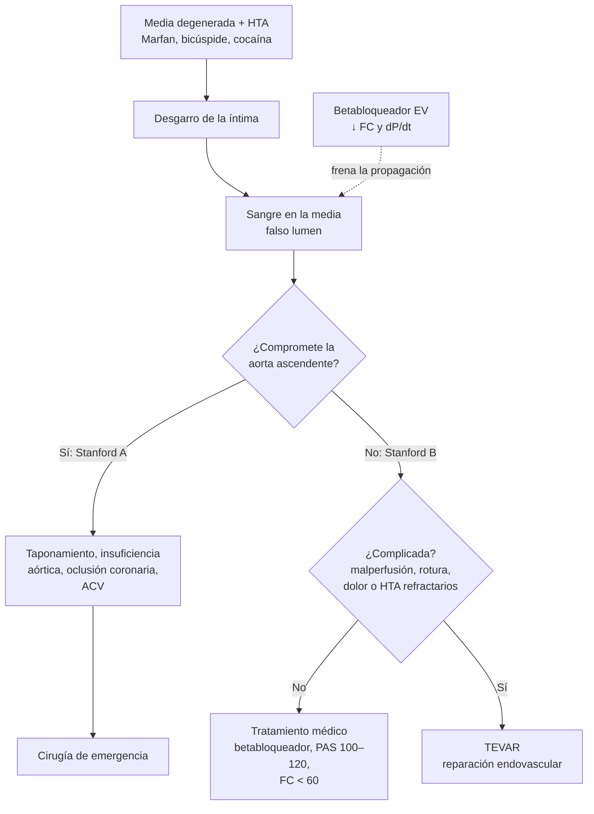

---
tags:
  - Cardiología
  - Urgencia
---

# Síndrome aórtico agudo: disección aórtica, hematoma intramural y úlcera penetrante

**Subespecialidad**
Cardiología · Cirugía cardiovascular · Medicina de urgencia

**Guías principales**
ESC 2024: enfermedades arteriales periféricas y de la aorta (*Eur Heart J*) · ACC/AHA 2022: diagnóstico y manejo de la enfermedad aórtica

**Otras fuentes**
Registro internacional IRAD (20 años, *Circulation* 2018) · Estudio ADvISED (puntaje ADD-RS + dímero D, *Circulation* 2018) · Series chilenas de tratamiento endovascular de la disección tipo B

**GES**
No

**EUNACOM**
1.01.2.002 Disección aórtica (sospecha, inicial, derivar)

**Revisado**
Septiembre 2026

!!! abstract "Resumen en 60 segundos"
    - **Síndrome aórtico agudo (SAA)**: **disección aórtica** (~ 85–90 %), **hematoma intramural** y **úlcera aórtica penetrante**. Es poco frecuente, pero con una mortalidad de **~ 1–2 % por hora** en las primeras horas si compromete la aorta ascendente sin tratamiento.
    - **Sospecharlo** ante:
        - **Dolor torácico o dorsal súbito e intenso**, "desgarrador", que **migra**.
        - **Déficit de pulso** o **diferencia de PA** > 20 mmHg entre los brazos.
        - **Soplo de insuficiencia aórtica** nuevo, **déficit neurológico**, síncope o **shock**.
        - Pacientes **hipertensos**, con **Marfan** o válvula bicúspide.
    - **Estratificar** con el **puntaje ADD-RS** (0–3). Si el ADD-RS es **≤ 1** y el **dímero D < 500 ng/mL**, el SAA queda prácticamente descartado.
    - **Diagnóstico**: **angio-TC de tórax y abdomen** (la de elección). **Ecocardiograma** transtorácico o transesofágico al lado de la cama en el paciente inestable.
    - **Clasificación de Stanford**: **tipo A** (compromete la **aorta ascendente**) = **cirugía de emergencia**; **tipo B** (distal a la subclavia izquierda) = **tratamiento médico**, o **endovascular (TEVAR)** si está complicado.
    - **Tratamiento médico inmediato**:
        - **Analgesia** con opioides.
        - **Betabloqueador EV** primero (**FC < 60 lpm**), luego un vasodilatador si es necesario (**PAS 100–120 mmHg**).
    - **No dar antitrombóticos ni trombolíticos** si se sospecha un SAA: un "IAM" con dolor dorsal y déficit de pulso puede ser una disección tipo A que ocluye una coronaria.

## Definición

- **Síndrome aórtico agudo**: conjunto de condiciones **agudas** de la aorta con un mecanismo común: la **rotura de la capa media**.
    - **Disección aórtica**: un **desgarro de la íntima** permite que la sangre entre en la media y la separe. Se forma un **falso lumen** separado del verdadero por un **colgajo (flap)** íntimo-medial.
    - **Hematoma intramural**: sangrado dentro de la media **sin desgarro** íntimo visible (rotura de los *vasa vasorum* o microdesgarros).
    - **Úlcera aórtica penetrante**: ulceración de una **placa aterosclerótica** que atraviesa la lámina elástica interna hacia la media. Típica del adulto mayor con aterosclerosis extensa.
    - **Rotura** (contenida o libre) de un aneurisma o de cualquiera de los anteriores.
- **Temporalidad** (ESC): **hiperaguda** (< 24 h), **aguda** (1–14 días), **subaguda** (15–90 días) y **crónica** (> 90 días).

## Epidemiología

### Mundial

- Incidencia de **~ 3–6 por 100.000** habitantes por año (probablemente subestimada, porque muchos pacientes mueren antes de llegar al hospital). Aumenta con la edad (pico entre los **60 y 70 años**) y es **~ 2 veces más frecuente en los hombres**.
- **IRAD** (> 7.300 casos en 20 años):
    - La **tipo A** es la más frecuente (**~ 2/3**).
    - El **uso de la TC** para el diagnóstico aumentó, y cada vez más pacientes reciben **cirugía** (tipo A) o **tratamiento endovascular** (tipo B).
    - La **mortalidad hospitalaria de la tipo A** disminuyó con estos cambios, pero **no** la de la tipo B.
- **Mortalidad**:
    - **Tipo A sin cirugía**: **~ 1–2 % por hora** en las primeras 48 horas, y **~ 50 %** al mes.
    - **Tipo A operada**: ~ 15–25 % hospitalaria.
    - **Tipo B no complicada** con tratamiento médico: ~ 10 %.
- El diagnóstico es **difícil**: hasta un tercio se diagnostica en forma equivocada al inicio (SCA, TEP, abdomen agudo, ACV).

### Chile

!!! chile "Contexto nacional"
    - No existe un **registro nacional** de SAA. Los datos provienen de **series de centros** universitarios y de referencia cardiovascular.
    - Desde la década de 2000, los centros chilenos han reportado series de **tratamiento endovascular (TEVAR)** de la disección tipo B complicada (Mertens, 2008; Ibáñez, 2010).
    - La **cirugía cardiovascular de urgencia** se concentra en los grandes centros (Santiago, Valparaíso, Concepción y otros). Esto obliga a un **traslado precoz** coordinado con el SAMU: el diagnóstico debe hacerse rápido en el hospital de origen (**angio-TC**) para no perder horas.
    - La **hipertensión arterial**, el principal factor de riesgo, afecta a **~ 1 de cada 4** adultos en Chile, con un control insuficiente (ver [hipertensión arterial](hipertension-arterial.md)).

## Etiología y factores de riesgo

| Grupo | Factores |
|---|---|
| **Aumento del estrés de la pared** | **Hipertensión arterial** (**~ 70–80 %**; el más importante), **cocaína** y anfetaminas, **levantamiento de pesas**, feocromocitoma, coartación aórtica, embarazo (3.er trimestre y puerperio) |
| **Debilidad de la media (aortopatías)** | **Síndrome de Marfan**, **síndrome de Ehlers-Danlos vascular**, **síndrome de Loeys-Dietz**, **válvula aórtica bicúspide**, síndrome de Turner, **aneurisma** de la aorta torácica, historia familiar de disección, aortitis (arteritis de Takayasu, de células gigantes, sífilis) |
| **Iatrogenia y trauma** | Cirugía cardíaca o valvular previa, cateterismo, balón de contrapulsación, trauma torácico por desaceleración |
| **Otros** | **Aterosclerosis** (úlcera penetrante), **fluoroquinolonas** (asociación observacional), edad, sexo masculino |

## Fisiopatología

1. La **media** degenerada (pérdida de fibras elásticas y de células musculares lisas) más el **estrés hemodinámico** (HTA) facilitan el **desgarro de la íntima**, sobre todo en la **aorta ascendente** (a pocos centímetros de la válvula) y en el **istmo** (distal a la subclavia izquierda).
2. La sangre entra en la media y la separa en sentido **anterógrado** (y a veces retrógrado): se forma el **falso lumen**.
3. **Complicaciones**:
    - **Proximales** (tipo A):
        - **Taponamiento cardíaco** por rotura al pericardio: la principal causa de muerte.
        - **Insuficiencia aórtica aguda**.
        - **Oclusión coronaria** (sobre todo de la **derecha**): IAM inferior.
    - **Malperfusión** de las ramas: carótidas (**ACV**), subclavias (**déficit de pulso**), mesentéricas (**isquemia intestinal**), renales (LRA, HTA refractaria), médula espinal (**paraplejia**), ilíacas (isquemia de las extremidades).
    - **Rotura** al mediastino, la pleura (hemotórax izquierdo) o el retroperitoneo.
4. El **dP/dt** (velocidad de subida de la presión aórtica en cada latido) propaga la disección. Por eso se baja **primero la frecuencia** y la contractilidad con **betabloqueadores**, y luego la PA.

*Figura 1. Fisiopatología y manejo de la disección aórtica según la clasificación de Stanford. Esquema propio.*

## Clasificación

- **Stanford** (la que decide el tratamiento):
    - **Tipo A**: compromete la **aorta ascendente**, independientemente del sitio del desgarro.
    - **Tipo B**: **no** compromete la ascendente (distal a la subclavia izquierda).
- **DeBakey**:
    - **I**: ascendente, arco y descendente.
    - **II**: sólo la ascendente.
    - **III**: descendente (IIIa torácica, IIIb que se extiende al abdomen).
- **TEM** (ESC): tipo (A, B y "no A-no B" cuando compromete el arco sin la ascendente), sitio de entrada y malperfusión.
- **Tipo B complicada**: rotura o riesgo de rotura, **malperfusión**, **dolor persistente o recurrente**, **HTA refractaria**, expansión rápida.

<figure markdown>
{ loading=lazy }
<figcaption>Figura 2. Clasificaciones de Stanford y DeBakey de la disección aórtica. Esquema propio.</figcaption>
</figure>

## Clínica

- **Dolor** (> 90 %):
    - **Súbito**, **muy intenso** desde el inicio (a diferencia del IAM, que aumenta gradualmente).
    - "**Desgarrador**", "como una puñalada".
    - **Torácico anterior** en la tipo A; **dorsal o interescapular** y abdominal en la tipo B.
    - Puede **migrar** a medida que avanza la disección.
    - Una minoría (~ 5–10 %) tiene **poco o ningún dolor** (adultos mayores, Marfan, pacientes que se presentan con síncope o ACV).
- **Hipertensión** (más en la tipo B) o **hipotensión y shock** (más en la tipo A: taponamiento, rotura, insuficiencia aórtica, IAM).
- **Déficit de pulso** o **diferencia de PA sistólica > 20 mmHg** entre los brazos (~ 20–30 %).
- **Soplo diastólico** de **insuficiencia aórtica** (~ 40–50 % de la tipo A).
- **Síncope** (taponamiento, compromiso carotídeo).
- **Déficit neurológico**: ACV, **paraplejia** (isquemia medular), neuropatía isquémica.
- **Signos de malperfusión**: dolor abdominal (mesentérica), oliguria, extremidad fría.
- **Otros**: derrame pleural izquierdo, disfonía (nervio laríngeo recurrente), síndrome de Horner, síndrome de vena cava superior.

!!! alarma "El error que mata: tratar una disección como un IAM"
    - **Dolor torácico + dorsal**, súbito y máximo desde el inicio, con **déficit de pulso**, **diferencia de PA** o **soplo de insuficiencia aórtica nuevo** = sospecha de disección.
    - Un **SDST inferior** puede deberse a una disección tipo A que ocluye la coronaria derecha.
    - **No** dar **anticoagulantes**, **antiagregantes** (cargas de aspirina y P2Y12) ni **trombolíticos** hasta descartar un SAA si hay sospecha. Pide una **angio-TC** o un ecocardiograma antes.
    - **Hipotensión** en una disección tipo A: piensa en **taponamiento** (ecocardiograma). La **pericardiocentesis** puede empeorar la hemorragia: se prefiere la cirugía inmediata (o un drenaje pericárdico controlado sólo como puente en el paciente en paro inminente).

## Diagnóstico

**Paso 1. Estimar la probabilidad clínica con el puntaje ADD-RS** (0–3 puntos; 1 punto por cada categoría presente):

| Categoría | Características |
|---|---|
| **Condiciones de alto riesgo** | **Síndrome de Marfan** u otra enfermedad del tejido conectivo, **historia familiar** de enfermedad aórtica, **valvulopatía aórtica** conocida, **manipulación aórtica reciente**, **aneurisma** de la aorta torácica conocido |
| **Dolor de alto riesgo** | Torácico, dorsal o abdominal **de inicio abrupto**, **de gran intensidad** o **desgarrador** |
| **Examen de alto riesgo** | **Déficit de pulso** o **diferencia de PA sistólica**, **déficit neurológico focal** con dolor, **soplo de insuficiencia aórtica nuevo** con dolor, **hipotensión o shock** |

**Paso 2. Según el ADD-RS**:

- **ADD-RS 0–1** (probabilidad baja a intermedia): pedir el **dímero D**. Si es **< 500 ng/mL**, el SAA queda prácticamente **descartado** (falla de 0,3 % en ADvISED). Si es positivo: **angio-TC**.
- **ADD-RS 2–3** (alta probabilidad): **angio-TC urgente**, **sin** esperar el dímero D. En el paciente **inestable**: **ecocardiograma** en el punto de atención (transtorácico, y transesofágico en el pabellón o la UCI).

**Paso 3. Estudios en paralelo**:

- **ECG** (descartar un SDST, que puede coexistir).
- **Troponina**.
- **Radiografía de tórax** (mediastino ensanchado, derrame izquierdo; **puede ser normal**).
- Hemograma, creatinina, **lactato** (malperfusión), grupo y Rh, coagulación.

**Paso 4. Angio-TC de tórax, abdomen y pelvis**:

- Confirma el SAA.
- Lo **clasifica** (A o B).
- Define la extensión, la **malperfusión**, el derrame pericárdico y la rotura.
- Planifica la cirugía o el TEVAR.

## Laboratorio

| Examen | Uso |
|---|---|
| **Dímero D** | **< 500 ng/mL con ADD-RS ≤ 1** prácticamente descarta el SAA; alto en la mayoría de las disecciones (no es específico) |
| **Troponina** | Puede estar alta (compromiso coronario, shock); **no descarta** la disección |
| **Hemograma, grupo y Rh, coagulación** | Preparación para la cirugía; anemia por sangrado |
| **Creatinina, lactato, pruebas hepáticas, CK** | **Malperfusión** renal, mesentérica, hepática o de las extremidades |
| **ECG** | SDST (IAM concomitante o diferencial), hipertrofia ventricular por HTA, bajo voltaje (derrame) |

## Imágenes

- **Angio-TC** con sincronización electrocardiográfica: el **examen de elección** (sensibilidad y especificidad > 95 %), rápido y disponible.
- **Ecocardiograma transtorácico**: colgajo en la raíz aórtica, **insuficiencia aórtica**, **derrame pericárdico o taponamiento**, función ventricular. Es útil al lado de la cama en el paciente inestable, pero **no descarta** una disección.
- **Ecocardiograma transesofágico**: muy sensible para la aorta torácica; en el pabellón o la UCI, en el paciente inestable.
- **RM**: seguimiento y pacientes estables con contraindicación de contraste yodado.
- **Radiografía de tórax**: **ensanchamiento mediastínico**, contorno aórtico anormal, derrame pleural izquierdo. **Una radiografía normal no descarta** el SAA.

## Diagnóstico diferencial

| Cuadro | Claves |
|---|---|
| **Síndrome coronario agudo** | Dolor opresivo que aumenta en minutos, cambios del ECG y troponina dinámicos. **Puede coexistir** (oclusión coronaria por la disección) |
| **TEP** | Disnea, taquicardia, factores de riesgo de TVP, VD dilatado, angio-TC |
| **Pericarditis** | Dolor pleurítico y posicional, frote, SDST difuso con infradesnivel del PR |
| **Neumotórax** | Dolor pleurítico súbito, murmullo disminuido |
| **Rotura esofágica (Boerhaave)** | Vómitos previos, enfisema subcutáneo |
| **Abdomen agudo** (isquemia mesentérica, pancreatitis, rotura de un aneurisma abdominal) | Dolor abdominal con dorsalgia; la disección puede producir isquemia mesentérica |
| **ACV** | Déficit neurológico; en el ACV con dolor torácico o dorsal, descartar una disección **antes** de trombolizar |
| **Cólico renal** | Dolor en el flanco irradiado a la ingle, hematuria |

## Tratamiento

!!! guia "ESC 2024 y ACC/AHA 2022"
    - **Tratamiento médico inmediato en todos**:
        - **Analgesia** con opioides.
        - **Betabloqueador EV** para una **FC < 60 lpm**.
        - Luego un **vasodilatador EV** si la PAS sigue alta, con meta de **PAS 100–120 mmHg** (la menor PA que mantenga la perfusión de los órganos).
    - **Tipo A**: **cirugía de emergencia** (reemplazo de la aorta ascendente ± el arco y la válvula). En los pacientes con malperfusión, la estrategia se define en un centro con experiencia.
    - **Tipo B no complicada**: **tratamiento médico** y vigilancia con imágenes. En los pacientes con características de alto riesgo, se puede considerar el **TEVAR** en la fase subaguda.
    - **Tipo B complicada** (malperfusión, rotura o riesgo de rotura, dolor o HTA refractarios, expansión rápida): **TEVAR** (reparación endovascular), de preferencia frente a la cirugía abierta.
    - **Hematoma intramural** y **úlcera penetrante**: se manejan en forma similar a la disección del mismo tipo (A = cirugía en la mayoría; B = médico o endovascular según las características).

!!! dosis "Control de la frecuencia y la PA en el SAA"
    - **Analgesia**: **morfina 2–4 mg EV** o **fentanilo 25–50 µg EV**, repetir según la respuesta (el dolor aumenta la PA y la FC).
    - **Betabloqueador EV** (primero, antes del vasodilatador, para evitar la taquicardia refleja):
        - **Labetalol**: 20 mg EV en 2 min, luego 20–80 mg cada 10 min (máximo 300 mg), o infusión de 0,5–2 mg/min.
        - **Esmolol**: carga de 500 µg/kg en 1 min, luego una infusión de 50–300 µg/kg/min (de acción corta: útil si hay dudas de tolerancia).
        - **Metoprolol**: 5 mg EV cada 5 min hasta 15 mg.
    - Si hay **contraindicación** de betabloqueadores (asma grave, bloqueo AV): **diltiazem** o **verapamilo** EV.
    - **Vasodilatador** si la PAS sigue > 120 con la FC controlada:
        - **Nitroprusiato** 0,25–3 µg/kg/min.
        - **Nicardipino** 5–15 mg/h.
        - **Clevidipino**.
    - **Hipotensión**: buscar el **taponamiento**, la insuficiencia aórtica grave, el IAM o la rotura. Dar volumen con cautela y derivar a **cirugía inmediata**.
    - Vía arterial (en el brazo con la **PA más alta**), sonda vesical, monitoreo en la UCI.

## Complicaciones

- **Taponamiento cardíaco** (la principal causa de muerte en la tipo A).
- **Insuficiencia aórtica aguda** con insuficiencia cardíaca.
- **IAM** por compromiso coronario.
- **Rotura** aórtica (hemotórax, hemomediastino, hemoperitoneo).
- **Malperfusión**: **ACV**, **paraplejia**, **isquemia mesentérica**, LRA, isquemia de las extremidades.
- **Dilatación aneurismática** crónica del falso lumen y **redisección**.
- **Del tratamiento**: mortalidad y morbilidad quirúrgicas (ACV, falla renal), complicaciones del TEVAR (endofugas, isquemia medular, disección retrógrada).

## Pronóstico y seguimiento

- **Tipo A**: sin cirugía, la mortalidad es de ~ **50 % al mes**. Con cirugía, la mortalidad hospitalaria es de ~ 15–25 %, y la mayoría de los sobrevivientes vive muchos años con seguimiento.
- **Tipo B no complicada**: mortalidad hospitalaria de ~ 10 %. A largo plazo, **~ 20–40 %** desarrolla una **dilatación aneurismática** que requiere intervención.
- **Perfil EUNACOM**: **sospecha** (dolor característico, pulsos, PA en ambos brazos, soplo), **tratamiento inicial** (analgesia, betabloqueador EV, control de la PA, **no dar antitrombóticos**) y **derivación urgente** a un centro con cirugía cardiovascular.
- **Seguimiento**:
    - **Control estricto de la PA** (< 130/80) con **betabloqueador** de base.
    - **Imágenes** (TC o RM) al mes, a los 6 meses, al año y luego cada 1–2 años.
    - Evitar el esfuerzo isométrico intenso y los estimulantes (cocaína).
    - Estudio **genético** y **tamizaje familiar** en los jóvenes o con sospecha de aortopatía hereditaria.
    - Evitar las fluoroquinolonas si hay alternativas.

## Perlas para el internado

!!! perla "Para la sala y el turno"
    - **Toma la PA en ambos brazos** y palpa los pulsos en todo paciente con dolor torácico.
    - **Dolor máximo desde el inicio**, desgarrador, que migra al dorso: piensa en la **aorta**.
    - **ADD-RS ≤ 1 + dímero D < 500** descarta; **ADD-RS ≥ 2** = angio-TC directo.
    - **Betabloqueador primero, vasodilatador después**: el nitroprusiato solo produce taquicardia refleja y aumenta el dP/dt.
    - **No cargues aspirina ni clopidogrel** a un "IAM inferior" con dolor dorsal intenso y soplo diastólico sin pensar en una disección.
    - **Hipotensión en la disección tipo A** = taponamiento hasta demostrar lo contrario: ecocardiograma y **cirujano ya**.
    - **Paraplejia súbita con dolor dorsal** = disección con isquemia medular (o un hematoma epidural).
    - El tiempo cuenta: en la tipo A, **cada hora aumenta la mortalidad**. Coordina el traslado temprano.

## Preguntas de repaso

??? repaso "1. Hombre de 58 años, hipertenso mal controlado, con dolor torácico súbito e intenso que irradia a la espalda. PA 180/100 en el brazo derecho y 140/85 en el izquierdo. Soplo diastólico aórtico. ¿Qué sospechas y qué haces?"
    **Disección aórtica**, probablemente **tipo A** (soplo de insuficiencia aórtica, diferencia de PA). Su ADD-RS es 2 (dolor de alto riesgo + examen de alto riesgo).

    1. **Angio-TC** de tórax, abdomen y pelvis urgente, sin esperar el dímero D.
    2. **Analgesia** con morfina.
    3. **Betabloqueador EV** (labetalol o esmolol) hasta una **FC < 60**; luego vasodilatador si la PAS sigue > 120.
    4. **ECG** y troponina.
    5. **No** dar antiagregantes ni anticoagulantes.
    6. **Ecocardiograma** para buscar el derrame pericárdico.
    7. Si se confirma la tipo A: **cirugía de emergencia** (traslado inmediato).

??? repaso "2. Mujer de 65 años con dolor torácico opresivo de 2 horas, sin dolor dorsal, sin factores de alto riesgo ni hallazgos al examen, con ECG normal. Se considera un SAA en el diferencial. ¿Cómo lo descartas?"
    Su **ADD-RS es 0 o 1** (probabilidad baja). Pedir un **dímero D**: si es **< 500 ng/mL**, el SAA queda prácticamente descartado (estrategia ADvISED, falla de 0,3 %), y se sigue con el estudio del dolor torácico (troponinas seriadas, etc.). Si el dímero D es positivo: **angio-TC**.

??? repaso "3. Paciente con disección aórtica tipo B, PA 170/95 y FC 95, sin signos de malperfusión. ¿Cuál es el tratamiento?"
    **Disección tipo B no complicada**: **tratamiento médico** en la UCI.

    - **Analgesia**.
    - **Betabloqueador EV** hasta una **FC < 60 lpm** (labetalol o esmolol).
    - Luego un **vasodilatador** (nitroprusiato o nicardipino) si la **PAS** sigue > 120, con meta de **100–120 mmHg**.
    - Vía arterial y control de la diuresis y el lactato.
    - **Vigilar la malperfusión**, el dolor persistente, la HTA refractaria y la expansión. Si aparecen, se convierte en una tipo B **complicada**: **TEVAR**.
    - Imágenes de control.

??? repaso "4. ¿Por qué se usa primero el betabloqueador y luego el vasodilatador en la disección aórtica?"
    Porque el objetivo es reducir el **dP/dt** (la fuerza con que la sangre golpea la pared en cada sístole), que es lo que **propaga** la disección. El betabloqueador baja la **frecuencia** y la **contractilidad**. Si se usa primero un **vasodilatador** solo, produce **taquicardia refleja** y aumenta el dP/dt, lo que puede extender la disección.

??? repaso "5. Paciente con SDST inferior, dolor torácico que irradia a la espalda y déficit de pulso radial izquierdo. ¿Qué haces antes de activar la reperfusión?"
    Sospechar una **disección aórtica tipo A** que compromete la **coronaria derecha**.

    - **Antes** de dar antitrombóticos o trombolíticos, obtener una **imagen de la aorta**: **ecocardiograma** al lado de la cama (colgajo en la raíz, insuficiencia aórtica, derrame) y **angio-TC** si el paciente lo permite.
    - La trombólisis o la anticoagulación en una disección pueden ser **mortales**.
    - Si se confirma: **cirugía cardíaca de emergencia**.

## Referencias

1. Mazzolai L, Teixido-Tura G, Lanzi S, et al. 2024 ESC Guidelines for the management of peripheral arterial and aortic diseases. *Eur Heart J.* 2024;45:3538–3700. doi:[10.1093/eurheartj/ehae179](https://doi.org/10.1093/eurheartj/ehae179)
2. Isselbacher EM, Preventza O, Hamilton Black J 3rd, et al. 2022 ACC/AHA Guideline for the Diagnosis and Management of Aortic Disease: A Report of the American Heart Association/American College of Cardiology Joint Committee on Clinical Practice Guidelines. *Circulation.* 2022;146:e334–e482. doi:[10.1161/CIR.0000000000001106](https://doi.org/10.1161/CIR.0000000000001106)
3. Evangelista A, Isselbacher EM, Bossone E, et al. Insights From the International Registry of Acute Aortic Dissection: A 20-Year Experience of Collaborative Clinical Research. *Circulation.* 2018;137:1846–1860. doi:[10.1161/CIRCULATIONAHA.117.031264](https://doi.org/10.1161/CIRCULATIONAHA.117.031264)
4. Nazerian P, Mueller C, Soeiro AM, et al. Diagnostic Accuracy of the Aortic Dissection Detection Risk Score Plus D-Dimer for Acute Aortic Syndromes: The ADvISED Prospective Multicenter Study. *Circulation.* 2018;137:250–258. doi:[10.1161/CIRCULATIONAHA.117.029457](https://doi.org/10.1161/CIRCULATIONAHA.117.029457)
5. Mertens R, Arriagada I, Valdés F, et al. Endovascular treatment of type B aortic dissection [artículo en español]. *Rev Med Chile.* 2008;136:1431–1438. doi:[10.4067/s0034-98872008001100009](https://doi.org/10.4067/s0034-98872008001100009)
6. Ibáñez F, Bianchi V, Seitz J, et al. Endovascular management of acute complications of type B aortic dissection [artículo en español]. *Rev Med Chile.* 2010;138:821–826. doi:[10.4067/s0034-98872010000700005](https://doi.org/10.4067/s0034-98872010000700005)
