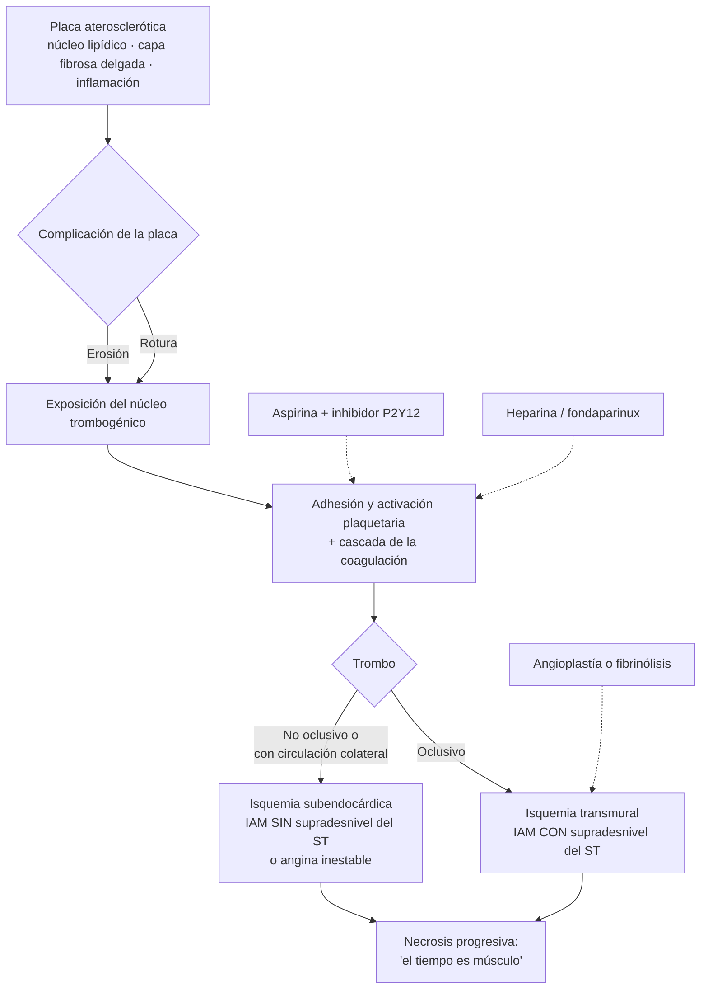
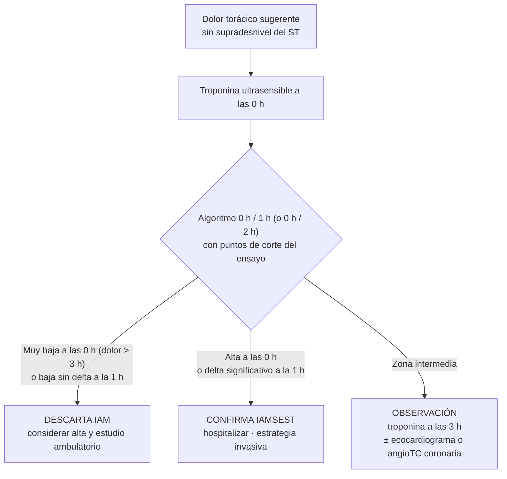
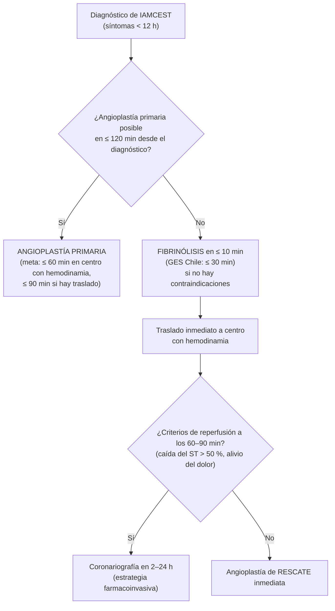

---
tags:
  - Cardiología
  - GES
  - Urgencia
  - Frecuente en sala
---

# Síndrome coronario agudo

**Subespecialidad**
Cardiología · Urgencias

**Guías principales**
ESC 2023 (síndromes coronarios agudos) · ACC/AHA/ACEP/NAEMSP/SCAI 2025

**Otras fuentes**
Cuarta definición universal de infarto (2018) · Guía GES MINSAL infarto agudo del miocardio · ESC 2026 rehabilitación cardíaca

**GES**
Sí: infarto agudo del miocardio (confirmación, trombólisis y prevención secundaria)

**Revisado**
Septiembre 2026

!!! abstract "Resumen en 60 segundos"
    - El **síndrome coronario agudo (SCA)** incluye el **IAM con supradesnivel del ST (IAMCEST)**, el **IAM sin supradesnivel del ST (IAMSEST)** y la **angina inestable**.
    - **ECG en ≤ 10 minutos** desde la llegada. El **supradesnivel del ST** (o sus equivalentes) obliga a **reperfundir de inmediato**, sin esperar la troponina.
    - **IAMCEST**: **angioplastía primaria** si se puede hacer en **≤ 120 minutos** desde el diagnóstico; si no, **fibrinólisis en ≤ 10 minutos** (en Chile, garantía GES: **≤ 30 minutos**) y traslado a un centro con hemodinamia.
    - **SCA sin supradesnivel**: diagnóstico con **troponina ultrasensible** (algoritmos 0/1 h o 0/2 h) y estrategia invasiva según riesgo: **inmediata (< 2 h)** si es de muy alto riesgo, **precoz (< 24 h)** si es de alto riesgo.
    - Tratamiento: **aspirina + inhibidor P2Y12** (ticagrelor o prasugrel de preferencia) por **12 meses**, **anticoagulación** en la fase aguda, **estatina de alta intensidad**, y según la FEVI: betabloqueador, IECA/ARA-II, ARM e iSGLT2.
    - Complicaciones clave: **arritmias** (FV precoz), **IC y shock cardiogénico**, **complicaciones mecánicas** (días 2–7) e **infarto de VD** (no dar nitratos).

## Definición

El **síndrome coronario agudo** es el conjunto de cuadros causados por una **reducción aguda del flujo coronario**, habitualmente por **trombosis sobre una placa aterosclerótica** complicada.

**Infarto agudo al miocardio (cuarta definición universal, 2018)**: **injuria miocárdica aguda** (**alza y/o caída de la troponina** con al menos un valor sobre el **percentil 99** del límite superior de referencia) **con evidencia clínica de isquemia**, es decir, al menos uno de:

- Síntomas de isquemia miocárdica.
- Cambios isquémicos nuevos en el ECG.
- Aparición de **ondas Q** patológicas.
- Imagen con pérdida nueva de miocardio viable o alteración nueva de la motilidad segmentaria.
- Trombo coronario en la angiografía o la autopsia.

| Entidad | ECG | Troponina |
|---|---|---|
| **IAM con supradesnivel del ST (IAMCEST)** | Supradesnivel persistente del ST (> 20 min) o equivalente | Elevada (no esperarla para reperfundir) |
| **IAM sin supradesnivel del ST (IAMSEST)** | Infradesnivel del ST, inversión de T, cambios transitorios o ECG normal | **Elevada** con curva de alza o caída |
| **Angina inestable** | Igual que el IAMSEST | **Normal** (menos frecuente con troponina ultrasensible) |

### Tipos de infarto (definición universal)

| Tipo | Mecanismo |
|---|---|
| **1** | **Aterotrombótico**: rotura o erosión de placa con trombosis (el SCA "clásico") |
| **2** | **Desbalance oferta/demanda** sin trombosis aguda: anemia, taquiarritmia, hipotensión o shock, hipoxemia, crisis hipertensiva, espasmo coronario |
| **3** | Muerte súbita con síntomas isquémicos antes de obtener la troponina |
| **4** | Asociado a angioplastía (4a), trombosis del stent (4b), reestenosis (4c) |
| **5** | Asociado a cirugía de revascularización |

!!! perla "Injuria miocárdica no es lo mismo que infarto"
    La **troponina elevada sin cuadro isquémico** es **injuria miocárdica** (aguda si hay curva, crónica si está estable). Causas frecuentes: **sepsis**, **ERC**, **TEP**, **IC**, miocarditis, **Takotsubo**, taquiarritmias, ACV, quimioterapia cardiotóxica, contusión cardíaca.

## Epidemiología

### Mundial

- La **cardiopatía isquémica** es la **primera causa de muerte en el mundo** (~ 9 millones de muertes al año, GBD).
- El IAMSEST es hoy **más frecuente** que el IAMCEST, y sus pacientes son mayores y con más comorbilidades.
- La **mortalidad intrahospitalaria** del IAMCEST es ~ 4–12 % y a 1 año ~ 10 %; en el shock cardiogénico supera el 40 %.
- Las **mujeres**, los **diabéticos** y los **adultos mayores** consultan con síntomas atípicos y reciben reperfusión más tarde.

### Chile

!!! chile "Datos nacionales"
    - Las **enfermedades cardiovasculares** son, junto al cáncer, la **principal causa de muerte** en Chile, y la **cardiopatía isquémica** es una de las primeras causas específicas.
    - El **IAM** es **GES desde 2005**: garantiza el **ECG** para confirmar el diagnóstico, la **trombólisis dentro de 30 minutos** desde la confirmación en el IAMCEST (cuando está indicada) y la **prevención secundaria** después del alta.
    - La implementación del GES se asoció a una **reducción de ~ 50 % de la mortalidad a 1 año** post-IAM en el sistema público (estudios nacionales comparando los períodos pre y post-GES).
    - La red de hemodinamia (angioplastía primaria) está concentrada en grandes ciudades; en muchas zonas la **fibrinólisis** sigue siendo la primera estrategia de reperfusión, seguida de traslado (**estrategia farmacoinvasiva**).
    - Factores de riesgo prevalentes (ENS 2016–2017): HTA 27,6 %, diabetes 12,3 %, tabaquismo 33 %, colesterol total elevado ~ 28 %, obesidad 31 %.

## Etiología y factores de riesgo

- **Aterosclerosis coronaria** con rotura o erosión de placa (> 90 % de los casos).
- **Otras causas**: disección coronaria espontánea (mujeres jóvenes, periparto), **vasoespasmo** (cocaína, angina de Prinzmetal), embolía coronaria (FA, endocarditis), MINOCA (IAM sin obstrucción coronaria significativa), Takotsubo (diagnóstico diferencial).

**Factores de riesgo cardiovascular**

- **No modificables**: edad, sexo masculino (las mujeres se igualan después de la menopausia), antecedente familiar de enfermedad coronaria precoz (hombre < 55 años, mujer < 65 años).
- **Modificables**: **tabaquismo**, **dislipidemia** (LDL alto, Lp(a) elevada), **HTA**, **diabetes**, **obesidad**, sedentarismo, **ERC**, estrés psicosocial, enfermedades inflamatorias crónicas (artritis reumatoide, lupus, VIH), contaminación ambiental.

## Fisiopatología

*Figura 1. Fisiopatología del SCA y sitio de acción del tratamiento. Esquema propio basado en ESC 2023.*

- La necrosis avanza del **subendocardio al epicardio** ("frente de onda"): tras ~ 20 minutos de oclusión comienza la muerte celular y a las **~ 6 horas** la necrosis es casi completa. Reperfundir precozmente **salva miocardio**.
- La **isquemia** produce alteraciones eléctricas (arritmias, cambios del ST), **disfunción contráctil** (IC, shock) y, si la necrosis es extensa, **complicaciones mecánicas**.

## Clasificación

### Por el ECG

- **SCA con supradesnivel del ST** → IAMCEST.
- **SCA sin supradesnivel del ST** → IAMSEST o angina inestable (según la troponina).

### Localización según el ECG

| Derivaciones con supradesnivel | Territorio | Arteria habitual |
|---|---|---|
| **V1–V4** | **Anterior** / anteroseptal | **Descendente anterior** |
| **I, aVL, V5–V6** | **Lateral** | **Circunfleja** o diagonal |
| **II, III, aVF** | **Inferior** | **Coronaria derecha** (~ 80 %) o circunfleja |
| **V3R–V4R** | **Ventrículo derecho** (acompaña al inferior) | Coronaria derecha proximal |
| **V7–V9** (con infradesnivel en V1–V3) | **Posterior** | Circunfleja o coronaria derecha |

### Clasificación de Killip-Kimball (al ingreso)

| Clase | Hallazgos | Mortalidad aproximada a 30 días |
|---|---|---|
| **I** | Sin signos de IC | ~ 5 % |
| **II** | Crépitos en < 50 % de los campos, tercer ruido, ingurgitación yugular | ~ 10–15 % |
| **III** | **Edema pulmonar agudo** | ~ 20–30 % |
| **IV** | **Shock cardiogénico** | > 40 % |

### Escalas de riesgo

- **GRACE**: estima la mortalidad intrahospitalaria y a 6 meses; **> 140 puntos = alto riesgo** (define la estrategia invasiva precoz en el SCA sin supradesnivel).
- **TIMI** (sin supradesnivel, 7 variables) y **HEART** (dolor torácico en urgencia): estratificación rápida.
- **Riesgo de sangrado**: criterios ARC-HBR, PRECISE-DAPT, CRUSADE.

## Clínica

**Dolor torácico típico (anginoso)**

- **Opresivo**, retroesternal, difuso, que se **irradia** al brazo izquierdo (o ambos), cuello, mandíbula o epigastrio.
- En el SCA: **en reposo o con esfuerzos mínimos**, de **> 20 minutos**, de inicio reciente o en crescendo.
- Síntomas acompañantes: **diaforesis**, náuseas, vómitos, disnea, sensación de muerte inminente, síncope.

**Presentaciones atípicas** (más frecuentes en **mujeres, adultos mayores, diabéticos y ERC**): disnea aislada, fatiga, dolor epigástrico, confusión, síncope o descompensación de IC.

**Examen físico**: con frecuencia normal. Buscar signos de **IC** (Killip), **shock**, **soplo nuevo** (insuficiencia mitral o comunicación interventricular), **infarto de VD** (hipotensión + ingurgitación yugular + pulmones limpios) y diagnósticos diferenciales (asimetría de pulsos en disección, frote pericárdico).

## Diagnóstico

### Electrocardiograma: en los primeros 10 minutos

!!! guia "Criterios de IAMCEST (definición universal)"
    **Supradesnivel nuevo del ST en el punto J en ≥ 2 derivaciones contiguas**:

    - **≥ 1 mm** en todas las derivaciones excepto V2–V3.
    - En **V2–V3**: **≥ 2 mm** en hombres ≥ 40 años, **≥ 2,5 mm** en hombres < 40 años y **≥ 1,5 mm** en mujeres.

    **Equivalentes de IAMCEST** (también requieren reperfusión urgente):

    - **Infarto posterior**: infradesnivel del ST en V1–V3 → registrar **V7–V9** (supradesnivel ≥ 0,5 mm).
    - **Bloqueo de rama izquierda** o ritmo de marcapaso con síntomas sugerentes (criterios de **Sgarbossa**), sobre todo si hay inestabilidad.
    - **Supradesnivel en aVR** con **infradesnivel difuso** (≥ 6 derivaciones): enfermedad de tronco o de tres vasos.
    - **Ondas T de de Winter** (infradesnivel ascendente del ST con T altas en precordiales): oclusión de la descendente anterior.

<figure markdown>
{ loading=lazy }
<figcaption>Figura 2. Evolución temporal del ECG en la derivación que mira al territorio infartado. Esquema propio.</figcaption>
</figure>

- **Repetir el ECG** cada 15–30 minutos si el primero no es diagnóstico y el dolor persiste, y **siempre** ante cambios de los síntomas.
- En el **IAM inferior**, registrar **V3R–V4R** (infarto de VD).
- El **ECG normal no descarta** un SCA (hasta ~ 1 de cada 3 IAMSEST tiene un ECG inicial normal o inespecífico).
- **Criterios de Wellens**: ondas T bifásicas o profundamente invertidas en V2–V3 en un paciente **sin dolor**: estenosis crítica de la descendente anterior (no hacer test de esfuerzo; coronariografía).

### Troponina ultrasensible (SCA sin supradesnivel)

*Figura 3. Algoritmo de troponina ultrasensible 0 h/1 h (ESC 2023). Los puntos de corte dependen del ensayo que use tu laboratorio. Esquema propio.*

## Laboratorio

- **Troponina ultrasensible** (T o I) seriada.
- **Hemograma** (anemia como causa de IAM tipo 2; plaquetas antes de antitrombóticos).
- **Creatinina y electrolitos** (K⁺, Mg²⁺: arritmias; TFGe para ajustar fármacos y contraste).
- **Glicemia y HbA1c**, **perfil lipídico** (en las primeras 24 horas).
- **Pruebas de coagulación** (TP/INR, TTPA), grupo y Rh.
- **BNP o NT-proBNP** si hay IC (pronóstico).
- Test de embarazo y screening de drogas (cocaína) según el caso.

## Imágenes

- **Radiografía de tórax**: congestión, diagnósticos diferenciales (mediastino ancho en disección, neumotórax).
- **Ecocardiograma** (idealmente en la urgencia si hay dudas): **alteraciones segmentarias de la motilidad**, FEVI, **complicaciones mecánicas**, derrame pericárdico, diagnósticos diferenciales (disección, TEP, Takotsubo). Obligatorio antes del alta para medir la FEVI.
- **Coronariografía**: diagnóstica y terapéutica (angioplastía con stent).
- **AngioTC coronaria**: en pacientes de **riesgo bajo-intermedio** con troponina y ECG no concluyentes, para descartar enfermedad coronaria.
- **RM cardíaca**: MINOCA, miocarditis, Takotsubo, viabilidad.

## Diagnóstico diferencial

!!! alarma "Dolor torácico: causas que matan"
    - **Síndrome coronario agudo**.
    - **Disección aórtica**: dolor desgarrante irradiado al dorso, asimetría de pulsos o PA, soplo de insuficiencia aórtica, mediastino ancho. **Nunca fibrinolisar ni anticoagular sin descartarla** si hay sospecha.
    - **Tromboembolismo pulmonar**: disnea súbita, taquicardia, hipoxemia, factores de riesgo de trombosis.
    - **Neumotórax a tensión**.
    - **Taponamiento cardíaco**.
    - **Rotura esofágica** (síndrome de Boerhaave).

Otros: **pericarditis** (dolor pleurítico que mejora al inclinarse hacia adelante, supradesnivel difuso cóncavo con infradesnivel del PR), **miocarditis**, **Takotsubo** (mujer posmenopáusica, estrés emocional, disquinesia apical), espasmo esofágico, reflujo, dolor osteomuscular, crisis de pánico, herpes zóster.

## Tratamiento

### Medidas iniciales (todo SCA)

- **Monitorización** continua del ECG, **desfibrilador disponible**, vía venosa.
- **Oxígeno solo si SatO₂ < 90 %** (el oxígeno de rutina no beneficia y puede dañar).
- **Aspirina 150–300 mg** masticada (o 75–250 mg EV) apenas se sospeche, salvo alergia verdadera.
- **Nitroglicerina** sublingual (0,4 mg) o EV para el dolor, la HTA o la congestión. **Contraindicada** si PAS < 90 mmHg, **infarto de VD**, uso de inhibidores de la PDE-5 en las últimas 24–48 horas o estenosis aórtica grave.
- **Analgesia**: opioides EV (morfina 2–4 mg) si el dolor es intenso y no cede; usar con cautela (retrasa la absorción de los inhibidores P2Y12 orales).
- **No AINE** (excepto aspirina).

### IAM con supradesnivel del ST: reperfusión

*Figura 4. Estrategia de reperfusión en el IAMCEST. Esquema propio basado en ESC 2023 y ACC/AHA 2025.*

- **Indicación**: síntomas de **< 12 horas** con supradesnivel persistente o equivalente. Entre **12 y 48 horas**, angioplastía primaria si persisten los síntomas o hay inestabilidad; también en el **shock cardiogénico** o arritmias graves a cualquier tiempo.
- **Angioplastía primaria**: de elección. Acceso **radial**. Se trata la arteria culpable; la **revascularización completa** de las otras lesiones (en el mismo procedimiento o antes de 45 días) reduce eventos, excepto en el shock cardiogénico, donde se trata solo la culpable.

!!! dosis "Fibrinolíticos"
    - **Tenecteplase** (TNK): bolo único EV según peso (**30 mg** < 60 kg; **35 mg** 60–69 kg; **40 mg** 70–79 kg; **45 mg** 80–89 kg; **50 mg** ≥ 90 kg). **Mitad de la dosis en ≥ 75 años**.
    - **Alteplase**: 15 mg EV en bolo + 0,75 mg/kg en 30 min (máx. 50 mg) + 0,5 mg/kg en 60 min (máx. 35 mg).
    - **Estreptokinasa**: 1,5 millones UI EV en 30–60 min (no repetir; alérgica e hipotensora).
    - **Coadyuvantes**: aspirina + **clopidogrel 300 mg** (75 mg sin carga en ≥ 75 años) + **enoxaparina** (30 mg EV + 1 mg/kg SC c/12 h; en ≥ 75 años sin bolo y 0,75 mg/kg c/12 h).

!!! alarma "Contraindicaciones absolutas de la fibrinólisis"
    - **Hemorragia intracraneana** previa o ACV de causa desconocida (en cualquier momento).
    - **ACV isquémico** en los últimos **6 meses**.
    - Daño o neoplasia del SNC o malformación arteriovenosa.
    - **Trauma mayor, cirugía o TEC** en el último mes.
    - **Hemorragia digestiva** en el último mes.
    - Trastorno hemorrágico conocido (excluida la menstruación).
    - **Disección aórtica** (sospecha o confirmada).
    - Punciones no compresibles en las últimas 24 horas (biopsia hepática, punción lumbar).

### SCA sin supradesnivel del ST: estrategia invasiva

| Riesgo | Criterios | Coronariografía |
|---|---|---|
| **Muy alto** | **Inestabilidad hemodinámica o shock**, **dolor recurrente o refractario** pese al tratamiento, **arritmias graves** o paro cardíaco, **complicaciones mecánicas**, **IC aguda** por el SCA, cambios dinámicos recurrentes del ST | **Inmediata (< 2 h)** |
| **Alto** | **IAMSEST confirmado** (troponina), cambios dinámicos o nuevos del ST/T, supradesnivel transitorio del ST, **GRACE > 140** | **Precoz (< 24 h)** |
| **Bajo** | Sin criterios anteriores (troponina normal, ECG sin cambios, sin recurrencia) | Estrategia **selectiva**: test de isquemia o angioTC coronaria antes del alta |

### Tratamiento antitrombótico

!!! dosis "Antiagregantes plaquetarios"
    | Fármaco | Carga | Mantención | Comentarios |
    |---|---|---|---|
    | **Aspirina** | 150–300 mg VO | **75–100 mg/día** | De por vida |
    | **Ticagrelor** | **180 mg** | **90 mg c/12 h** | De elección (ESC y AHA 2025, junto a prasugrel). Disnea, bradiarritmias. No con fibrinólisis reciente. Aspirina ≤ 100 mg |
    | **Prasugrel** | **60 mg** | **10 mg/día** (5 mg si ≥ 75 años o < 60 kg) | **Contraindicado con ACV o AIT previo**. Se da cuando se conoce la anatomía coronaria |
    | **Clopidogrel** | **300–600 mg** (300 mg con fibrinólisis; 75 mg sin carga en ≥ 75 años fibrinolisados) | **75 mg/día** | Cuando ticagrelor y prasugrel no están disponibles o están contraindicados, con fibrinólisis o con anticoagulación oral |

!!! dosis "Anticoagulantes en la fase aguda"
    - **Heparina no fraccionada**: 70–100 UI/kg EV en bolo durante la angioplastía.
    - **Enoxaparina**: 1 mg/kg SC c/12 h (ajustar a 1 mg/kg/día con TFGe < 30).
    - **Fondaparinux**: 2,5 mg SC/día en el SCA sin supradesnivel si no se hará coronariografía precoz (necesita heparina adicional durante la angioplastía).
    - Suspender la anticoagulación parenteral después de la angioplastía, salvo otra indicación.

- **Doble antiagregación (aspirina + P2Y12)**: **12 meses** por defecto. Alternativas según el riesgo de sangrado:
    - **Alto riesgo de sangrado**: acortar a **1–3 meses** y seguir con un solo antiagregante.
    - **Monoterapia con ticagrelor** después de **≥ 1 mes** de doble antiagregación tras la angioplastía (AHA/ACC 2025).
    - **Desescalar** de ticagrelor o prasugrel a clopidogrel en pacientes seleccionados.
- **Pacientes con FA**: triple terapia (anticoagulante oral + aspirina + clopidogrel) por el menor tiempo posible (habitualmente **≤ 1 semana**), luego anticoagulante + clopidogrel hasta los 12 meses y después solo anticoagulante.
- **IBP** en pacientes con doble antiagregación y riesgo de sangrado digestivo.

### Tratamiento a largo plazo (prevención secundaria)

| Fármaco | Indicación y meta |
|---|---|
| **Estatina de alta intensidad** (atorvastatina 40–80 mg o rosuvastatina 20–40 mg) | **Todos**, iniciar precozmente. Meta ESC: **LDL < 55 mg/dL** y reducción ≥ 50 %; agregar **ezetimibe** y luego **inhibidores de PCSK9** si no se logra |
| **Betabloqueador** | **FEVI ≤ 40 %** (clase I). Con FEVI conservada su beneficio actual es menor (estudios REDUCE-AMI 2024 y REBOOT 2025); considerar según síntomas, arritmias o HTA |
| **IECA (o ARA-II)** | **FEVI ≤ 40 %**, **IC**, **diabetes**, **HTA** o **ERC**; considerarlo en todos |
| **ARM (eplerenona o espironolactona)** | FEVI ≤ 40 % con IC o diabetes |
| **iSGLT2** | IC, diabetes o ERC según indicación |
| **Aspirina** | De por vida |
| **Vacuna contra influenza** | Anual (reduce eventos cardiovasculares) |
| **Rehabilitación cardíaca** | **Todos** (ESC 2026 publicó una guía específica): ejercicio supervisado, educación y control de factores de riesgo |
| **Cese del tabaco**, dieta, actividad física, control de PA y diabetes | Todos |

!!! chile "GES: prevención secundaria"
    El GES del IAM incluye el **tratamiento de prevención secundaria** después del alta (antiagregantes, estatinas, betabloqueadores, IECA según indicación y control de factores de riesgo).

## Complicaciones

| Complicación | Cuándo | Claves |
|---|---|---|
| **Fibrilación ventricular y TV** | Sobre todo en las **primeras horas** | Causa principal de muerte prehospitalaria. Desfibrilación inmediata; corregir K⁺ y Mg²⁺ |
| **Bradiarritmias y bloqueo AV** | Frecuente en el **IAM inferior** | Suele ser transitorio (atropina, marcapaso transitorio si hay compromiso) |
| **FA** | Cualquier momento | Anticoagulación según riesgo |
| **IC y shock cardiogénico** | Precoz | Revascularización urgente de la arteria culpable, inótropos o vasopresores, soporte mecánico |
| **Infarto de VD** | IAM inferior | **Hipotensión + ingurgitación yugular + pulmones limpios**. **Volumen**, **evitar nitratos y diuréticos**, reperfusión |
| **Insuficiencia mitral aguda** por rotura de músculo papilar | **Días 2–7** | Edema pulmonar súbito, soplo holosistólico nuevo. Cirugía urgente |
| **Rotura del septum interventricular** | Días 3–5 | Soplo holosistólico nuevo con frémito, shock. Cirugía |
| **Rotura de pared libre** | Días 3–7 | **Taponamiento**, disociación electromecánica, muerte súbita |
| **Aneurisma ventricular** y **trombo del VI** | Semanas | IAM anterior extenso; supradesnivel persistente del ST; embolía (anticoagulación si hay trombo) |
| **Pericarditis** | Precoz (días 1–3) o tardía (**síndrome de Dressler**, semanas) | Frote pericárdico, dolor pleurítico. Aspirina en dosis altas y colchicina; evitar otros AINE y corticoides precoces |

## Pronóstico y seguimiento

- El pronóstico depende de la **extensión del infarto** (FEVI), el **tiempo hasta la reperfusión**, la clase **Killip**, la edad, las comorbilidades y el cumplimiento de la **prevención secundaria**.
- **FEVI ≤ 35 %** a las 6–12 semanas pese a tratamiento óptimo: evaluar **DAI** en prevención primaria (no antes de 40 días post-IAM).
- **Seguimiento**: control a las **1–2 semanas** del alta; perfil lipídico a las **4–6 semanas** de iniciar o ajustar la estatina; ecocardiograma de control según la FEVI inicial; adherencia a la doble antiagregación.
- Educar sobre **qué hacer ante dolor torácico** (consultar de inmediato, no esperar).

## Perlas para el internado

!!! perla "Para la sala y el turno"
    - **ECG en ≤ 10 minutos** a todo dolor torácico. Si es dudoso, **repítelo** y compáralo con ECG previos.
    - En el **IAM inferior** registra **V3R–V4R** y **V7–V9**; si hay infarto de VD, **no des nitroglicerina**.
    - **Infradesnivel del ST en V1–V3** puede ser un **infarto posterior**: pide derivaciones posteriores.
    - En el IAMCEST **no esperes la troponina** para reperfundir.
    - Antes de fibrinolisar o anticoagular, piensa en **disección aórtica** (asimetría de pulsos o PA, dolor desgarrante, mediastino ancho).
    - La troponina alta en un paciente séptico, anémico o con taquiarritmia suele ser **IAM tipo 2 o injuria miocárdica**: trata la causa y no des doble antiagregación de rutina.
    - **Mujeres, diabéticos y adultos mayores**: la disnea, la fatiga o el malestar epigástrico pueden ser el único síntoma.
    - Un **soplo nuevo** y deterioro súbito entre los días 2 y 7 sugiere una **complicación mecánica**: ecocardiograma urgente.
    - Al alta, revisa siempre: **aspirina + P2Y12, estatina de alta intensidad, betabloqueador/IECA según FEVI, rehabilitación cardíaca y cese del tabaco**.

## Preguntas de repaso

??? repaso "1. Hombre de 58 años con dolor opresivo de 2 horas y supradesnivel del ST de 3 mm en II, III y aVF. Consulta en un hospital sin hemodinamia; el traslado a angioplastía tomaría 3 horas. ¿Qué haces?"
    **IAMCEST inferior** con angioplastía no disponible en ≤ 120 minutos: **fibrinólisis** (idealmente en ≤ 10 minutos; GES ≤ 30 minutos) si no hay contraindicaciones, con aspirina, **clopidogrel 300 mg** y **enoxaparina**; luego **traslado** a un centro con hemodinamia para coronariografía en 2–24 horas (o angioplastía de rescate si no hay criterios de reperfusión). Registrar **V3R–V4R** para descartar infarto de VD.

??? repaso "2. Paciente con IAM inferior, PA 80/50, ingurgitación yugular y pulmones limpios. ¿Qué sospechas y qué evitas?"
    **Infarto del ventrículo derecho**. Tratamiento: **volumen** EV (cristaloides), reperfusión urgente y, si persiste la hipotensión, inótropos. **Evitar nitratos, diuréticos y morfina**, que reducen la precarga.

??? repaso "3. Mujer de 67 años con dolor torácico de 1 hora, ECG con infradesnivel del ST en V4–V6 y troponina ultrasensible con delta significativo a la 1 hora. Hemodinámicamente estable, sin dolor tras el tratamiento. ¿Cuándo debe ir a coronariografía?"
    Es un **IAMSEST** (alto riesgo): coronariografía **precoz, dentro de 24 horas**. Si tuviera dolor refractario, inestabilidad, arritmias graves o IC, sería **inmediata (< 2 horas)**.

??? repaso "4. Al día 4 de un IAM, un paciente presenta edema pulmonar súbito y un soplo holosistólico nuevo en el ápex. ¿Qué sospechas?"
    **Insuficiencia mitral aguda por rotura de músculo papilar** (el diferencial es la rotura del septum interventricular, que tiene un soplo paraesternal con frémito). **Ecocardiograma urgente**, soporte hemodinámico y **cirugía de urgencia**.

??? repaso "5. ¿Qué tratamiento de prevención secundaria debe recibir al alta un paciente con IAMCEST, angioplastía con stent y FEVI de 35 %?"
    **Aspirina** de por vida + **ticagrelor o prasugrel por 12 meses**, **estatina de alta intensidad** (meta LDL < 55 mg/dL), **betabloqueador**, **IECA o ARA-II**, **ARM** (FEVI ≤ 40 % con IC o diabetes) e **iSGLT2** si tiene IC, más **rehabilitación cardíaca**, cese del tabaco y control de factores de riesgo. Reevaluar la FEVI a las 6–12 semanas para decidir un **DAI**.

## Referencias

1. Byrne RA, et al. 2023 ESC Guidelines for the management of acute coronary syndromes. *Eur Heart J.* 2023;44:3720–3826.
2. Rao SV, et al. 2025 ACC/AHA/ACEP/NAEMSP/SCAI Guideline for the Management of Patients With Acute Coronary Syndromes. *J Am Coll Cardiol / Circulation.* 2025. [Puntos clave (AHA)](https://professional.heart.org/en/science-news/2025-guideline-for-the-management-of-patients-with-acute-coronary-syndromes/top-things-to-know)
3. Thygesen K, et al. Fourth Universal Definition of Myocardial Infarction (2018). *Eur Heart J.* 2019;40:237–269.
4. Ministerio de Salud de Chile. *Guía Clínica GES: Infarto agudo del miocardio.*
5. Yndigegn T, et al. Beta-Blockers after Myocardial Infarction and Preserved Ejection Fraction (REDUCE-AMI). *N Engl J Med.* 2024;390:1372–1381.
6. Ibanez B, et al. Beta-Blockers after Myocardial Infarction without Reduced Ejection Fraction (REBOOT). *N Engl J Med.* 2025.
7. Keeley EC, Boura JA, Grines CL. Primary angioplasty versus intravenous thrombolytic therapy for acute myocardial infarction: a quantitative review of 23 randomised trials. *Lancet.* 2003;361:13–20.
8. 2026 ESC Guidelines on cardiac rehabilitation. *Eur Heart J.* 2026.
