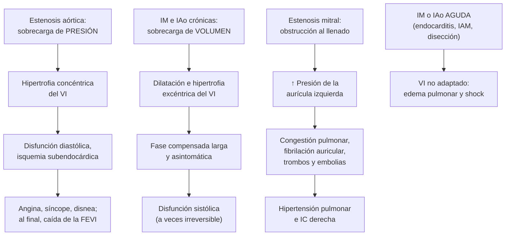

---
tags:
  - Cardiología
  - GES
---

# Valvulopatías, paciente con soplo y fiebre reumática

**Subespecialidad**
Cardiología · Cirugía cardíaca · Medicina interna

**Guías principales**
ESC/EACTS 2025: valvulopatías · ACC/AHA 2020: valvulopatías · AHA 2015: criterios de Jones revisados (fiebre reumática) · AHA 2009: prevención de la fiebre reumática

**Otras fuentes**
Metaanálisis de prevalencia de la estenosis aórtica en adultos mayores (Osnabrugge 2013) · Revisión del enfoque por imágenes de la guía ESC 2025 (Zancanaro 2026) · Ensayo INVICTUS (2022)

**GES**
**GES 74**: tratamiento quirúrgico de las lesiones crónicas de la válvula aórtica en personas de 15 años y más · **GES 79**: de las válvulas mitral y tricúspide. Cirugía en **≤ 45 días** desde la indicación

**EUNACOM**
1.01.1.021 Paciente con soplo · 1.01.1.009 Estenosis aórtica · 1.01.1.010 Estenosis mitral · 1.01.1.017 Insuficiencia aórtica · 1.01.1.019 Insuficiencia mitral (todos: específico, inicial, derivar) · 1.01.1.008 Enfermedad reumática activa (específico, completo, completo)

**Revisado**
Septiembre 2026

!!! abstract "Resumen en 60 segundos"
    - **Soplo**: define su momento (**sistólico o diastólico**), foco, irradiación e intensidad (Levine I–VI).
        - **Todo soplo diastólico** y todo soplo con **síntomas** es **patológico** y requiere un **ecocardiograma**.
        - El soplo **inocente** es suave, mesosistólico, sin irradiación, con segundo ruido normal y sin síntomas.
    - **Estenosis aórtica** (la valvulopatía que más se opera):
        - Degenerativa en los **adultos mayores** (**3,4 %** de los ≥ 75 años tiene una estenosis grave) o por válvula **bicúspide**.
        - Soplo **sistólico eyectivo** en el foco aórtico que irradia al **cuello**, pulso **parvus et tardus**, segundo ruido débil.
        - Síntomas: **angina, síncope y disnea** de esfuerzo. Con síntomas, la sobrevida sin tratamiento es corta.
        - Tratamiento: **reemplazo valvular** quirúrgico o **TAVI** (ESC 2025: TAVI de preferencia desde los **70 años**).
    - **Insuficiencia mitral**:
        - **Primaria** (prolapso, reumática, endocarditis) o **secundaria** (ventrículo o aurícula dilatados).
        - **Holosistólico** en el ápex, irradiado a la **axila**.
        - La **aguda** (rotura de músculo papilar tras un IAM, endocarditis) da **edema pulmonar** y shock.
    - **Insuficiencia aórtica**: soplo **diastólico precoz** en el borde esternal izquierdo, **pulso saltón** y PA diferencial amplia.
    - **Estenosis mitral**:
        - Casi siempre **reumática**: **retumbo diastólico** con **chasquido de apertura**, **fibrilación auricular**, embolias.
        - Anticoagular con **AVK** (no ACOD) si hay FA. **Valvuloplastía con balón** si la anatomía es favorable.
    - **Ningún fármaco** frena la progresión de una valvulopatía grave: el tratamiento definitivo es la **intervención**, decidida por el **equipo cardíaco** (GES 74 y 79).
    - **Fiebre reumática**:
        - Aparece tras una **faringitis estreptocócica**; se diagnostica con los **criterios de Jones**.
        - Tratamiento: **penicilina benzatina**, antiinflamatorios y **profilaxis secundaria** por años.

## Definición

| Término | Definición |
|---|---|
| **Soplo** | Ruido producido por un **flujo turbulento** en el corazón o los grandes vasos |
| **Soplo inocente** (funcional) | Soplo **sin** enfermedad estructural: suave (≤ 2/6), mesosistólico, sin irradiación, con segundo ruido normal; aumenta con el **alto flujo** (fiebre, anemia, embarazo, hipertiroidismo) |
| **Estenosis aórtica (EA)** | Obstrucción del tracto de salida del ventrículo izquierdo a nivel de la válvula aórtica. **Grave**: velocidad máxima **≥ 4 m/s**, gradiente medio **≥ 40 mmHg**, área **≤ 1,0 cm²** |
| **Insuficiencia mitral (IM)** | Reflujo sistólico del ventrículo izquierdo a la aurícula izquierda. **Primaria** (lesión de la válvula) o **secundaria** (funcional, por dilatación ventricular o auricular) |
| **Insuficiencia aórtica (IAo)** | Reflujo diastólico desde la aorta al ventrículo izquierdo, por lesión de los velos o dilatación de la raíz aórtica |
| **Estenosis mitral (EM)** | Obstrucción al llenado del ventrículo izquierdo. **Clínicamente significativa** con área **≤ 1,5 cm²** |
| **Fiebre reumática aguda** | Enfermedad inflamatoria **autoinmune** tras una faringitis por ***Streptococcus pyogenes*** (grupo A), que afecta el corazón, las articulaciones, el SNC, la piel y el tejido subcutáneo |
| **Cardiopatía reumática** | Daño valvular **crónico** (sobre todo mitral) secuela de la fiebre reumática |

## Epidemiología

### Mundial

- **Estenosis aórtica** (metaanálisis de 7 estudios, 9.723 personas de **≥ 75 años**; Osnabrugge 2013):
    - Prevalencia de **12,4 %** de cualquier grado y de **3,4 %** de estenosis **grave**.
    - El **75,6 %** de los que tenían estenosis grave era **sintomático**, y el **40,5 %** de ellos **no se operaba**.
- En los países de ingresos altos predominan las valvulopatías **degenerativas** (estenosis aórtica calcificada, insuficiencia mitral por prolapso) y su prevalencia aumenta con la **edad**.
- En los países de ingresos bajos y medios, la **cardiopatía reumática** sigue siendo la principal causa de valvulopatía en los jóvenes.
- **ESC/EACTS 2025**:
    - La edad de corte para preferir el **TAVI** en la estenosis aórtica tricúspide bajó de **75 a 70 años**.
    - Se amplió la **intervención precoz** en la estenosis aórtica grave **asintomática** y en la insuficiencia mitral primaria grave asintomática que cumple ciertos criterios (Zancanaro 2026).

### Chile

!!! chile "Datos nacionales"
    - **GES 74** (válvula aórtica) y **GES 79** (válvulas mitral y tricúspide): garantizan el **tratamiento quirúrgico** de las lesiones valvulares crónicas en las personas de **15 años y más**, con **cirugía en ≤ 45 días** desde la indicación y **seguimiento en ≤ 15 días** desde la indicación médica. El GES 79 incluye el **tratamiento anticoagulante** según la indicación.
    - La población chilena **envejece** rápidamente: la estenosis aórtica degenerativa y la insuficiencia mitral serán cada vez más frecuentes.
    - La **fiebre reumática** es hoy **poco frecuente** en Chile, pero todavía se ven adultos con **estenosis mitral reumática**, secuela de una fiebre reumática en la infancia.

## Etiología

| Valvulopatía | Causas |
|---|---|
| **Estenosis aórtica** | **Degenerativa calcificada** (la más frecuente, > 65–70 años; comparte factores de riesgo con la aterosclerosis) · **válvula bicúspide** (se manifiesta a los 50–70 años) · **reumática** (casi siempre con daño mitral) |
| **Insuficiencia mitral** | **Primaria**: **prolapso** o degeneración mixomatosa, rotura de cuerdas, **endocarditis**, **reumática**, **rotura de músculo papilar** (IAM) · **Secundaria ventricular**: miocardiopatía isquémica o dilatada · **Secundaria auricular**: **fibrilación auricular** con aurícula dilatada |
| **Insuficiencia aórtica** | **De los velos**: bicúspide, reumática, **endocarditis**, degenerativa · **De la raíz aórtica**: dilatación por edad o HTA, **Marfan**, **disección aórtica** (aguda), aortitis (sífilis, Takayasu), espondilitis anquilosante |
| **Estenosis mitral** | **Reumática** (la gran mayoría; más en mujeres) · **calcificación del anillo mitral** (adultos mayores, ERC) · rara: congénita, lupus, carcinoide |
| **Fiebre reumática** | Respuesta autoinmune tras una **faringitis por estreptococo del grupo A** no tratada (2–4 semanas antes), por **mimetismo molecular** entre la proteína M y proteínas del corazón; más en niños de 5–15 años, hacinamiento y pobreza |

## Fisiopatología

*Figura 1. Mecanismos de las valvulopatías del corazón izquierdo. VI: ventrículo izquierdo. Esquema propio.*

- **Sobrecarga de presión** (estenosis aórtica): el ventrículo compensa con **hipertrofia concéntrica**. Aparecen la disfunción diastólica y la isquemia subendocárdica (angina con coronarias sanas). El gasto no sube con el esfuerzo (síncope).
- **Sobrecarga de volumen** (insuficiencias crónicas): el ventrículo se **dilata** y mantiene el gasto por años. La FEVI "normal" puede ocultar un daño: por eso se opera **antes** de que caiga (IM: FEVI ≤ 60 %).
- **Insuficiencias agudas**: el ventrículo no alcanza a dilatarse, y el volumen regurgitante eleva bruscamente las presiones: **edema pulmonar** y **shock**. Son una **emergencia quirúrgica**.
- **Estenosis mitral**: la aurícula izquierda no se vacía. La taquicardia (que acorta la diástole), el embarazo y la **fibrilación auricular** descompensan al paciente.

<figure markdown>
![Fonocardiogramas esquemáticos de las cuatro valvulopatías, con el primer y el segundo ruido y las fases de sístole y diástole. Estenosis aórtica: soplo sistólico creciente-decreciente, con un segundo ruido débil; foco aórtico en el segundo espacio intercostal derecho, irradiado al cuello; pistas: pulso parvus et tardus, segundo ruido débil, angina, síncope y disnea de esfuerzo. Insuficiencia mitral: soplo holosistólico en meseta, en el ápex, irradiado a la axila; aumenta con el puño cerrado, puede haber tercer ruido si es grave, con disnea y fibrilación auricular. Insuficiencia aórtica: soplo diastólico precoz decreciente en el borde esternal izquierdo, que se escucha mejor sentado, inclinado hacia adelante y en espiración; pulso saltón y presión diferencial amplia. Estenosis mitral: primer ruido fuerte, chasquido de apertura después del segundo ruido, retumbo diastólico con refuerzo presistólico, en el ápex con la campana y en decúbito lateral izquierdo; fibrilación auricular, embolias y hemoptisis, por fiebre reumática. Abajo se recuerda que los soplos del corazón derecho aumentan con la inspiración](../assets/figuras/valvulopatias/soplos-valvulopatias.svg){ loading=lazy }
<figcaption>Figura 2. Soplos de las valvulopatías del corazón izquierdo: foco, momento del ciclo, forma y pistas clínicas. Esquema propio, ilustrativo.</figcaption>
</figure>

## Clasificación

**Intensidad del soplo (Levine)**:

| Grado | Descripción |
|---|---|
| **1/6** | Muy suave, solo con atención |
| **2/6** | Suave, se escucha de inmediato |
| **3/6** | Moderado, sin frémito |
| **4/6** | Fuerte, **con frémito** palpable |
| **5/6** | Se escucha con el estetoscopio apenas apoyado |
| **6/6** | Se escucha sin apoyar el estetoscopio |

**Etapas de las valvulopatías (ACC/AHA 2020)**: **A** en riesgo · **B** progresiva (leve a moderada) · **C** grave **asintomática** (C1 con función ventricular conservada; C2 con disfunción del VI) · **D** grave **sintomática**.

**Criterios de gravedad por ecocardiograma**:

| Valvulopatía | Grave |
|---|---|
| **Estenosis aórtica** | Velocidad máxima **≥ 4 m/s**, gradiente medio **≥ 40 mmHg**, área **≤ 1,0 cm²** (existe la EA grave de **bajo flujo y bajo gradiente**, que se confirma con ecocardiograma con dobutamina o con el **score de calcio** valvular por TC: > 1.200 UA en mujeres y > 2.000 UA en hombres) |
| **Estenosis mitral** | Área **≤ 1,5 cm²** (clínicamente significativa); ≤ 1,0 cm² muy grave |
| **Insuficiencia mitral primaria** | Orificio regurgitante efectivo **≥ 40 mm²**, volumen regurgitante **≥ 60 mL**, vena contracta ≥ 7 mm |
| **Insuficiencia aórtica** | Orificio regurgitante efectivo **≥ 30 mm²**, volumen regurgitante **≥ 60 mL**, vena contracta > 6 mm |

## Clínica

### El paciente con soplo

| Sugiere soplo **inocente** | Sugiere soplo **patológico** |
|---|---|
| Suave (**≤ 2/6**), **mesosistólico** | **Diastólico** o **continuo** (siempre patológico) |
| En el borde esternal izquierdo, **sin irradiación** | **Holosistólico**, **≥ 3/6** o con **frémito** |
| **Segundo ruido normal**, sin clics | Segundo ruido **único o débil**, clics, **chasquido** |
| Varía con la posición; alto flujo (fiebre, anemia, embarazo) | **Síntomas** (disnea, angina, síncope), **ECG** o **radiografía** alterados |
| Joven asintomático | Adulto mayor, antecedente de fiebre reumática, endocarditis o soplo previo |

- **Maniobras**:
    - La **inspiración** aumenta los soplos del corazón **derecho**.
    - El **puño cerrado** (más poscarga) aumenta la IM y la IAo, y disminuye la EA.
    - La maniobra de **Valsalva** y ponerse de pie **aumentan** el soplo de la **miocardiopatía hipertrófica** y del prolapso mitral (y disminuyen los demás).

### Por valvulopatía

- **Estenosis aórtica**:
    - Largo período **asintomático**. Luego la tríada **angina, síncope de esfuerzo y disnea** (insuficiencia cardíaca).
    - Soplo sistólico eyectivo **rudo** en el foco aórtico que irradia a las **carótidas**; en los adultos mayores puede irradiar al ápex (fenómeno de Gallavardin).
    - Pulso **parvus et tardus** (débil y tardío). El **segundo ruido débil** o ausente indica gravedad.
    - Puede haber **hemorragia digestiva** por angiodisplasias (síndrome de Heyde).
- **Insuficiencia mitral crónica**:
    - Disnea de esfuerzo, fatiga, **fibrilación auricular**.
    - Soplo **holosistólico** apical irradiado a la **axila**; tercer ruido si es grave.
    - **Prolapso**: clic mesosistólico seguido de un soplo telesistólico.
- **Insuficiencia mitral aguda**: **edema pulmonar súbito** y shock tras un IAM (días 2–7, rotura de músculo papilar) o en una endocarditis. El soplo puede ser **corto o inaudible**.
- **Insuficiencia aórtica crónica**:
    - Asintomática por años; luego disnea, palpitaciones, angina.
    - Soplo **diastólico precoz** decreciente en el borde esternal izquierdo, sentado, inclinado hacia adelante y en espiración.
    - **Pulso saltón** (celer), **PA diferencial amplia**, latido de la cabeza (signo de Musset), pulso capilar (Quincke), soplo de Austin Flint.
- **Insuficiencia aórtica aguda** (endocarditis, **disección aórtica**): edema pulmonar y shock, con pocos signos periféricos (ver [síndrome aórtico agudo](sindrome-aortico-agudo.md)).
- **Estenosis mitral**:
    - **Disnea** progresiva, ortopnea, **hemoptisis**, **fibrilación auricular**, **embolias** (ACV), disfonía (compresión del nervio laríngeo recurrente).
    - Descompensación en el **embarazo** o con taquicardia.
    - **Primer ruido fuerte**, **chasquido de apertura**, **retumbo diastólico** apical con refuerzo presistólico (si está en ritmo sinusal); facies mitral.

### Fiebre reumática aguda

- **2–4 semanas** después de una faringitis estreptocócica.
- **Poliartritis migratoria** de grandes articulaciones, muy dolorosa y muy sensible a la aspirina.
- **Carditis**: pancarditis con **soplo de insuficiencia mitral** (el más frecuente), IAo, pericarditis e insuficiencia cardíaca.
- **Corea de Sydenham** (movimientos involuntarios, puede ser tardía y aislada), **eritema marginado**, **nódulos subcutáneos**.

## Diagnóstico

- **Ecocardiograma transtorácico**: el examen **clave**.
    - Confirma la lesión, su **mecanismo** y su **gravedad**, y mide el tamaño y la función del ventrículo (FEVI, diámetros), la presión pulmonar y la raíz aórtica.
    - Se pide ante todo soplo **diastólico** o **continuo**, soplo sistólico **≥ 3/6**, soplo con **síntomas**, ECG o radiografía alterados, o antecedente de fiebre reumática o endocarditis.
- **ECG**: hipertrofia ventricular izquierda (EA, IAo), crecimiento auricular izquierdo ("P mitral"), **fibrilación auricular** (EM, IM), bloqueos.
- **Radiografía de tórax**: cardiomegalia, crecimiento auricular izquierdo (doble contorno, elevación del bronquio izquierdo en la EM), congestión, calcificación valvular, dilatación de la aorta.
- **Prueba de esfuerzo** en la **EA grave asintomática** para desenmascarar síntomas (**contraindicada** si es sintomática).
- **Ecocardiograma transesofágico**: anatomía mitral antes de una reparación o valvuloplastía, **trombo en la aurícula izquierda**, endocarditis, prótesis.
- **TC**: score de calcio valvular aórtico, planificación del TAVI, raíz aórtica.
- **Coronariografía** (o angio-TC coronaria) antes de la cirugía valvular.
- **Péptido natriurético** (NT-proBNP) como apoyo pronóstico.

!!! guia "Fiebre reumática: criterios de Jones revisados (AHA 2015), población de bajo riesgo"
    **Requisito**: evidencia de **infección estreptocócica** previa (**ASO** o anti-DNAsa B elevados, o cultivo o test rápido faríngeo positivo).

    - **Primer episodio**: **2 criterios mayores**, o **1 mayor + 2 menores**.
    - **Recurrencia**: 2 mayores, 1 mayor + 2 menores, o 3 menores.

    | Criterios mayores | Criterios menores |
    |---|---|
    | **Carditis** (clínica o **subclínica**, detectada solo por ecocardiograma Doppler) | **Poliartralgia** |
    | **Poliartritis** | **Fiebre ≥ 38,5 °C** |
    | **Corea** | **VHS ≥ 60 mm/h** y/o **PCR ≥ 3,0 mg/dL** |
    | **Eritema marginado** | **PR prolongado** (si la carditis no es un criterio mayor) |
    | **Nódulos subcutáneos** | |

    En las poblaciones de riesgo **moderado o alto**, la **monoartritis** y la **poliartralgia** también cuentan como criterio mayor, y los umbrales de fiebre y VHS son menores.

## Laboratorio

| Examen | Utilidad |
|---|---|
| **Hemograma** | **Anemia** (empeora el soplo y los síntomas; angiodisplasias en la EA) |
| **NT-proBNP** | Estratificación y seguimiento; sube antes que los síntomas |
| **Creatinina**, electrolitos | Antes de la cirugía o del contraste; dosis de fármacos |
| **Hemocultivos** | Soplo nuevo con **fiebre**: descartar una **endocarditis** (ver [endocarditis](../infectologia/endocarditis-infecciosa.md)) |
| **Troponina** | Dolor torácico; IM aguda post-IAM |
| **INR** | Pacientes con AVK (prótesis mecánica, EM con FA) |
| **ASO**, anti-DNAsa B, VHS, PCR, cultivo faríngeo | Sospecha de **fiebre reumática** |
| **VDRL o RPR** | Insuficiencia aórtica con aortitis (sífilis) |

## Imágenes

- **Ecocardiograma transtorácico** al diagnóstico y en el seguimiento (ACC/AHA 2020):
    - Lesión **leve**: cada **3–5 años**.
    - Lesión **moderada**: cada **1–2 años**.
    - Lesión **grave asintomática**: cada **6–12 meses**.
    - Siempre si **cambian los síntomas**.
- **Ecocardiograma transesofágico**, **TC cardíaca** y **RM cardíaca** según la pregunta clínica (ver Diagnóstico).

## Diagnóstico diferencial

| Cuadro | Claves |
|---|---|
| **Soplo inocente o de alto flujo** | Fiebre, anemia, embarazo, hipertiroidismo; características benignas |
| **Miocardiopatía hipertrófica** (vs EA) | Joven, soplo que **aumenta con Valsalva** y de pie, **sin** irradiación al cuello, pulso normal; muerte súbita en la familia |
| **Esclerosis aórtica** (vs EA) | Soplo eyectivo suave en el adulto mayor, **pulso y segundo ruido normales**, sin gradiente importante |
| **Comunicación interventricular** (vs IM) | Holosistólico en el **borde esternal izquierdo**, con frémito |
| **Insuficiencia tricuspídea** (vs IM) | Holosistólico en el borde esternal izquierdo bajo que **aumenta con la inspiración**, onda v yugular |
| **Endocarditis** | Soplo nuevo o cambiante con fiebre y fenómenos embólicos |
| **Mixoma auricular** (vs EM) | Síntomas que cambian con la **posición**, "plop" tumoral, embolias; ecocardiograma |
| **Artritis séptica, lupus, artritis reactiva** (vs fiebre reumática) | Monoartritis con líquido séptico; clínica de lupus; antecedente de diarrea o uretritis (ver [monoartritis](../reumatologia/monoartritis-gota-artritis-septica.md)) |

## Tratamiento

### Principios

- **Ningún fármaco** cambia la historia natural de una valvulopatía **grave**: el tratamiento definitivo es la **intervención** (cirugía o técnicas percutáneas).
- La decide el **equipo cardíaco** (cardiólogo, cirujano cardíaco, imagenólogo), según los síntomas, la gravedad, la función ventricular, la edad, el riesgo quirúrgico y la anatomía.
- **Tratamiento médico**:
    - Tratar la **insuficiencia cardíaca** (diuréticos) y la **HTA** (con precaución en la EA).
    - Controlar la **frecuencia** en la FA.
    - **Anticoagular** cuando está indicado.
    - Buena **higiene dental** y profilaxis de endocarditis en los pacientes con prótesis valvular o endocarditis previa.

!!! guia "Indicaciones de intervención (ACC/AHA 2020; ESC/EACTS 2025)"
    | Valvulopatía | Intervenir si | Opciones |
    |---|---|---|
    | **Estenosis aórtica grave** | **Síntomas** (angina, síncope, disnea) · asintomática con **FEVI < 50 %** · asintomática con prueba de esfuerzo anormal · la ESC 2025 permite la **intervención precoz** en la EA grave asintomática de alto gradiente con FEVI conservada y bajo riesgo del procedimiento | **Reemplazo valvular quirúrgico** o **TAVI**. ESC 2025: **TAVI** de preferencia en los **≥ 70 años** con válvula tricúspide y anatomía favorable; **cirugía** en los < 70 años de bajo riesgo |
    | **Insuficiencia mitral primaria grave** | **Síntomas** · asintomática con **FEVI ≤ 60 %** o **diámetro sistólico ≥ 40 mm** · FA de inicio reciente o hipertensión pulmonar | **Reparación** mitral quirúrgica (preferida) o reemplazo. **Reparación percutánea borde a borde** en los pacientes de alto riesgo quirúrgico |
    | **Insuficiencia mitral secundaria** | Persiste grave y sintomática **pese al tratamiento óptimo de la IC** (incluida la resincronización) | Reparación percutánea borde a borde en pacientes seleccionados; cirugía si se opera por otra causa |
    | **Insuficiencia aórtica grave** | **Síntomas** · asintomática con **FEVI ≤ 55 %** · diámetro sistólico **> 50 mm** o > 25 mm/m² | **Reemplazo valvular aórtico** (con la raíz si está dilatada) |
    | **Estenosis mitral reumática** (área ≤ 1,5 cm²) | **Síntomas** · hipertensión pulmonar, FA o embolias en pacientes seleccionados | **Valvuloplastía mitral percutánea con balón** si la anatomía es favorable, sin trombo auricular y sin IM moderada o grave; si no, **cirugía** |

!!! dosis "Tratamiento médico por valvulopatía"
    - **Estenosis aórtica**:
        - Tratar la HTA con dosis bajas y **ajuste lento** (evitar la hipotensión).
        - En la IC, usar los **diuréticos con cautela** (el ventrículo depende de la precarga).
        - Las **estatinas no frenan** la progresión (pero se usan si hay otra indicación).
    - **Insuficiencia mitral y aórtica crónicas**:
        - Tratar la HTA (IECA o ARA-II, amlodipino) y la IC.
        - En la IM **secundaria**, el tratamiento **completo de la IC** (ver [insuficiencia cardíaca](insuficiencia-cardiaca.md)) puede reducir la insuficiencia.
    - **Insuficiencias agudas**: **emergencia**. Diuréticos y **vasodilatadores** (nitroprusiato) si la PA lo permite, balón de contrapulsación (IM aguda) y **cirugía urgente**.
    - **Estenosis mitral**:
        - **Betabloqueadores** o bloqueadores de canales de calcio no dihidropiridínicos para bajar la frecuencia (alargan la diástole) y **diuréticos**.
        - **Anticoagulación con AVK** (acenocumarol, INR 2–3) si hay **FA**, embolia previa o trombo auricular.
        - En la EM reumática moderada o grave con FA **no usar ACOD**: en **INVICTUS** (2022), el rivaroxabán fue inferior a los AVK.
    - **Prótesis valvulares**:
        - **Mecánica**: **AVK de por vida** (los ACOD están contraindicados).
        - **Biológica**: anticoagulación o antiagregación los primeros 3 meses; luego según otras indicaciones. Se degenera en 10–15 años.
    - **Profilaxis de endocarditis** (prótesis, endocarditis previa): **amoxicilina 2 g VO** 30–60 minutos antes de los procedimientos dentales de riesgo (ver [endocarditis](../infectologia/endocarditis-infecciosa.md)).

### Fiebre reumática aguda

!!! dosis "Fiebre reumática: tratamiento y profilaxis (AHA 2009 y 2015)"
    1. **Erradicar el estreptococo**: **penicilina benzatina 1.200.000 UI IM** en dosis única (600.000 UI si pesa < 27 kg). Alternativa: amoxicilina VO por 10 días. Alergia: macrólido.
    2. **Artritis y carditis leve**: **aspirina en dosis antiinflamatorias** (o naproxeno) por 2–4 semanas, con disminución gradual. La artritis responde en horas o pocos días (si no, dudar del diagnóstico).
    3. **Carditis grave con IC**: reposo, diuréticos, IECA; **corticoides** (prednisona) en casos seleccionados; cirugía valvular si hay insuficiencia grave refractaria.
    4. **Corea**: ambiente tranquilo; valproato o carbamazepina si es invalidante.
    5. **Profilaxis secundaria** (evita las recurrencias y el daño valvular progresivo):
        - **Penicilina benzatina 1.200.000 UI IM cada 4 semanas** (cada 3 semanas en zonas de alto riesgo o con recurrencias).
        - Alternativa: penicilina V 250 mg VO c/12 h; alergia: eritromicina 250 mg VO c/12 h.
    6. **Duración de la profilaxis** (AHA 2009):
        - **Sin carditis**: **5 años** o hasta los **21 años** (lo que sea más largo).
        - **Carditis sin daño valvular residual**: **10 años** o hasta los **21 años**.
        - **Carditis con daño valvular residual**: **10 años** o hasta los **40 años** (a veces de por vida).

## Complicaciones

- **Insuficiencia cardíaca** y **edema pulmonar**.
- **Fibrilación auricular** y **embolias** (sobre todo en la estenosis mitral).
- **Muerte súbita** (estenosis aórtica grave sintomática).
- **Endocarditis infecciosa** sobre la válvula dañada o la prótesis.
- **Hipertensión pulmonar** e insuficiencia cardíaca derecha.
- **De las prótesis**: trombosis (prótesis mecánica con anticoagulación insuficiente), degeneración (biológicas), sangrado por AVK, fuga perivalvular.
- **Fiebre reumática**: cardiopatía reumática crónica, sobre todo si hay **recurrencias**.

## Pronóstico y seguimiento

- **Estenosis aórtica grave sintomática**: sin tratamiento, la sobrevida es de **pocos años** (angina ~ 5, síncope ~ 3, IC ~ 2 años en las series clásicas). La **intervención** la mejora drásticamente.
- **Insuficiencias crónicas**: buen pronóstico si se operan **antes** de la disfunción ventricular.
- **Estenosis mitral**: buena respuesta a la valvuloplastía; puede reestenosar con los años.
- **Seguimiento**: ecocardiograma según la gravedad (ver Imágenes), educación sobre los **síntomas de alarma** (disnea, angina, síncope, palpitaciones), control del INR, higiene dental.

## Perlas para el internado

!!! perla "Para la sala y el turno"
    - **Todo soplo diastólico es patológico**: pide un ecocardiograma.
    - Adulto mayor con **síncope de esfuerzo** y soplo sistólico que irradia al cuello: **estenosis aórtica grave** hasta demostrar lo contrario. No le hagas una prueba de esfuerzo; **deriva** (GES 74).
    - Cuidado con los **vasodilatadores** y la **deshidratación** en la estenosis aórtica grave: hipotensión y síncope.
    - **Edema pulmonar súbito con soplo nuevo** tras un IAM: **rotura de músculo papilar**; ecocardiograma y cirujano ya.
    - **Soplo nuevo + fiebre**: hemocultivos antes de los antibióticos (**endocarditis**).
    - Estenosis mitral con FA: **acenocumarol**, no ACOD.
    - Pulso saltón y PA de 160/50: piensa en **insuficiencia aórtica** (y descarta una **disección** si es aguda).
    - En la fiebre reumática, la **profilaxis con penicilina benzatina** dura años: asegúrate de que el paciente lo sepa.

## Preguntas de repaso

??? repaso "1. Hombre de 79 años con 2 episodios de síncope al caminar rápido y disnea de esfuerzo. Tiene un soplo sistólico eyectivo 3/6 en el foco aórtico irradiado a las carótidas, segundo ruido débil y pulso parvus et tardus. ¿Diagnóstico y conducta?"
    **Estenosis aórtica grave sintomática** (síncope y disnea de esfuerzo), probablemente degenerativa calcificada.

    - **Ecocardiograma**: velocidad ≥ 4 m/s, gradiente medio ≥ 40 mmHg, área ≤ 1,0 cm², FEVI.
    - **No** hacer una prueba de esfuerzo (sintomático). ECG, NT-proBNP, hemograma.
    - **Derivar** al **equipo cardíaco** para una **intervención** (GES 74): con 79 años, el **TAVI** es de preferencia (ESC 2025: ≥ 70 años), según la anatomía por TC.
    - Mientras tanto: evitar la hipotensión, los vasodilatadores potentes y la deshidratación; usar los diuréticos con cautela.

??? repaso "2. Mujer de 22 años con un soplo detectado en un examen preocupacional: mesosistólico 2/6 en el borde esternal izquierdo, sin irradiación, que disminuye al sentarse; segundo ruido normal, sin síntomas. ¿Qué haces?"
    **Soplo probablemente inocente** (funcional): suave, mesosistólico, sin irradiación, con segundo ruido normal, varía con la posición, en una joven asintomática.

    - Buscar causas de **alto flujo**: anemia, fiebre, embarazo, hipertiroidismo.
    - Si todas las características son benignas y el ECG es normal, no requiere ecocardiograma; **tranquilizar**.
    - Pedir un **ecocardiograma** si hay síntomas, el soplo es ≥ 3/6, holosistólico o diastólico, hay clics o el segundo ruido es anormal.

??? repaso "3. Mujer de 48 años con fiebre reumática en la infancia, con disnea progresiva y palpitaciones. ECG: fibrilación auricular a 118 lpm. Primer ruido fuerte, chasquido de apertura y retumbo diastólico apical. ¿Diagnóstico y manejo?"
    **Estenosis mitral reumática** con **fibrilación auricular**.

    - **Ecocardiograma**: área mitral (≤ 1,5 cm² es significativa), anatomía valvular, presión pulmonar, IM asociada. Transesofágico para buscar un **trombo auricular** si se planifica una valvuloplastía.
    - **Control de la frecuencia** (betabloqueador) y **diuréticos**.
    - **Anticoagulación con AVK** (acenocumarol, INR 2–3): **no** usar ACOD en la EM reumática (INVICTUS).
    - Derivar para una **valvuloplastía mitral percutánea con balón** si la anatomía es favorable, o **cirugía** (GES 79).

??? repaso "4. Hombre de 66 años en el tercer día de un IAM inferior, que presenta disnea súbita, crepitaciones hasta los vértices, PA 85/50 y un soplo holosistólico apical nuevo. ¿Qué sospechas y qué haces?"
    **Insuficiencia mitral aguda por rotura de músculo papilar** (complicación mecánica del IAM, típica entre los días 2 y 7).

    - **Ecocardiograma urgente**.
    - Soporte: oxígeno o ventilación, **diuréticos**, **vasodilatadores** si la PA lo permite, inótropos y **balón de contrapulsación** como puente.
    - **Cirugía urgente** (reemplazo o reparación mitral). Es una emergencia con alta mortalidad.

??? repaso "5. Mujer de 56 años con prolapso mitral e insuficiencia mitral grave, asintomática. Ecocardiograma: FEVI 58 %, diámetro sistólico del VI 42 mm. ¿Qué indicas?"
    **Insuficiencia mitral primaria grave asintomática con signos de disfunción del VI**: FEVI **≤ 60 %** y diámetro sistólico **≥ 40 mm**.

    - **Cirugía mitral**, idealmente **reparación**, en un centro con experiencia (ACC/AHA 2020; GES 79).
    - Esperar a los síntomas puede dejar una disfunción ventricular **irreversible**.
    - Controlar la PA y la FA si aparece.

??? repaso "6. Hombre de 19 años con poliartritis migratoria de rodillas y tobillos, fiebre de 39 °C y un soplo holosistólico apical nuevo, 3 semanas después de una faringitis no tratada. VHS 85 mm/h, ASO elevada, PR de 0,24 s. ¿Diagnóstico, tratamiento y profilaxis?"
    **Fiebre reumática aguda**: evidencia de infección estreptocócica (ASO) + **2 criterios mayores** (**carditis**: soplo de IM; **poliartritis**), además de criterios menores (fiebre, VHS alta). El PR prolongado no se cuenta como menor porque ya hay carditis.

    - **Ecocardiograma** para evaluar la carditis.
    - **Penicilina benzatina 1.200.000 UI IM** para erradicar el estreptococo.
    - **Aspirina** en dosis antiinflamatorias o naproxeno para la artritis; manejo de la IC si aparece.
    - **Profilaxis secundaria** con penicilina benzatina **cada 4 semanas**. Como tiene carditis: por **10 años o hasta los 21 años**; si queda daño valvular residual, **10 años o hasta los 40 años**.

## Referencias

1. Praz F, Borger MA, Lanz J, et al. 2025 ESC/EACTS Guidelines for the management of valvular heart disease. *Eur Heart J.* 2025;46:4635–4736. doi:[10.1093/eurheartj/ehaf194](https://doi.org/10.1093/eurheartj/ehaf194)
2. Writing Committee Members, Otto CM, Nishimura RA, et al. 2020 ACC/AHA guideline for the management of patients with valvular heart disease. *J Am Coll Cardiol.* 2021;77:e25–e197. doi:[10.1016/j.jacc.2020.11.018](https://doi.org/10.1016/j.jacc.2020.11.018)
3. Zancanaro E, Lorusso R, Danesi TH. 2025 ESC/EACTS Valvular Guidelines: imaging perspective over a new treatment direction. *Eur Heart J Imaging Methods Pract.* 2026;4:qyag002. doi:[10.1093/ehjimp/qyag002](https://doi.org/10.1093/ehjimp/qyag002)
4. Osnabrugge RL, Mylotte D, Head SJ, et al. Aortic stenosis in the elderly: disease prevalence and number of candidates for transcatheter aortic valve replacement: a meta-analysis and modeling study. *J Am Coll Cardiol.* 2013;62:1002–1012. doi:[10.1016/j.jacc.2013.05.015](https://doi.org/10.1016/j.jacc.2013.05.015)
5. Gewitz MH, Baltimore RS, Tani LY, et al. Revision of the Jones criteria for the diagnosis of acute rheumatic fever in the era of Doppler echocardiography: a scientific statement from the American Heart Association. *Circulation.* 2015;131:1806–1818. doi:[10.1161/CIR.0000000000000205](https://doi.org/10.1161/CIR.0000000000000205)
6. Gerber MA, Baltimore RS, Eaton CB, et al. Prevention of rheumatic fever and diagnosis and treatment of acute streptococcal pharyngitis: a scientific statement from the American Heart Association. *Circulation.* 2009;119:1541–1551. doi:[10.1161/CIRCULATIONAHA.109.191959](https://doi.org/10.1161/CIRCULATIONAHA.109.191959)
7. Connolly SJ, Karthikeyan G, Ntsekhe M, et al. Rivaroxaban in rheumatic heart disease-associated atrial fibrillation. *N Engl J Med.* 2022;387:978–988. doi:[10.1056/NEJMoa2209051](https://doi.org/10.1056/NEJMoa2209051)
8. Superintendencia de Salud. Tratamiento quirúrgico de lesiones crónicas de la válvula aórtica en personas de 15 años y más (GES 74). [superdesalud.gob.cl](https://www.superdesalud.gob.cl/orientacion-en-salud/tratamiento-quirurgico-de-lesiones-cronicas-de-la-valvula-aortica-en-personas-de-15-anos-y-mas/)
9. Superintendencia de Salud. Tratamiento quirúrgico de lesiones crónicas de las válvulas mitral y tricúspide en personas de 15 años y más (GES 79). [superdesalud.gob.cl](https://www.superdesalud.gob.cl/orientacion-en-salud/tratamiento-quirurgico-de-lesiones-cronicas-de-las-valvulas-mitral-y-tricuspide-en-personas-de-15-anos-y-mas/)
