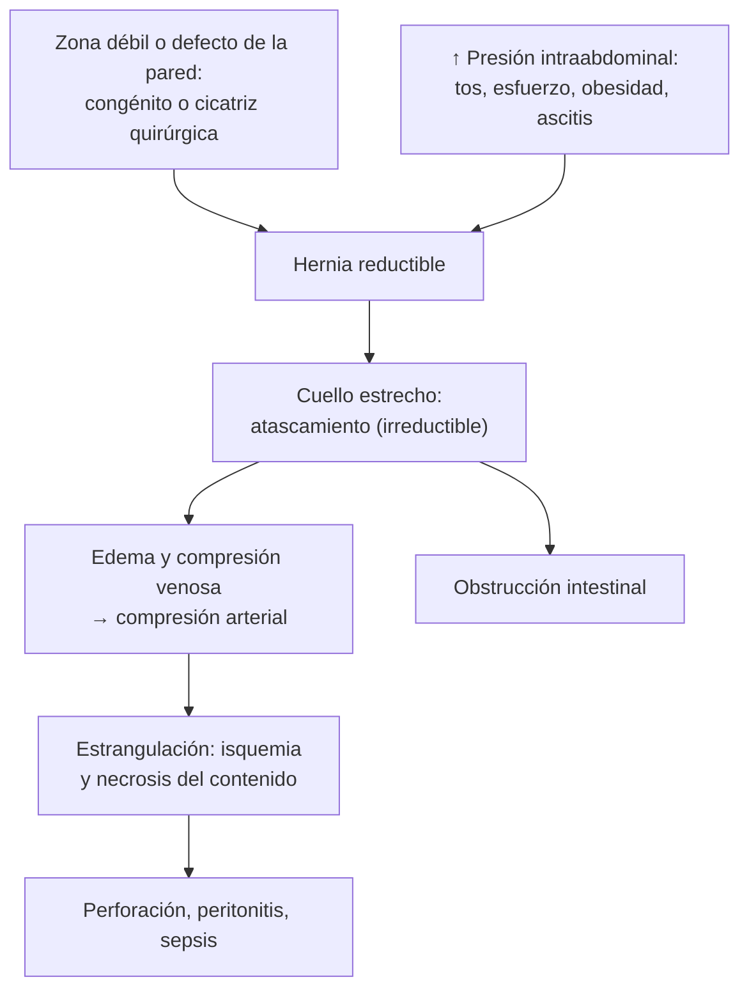
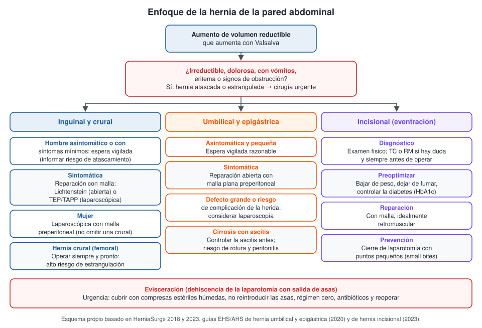

---
tags:
  - Cirugía
  - Frecuente en sala
---

# Hernias de la pared abdominal, eventraciones y evisceraciones

**Subespecialidad**
Cirugía general · Pared abdominal

**Guías principales**
Guías internacionales HerniaSurge de hernia inguinal y crural (*Hernia* 2018; actualización *BJS Open* 2023) · Guía EHS/AHS de hernia umbilical y epigástrica (*Br J Surg* 2020) · Guía EHS de hernia incisional de línea media (*Br J Surg* 2023) · Guía EHS/AHS de cierre de la pared abdominal (*Br J Surg* 2022)

**Otras fuentes**
Ensayo de espera vigilada en hernia inguinal (*JAMA* 2006, seguimiento en *Ann Surg* 2013) · Ensayo STITCH de cierre con puntos pequeños (*Lancet* 2015)

**GES**
No.

**EUNACOM**
4.01.1.021 Hernias, eventraciones y evisceraciones (diagnóstico específico, tratamiento inicial, seguimiento completo)

**Revisado**
Octubre 2026

!!! abstract "Resumen en 60 segundos"
    - **Hernia**: salida de contenido abdominal por un **defecto de la pared**. **Eventración** (hernia incisional): por una **cicatriz** quirúrgica. **Evisceración**: dehiscencia **aguda** de la laparotomía con salida de asas. Es una **urgencia**.
    - **Hernia inguinal**: la más frecuente; **27 %** de los hombres se opera de una hernia inguinal en su vida.
        - **Hombre asintomático**: **espera vigilada** segura, aunque la mayoría termina operándose.
        - **Sintomática**: reparación **con malla** (Lichtenstein abierta o TEP/TAPP laparoscópica).
        - **Mujer**: preferir la **laparoscopía** (no pasar por alto una hernia **crural**).
    - **Hernia crural (femoral)**: más frecuente en **mujeres mayores**; **alto riesgo de estrangulación**. Se opera **siempre y pronto**.
    - **Umbilical y epigástrica sintomáticas**: reparación abierta con **malla plana preperitoneal**.
    - **Eventración**: TC o RM antes de operar, **preoptimizar** (peso, tabaco, diabetes) y reparar con **malla retromuscular**. Se **previene** cerrando la laparotomía con **puntos pequeños**.
    - **Hernia atascada** (irreductible) o **estrangulada** (dolor, eritema, vómitos, signos de obstrucción o sepsis): **cirugía urgente**.

## Definición

- **Hernia de la pared abdominal**: protrusión de contenido abdominal (epiplón, intestino) a través de un **defecto** de la pared, cubierta por **peritoneo** (saco herniario).
- **Hernia reductible**: el contenido vuelve a la cavidad de forma espontánea o con maniobras.
- **Hernia atascada (incarcerada)**: **irreductible**, sin compromiso vascular.
- **Hernia estrangulada**: irreductible **con compromiso de la irrigación** del contenido (isquemia → necrosis → perforación).
- **Hernia de Richter**: atrapa solo una parte del **borde antimesentérico** del intestino; puede estrangularse **sin obstrucción**.
- **Eventración (hernia incisional)**: hernia a través de una **cicatriz quirúrgica** de la pared abdominal, con defecto aponeurótico.
- **Evisceración (dehiscencia de la herida, *burst abdomen*)**: separación **aguda** de la aponeurosis de una laparotomía reciente, con salida de vísceras.
    - **Contenida**: la piel está intacta.
    - **Completa**: las asas salen a través de la piel.

## Epidemiología

### Mundial

- **Reparación de hernia inguinal**: una de las cirugías más frecuentes del mundo, con más de **20 millones** de operaciones al año (HerniaSurge).
- **Riesgo de reparación de una hernia inguinal durante la vida**: **27 % en hombres** y **3 % en mujeres** (estudio del Reino Unido de 1996, citado en HerniaSurge).
- **Hernias inguinales**: mucho más frecuentes en **hombres**. Las **crurales** son más frecuentes en **mujeres** y adultos mayores.
- **Hernia crural**: según los registros sueco y danés, el **36–39 %** se opera de **urgencia**, frente al **5 %** de las inguinales. En la operación de urgencia, el **23 %** requiere **resección intestinal**.
- **Eventración**: complicación frecuente de la laparotomía de línea media.
    - Con **infección del sitio operatorio**, el riesgo de eventración fue de **19,4 %**, frente a **6,9 %** sin infección (guía EHS 2023).
    - En el ensayo **STITCH**, al año apareció eventración en el **21 %** de las laparotomías cerradas con puntos grandes y en el **13 %** de las cerradas con puntos pequeños.

### Chile

!!! chile "Datos nacionales"
    - No se encontraron estudios poblacionales chilenos recientes sobre la incidencia de hernias de la pared abdominal.
    - En Chile la reparación de la hernia **no** es una garantía GES; se resuelve por la vía electiva o de urgencia según la presentación.

## Etiología y factores de riesgo

| Tipo | Mecanismo | Factores de riesgo |
|---|---|---|
| **Inguinal indirecta** | **Congénita**: persistencia del conducto peritoneovaginal; sale por el **anillo inguinal profundo**, **lateral** a los vasos epigástricos inferiores | Sexo masculino, antecedente familiar, prematurez |
| **Inguinal directa** | **Adquirida**: debilidad de la **pared posterior** (triángulo de Hesselbach), **medial** a los vasos epigástricos | Edad, esfuerzo físico, tos crónica (EPOC), constipación, prostatismo, tabaco, trastornos del colágeno |
| **Crural (femoral)** | Sale por el **anillo crural**, **bajo el ligamento inguinal** y medial a la vena femoral | **Mujer**, edad avanzada, multiparidad |
| **Umbilical** | Defecto del anillo umbilical | **Obesidad**, embarazo, **ascitis** (cirrosis), diálisis peritoneal |
| **Epigástrica** | Defecto de la línea alba sobre el ombligo | Obesidad, esfuerzo |
| **Eventración** | Falla de la cicatrización de la aponeurosis | **Infección del sitio operatorio**, **obesidad**, **tabaco**, **diabetes**, inmunosupresión, corticoides, desnutrición, laparotomía de **línea media**, cierre con **puntos grandes**, tos y distensión posoperatoria |
| **Evisceración** | Dehiscencia aguda de la aponeurosis (días 5–10 del posoperatorio) | Infección de la herida, desnutrición (hipoalbuminemia), cirugía de urgencia, sepsis abdominal, tos, íleo y distensión, técnica de cierre, corticoides, anemia, edad avanzada |

## Fisiopatología

- La pared abdominal resiste la presión intraabdominal gracias a sus **músculos y aponeurosis**. Hay **zonas débiles** naturales: el **orificio miopectíneo** de Fruchaud (inguinal y crural), el **ombligo** y la **línea alba**.
- Un **defecto** (congénito o adquirido) + **aumento de la presión** intraabdominal (tos, esfuerzo, obesidad, ascitis) → protrusión del **saco** con su contenido.
- **Cuellos estrechos** (hernia crural, umbilical pequeña) atrapan más el contenido:
    - **Atascamiento** → **edema** del contenido → compresión venosa → compresión arterial → **estrangulación** → necrosis y **perforación** (peritonitis).
- **Eventración**: la aponeurosis cicatriza mal (infección, tensión, déficit de colágeno, tabaco) → el defecto crece con el tiempo y las asas pierden "derecho a domicilio" en las eventraciones gigantes.

*Figura 1. Fisiopatología de la hernia y de sus complicaciones. Esquema propio basado en las guías HerniaSurge y EHS.*

## Clasificación

| Clasificación | Categorías |
|---|---|
| **Por ubicación** | **Inguinal** (indirecta, directa, mixta), **crural**, **umbilical**, **epigástrica**, **de Spiegel** (borde lateral del recto), **lumbar**, **obturatriz**, **incisional**, paraestomal |
| **Por su evolución** | **Reductible** · **atascada (incarcerada)** · **estrangulada** |
| **EHS para hernia inguinal** | **L** (lateral, indirecta) · **M** (medial, directa) · **F** (femoral), con el tamaño del defecto en dedos: **1** (≤ 1,5 cm), **2** (1,5–3 cm), **3** (> 3 cm) |
| **EHS para eventraciones** | **Línea media** (M1 subxifoidea a M5 suprapúbica) o **lateral** (L1 a L4), con el **ancho** del defecto: W1 < 4 cm, W2 4–10 cm, W3 > 10 cm |
| **Evisceración** | **Contenida** (piel intacta) · **completa** (asas expuestas) |

## Clínica

- **Hernia reductible**:
    - **Aumento de volumen** que **aparece con el esfuerzo** o de pie y **desaparece al acostarse**.
    - **Molestia** o sensación de peso; dolor sordo al final del día.
    - Puede ser **asintomática**.
- **Examen físico** (de pie y acostado, con **Valsalva** o tos):
    - **Inguinal**: aumento de volumen **sobre** el ligamento inguinal; el dedo en el conducto inguinal siente el **impulso** con la tos. Puede bajar al **escroto** (inguinoescrotal).
    - **Crural**: aumento de volumen **bajo** el ligamento inguinal, medial a los vasos femorales; a menudo pequeño y difícil de palpar en la obesa.
    - **Umbilical o epigástrica**: aumento de volumen en la línea media; palpar el **anillo** (tamaño del defecto).
    - **Eventración**: aumento de volumen en una **cicatriz**; puede haber varios defectos.
- **Hernia atascada**: **irreductible**, dolorosa, sin signos de isquemia.
- **Hernia estrangulada**:
    - **Dolor intenso**, aumento de volumen **tenso**, **eritema** y calor de la piel.
    - **Vómitos**, distensión, ausencia de deposiciones y gases (**obstrucción intestinal**).
    - **Fiebre**, taquicardia, signos de **sepsis** o peritonitis.
- **Evisceración**:
    - Típica entre los **días 5 y 10** del posoperatorio.
    - **Salida de líquido serohemático "en agua de carne"** por la herida: signo **precoz** de dehiscencia aponeurótica.
    - Luego, **asas visibles** a través de la herida.

## Diagnóstico

!!! guia "Diagnóstico (HerniaSurge 2018 y guía EHS 2023)"
    - **Hernia inguinal**: el diagnóstico es **clínico**. La **ecografía** se reserva para la **duda diagnóstica** (aumento de volumen no evidente, dolor inguinal sin hernia palpable). Si la ecografía no aclara, **RM** dinámica o TC.
    - **Hernia crural**: sospecharla en toda **mujer** con aumento de volumen inguinal; confirmar con ecografía si hay duda.
    - **Eventración**: si el examen no es concluyente, imagen (**TC**; ecografía o RM con Valsalva si preocupan la radiación o el costo). **TC o RM antes de la cirugía** en toda eventración que se va a operar (planificación).
    - **Hernia complicada**: la clínica manda. TC si hay dudas sobre la isquemia o la causa de una obstrucción.

## Laboratorio

| Examen | Uso |
|---|---|
| **No se necesita** para el diagnóstico de la hernia no complicada | — |
| **Preoperatorio** según la edad y las comorbilidades | Hemograma, glicemia, **HbA1c** (diabéticos), creatinina, coagulación si usa anticoagulantes |
| **Hernia estrangulada** | **Leucocitosis**, **lactato** elevado (isquemia), PCR, electrolitos (vómitos), creatinina |
| **Evisceración** | Hemograma, PCR, **albúmina** (estado nutricional), cultivo de la herida si está infectada |

## Imágenes

| Examen | Hallazgos y uso |
|---|---|
| **Ecografía de partes blandas o inguinal** | Primer examen ante la **duda**: saco herniario, contenido, comportamiento con Valsalva; diferencia de adenopatías, lipomas, hidrocele |
| **TC de abdomen y pelvis** | **Eventraciones** (tamaño del defecto, contenido, pérdida de domicilio), hernias complicadas (isquemia, obstrucción), hernias raras (obturatriz, de Spiegel) |
| **RM dinámica** | Dolor inguinal con ecografía no concluyente; atletas (*pubalgia*) |
| **Radiografía de abdomen** | Obstrucción intestinal (niveles hidroaéreos) en la hernia complicada |

<figure markdown>
{ loading=lazy }
<figcaption>Figura 2. Enfoque de las hernias de la pared abdominal. Esquema propio basado en HerniaSurge 2018 y 2023 y en las guías EHS/AHS de hernia umbilical y epigástrica (2020) y de hernia incisional (2023).</figcaption>
</figure>

## Diagnóstico diferencial

| Aumento de volumen | Diferencias |
|---|---|
| **Adenopatía inguinal** | Firme, no se reduce, sin impulso con la tos; buscar lesiones en la extremidad, ITS (ver [adenopatías](../../infectologia/sindrome-mononucleosico-y-adenitis.md)) |
| **Lipoma del cordón** o de partes blandas | Blando, no se reduce, sin impulso; ecografía |
| **Hidrocele**, **quiste del cordón**, **varicocele** | Transiluminación positiva (hidrocele); se palpa el cordón por encima; "bolsa de gusanos" (varicocele) |
| **Testículo no descendido** | Bolsa escrotal vacía del mismo lado |
| **Aneurisma o seudoaneurisma femoral** | **Pulsátil**; antecedente de punción femoral (angiografía) |
| **Absceso inguinal** o del psoas | Fiebre, signos inflamatorios, dolor a la flexión de la cadera |
| **Diástasis de los rectos** | Separación de los músculos rectos en la línea media **sin defecto aponeurótico** ni anillo; no se estrangula y no necesita cirugía |
| **Dolor inguinal sin hernia** | Pubalgia, coxartrosis, tendinopatía de aductores, irradiación de un cólico renal o de una lumbociática |

## Tratamiento

### Hernia inguinal

- **Hombre asintomático o con síntomas mínimos**: la **espera vigilada** es una opción segura (HerniaSurge), porque el riesgo de urgencia es **bajo**.
    - En el ensayo de Fitzgibbons, el **23 %** pasó a cirugía a los 2 años y el **68 %** a los 10 años (**79 %** en los mayores de 65 años), sobre todo por **dolor**.
    - Informar al paciente los **signos de atascamiento**.
- **Hernia sintomática**: **reparación con malla**.
    - **Lichtenstein** (abierta, con malla anterior): se puede hacer con **anestesia local** y de forma **ambulatoria**.
    - **Laparoscópica** (**TEP** totalmente extraperitoneal o **TAPP** transabdominal preperitoneal): **recuperación más rápida** y **menos dolor crónico**; preferida en las hernias **bilaterales** y **recidivadas** tras una reparación anterior.
    - Las técnicas sin malla (Shouldice) quedan para casos seleccionados.
- **Mujer**: reparación **laparoscópica con malla preperitoneal**, para no pasar por alto una hernia **crural** y reducir el dolor crónico.
- **Embarazo**: **espera vigilada**; muchas veces el aumento de volumen es una **várice del ligamento redondo**, que se resuelve sola.
- **Cirugía ambulatoria** en la mayoría de los pacientes.

### Hernia crural

- **Operar siempre y pronto** (incluso si es asintomática): **alto riesgo de estrangulación**.
- Reparación **con malla**, idealmente **laparoscópica** si hay experiencia.

### Hernia umbilical y epigástrica

- **Asintomática y pequeña**: la espera vigilada es razonable.
- **Sintomática**: reparación **abierta con malla plana preperitoneal** (EHS/AHS 2020): menos **recidivas** que la sutura simple.
- **Laparoscopía**: si el defecto es **grande** o hay **alto riesgo de complicación de la herida** (obesidad).
- **Cirrosis con ascitis**: **controlar la ascitis** antes de operar. La **rotura** de la hernia con salida de ascitis es una urgencia (riesgo de peritonitis). Coordinar con hepatología (ver [cirrosis](../../gastroenterologia/cirrosis-y-complicaciones.md)).

### Eventración

- **TC o RM** antes de la cirugía.
- **Preoptimizar** (guía EHS 2023): **bajar de peso**, **dejar de fumar** (más de 4 semanas antes), **controlar la diabetes** (HbA1c) y mejorar la capacidad pulmonar.
- **Reparación con malla** (recomendación fuerte), idealmente en posición **retromuscular**. Evitar las mallas en contacto con las vísceras cuando sea posible.
- **Eventraciones grandes**: técnicas de **separación de componentes**, en centros con experiencia.
- **Asintomática o paciente de alto riesgo**: la espera vigilada es aceptable, tras explicar riesgos y beneficios.
- **Prevención** (guía EHS/AHS 2022): preferir incisiones **transversas** o **paramedianas** cuando sea posible; cerrar la línea media con **sutura continua de puntos pequeños** (5 mm cada 5 mm) con **material de absorción lenta**.

### Hernia complicada

- **Hernia atascada** de pocas horas, **sin signos de estrangulación**: se puede intentar una **reducción manual** suave (taxis) con analgesia y sedación, y luego la reparación electiva precoz.
    - **No** forzar la reducción si hay signos de isquemia: se puede reducir un asa necrótica (**reducción en bloque**).
- **Hernia estrangulada**: **cirugía urgente**.
    - Reanimación con fluidos IV, **sonda nasogástrica** si hay obstrucción, analgesia, **antibióticos** (cefazolina + metronidazol o ceftriaxona + metronidazol).
    - Evaluar la **viabilidad** del intestino y **resecar** si está necrótico.

### Evisceración

- **Urgencia quirúrgica**:
    1. **Cubrir** las asas con **compresas estériles húmedas** con suero fisiológico tibio.
    2. **No reintroducir** las asas en la sala.
    3. **Régimen cero**, sonda nasogástrica si hay íleo, **fluidos IV** y **antibióticos**.
    4. **Reoperación** urgente: cierre de la pared (a veces con malla o con abdomen abierto temporal), y búsqueda de una **causa** (absceso, filtración de una anastomosis).
- **Evisceración contenida** (piel intacta, sin peritonitis): en algunos pacientes se puede manejar con faja y reparación diferida de la eventración que queda, según el equipo.

!!! dosis "Medicamentos habituales en el adulto"
    | Indicación | Esquema |
    |---|---|
    | **Profilaxis antibiótica** en la reparación abierta con malla (riesgo de infección alto o de cirugía larga) | **Cefazolina 2 g IV** (3 g si pesa más de 120 kg), dosis única 30–60 min antes de la incisión. En la reparación laparoscópica, en general **no** se necesita |
    | **Anestesia local** (Lichtenstein ambulatorio) | **Lidocaína al 1 %** (máximo **4,5 mg/kg** sin epinefrina y **7 mg/kg** con epinefrina) o **bupivacaína al 0,25–0,5 %** (máximo **2,5 mg/kg**). Ver [intoxicación por anestésicos locales](../anestesia-y-perioperatorio/index.md) |
    | **Analgesia posoperatoria** | **Paracetamol 1 g cada 8 h** + **AINE** (ibuprofeno 400 mg cada 8 h o ketoprofeno 100 mg cada 12 h, si no hay contraindicación); opioide de rescate por pocos días |
    | **Hernia estrangulada o evisceración** | **Ceftriaxona 2 g IV cada 24 h + metronidazol 500 mg IV cada 8 h**, ajustado a los hallazgos |

!!! alarma "Derivar o hospitalizar de urgencia"
    - **Hernia irreductible dolorosa**, sobre todo con **vómitos**, **eritema**, **fiebre** o signos de **obstrucción intestinal** (estrangulación).
    - **Hernia crural** diagnosticada: derivar **pronto** a cirugía, aunque sea asintomática.
    - **Salida de líquido serohemático** por una herida de laparotomía reciente o **asas visibles**: evisceración.
    - **Rotura de una hernia umbilical** con salida de ascitis en un cirrótico.

## Complicaciones

- **De la hernia**:
    - **Atascamiento**, **estrangulación**, **obstrucción intestinal**, perforación y **peritonitis**.
    - Daño de la piel en las eventraciones gigantes (úlceras, infección).
    - **Pérdida de domicilio** en las eventraciones muy grandes (las asas ya no caben en la cavidad).
- **De la reparación**:
    - **Dolor inguinal crónico** (lesión o atrapamiento de los nervios ilioinguinal, iliohipogástrico o genitofemoral): la complicación a largo plazo más relevante de la hernioplastía inguinal.
    - **Recidiva**.
    - **Seroma** y hematoma; **infección** del sitio operatorio y de la **malla**.
    - Retención urinaria (adultos mayores, anestesia raquídea).
    - Lesión del cordón espermático: **orquitis isquémica** y atrofia testicular (raras).
- **Evisceración**: infección, **fístulas enterocutáneas**, eventración posterior, mortalidad elevada si hay sepsis abdominal de base.

## Pronóstico y seguimiento

- **Hernia inguinal reparada con malla**: buen pronóstico, con **pocas recidivas**. El **dolor crónico** es el principal problema a largo plazo.
- **Espera vigilada**: segura en el corto plazo, pero la mayoría termina operándose por dolor.
- **Hernia complicada operada de urgencia**: más **morbilidad y mortalidad** que la electiva, sobre todo si hay resección intestinal y en el adulto mayor. Por eso se prefiere operar las hernias sintomáticas de forma electiva.
- **Eventración**: las recidivas son más frecuentes que en la hernia primaria; el riesgo baja con la preoptimización y la malla.
- **Seguimiento**:
    - Control posoperatorio a los **7–14 días** (herida, seroma, dolor) y luego según los síntomas.
    - **Retomar la actividad física** según la tolerancia; no se necesita reposo prolongado tras la reparación con malla.
    - En la espera vigilada: educar sobre los **signos de alarma** y reevaluar si aparecen síntomas.

## Perlas para el internado

!!! perla "Para recordar en la sala"
    - **Examinar la hernia de pie y con Valsalva**; acostado puede no verse.
    - **Inguinal sobre el ligamento inguinal, crural bajo él**. La crural es de **mujer mayor** y **se estrangula**: se opera siempre.
    - **Indirecta lateral a los vasos epigástricos, directa medial** (triángulo de Hesselbach).
    - **Hernia irreductible + dolor + eritema o vómitos = estrangulada**: cirugía urgente, no intentar reducirla a la fuerza.
    - **Obstrucción intestinal en una mujer mayor sin cirugías previas**: buscar una **hernia crural** (o una obturatriz) pequeña.
    - **Líquido "en agua de carne" por la herida al 5.º–7.º día** = dehiscencia aponeurótica (evisceración inminente).
    - **Evisceración**: compresas estériles húmedas, **no reintroducir las asas** y avisar al cirujano.
    - **Diástasis de los rectos** no es una hernia: no tiene anillo ni riesgo de estrangulación.
    - La mejor prevención de la eventración es **cerrar bien** (puntos pequeños) y **evitar la infección** de la herida.

## Preguntas de repaso

??? repaso "1. Hombre de 58 años nota un aumento de volumen en la ingle derecha hace 6 meses, que aparece de pie y desaparece al acostarse. Tiene molestias leves al final del día. Al examen, se palpa un aumento de volumen sobre el ligamento inguinal, reductible, con impulso a la tos. ¿Qué tiene y qué opciones le ofrece?"
    - **Hernia inguinal reductible** con síntomas leves.
    - Opciones: **espera vigilada** (segura, pero la mayoría termina operándose por dolor) o **reparación electiva con malla**: **Lichtenstein** con anestesia local y de forma ambulatoria, o **TEP/TAPP** laparoscópica (recuperación más rápida, menos dolor crónico).
    - Educar sobre los **signos de alarma** de atascamiento.

??? repaso "2. Mujer de 78 años con dolor abdominal cólico, vómitos y ausencia de deposiciones y gases de 24 horas. No tiene cirugías previas. Al examen, se palpa un pequeño aumento de volumen doloroso e irreductible bajo el ligamento inguinal derecho. ¿Qué tiene y qué hace?"
    - **Obstrucción intestinal por una hernia crural estrangulada** (mujer mayor, bajo el ligamento inguinal, irreductible).
    - **Régimen cero**, **sonda nasogástrica**, **fluidos IV**, analgesia, antibióticos, exámenes (lactato, electrolitos).
    - **Cirugía urgente**: reducir el contenido, evaluar la viabilidad del intestino, resecar si está necrótico y reparar la hernia.
    - **No** intentar reducirla a la fuerza.

??? repaso "3. Paciente operado por una peritonitis hace 7 días. Hoy sale abundante líquido rosado ('agua de carne') por la herida de la laparotomía. Horas después, se ven asas intestinales. ¿Qué pasó y qué hace?"
    - **Evisceración** (dehiscencia aguda de la aponeurosis); la salida de líquido serohemático fue el signo precoz.
    - **Cubrir las asas con compresas estériles húmedas** con suero tibio, **no reintroducirlas**, régimen cero, fluidos IV, **antibióticos** y **avisar al cirujano**.
    - **Reoperación urgente** para cerrar la pared y buscar la causa (absceso, filtración).

??? repaso "4. Hombre de 62 años, obeso (IMC 36), fumador y diabético mal controlado (HbA1c 9,5 %), con una eventración de 8 cm en una laparotomía media. Pide operarse. ¿Qué le indica antes de la cirugía?"
    - **TC** de la pared abdominal para planificar la cirugía.
    - **Preoptimización** (guía EHS 2023): **bajar de peso**, **dejar de fumar** (más de 4 semanas antes), **controlar la diabetes** y mejorar la capacidad pulmonar.
    - Después, reparación **con malla retromuscular**, en un centro con experiencia (defecto mediano a grande).

??? repaso "5. Mujer de 34 años con un aumento de volumen inguinal derecho intermitente. ¿Qué técnica se prefiere para repararla y por qué?"
    - **Reparación laparoscópica con malla preperitoneal** (HerniaSurge).
    - Permite ver y tratar a la vez una **hernia crural**, que en la mujer puede pasar inadvertida con la reparación anterior, y se asocia a **menos dolor crónico**.

??? repaso "6. Paciente cirrótico con ascitis a tensión y una hernia umbilical grande. Presenta una úlcera en la piel de la hernia, por la que sale líquido claro. ¿Qué tiene y qué riesgo corre?"
    - **Rotura de una hernia umbilical** con salida de ascitis (síndrome de Flood).
    - Alto riesgo de **peritonitis**, desequilibrio hidroelectrolítico y mortalidad.
    - **Hospitalizar**: antibióticos, control de la ascitis (paracentesis, diuréticos) y evaluación quirúrgica urgente con hepatología.

## Referencias

1. HerniaSurge Group. International guidelines for groin hernia management. *Hernia.* 2018;22(1):1–165. doi:[10.1007/s10029-017-1668-x](https://doi.org/10.1007/s10029-017-1668-x)
2. Stabilini C, van Veenendaal N, Aasvang E, et al. Update of the international HerniaSurge guidelines for groin hernia management. *BJS Open.* 2023;7(5):zrad080. doi:[10.1093/bjsopen/zrad080](https://doi.org/10.1093/bjsopen/zrad080)
3. Henriksen NA, Montgomery A, Kaufmann R, et al. Guidelines for treatment of umbilical and epigastric hernias from the European Hernia Society and Americas Hernia Society. *Br J Surg.* 2020;107(3):171–190. doi:[10.1002/bjs.11489](https://doi.org/10.1002/bjs.11489)
4. Sanders DL, Pawlak MM, Simons MP, et al. Midline incisional hernia guidelines: the European Hernia Society. *Br J Surg.* 2023;110(12):1732–1768. doi:[10.1093/bjs/znad284](https://doi.org/10.1093/bjs/znad284)
5. Deerenberg EB, Henriksen NA, Antoniou GA, et al. Updated guideline for closure of abdominal wall incisions from the European and American Hernia Societies. *Br J Surg.* 2022;109(12):1239–1250. doi:[10.1093/bjs/znac302](https://doi.org/10.1093/bjs/znac302)
6. Deerenberg EB, Harlaar JJ, Steyerberg EW, et al. Small bites versus large bites for closure of abdominal midline incisions (STITCH): a double-blind, multicentre, randomised controlled trial. *Lancet.* 2015;386(10000):1254–1260. doi:[10.1016/S0140-6736(15)60459-7](https://doi.org/10.1016/S0140-6736(15)60459-7)
7. Fitzgibbons RJ Jr, Giobbie-Hurder A, Gibbs JO, et al. Watchful waiting vs repair of inguinal hernia in minimally symptomatic men: a randomized clinical trial. *JAMA.* 2006;295(3):285–292. doi:[10.1001/jama.295.3.285](https://doi.org/10.1001/jama.295.3.285)
8. Fitzgibbons RJ Jr, Ramanan B, Arya S, et al. Long-term results of a randomized controlled trial of a nonoperative strategy (watchful waiting) for men with minimally symptomatic inguinal hernias. *Ann Surg.* 2013;258(3):508–515. doi:[10.1097/SLA.0b013e3182a19725](https://doi.org/10.1097/SLA.0b013e3182a19725)
9. Primatesta P, Goldacre MJ. Inguinal hernia repair: incidence of elective and emergency surgery, readmission and mortality. *Int J Epidemiol.* 1996;25(4):835–839. doi:[10.1093/ije/25.4.835](https://doi.org/10.1093/ije/25.4.835)
