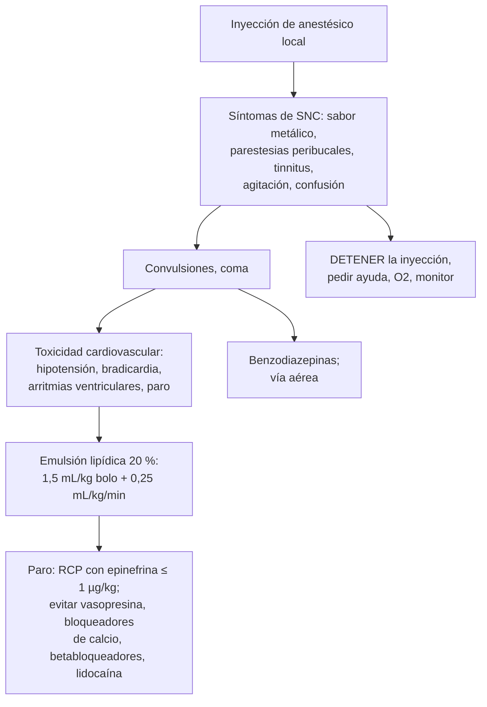

---
tags:
  - Cirugía
  - Urgencia
---

# Anestesia general, regional y local, e intoxicación por anestésicos locales

**Subespecialidad**
Anestesiología · Perioperatorio · Urgencia

**Guías principales**
Tercera recomendación de la ASRA sobre toxicidad sistémica por anestésicos locales (*Reg Anesth Pain Med* 2018) y su lista de chequeo · Guía ASA 2023 de ayuno preoperatorio (*Anesthesiology* 2023)

**Otras fuentes**
Clasificación del estado físico ASA

**GES**
No.

**EUNACOM**
4.01.2.028 Intoxicación por anestésicos locales (diagnóstico específico, tratamiento inicial) · 4.01.3.007 Conceptos básicos de anestesia general, local y regional

**Revisado**
Octubre 2026

!!! abstract "Resumen en 60 segundos"
    - **Anestesia general**: **hipnosis** (inconsciencia), **analgesia**, **relajación muscular** y control de los reflejos autonómicos; requiere manejo de la **vía aérea**. Fases: **inducción**, **mantención** y **despertar**.
    - **Anestesia regional**: **neuroaxial** (**espinal** o raquídea y **epidural**) y **bloqueos de nervios periféricos**. **Local**: infiltración del sitio.
    - **Ayuno** (ASA 2023): **líquidos claros hasta 2 h** antes, comida liviana **6 h**, comida grasa **8 h**.
    - **Clasificación ASA**: I sano; II enfermedad sistémica leve; III grave; IV grave con amenaza vital; V moribundo; VI donante en muerte encefálica; "E" si es de urgencia.
    - **Dosis máximas de anestésicos locales**: **lidocaína 4,5 mg/kg sin epinefrina** (7 mg/kg con epinefrina); **bupivacaína ~ 2,5 mg/kg**.
    - **Toxicidad sistémica por anestésicos locales (LAST)**: primero **SNC** (sabor metálico, parestesias peribucales, tinnitus, agitación, **convulsiones**), luego **cardiovascular** (arritmias, **paro**). La bupivacaína es la más cardiotóxica.
    - **Tratamiento**: **detener la inyección**, pedir ayuda, vía aérea y **O2**, **benzodiazepinas** para las convulsiones y **emulsión lipídica al 20 %** (bolo **1,5 mL/kg** y luego **0,25 mL/kg/min**). En el paro: RCP con **epinefrina en dosis bajas** (≤ 1 µg/kg) y evitar la vasopresina, los bloqueadores de calcio, los betabloqueadores y la lidocaína.

## Definición

- **Anestesia general**: estado reversible de **inconsciencia**, **amnesia**, **analgesia** e **inmovilidad**, inducido por fármacos.
- **Anestesia regional**: bloqueo de la conducción nerviosa de una región mediante anestésicos locales.
    - **Espinal** (raquídea, intradural): inyección en el **líquido cefalorraquídeo** del espacio subaracnoideo; dosis pequeña, efecto rápido y denso.
    - **Epidural**: inyección en el **espacio epidural** (por fuera de la duramadre), habitualmente con un **catéter**; efecto más lento, permite analgesia prolongada (parto, posoperatorio).
    - **Bloqueos de nervios periféricos**: plexo braquial, femoral, etc., guiados por ecografía.
- **Anestesia local**: infiltración del tejido en el sitio del procedimiento.
- **Sedación**: depresión de la conciencia en grados (mínima, moderada, profunda), con riesgo de perder la vía aérea en las profundas.
- **Toxicidad sistémica por anestésicos locales** (*LAST*): efectos adversos sobre el **SNC** y el **corazón** por concentraciones plasmáticas excesivas.

## Epidemiología

### Mundial

- La anestesia moderna es **muy segura**; la mortalidad atribuible a la anestesia es muy baja en los pacientes sanos y aumenta con la **clase ASA** y la **urgencia**.
- La **toxicidad por anestésicos locales** es **rara**, pero potencialmente letal; el uso de la **ecografía** en los bloqueos y de dosis seguras la ha reducido.
- Las náuseas y vómitos posoperatorios y el dolor son las molestias más frecuentes tras la anestesia.

### Chile

!!! chile "Datos nacionales"
    - No se encontraron datos nacionales recientes publicados sobre la incidencia de la toxicidad por anestésicos locales.
    - Los anestésicos locales (sobre todo la **lidocaína**) se usan a diario en APS y urgencias (suturas, procedimientos), donde se deben conocer las **dosis máximas** y el manejo de la toxicidad.

## Etiología y factores de riesgo

**Factores de riesgo de toxicidad por anestésicos locales**:

| Factor | Ejemplos |
|---|---|
| **Dosis** | Superar la dosis máxima; dosis repetidas; infiltración de grandes áreas |
| **Inyección intravascular** inadvertida | No aspirar antes de inyectar; zonas muy vascularizadas |
| **Sitio** | Absorción mayor en bloqueos **intercostales** > caudal > epidural > plexo braquial > subcutáneo |
| **Fármaco** | **Bupivacaína** (más cardiotóxica) > ropivacaína > lidocaína |
| **Paciente** | Edades extremas, **bajo peso**, **insuficiencia cardíaca**, **hepática** o renal, embarazo, acidosis, hipoxia |

## Fisiopatología

- Los anestésicos locales **bloquean los canales de sodio** de las membranas nerviosas e impiden la conducción del impulso. La **epinefrina** produce vasoconstricción, prolonga el efecto y reduce la absorción sistémica.
- Con niveles altos, bloquean también los canales del **SNC** (primero las vías **inhibitorias** → excitación y **convulsiones**; luego depresión, coma) y del **corazón** (bradicardia, bloqueos, **arritmias ventriculares**, depresión miocárdica, **paro**).
- La **emulsión lipídica** actúa como un "**sumidero lipídico**" que captura el anestésico liposoluble y tiene efectos cardiotónicos.

*Figura 1. Toxicidad sistémica por anestésicos locales y su manejo. Esquema propio basado en la recomendación de la ASRA (2018).*

## Clasificación

**Anestésicos locales de uso frecuente**:

| Fármaco | Inicio | Duración | Dosis máxima sin epinefrina | Con epinefrina |
|---|---|---|---|---|
| **Lidocaína** | Rápido | Intermedia (1–2 h) | **4,5 mg/kg** (máx. ~ 300 mg) | **7 mg/kg** (máx. ~ 500 mg) |
| **Bupivacaína** | Lento | Larga (4–8 h) | **~ 2,5 mg/kg** (máx. ~ 175 mg) | ~ 3 mg/kg (máx. ~ 225 mg) |
| **Ropivacaína** | Intermedio | Larga | ~ 3 mg/kg | — |

Recordatorio de cálculo: **lidocaína al 1 % = 10 mg/mL**; al 2 % = 20 mg/mL. Un adulto de 70 kg puede recibir hasta ~ **30 mL de lidocaína al 1 % sin epinefrina**.

**Clasificación del estado físico ASA**:

| Clase | Descripción | Ejemplo |
|---|---|---|
| **ASA I** | Paciente sano | Adulto sano no fumador |
| **ASA II** | Enfermedad sistémica **leve** | HTA o diabetes controladas, fumador, obesidad leve |
| **ASA III** | Enfermedad sistémica **grave** | Diabetes mal controlada, EPOC, obesidad mórbida, ERC en diálisis |
| **ASA IV** | Enfermedad grave que es una **amenaza constante para la vida** | IAM reciente, insuficiencia cardíaca grave, sepsis |
| **ASA V** | **Moribundo**, no se espera que sobreviva sin la cirugía | AAA roto, trauma masivo |
| **ASA VI** | Muerte encefálica, donante de órganos | |
| **E** | Cirugía de **urgencia** | Se agrega a la clase |

**Tipos de anestesia**:

| Tipo | Ventajas | Riesgos y complicaciones |
|---|---|---|
| **General** | Control total de la vía aérea, cualquier cirugía | Aspiración, dificultad de vía aérea, hipotensión, náuseas y vómitos, **hipertermia maligna** (rara), despertar intraoperatorio, delirium en adultos mayores |
| **Espinal** | Rápida, densa, simple; cirugía infraumbilical, cesárea | **Hipotensión** (bloqueo simpático), bradicardia, **cefalea pospunción dural**, retención urinaria, raquianestesia total |
| **Epidural** | Analgesia prolongada por catéter (parto, posoperatorio) | Hipotensión, punción dural accidental, **hematoma** o **absceso epidural** (raros), toxicidad sistémica |
| **Bloqueo periférico** | Analgesia focal, menos efectos sistémicos | Lesión nerviosa, toxicidad sistémica, neumotórax (bloqueos supraclaviculares) |
| **Local** | Simple, segura | Toxicidad si se excede la dosis |

## Clínica

- **Toxicidad sistémica por anestésicos locales**: aparece en **minutos** tras la inyección (o hasta una hora en los bloqueos o infusiones continuas).
    - **SNC (precoz)**: **sabor metálico**, **parestesias peribucales**, **tinnitus**, mareo, visión borrosa, agitación, confusión, disartria, **fasciculaciones** → **convulsiones** → coma y apnea.
    - **Cardiovascular**: inicialmente hipertensión y taquicardia, luego **bradicardia**, bloqueos, **hipotensión**, **arritmias ventriculares** y **asistolía**. La **bupivacaína** puede causar un paro sin pródromo neurológico.
- **Complicaciones de la anestesia neuroaxial**:
    - **Cefalea pospunción dural**: **postural** (empeora al sentarse o pararse, mejora al acostarse), 1–3 días después.
    - **Hematoma epidural**: dolor lumbar y **déficit motor progresivo** de las piernas (urgencia: RM y descompresión); riesgo con anticoagulantes.

## Diagnóstico

!!! guia "Puntos clave (ASRA 2018)"
    - El diagnóstico de la toxicidad es **clínico**: síntomas neurológicos o cardiovasculares tras la administración de un anestésico local.
    - **Prevención**: usar la **menor dosis eficaz**, **aspirar** antes de inyectar, inyectar en **fracciones** lentas, usar **epinefrina** como marcador intravascular en dosis de prueba, **guía ecográfica** en los bloqueos, monitorización en los bloqueos de grandes volúmenes.
    - **Tener disponible** la **emulsión lipídica al 20 %** y la lista de chequeo donde se hagan bloqueos.
    - **Evaluación preanestésica**: anamnesis (comorbilidades, fármacos, alergias, anestesias previas, historia familiar de hipertermia maligna), examen de la **vía aérea** (Mallampati, apertura bucal, cuello), clasificación **ASA**, ayuno.

## Laboratorio

| Examen | Uso |
|---|---|
| **Ninguno específico** | La toxicidad es un diagnóstico clínico; los niveles plasmáticos no están disponibles en la urgencia |
| **Gases, electrolitos** | La **acidosis** y la **hipoxia** empeoran la toxicidad |
| **Exámenes preoperatorios** | Según la edad, las comorbilidades y la cirugía (no de rutina en pacientes sanos) |

## Imágenes

| Examen | Uso |
|---|---|
| **ECG / monitor** | Arritmias en la toxicidad |
| **Ecografía** | Guía de los bloqueos regionales (reduce la toxicidad) |
| **RM de columna** | Sospecha de hematoma o absceso epidural |

## Diagnóstico diferencial

| Cuadro | Claves |
|---|---|
| **Reacción vasovagal** | Bradicardia, palidez, sudoración, sin síntomas neurológicos centrales; mejora al acostarse |
| **Anafilaxia** | Urticaria, broncoespasmo, angioedema, hipotensión (raro con los anestésicos tipo amida; más con los ésteres o los conservantes) |
| **Efecto de la epinefrina** | Taquicardia, palpitaciones y ansiedad transitorias |
| **Crisis epiléptica de otra causa**, hipoglicemia | Contexto |
| **Raquianestesia total** | Hipotensión, bradicardia, apnea y pérdida de conciencia tras una anestesia neuroaxial |

## Tratamiento

!!! dosis "Toxicidad sistémica por anestésicos locales (ASRA)"
    1. **Detener** la inyección del anestésico local; **pedir ayuda** (pedir la emulsión lipídica).
    2. **Vía aérea**: **oxígeno al 100 %**, ventilar si es necesario (evitar la **hipoxia** y la **acidosis**, que empeoran la toxicidad).
    3. **Convulsiones**: **benzodiazepinas** (midazolam). Evitar el propofol en dosis altas si hay inestabilidad cardiovascular.
    4. **Emulsión lipídica al 20 %**, ante signos de toxicidad grave:
        - **> 70 kg**: bolo de **100 mL** en 2–3 minutos, seguido de **200–250 mL en 15–20 minutos**.
        - **≤ 70 kg**: bolo de **1,5 mL/kg** en 2–3 minutos, seguido de **0,25 mL/kg/min**.
        - Repetir el bolo o aumentar la infusión si persiste la inestabilidad; dosis máxima total aproximada **12 mL/kg**.
    5. **Paro cardíaco**: **RCP** de alta calidad con modificaciones:
        - **Epinefrina en dosis bajas** (**≤ 1 µg/kg**).
        - **Evitar** la vasopresina, los **bloqueadores de calcio**, los **betabloqueadores** y otros **anestésicos locales** (no usar lidocaína como antiarrítmico; preferir amiodarona).
        - Considerar el **bypass cardiopulmonar (ECMO)** si no responde, y la RCP prolongada.
    6. Observación prolongada (al menos **2 h** tras una convulsión y **4–6 h** tras la inestabilidad cardiovascular).

### Conceptos de anestesia general

- **Inducción**: hipnótico IV (**propofol**; ketamina o etomidato en el paciente inestable), opioide (fentanilo), relajante neuromuscular (rocuronio; succinilcolina en la secuencia rápida) e **intubación**. **Secuencia de intubación rápida** en el paciente con estómago lleno (urgencias, embarazo, obstrucción intestinal).
- **Mantención**: anestésicos **inhalatorios** (sevoflurano) o **intravenosa total** (propofol), opioides y relajantes.
- **Despertar**: suspensión de los fármacos, reversión del bloqueo neuromuscular (neostigmina o **sugammadex** para el rocuronio), extubación con reflejos presentes.
- **Hipertermia maligna** (rara, hereditaria): desencadenada por los **anestésicos inhalatorios** y la **succinilcolina**: **hipercapnia**, rigidez, taquicardia, hipertermia, rabdomiólisis → suspender el desencadenante y dar **dantroleno**.

!!! alarma "Urgencias anestésicas"
    - **Convulsiones o arritmias** tras inyectar un anestésico local: **toxicidad** → emulsión lipídica.
    - **Déficit motor progresivo** de las piernas tras una anestesia o un catéter epidural: **hematoma epidural** → RM urgente.
    - **Hipercapnia, rigidez y fiebre** intraoperatorias: **hipertermia maligna** → dantroleno.

## Complicaciones

- **Toxicidad por anestésicos locales**: convulsiones, arritmias, paro cardíaco, muerte.
- **Anestesia general**: aspiración pulmonar, lesiones de la vía aérea y dentales, náuseas y vómitos, **delirium** y disfunción cognitiva en los adultos mayores, hipertermia maligna, anafilaxia.
- **Neuroaxial**: hipotensión, cefalea pospunción, retención urinaria, hematoma o absceso epidural, lesión nerviosa (rara).
- **Metahemoglobinemia** (prilocaína, benzocaína tópica): cianosis con saturación baja que no mejora con O2 → **azul de metileno**.

## Pronóstico y seguimiento

- La toxicidad por anestésicos locales tratada precozmente con emulsión lipídica tiene buen pronóstico en la mayoría.
- La seguridad anestésica depende de la **evaluación preoperatoria**, la monitorización y la preparación para las complicaciones.

## Perlas para el internado

!!! perla "Para recordar en la sala"
    - **Lidocaína: 4,5 mg/kg sin epinefrina, 7 mg/kg con epinefrina. Al 1 % = 10 mg/mL.**
    - **Aspirar antes de inyectar e inyectar lento.**
    - **Sabor metálico, parestesias peribucales y tinnitus = primeros síntomas de toxicidad**: detener la inyección.
    - **Emulsión lipídica 20 %: 1,5 mL/kg en bolo + 0,25 mL/kg/min.**
    - **Paro por anestésico local: epinefrina en dosis bajas, sin lidocaína ni vasopresina.**
    - **Bupivacaína = la más cardiotóxica.**
    - **Ayuno: líquidos claros 2 h, comida liviana 6 h, comida grasa 8 h.**
    - **Cefalea que empeora de pie tras una raquídea = cefalea pospunción.**
    - **Dolor lumbar y paraparesia tras una epidural en un anticoagulado = hematoma epidural.**

## Preguntas de repaso

??? repaso "1. ¿Cuántos mL de lidocaína al 2 % sin epinefrina puede usar como máximo en un adulto de 60 kg para suturar una herida?"
    - Dosis máxima: **4,5 mg/kg** × 60 kg = **270 mg**.
    - Lidocaína al 2 % = 20 mg/mL → máximo **~ 13,5 mL**.

??? repaso "2. Durante un bloqueo axilar con bupivacaína, el paciente refiere sabor metálico y zumbido de oídos, y luego convulsiona. ¿Qué hace?"
    - **Toxicidad sistémica por anestésico local**.
    - **Detener la inyección**, pedir ayuda, **O2 al 100 %** y ventilación, **benzodiazepina** para la convulsión y **emulsión lipídica al 20 %** (1,5 mL/kg en bolo y 0,25 mL/kg/min); monitorización por el riesgo de arritmias.

??? repaso "3. El mismo paciente presenta una fibrilación ventricular. ¿Qué cambios hace en la RCP?"
    - RCP de alta calidad y desfibrilación; **epinefrina en dosis bajas (≤ 1 µg/kg)**; **evitar la vasopresina**, los bloqueadores de calcio, los betabloqueadores y la **lidocaína** (usar amiodarona); continuar la **emulsión lipídica**; considerar ECMO.

??? repaso "4. Mujer de 30 años con cefalea intensa que aparece al sentarse y cede al acostarse, 2 días después de una cesárea con anestesia raquídea. ¿Qué tiene?"
    - **Cefalea pospunción dural**.
    - Reposo, hidratación, analgesia, cafeína; **parche hemático epidural** si es intensa o persistente.

??? repaso "5. ¿Cuál es la clase ASA de un hombre de 60 años con diabetes mal controlada (HbA1c 10 %) y obesidad mórbida que va a una colecistectomía de urgencia?"
    - **ASA III E** (enfermedad sistémica grave; "E" por la urgencia).

## Referencias

1. Neal JM, Barrington MJ, Fettiplace MR, et al. The Third American Society of Regional Anesthesia and Pain Medicine Practice Advisory on Local Anesthetic Systemic Toxicity: Executive Summary 2017. *Reg Anesth Pain Med.* 2018;43(2):113–123. doi:[10.1097/AAP.0000000000000720](https://doi.org/10.1097/AAP.0000000000000720)
2. Neal JM, Woodward CM, Harrison TK. The American Society of Regional Anesthesia and Pain Medicine Checklist for Managing Local Anesthetic Systemic Toxicity: 2017 Version. *Reg Anesth Pain Med.* 2018;43(2):150–153. doi:[10.1097/AAP.0000000000000726](https://doi.org/10.1097/AAP.0000000000000726)
3. Joshi GP, Abdelmalak BB, Weigel WA, et al. 2023 American Society of Anesthesiologists Practice Guidelines for Preoperative Fasting: Carbohydrate-containing Clear Liquids with or without Protein, Chewing Gum, and Pediatric Fasting Duration—A Modular Update of the 2017 American Society of Anesthesiologists Practice Guidelines for Preoperative Fasting. *Anesthesiology.* 2023;138(2):132–151. doi:[10.1097/ALN.0000000000004381](https://doi.org/10.1097/ALN.0000000000004381)
4. American Society of Anesthesiologists. Statement on ASA Physical Status Classification System. [asahq.org](https://www.asahq.org/standards-and-practice-parameters/statement-on-asa-physical-status-classification-system)
