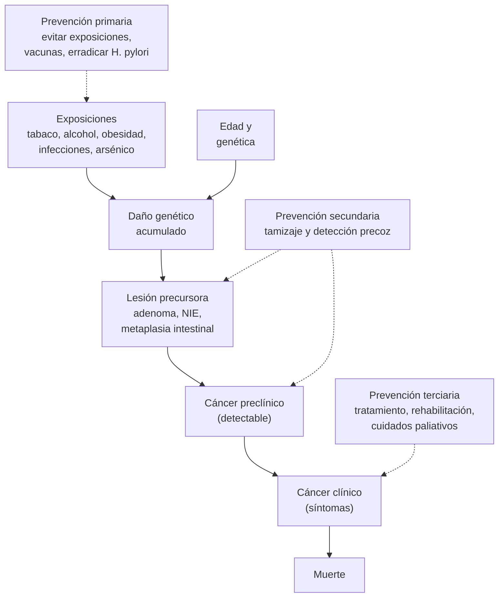

---
tags:
  - Cirugía
  - GES
---

# Epidemiología del cáncer (mundo y Chile), prevención y tamizaje

**Subespecialidad**
Oncología · Salud pública · Cirugía oncológica

**Guías principales**
GLOBOCAN 2024 (Observatorio Global del Cáncer, IARC, 2026) · Nota descriptiva de la OMS sobre el cáncer (julio de 2026)

**Otras fuentes**
Panorama del cáncer en Chile (Vacarezza y cols., *Biol Res* 2024) · Ley Nacional del Cáncer (Ley 21.258, 2020) · GES N.° 90 de cesación del tabaco (diciembre de 2025) · Principios de tamizaje de Wilson y Jungner (OMS, 1968)

**GES**
Hay varios problemas de salud oncológicos con garantía GES (por ejemplo, mama N.° 8, gástrico N.° 27, próstata N.° 28, colorrectal N.° 70, cuidados paliativos N.° 4) y una garantía preventiva: la **colecistectomía preventiva** (N.° 26). Desde diciembre de 2025, la **cesación del consumo de tabaco** es el GES N.° 90.

**EUNACOM**
4.01.3.013 Epidemiología del cáncer (conocimiento general)

**Revisado**
Octubre 2026

!!! abstract "Resumen en 60 segundos"
    - **Mundo (GLOBOCAN 2024)**: **20,6 millones** de casos nuevos y **9,8 millones** de muertes al año. Lo más frecuente: **pulmón**, mama, colorrecto, próstata y estómago. La primera causa de muerte por cáncer es el **pulmón** (19 %).
    - **Chile (GLOBOCAN 2024)**: **59 887** casos nuevos y **31 498** muertes al año (~ **86 muertes al día**).
        - **Más frecuentes**: **próstata**, **colorrecto**, **estómago**, **mama** y **pulmón**.
        - **Más muertes**: **pulmón**, **colorrecto** y **estómago**.
        - En los hombres: próstata, colorrecto y estómago. En las mujeres: **mama**, colorrecto y **cuello uterino**.
    - El cáncer **compite con las enfermedades circulatorias** como **primera causa de muerte** en Chile. Por el **envejecimiento**, se proyecta un aumento de los casos de **~ 38 % hacia 2030** y de **~ 75 % hacia 2040** (respecto de 2020).
    - **Particularidades chilenas**: **vesícula** (de las tasas más altas del mundo, en descenso), **estómago** (*H. pylori*) y **pulmón asociado al arsénico** en el norte.
    - **Prevención**: según la OMS, **~ 38 %** de los cánceres son **prevenibles** evitando los factores de riesgo. El principal es el **tabaco**; le siguen el alcohol, la obesidad, el sedentarismo, la dieta y las **infecciones** (*H. pylori*, VPH, VHB, VHC).
    - **Tamizaje con beneficio demostrado**:
        - Cuello uterino: PAP o test de VPH.
        - Mama: mamografía.
        - Colorrecto: test de sangre oculta inmunológico (FIT) o colonoscopía.
        - Pulmón: TC de baja dosis en fumadores de alto riesgo.
        - Cuidado con los sesgos (**adelanto diagnóstico**, **duración**) y el **sobrediagnóstico**.

## Definición

- **Epidemiología del cáncer**: estudio de la frecuencia, la distribución y los determinantes del cáncer en las poblaciones, y de las intervenciones para controlarlo (prevención, tamizaje, tratamiento, cuidados paliativos).
- **Incidencia**: número de **casos nuevos** en un período (habitualmente un año) en una población. Se expresa como número absoluto o como **tasa** por 100 000 habitantes.
- **Mortalidad**: número de **muertes** por cáncer en un período; tasa por 100 000.
- **Prevalencia**: personas **vivas** con el diagnóstico. GLOBOCAN informa la **prevalencia a 5 años** (vivos diagnosticados en los últimos 5 años).
- **Tasa estandarizada por edad (TEE)**: tasa ajustada a una población estándar (la población mundial de Segi). Permite **comparar países** con estructuras de edad distintas.
- **Riesgo acumulado (0–74 años)**: probabilidad de desarrollar (o morir de) un cáncer antes de los 75 años, sin otras causas de muerte.
- **Sobrevida relativa a 5 años**: sobrevida observada de los pacientes dividida por la esperada en la población general de igual edad y sexo.
- **Razón mortalidad/incidencia (M/I)**: aproxima la letalidad. Cerca de **1** en los cánceres de mal pronóstico (páncreas, hígado, pulmón, esófago); baja en los de buen pronóstico (tiroides, próstata, mama).
- **Registro poblacional de cáncer (RPC)**: registra **todos** los casos nuevos de una población definida; es la fuente de la incidencia. **Registro hospitalario**: los casos atendidos en un centro (útil para la gestión, no para la incidencia).

## Epidemiología

### Mundial

| Indicador (GLOBOCAN 2024) | Ambos sexos | Hombres | Mujeres |
|---|---|---|---|
| Casos nuevos | **20,6 millones** | 10,6 millones | 10,0 millones |
| Muertes | **9,8 millones** | 5,5 millones | 4,3 millones |
| Prevalencia a 5 años | **54,2 millones** | | |
| Riesgo acumulado de cáncer (0–74 años) | **19,8 %** (~ 1 de cada 5) | 21,4 % | 18,5 % |
| Riesgo acumulado de morir por cáncer | **9,2 %** (~ 1 de cada 11) | 11,0 % | 7,6 % |
| Más frecuentes | Pulmón, mama, colorrecto | Pulmón, próstata, colorrecto | Mama, pulmón, colorrecto |
| Más muertes | **Pulmón** (19,1 %), colorrecto, hígado | Pulmón, colorrecto, hígado | Mama, pulmón, colorrecto |

- El **cáncer pulmonar** es el más frecuente (**2,6 millones**, 12,8 %) y la **primera causa de muerte** por cáncer (**1,9 millones**).
- El **cáncer de mama** es el más frecuente en las mujeres (**2,4 millones**, 24,3 % de sus cánceres).
- Según la OMS (2026):
    - **~ 38 %** de los cánceres se pueden **prevenir** evitando los factores de riesgo.
    - **Casi un cuarto** de las muertes por cáncer se deben al **tabaco**, el **alcohol**, el **exceso de peso**, la **baja ingesta de frutas y verduras** y la **inactividad física**.
    - **~ 10 %** de los cánceres diagnosticados en 2022 se atribuyeron a **infecciones carcinogénicas** (*H. pylori*, VPH, VHB, VHC, VEB).

### Chile

!!! chile "Datos nacionales"
    - **GLOBOCAN 2024** (Observatorio Global del Cáncer, IARC):

        | Indicador | Ambos sexos | Hombres | Mujeres |
        |---|---|---|---|
        | Casos nuevos | **59 887** | 32 104 | 27 783 |
        | TEE de incidencia (por 100 000) | 161,9 | 181,0 | 148,2 |
        | Muertes | **31 498** | 16 725 | 14 773 |
        | TEE de mortalidad (por 100 000) | 83,3 | 94,3 | 74,6 |
        | Riesgo acumulado de cáncer (0–74 años) | 15,5 % | 16,7 % | 14,4 % |
        | Prevalencia a 5 años | 172 913 | 93 069 | 79 844 |
        | Más frecuentes | **Próstata**, colorrecto, estómago | Próstata, colorrecto, estómago | **Mama**, colorrecto, **cuello uterino** |
        | Más muertes | **Pulmón**, colorrecto, estómago | Próstata, estómago, pulmón | Mama, colorrecto, pulmón |

    - **Advertencia sobre la fuente**: Chile **no tiene registro poblacional nacional**. GLOBOCAN **estima** la incidencia a partir de la **mortalidad nacional** (que sí es confiable, DEIS/OMS) y de razones M/I modeladas. Existen registros poblacionales **regionales**. La **Ley 21.258** exige un **Registro Nacional del Cáncer**.
    - **Primera causa de muerte**: el cáncer **disputa el primer lugar** con las enfermedades del sistema circulatorio. Una revisión chilena lo describe ya como la **principal causa de muerte** (59 876 casos y 31 440 muertes en 2022; Vacarezza 2024). Según los datos preliminares del DEIS, los tumores malignos han estado primeros en algunos años y segundos en otros.
    - **Proyección** (estudio ICCI-LA, citado por Vacarezza 2024): **74 973** casos nuevos en **2030** (+38,3 %) y **94 807** en **2040** (+74,9 %), por el **envejecimiento** de la población.
    - **Carga**: el cáncer explica **~ 19 % de los AVISA** y **~ 36 % de los años de vida perdidos por muerte prematura** en Chile (Vacarezza 2024, con datos del IHME y del MINSAL).
    - **Tendencias** (Vacarezza 2024):
        - La mortalidad por cáncer de **mama**, **próstata** y **pulmón** sube lentamente.
        - La mortalidad por cáncer **gástrico**, esofágico y testicular se ha **estabilizado**.
        - Las mortalidades por cáncer de **vesícula** y **cervicouterino** han **descendido** de forma marcada. Los factores propuestos para la vesícula son el **saneamiento** (menos salmonelosis), la **colecistectomía preventiva GES** (~ 700 000 desde 2007) y otros.
    - **Cánceres con perfil chileno**:
        - **Vesícula**: 2068 casos y 1156 muertes al año.
        - **Gástrico**: 5494 casos y 3511 muertes; 3.^er^ cáncer en incidencia y mortalidad.
        - **Pulmón**: 1.^a^ causa de muerte por cáncer; en el norte, asociado al **arsénico** en el agua potable.
        - **Cervicouterino**: 3.^er^ cáncer en las mujeres.

<figure markdown>
{ loading=lazy }
<figcaption>Figura 1. Los 10 cánceres más frecuentes en Chile, con sus casos nuevos y muertes anuales. Nótese la alta razón muertes/casos del pulmón, el hígado y el páncreas. Esquema propio con datos de GLOBOCAN 2024 (Observatorio Global del Cáncer, IARC, 2026).</figcaption>
</figure>

## Etiología y factores de riesgo

| Factor | Cánceres asociados | Comentario |
|---|---|---|
| **Tabaco** | Pulmón, cabeza y cuello, esófago, estómago, páncreas, riñón, **vejiga**, cuello uterino, LMA | **Principal factor prevenible**. GES N.° 90 de cesación (> 25 años) |
| **Alcohol** | Cavidad oral, faringe, laringe, esófago (escamoso), hígado, colorrecto, **mama** | Sin umbral seguro |
| **Obesidad y sedentarismo** | Colorrecto, mama posmenopáusica, endometrio, riñón, esófago (adenocarcinoma), páncreas, hígado, vesícula | La obesidad es muy prevalente en Chile |
| **Dieta** | Colorrecto (carnes procesadas y rojas, poca fibra), estómago (sal, ahumados) | |
| **Infecciones** | ***H. pylori*** (gástrico, linfoma MALT), **VPH** (cuello uterino, ano, orofaringe, pene), **VHB/VHC** (hepatocarcinoma), **VEB** (Burkitt, Hodgkin, nasofaringe), **VIH** (Kaposi, linfomas), *Schistosoma* (vejiga) | Prevención con vacunas (VPH, VHB) y tratamiento (*H. pylori*, VHC) |
| **Colelitiasis** | **Vesícula** | Fundamento de la colecistectomía preventiva GES (35–49 años) |
| **Ambientales y ocupacionales** | **Arsénico** (pulmón, vejiga, piel), **asbesto** (mesotelioma, pulmón), radón, benceno (leucemia), aminas aromáticas (vejiga), radiación ionizante, radiación UV (piel) | Arsénico en el agua potable del norte de Chile (exposición histórica) |
| **Edad** | Casi todos | Principal factor no modificable; explica el aumento proyectado |
| **Genéticos** | *BRCA1/2* (mama, ovario, próstata, páncreas), **Lynch** (colorrecto, endometrio), PAF (colorrecto), *CDH1* (gástrico difuso), MEN | ~ 5–10 % de los cánceres |

## Fisiopatología

- El cáncer resulta de la **acumulación de alteraciones genéticas y epigenéticas** (activación de oncogenes, pérdida de genes supresores, inestabilidad genómica) a lo largo de años o décadas.
- **Carcinogénesis en etapas**: iniciación (daño del ADN) → promoción (proliferación clonal) → progresión (invasión y metástasis).
- Esto explica tres hechos epidemiológicos:
    - La **incidencia aumenta con la edad**.
    - Existe una **larga fase preclínica detectable**, que es la base del tamizaje (lesiones precursoras: adenoma colorrectal, NIE cervical, metaplasia intestinal gástrica).
    - La **exposición a carcinógenos** se traduce en cáncer décadas después (tabaco, arsénico, asbesto).
- La **transición epidemiológica**: con el desarrollo bajan los cánceres asociados a infecciones y pobreza (estómago, cuello uterino, vesícula, hígado) y suben los asociados al estilo de vida occidental y al envejecimiento (mama, próstata, colorrecto, pulmón en las mujeres). Chile está en plena transición.

*Figura 2. Historia natural del cáncer y niveles de prevención. Esquema propio.*

## Clasificación

**Niveles de prevención del cáncer**

| Nivel | Objetivo | Ejemplos |
|---|---|---|
| **Primaria** | Evitar que aparezca el cáncer | Control del tabaco (ley de etiquetado y espacios libres de humo), **vacuna VPH** (gratuita en el Programa Nacional de Inmunizaciones), vacuna VHB, erradicación de *H. pylori*, **colecistectomía preventiva**, ley de etiquetado de alimentos, protección solar |
| **Secundaria** | Detectarlo en fase precoz y curable | **PAP / test de VPH**, **mamografía**, FIT o colonoscopía, TC de baja dosis en fumadores, endoscopía en sintomáticos |
| **Terciaria** | Disminuir las complicaciones, recurrencias y secuelas | Tratamiento oportuno (garantías GES), rehabilitación, seguimiento |
| **Cuaternaria** | Evitar el daño por sobreintervención | Evitar el **sobrediagnóstico** y el sobretratamiento (ej.: tamizaje de tiroides o próstata en personas sin indicación) |

**Clasificaciones usadas en oncología**

- **CIE-O** (Clasificación Internacional de Enfermedades para Oncología): topografía y morfología, base de los registros.
- **TNM** (AJCC/UICC): etapificación anatómica (tumor, ganglios, metástasis). Permite comparar la **sobrevida por etapa**.
- **Estado funcional** (ECOG 0–4, Karnofsky): define si el paciente tolera el tratamiento.

## Clínica

Señales de alarma que obligan a descartar un cáncer:

| Señal | Pensar en |
|---|---|
| **Baja de peso** no intencionada (> 5 % en 6–12 meses), anorexia, astenia | Cualquier cáncer, sobre todo digestivo, pulmón, páncreas, linfoma |
| **Anemia ferropénica** en el hombre o la mujer posmenopáusica | **Cáncer colorrectal** o gástrico |
| **Cambio del hábito intestinal**, rectorragia en > 40–50 años | Colorrecto |
| **Disfagia** progresiva | Esófago, cardias |
| **Dispepsia** con signos de alarma o > 40 años en Chile | **Gástrico** |
| **Ictericia indolora**, signo de Courvoisier-Terrier | Páncreas, vía biliar, ampolla |
| **Hemoptisis**, tos persistente en fumador | Pulmón |
| **Nódulo mamario**, retracción del pezón, secreción hemática | Mama |
| **Hematuria macroscópica indolora** | Vejiga, riñón |
| **Metrorragia** posmenopáusica o sinusorragia | Endometrio, cuello uterino |
| **Adenopatía** dura, fija, > 2 cm o supraclavicular | Linfoma, metástasis |
| **Masa testicular** indolora | Testículo |
| **Lesión pigmentada** con cambios (ABCDE) | Melanoma |

## Diagnóstico

!!! guia "Principios de un buen programa de tamizaje (Wilson y Jungner, OMS 1968)"
    - La enfermedad es un **problema de salud importante**.
    - Tiene una **fase preclínica** reconocible.
    - Hay un **tratamiento eficaz** en la fase precoz, mejor que en la tardía.
    - Hay un **examen aceptable**, seguro, sensible y de costo razonable.
    - Existen recursos para el **diagnóstico y el tratamiento** de los positivos.
    - El tamizaje es un **proceso continuo**, no un examen aislado.

**Evaluar un examen de tamizaje**

| Concepto | Definición |
|---|---|
| **Sensibilidad** | Positivos entre los enfermos. Clave en el tamizaje (no perder casos) |
| **Especificidad** | Negativos entre los sanos. Si es baja, hay muchos **falsos positivos** |
| **Valor predictivo positivo** | Enfermos entre los positivos; **aumenta con la prevalencia** (por eso se tamiza a grupos de riesgo) |
| **Sesgo de adelanto diagnóstico** (*lead time*) | El tamizaje adelanta el diagnóstico y **alarga la sobrevida aparente** sin cambiar el momento de la muerte |
| **Sesgo de duración** (*length time*) | El tamizaje detecta más los tumores **lentos** (de mejor pronóstico) |
| **Sobrediagnóstico** | Diagnosticar cánceres que **nunca habrían dado síntomas** ni causado la muerte (próstata, tiroides, mama in situ) |

- Por estos sesgos, el beneficio del tamizaje se demuestra con la **reducción de la mortalidad específica** en **ensayos aleatorizados**, no con el aumento de la sobrevida.

## Laboratorio

**Marcadores tumorales**: sirven para el **seguimiento** y la respuesta al tratamiento. **No** sirven como tamizaje poblacional (excepto el APE en una decisión compartida).

| Marcador | Uso principal |
|---|---|
| **APE** (antígeno prostático específico) | Próstata: decisión compartida de tamizaje (50–69 años), seguimiento |
| **CEA** | Colorrectal: pronóstico y seguimiento posoperatorio |
| **CA 19-9** | Páncreas, vía biliar: seguimiento (no diagnóstico; sube en la colestasia) |
| **CA 125** | Ovario: masa anexial en la posmenopausia, seguimiento |
| **Alfafetoproteína** | Hepatocarcinoma, tumores germinales no seminomatosos |
| **β-hCG**, LDH | Tumores germinales (testículo), coriocarcinoma |
| **Calcitonina** | Carcinoma medular de tiroides |
| **Tiroglobulina** | Seguimiento del cáncer diferenciado de tiroides tras la tiroidectomía total |

## Imágenes

| Tamizaje | Población | Comentario |
|---|---|---|
| **Mamografía** | Mujeres de **50–69 años** cada 2 años (internacional); el EMP chileno la incluye en las de **50–59 años** cada 3 años | Ver [cáncer de mama](../cabeza-cuello-tiroides-y-mama/cancer-de-mama.md) |
| **TC de tórax de baja dosis** | Fumadores o exfumadores de alto riesgo (50–80 años, ≥ 20 paquetes-año; USPSTF 2021) | **No** es un programa nacional en Chile. Ver [cáncer pulmonar](../../respiratorio/nodulo-pulmonar-y-cancer-pulmonar.md) |
| **Colonoscopía** | Alternativa al FIT para el tamizaje colorrectal (45–75 años, USPSTF 2021), confirmación del FIT positivo | En Chile **no hay tamizaje poblacional garantizado**. Ver [cáncer colorrectal](../../gastroenterologia/tumores-de-colon-y-cancer-colorrectal.md) |
| **Endoscopía digestiva alta** | En Chile: sintomáticos, sobre todo con signos de alarma | El tamizaje endoscópico poblacional (Japón, Corea) no está implementado. Ver [cáncer gástrico](../../gastroenterologia/dispepsia-ulcera-peptica-y-cancer-gastrico.md) |
| **Ecografía abdominal** | Detección de colelitiasis (base de la colecistectomía preventiva); vigilancia del hepatocarcinoma en el cirrótico cada 6 meses | |

## Diagnóstico diferencial

Errores frecuentes al interpretar las cifras:

| Confusión | Aclaración |
|---|---|
| Incidencia vs. prevalencia | La incidencia cuenta los **casos nuevos**; la prevalencia, los **vivos con la enfermedad** (alta en los cánceres de buen pronóstico, como mama y próstata) |
| Número absoluto vs. tasa | Más casos puede deberse solo a una **población más grande o más vieja**. Comparar **tasas estandarizadas por edad** |
| Más frecuente vs. más letal | La **próstata** es el más frecuente en Chile, pero el **pulmón** causa más muertes |
| Aumento de la incidencia vs. aumento real | Puede deberse a **más diagnóstico** (tamizaje, imágenes): tiroides y próstata |
| Sobrevida vs. mortalidad | La sobrevida mejora con el **adelanto diagnóstico** aunque la mortalidad no cambie |
| Registro hospitalario vs. poblacional | Solo el registro poblacional mide la incidencia |

## Tratamiento

Lo que corresponde a la **salud pública** y a la **organización de la atención** en Chile:

- **Ley Nacional del Cáncer (Ley 21.258, 2020)**, en homenaje al Dr. Claudio Mora:
    - Crea el **Plan Nacional del Cáncer**, la **Comisión Nacional del Cáncer**, el **Fondo Nacional del Cáncer** y el **Registro Nacional del Cáncer**.
    - Organiza la **red oncológica** y promueve la formación de especialistas.
- **GES oncológicos**: garantizan el **acceso**, la **oportunidad** (plazos máximos de confirmación, etapificación y tratamiento), la **protección financiera** y la **calidad**. Ejemplos ya verificados en este sitio:

    | GES | Problema de salud |
    |---|---|
    | N.° 4 | Alivio del dolor y cuidados paliativos por cáncer |
    | N.° 8 | Cáncer de mama en personas de 15 años y más |
    | N.° 16 | Cáncer de testículo en personas de 15 años y más |
    | N.° 17 | Linfomas en personas de 15 años y más |
    | N.° 26 | **Colecistectomía preventiva** del cáncer de vesícula (35–49 años) |
    | N.° 27 | Cáncer gástrico |
    | N.° 28 | Cáncer de próstata en personas de 15 años y más |
    | N.° 43 | Tumores primarios del SNC en personas de 15 años y más |
    | N.° 45 | Leucemia en personas de 15 años y más |
    | N.° 70 | Cáncer colorrectal en personas de 15 años y más |
    | N.° 72 | Cáncer vesical en personas de 15 años y más |
    | N.° 83 | Cáncer renal en personas de 15 años y más |
    | N.° 84 | Mieloma múltiple en personas de 15 años y más |
    | N.° 90 | **Cesación del consumo de tabaco** (> 25 años; apoyo psicológico y farmacológico) |

    También están en el GES el cáncer cervicouterino (con PAP cada 3 años entre los 25 y 64 años y, desde 2025, el test de VPH), el cáncer pulmonar y el cáncer en menores de 15 años, entre otros. Ver el [listado de la Superintendencia de Salud](https://www.superdesalud.gob.cl/).
- **Ley de cuidados paliativos universales (Ley 21.375, 2021)**: garantiza los cuidados paliativos a las personas con enfermedades terminales o graves, incluido el cáncer.
- **Políticas de prevención primaria**:
    - Leyes de control del tabaco (espacios libres de humo, prohibición de la publicidad).
    - Ley de etiquetado de alimentos (sellos "ALTO EN").
    - Vacunas VPH y VHB gratuitas en el Programa Nacional de Inmunizaciones.

!!! dosis "Rol del médico general (internado y APS)"
    - Preguntar por el **tabaco** en cada consulta y ofrecer la **cesación** (GES N.° 90).
    - Indicar los **tamizajes vigentes** según la edad y el sexo (EMP: PAP, mamografía).
    - Pedir la **ecografía abdominal** e indicar la **colecistectomía** en el paciente de 35–49 años con colelitiasis (GES N.° 26).
    - Reconocer los **signos de alarma** y **derivar con la sospecha GES** (esto activa los plazos de la garantía).
    - Registrar bien el diagnóstico en el **certificado de defunción** (fuente de la estadística nacional de mortalidad).

!!! alarma "Derivar con sospecha de cáncer"
    - Baja de peso significativa sin causa, anemia ferropénica sin causa en el adulto, disfagia progresiva, ictericia indolora, hemoptisis, hematuria macroscópica, nódulo mamario o testicular, metrorragia posmenopáusica, adenopatía sospechosa.

## Complicaciones

Problemas de salud pública asociados al cáncer:

- **Diagnóstico tardío**: en Chile, muchos cánceres (gástrico, pulmón, vesícula, páncreas) se diagnostican en etapas avanzadas, con baja sobrevida.
- **Inequidad**: diferencias de acceso y de resultados entre los sistemas público y privado, entre regiones y según el nivel socioeconómico.
- **Sobrediagnóstico y sobretratamiento**: por el tamizaje no indicado (tiroides, próstata).
- **Urgencias oncológicas**: ver [urgencias oncológicas](../../hematologia/urgencias-oncologicas.md).
- **Síndromes paraneoplásicos**: ver [síndromes paraneoplásicos](../../hematologia/sindromes-paraneoplasicos.md).
- **Dolor oncológico**: ver [manejo del dolor](manejo-del-dolor.md).

## Pronóstico y seguimiento

- La **sobrevida** depende sobre todo de la **etapa al diagnóstico**: los cánceres localizados tienen una sobrevida mucho mayor que los metastásicos. De ahí el valor del diagnóstico precoz.
- La **razón M/I** en Chile (GLOBOCAN 2024) muestra el pronóstico:
    - **Mal pronóstico**: páncreas (**~ 0,98**), hígado (~ 0,95), esófago (~ 0,92), pulmón (~ 0,91), estómago (~ 0,64).
    - **Mejor pronóstico**: próstata (~ 0,30), mama (~ 0,36), tiroides (~ 0,10).
- **Sobrevivientes**: la prevalencia a 5 años en Chile es de **~ 173 000 personas**. Necesitan un seguimiento por recurrencia, segundos cánceres y efectos tardíos (cardiotoxicidad, infertilidad, salud mental).

## Perlas para el internado

!!! perla "Para recordar en la sala"
    - **Chile (GLOBOCAN 2024)**: ~ **60 000 casos** y ~ **31 500 muertes** al año.
        - El más **frecuente** es la **próstata**; el que **más mata** es el **pulmón**.
        - En las **mujeres**, la **mama** es el más frecuente y el que más mata.
    - **Mundo**: el **pulmón** es el más frecuente y el más letal.
    - **Vesícula y estómago**: cánceres "chilenos". **Colecistectomía preventiva** (GES 26, 35–49 años) y diagnóstico precoz del gástrico (endoscopía con signos de alarma).
    - **~ 38 %** de los cánceres son prevenibles (OMS 2026). El **tabaco** es el factor número 1, y desde 2025 su **cesación es GES**.
    - Chile **no tiene registro poblacional nacional**: la incidencia es **estimada**. La mortalidad (DEIS) sí es confiable.
    - **Sobrevida ≠ mortalidad**: el tamizaje alarga la sobrevida aparente (adelanto diagnóstico). Lo que demuestra el beneficio es la **reducción de la mortalidad**.
    - Los **marcadores tumorales no sirven como tamizaje** (excepto el APE, con decisión compartida).

## Preguntas de repaso

??? repaso "1. ¿Cuál es el cáncer más frecuente y cuál el que causa más muertes en Chile?"
    - **Más frecuente** (ambos sexos, GLOBOCAN 2024): **próstata** (8758 casos/año), seguido del colorrecto y el estómago.
    - **Más muertes**: **pulmón** (3965 muertes/año), seguido del colorrecto y el estómago.
    - En las **mujeres**, la **mama** es el más frecuente y la primera causa de muerte por cáncer.

??? repaso "2. Un estudio muestra que la sobrevida a 5 años del cáncer de próstata aumentó desde que se masificó el APE. ¿Demuestra que el tamizaje salva vidas?"
    - **No necesariamente**. El aumento puede explicarse por:
        - El **sesgo de adelanto diagnóstico**: el diagnóstico es más precoz, pero la muerte ocurre en el mismo momento.
        - El **sesgo de duración**: se detectan más los tumores lentos.
        - El **sobrediagnóstico**: cánceres que nunca habrían causado síntomas.
    - El beneficio se demuestra con la **reducción de la mortalidad específica** en ensayos aleatorizados.

??? repaso "3. Mujer de 40 años, asintomática, con una ecografía que muestra colelitiasis. ¿Qué indica y por qué?"
    - **Colecistectomía preventiva** (**GES 26**: personas de 35 a 49 años con cálculos en la vesícula o las vías biliares).
    - El objetivo es **prevenir el cáncer de vesícula**, del que Chile tiene una de las tasas más altas del mundo. Su mortalidad ha descendido en parte gracias a esta garantía.

??? repaso "4. ¿Por qué la incidencia del cáncer en Chile va a aumentar en las próximas décadas, aunque las tasas estandarizadas por edad se mantengan?"
    - Por el **envejecimiento de la población**: el cáncer es más frecuente con la edad.
    - Se proyecta un **aumento de ~ 38 % hacia 2030** y de **~ 75 % hacia 2040** (respecto de 2020).
    - Por eso hay que comparar las **tasas estandarizadas por edad** para saber si el riesgo realmente cambió.

??? repaso "5. Paciente de 58 años, fumador de 30 paquetes-año, consulta en el APS por un control. ¿Qué medidas de prevención del cáncer corresponden?"
    - **Prevención primaria**: consejería breve y **cesación del tabaco** (**GES N.° 90**, apoyo psicológico y farmacológico). Es la intervención con mayor impacto.
    - **Prevención secundaria**:
        - Tamizaje **colorrectal** (FIT o colonoscopía).
        - Conversar el tamizaje de **próstata** (decisión compartida).
        - Considerar la **TC de baja dosis** por su riesgo de cáncer pulmonar, según la disponibilidad (no es un programa nacional en Chile).
    - Educar sobre los **signos de alarma** (hemoptisis, baja de peso, hematuria).

??? repaso "6. ¿Qué cánceres se pueden prevenir con vacunas o con el tratamiento de una infección?"
    - **VPH** (vacuna): cuello uterino, ano, orofaringe, pene, vulva.
    - **VHB** (vacuna) y **VHC** (antivirales): hepatocarcinoma.
    - ***H. pylori*** (erradicación): cáncer gástrico y linfoma MALT.
    - Según la OMS, ~ **10 %** de los cánceres se atribuyen a infecciones.

## Referencias

1. Ervik M, Laversanne M, Lam F, et al. Global Cancer Observatory: Cancer Today (2024 estimates). Lyon: International Agency for Research on Cancer; 2026. Fichas de Chile y del mundo: [gco.iarc.who.int](https://gco.iarc.who.int/media/globocan/factsheets/populations/152-chile-fact-sheet.pdf) y [gco.iarc.who.int](https://gco.iarc.who.int/media/globocan/factsheets/populations/900-world-fact-sheet.pdf)
2. Sung H, Filho AM, Laversanne M, et al. Global cancer statistics 2024: GLOBOCAN estimates of incidence and mortality worldwide for 34 cancers in 186 countries. *CA Cancer J Clin.* 2026;76(4). doi:[10.3322/caac.70090](https://doi.org/10.3322/caac.70090)
3. Filho AM, Laversanne M, Ferlay J, et al. The GLOBOCAN 2022 cancer estimates: data sources, methods, and a snapshot of the cancer burden worldwide. *Int J Cancer.* 2025;156(7):1336–1346. doi:[10.1002/ijc.35278](https://doi.org/10.1002/ijc.35278)
4. Organización Mundial de la Salud. Cáncer: nota descriptiva (3 de julio de 2026). [who.int](https://www.who.int/news-room/fact-sheets/detail/cancer)
5. Vacarezza C, Araneda J, Gonzalez P, et al. A snapshot of cancer in Chile II: an update on research, strategies and analytical frameworks for equity, innovation and national development. *Biol Res.* 2024;57(1):95. doi:[10.1186/s40659-024-00574-2](https://doi.org/10.1186/s40659-024-00574-2)
6. Ley 21.258. Crea la Ley Nacional del Cáncer, que rinde homenaje póstumo al doctor Claudio Mora. *Diario Oficial*, 2 de septiembre de 2020. [diariooficial.interior.gob.cl](https://www.diariooficial.interior.gob.cl/publicaciones/2020/09/02/42746/01/1810229.pdf)
7. Ministerio de Salud de Chile. Nuevo tratamiento para dejar de fumar se integra al GES, será el N.° 90 (2025). [minsal.cl](https://www.minsal.cl/chile-avanza-en-salud-nuevo-tratamiento-para-dejar-de-fumar-se-integra-al-ges-sera-el-n90/)
8. Superintendencia de Salud. GES cáncer cervicouterino (presentación, 2025). [superdesalud.gob.cl](https://www.superdesalud.gob.cl/app/uploads/2025/06/charla-ges-cancer-cervico-uterino.pdf)
9. Mardones ML, Frenz P. Mortalidad por cáncer de vesícula y egresos hospitalarios por patología biliar en Chile 2002-2014, en relación a la garantía GES colecistectomía preventiva. *Rev Med Chile.* 2019;147(7):860–869. doi:[10.4067/S0034-98872019000700860](https://doi.org/10.4067/S0034-98872019000700860)
10. Wilson JMG, Jungner G. Principles and practice of screening for disease. Ginebra: Organización Mundial de la Salud; 1968 (Public Health Papers N.° 34). [iris.who.int](https://iris.who.int/discover?query=Principles+and+practice+of+screening+for+disease)
11. US Preventive Services Task Force. Lung cancer screening: recommendation statement (2021) y Colorectal cancer screening: recommendation statement (2021). [uspreventiveservicestaskforce.org](https://www.uspreventiveservicestaskforce.org/)
