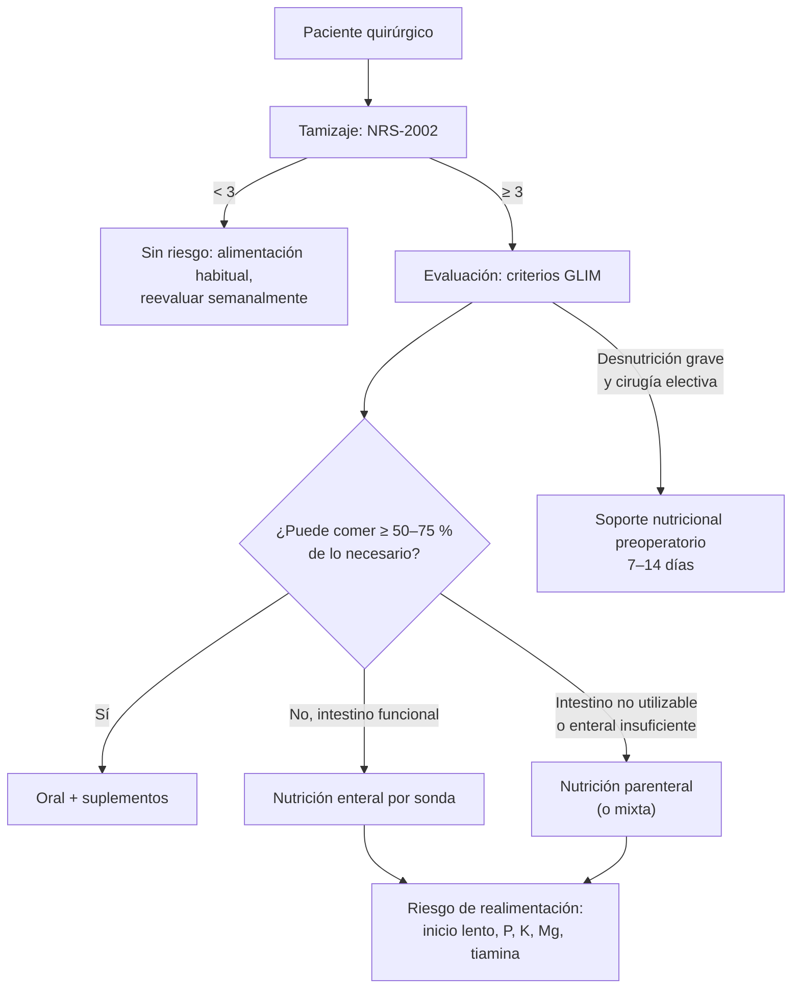

---
tags:
  - Cirugía
  - Frecuente en sala
---

# Evaluación nutricional y alimentación en cirugía y enfermedades digestivas

**Subespecialidad**
Nutrición clínica · Cirugía digestiva · Gastroenterología

**Guías principales**
Guía práctica ESPEN de nutrición clínica en cirugía (*Clin Nutr* 2021) · Criterios GLIM de desnutrición (*Clin Nutr* 2019; actualización 2025)

**Otras fuentes**
NRS-2002 (*Clin Nutr* 2003) · Ver [desnutrición y síndromes carenciales](../../endocrinologia/desnutricion-y-sindromes-carenciales.md)

**GES**
No.

**EUNACOM**
4.01.3.014 Evaluación nutricional · 4.01.3.001 Alimentación en enfermedades digestivas (conocimiento general)

**Revisado**
Octubre 2026

!!! abstract "Resumen en 60 segundos"
    - La **desnutrición** es frecuente en los pacientes quirúrgicos y aumenta las **complicaciones** (infecciones, dehiscencias, fístulas), la estadía y la mortalidad.
    - **Evaluación nutricional**: **tamizaje** (NRS-2002 ≥ 3 = riesgo) y **diagnóstico GLIM** (≥ 1 criterio **fenotípico**: baja de peso, IMC bajo o masa muscular reducida; + ≥ 1 **etiológico**: ingesta reducida o malabsorción, o inflamación).
    - La **albúmina** refleja sobre todo la **inflamación**: no sirve sola para diagnosticar la desnutrición, pero predice complicaciones.
    - **Requerimientos** habituales: **25–30 kcal/kg/día** y **proteínas 1,2–1,5 g/kg/día** (más en el estrés grave).
    - **Vía**: **oral** siempre que sea posible → **enteral** si el intestino funciona pero no come lo suficiente → **parenteral** solo si el intestino no puede usarse o la enteral no alcanza.
    - **Cirugía (ESPEN, ERAS)**: ayuno corto, **carga de carbohidratos** preoperatoria, **realimentación oral precoz** tras la cirugía (en horas, incluso tras una anastomosis colónica), **soporte nutricional preoperatorio** de 7–14 días en la desnutrición grave.
    - **Síndrome de realimentación**: hipofosfatemia, hipokalemia e hipomagnesemia al realimentar a un desnutrido → empezar lento y dar **tiamina**.
    - **Enfermedades digestivas**: pancreatitis aguda (**alimentación oral o enteral precoz**), cirrosis (**no restringir proteínas**, colación nocturna), posgastrectomía (comidas fraccionadas, evitar azúcares simples por el **dumping**, **B12** y hierro), ileostomía (líquidos con sodio), intestino corto.

## Definición

- **Evaluación nutricional**: proceso que identifica el riesgo y el estado nutricional mediante la historia, el examen, la antropometría, la composición corporal y el laboratorio.
- **Tamizaje nutricional**: herramienta breve para detectar a los pacientes **en riesgo** (NRS-2002, MUST, MNA-SF en adultos mayores).
- **Desnutrición** (GLIM): estado de déficit de energía y nutrientes que altera la composición corporal y la función; se diagnostica con al menos un criterio fenotípico y uno etiológico.
- **Nutrición enteral**: aporte de nutrientes por el tubo digestivo mediante suplementos o **sondas** (nasogástrica, nasoyeyunal, gastrostomía, yeyunostomía).
- **Nutrición parenteral**: aporte de nutrientes por vía **venosa** (periférica o central).
- **Síndrome de realimentación**: alteraciones electrolíticas y metabólicas graves al reiniciar la nutrición en un desnutrido.

## Epidemiología

### Mundial

- Una proporción importante de los pacientes hospitalizados está desnutrida o en riesgo; la prevalencia es mayor en los pacientes con **cáncer digestivo**, adultos mayores y cirugías mayores.
- La desnutrición preoperatoria es un factor de riesgo **modificable** de complicaciones.

### Chile

!!! chile "Datos nacionales"
    - En el estudio multicéntrico latinoamericano **ELAN** (que incluyó a Chile), alrededor de la mitad de los pacientes hospitalizados tenía algún grado de desnutrición (ver [desnutrición](../../endocrinologia/desnutricion-y-sindromes-carenciales.md)).
    - Al mismo tiempo, Chile tiene una alta prevalencia de **obesidad**: la desnutrición (sarcopenia) puede coexistir con un IMC alto ("obesidad sarcopénica").

## Etiología y factores de riesgo

| Mecanismo | Ejemplos en el paciente quirúrgico |
|---|---|
| **Ingesta reducida** | Disfagia, obstrucción (cáncer de esófago o gástrico), anorexia (cáncer), ayunos prolongados, náuseas |
| **Malabsorción** | Resecciones intestinales, intestino corto, insuficiencia pancreática, fístulas de alto débito, celíaca |
| **Inflamación y catabolismo** | Cirugía mayor, sepsis, trauma, quemaduras, cáncer (caquexia) |
| **Pérdidas** | Fístulas, ostomías de alto débito, diarrea, drenajes |

## Fisiopatología

- La **respuesta metabólica al estrés** quirúrgico (catecolaminas, cortisol, citoquinas) produce **resistencia a la insulina**, **catabolismo proteico** y pérdida de masa muscular; la inmovilidad la agrava.
- La desnutrición altera la **cicatrización**, la **inmunidad** y la función muscular (respiratoria) → más infecciones, dehiscencias y estadía.
- El **ayuno prolongado** aumenta la resistencia a la insulina; la **carga de carbohidratos** preoperatoria y la **alimentación precoz** la atenúan.
- **Realimentación**: al llegar los carbohidratos, la **insulina** ingresa fósforo, potasio y magnesio a las células → **hipofosfatemia** (insuficiencia respiratoria y cardíaca, arritmias), y el consumo de **tiamina** puede precipitar una encefalopatía de Wernicke.

*Figura 1. Evaluación y soporte nutricional del paciente quirúrgico. Esquema propio basado en la guía ESPEN de nutrición en cirugía (2021) y los criterios GLIM.*

## Clasificación

**Criterios GLIM** (diagnóstico de desnutrición):

| Fenotípicos (≥ 1) | Etiológicos (≥ 1) |
|---|---|
| **Baja de peso** involuntaria > 5 % en 6 meses o > 10 % en más de 6 meses | **Ingesta reducida** (≤ 50 % de lo necesario por > 1 semana, o cualquier reducción por > 2 semanas) o **malabsorción** |
| **IMC bajo**: < 20 (< 70 años) o < 22 (≥ 70 años) | **Inflamación**: enfermedad aguda o crónica |
| **Masa muscular reducida** | |

**Desnutrición grave (alto riesgo quirúrgico, ESPEN)**: baja de peso > 10–15 % en 6 meses, IMC < 18,5, puntaje NRS-2002 de alto riesgo o albúmina < 3 g/dL sin disfunción hepática ni renal.

**Vías de soporte nutricional**:

| Vía | Indicación | Complicaciones |
|---|---|---|
| **Oral con suplementos** | Puede comer pero no lo suficiente | Baja adherencia |
| **Enteral por sonda** (nasogástrica, nasoyeyunal, gastrostomía, yeyunostomía) | Intestino **funcional**, ingesta insuficiente, disfagia | Aspiración, diarrea, desplazamiento de la sonda, sinusitis |
| **Parenteral** | **Intestino no utilizable** (obstrucción, íleo prolongado, fístula de alto débito, intestino corto) o enteral insuficiente | **Infección del catéter**, trombosis, hiperglicemia, alteraciones hepáticas, realimentación |

## Clínica

- **Anamnesis**: **baja de peso** (cuánto y en cuánto tiempo), cambios en la ingesta, síntomas digestivos (disfagia, vómitos, diarrea), capacidad funcional, enfermedades y fármacos.
- **Examen**: IMC, pérdida de grasa subcutánea y **masa muscular** (sienes, hombros, cuádriceps), **edema** (puede enmascarar la baja de peso), signos de déficit de micronutrientes (queilitis, glositis, dermatitis, neuropatía).
- **Función**: **fuerza de prensión** (dinamometría), velocidad de la marcha.
- **Síndrome de realimentación**: debilidad, arritmias, insuficiencia cardíaca o respiratoria, confusión, edema, en los primeros días de la realimentación.

## Diagnóstico

!!! guia "Puntos clave (ESPEN 2021, GLIM)"
    - **Tamizaje** a todo paciente que se hospitaliza o se va a operar (**NRS-2002**; ≥ 3 = riesgo).
    - **Diagnóstico** con **GLIM** y **gravedad**.
    - **Pacientes con desnutrición grave** que van a una cirugía mayor: **soporte nutricional por 7–14 días** antes de la cirugía (aun si hay que diferirla).
    - **Evitar el ayuno prolongado**: líquidos claros hasta 2 h antes; **carga de carbohidratos** oral la noche anterior y 2 h antes de la cirugía (salvo contraindicaciones).
    - **Realimentación oral precoz** tras la cirugía, en general en las primeras horas, incluso tras las anastomosis colorrectales.
    - **Nutrición enteral** precoz (dentro de las 24 h) en quienes no podrán comer en forma adecuada (cirugía mayor de cabeza y cuello, esófago, estómago o páncreas, trauma grave, desnutrición).
    - **Nutrición parenteral** cuando no se cubre más del 50 % de los requerimientos por vía enteral en 7 días (antes, si el paciente está desnutrido).

## Laboratorio

| Examen | Uso |
|---|---|
| **Albúmina** | Pronóstica (más complicaciones si es baja), pero refleja sobre todo la **inflamación**; vida media ~ 20 días |
| **Prealbúmina (transtiretina)** | Vida media corta (~ 2 días); también baja con la inflamación |
| **PCR** | Interpretar las proteínas viscerales en el contexto de la inflamación |
| **Recuento de linfocitos** | Inmunocompetencia (inespecífico) |
| **Fósforo, potasio, magnesio** | **Realimentación** (medir al inicio y diariamente los primeros días) |
| **Glicemia, triglicéridos, pruebas hepáticas** | Control de la nutrición parenteral |
| **Vitaminas y oligoelementos** (B12, folato, vitamina D, hierro, zinc) | Según el contexto (gastrectomía, resecciones intestinales, bariátrica) |

## Imágenes

| Examen | Uso |
|---|---|
| **TC** (área muscular a nivel de L3) | Masa muscular (sarcopenia) en pacientes con TC disponible |
| **Bioimpedancia**, DEXA | Composición corporal |
| **Radiografía** | Posición de la sonda enteral (antes de iniciar la alimentación) |

## Diagnóstico diferencial

| Hallazgo | Considerar |
|---|---|
| **Albúmina baja** | **Inflamación** aguda, **síndrome nefrótico**, **cirrosis**, enteropatía perdedora de proteínas, sobrehidratación, desnutrición |
| **Baja de peso** | Cáncer, diabetes descompensada, hipertiroidismo, malabsorción, depresión, ingesta insuficiente |
| **Diarrea en la nutrición enteral** | **Fármacos** (antibióticos, procinéticos, jarabes con sorbitol), ***C. difficile***, hipoalbuminemia, velocidad de infusión |

## Tratamiento

!!! dosis "Requerimientos y metas habituales"
    | Componente | Meta |
    |---|---|
    | **Energía** | **25–30 kcal/kg/día** (peso real o ajustado en los obesos); calorimetría indirecta si está disponible |
    | **Proteínas** | **1,2–1,5 g/kg/día** (hasta 2 g/kg en el estrés grave, quemados, fístulas) |
    | **Líquidos** | ~ 30–35 mL/kg/día más las pérdidas |
    | **Micronutrientes** | Vitaminas y oligoelementos; **tiamina** antes de realimentar a los desnutridos |
    | **Realimentación en alto riesgo** | Empezar con **~ 10–15 kcal/kg/día** y avanzar en 4–7 días, controlando y reponiendo **P, K y Mg** |

### Alimentación en enfermedades digestivas (conceptos)

| Condición | Recomendaciones |
|---|---|
| **Pancreatitis aguda** | **Alimentación oral precoz** cuando tolere (dieta blanda baja en grasa); si no, **enteral** (nasogástrica o nasoyeyunal) en lugar de parenteral (ver [pancreatitis](../../gastroenterologia/pancreatitis-aguda.md)) |
| **Pancreatitis crónica** | Comidas fraccionadas, **enzimas pancreáticas** con las comidas, vitaminas liposolubles, sin alcohol |
| **Cirrosis** | **No restringir las proteínas** (1,2–1,5 g/kg); **colación nocturna** rica en carbohidratos; restricción de **sodio** si hay ascitis (ver [cirrosis](../../gastroenterologia/cirrosis-y-complicaciones.md)) |
| **Enfermedad inflamatoria intestinal** | Dieta habitual en remisión; **dieta baja en residuos** si hay estenosis; nutrición enteral exclusiva en el Crohn pediátrico |
| **Enfermedad celíaca** | **Dieta sin gluten** estricta y de por vida |
| **Diverticulosis** | Dieta **rica en fibra**; las semillas y frutos secos no están prohibidos |
| **Posgastrectomía** | **Comidas pequeñas y frecuentes**, separar líquidos de sólidos, evitar **azúcares simples** (síndrome de **dumping**), suplementar **B12**, **hierro**, calcio y vitamina D |
| **Ileostomía** | Asegurar **líquidos con sodio** (soluciones de rehidratación), evitar el exceso de agua sola y de alimentos muy fibrosos al inicio (obstrucción del estoma) |
| **Intestino corto** | Fraccionar, soluciones orales con sodio, reducir azúcares simples; suplementos; nutrición parenteral domiciliaria si hay falla intestinal |
| **Fístula enterocutánea** | Enteral si es distal y de bajo débito; parenteral si es proximal o de alto débito (ver [fístulas del intestino delgado](../intestino-colon-y-proctologia/diverticulo-de-meckel-tumores-y-fistulas-del-intestino-delgado.md)) |
| **Constipación** | Fibra, líquidos, actividad física |
| **ERGE** | Bajar de peso, evitar comidas abundantes y nocturnas |

!!! alarma "Riesgos que vigilar"
    - **Síndrome de realimentación** en desnutridos graves, alcohólicos, ayunos prolongados: medir **P, K, Mg**, dar **tiamina**, avanzar lento.
    - **Fiebre en un paciente con nutrición parenteral**: infección del **catéter** (hemocultivos).
    - **Tos, desaturación o vómitos** con nutrición enteral: **aspiración** (cabecera a 30–45°).

## Complicaciones

- **Desnutrición**: infecciones, dehiscencias, fístulas, úlceras por presión, debilidad, ventilación prolongada, mortalidad.
- **Nutrición enteral**: aspiración, diarrea, desplazamiento de la sonda, síndrome de realimentación.
- **Nutrición parenteral**: **infección del catéter**, trombosis, hiperglicemia, alteraciones hepáticas (esteatosis, colestasia), realimentación.
- **Posgastrectomía**: **dumping**, anemia (déficit de hierro y B12), osteoporosis.

## Pronóstico y seguimiento

- El soporte nutricional adecuado en los pacientes desnutridos **reduce las complicaciones** posoperatorias.
- Los protocolos **ERAS** (ayuno corto, carga de carbohidratos, realimentación precoz) aceleran la recuperación.
- Seguimiento del peso, la ingesta y los micronutrientes tras las cirugías digestivas mayores.

## Perlas para el internado

!!! perla "Para recordar en la sala"
    - **Tamizar a todos** (NRS-2002) y diagnosticar con **GLIM**.
    - **Albúmina baja ≠ desnutrición**: refleja la inflamación (pero predice complicaciones).
    - **"Si el intestino funciona, úsalo"**: oral > enteral > parenteral.
    - **Calorías 25–30 kcal/kg; proteínas 1,2–1,5 g/kg.**
    - **No dejar a un paciente en ayuno días** sin plan nutricional.
    - **Realimentación**: fósforo, potasio, magnesio y **tiamina**.
    - **Pancreatitis: alimentación precoz**, no ayuno prolongado.
    - **Cirrosis: no restringir proteínas**; colación nocturna.
    - **Gastrectomía: B12 de por vida** y comidas fraccionadas (dumping).
    - **Desnutrición grave antes de una cirugía electiva mayor: 7–14 días de soporte nutricional.**

## Preguntas de repaso

??? repaso "1. Hombre de 65 años con un cáncer gástrico que bajó 12 % de su peso en 4 meses y come la mitad de lo habitual. ¿Qué diagnóstico nutricional tiene y qué indica antes de la gastrectomía?"
    - **Desnutrición grave** (GLIM: baja de peso > 10 % + ingesta reducida y enfermedad).
    - **Soporte nutricional preoperatorio por 7–14 días** (oral con suplementos o enteral por sonda), aunque se difiera la cirugía.

??? repaso "2. Paciente alcohólico, muy desnutrido, que inicia nutrición enteral completa. Al tercer día tiene debilidad, arritmias y fósforo de 0,9 mg/dL. ¿Qué pasó y cómo se previene?"
    - **Síndrome de realimentación** (hipofosfatemia).
    - Reducir el aporte, **reponer fósforo, potasio y magnesio**, **tiamina**; prevención: iniciar con **10–15 kcal/kg/día**, avanzar lento y controlar los electrolitos.

??? repaso "3. Paciente con una pancreatitis aguda grave que no tolera la vía oral al tercer día. ¿Qué vía de nutrición prefiere?"
    - **Nutrición enteral** (nasogástrica o nasoyeyunal), mejor que la **parenteral** (menos infecciones).

??? repaso "4. Paciente cirrótico con encefalopatía hepática leve. ¿Debe restringir las proteínas?"
    - **No**: mantener **1,2–1,5 g/kg/día** de proteínas; agregar una **colación nocturna**; tratar la encefalopatía con lactulosa (y rifaximina).

??? repaso "5. Paciente gastrectomizado que 20 minutos después de comer presenta sudoración, palpitaciones, distensión y diarrea. ¿Qué tiene y qué le recomienda?"
    - **Síndrome de dumping precoz**.
    - **Comidas pequeñas y frecuentes**, separar los líquidos de los sólidos, **evitar azúcares simples**, preferir proteínas y fibra; suplementar B12 y hierro.

## Referencias

1. Weimann A, Braga M, Carli F, et al. ESPEN practical guideline: Clinical nutrition in surgery. *Clin Nutr.* 2021;40(7):4745–4761. doi:[10.1016/j.clnu.2021.03.031](https://doi.org/10.1016/j.clnu.2021.03.031)
2. Cederholm T, Jensen GL, Correia MITD, et al. GLIM criteria for the diagnosis of malnutrition – A consensus report from the global clinical nutrition community. *Clin Nutr.* 2019;38(1):1–9. doi:[10.1016/j.clnu.2018.08.002](https://doi.org/10.1016/j.clnu.2018.08.002)
3. Kondrup J, Rasmussen HH, Hamberg O, Stanga Z. Nutritional risk screening (NRS 2002): a new method based on an analysis of controlled clinical trials. *Clin Nutr.* 2003;22(3):321–336. doi:[10.1016/s0261-5614(02)00214-5](https://doi.org/10.1016/s0261-5614(02)00214-5)
4. Correia MI, Campos AC; ELAN Cooperative Study. Prevalence of hospital malnutrition in Latin America: the multicenter ELAN study. *Nutrition.* 2003;19(10):823–825. doi:[10.1016/s0899-9007(03)00168-0](https://doi.org/10.1016/s0899-9007(03)00168-0)
