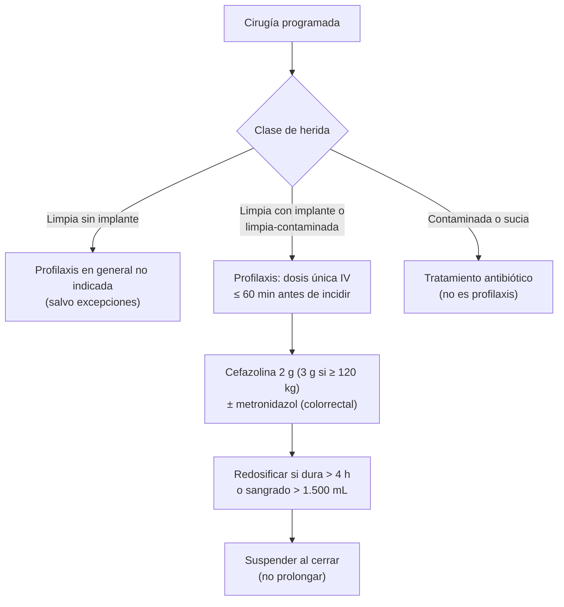

---
tags:
  - Cirugía
  - Frecuente en sala
---

# Infección quirúrgica e intrahospitalaria, asepsia y antisepsia, y profilaxis antibiótica

**Subespecialidad**
Cirugía general · Infectología · Control de infecciones

**Guías principales**
Recomendaciones de la OMS para la prevención de la infección del sitio quirúrgico (*Lancet Infect Dis* 2016) · Guía de los CDC de prevención de la infección del sitio quirúrgico (*JAMA Surg* 2017) · Guía ASHP/IDSA/SIS/SHEA de profilaxis antimicrobiana en cirugía (2013)

**Otras fuentes**
Ver [neumonía nosocomial e infección asociada a catéter](../../infectologia/neumonia-nosocomial-inmunosuprimidos-y-cateter.md), [ITU](../../nefrologia/infeccion-urinaria.md) y [*C. difficile*](../../gastroenterologia/diarrea-aguda-y-clostridioides-difficile.md)

**GES**
No.

**EUNACOM**
4.01.3.016 Infección quirúrgica e intrahospitalaria · 4.01.3.003 Asepsia y antisepsia · 4.01.3.002 Antimicrobianos: conceptos de profilaxis y esquemas terapéuticos (conocimiento general)

**Revisado**
Octubre 2026

!!! abstract "Resumen en 60 segundos"
    - **Infección del sitio quirúrgico (ISQ)**: hasta **30 días** tras la cirugía (90 días con implantes); **incisional superficial**, **incisional profunda** o de **órgano/espacio**.
    - **Clasificación de las heridas**: **limpia** (no entra a tubo digestivo, respiratorio ni urinario), **limpia-contaminada** (entra en forma controlada), **contaminada** (derrame importante, inflamación aguda, trauma reciente), **sucia** (pus, perforación, trauma antiguo). El riesgo de ISQ aumenta en ese orden.
    - **Profilaxis antibiótica**: dosis **única IV** en los **60 minutos previos a la incisión**; **cefazolina 2 g** (3 g si pesa ≥ 120 kg) en la mayoría; **+ metronidazol** si hay anaerobios (colorrectal, apendicitis). **Redosificar** en cirugías largas (cefazolina cada **4 h**) o con sangrado > 1.500 mL. **No prolongar** después de cerrar la herida (en general).
    - En las heridas **contaminadas o sucias** los antibióticos son **tratamiento**, no profilaxis.
    - **Asepsia**: ausencia de microorganismos (material estéril, técnica estéril). **Antisepsia**: reducción de la flora en **tejidos vivos** (**clorhexidina alcohólica** para la piel del paciente; **povidona yodada**). **Desinfección**: sobre superficies inertes. **Esterilización**: eliminación de toda forma de vida, incluidas las **esporas** (autoclave).
    - **Prevención de la ISQ** (OMS/CDC): baño preoperatorio, **no rasurar** (cortar el vello con máquina si es necesario), preparación de la piel con **clorhexidina alcohólica**, lavado quirúrgico de manos, **normotermia**, control de la **glicemia**, oxigenación adecuada.
    - **Infecciones asociadas a la atención de salud (IAAS)**: neumonía (asociada a ventilación), **ITU** asociada a sonda, **bacteriemia** asociada a catéter, ISQ y ***C. difficile***. La medida más eficaz: **higiene de manos**.

## Definición

- **Infección asociada a la atención de salud (IAAS)** o intrahospitalaria: infección que no estaba presente ni incubándose al ingreso y que aparece durante la atención (habitualmente > 48 h tras el ingreso) o tras el alta relacionada con ella.
- **Infección del sitio quirúrgico (ISQ)**: infección relacionada con el procedimiento quirúrgico que ocurre en los **30 días** siguientes (o **90 días** si se implantó material protésico).
    - **Incisional superficial**: piel y tejido subcutáneo.
    - **Incisional profunda**: fascia y músculo.
    - **Órgano/espacio**: cualquier parte de la anatomía abierta o manipulada (absceso intraabdominal, empiema, mediastinitis).
- **Asepsia**: conjunto de procedimientos para **impedir la llegada** de microorganismos a un medio (material, campo y técnica **estériles**).
- **Antisepsia**: destrucción o inhibición de microorganismos en **tejidos vivos** con **antisépticos**.
- **Desinfección**: eliminación de microorganismos (no necesariamente esporas) en **objetos inanimados**.
- **Esterilización**: eliminación de **toda** forma de vida microbiana, incluidas las **esporas**.
- **Profilaxis antibiótica**: antibiótico administrado **antes** de la contaminación para **prevenir** una infección en una cirugía que no la tiene.

## Epidemiología

### Mundial

- Las IAAS afectan a una proporción importante de los pacientes hospitalizados y aumentan la mortalidad, la estadía y los costos; la **ISQ** es una de las más frecuentes en los pacientes quirúrgicos.
- La **resistencia antimicrobiana** (SARM, enterobacterias productoras de BLEE y carbapenemasas) complica el tratamiento de las IAAS.
- Una parte importante de las IAAS es **prevenible** con medidas basadas en la evidencia.

### Chile

!!! chile "Datos nacionales"
    - Chile tiene un **programa nacional de prevención y control de IAAS** del MINSAL, con **vigilancia epidemiológica** en los hospitales de infecciones como la ISQ en cirugías trazadoras, ITU asociada a sonda, neumonía asociada a ventilación, bacteriemia asociada a catéter, y la diarrea por *C. difficile*.
    - Los hospitales cuentan con **comités de IAAS** y protocolos de higiene de manos, profilaxis antibiótica y uso de dispositivos.

## Etiología y factores de riesgo

**Microorganismos de la ISQ**:

| Cirugía | Microorganismos habituales |
|---|---|
| **Limpia** (piel) | ***S. aureus***, estafilococos coagulasa negativos, estreptococos |
| **Gastrointestinal** | **Enterobacterias** (*E. coli*), **anaerobios** (*B. fragilis*), enterococos |
| **Ginecológica y urológica** | Enterobacterias, anaerobios, estreptococo del grupo B |

**Factores de riesgo de ISQ**:

| Paciente | Procedimiento |
|---|---|
| **Diabetes** e **hiperglicemia** perioperatoria, **obesidad**, **tabaco**, desnutrición, inmunosupresión, corticoides, colonización por *S. aureus*, infección en otro sitio, edad avanzada, ASA ≥ 3 | Clase de herida (**contaminada**, **sucia**), **duración prolongada**, **rasurado** con navaja, profilaxis inadecuada (momento o dosis), **hipotermia**, hipoxia, transfusión, drenajes, hematoma, técnica quirúrgica, número de personas en el pabellón |

## Fisiopatología

- La ISQ ocurre cuando la **carga bacteriana** que contamina la herida (sobre todo **endógena**, de la piel o la víscera abierta del propio paciente) supera las **defensas** locales y sistémicas.
- El antibiótico profiláctico debe estar en **concentraciones tisulares adecuadas en el momento de la incisión** y mientras la herida está abierta: por eso se da **antes de incidir** y se **redosifica** en cirugías largas. Darlo después de la contaminación o prolongarlo días no reduce la ISQ y aumenta la **resistencia** y el riesgo de ***C. difficile***.

*Figura 1. Profilaxis antibiótica según la clase de herida. Esquema propio basado en las guías de la OMS (2016), los CDC (2017) y ASHP/IDSA/SIS/SHEA (2013).*

## Clasificación

**Clasificación de las heridas quirúrgicas**:

| Clase | Descripción | Ejemplos | Antibiótico |
|---|---|---|---|
| **I. Limpia** | No inflamada; **no** se entra a los tractos respiratorio, digestivo, genital ni urinario | Hernioplastía, tiroidectomía, mastectomía | Profilaxis solo si hay **implantes** (malla, prótesis) o el riesgo es alto |
| **II. Limpia-contaminada** | Se entra a esos tractos en forma **controlada** y sin contaminación inusual | Colecistectomía, colectomía electiva preparada, histerectomía, cesárea | **Profilaxis** |
| **III. Contaminada** | Herida traumática **reciente**, derrame importante del tubo digestivo, inflamación aguda **no purulenta**, falla de la técnica aséptica | Apendicitis aguda no complicada, trauma abierto reciente | Profilaxis o tratamiento corto según el caso |
| **IV. Sucia** | **Pus**, víscera **perforada**, herida traumática **antigua** con tejido desvitalizado | Peritonitis, absceso, perforación | **Tratamiento** antibiótico |

**Niveles de procesamiento del material (Spaulding)**:

| Material | Uso | Requiere |
|---|---|---|
| **Crítico** | Entra en tejidos estériles o el torrente vascular (instrumental quirúrgico, catéteres) | **Esterilización** |
| **Semicrítico** | Contacto con mucosas o piel no intacta (endoscopios, laringoscopios) | **Desinfección de alto nivel** |
| **No crítico** | Contacto con piel intacta (manguitos de presión, estetoscopios) | Desinfección de **bajo nivel** o limpieza |

## Clínica

- **ISQ superficial**: eritema, calor, dolor, induración y **secreción purulenta** por la herida, habitualmente al **día 5–7**; fiebre.
- **ISQ profunda u órgano/espacio**: fiebre, dolor, íleo, **colección** (absceso intraabdominal, filtración anastomótica), deterioro clínico.
- **ISQ precoz grave** (< 48 h): dolor desproporcionado, edema, crepitación, bulas: **infección necrotizante** (estreptococo del grupo A, *Clostridium*) → urgencia quirúrgica.
- **Otras IAAS**: neumonía (fiebre, secreciones, infiltrado), ITU asociada a sonda, bacteriemia asociada a catéter (fiebre sin foco, flebitis), diarrea por *C. difficile*.

## Diagnóstico

!!! guia "Puntos clave (OMS 2016, CDC 2017)"
    - El diagnóstico de la ISQ superficial es **clínico**; **abrir la herida** y obtener **cultivo** del pus.
    - **ISQ profunda u órgano/espacio**: **TC** o ecografía (colecciones).
    - **Fiebre en el posoperatorio**: buscar la causa según el tiempo (ver [pre y posoperatorio](preoperatorio-posoperatorio-y-complicaciones.md)).
    - **Medidas preventivas recomendadas**:
        - **Baño** preoperatorio con jabón (simple o antimicrobiano).
        - **No rasurar**; si es necesario retirar el vello, usar **máquina cortadora** (*clipper*).
        - **Profilaxis antibiótica** en los **120 minutos** previos a la incisión (OMS; en la práctica, **≤ 60 min** para la cefazolina), sin prolongarla en el posoperatorio.
        - Preparación de la piel con **clorhexidina en solución alcohólica**.
        - **Lavado quirúrgico de manos** con jabón antimicrobiano o solución alcohólica.
        - **Normotermia**, control de la **glicemia** (< 180–200 mg/dL), oxigenación adecuada.
        - Descolonización nasal con **mupirocina** en portadores de *S. aureus* en cirugía cardíaca y ortopédica.
        - **Profilaxis antibiótica oral + preparación mecánica** en la cirugía colorrectal electiva.

## Laboratorio

| Examen | Uso |
|---|---|
| **Cultivo y antibiograma** del pus o la colección | Ajustar el tratamiento |
| **Hemograma, PCR** | Respuesta inflamatoria |
| **Hemocultivos** | Sepsis, bacteriemia asociada a catéter |
| **Glicemia** | Control perioperatorio |
| **Toxina o PCR de *C. difficile*** | Diarrea en un paciente con antibióticos |

## Imágenes

| Examen | Uso |
|---|---|
| **Ecografía** | Colecciones superficiales |
| **TC con contraste** | Abscesos profundos, filtración anastomótica |

## Diagnóstico diferencial

| Hallazgo | Diferenciales |
|---|---|
| **Eritema de la herida** | Infección, **reacción inflamatoria** a la sutura, dermatitis por adhesivos o antisépticos, hematoma |
| **Secreción por la herida** | **Seroma**, hematoma, **ISQ**, **dehiscencia** (líquido serohemático abundante), fístula |
| **Fiebre posoperatoria** | Respuesta inflamatoria, neumonía, ITU, flebitis, ISQ, filtración, TEV, fármacos |

## Tratamiento

!!! dosis "Profilaxis antibiótica habitual (ASHP/IDSA/SIS/SHEA 2013)"
    | Cirugía | Profilaxis | Alergia a betalactámicos |
    |---|---|---|
    | **Limpia con implante** (hernia con malla, ortopedia, cardíaca, vascular), **mama**, **biliar**, **gastroduodenal** | **Cefazolina 2 g IV** (3 g si ≥ 120 kg) | **Clindamicina 900 mg IV** o **vancomicina 15 mg/kg IV** |
    | **Colorrectal**, **apendicectomía**, cirugía con anaerobios | **Cefazolina + metronidazol 500 mg IV** (o cefoxitina) | Clindamicina + aminoglucósido o fluoroquinolona; o metronidazol + aminoglucósido o fluoroquinolona |
    | **Cesárea** | **Cefazolina 2 g IV** antes de la incisión | Clindamicina + gentamicina |
    | **Portador conocido de SARM** | Agregar **vancomicina** | |

    - **Momento**: en los **60 minutos** previos a la incisión (**vancomicina y fluoroquinolonas**: iniciar 60–120 minutos antes).
    - **Redosificar**: cefazolina cada **4 horas** de cirugía, o si el sangrado es **> 1.500 mL**.
    - **Duración**: **dosis única** o **< 24 h**; no prolongar por la presencia de drenajes o catéteres.

- **Tratamiento de la ISQ**:
    - **Superficial**: **abrir la herida**, drenar, curaciones; antibiótico solo si hay **celulitis** extensa o compromiso sistémico.
    - **Profunda u órgano/espacio**: **drenaje** (percutáneo o quirúrgico) y **antibióticos** según la flora y el cultivo.
    - **Infección necrotizante**: **desbridamiento quirúrgico urgente** y antibióticos de amplio espectro (ver [infecciones de piel](../../infectologia/infecciones-piel-partes-blandas.md)).
- **Esquemas terapéuticos (concepto)**: el antibiótico **empírico** se elige según el foco, la flora probable, la gravedad, la epidemiología local y los factores de riesgo de resistencia; luego se **ajusta** al cultivo (**desescalar**) y se usa por el **menor tiempo** eficaz (por ejemplo, ~ **4 días** tras el control adecuado del foco en la infección intraabdominal complicada).

### Prevención de las IAAS

- **Higiene de manos** (los **5 momentos** de la OMS): la medida **más eficaz**.
- **Precauciones estándar** y de **aislamiento** (contacto, gotitas, aéreo) según el agente.
- **Paquetes de medidas** (*bundles*): catéter venoso central (inserción con barreras máximas, clorhexidina, retiro precoz), sonda urinaria (indicación justificada, sistema cerrado, **retiro precoz**), ventilación mecánica (cabecera elevada, interrupción diaria de la sedación).
- **Uso racional de antibióticos** (programas de optimización).

!!! alarma "Avisar al cirujano"
    - **Dolor desproporcionado**, crepitación o bulas en la herida en las primeras 48 h (infección necrotizante).
    - **Fiebre** con dolor abdominal o deterioro en el posoperatorio de una cirugía digestiva.
    - Herida con **pus** o **dehiscencia**.

## Complicaciones

- **Dehiscencia**, **evisceración**, **hernia incisional**.
- **Sepsis**, falla multiorgánica.
- **Infección de prótesis o mallas** (puede requerir retirarlas).
- **Resistencia antimicrobiana** y **colitis por *C. difficile*** por el uso inadecuado de antibióticos.
- Mayor estadía, costos y mortalidad.

## Pronóstico y seguimiento

- La mayoría de las ISQ superficiales se resuelven con el drenaje y las curaciones.
- Las infecciones de **órgano/espacio** y de **implantes** tienen mayor morbimortalidad.
- La **vigilancia** y la retroalimentación de las tasas de IAAS a los equipos reducen las infecciones.

## Perlas para el internado

!!! perla "Para recordar en la sala"
    - **Profilaxis = antes de incidir (≤ 60 min), dosis única, cefazolina 2 g.** Redosificar a las 4 h.
    - **Colorrectal o apendicitis: + metronidazol.**
    - **Herida sucia = tratamiento, no profilaxis.**
    - **No prolongar la profilaxis** por tener drenajes.
    - **No rasurar**: si hay que retirar el vello, cortadora.
    - **Clorhexidina alcohólica** para la piel del paciente.
    - **Esterilización elimina esporas; desinfección no.**
    - **Higiene de manos = la medida más eficaz contra las IAAS.**
    - **ISQ superficial: abrir y drenar.** El antibiótico no reemplaza el drenaje.
    - **Retirar sondas y catéteres lo antes posible.**

## Preguntas de repaso

??? repaso "1. Mujer de 45 años programada para una colecistectomía laparoscópica electiva. ¿Qué profilaxis antibiótica indica y cuándo?"
    - Cirugía **limpia-contaminada**: **cefazolina 2 g IV** en los **60 minutos** previos a la incisión, en **dosis única** (redosificar si dura más de 4 h).

??? repaso "2. Hombre de 130 kg operado de una hemicolectomía derecha electiva que dura 5 horas. ¿Cómo hace la profilaxis?"
    - **Cefazolina 3 g IV** (≥ 120 kg) **+ metronidazol 500 mg IV** antes de la incisión, **redosificando la cefazolina a las 4 horas**; no prolongar tras el cierre.

??? repaso "3. Paciente al sexto día de una laparotomía con eritema, dolor y salida de pus por la herida, sin compromiso sistémico. ¿Conducta?"
    - **ISQ incisional superficial**.
    - **Abrir la herida**, drenar, **cultivo** y curaciones; antibiótico solo si hay celulitis extensa o compromiso sistémico.

??? repaso "4. ¿Qué diferencia hay entre antisepsia, desinfección y esterilización?"
    - **Antisepsia**: reduce los microorganismos en **tejidos vivos** (clorhexidina, povidona).
    - **Desinfección**: elimina microorganismos de **objetos inanimados**, pero no necesariamente las esporas.
    - **Esterilización**: elimina **todas** las formas de vida, incluidas las **esporas** (autoclave).

??? repaso "5. Un paciente operado de una peritonitis por apendicitis perforada está recibiendo ceftriaxona y metronidazol. ¿Es profilaxis?"
    - **No**: es una cirugía **sucia** (perforación con pus): los antibióticos son **tratamiento**; se mantienen por un tiempo corto (~ 4 días) tras el control adecuado del foco y se ajustan al cultivo.

## Referencias

1. Allegranzi B, Bischoff P, de Jonge S, et al. New WHO recommendations on preoperative measures for surgical site infection prevention: an evidence-based global perspective. *Lancet Infect Dis.* 2016;16(12):e276–e287. doi:[10.1016/S1473-3099(16)30398-X](https://doi.org/10.1016/S1473-3099(16)30398-X)
2. Allegranzi B, Zayed B, Bischoff P, et al. New WHO recommendations on intraoperative and postoperative measures for surgical site infection prevention: an evidence-based global perspective. *Lancet Infect Dis.* 2016;16(12):e288–e303. doi:[10.1016/S1473-3099(16)30402-9](https://doi.org/10.1016/S1473-3099(16)30402-9)
3. Berríos-Torres SI, Umscheid CA, Bratzler DW, et al. Centers for Disease Control and Prevention Guideline for the Prevention of Surgical Site Infection, 2017. *JAMA Surg.* 2017;152(8):784–791. doi:[10.1001/jamasurg.2017.0904](https://doi.org/10.1001/jamasurg.2017.0904)
4. Bratzler DW, Dellinger EP, Olsen KM, et al. Clinical practice guidelines for antimicrobial prophylaxis in surgery. *Am J Health Syst Pharm.* 2013;70(3):195–283. doi:[10.2146/ajhp120568](https://doi.org/10.2146/ajhp120568)
