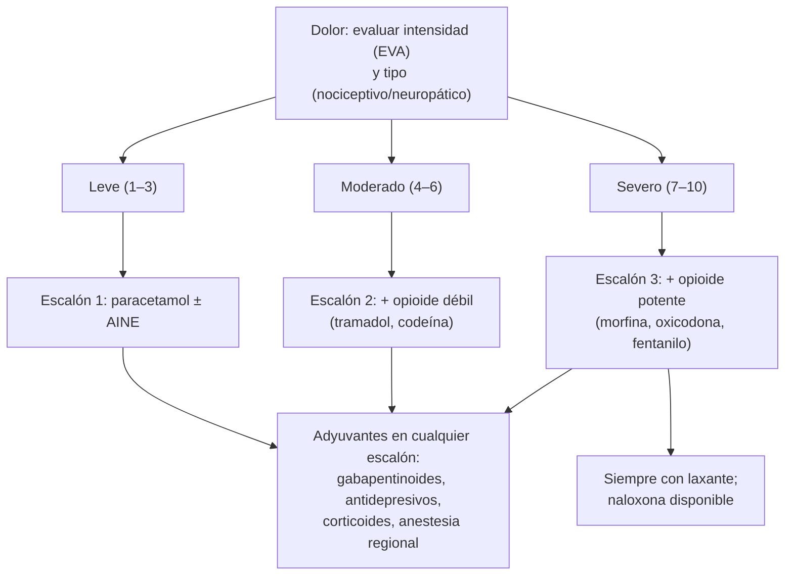

---
tags:
  - Cirugía
  - Frecuente en sala
---

# Manejo del dolor (agudo, posoperatorio y oncológico)

**Subespecialidad**
Anestesiología · Medicina del dolor · Cuidados paliativos

**Guías principales**
Guía APS/ASRA/ASA de manejo del dolor posoperatorio (*J Pain* 2016) · Guía de los CDC de prescripción de opioides (*MMWR* 2022)

**Otras fuentes**
GES **alivio del dolor y cuidados paliativos por cáncer** (N.° 4) · Ver [anestesia](anestesia-y-anestesicos-locales.md)

**GES**
Sí: **alivio del dolor y cuidados paliativos por cáncer** (N.° 4), en personas de cualquier edad con diagnóstico confirmado de cáncer.

**EUNACOM**
4.01.3.017 Manejo del dolor (conocimiento general)

**Revisado**
Octubre 2026

!!! abstract "Resumen en 60 segundos"
    - **Evaluar** el dolor como un signo vital: **escala numérica (EVA 0–10)**, características (nociceptivo somático, visceral o **neuropático**), impacto funcional.
    - **Analgesia multimodal**: combinar fármacos y técnicas con distintos mecanismos (**paracetamol + AINE** ± opioide ± **anestesia regional**) para mejorar la analgesia y **reducir los opioides**.
    - **Escalera analgésica de la OMS** (dolor oncológico): **1)** no opioides (paracetamol, AINE); **2)** opioides débiles (**tramadol**, codeína); **3)** opioides potentes (**morfina**, oxicodona, metadona, fentanilo); con **adyuvantes** en cualquier escalón.
    - **Dolor neuropático**: **gabapentinoides** (pregabalina, gabapentina), **antidepresivos** (amitriptilina, duloxetina).
    - **Opioides**: indicar **laxante** siempre, antiemético según la necesidad; vigilar la **sedación** y la **depresión respiratoria** (**naloxona**). Usar la menor dosis eficaz por el menor tiempo en el dolor agudo.
    - **AINE**: cuidado con la **ERC**, la **úlcera péptica**, la **insuficiencia cardíaca**, los anticoagulantes y los adultos mayores.
    - **Paracetamol**: máximo **4 g/día** (menos en hepatopatía, alcoholismo o desnutrición).
    - **Dolor por cáncer**: GES N.° 4; horario fijo ("**por reloj**"), por **vía oral** cuando sea posible, con dosis de **rescate**.

## Definición

- **Dolor**: experiencia sensorial y emocional desagradable asociada, o parecida a la asociada, a un daño tisular real o potencial (IASP 2020).
- **Dolor agudo**: de comienzo reciente y duración limitada, relacionado con una lesión (posoperatorio, trauma).
- **Dolor crónico**: persiste más de **3 meses**.
- **Dolor nociceptivo**: por activación de nociceptores; **somático** (bien localizado: piel, hueso, músculo) o **visceral** (difuso, referido, cólico).
- **Dolor neuropático**: por lesión o enfermedad del sistema nervioso somatosensitivo (urente, punzante, eléctrico, con **alodinia** o hiperalgesia).
- **Analgesia multimodal**: uso combinado de analgésicos y técnicas con diferentes mecanismos de acción.
- **Dolor irruptivo**: exacerbación transitoria sobre un dolor de base controlado.

## Epidemiología

### Mundial

- El **dolor posoperatorio** moderado a intenso es frecuente y, mal controlado, aumenta las complicaciones (pulmonares, TEV, delirium) y el riesgo de **dolor crónico posquirúrgico**.
- El **dolor oncológico** afecta a una gran proporción de los pacientes con cáncer avanzado.
- El uso inadecuado de **opioides** tras la cirugía contribuye al **uso prolongado** y la dependencia.

### Chile

!!! chile "Datos nacionales"
    - **GES N.° 4: alivio del dolor y cuidados paliativos por cáncer**, para personas de **cualquier edad** con **diagnóstico confirmado de cáncer**, independiente de su estado clínico; incluye la atención por un **equipo multiprofesional** para mejorar la calidad de vida del paciente y su familia.
    - Chile tiene además una **ley de cuidados paliativos universales** para enfermedades terminales o graves (Ley 21.375, 2021).

## Etiología y factores de riesgo

| Tipo de dolor | Ejemplos |
|---|---|
| **Somático** | Herida operatoria, fracturas, metástasis óseas |
| **Visceral** | Cólicos (biliar, renal, intestinal), distensión de cápsulas, isquemia |
| **Neuropático** | Neuropatía diabética, neuralgia postherpética, compresión radicular, dolor posquirúrgico crónico, invasión tumoral de plexos |
| **Mixto** | Dolor oncológico, lumbago con radiculopatía |

**Factores de riesgo de dolor posoperatorio intenso o crónico**: dolor preoperatorio, uso previo de opioides, ansiedad, catastrofismo, depresión, cirugías con lesión nerviosa (toracotomía, mastectomía, amputación, hernioplastía), juventud.

## Fisiopatología

- **Nocicepción**: **transducción** (nociceptores), **transmisión** (fibras Aδ y C al asta dorsal), **modulación** (vías descendentes inhibitorias, opioides endógenos) y **percepción** (corteza).
- La lesión tisular produce **sensibilización periférica** (prostaglandinas: blanco de los **AINE**) y **central** (receptores NMDA: blanco de la **ketamina**).
- Los **opioides** actúan sobre receptores μ medulares y supraespinales; los **anestésicos locales** bloquean la transmisión; los **gabapentinoides** reducen la liberación de neurotransmisores excitatorios.

*Figura 1. Escalera analgésica de la OMS con analgesia multimodal. Esquema propio basado en la escalera de la OMS y la guía APS/ASRA/ASA (2016).*

## Clasificación

**Escalas de evaluación**:

| Escala | Uso |
|---|---|
| **Numérica (0–10)** o **visual analógica (EVA)** | Adultos colaboradores: **leve 1–3**, **moderado 4–6**, **severo 7–10** |
| **Caras** (Wong-Baker) | Niños, barreras de idioma |
| **Escalas conductuales** (PAINAD, BPS) | Pacientes con demencia o intubados |
| **DN4** | Detección del **dolor neuropático** |

## Clínica

- **Dolor posoperatorio**: máximo en las primeras 24–72 h; limita la **respiración profunda**, la tos y la **movilización**.
- **Signos indirectos** en pacientes que no pueden comunicarse: taquicardia, hipertensión, sudoración, agitación, muecas, posturas antiálgicas.
- **Dolor neuropático**: urente, eléctrico, **alodinia**, en el territorio de un nervio.
- **Toxicidad por opioides**: **sedación** (precede a la depresión respiratoria), **miosis**, bradipnea, náuseas, **constipación**, prurito, retención urinaria, delirium, **mioclonías** (neurotoxicidad).

## Diagnóstico

!!! guia "Puntos clave (APS/ASRA/ASA 2016, CDC 2022)"
    - **Educar** al paciente y a la familia sobre el plan analgésico **antes** de la cirugía.
    - **Evaluar** el dolor de forma regular con una escala validada, junto con la **sedación** y la función respiratoria en los usuarios de opioides.
    - Usar **analgesia multimodal**: **paracetamol** y **AINE** (si no hay contraindicación), **gabapentinoides** en casos seleccionados, **anestesia regional** (bloqueos periféricos, epidural) e **infiltración** de la herida.
    - **Opioides orales** en lugar de IV cuando el paciente tolera la vía oral; **PCA** (analgesia controlada por el paciente) cuando se requieren opioides IV.
    - **Al alta**: prescribir la **menor cantidad** de opioides necesaria por **pocos días**; evitar los opioides de liberación prolongada para el dolor agudo; evitar combinar con **benzodiazepinas**.

## Laboratorio

| Examen | Uso |
|---|---|
| **Creatinina** | Ajuste de dosis (morfina, tramadol, gabapentinoides) y contraindicación de AINE |
| **Pruebas hepáticas** | Paracetamol, opioides |
| **No hay exámenes** para cuantificar el dolor | El dolor es lo que el paciente dice que es |

## Imágenes

| Examen | Uso |
|---|---|
| **Según la causa** | Dolor nuevo o que cambia de características: buscar complicaciones (colección, fractura, metástasis, compresión medular) |
| **Ecografía** | Guía de bloqueos regionales |

## Diagnóstico diferencial

| Situación | Considerar |
|---|---|
| **Dolor posoperatorio desproporcionado** | **Complicación** (filtración, isquemia, síndrome compartimental, hematoma, infección necrotizante) |
| **Dolor que no responde a opioides** | Componente **neuropático**, **hiperalgesia inducida por opioides**, sufrimiento psicológico ("dolor total"), tolerancia |
| **Somnolencia en un usuario de opioides** | **Sobredosis**, acumulación por **insuficiencia renal**, hipercapnia, sepsis, hipoglicemia |

## Tratamiento

!!! dosis "Analgésicos habituales en adultos"
    | Fármaco | Dosis habitual | Precauciones |
    |---|---|---|
    | **Paracetamol** | **1 g c/6–8 h** VO o IV; máx. **4 g/día** (2–3 g/día en hepatopatía, alcoholismo, desnutrición, adultos mayores frágiles) | Hepatotoxicidad en sobredosis |
    | **Ibuprofeno** | **400–600 mg c/8 h** VO | AINE: **úlcera** y sangrado digestivo, **LRA**, HTA, insuficiencia cardíaca, interacción con anticoagulantes; evitar en ERC y adultos mayores frágiles |
    | **Ketoprofeno / diclofenaco** | 50–100 mg c/8–12 h | Igual que los AINE |
    | **Ketorolaco** | 10–30 mg c/6–8 h IV, por **≤ 5 días** | Alto riesgo renal y digestivo |
    | **Metamizol** (dipirona) | 1 g c/8 h | Agranulocitosis (rara), hipotensión IV |
    | **Tramadol** | **50–100 mg c/6–8 h**; máx. 400 mg/día | Náuseas, mareo, convulsiones, **síndrome serotoninérgico** con ISRS, hipoglicemia |
    | **Codeína** | 30–60 mg c/4–6 h | Metabolización variable (CYP2D6) |
    | **Morfina** | Oral 5–10 mg c/4 h (sin tratamiento previo); IV 2–4 mg titulada | **Acumulación en la ERC**; constipación, náuseas, sedación, depresión respiratoria |
    | **Oxicodona** | Oral 5–10 mg c/4–6 h | Similar a la morfina |
    | **Fentanilo** | IV en bolos (anestesia, UCI); parches en el dolor crónico estable | No usar parches en el dolor agudo ni en pacientes sin tratamiento opioide previo |
    | **Pregabalina / gabapentina** | Pregabalina 75 mg c/12 h; gabapentina 300 mg/día con aumento progresivo | Sedación, mareo; ajustar a la función renal |
    | **Amitriptilina** | 10–25 mg en la noche | Anticolinérgicos, arritmias; evitar en adultos mayores |
    | **Naloxona** | **0,04–0,4 mg IV** titulada si hay **depresión respiratoria** | Duración corta (puede requerir repetir o infusión) |

- **Opioides**: indicar **siempre** un **laxante** (por ejemplo, polietilenglicol o senósidos) y antiemético si es necesario; no usar dos opioides de horario simultáneamente; **rescate** con el 10–15 % de la dosis diaria en el dolor oncológico.
- **Anestesia regional**: **epidural** torácica en la cirugía abdominal mayor o torácica; **bloqueos de nervios periféricos** (plexo braquial, femoral, TAP, erector de la columna); **infiltración** de la herida.
- **Medidas no farmacológicas**: frío o calor local, posición, movilización, kinesioterapia, apoyo psicológico.
- **Dolor oncológico (GES 4)**: escalera de la OMS, **horario fijo**, **vía oral**, **rescates**, adyuvantes (corticoides en el dolor por compresión o edema, radioterapia paliativa en el dolor óseo, bifosfonatos), y manejo del "**dolor total**" (físico, psicológico, social y espiritual).

!!! alarma "Avisar"
    - **Dolor posoperatorio desproporcionado** o que aumenta: buscar una complicación quirúrgica.
    - **Sedación progresiva**, frecuencia respiratoria < 8–10/min o **miosis** en un usuario de opioides: suspender el opioide, estimular, O2 y **naloxona**.
    - **Dolor lumbar nuevo en un paciente oncológico** con déficit neurológico: **compresión medular** (urgencia).

## Complicaciones

- **Dolor mal controlado**: atelectasias, neumonía, TEV, taquicardia, isquemia miocárdica, **delirium**, **dolor crónico posquirúrgico**, estadía prolongada.
- **Opioides**: depresión respiratoria, constipación, íleo, náuseas, retención urinaria, delirium, tolerancia, **dependencia** y uso indebido.
- **AINE**: hemorragia digestiva, LRA, eventos cardiovasculares.
- **Paracetamol**: hepatotoxicidad en sobredosis.

## Pronóstico y seguimiento

- La analgesia multimodal y la anestesia regional mejoran el control del dolor y la recuperación (protocolos ERAS).
- Revisar y **reducir** los opioides tras el alta; derivar a una **unidad del dolor** el dolor crónico complejo.
- En el cáncer avanzado, el control del dolor y los **cuidados paliativos** precoces mejoran la calidad de vida.

## Perlas para el internado

!!! perla "Para recordar en la sala"
    - **El dolor es el quinto signo vital**: evaluarlo con una escala.
    - **Multimodal**: paracetamol + AINE ± opioide ± bloqueo regional.
    - **Paracetamol: máximo 4 g/día** (menos en hepatopatía y alcoholismo).
    - **AINE: evitar en ERC, úlcera, insuficiencia cardíaca y adultos mayores frágiles.**
    - **Opioide = laxante siempre.**
    - **Sedación antes de la depresión respiratoria**: vigilarla. **Naloxona** titulada.
    - **Morfina se acumula en la ERC.**
    - **Tramadol + ISRS = riesgo de síndrome serotoninérgico.**
    - **Dolor neuropático: pregabalina, gabapentina, amitriptilina o duloxetina.**
    - **Dolor posoperatorio desproporcionado = buscar una complicación.**
    - **Dolor por cáncer = GES 4**: horario fijo, vía oral y rescates.

## Preguntas de repaso

??? repaso "1. Paciente operado de una hernioplastía inguinal ambulatoria, sin comorbilidades, con dolor 5/10. ¿Qué analgesia indica al alta?"
    - **Multimodal**: **paracetamol 1 g c/8 h** + **ibuprofeno 400 mg c/8 h** por algunos días; opioide débil (tramadol) solo como **rescate** y en pequeña cantidad; frío local y movilización.

??? repaso "2. Adulta mayor operada de una fractura de cadera, con ERC (TFGe 25), que recibe morfina cada 4 horas. Al segundo día está somnolienta, con FR 8/min y miosis. ¿Qué pasó y qué hace?"
    - **Toxicidad por opioides** por **acumulación de metabolitos de la morfina** en la **ERC**.
    - Suspender la morfina, estimular, O2, **naloxona** titulada (0,04–0,1 mg IV repetida); luego cambiar a un opioide más seguro en la ERC (por ejemplo, fentanilo o dosis bajas de oxicodona) y usar analgesia regional.

??? repaso "3. Paciente con cáncer de páncreas avanzado y dolor epigástrico 8/10 pese a paracetamol y tramadol. ¿Qué indica?"
    - **Escalón 3**: **opioide potente** (morfina oral de liberación inmediata cada 4 h, titulada, o liberación prolongada con **rescates** del 10–15 %), **laxante** y antiemético; considerar el **bloqueo del plexo celíaco**. Está cubierto por el **GES 4**.

??? repaso "4. Paciente diabético con dolor urente y alodinia en los pies. ¿Qué tipo de dolor es y cuál es el tratamiento?"
    - **Dolor neuropático** (neuropatía diabética).
    - **Pregabalina** o **gabapentina**, **duloxetina** o **amitriptilina** (evitar en adultos mayores); el paracetamol y los AINE son poco eficaces.

??? repaso "5. Paciente en el segundo día posoperatorio de una colectomía con dolor abdominal que aumenta y es desproporcionado pese a la analgesia, con taquicardia y fiebre. ¿Qué hace?"
    - **No** solo aumentar la analgesia: buscar una **complicación** (filtración anastomótica, isquemia, absceso): examen, laboratorio (PCR, lactato) y **TC**; avisar al cirujano.

## Referencias

1. Chou R, Gordon DB, de Leon-Casasola OA, et al. Management of Postoperative Pain: A Clinical Practice Guideline From the American Pain Society, the American Society of Regional Anesthesia and Pain Medicine, and the American Society of Anesthesiologists' Committee on Regional Anesthesia, Executive Committee, and Administrative Council. *J Pain.* 2016;17(2):131–157. doi:[10.1016/j.jpain.2015.12.008](https://doi.org/10.1016/j.jpain.2015.12.008)
2. Dowell D, Ragan KR, Jones CM, et al. CDC Clinical Practice Guideline for Prescribing Opioids for Pain — United States, 2022. *MMWR Recomm Rep.* 2022;71(3):1–95. doi:[10.15585/mmwr.rr7103a1](https://doi.org/10.15585/mmwr.rr7103a1)
3. Superintendencia de Salud. Problema de salud GES N.° 4: alivio del dolor y cuidados paliativos por cáncer avanzado. [superdesalud.gob.cl](https://www.superdesalud.gob.cl/orientacion-en-salud/alivio-del-dolor-y-cuidados-paliativos-por-cancer-avanzado/)
