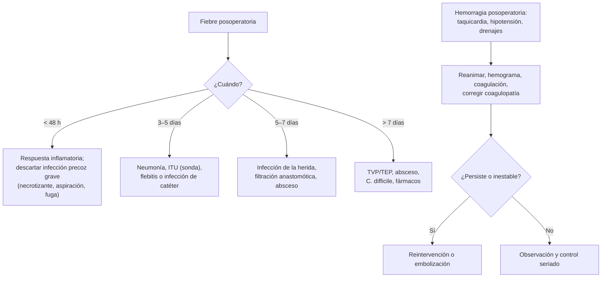

---
tags:
  - Cirugía
  - Frecuente en sala
  - Urgencia
---

# Pre y posoperatorio, complicaciones posoperatorias, hemorragia posoperatoria y cirugía ambulatoria

**Subespecialidad**
Cirugía general · Perioperatorio · Anestesiología

**Guías principales**
Guía ESC 2022 de evaluación cardiovascular para cirugía no cardíaca (*Eur Heart J* 2022) · Guía CHEST 2022 de manejo perioperatorio de antitrombóticos (*Chest* 2022) · Guía ASA 2023 de ayuno preoperatorio

**Otras fuentes**
Clasificación de Clavien-Dindo de las complicaciones quirúrgicas (*Ann Surg* 2004) · Ver [anestesia](anestesia-y-anestesicos-locales.md) e [infección quirúrgica](infeccion-quirurgica-asepsia-y-profilaxis.md)

**GES**
No.

**EUNACOM**
4.01.2.024 Hemorragia aguda posoperatoria (diagnóstico específico, tratamiento inicial) · 4.01.3.010 Conceptos generales del pre y posoperatorio · 4.01.3.005 Complicaciones posoperatorias frecuentes · 4.01.3.006 Concepto de paciente quirúrgico ambulatorio

**Revisado**
Octubre 2026

!!! abstract "Resumen en 60 segundos"
    - **Preoperatorio**: anamnesis, examen, **riesgo** (clase ASA, riesgo cardiovascular según la cirugía y la capacidad funcional), **exámenes solo según la indicación** (no de rutina en sanos), manejo de los **fármacos** (anticoagulantes, antiagregantes, iSGLT2, insulina), **ayuno**, **consentimiento informado**, profilaxis antibiótica y de **TEV**.
    - **Capacidad funcional**: si puede subir **2 pisos** de escalera (≥ 4 MET) sin síntomas, en general no requiere estudio cardiológico adicional.
    - **Posoperatorio**: analgesia, control de signos vitales y **diuresis**, balance hídrico, **movilización precoz**, realimentación precoz, kinesioterapia respiratoria, profilaxis de TEV, control de la glicemia.
    - **Fiebre posoperatoria según el día**: **< 48 h** respuesta inflamatoria (atelectasia es un mito como causa), **3–5 días** neumonía, ITU, flebitis; **5–7 días** **infección de la herida** y **filtración anastomótica**/absceso; después, TVP/TEP, *C. difficile*, fármacos.
    - **Hemorragia posoperatoria**: taquicardia, hipotensión, oliguria, débito sanguíneo por drenajes, distensión, caída de la hemoglobina. **Reanimar**, corregir la coagulación y **reintervenir** (o embolizar) si persiste. Las **primeras 24 h** suelen ser por **hemostasia quirúrgica** insuficiente.
    - **Clavien-Dindo**: grados I–V según el tratamiento que requiere la complicación.
    - **Cirugía ambulatoria (mayor ambulatoria)**: el paciente se va **el mismo día**; requiere ASA I–II (o III estable), procedimientos de bajo riesgo, buen control del dolor y las náuseas, un **acompañante adulto** y acceso a contacto telefónico.

## Definición

- **Período perioperatorio**: **preoperatorio** (desde la decisión quirúrgica hasta la entrada al pabellón), **intraoperatorio** y **posoperatorio** (hasta la recuperación).
- **Complicación posoperatoria**: cualquier desviación del curso posoperatorio normal.
- **Hemorragia posoperatoria**: sangrado significativo tras la cirugía; **primaria** (intraoperatoria), **reactiva** (primeras **24 h**, por un vaso que no sangraba durante la cirugía, al normalizarse la presión o soltarse una ligadura) o **secundaria** (días después, habitualmente por **infección** que erosiona un vaso).
- **Cirugía mayor ambulatoria**: procedimientos quirúrgicos, con anestesia general, regional o local, tras los cuales el paciente **vuelve a su casa el mismo día**.
- **Recuperación mejorada tras la cirugía (ERAS)**: protocolos multimodales que aceleran la recuperación (ayuno corto, analgesia sin opioides, movilización y realimentación precoces).

## Epidemiología

### Mundial

- Se realizan cientos de millones de cirugías al año; las complicaciones posoperatorias son una causa importante de **morbimortalidad**.
- Las complicaciones más frecuentes: **infección del sitio quirúrgico**, complicaciones **pulmonares** (atelectasias, neumonía), **ITU**, **íleo**, **delirium** en adultos mayores, **TEV**, lesión renal aguda y eventos cardiovasculares.
- La cirugía ambulatoria representa una proporción creciente de las cirugías electivas.

### Chile

!!! chile "Datos nacionales"
    - No se encontraron datos nacionales recientes publicados sobre las complicaciones posoperatorias en conjunto.
    - Las **infecciones asociadas a la atención de salud** se vigilan a nivel nacional (ver [infección quirúrgica](infeccion-quirurgica-asepsia-y-profilaxis.md)).

## Etiología y factores de riesgo

| Factor | Ejemplos |
|---|---|
| **Paciente** | **Edad avanzada**, **fragilidad**, desnutrición, obesidad, **tabaco**, diabetes, cardiopatía, EPOC, ERC, anemia, inmunosupresión |
| **Cirugía** | **Urgencia**, cirugía **mayor** (abdominal alta, torácica, vascular), duración prolongada, contaminación, pérdida de sangre |
| **Fármacos** | **Anticoagulantes** y antiagregantes (sangrado), corticoides (cicatrización), iSGLT2 (cetoacidosis euglicémica) |

**Hemorragia posoperatoria: causas**:

| Tipo | Causa |
|---|---|
| **Quirúrgica** (la más frecuente) | Ligadura que se suelta, vaso no identificado, hemostasia insuficiente |
| **Coagulopatía** | Anticoagulantes o antiagregantes, **dilución** por transfusión masiva, **hipotermia**, CID, trombocitopenia, enfermedad hepática, déficit de vitamina K, uremia |
| **Secundaria** | Infección que erosiona un vaso (días después), seudoaneurisma |

## Fisiopatología

- La cirugía produce una **respuesta metabólica al estrés**: liberación de catecolaminas, cortisol, ADH y aldosterona → retención de **agua y sodio** (oliguria fisiológica en las primeras 24–48 h), **hiperglicemia**, catabolismo proteico; y una respuesta **inflamatoria** (fiebre en las primeras 48 h).
- **Íleo posoperatorio**: inhibición de la motilidad por la manipulación, los opioides y la inflamación; el **intestino delgado** se recupera primero (horas), luego el estómago (24–48 h) y el colon (3–5 días).
- **Complicaciones pulmonares**: dolor, inmovilidad y anestesia → **atelectasias** y **neumonía**.
- **TEV**: tríada de Virchow (estasis, daño endotelial, hipercoagulabilidad).

*Figura 1. Fiebre y hemorragia posoperatorias. Esquema propio basado en la clasificación de Clavien-Dindo y la práctica quirúrgica habitual.*

## Clasificación

**Clavien-Dindo (complicaciones quirúrgicas)**:

| Grado | Definición |
|---|---|
| **I** | Desviación del curso normal **sin** necesidad de tratamiento farmacológico, quirúrgico, endoscópico ni radiológico (se permiten antieméticos, antipiréticos, analgésicos, diuréticos, electrolitos, kinesioterapia y abrir la herida a la cabecera) |
| **II** | Requiere **tratamiento farmacológico** distinto del grado I (incluye **transfusiones** y nutrición parenteral) |
| **III** | Requiere **intervención** quirúrgica, endoscópica o radiológica: **IIIa** sin anestesia general; **IIIb** con anestesia general |
| **IV** | Complicación con **riesgo vital** que requiere **UCI**: IVa disfunción de un órgano; IVb multiorgánica |
| **V** | **Muerte** |

**Fiebre posoperatoria por tiempo** (orientación, no regla estricta):

| Momento | Causas a considerar |
|---|---|
| **Intraoperatoria o primeras horas** | Reacción a fármacos o transfusión, **hipertermia maligna**, sepsis previa |
| **< 48 h** | **Respuesta inflamatoria** a la cirugía (lo más frecuente); infección necrotizante precoz (estreptococo, *Clostridium*); aspiración; fuga anastomótica precoz |
| **3–5 días** | **Neumonía**, **ITU** (sonda), flebitis o **infección de catéter** |
| **5–7 días** | **Infección del sitio quirúrgico**, **filtración anastomótica**, **absceso** intraabdominal |
| **> 7 días** | **TVP/TEP**, absceso, **colitis por *C. difficile***, fiebre por **fármacos**, infección de prótesis |

## Clínica

- **Hemorragia posoperatoria**: **taquicardia** (signo precoz), hipotensión, **oliguria**, palidez, piel fría, ansiedad; **débito hemático** por los drenajes (> 100–200 mL/h), hematoma de la herida, distensión abdominal, hematemesis o melena; caída de la hemoglobina (puede ser tardía).
- **Íleo prolongado** u **obstrucción**: distensión, vómitos, ausencia de gases y deposiciones.
- **Filtración anastomótica**: fiebre, taquicardia, dolor abdominal, **peritonitis**, salida de contenido intestinal por el drenaje, deterioro del paciente (habitualmente día 5–7).
- **Dehiscencia de la herida y evisceración**: salida de **líquido serohemático** abundante por la herida (señal de alarma) días 5–10.
- **TEV**: edema de la pierna, disnea, taquicardia, hipoxemia.
- **Delirium**: confusión fluctuante en el adulto mayor (ver [delirium](../../geriatria/delirium.md)).
- **Retención urinaria**: globo vesical, dolor suprapúbico (sobre todo tras anestesia raquídea, cirugía herniaria o anorrectal, opioides).
- **Complicaciones cardiovasculares**: lesión miocárdica perioperatoria (a menudo **silente**: medir **troponina** en pacientes de riesgo), arritmias (FA).

## Diagnóstico

!!! guia "Evaluación preoperatoria (ESC 2022, CHEST 2022, ASA 2023)"
    - **Anamnesis y examen**: comorbilidades, **capacidad funcional** (subir 2 pisos), fármacos, alergias, anestesias previas, hábitos (tabaco, alcohol), fragilidad.
    - **Riesgo**: clase **ASA**; riesgo de la **cirugía** (bajo, intermedio, alto) y del **paciente**. En los pacientes de riesgo con cirugía de riesgo intermedio o alto: **ECG**, y **troponina** y **BNP/NT-proBNP** basales y posoperatorios según la ESC 2022.
    - **Exámenes**: **no de rutina** en los pacientes sanos con cirugías menores; pedirlos según la **comorbilidad** y la cirugía (hemograma si se espera sangrado o anemia; creatinina y electrolitos en enfermos renales o con diuréticos; glicemia o HbA1c en diabéticos; coagulación si toma anticoagulantes o tiene hepatopatía; test de embarazo en mujeres en edad fértil).
    - **Fármacos**: **anticoagulantes** y **antiagregantes** según el riesgo de sangrado y de trombosis (ver la tabla de Tratamiento); **iSGLT2**: suspender **3 días antes** (4 la ertugliflozina) por el riesgo de cetoacidosis; **metformina**: suspender el día de la cirugía; **insulina** basal en dosis reducida; mantener los **betabloqueadores** y las estatinas.
    - **Ayuno**: líquidos claros **2 h**, comida liviana **6 h**, comida grasa **8 h**.
    - **Consentimiento informado** firmado y **marcación** del sitio quirúrgico; **lista de verificación** de cirugía segura (OMS).

## Laboratorio

| Examen | Uso |
|---|---|
| **Hemograma seriado** | Hemorragia (la caída de la hemoglobina puede tardar horas), infección |
| **TP/INR, TTPa, plaquetas, fibrinógeno** | Coagulopatía en la hemorragia |
| **Grupo y pruebas cruzadas** | Transfusión |
| **Creatinina, electrolitos** | LRA, oliguria, íleo |
| **PCR y procalcitonina** seriadas | Sospecha de filtración anastomótica o infección (su descenso tranquiliza) |
| **Troponina** | Lesión miocárdica perioperatoria en pacientes de riesgo |
| **Lactato** | Isquemia, shock |

## Imágenes

| Examen | Uso |
|---|---|
| **Ecografía** | Colecciones, hematomas, globo vesical, TVP |
| **TC con contraste** | **Filtración anastomótica**, abscesos, hematomas, **sangrado activo** (angio-TC) |
| **Radiografía de tórax** | Neumonía, atelectasia, derrame |
| **Angiografía** | Diagnóstico y **embolización** del sangrado |

## Diagnóstico diferencial

| Hallazgo posoperatorio | Diferenciales |
|---|---|
| **Taquicardia** | **Hemorragia**, dolor, fiebre, **TEP**, FA, hipovolemia, sepsis, abstinencia alcohólica |
| **Oliguria** | **Hipovolemia** (sangrado, tercer espacio), obstrucción de la sonda o **retención urinaria**, LRA, respuesta al estrés |
| **Hipotensión** | Hemorragia, sepsis, efecto anestésico, IAM, TEP, insuficiencia suprarrenal (usuarios de corticoides) |
| **Distensión y vómitos** | **Íleo** posoperatorio, **obstrucción** (bridas, hernia), filtración, hematoma |
| **Disnea e hipoxemia** | Atelectasia, neumonía, **TEP**, edema pulmonar (sobrecarga), aspiración |

## Tratamiento

### Manejo de los antitrombóticos (CHEST 2022, simplificado)

| Fármaco | Conducta habitual |
|---|---|
| **Warfarina / acenocumarol** | Suspender **~ 5 días** antes; puente con heparina solo en riesgo trombótico **alto** (prótesis valvular mecánica mitral, TEV reciente) |
| **Anticoagulantes orales directos** | Suspender **1–2 días** (bajo riesgo de sangrado) o **2–4 días** (alto riesgo), según la función renal; **sin puente** |
| **Aspirina** | Habitualmente **mantener** en prevención secundaria (salvo neurocirugía o cirugía con riesgo de sangrado muy alto) |
| **Clopidogrel / prasugrel / ticagrelor** | Suspender **5 días** (clopidogrel, ticagrelor) o **7 días** (prasugrel) antes; **no** suspender la doble antiagregación en los primeros meses tras un **stent coronario** sin consultar a cardiología (diferir la cirugía electiva) |

### Posoperatorio habitual

- **Signos vitales**, **diuresis** (≥ 0,5 mL/kg/h), balance, control de los **drenajes** y la herida.
- **Analgesia multimodal** (ver [manejo del dolor](manejo-del-dolor.md)).
- **Movilización** y **realimentación** precoces; **kinesioterapia respiratoria** (incentivador, tos asistida).
- **Profilaxis de TEV** (medidas mecánicas y/o heparina de bajo peso molecular según el riesgo).
- **Control de la glicemia**; reanudar los fármacos habituales.
- Retirar **sondas y catéteres** lo antes posible.

### Hemorragia posoperatoria

!!! dosis "Manejo"
    - **Avisar al cirujano**; evaluar el ABC; **dos vías venosas gruesas**.
    - **Reanimación** con cristaloides limitados y **hemoderivados** (glóbulos rojos; plasma, plaquetas y crioprecipitado según la coagulación o la transfusión masiva).
    - **Corregir la coagulopatía**: revertir los anticoagulantes (vitamina K, concentrado de complejo protrombínico, idarucizumab, andexanet), **ácido tranexámico**, normotermia, calcio (ver [reversión de anticoagulantes](../../hematologia/coagulopatias-cid-y-reversion-de-anticoagulantes.md)).
    - **Compresión** del sitio superficial (hematoma de la herida, cuello).
    - **Reintervención** quirúrgica o **embolización** si el sangrado persiste, el paciente está inestable o hay un hematoma que comprime (**hematoma cervical tras una tiroidectomía**: abrir la herida a la cabecera si compromete la vía aérea).
    - **Hemorragia secundaria** (días después): buscar **infección** o seudoaneurisma (angio-TC).

### Otras complicaciones

| Complicación | Manejo inicial |
|---|---|
| **Íleo posoperatorio** | Corregir los electrolitos (K, Mg), reducir los opioides, movilizar, sonda nasogástrica si hay vómitos |
| **Retención urinaria** | Sondeo vesical |
| **Infección de la herida** | Abrir y drenar; antibiótico si hay celulitis o compromiso sistémico |
| **Filtración anastomótica** | TC, antibióticos, drenaje percutáneo o **reintervención** |
| **Evisceración** | Cubrir con compresas húmedas estériles y **pabellón** (ver [hernias](../abdomen-agudo-y-pared/hernias-de-la-pared-abdominal.md)) |
| **TEV** | Anticoagulación (ver [TEP](../../respiratorio/tromboembolismo-pulmonar.md)) |

### Cirugía mayor ambulatoria

- **Selección del paciente**: ASA I–II (o III estable), sin comorbilidad descompensada, **acompañante adulto** las primeras 24 h, domicilio a una distancia razonable, teléfono, comprensión de las instrucciones.
- **Procedimientos**: de **baja complejidad** y bajo riesgo de sangrado (hernioplastía, colecistectomía laparoscópica seleccionada, cirugía anorrectal, artroscopía, cataratas, resección de lesiones de piel).
- **Criterios de alta**: signos vitales estables, orientado, **deambula**, **dolor controlado** con analgesia oral, sin náuseas ni vómitos importantes, **tolera líquidos**, sin sangrado, micción (según el procedimiento); instrucciones escritas y contacto en caso de complicaciones.

!!! alarma "Avisar al cirujano"
    - **Taquicardia** persistente, **hipotensión**, oliguria o **débito hemático** por los drenajes.
    - **Hematoma cervical** con estridor tras una cirugía de tiroides o cuello.
    - **Fiebre** con dolor abdominal o peritonitis al **día 5–7** (filtración anastomótica).
    - **Salida de líquido serohemático** abundante por la herida (dehiscencia).
    - **Disnea súbita**, dolor torácico o hipoxemia (TEP).

## Complicaciones

- **Locales**: hematoma, seroma, **infección del sitio quirúrgico**, dehiscencia, evisceración, hernia incisional.
- **Generales**: **atelectasia**, neumonía, **ITU**, **TEV**, **íleo**, **LRA**, **delirium**, lesión miocárdica, IAM, FA, desnutrición, úlceras por presión, *C. difficile*.
- **Específicas**: **filtración anastomótica**, fístulas, lesiones de vía biliar, lesiones nerviosas.

## Pronóstico y seguimiento

- La mayoría de las complicaciones son **prevenibles** o se manejan sin secuelas si se detectan **precozmente**.
- Los protocolos **ERAS** reducen las complicaciones y la estadía.
- Control posoperatorio para la revisión de la herida, el retiro de los puntos y el resultado de la biopsia.

## Perlas para el internado

!!! perla "Para recordar en la sala"
    - **Exámenes preoperatorios según la indicación**, no de rutina en sanos.
    - **Sube 2 pisos sin síntomas** = buena capacidad funcional.
    - **iSGLT2: suspender 3 días antes** (cetoacidosis euglicémica).
    - **No suspender la doble antiagregación de un stent reciente** sin hablar con cardiología.
    - **Taquicardia posoperatoria = sangrado** hasta demostrar lo contrario.
    - **La hemoglobina inicial puede ser normal** en un sangrado agudo.
    - **Fiebre al día 5–7 con dolor abdominal = filtración anastomótica** o absceso → TC.
    - **Líquido serohemático por la herida al día 5–10 = dehiscencia** (avisar).
    - **Hematoma cervical con estridor = abrir la herida a la cabecera.**
    - **Oliguria: primero revisar la sonda.**

## Preguntas de repaso

??? repaso "1. Hombre de 60 años con HTA controlada, sin otros antecedentes, que sube 3 pisos sin síntomas, programado para una hernioplastía inguinal. ¿Qué exámenes preoperatorios necesita?"
    - Paciente **ASA II** con buena capacidad funcional y cirugía de **bajo riesgo**: **no requiere exámenes de rutina** más allá de los que justifique su comorbilidad (por ejemplo, creatinina y potasio si usa diuréticos o IECA); ECG según la edad y el protocolo local.

??? repaso "2. Paciente operado de una colectomía hace 4 horas, con FC 125, PA 90/60, oliguria y 300 mL de sangre por el drenaje en la última hora. ¿Qué hace?"
    - **Hemorragia posoperatoria reactiva** (primeras 24 h).
    - Avisar al cirujano, dos vías, **reanimación** con hemoderivados, hemograma, coagulación, grupo y pruebas cruzadas, corregir la coagulopatía, **ácido tranexámico**; **reintervención** si persiste o está inestable.

??? repaso "3. Paciente al quinto día de una resección intestinal con anastomosis, con fiebre de 38,8 °C, taquicardia, dolor abdominal difuso y PCR en ascenso. ¿Qué sospecha?"
    - **Filtración anastomótica** (o absceso intraabdominal).
    - **TC con contraste**, antibióticos de amplio espectro, reanimación; drenaje percutáneo o **reintervención** según la gravedad.

??? repaso "4. Paciente que toma dapagliflozina para su diabetes, programado para una colecistectomía. ¿Qué indica?"
    - **Suspender la dapagliflozina 3 días antes** de la cirugía por el riesgo de **cetoacidosis euglicémica**; reanudarla cuando coma normalmente.

??? repaso "5. Una complicación posoperatoria requirió un drenaje percutáneo de un absceso guiado por TC, con anestesia local. ¿Qué grado de Clavien-Dindo es?"
    - **Grado IIIa** (intervención radiológica sin anestesia general).

## Referencias

1. Halvorsen S, Mehilli J, Cassese S, et al. 2022 ESC Guidelines on cardiovascular assessment and management of patients undergoing non-cardiac surgery. *Eur Heart J.* 2022;43(39):3826–3924. doi:[10.1093/eurheartj/ehac270](https://doi.org/10.1093/eurheartj/ehac270)
2. Douketis JD, Spyropoulos AC, Murad MH, et al. Perioperative Management of Antithrombotic Therapy: An American College of Chest Physicians Clinical Practice Guideline. *Chest.* 2022;162(5):e207–e243. doi:[10.1016/j.chest.2022.07.025](https://doi.org/10.1016/j.chest.2022.07.025)
3. Joshi GP, Abdelmalak BB, Weigel WA, et al. 2023 American Society of Anesthesiologists Practice Guidelines for Preoperative Fasting: Carbohydrate-containing Clear Liquids with or without Protein, Chewing Gum, and Pediatric Fasting Duration—A Modular Update of the 2017 American Society of Anesthesiologists Practice Guidelines for Preoperative Fasting. *Anesthesiology.* 2023;138(2):132–151. doi:[10.1097/ALN.0000000000004381](https://doi.org/10.1097/ALN.0000000000004381)
4. Dindo D, Demartines N, Clavien PA. Classification of Surgical Complications: A New Proposal With Evaluation in a Cohort of 6336 Patients and Results of a Survey. *Ann Surg.* 2004;240(2):205–213. doi:[10.1097/01.sla.0000133083.54934.ae](https://doi.org/10.1097/01.sla.0000133083.54934.ae)
