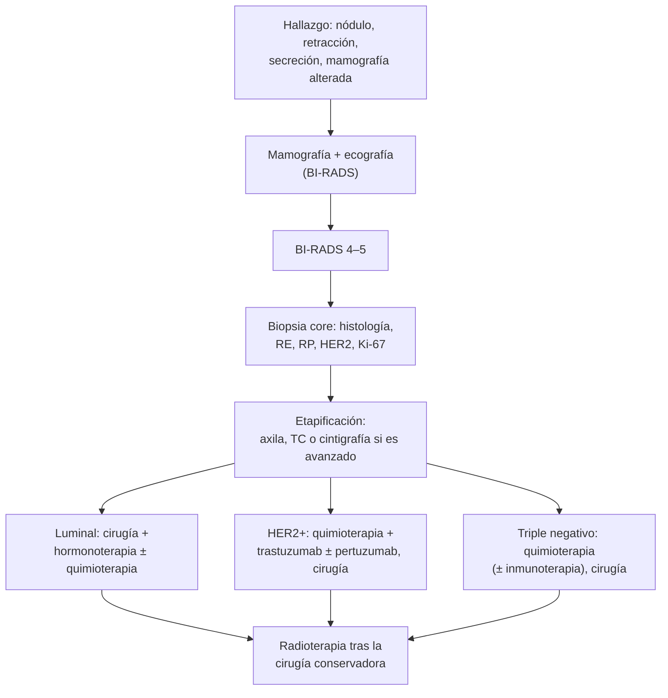

---
tags:
  - Cirugía
  - GES
---

# Cáncer de mama y diagnóstico precoz

**Subespecialidad**
Patología mamaria · Oncología · Cirugía general

**Guías principales**
Guía ESMO de cáncer de mama precoz (*Ann Oncol* 2024) · Recomendación del USPSTF sobre la pesquisa del cáncer de mama (*JAMA* 2024)

**Otras fuentes**
Decreto GES (examen de medicina preventiva: mamografía) · Sistema BI-RADS del ACR (5.ª edición)

**GES**
Sí: **cáncer de mama en personas de 15 años y más** (N.° 8), desde la **sospecha**. El **examen de medicina preventiva** incluye una **mamografía** gratuita cada **3 años** en las mujeres de **50 a 59 años**.

**EUNACOM**
4.01.1.035 Cáncer de mama (sospecha, inicial) · 4.01.3.012 Diagnóstico precoz del cáncer mamario (conocimiento general)

**Revisado**
Octubre 2026

!!! abstract "Resumen en 60 segundos"
    - Es la **primera causa de muerte por cáncer en las mujeres chilenas** (MINSAL).
    - **Factores de riesgo**: edad, **mutaciones BRCA1/2** e historia familiar, exposición **estrogénica** prolongada (menarquia precoz, menopausia tardía, nuliparidad, terapia hormonal combinada), obesidad posmenopáusica, alcohol, radioterapia torácica previa, lesiones atípicas.
    - **Diagnóstico precoz**: **mamografía** de pesquisa (en Chile, cada 3 años entre los **50 y 59 años** por el EMP; el USPSTF 2024 recomienda cada 2 años entre los **40 y 74 años**).
    - **Sospecha**: nódulo **duro**, **irregular**, **fijo**, retracción, **piel de naranja**, secreción sanguinolenta, **adenopatía axilar**. Activa el **GES 8**.
    - **Diagnóstico**: **mamografía + ecografía** y **biopsia con aguja gruesa (core)**: tipo histológico, **receptores hormonales (RE, RP)**, **HER2** y **Ki-67**.
    - **Tratamiento** según la etapa y el subtipo: **cirugía** (conservadora + radioterapia, o mastectomía) con **biopsia del ganglio centinela**; **hormonoterapia** (luminales), **anti-HER2** (HER2+), **quimioterapia** (triple negativo, HER2+, luminales de alto riesgo).

## Definición

- **Cáncer de mama**: neoplasia maligna del epitelio mamario.
    - **In situ**: **carcinoma ductal in situ** (CDIS), sin invasión de la membrana basal; no da metástasis.
    - **Invasor**: el más frecuente es el **carcinoma invasor de tipo no especial** (ductal); le sigue el **lobulillar**.
- **Carcinoma inflamatorio**: forma agresiva con **eritema**, **edema** y **piel de naranja** en más de un tercio de la mama (T4d).
- **Enfermedad de Paget del pezón**: lesión **eccematosa** unilateral del pezón asociada a un carcinoma subyacente.
- **Diagnóstico precoz**: detección del cáncer en etapas tempranas mediante la **pesquisa** (mamografía en mujeres asintomáticas) y la **consulta oportuna** ante síntomas.

## Epidemiología

### Mundial

- Es el **cáncer más frecuente** en las mujeres en el mundo y una de las principales causas de muerte por cáncer en ellas.
- El riesgo aumenta con la **edad**; ~ 1 % de los casos ocurre en **hombres**.
- La mortalidad ha bajado en los países con **pesquisa mamográfica** y tratamientos sistémicos modernos.

### Chile

!!! chile "Datos nacionales"
    - El cáncer de mama es la **primera causa de muerte oncológica** de las mujeres chilenas; el MINSAL estimó que fallecen **unas cuatro mujeres al día** por esta causa, y que solo un **36 %** de las mujeres se hacía la mamografía cada tres años (MINSAL, 2018).
    - **GES N.° 8**: cáncer de mama en personas de **15 años y más**, desde la **sospecha** (diagnóstico, tratamiento, seguimiento y reconstrucción).
    - **Examen de medicina preventiva (EMP)**: el decreto GES da derecho a las mujeres de **50 a 59 años** a una **mamografía gratuita cada 3 años**.

## Etiología y factores de riesgo

| Categoría | Factores |
|---|---|
| **No modificables** | **Sexo femenino**, **edad**, **mutaciones** (BRCA1, BRCA2, PALB2, TP53, CHEK2, PTEN), **historia familiar** (familiares de primer grado, cáncer de mama joven o bilateral, cáncer de ovario, cáncer de mama en hombres), mamas **densas** |
| **Hormonales** | **Menarquia precoz**, **menopausia tardía**, **nuliparidad** o primer parto tardío (> 30 años), **no amamantar**, **terapia hormonal** combinada prolongada |
| **Estilo de vida** | **Obesidad posmenopáusica**, **alcohol**, sedentarismo |
| **Antecedentes** | **Radioterapia torácica** antes de los 30 años (linfoma de Hodgkin), **hiperplasia atípica**, carcinoma lobulillar in situ, cáncer de mama previo |

**Factores protectores**: lactancia materna, actividad física, peso adecuado, bajo consumo de alcohol.

## Fisiopatología

- El cáncer se origina en la **unidad ductolobulillar terminal**: hiperplasia → **hiperplasia atípica** → **carcinoma in situ** → **carcinoma invasor**.
- **Subtipos biológicos** (según los receptores y la proliferación), que determinan el tratamiento y el pronóstico:
    - **Luminal A**: RE+, RP+, HER2−, Ki-67 bajo: el de **mejor pronóstico**; responde a la **hormonoterapia**.
    - **Luminal B**: RE+, con Ki-67 alto o RP bajo, HER2− o HER2+.
    - **HER2 positivo**: sobreexpresión de HER2; agresivo, pero responde a las **terapias anti-HER2**.
    - **Triple negativo**: RE−, RP−, HER2−; **agresivo**, más frecuente en mujeres **jóvenes** y portadoras de **BRCA1**; se trata con **quimioterapia** (± inmunoterapia).
- **Diseminación**: **linfática** (axila, cadena mamaria interna, supraclavicular) y **hematógena** (hueso, pulmón, hígado, cerebro).

*Figura 1. Diagnóstico y tratamiento del cáncer de mama según el subtipo. Esquema propio basado en la guía ESMO 2024.*

## Clasificación

**Etapificación TNM (simplificada)**:

| Categoría | Significado |
|---|---|
| **Tis** | Carcinoma in situ (CDIS) |
| **T1** | ≤ 2 cm |
| **T2** | > 2 cm y ≤ 5 cm |
| **T3** | > 5 cm |
| **T4** | Compromiso de la **pared torácica** o la **piel** (ulceración, nódulos satélites, piel de naranja); **T4d**: **carcinoma inflamatorio** |
| **N1–N3** | Ganglios axilares móviles (N1), fijos o mamarios internos (N2), infraclaviculares o supraclaviculares (N3) |
| **M1** | Metástasis a distancia |

**Etapas**: **0** (in situ), **I–II** (precoz), **III** (localmente avanzado), **IV** (metastásico).

**Subtipos**: luminal A, luminal B, HER2 positivo y triple negativo (ver Fisiopatología).

## Clínica

- **Asintomático**: detectado por la **mamografía** de pesquisa (lo ideal).
- **Nódulo** **duro**, **irregular**, **indoloro** y poco móvil o **fijo**.
- **Cambios de la piel**: **retracción**, **piel de naranja**, eritema, ulceración.
- **Pezón**: **retracción** reciente, **secreción sanguinolenta** espontánea, lesión **eccematosa** (Paget).
- **Adenopatía axilar** o supraclavicular.
- **Enfermedad metastásica**: dolor óseo, fracturas patológicas, **hipercalcemia**, disnea (derrame pleural), ictericia, cefalea o focalidad neurológica, **compresión medular** (ver [urgencias oncológicas](../../hematologia/urgencias-oncologicas.md)).

## Diagnóstico

!!! guia "Pesquisa y diagnóstico (ESMO 2024, USPSTF 2024, GES)"
    - **Pesquisa en población de riesgo promedio**:
        - **Chile (EMP)**: **mamografía** cada **3 años** en las mujeres de **50 a 59 años**.
        - **USPSTF 2024**: mamografía **cada 2 años** entre los **40 y 74 años**.
        - El **autoexamen** no ha demostrado reducir la mortalidad como pesquisa, pero se recomienda que las mujeres **conozcan sus mamas** y consulten ante cambios.
    - **Alto riesgo** (BRCA, radioterapia torácica joven, historia familiar fuerte): pesquisa más precoz con **RM anual** + mamografía, y **consejo genético**.
    - **Sospecha clínica**: **mamografía diagnóstica + ecografía**, y **biopsia con aguja gruesa (core)** guiada por imagen de la lesión y de los ganglios sospechosos. **Evitar la biopsia quirúrgica** como primer paso.
    - **Estudio de la biopsia**: tipo histológico, grado, **RE**, **RP**, **HER2** y **Ki-67**.
    - **Etapificación sistémica** (TC de tórax-abdomen-pelvis y cintigrafía ósea, o PET-TC) en los tumores **localmente avanzados** (etapa III), con síntomas o con biología agresiva; **no** en los tumores pequeños asintomáticos.
    - **Estudio genético** (BRCA) según la edad, la historia familiar, el triple negativo y otros criterios.

## Laboratorio

| Examen | Uso |
|---|---|
| **Inmunohistoquímica**: RE, RP, HER2, Ki-67 | **Subtipo**: define el tratamiento |
| **FISH/ISH** para HER2 | HER2 dudoso (2+) |
| **Hemograma, función hepática y renal, calcio, fosfatasa alcalina** | Basal y sospecha de metástasis |
| **Estudio genético** (BRCA1/2 y otros) | Pacientes seleccionadas |
| **Marcadores** (CA 15-3, CEA) | No para el diagnóstico ni la pesquisa |

## Imágenes

| Examen | Uso |
|---|---|
| **Mamografía** | **Pesquisa** y diagnóstico; masas espiculadas, **microcalcificaciones**, distorsión |
| **Ecografía mamaria y axilar** | Complemento; mujeres jóvenes; guía de biopsias |
| **RM mamaria** | Alto riesgo, mamas densas, carcinoma lobulillar, respuesta a la neoadyuvancia |
| **TC, cintigrafía ósea, PET-TC** | Etapificación en la enfermedad avanzada |

## Diagnóstico diferencial

| Hallazgo | Diferenciales |
|---|---|
| **Nódulo mamario** | Fibroadenoma, quiste, tumor filodes, necrosis grasa (ver [patología mamaria benigna](patologia-mamaria-benigna.md)) |
| **Mama roja y engrosada** | **Mastitis**, absceso frente a **carcinoma inflamatorio** |
| **Lesión del pezón** | Eccema, dermatitis frente a **Paget** |
| **Adenopatía axilar** | Reactiva, linfoma, metástasis de otro cáncer (melanoma), tuberculosis |

## Tratamiento

| Situación | Tratamiento |
|---|---|
| **CDIS** | **Cirugía conservadora + radioterapia** o mastectomía; hormonoterapia si es RE+ |
| **Precoz (I–II), luminal** | **Cirugía** (conservadora + radioterapia, o mastectomía) + **ganglio centinela**; **hormonoterapia** por 5–10 años; quimioterapia si el riesgo es alto (firmas genómicas) |
| **HER2+** (> 2 cm o N+) | **Quimioterapia neoadyuvante + trastuzumab ± pertuzumab**, luego cirugía; completar 1 año de anti-HER2 (T-DM1 si queda enfermedad residual) |
| **Triple negativo** (> 2 cm o N+) | **Quimioterapia neoadyuvante** (± **pembrolizumab**), luego cirugía; capecitabina u olaparib (BRCA) si queda enfermedad residual |
| **Localmente avanzado / inflamatorio** | **Neoadyuvancia** → **mastectomía** con disección axilar → **radioterapia** |
| **Metastásico** | Tratamiento sistémico según el subtipo (hormonoterapia + inhibidores de CDK4/6 en los luminales; anti-HER2; quimioterapia); radioterapia y cirugía paliativas; **cuidados paliativos** (GES N.° 4) |

!!! dosis "Hormonoterapia (luminales)"
    | Paciente | Fármaco | Efectos adversos clave |
    |---|---|---|
    | **Premenopáusica** | **Tamoxifeno** 20 mg/día (± supresión ovárica) | **Trombosis**, **cáncer de endometrio**, bochornos |
    | **Posmenopáusica** | **Inhibidores de aromatasa** (letrozol 2,5 mg, anastrozol 1 mg, exemestano 25 mg) | **Osteoporosis** (densitometría), artralgias |

- **Ganglio centinela**: estándar en la axila clínicamente negativa; evita la disección axilar completa y el **linfedema**.
- **Reconstrucción mamaria**: incluida en el GES.

!!! alarma "Derivar con prioridad (GES desde la sospecha)"
    - Nódulo **sólido sospechoso** o mamografía **BI-RADS 4–5**.
    - **Retracción** de la piel o del pezón, **piel de naranja**, **adenopatía axilar** sospechosa.
    - **Secreción sanguinolenta** espontánea uniductal.
    - Lesión eccematosa **unilateral** del pezón.
    - "**Mastitis**" sin lactancia que no responde a antibióticos.

## Complicaciones

- **De la enfermedad**: metástasis **óseas** (fracturas, **hipercalcemia**, **compresión medular**), pulmonares, hepáticas y **cerebrales**.
- **Del tratamiento**:
    - **Linfedema** del brazo (disección axilar, radioterapia).
    - **Cardiotoxicidad** (antraciclinas, **trastuzumab**: control de la fracción de eyección).
    - **Neutropenia febril** (quimioterapia).
    - **Tromboembolismo** y **cáncer de endometrio** (tamoxifeno); **osteoporosis** (inhibidores de aromatasa).
    - Menopausia precoz e infertilidad.
- **Psicológicas** e imagen corporal.

## Pronóstico y seguimiento

- El pronóstico depende de la **etapa** (tamaño y ganglios) y del **subtipo**: los tumores **precoces** tienen una sobrevida muy alta; el **triple negativo** y el HER2+ sin tratamiento dirigido son más agresivos.
- **Seguimiento**: examen clínico periódico y **mamografía anual**; no se recomiendan marcadores ni imágenes sistémicas de rutina en las asintomáticas.
- Control de los efectos tardíos (corazón, hueso, linfedema) y adherencia a la **hormonoterapia**.

## Perlas para el internado

!!! perla "Para recordar en la sala"
    - **Primera causa de muerte oncológica en las mujeres chilenas.**
    - **EMP: mamografía cada 3 años entre los 50 y 59 años** (y derivar a toda mujer con síntomas, a cualquier edad).
    - **Nódulo duro, irregular y fijo, piel de naranja o retracción = sospecha → GES 8.**
    - **Diagnóstico = biopsia core**, no quirúrgica, con **RE, RP, HER2 y Ki-67**.
    - **Luminal → hormonoterapia. HER2+ → trastuzumab. Triple negativo → quimioterapia.**
    - **Tamoxifeno**: trombosis y cáncer de endometrio. **Inhibidores de aromatasa**: osteoporosis.
    - **Trastuzumab**: controlar la **fracción de eyección**.
    - **Dolor lumbar en una paciente con cáncer de mama**: pensar en una **metástasis** y en la **compresión medular**.

## Preguntas de repaso

??? repaso "1. Mujer de 52 años con un nódulo duro, irregular y poco móvil de 2,5 cm en la mama izquierda y una adenopatía axilar palpable. ¿Qué hace?"
    - **Sospecha de cáncer de mama**: activar el **GES 8**.
    - **Mamografía + ecografía mamaria y axilar** y **biopsia core** de la lesión y del ganglio, con **RE, RP, HER2 y Ki-67**; derivar a la unidad de patología mamaria.

??? repaso "2. Mujer de 55 años que nunca se ha hecho una mamografía y consulta por un control de salud. ¿Qué le indica según el EMP?"
    - Una **mamografía de pesquisa**, gratuita por el EMP en las mujeres de **50 a 59 años**, y repetirla **cada 3 años**.
    - Educar para que consulte ante cualquier cambio en las mamas.

??? repaso "3. Mujer de 35 años con un cáncer de mama triple negativo de 3 cm. Su madre tuvo un cáncer de ovario. ¿Qué estudio adicional corresponde y cuál es el tratamiento?"
    - **Estudio genético** (BRCA1/2) y consejo genético.
    - **Quimioterapia neoadyuvante** (± pembrolizumab), luego **cirugía**; si queda enfermedad residual, tratamiento adyuvante adicional (olaparib si es BRCA+).

??? repaso "4. Mujer posmenopáusica con un cáncer de mama RE+, HER2− operado. ¿Qué hormonoterapia indica y qué debe vigilar?"
    - **Inhibidor de la aromatasa** (letrozol o anastrozol) por **5–10 años**.
    - Vigilar la **densidad ósea** (densitometría, calcio y vitamina D, bifosfonatos si corresponde) y las artralgias.

??? repaso "5. Mujer de 60 años con cáncer de mama metastásico conocido, con dolor dorsal progresivo y debilidad de las piernas desde ayer. ¿Qué sospecha y qué hace?"
    - **Compresión medular** por una metástasis vertebral: **urgencia oncológica**.
    - **Dexametasona** IV, **RM de toda la columna** urgente, y radioterapia o cirugía (ver [urgencias oncológicas](../../hematologia/urgencias-oncologicas.md)).

## Referencias

1. Loibl S, André F, Bachelot T, et al. Early breast cancer: ESMO Clinical Practice Guideline for diagnosis, treatment and follow-up. *Ann Oncol.* 2024;35(2):159–182. doi:[10.1016/j.annonc.2023.11.016](https://doi.org/10.1016/j.annonc.2023.11.016)
2. US Preventive Services Task Force, Nicholson WK, Silverstein M, et al. Screening for Breast Cancer: US Preventive Services Task Force Recommendation Statement. *JAMA.* 2024;331(22):1918–1930. doi:[10.1001/jama.2024.5534](https://doi.org/10.1001/jama.2024.5534)
3. Superintendencia de Salud. Problema de salud GES N.° 8: cáncer de mama. [superdesalud.gob.cl](https://www.superdesalud.gob.cl/orientacion-en-salud/cancer-de-mama/)
4. Superintendencia de Salud. Mujeres pueden acceder a mamografías como parte del Examen de Medicina Preventiva. 2018. [superdesalud.gob.cl](https://www.superdesalud.gob.cl/noticias/2018/10/mujeres-pueden-acceder-a-mamografias-como-parte-del-examen-de-medicina-preventiva/)
5. Ministerio de Salud de Chile. Ministro de Salud en el Día Internacional contra el Cáncer de Mama: "Esta es una enfermedad que podemos prevenir". [minsal.cl](https://www.minsal.cl/ministro-de-salud-en-el-dia-internacional-contra-el-cancer-de-mama-esta-es-una-enfermedad-que-podemos-prevenir/)
