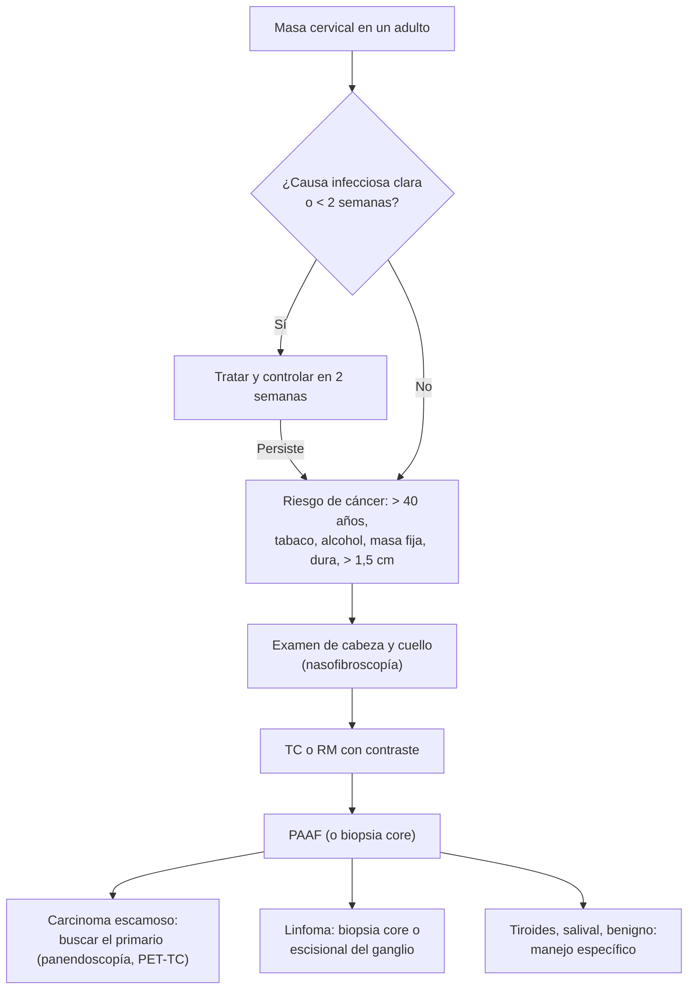

---
tags:
  - Cirugía
---

# Patología de las glándulas salivales y masa cervical

**Subespecialidad**
Cirugía de cabeza y cuello · Otorrinolaringología

**Guías principales**
Guía de la AAO-HNS para la evaluación de la masa cervical en adultos (*Otolaryngol Head Neck Surg* 2017) · Guía ASCO de neoplasias malignas de las glándulas salivales (*J Clin Oncol* 2021)

**Otras fuentes**
Ver [adenopatías y síndrome mononucleósico](../../infectologia/sindrome-mononucleosico-y-adenitis.md), [nódulo tiroideo](../../endocrinologia/bocio-nodulo-y-cancer-de-tiroides.md) y [flegmón cervical](../../infectologia/flegmon-cervical-absceso-pulmonar-y-cerebral.md)

**GES**
No como tal (el **cáncer de tiroides** y los **linfomas** sí tienen GES).

**EUNACOM**
4.01.1.001 Patología de las glándulas salivales · 4.01.1.032 Masa cervical y tumores del cuello (sospecha, inicial)

**Revisado**
Octubre 2026

!!! abstract "Resumen en 60 segundos"
    - **Masa cervical en un adulto**: en un **mayor de 40 años**, **fumador** o bebedor, una masa **persistente** (> 2 semanas) **sin causa infecciosa clara** es un **cáncer** (metástasis de un carcinoma escamoso de cabeza y cuello) hasta demostrar lo contrario.
        - **No dar antibióticos a ciegas** de forma repetida. **TC o RM con contraste** y **punción con aguja fina (PAAF)**; examen completo de la vía aerodigestiva.
        - **No hacer una biopsia abierta** como primer paso (empeora el pronóstico si es un carcinoma escamoso).
    - **Niño o adulto joven**: lo más frecuente es **inflamatorio** (adenitis reactiva) o **congénito** (quiste tirogloso en la línea media, quiste branquial lateral).
    - **Glándulas salivales**:
        - **Parotiditis viral** (paperas): bilateral, niños y jóvenes.
        - **Sialoadenitis bacteriana aguda**: adulto mayor **deshidratado** o posoperado, parótida dolorosa con **pus por el conducto de Stenon**: hidratación, sialogogos, antibiótico antiestafilocócico.
        - **Sialolitiasis**: casi siempre **submandibular**; dolor y aumento de volumen **al comer**.
        - **Tumores**: la mayoría en la **parótida** y la mayoría **benignos** (**adenoma pleomorfo**, Warthin). Señales de malignidad: **parálisis facial**, dolor, crecimiento rápido, fijación, adenopatías.

## Definición

- **Masa cervical**: aumento de volumen anormal en el cuello, visible o palpable, de cualquier origen (ganglionar, glandular, vascular, congénito, neoplásico).
- **Sialoadenitis**: inflamación de una glándula salival (viral, bacteriana, obstructiva, autoinmune).
- **Sialolitiasis**: cálculo dentro del sistema ductal de una glándula salival.
- **Tumores de las glándulas salivales**: benignos (adenoma pleomorfo, tumor de Warthin) o malignos (carcinoma mucoepidermoide, adenoide quístico, otros).
- **Quiste del conducto tirogloso**: resto embrionario del descenso del tiroides; masa de la **línea media** que **asciende al sacar la lengua** o al tragar.
- **Quiste branquial**: resto de las hendiduras branquiales; masa **lateral**, en el borde anterior del esternocleidomastoideo.

## Epidemiología

### Mundial

- **Masa cervical en niños**: la mayoría es **inflamatoria** (adenitis); luego **congénita**; las neoplasias son raras (linfomas).
- **Masa cervical en adultos**: aumenta mucho la probabilidad de **cáncer** con la edad, el **tabaco** y el **alcohol**; la causa maligna más frecuente es la **metástasis ganglionar** de un **carcinoma escamoso** de la vía aerodigestiva superior (incluido el de **orofaringe** asociado al **VPH**, en adultos más jóvenes no fumadores).
- **Tumores salivales**: ~ **80 %** en la **parótida**, y de ellos la mayoría son **benignos**; mientras **más pequeña** la glándula (submandibular, sublingual, salivales menores), **mayor** la proporción de malignos.
- El **adenoma pleomorfo** es el tumor salival más frecuente.

### Chile

!!! chile "Datos nacionales"
    - No se encontraron datos nacionales recientes publicados sobre la masa cervical ni los tumores salivales.
    - La **parotiditis** (paperas) es prevenible con la vacuna **tres vírica** del Programa Nacional de Inmunizaciones.
    - El **cáncer de tiroides** (una causa de masa cervical) tiene **GES** (ver [nódulo y cáncer de tiroides](../../endocrinologia/bocio-nodulo-y-cancer-de-tiroides.md)).

## Etiología y factores de riesgo

**Masa cervical según la edad**:

| Grupo | Causas |
|---|---|
| **Niños y adolescentes** | **Adenitis reactiva** (viral, bacteriana), **mononucleosis**, enfermedad por arañazo de gato, micobacterias atípicas; **quiste tirogloso**, **quiste branquial**, malformaciones linfáticas; linfoma |
| **Adultos jóvenes (< 40 años)** | Inflamatorias (adenitis, mononucleosis, toxoplasmosis, **TBC ganglionar**, VIH); **nódulo tiroideo**; **linfoma**; carcinoma de orofaringe VPH+ |
| **Adultos > 40 años** | **Metástasis** de carcinoma escamoso de cabeza y cuello (**tabaco**, **alcohol**), **linfoma**, **cáncer de tiroides**, metástasis de tumores infraclaviculares (ganglio de **Virchow** supraclavicular izquierdo: estómago, páncreas), tumores salivales |

**Glándulas salivales**:

| Condición | Factores |
|---|---|
| **Parotiditis viral** | **Virus de la parotiditis** (no vacunados), otros virus (influenza, EBV, VIH) |
| **Sialoadenitis bacteriana** | **Deshidratación**, **posoperatorio**, adulto mayor, mala higiene oral, fármacos anticolinérgicos; *S. aureus* |
| **Sialolitiasis** | **Submandibular** (saliva más viscosa y alcalina, conducto de Wharton ascendente) |
| **Crecimiento crónico bilateral** | **Sjögren** (ver [mesenquimopatías](../../reumatologia/lupus-y-otras-mesenquimopatias.md)), enfermedad relacionada con IgG4, sialoadenosis (alcohol, diabetes, bulimia), VIH, sarcoidosis |
| **Tumores** | Radiación, tabaco (Warthin) |

## Fisiopatología

- **Sialoadenitis bacteriana**: la **disminución del flujo** salival (deshidratación, fármacos) permite la infección ascendente desde la boca por el conducto.
- **Sialolitiasis**: el cálculo obstruye el conducto → al comer, la glándula secreta y **se distiende** (**cólico salival**).
- **Metástasis ganglionares**: los carcinomas de la vía aerodigestiva drenan a niveles ganglionares predecibles del cuello; una adenopatía puede ser la **primera manifestación** de un tumor primario pequeño (amígdala, base de la lengua, nasofaringe).

*Figura 1. Evaluación de la masa cervical en el adulto. Esquema propio basado en la guía AAO-HNS 2017.*

## Clasificación

**Tumores de las glándulas salivales**:

| Tumor | Características |
|---|---|
| **Adenoma pleomorfo** | El **más frecuente**; parótida; mujeres de 30–50 años; crecimiento lento; **recurre** si se enuclea; riesgo bajo de malignizar (carcinoma ex adenoma pleomorfo) |
| **Tumor de Warthin** | **Hombres mayores fumadores**; puede ser **bilateral**; benigno |
| **Carcinoma mucoepidermoide** | El maligno **más frecuente**; de bajo a alto grado |
| **Carcinoma adenoide quístico** | Invasión **perineural** (dolor, parálisis facial); recurrencias tardías; metástasis pulmonares |
| **Otros** | Carcinoma de células acinares, carcinoma del conducto salival, linfoma, metástasis (carcinoma escamoso cutáneo) |

**Masas congénitas**:

| Masa | Ubicación | Clave |
|---|---|---|
| **Quiste tirogloso** | **Línea media**, cerca del hioides | **Asciende** al sacar la lengua; resección con el cuerpo del hioides (**Sistrunk**) |
| **Quiste branquial** | **Lateral**, borde anterior del esternocleidomastoideo | Se infecta; en un adulto > 40 años, descartar una metástasis quística (VPH) |
| **Malformación linfática** (higroma) | Lateral, triángulo posterior | Blanda, transiluminable; niños |

## Clínica

- **Adenitis reactiva**: ganglio **doloroso**, **blando**, móvil, con un foco infeccioso (faringe, dientes, piel).
- **Sospecha de malignidad** en una masa cervical: **> 40 años**, **tabaco** y **alcohol**, masa **dura**, **fija**, **indolora**, **> 1,5 cm**, de **crecimiento progresivo**, persistente **> 2 semanas**; **disfonía**, **disfagia**, **odinofagia**, otalgia refleja, hemoptisis, **baja de peso**; ulceraciones orales.
- **Linfoma**: adenopatías **elásticas**, **indoloras**, en varios territorios; síntomas **B** (fiebre, sudoración nocturna, baja de peso).
- **Parotiditis viral**: aumento de volumen **bilateral** y doloroso de las parótidas (borra el ángulo mandibular, levanta el lóbulo de la oreja), fiebre; complicaciones: **orquitis**, meningitis, pancreatitis.
- **Sialoadenitis bacteriana**: parótida **unilateral** dolorosa, eritematosa, con **pus** al masajear la glándula por el conducto de **Stenon**, fiebre.
- **Sialolitiasis**: aumento de volumen **submandibular** doloroso **al comer** que cede en horas; a veces el cálculo se palpa en el piso de la boca.
- **Tumor parotídeo**: masa **preauricular** o del ángulo mandibular; **parálisis facial**, dolor, fijación o adenopatías sugieren **malignidad**.

## Diagnóstico

!!! guia "Puntos clave (AAO-HNS 2017, ASCO 2021)"
    - Identificar a los pacientes con **riesgo aumentado de cáncer**: masa **fija**, **ulcerada**, **firme**, **> 1,5 cm** o persistente **> 2 semanas** sin causa infecciosa.
    - **No indicar antibióticos de forma rutinaria** si no hay signos de infección bacteriana.
    - En los de riesgo: **examen completo de cabeza y cuello** (incluida la **nasofibrolaringoscopía**), **TC o RM con contraste** y **PAAF** de la masa (no biopsia abierta como primer paso).
    - **Carcinoma escamoso** en el ganglio sin primario evidente: **PET-TC**, **panendoscopía** con biopsias dirigidas y estudio del **VPH (p16)**.
    - **Sospecha de linfoma**: biopsia **core** o **escisional** del ganglio (la PAAF no basta para clasificarlo).
    - **Tumores salivales**: **ecografía** y/o **RM**, y **PAAF**; la cirugía es diagnóstica y terapéutica.

## Laboratorio

| Examen | Uso |
|---|---|
| **Hemograma**, VHS, PCR | Infección, linfoma, leucemia |
| **Serologías** (VEB, CMV, toxoplasma, VIH, *Bartonella*) | Adenopatías inflamatorias |
| **TSH** | Masa tiroidea |
| **Amilasa** | Parotiditis |
| **Anti-Ro/SSA, anti-La/SSB, IgG4** | Crecimiento salival bilateral crónico |
| **PPD o IGRA** | TBC ganglionar (escrófula) |

## Imágenes

| Examen | Uso |
|---|---|
| **Ecografía cervical** | Primer examen en niños y en masas superficiales; tiroides, glándulas salivales; guía de la PAAF |
| **TC con contraste** | Masa en el adulto con riesgo de cáncer; abscesos (ver [flegmón cervical](../../infectologia/flegmon-cervical-absceso-pulmonar-y-cerebral.md)) |
| **RM** | Tumores salivales, extensión perineural |
| **PET-TC** | Primario oculto, etapificación |
| **Sialografía o sialoendoscopía** | Sialolitiasis, estenosis ductal |

## Diagnóstico diferencial

| Ubicación | Diferenciales |
|---|---|
| **Línea media** | **Quiste tirogloso**, **nódulo tiroideo**, quiste dermoide, adenopatía prelaríngea |
| **Lateral (triángulo anterior)** | **Adenopatías**, **quiste branquial**, **tumor del cuerpo carotídeo** (pulsátil, móvil lateral pero no vertical), aneurisma carotídeo, laringocele |
| **Preauricular / ángulo mandibular** | **Tumor parotídeo**, adenopatía intraparotídea, parotiditis, quiste sebáceo |
| **Submandibular** | **Sialolitiasis**, sialoadenitis, tumor submandibular, adenopatía |
| **Supraclavicular** | **Metástasis** (Virchow a la izquierda: tumores abdominales; a la derecha: pulmón, esófago), **linfoma** |

## Tratamiento

| Condición | Tratamiento |
|---|---|
| **Adenitis reactiva** | Tratar el foco; control en **2 semanas**; si persiste, estudio |
| **Parotiditis viral** | **Sintomático** (analgesia, hidratación); aislamiento respiratorio; notificación; prevención con la vacuna |
| **Sialoadenitis bacteriana** | **Hidratación**, **sialogogos** (limón, caramelos ácidos), **masaje** y calor local, **higiene oral**, **antibiótico** con cobertura de *S. aureus* (por ejemplo, **amoxicilina-ácido clavulánico** o cloxacilina; clindamicina si hay alergia); drenaje si se abscede |
| **Sialolitiasis** | Hidratación, sialogogos, masaje y AINE; extracción del cálculo (intraoral o **sialoendoscopía**); **submandibulectomía** si recurre |
| **Adenoma pleomorfo / Warthin** | **Parotidectomía superficial** (con disección y **preservación del nervio facial**); la enucleación simple aumenta la recurrencia |
| **Tumor salival maligno** | **Parotidectomía** (total si es necesario) ± disección cervical, **radioterapia** adyuvante según el riesgo |
| **Metástasis cervical de carcinoma escamoso** | Tratamiento del primario y del cuello (**cirugía** y/o **radioquimioterapia**) en un comité oncológico |
| **Quiste tirogloso** | **Operación de Sistrunk** (incluye el cuerpo del hioides) |
| **Quiste branquial** | **Resección** (diferida si está infectado) |

!!! alarma "Derivar con prioridad"
    - **Masa cervical persistente > 2–3 semanas** en un adulto, sobre todo **> 40 años**, fumador o bebedor.
    - Masa **dura**, **fija**, **> 1,5 cm**, **supraclavicular**, o con **disfonía**, **disfagia**, otalgia o baja de peso.
    - **Tumor parotídeo con parálisis facial**, dolor o crecimiento rápido.
    - **Estridor**, trismus o disnea (absceso profundo del cuello): urgencia.

## Complicaciones

- **Sialoadenitis**: **absceso** parotídeo, extensión a los espacios profundos del cuello.
- **Parotiditis viral**: **orquitis** (posible infertilidad), meningitis, pancreatitis, sordera.
- **Parotidectomía**: **parálisis facial** (transitoria o permanente), **síndrome de Frey** (sudoración gustatoria), fístula salival, hipoestesia del lóbulo de la oreja.
- **Cáncer de cabeza y cuello**: obstrucción de la vía aérea, disfagia, metástasis; secuelas del tratamiento (xerostomía, disfagia).
- **Biopsia abierta** inadecuada de una metástasis de carcinoma escamoso: siembra tumoral y peor pronóstico.

## Pronóstico y seguimiento

- **Adenitis reactivas**: excelente pronóstico.
- **Tumores salivales benignos**: curación con la resección completa; el adenoma pleomorfo **recurre** si se enuclea.
- **Malignos**: dependen del tipo histológico, el grado y la etapa.
- **Carcinoma escamoso de cabeza y cuello**: el pronóstico depende de la etapa y del **VPH** (los de orofaringe VPH+ tienen mejor pronóstico).

## Perlas para el internado

!!! perla "Para recordar en la sala"
    - **Masa cervical en un adulto > 40 años fumador = cáncer hasta demostrar lo contrario.**
    - **No repetir antibióticos a ciegas**: si no hay infección clara, estudiar.
    - **PAAF, no biopsia abierta**, como primer paso (salvo sospecha de linfoma, que requiere biopsia core o escisional).
    - **Línea media que sube al sacar la lengua = quiste tirogloso.**
    - **Parótida + parálisis facial = tumor maligno.**
    - **Adenoma pleomorfo = el tumor salival más frecuente; Warthin = hombre fumador.**
    - **Parótida dolorosa con pus por el Stenon en un adulto mayor deshidratado = sialoadenitis bacteriana**: hidratar y antibiótico antiestafilocócico.
    - **Dolor submandibular al comer = sialolitiasis.**
    - **Ganglio supraclavicular izquierdo = Virchow** (cáncer abdominal).

## Preguntas de repaso

??? repaso "1. Hombre de 58 años, fumador y bebedor, con una masa cervical lateral derecha dura, indolora, de 3 cm y de 6 semanas de evolución. Ya recibió dos cursos de antibióticos. ¿Qué hace?"
    - Alta sospecha de una **metástasis ganglionar de un carcinoma escamoso** de cabeza y cuello.
    - **Examen completo con nasofibrolaringoscopía**, **TC o RM con contraste** y **PAAF**; **no** biopsia abierta. Derivar a cirugía de cabeza y cuello.

??? repaso "2. Mujer de 82 años operada de la cadera hace 4 días, deshidratada, con aumento de volumen doloroso de la parótida derecha y salida de pus por el conducto de Stenon. ¿Diagnóstico y tratamiento?"
    - **Sialoadenitis bacteriana aguda** (parotiditis supurativa), habitualmente por *S. aureus*.
    - **Hidratación**, sialogogos, masaje, higiene oral y **antibiótico** antiestafilocócico; ecografía si se sospecha un absceso.

??? repaso "3. Hombre de 40 años con dolor y aumento de volumen submandibular izquierdo cada vez que come, que cede en unas horas. ¿Qué sospecha?"
    - **Sialolitiasis submandibular**.
    - Ecografía; hidratación, sialogogos, AINE; extracción del cálculo o sialoendoscopía.

??? repaso "4. Mujer de 45 años con una masa preauricular de 2 cm, móvil, indolora y de crecimiento lento desde hace 2 años, sin parálisis facial. ¿Qué es lo más probable y cuál es el tratamiento?"
    - **Adenoma pleomorfo** de la parótida.
    - **Parotidectomía superficial** con preservación del nervio facial (no enucleación, por la recurrencia).

??? repaso "5. Niño de 6 años con una masa en la línea media del cuello, sobre el hioides, que se mueve hacia arriba al sacar la lengua. ¿Qué es y cómo se trata?"
    - **Quiste del conducto tirogloso**.
    - Ecografía (confirmar que hay tiroides normal) y **operación de Sistrunk** (resección del quiste, el trayecto y el cuerpo del hioides).

## Referencias

1. Pynnonen MA, Gillespie MB, Roman B, et al. Clinical Practice Guideline: Evaluation of the Neck Mass in Adults Executive Summary. *Otolaryngol Head Neck Surg.* 2017;157(3):355–371. doi:[10.1177/0194599817723609](https://doi.org/10.1177/0194599817723609)
2. Geiger JL, Ismaila N, Beadle B, et al. Management of Salivary Gland Malignancy: ASCO Guideline. *J Clin Oncol.* 2021;39(17):1909–1941. doi:[10.1200/JCO.21.00449](https://doi.org/10.1200/JCO.21.00449)
