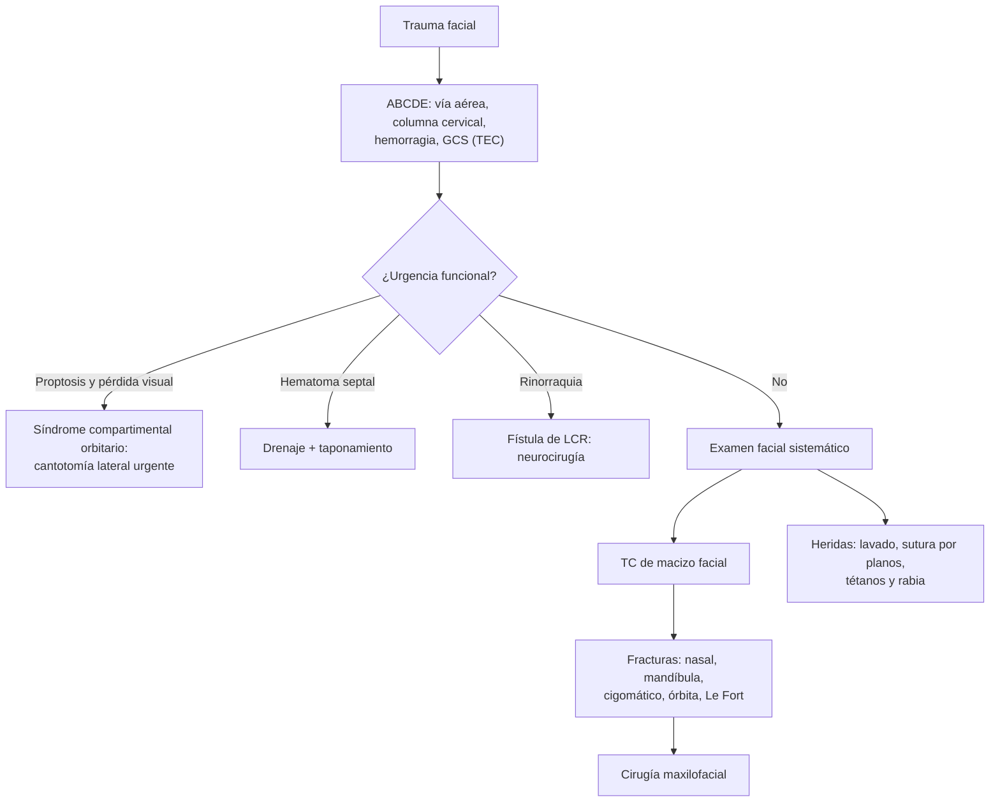

---
tags:
  - Cirugía
  - Urgencia
---

# Heridas de cara y trauma maxilofacial

**Subespecialidad**
Cirugía maxilofacial · Cirugía plástica · Trauma · Urgencia

**Guías principales**
ATLS, 10.ª edición (actualización resumida en 2019) · Revisión del manejo del trauma maxilofacial en urgencias (*World J Emerg Med* 2026) · Guía IDSA de infecciones de piel y partes blandas (2014): mordeduras

**Otras fuentes**
Recomendación del CAVEI sobre vacunación antirrábica posexposición (*Rev Chilena Infectol* 2025) · Ver [heridas menores y mordeduras](../piel-partes-blandas-y-quemaduras/heridas-menores-mordeduras-y-onicocriptosis.md)

**GES**
Sí, dentro del **politraumatizado grave** (N.° 48) y del **TEC moderado o grave** (N.° 49) cuando corresponde.

**EUNACOM**
4.01.2.014 Heridas de cara (diagnóstico específico, tratamiento inicial) · 4.01.2.015 Trauma maxilofacial (sospecha, tratamiento inicial)

**Revisado**
Octubre 2026

!!! abstract "Resumen en 60 segundos"
    - **Primero el ABCDE**: el trauma facial grave puede **obstruir la vía aérea** (sangrado, fracturas de mandíbula bilaterales, Le Fort) y se asocia a **TEC** y a **lesión cervical**.
    - **Heridas de cara**: la cara tiene **excelente irrigación** → cicatriza bien y se infecta poco; se pueden **suturar hasta 24 h** o más después.
        - **Lavado** abundante, **mínimo desbridamiento**, **sutura por planos** con monofilamento fino (**5-0 o 6-0**), afrontar primero los **bordes clave** (borde bermellón del labio, ceja, borde libre del párpado y de la nariz). **No rasurar la ceja.**
        - Retirar los puntos a los **5 días**.
        - **Derivar**: heridas del **párpado** con compromiso del borde libre o del canalículo, **nervio facial**, **conducto de Stenon**, pérdida de tejido, mordeduras extensas.
    - **Profilaxis antitetánica** según el esquema y **antirrábica** en las mordeduras de animales con riesgo (en Chile, sobre todo **murciélagos**).
    - **Fracturas**: **nasal** (la más frecuente), **mandíbula** (maloclusión), **cigomático** (aplanamiento, hipoestesia infraorbitaria), **órbita** (diplopía, enoftalmo, atrapamiento), **Le Fort** (movilidad del maxilar). Diagnóstico con **TC de macizo facial**.
    - **Urgencias**: **vía aérea**, **hemorragia**, **síndrome compartimental orbitario** (proptosis, pérdida visual: cantotomía lateral), **hematoma septal** (drenar), **atrapamiento muscular** en niños (trapdoor), fístula de LCR.

## Definición

- **Herida de cara**: solución de continuidad de la piel y los tejidos blandos faciales (cortante, contusa, lacerada, mordedura, abrasión).
- **Trauma maxilofacial**: lesión de los tejidos blandos y del esqueleto facial (huesos nasales, maxilar, cigomático, órbita, mandíbula, dientes).
- **Fracturas de Le Fort** (del tercio medio): separación del maxilar de la base del cráneo.
    - **Le Fort I**: horizontal, sobre los ápices dentales (el paladar se mueve solo).
    - **Le Fort II**: piramidal, incluye los huesos nasales (se mueve la nariz con el paladar).
    - **Le Fort III**: **disyunción craneofacial** (se mueve toda la cara).

## Epidemiología

### Mundial

- Causas principales: **agresiones**, **accidentes de tránsito**, **caídas** (adultos mayores), deportes y accidentes laborales; **mordeduras de perro** en niños (la cara es el sitio más frecuente en ellos).
- Predomina en **hombres jóvenes**; el **alcohol** está presente con frecuencia.
- La fractura **nasal** es la más frecuente, seguida de la **mandíbula** y el **cigomático**.
- Se asocia con frecuencia a **TEC**, **lesión de la columna cervical** y lesiones **oculares**.

### Chile

!!! chile "Datos nacionales"
    - No se encontraron series nacionales recientes publicadas sobre el trauma maxilofacial.
    - **Rabia**: el último caso humano por variante canina fue en **1972**; hoy el **principal reservorio** es el **murciélago** (*Tadarida brasiliensis*, ~ 92 % de las muestras positivas del ISP en 2023). En 2023 se administraron **81.864 primeras dosis** de vacuna antirrábica, y solo **43 %** completó el esquema (CAVEI, 2025).

## Etiología y factores de riesgo

| Lesión | Mecanismo típico |
|---|---|
| **Fractura nasal** | Golpe de puño, deporte |
| **Fractura de mandíbula** | Agresión, accidente; a menudo **en dos sitios** (anillo óseo: cóndilo contralateral) |
| **Fractura del cigomático** (malar) | Golpe lateral en el pómulo |
| **Fractura de la órbita** ("blow-out") | Objeto mayor que la órbita (pelota, puño): aumenta la presión y fractura el **piso** o la pared medial |
| **Le Fort** | **Alta energía** (accidente de tránsito, caída de altura) |
| **Heridas de cara** | Vidrios, agresiones con arma blanca, **mordeduras** (perro, humana), caídas |

**Factores de riesgo de complicaciones**: anticoagulantes, alcohol (dificulta la evaluación), mordeduras (infección), heridas contaminadas, diabetes, tabaco.

## Fisiopatología

- **Vía aérea**: las fracturas bilaterales del cuerpo mandibular dejan la lengua sin soporte (**cae hacia atrás**); las Le Fort desplazan el maxilar hacia atrás y abajo; el sangrado y los fragmentos dentales obstruyen.
- **Órbita**: un hematoma retrobulbar aumenta la presión dentro de la órbita → **síndrome compartimental orbitario** → isquemia del nervio óptico (pérdida visual irreversible en **~ 90–120 minutos**).
- **Fractura del piso orbitario**: el músculo **recto inferior** queda atrapado → limitación de la **mirada hacia arriba**, diplopía, y **reflejo oculocardíaco** (bradicardia, náuseas) en niños (fractura en "trampilla").
- **Hematoma septal**: separa el pericondrio del cartílago → **necrosis** del cartílago y **nariz en silla de montar**, o absceso.
- **Fractura de la lámina cribosa**: **rinorraquia** (fístula de LCR) → riesgo de **meningitis**.

*Figura 1. Enfoque del trauma facial. Esquema propio basado en el ATLS y Bavestrello Piccini (2026).*

## Clasificación

| Fractura | Signos clave |
|---|---|
| **Nasal** | Deformidad, crepitación, epistaxis, edema; buscar el **hematoma septal** |
| **Mandíbula** | **Maloclusión** dental, dolor al abrir la boca, **trismus**, escalón en la arcada, hipoestesia del labio inferior (nervio alveolar inferior), equimosis del piso de la boca |
| **Cigomático** | **Aplanamiento** del pómulo, escalón en el reborde infraorbitario, **hipoestesia** de la mejilla y el labio superior (nervio **infraorbitario**), trismus (arco cigomático), hemorragia subconjuntival |
| **Órbita (blow-out)** | **Diplopía** (sobre todo al mirar hacia arriba), **enoftalmo**, hipoestesia infraorbitaria, enfisema palpebral al sonarse |
| **Le Fort** | **Movilidad del maxilar** al traccionar los incisivos superiores, maloclusión (mordida abierta), cara alargada ("cara de plato"), equimosis periorbitaria bilateral, rinorraquia (II y III) |
| **Naso-órbito-etmoidal** | Telecanto traumático, rinorraquia |

**Heridas de cara**:

| Tipo | Manejo |
|---|---|
| **Abrasión** | Lavado, retirar cuerpos extraños (evitar el **tatuaje traumático**), cura húmeda |
| **Herida cortante simple** | Sutura primaria con monofilamento 5-0/6-0 o adhesivo tisular |
| **Herida contusa o con colgajo** | Desbridamiento mínimo, reposicionar el colgajo |
| **Mordedura** | Lavado intenso; **sutura primaria en la cara** (por estética) en la mayoría; antibiótico profiláctico; profilaxis antitetánica y antirrábica según el riesgo |
| **Herida compleja** (párpado, nervio facial, Stenon, oreja con cartílago expuesto, pérdida de tejido) | **Derivar** a cirugía plástica, maxilofacial u oftalmología |

## Clínica

- **Inspección**: asimetrías, edema, heridas, **equimosis periorbitaria** ("ojos de mapache") o **retroauricular** (Battle): fractura de base de cráneo.
- **Palpación ordenada** de arriba abajo: rebordes orbitarios, nariz, cigomas, maxilar, mandíbula; buscar **escalones**, **crepitación** y movilidad.
- **Ojos**: **agudeza visual**, pupilas, movimientos oculares (diplopía, atrapamiento), **proptosis**, presión ocular.
- **Nariz**: **hematoma septal** (masa violácea y fluctuante en el tabique), rinorraquia (líquido claro, "signo del halo").
- **Boca**: **oclusión** dental, dientes avulsionados o fracturados (buscar los que faltan: aspiración), heridas intraorales.
- **Nervios**: sensibilidad (infraorbitario, alveolar inferior) y **nervio facial** (mover la frente, cerrar los ojos, sonreír) **antes** de anestesiar.
- **Heridas de la mejilla**: evaluar el **conducto de Stenon** (línea del trago al labio superior) y el nervio facial.

## Diagnóstico

!!! guia "Puntos clave (ATLS; Bavestrello Piccini 2026)"
    - **Evaluación primaria (ABCDE)**: **vía aérea** (posición sentada e inclinado hacia adelante si está consciente y la columna lo permite, aspiración, intubación o **vía aérea quirúrgica** si no se puede intubar); **restricción del movimiento cervical**; control de la **hemorragia** (compresión, taponamiento nasal).
    - **TC de macizo facial** (sin contraste, con reconstrucciones): estándar para las fracturas faciales; con frecuencia junto con la **TC de cerebro y de columna cervical**.
    - **Radiografía** solo cuando no hay TC (ortopantomografía para la mandíbula).
    - **Evaluación oftalmológica** si hay trauma periorbitario, alteración visual o diplopía.
    - **Heridas**: explorar en profundidad buscando **cuerpos extraños** (radiografía si es vidrio), lesión del **nervio facial**, el **conducto de Stenon** y la **vía lagrimal**.

## Laboratorio

| Examen | Uso |
|---|---|
| **Hemoglobina**, grupo y Rh | Hemorragias importantes |
| **Coagulación** | Pacientes anticoagulados |
| **Beta-2 transferrina** en la secreción nasal | Confirma una **fístula de LCR** |
| **Alcoholemia** | Contexto médico-legal y evaluación neurológica |

## Imágenes

| Examen | Uso |
|---|---|
| **TC de macizo facial** | **Estándar** para las fracturas |
| **TC de cerebro y columna cervical** | Lesiones asociadas |
| **Ortopantomografía** | Mandíbula y dientes (si no hay TC) |
| **Radiografía de tórax** | Diente aspirado |

## Diagnóstico diferencial

| Hallazgo | Diferenciales |
|---|---|
| **Diplopía tras un trauma** | Fractura del piso orbitario con atrapamiento, edema, lesión de nervios craneales (III, IV, VI), lesión del globo |
| **Epistaxis tras un trauma** | Fractura nasal, fractura de base de cráneo, lesión de la arteria etmoidal |
| **Secreción nasal clara** | **Rinorraquia** (fístula de LCR) frente a rinorrea |
| **Hipoestesia de la mejilla** | Fractura del cigomático o del piso orbitario (nervio infraorbitario) |
| **Maloclusión** | Fractura de mandíbula, Le Fort, luxación de la articulación temporomandibular |

## Tratamiento

### Heridas de cara

!!! dosis "Técnica"
    - **Anestesia local**: lidocaína **1–2 %** (con epinefrina en la cara, salvo en zonas terminales a evaluar), o **bloqueos** (supraorbitario, infraorbitario, mentoniano) para no deformar los bordes.
    - **Lavado** abundante con **suero fisiológico** a presión.
    - **Desbridamiento mínimo** (la cara tiene poco tejido de sobra).
    - **Sutura por planos**: músculo y dermis con reabsorbible 4-0/5-0, piel con **monofilamento 5-0 o 6-0** (nylon o polipropileno).
    - **Puntos de referencia primero**: **borde bermellón** del labio, borde libre del párpado, **ceja** (no rasurarla: guía para alinear), ala nasal, hélix.
    - **Retiro de los puntos**: cara **5 días** (párpados 3–5 días).
    - **Fotoprotección** de la cicatriz por meses.
    - **Antibiótico profiláctico** en las **mordeduras**: **amoxicilina-ácido clavulánico** (875/125 mg c/12 h por 3–5 días); alternativas en alergia según la guía (ver [heridas menores y mordeduras](../piel-partes-blandas-y-quemaduras/heridas-menores-mordeduras-y-onicocriptosis.md)).
    - **Profilaxis antitetánica** según el esquema previo y **antirrábica** según el animal (ver la misma página).

### Fracturas

| Fractura | Manejo inicial |
|---|---|
| **Nasal** | Frío, analgesia; **drenar el hematoma septal**; reducción cerrada en los primeros días (antes de que consolide, ~ 7–10 días) o tras bajar el edema |
| **Mandíbula** | **Antibiótico** si es expuesta (comunica con la boca), analgesia, dieta líquida; **reducción y fijación** (placas o bloqueo intermaxilar) por cirugía maxilofacial |
| **Cigomático** | Cirugía si hay desplazamiento, trismus o alteración ocular |
| **Órbita** | No sonarse la nariz; antibiótico según el caso; cirugía si hay **atrapamiento** (urgente en niños con reflejo oculocardíaco), enoftalmo o diplopía persistente |
| **Le Fort** | Vía aérea, control del sangrado (taponamiento), estabilización; **cirugía** diferida en el paciente estable |
| **Fístula de LCR** | Cabecera elevada, no sonarse; la mayoría cierra espontáneamente; neurocirugía |

!!! alarma "Derivar de urgencia"
    - **Vía aérea amenazada** (sangrado, Le Fort, fracturas mandibulares bilaterales).
    - **Pérdida visual**, **proptosis** dolorosa y tensa: **síndrome compartimental orbitario** → **cantotomía lateral** inmediata.
    - **Atrapamiento** del recto inferior en un niño (náuseas, bradicardia).
    - **Hematoma septal**.
    - **Rinorraquia** o signos de fractura de base de cráneo.
    - Heridas con lesión del **nervio facial**, el **conducto de Stenon** o el **canalículo lagrimal**, o con **pérdida de tejido**.

## Complicaciones

- **Vía aérea**: obstrucción, aspiración.
- **Infección** de heridas (sobre todo mordeduras), osteomielitis de la mandíbula, sinusitis.
- **Ojo**: **ceguera** (síndrome compartimental, lesión del nervio óptico), diplopía persistente, **enoftalmo**.
- **Nariz**: **deformidad** en silla de montar (hematoma septal no drenado), obstrucción nasal.
- **Mandíbula**: maloclusión, pseudoartrosis, anquilosis temporomandibular (niños).
- **Nervios**: **parálisis facial**, hipoestesia.
- **Fístula** salival (Stenon), **meningitis** (fístula de LCR).
- **Cicatrices** hipertróficas o retráctiles, ectropión.

## Pronóstico y seguimiento

- Las **heridas de cara** bien tratadas tienen excelentes resultados estéticos por la irrigación.
- Las fracturas tratadas a tiempo recuperan la función y la forma; los retrasos dificultan la reducción.
- Control de la cicatriz, fotoprotección y masaje; seguimiento oftalmológico en las fracturas orbitarias.

## Perlas para el internado

!!! perla "Para recordar en la sala"
    - **ABCDE primero**: vía aérea y columna cervical antes que la cara.
    - **La cara se puede suturar tarde** (hasta 24 h o más) por su gran irrigación.
    - **Primero el borde bermellón**: un milímetro de desalineación se nota.
    - **Nunca rasurar la ceja.**
    - **Explorar el nervio facial antes de anestesiar.**
    - **Herida de la mejilla**: revisar el **conducto de Stenon** y el nervio facial.
    - **Hematoma septal = drenar** (o queda una nariz en silla de montar).
    - **Proptosis + pérdida visual = cantotomía lateral** en minutos.
    - **Diplopía al mirar hacia arriba + hipoestesia de la mejilla = fractura del piso orbitario.**
    - **Maloclusión = fractura de mandíbula** (buscar la segunda fractura).
    - **Mordedura de murciélago o contacto con murciélagos = profilaxis antirrábica.**

## Preguntas de repaso

??? repaso "1. Hombre de 25 años con una herida cortante de 3 cm que cruza el borde bermellón del labio superior, ocurrida hace 10 horas. ¿Cómo la sutura?"
    - Lavado abundante, anestesia (bloqueo infraorbitario para no deformar el labio).
    - **Primer punto en el borde bermellón** para alinearlo exactamente; luego sutura por planos (músculo orbicular con reabsorbible, piel con **monofilamento 6-0**).
    - Retiro de los puntos a los **5 días**; profilaxis antitetánica según el esquema.

??? repaso "2. Tras un golpe de puño, un paciente tiene la nariz desviada, epistaxis y una masa violácea fluctuante en el tabique. ¿Qué hace?"
    - **Hematoma septal**: **drenaje** inmediato y **taponamiento** anterior, con antibiótico.
    - Si no se drena: necrosis del cartílago, absceso y **nariz en silla de montar**. La fractura nasal se reduce después.

??? repaso "3. Niño de 12 años golpeado por una pelota en el ojo derecho, con náuseas, bradicardia, diplopía y limitación de la mirada hacia arriba, con poco edema. ¿Qué sospecha?"
    - **Fractura del piso orbitario en trampilla** con **atrapamiento** del recto inferior (reflejo oculocardíaco).
    - **TC de órbitas** y **cirugía urgente** (liberar el músculo para evitar la isquemia).

??? repaso "4. Tras un accidente, un paciente tiene proptosis tensa del ojo izquierdo, dolor intenso y caída rápida de la agudeza visual. ¿Qué debe hacer?"
    - **Síndrome compartimental orbitario** por un hematoma retrobulbar.
    - **Cantotomía lateral con cantolisis inmediata**, sin esperar la TC.

??? repaso "5. Mujer de 30 años despertó con un murciélago dentro de su dormitorio. No tiene heridas visibles. ¿Necesita profilaxis antirrábica en Chile?"
    - **Sí**: según la norma técnica chilena, la presencia de **murciélagos en la habitación** es una exposición que indica la **profilaxis antirrábica posexposición** (los murciélagos son el principal reservorio en Chile y su mordedura puede pasar inadvertida).

## Referencias

1. Bavestrello Piccini G, Sfondrini D, Tomulescu SA, et al. Modern management of maxillofacial trauma in the emergency department. *World J Emerg Med.* 2026;17(1):15–27. doi:[10.5847/wjem.j.1920-8642.2026.003](https://doi.org/10.5847/wjem.j.1920-8642.2026.003)
2. Galvagno SM, Nahmias JT, Young DA. Advanced Trauma Life Support® Update 2019: Management and Applications for Adults and Special Populations. *Anesthesiol Clin.* 2019;37(1):13–32. doi:[10.1016/j.anclin.2018.09.009](https://doi.org/10.1016/j.anclin.2018.09.009)
3. Stevens DL, Bisno AL, Chambers HF, et al. Practice guidelines for the diagnosis and management of skin and soft tissue infections: 2014 update by the Infectious Diseases Society of America. *Clin Infect Dis.* 2014;59(2):e10–e52. doi:[10.1093/cid/ciu296](https://doi.org/10.1093/cid/ciu296)
4. Luchsinger V, Leal P, Ibáñez C, et al. Recomendación del CAVEI sobre vacunación antirrábica post-exposición. *Rev Chilena Infectol.* 2025;42(4):419–423. doi:[10.4067/s0716-10182025000400159](https://doi.org/10.4067/s0716-10182025000400159)
