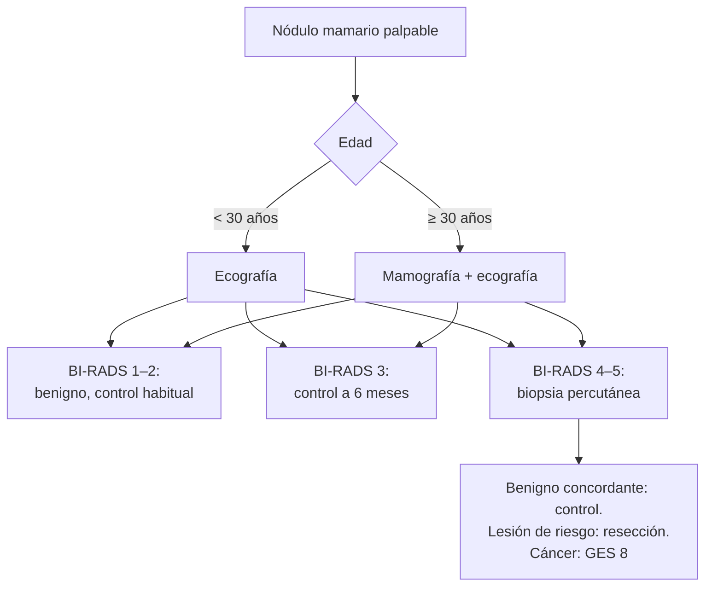

---
tags:
  - Cirugía
---

# Patología mamaria benigna

**Subespecialidad**
Patología mamaria · Cirugía general · Ginecología

**Guías principales**
Criterios de idoneidad del ACR: masa mamaria palpable, actualización 2022 (*J Am Coll Radiol* 2023) · Protocolo n.° 36 de la Academy of Breastfeeding Medicine: espectro de la mastitis (2022)

**Otras fuentes**
Sistema BI-RADS del ACR (5.ª edición) · Ver [cáncer de mama](cancer-de-mama.md)

**GES**
No (el **cáncer de mama** sí es GES, N.° 8).

**EUNACOM**
4.01.1.036 Patología mamaria benigna (diagnóstico específico, tratamiento inicial, seguimiento completo)

**Revisado**
Octubre 2026

!!! abstract "Resumen en 60 segundos"
    - **Lo primero ante cualquier hallazgo mamario: descartar un cáncer** con el **triple test**: examen clínico, **imagen** (ecografía en < 30–40 años; mamografía + ecografía en mayores) y **biopsia** si la imagen no es claramente benigna.
    - **Fibroadenoma**: mujer **joven**, nódulo **móvil**, **elástico**, bien delimitado e indoloro. BI-RADS 3: control; biopsia o resección si crece, es > 2–3 cm o hay dudas.
    - **Quiste**: nódulo **liso**, a veces doloroso, en la **perimenopausia**. Ecografía anecoica: no requiere nada (o **punción** si duele). Quiste **complejo**: biopsia.
    - **Mastalgia**: casi siempre **cíclica** y benigna; **tranquilizar**, sostén adecuado, AINE tópicos.
    - **Secreción por el pezón**: preocupa si es **espontánea**, **unilateral**, de **un solo conducto** y **sanguinolenta** o serosa (papiloma intraductal, cáncer). La **bilateral lechosa** es **galactorrea** (prolactina).
    - **Mastitis de la lactancia**: **seguir amamantando**, antiinflamatorios y, si no mejora en 12–24 h o es grave, **antibiótico** (cefadroxilo, cloxacilina). **Absceso**: **drenaje** (punción guiada por ecografía).
    - **Mastitis no puerperal** o **absceso subareolar** en fumadoras; **mastitis granulomatosa idiopática**. Toda "mastitis" que no responde: **descartar un carcinoma inflamatorio**.

## Definición

- **Patología mamaria benigna**: conjunto de lesiones no malignas de la mama (tumores benignos, quistes, cambios fibroquísticos, infecciones, alteraciones funcionales).
- **Fibroadenoma**: tumor **fibroepitelial** benigno (estroma y epitelio), el más frecuente en mujeres jóvenes.
- **Tumor filodes**: tumor fibroepitelial con estroma **celular**, de crecimiento rápido; benigno, limítrofe o maligno.
- **Cambios fibroquísticos**: quistes, fibrosis y adenosis; relacionados con las hormonas y muy frecuentes.
- **Papiloma intraductal**: proliferación epitelial dentro de un conducto, habitualmente **retroareolar**; causa principal de **secreción sanguinolenta**.
- **Lesiones de riesgo** (B3): hiperplasia ductal **atípica**, neoplasia **lobulillar**, cicatriz radial, lesiones papilares con atipia: aumentan el riesgo de cáncer y suelen requerir resección.

## Epidemiología

### Mundial

- La gran mayoría de las consultas mamarias (nódulos, dolor, secreción) se deben a condiciones **benignas**.
- **Fibroadenoma**: más frecuente entre los **15 y 35 años**.
- **Quistes**: más frecuentes entre los **35 y 50 años** (perimenopausia).
- **Mastitis**: afecta a una proporción importante de las mujeres que amamantan, sobre todo en las primeras semanas posparto.

### Chile

!!! chile "Datos nacionales"
    - No se encontraron datos nacionales recientes de prevalencia de la patología mamaria benigna.
    - Su importancia práctica es que el **cáncer de mama** es la **primera causa de muerte oncológica** en las mujeres chilenas (MINSAL), y todo hallazgo mamario debe estudiarse para descartarlo (ver [cáncer de mama](cancer-de-mama.md)).
    - El cáncer de mama tiene **GES** (N.° 8) desde la **sospecha**.

## Etiología y factores de riesgo

| Condición | Factores asociados |
|---|---|
| **Fibroadenoma** | Edad joven, estímulo **estrogénico**; crece en el embarazo y la lactancia |
| **Quistes y cambios fibroquísticos** | Hormonales; perimenopausia, terapia hormonal |
| **Mastalgia cíclica** | Hormonal (fase lútea) |
| **Mastalgia no cíclica** | Musculoesquelética (costocondritis), quistes, mastitis, fármacos, sostén inadecuado |
| **Mastitis de la lactancia** | **Estasis de leche** (vaciamiento incompleto, mal acople), grietas del pezón; *S. aureus* |
| **Absceso subareolar** (no puerperal) | **Tabaquismo**, ectasia ductal, metaplasia escamosa de los conductos |
| **Mastitis granulomatosa idiopática** | Mujeres jóvenes con partos recientes; *Corynebacterium* en algunos casos |
| **Ectasia ductal** | Perimenopausia; secreción espesa multicolor, bilateral |
| **Galactorrea** | **Prolactinoma**, fármacos (antipsicóticos, metoclopramida, domperidona), hipotiroidismo, embarazo |
| **Necrosis grasa** | **Trauma**, cirugía, radioterapia |

## Fisiopatología

- La mama responde a los ciclos de **estrógenos y progesterona**: proliferación del epitelio y edema del estroma en la fase lútea → **mastalgia cíclica** y cambios fibroquísticos.
- **Mastitis de la lactancia**: el problema inicial es **inflamatorio** por la estasis de leche (congestión, inflamación ductal); la **infección** bacteriana es secundaria. Mantener el drenaje de la leche es clave.
- **Absceso**: colección purulenta cuando la mastitis progresa; no se resuelve con antibióticos solos.

*Figura 1. Estudio del nódulo mamario palpable. Esquema propio basado en los criterios del ACR (2022) y el sistema BI-RADS.*

## Clasificación

**BI-RADS** (categoría de evaluación de las imágenes mamarias):

| Categoría | Significado | Conducta |
|---|---|---|
| **0** | Incompleto | Imágenes adicionales |
| **1** | Normal | Pesquisa habitual |
| **2** | **Benigno** (quiste simple, fibroadenoma calcificado) | Pesquisa habitual |
| **3** | **Probablemente benigno** (riesgo de cáncer ≤ 2 %) | **Control a corto plazo** (6 meses) |
| **4** (A, B, C) | **Sospechoso** | **Biopsia** |
| **5** | **Altamente sugerente** de cáncer | **Biopsia** |
| **6** | Cáncer confirmado por biopsia | Tratamiento |

## Clínica

| Condición | Características |
|---|---|
| **Fibroadenoma** | Nódulo **firme-elástico**, **muy móvil** ("ratón de la mama"), bien delimitado, indoloro; 1–3 cm |
| **Tumor filodes** | Nódulo que **crece rápido**, a menudo **> 3 cm**; mujeres de 40–50 años |
| **Quiste** | Nódulo **liso**, móvil, a veces **doloroso** y de aparición brusca; perimenopausia |
| **Cambios fibroquísticos** | Mamas **nodulares**, dolorosas antes de la menstruación, bilateral |
| **Mastalgia cíclica** | Dolor **bilateral**, difuso, premenstrual, que cede con la menstruación |
| **Papiloma intraductal** | Secreción **sanguinolenta** o serosa por **un conducto**, a veces masa retroareolar |
| **Ectasia ductal** | Secreción espesa, verde-negruzca, **bilateral** y de varios conductos; retracción del pezón (diferencial con el cáncer) |
| **Mastitis de la lactancia** | Zona **eritematosa**, caliente y **dolorosa** en una mama, **fiebre** y malestar, durante la lactancia |
| **Absceso** | Masa **fluctuante** y dolorosa, fiebre persistente pese al antibiótico |
| **Necrosis grasa** | Nódulo duro e irregular tras un trauma; puede imitar un cáncer (con retracción y calcificaciones) |

**Signos que sugieren cáncer** (derivar): nódulo **duro**, **irregular**, **fijo**, **retracción** de la piel o del pezón, **piel de naranja**, adenopatías axilares, secreción sanguinolenta espontánea, eritema que no responde a antibióticos.

## Diagnóstico

!!! guia "Puntos clave (ACR 2022)"
    - **Triple test**: **examen clínico** + **imagen** + **biopsia** (si la imagen no es benigna). Si los tres son concordantes con benignidad, se puede controlar.
    - **Mujer < 30 años** con nódulo palpable: **ecografía** primero.
    - **Mujer ≥ 30 años** (algunas guías: ≥ 40): **mamografía diagnóstica** + **ecografía**.
    - **Biopsia percutánea** guiada por imagen (**core** o biopsia con aguja gruesa) en las lesiones BI-RADS 4–5; preferible a la biopsia quirúrgica.
    - **Secreción por el pezón patológica** (espontánea, unilateral, uniductal, sanguinolenta o serosa): mamografía y **ecografía** retroareolar; RM o ductografía según el caso.
    - **Galactorrea** (bilateral, lechosa): test de embarazo, **prolactina**, TSH, revisar fármacos (ver [hipófisis](../../endocrinologia/hipofisis-tumores-hipopituitarismo-e-hiperprolactinemia.md)).
    - **Absceso**: **ecografía** para confirmar la colección y guiar el drenaje.

## Laboratorio

| Examen | Uso |
|---|---|
| **β-hCG** | Toda mujer en edad fértil con cambios mamarios o galactorrea |
| **Prolactina**, TSH | **Galactorrea** |
| **Cultivo de la leche o del pus** | Mastitis grave, recurrente o que no responde; absceso |
| **Citología de la secreción** | Utilidad limitada; no reemplaza la imagen |

## Imágenes

| Examen | Uso |
|---|---|
| **Ecografía mamaria** | Primera en **< 30 años** y en el embarazo y la lactancia; distingue **quiste** de **sólido**; guía de biopsias y drenajes |
| **Mamografía** | **≥ 30–40 años**; microcalcificaciones, distorsión |
| **RM mamaria** | Casos seleccionados (secreción patológica con imagen negativa, implantes, alto riesgo) |
| **Biopsia percutánea** | Diagnóstico histológico de las lesiones sospechosas |

## Diagnóstico diferencial

| Hallazgo | Benigno | Maligno a descartar |
|---|---|---|
| **Nódulo** | Fibroadenoma, quiste, filodes benigno, lipoma, necrosis grasa | **Carcinoma**, filodes maligno, linfoma |
| **Mama roja y caliente** | **Mastitis**, absceso | **Carcinoma inflamatorio** (sin fiebre, piel de naranja, no responde a antibióticos) |
| **Secreción sanguinolenta** | **Papiloma intraductal**, ectasia ductal | **Carcinoma** intraductal o invasor |
| **Retracción del pezón** | Ectasia ductal, congénita | **Carcinoma** (si es reciente y unilateral) |
| **Lesión eccematosa del pezón** | Eccema (suele respetar el pezón, bilateral, prurito) | **Enfermedad de Paget** del pezón (unilateral, comienza en el pezón) |

## Tratamiento

| Condición | Tratamiento |
|---|---|
| **Fibroadenoma** típico (BI-RADS 3) | **Control** clínico y ecográfico (6 meses, luego anual); **biopsia** si hay dudas; **resección** si crece, es > 2–3 cm, da síntomas o la paciente lo prefiere |
| **Tumor filodes** | **Resección con márgenes** (no basta la enucleación) |
| **Quiste simple** | Nada; **punción-aspiración** si es doloroso (si el líquido es sanguinolento o el quiste recurre o queda masa residual: estudio) |
| **Quiste complejo** | **Biopsia** |
| **Mastalgia** | **Tranquilizar** (descartar el cáncer), **sostén** adecuado, **AINE tópicos**; revisar los fármacos; casos graves y refractarios: derivar (tamoxifeno o danazol en dosis bajas, con muchos efectos adversos). La cafeína y los suplementos tienen evidencia escasa |
| **Papiloma intraductal** | **Resección** (escisión del conducto) |
| **Lesiones de riesgo (B3)** | Generalmente **resección** y vigilancia |
| **Galactorrea** | Tratar la causa (suspender el fármaco, agonista dopaminérgico en el prolactinoma) |
| **Necrosis grasa** | Biopsia si hay dudas; luego observación |

### Mastitis de la lactancia (Academy of Breastfeeding Medicine 2022)

!!! dosis "Manejo"
    - **Seguir amamantando** (o extrayendo la leche), sin vaciar en exceso; **corregir el acople**.
    - **Frío local**, **AINE** (**ibuprofeno**) y paracetamol; evitar los masajes profundos.
    - **Antibiótico** si los síntomas no mejoran en **12–24 h** o la paciente está grave: cobertura de ***S. aureus*** (**cefadroxilo** o **cefalexina 500 mg c/6–12 h VO**, o **cloxacilina/dicloxacilina**) por **10–14 días**; **clindamicina** si hay alergia o se sospecha SARM.
    - **Absceso**: **drenaje** por **punción-aspiración guiada por ecografía** (repetida si es necesario) o drenaje quirúrgico; la lactancia puede continuar.

### Mastitis no puerperal

- **Absceso subareolar**: antibióticos (cobertura de anaerobios), drenaje, **dejar de fumar**; si recurre (fístula), **resección de los conductos**.
- **Mastitis granulomatosa idiopática**: diagnóstico por **biopsia**; tratamiento con observación, corticoides o metotrexato.

!!! alarma "Derivar a especialista (y GES desde la sospecha de cáncer)"
    - Nódulo **sólido** BI-RADS 4–5, **duro**, irregular o fijo.
    - **Retracción** de la piel o del pezón, **piel de naranja**, adenopatías axilares.
    - **Secreción sanguinolenta** espontánea y uniductal.
    - **Mastitis que no responde** a 1–2 semanas de antibiótico o fuera de la lactancia sin causa clara: descartar un **carcinoma inflamatorio**.
    - Lesión eccematosa **unilateral** del pezón: descartar **Paget**.

## Complicaciones

- **Mastitis**: **absceso**, destete precoz, sepsis (raro).
- **Absceso subareolar**: **fístula** periareolar, recurrencia.
- **Fibroadenoma**: crecimiento (fibroadenoma gigante o juvenil), confusión diagnóstica con un filodes.
- **Tumor filodes**: **recidiva local** si los márgenes son insuficientes.
- **Lesiones de riesgo**: mayor riesgo de cáncer a futuro.

## Pronóstico y seguimiento

- La gran mayoría tiene un **excelente pronóstico**.
- **BI-RADS 3**: control a los 6 meses y luego seguimiento por 2 años; si se mantiene estable, se considera benigno.
- Las mujeres con **lesiones atípicas** tienen un riesgo aumentado de cáncer y requieren una vigilancia más estrecha.
- Mantener la **pesquisa** de cáncer de mama según la edad (ver [cáncer de mama](cancer-de-mama.md)).

## Perlas para el internado

!!! perla "Para recordar en la sala"
    - **Triple test**: clínica + imagen + biopsia. Si algo no concuerda, **biopsia**.
    - **< 30 años: ecografía. ≥ 30–40 años: mamografía + ecografía.**
    - **Fibroadenoma**: joven, móvil, elástico; **filodes**: crece rápido y es grande.
    - **Quiste simple anecoico = BI-RADS 2**: no hace falta nada más.
    - **Mastitis de la lactancia: no suspender la lactancia.** Antibiótico antiestafilocócico si no mejora en 12–24 h.
    - **Fiebre persistente con masa fluctuante = absceso**: drenaje guiado por ecografía.
    - **"Mastitis" sin fiebre que no responde, con piel de naranja = carcinoma inflamatorio.**
    - **Secreción sanguinolenta uniductal espontánea**: papiloma o cáncer → imagen y derivación.
    - **Galactorrea bilateral**: β-hCG, prolactina, TSH y fármacos.

## Preguntas de repaso

??? repaso "1. Mujer de 22 años con un nódulo de 2 cm en la mama derecha, firme, elástico, muy móvil e indoloro. ¿Qué examen pide y cuál es el diagnóstico más probable?"
    - **Ecografía mamaria** (menor de 30 años).
    - **Fibroadenoma**. Si la ecografía es típica (BI-RADS 3): **control** a los 6 meses; biopsia o resección si crece o hay dudas.

??? repaso "2. Mujer de 28 años que amamanta a su hijo de 3 semanas. Tiene fiebre de 38,8 °C y una zona roja, caliente y dolorosa en la mama izquierda desde ayer. ¿Qué indica?"
    - **Mastitis de la lactancia**.
    - **Seguir amamantando**, corregir el acople, frío local e **ibuprofeno**.
    - Si no mejora en 12–24 h (o ya está muy sintomática): **cefadroxilo** o cloxacilina por 10–14 días. Ecografía si aparece una masa (absceso).

??? repaso "3. La misma paciente vuelve a los 5 días con fiebre persistente pese al antibiótico y una masa fluctuante de 3 cm. ¿Qué hace?"
    - **Absceso mamario**.
    - **Ecografía** y **drenaje por punción-aspiración guiada** (o drenaje quirúrgico), cultivo y ajuste del antibiótico. Puede seguir amamantando.

??? repaso "4. Mujer de 45 años con secreción sanguinolenta espontánea por un solo conducto de la mama derecha. El examen no muestra masas. ¿Qué sospecha y cómo la estudia?"
    - **Secreción patológica**: lo más frecuente es un **papiloma intraductal**, pero hay que descartar un **cáncer**.
    - **Mamografía** y **ecografía** retroareolar; RM o ductografía si son negativas; derivar para la **resección del conducto**.

??? repaso "5. Mujer de 60 años, no lactante, con la mama derecha roja, engrosada y con piel de naranja desde hace 3 semanas, sin fiebre, que no mejoró con antibióticos. ¿Qué debe descartar?"
    - **Carcinoma inflamatorio de mama**.
    - **Mamografía**, **ecografía** y **biopsia** (incluida la piel) con urgencia; activar el **GES de cáncer de mama** desde la sospecha.

## Referencias

1. Klein KA, Kocher M, Lourenco AP, et al. ACR Appropriateness Criteria® Palpable Breast Masses: 2022 Update. *J Am Coll Radiol.* 2023;20(5S):S146–S163. doi:[10.1016/j.jacr.2023.02.013](https://doi.org/10.1016/j.jacr.2023.02.013)
2. Mitchell KB, Johnson HM, Rodríguez JM, et al. Academy of Breastfeeding Medicine Clinical Protocol #36: The Mastitis Spectrum, Revised 2022. *Breastfeed Med.* 2022;17(5):360–376. [PubMed 35576513](https://pubmed.ncbi.nlm.nih.gov/35576513/)
3. American College of Radiology. ACR BI-RADS Atlas, 5th edition. Reston: ACR; 2013. [acr.org](https://www.acr.org/Clinical-Resources/Clinical-Tools-and-Reference/Reporting-and-Data-Systems/BI-RADS)
4. Ministerio de Salud de Chile. Ministro de Salud en el Día Internacional contra el Cáncer de Mama: "Esta es una enfermedad que podemos prevenir". [minsal.cl](https://www.minsal.cl/ministro-de-salud-en-el-dia-internacional-contra-el-cancer-de-mama-esta-es-una-enfermedad-que-podemos-prevenir/)
