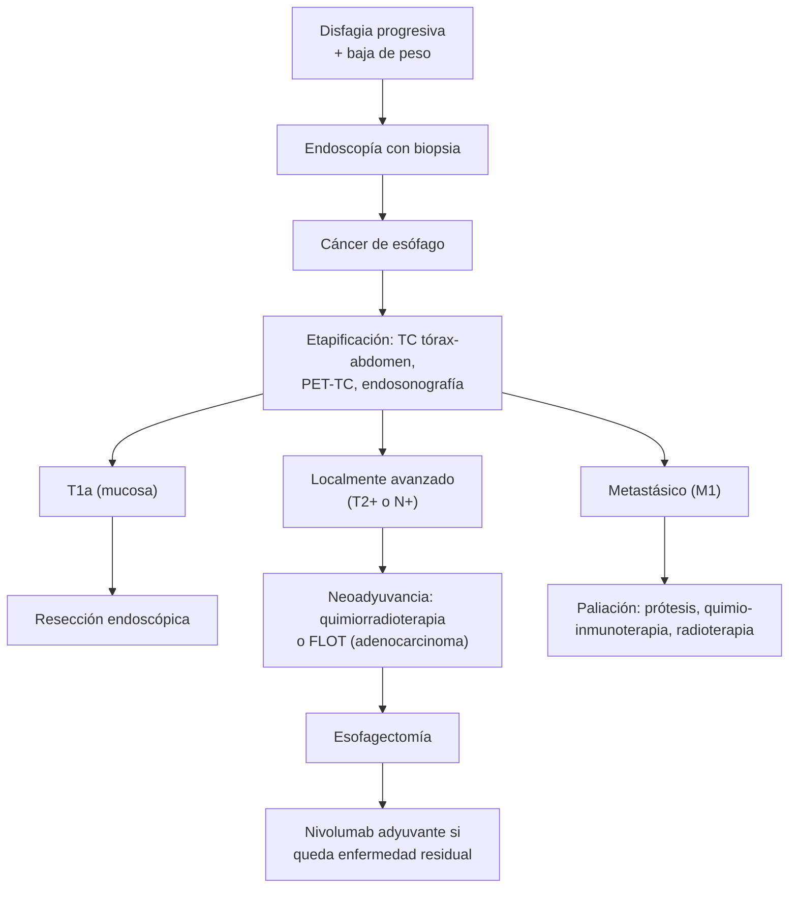

---
tags:
  - Cirugía
---

# Cáncer de esófago y divertículos esofágicos

**Subespecialidad**
Cirugía digestiva alta · Oncología · Gastroenterología

**Guías principales**
Guía ESMO de cáncer de esófago (*Ann Oncol* 2022) · Guía ESGE de manejo endoscópico de los trastornos motores, parte 2: divertículo de Zenker (*Endoscopy* 2020)

**Otras fuentes**
Ensayos CROSS (*N Engl J Med* 2012), CheckMate 577 (2021) y ESOPEC (2025)

**GES**
No: el cáncer de esófago no tiene garantía GES específica (ver la nota en [disfagia](../../gastroenterologia/disfagia-y-afagia-aguda.md)).

**EUNACOM**
4.01.1.005 Cáncer de esófago (sospecha, inicial) · 4.01.1.002 Divertículos esofágicos (sospecha, inicial)

**Revisado**
Octubre 2026

!!! abstract "Resumen en 60 segundos"
    - **Cáncer de esófago**: **disfagia progresiva** (primero sólidos, luego líquidos) y **baja de peso** en un adulto mayor = **endoscopía con biopsia** sin demora.
    - Dos tipos: **escamoso** (esófago **medio y superior**; **tabaco**, **alcohol**, líquidos muy calientes, cáusticos, acalasia) y **adenocarcinoma** (esófago **distal** y unión gastroesofágica; **reflujo**, **Barrett**, **obesidad**).
    - Se diagnostica **tarde**: alta letalidad. Etapificación con **TC**, **PET-TC** y **endosonografía**.
    - **Precoz** (T1a): **resección endoscópica**. **Localmente avanzado**: tratamiento **neoadyuvante** (quimiorradioterapia tipo CROSS, o quimioterapia perioperatoria FLOT en el adenocarcinoma) y **esofagectomía**. **Metastásico**: paliación de la disfagia (**prótesis**) y quimioinmunoterapia.
    - **Divertículo de Zenker**: adulto mayor con **disfagia alta**, **regurgitación** de comida no digerida, **halitosis**, ruido de gorgoteo y **aspiraciones**. Diagnóstico: **esofagograma**. Tratamiento si da síntomas: **diverticulotomía endoscópica** o cirugía.
    - **Divertículo epifrénico**: asociado a un **trastorno motor** (acalasia): tratar la causa.

## Definición

- **Cáncer de esófago**: neoplasia maligna del epitelio esofágico.
    - **Carcinoma escamoso** (espinocelular): del epitelio plano; tercio superior y medio.
    - **Adenocarcinoma**: del epitelio columnar metaplásico (**esófago de Barrett**); tercio inferior y unión gastroesofágica.
- **Divertículo esofágico**: evaginación sacular de la pared esofágica.
    - **Por pulsión** (falsos: solo mucosa y submucosa): por aumento de la presión intraluminal contra un punto débil. **Zenker** (faringoesofágico) y **epifrénico**.
    - **Por tracción** (verdaderos: todas las capas): por la retracción de ganglios mediastínicos inflamados. **Medioesofágico**.

## Epidemiología

### Mundial

- El cáncer de esófago está entre las causas principales de **muerte por cáncer** en el mundo, con gran variación geográfica.
- El **escamoso** predomina en Asia, África oriental y Sudamérica; el **adenocarcinoma** aumentó en los países de altos ingresos (obesidad y reflujo) y hoy es el más frecuente en ellos.
- Es más frecuente en **hombres** y después de los **60 años**.
- **Divertículo de Zenker**: raro; típico de **hombres** mayores de **60–70 años**.

### Chile

!!! chile "Datos nacionales"
    - Según GLOBOCAN 2020 (citado por la Fundación Arturo López Pérez), hay **~ 700 casos nuevos** y **más de 600 muertes** al año por cáncer de esófago en Chile: es de **alta letalidad** porque se diagnostica tarde.
    - Los factores de riesgo locales son el **tabaco**, el **alcohol**, el consumo de **líquidos muy calientes** (mate, té), el reflujo y la obesidad.
    - No tiene garantía GES específica; el Ministerio de Salud anunció en 2026 la incorporación progresiva de todos los cánceres en el próximo decreto GES.

## Etiología y factores de riesgo

| Carcinoma escamoso | Adenocarcinoma |
|---|---|
| **Tabaco** y **alcohol** (sinérgicos) | **ERGE** crónica y **esófago de Barrett** (ver [ERGE y Barrett](../../gastroenterologia/reflujo-gastroesofagico.md)) |
| **Líquidos muy calientes** | **Obesidad** central |
| **Ingestión previa de cáusticos** (ver [esofagitis cáustica](esofagitis-caustica.md)) | Tabaco |
| **Acalasia** | Sexo masculino, raza blanca |
| Dieta pobre en frutas y verduras, nitrosaminas | |
| **Tilosis**, síndrome de Plummer-Vinson, cáncer de cabeza y cuello previo, radioterapia torácica | |

| Divertículo | Mecanismo |
|---|---|
| **Zenker** | **Pulsión** por una disfunción del **esfínter esofágico superior** (músculo cricofaríngeo poco distensible) que empuja la mucosa por el **triángulo de Killian** (punto débil posterior entre el constrictor inferior de la faringe y el cricofaríngeo) |
| **Medioesofágico** | **Tracción** por ganglios mediastínicos inflamados (**tuberculosis**, histoplasmosis); o pulsión por un trastorno motor |
| **Epifrénico** | **Pulsión** sobre el esfínter esofágico inferior; asociado a **acalasia** u otro trastorno motor |

## Fisiopatología

- **Escamoso**: los carcinógenos (tabaco, alcohol, calor) dañan el epitelio plano → **displasia** → carcinoma.
- **Adenocarcinoma**: el reflujo crónico produce **metaplasia intestinal** (Barrett) → **displasia** de bajo y alto grado → adenocarcinoma.
- El esófago **no tiene serosa** y tiene una rica red **linfática** submucosa → **invasión local** y metástasis **ganglionares precoces**; por eso el pronóstico es malo.
- La **disfagia** aparece cuando la luz se reduce mucho: la enfermedad suele estar avanzada al diagnóstico.

*Figura 1. Enfoque del cáncer de esófago según la etapa. Esquema propio basado en la guía ESMO 2022 y los ensayos CROSS, CheckMate 577 y ESOPEC.*

## Clasificación

**Etapificación TNM (simplificada)**:

| Categoría | Significado práctico |
|---|---|
| **Tis / T1a** | Displasia de alto grado o invasión de la **mucosa**: **resección endoscópica** |
| **T1b** | Invasión de la **submucosa**: esofagectomía (riesgo de ganglios) |
| **T2–T3** | Muscular propia o adventicia: **neoadyuvancia + cirugía** |
| **T4** | Estructuras vecinas (pleura, pericardio, aorta, tráquea): T4b irresecable |
| **N+** | Ganglios regionales: neoadyuvancia + cirugía |
| **M1** | Metástasis a distancia (hígado, pulmón, hueso, ganglios no regionales): **paliación** |

**Divertículos esofágicos**:

| | **Zenker** | **Medioesofágico** | **Epifrénico** |
|---|---|---|---|
| **Ubicación** | Unión faringoesofágica (posterior) | Tercio medio | 10 cm distales |
| **Mecanismo** | Pulsión (falso) | Tracción (verdadero) | Pulsión (falso) |
| **Asociación** | Disfunción del cricofaríngeo | TBC, histoplasmosis | **Acalasia**, trastornos motores |
| **Síntomas** | Frecuentes | Habitualmente **ninguno** | Según el trastorno motor |

## Clínica

- **Cáncer de esófago**:
    - **Disfagia progresiva** para **sólidos** y luego **líquidos** (el síntoma clave).
    - **Baja de peso**, anorexia, odinofagia.
    - Dolor retroesternal, regurgitación.
    - **Disfonía** (compromiso del nervio laríngeo recurrente), **tos con la deglución** (**fístula traqueoesofágica**), hematemesis, adenopatía **supraclavicular**.
- **Divertículo de Zenker**:
    - **Disfagia orofaríngea** (alta), **regurgitación** de alimentos **no digeridos** horas después de comer.
    - **Halitosis**, **gorgoteo** en el cuello, masa cervical que se reduce con la presión.
    - **Tos** y **neumonía aspirativa** (ver [disfagia](../../gastroenterologia/disfagia-y-afagia-aguda.md)), baja de peso.

## Diagnóstico

!!! guia "Puntos clave (ESMO 2022, ESGE 2020)"
    - **Disfagia de reciente comienzo** en un adulto, sobre todo con baja de peso o anemia: **endoscopía digestiva alta con biopsias** sin demora.
    - **Etapificación**: **TC de tórax y abdomen** con contraste; **PET-TC** en los candidatos a tratamiento curativo; **endosonografía** para el T y el N; **broncoscopía** en los tumores del tercio superior y medio (invasión de la vía aérea).
    - Evaluación de la **condición física** y **nutricional** antes del tratamiento: la esofagectomía es una cirugía mayor.
    - **Zenker**: **esofagograma con bario** (estudio de elección); la endoscopía se hace con cuidado (riesgo de **perforación** al entrar en el divertículo) para descartar un cáncer.

## Laboratorio

| Examen | Uso |
|---|---|
| **Hemograma** | Anemia (sangrado crónico) |
| **Albúmina**, prealbúmina | **Desnutrición** (frecuente) |
| **Función renal y hepática** | Antes de la quimioterapia y la cirugía |
| **Calcio** | Hipercalcemia (escamoso avanzado) |
| **HER2 y PD-L1** en la biopsia | Terapias dirigidas e inmunoterapia en la enfermedad avanzada |

## Imágenes

| Examen | Uso |
|---|---|
| **Endoscopía con biopsia** | **Diagnóstico** del cáncer |
| **TC de tórax y abdomen** | Extensión local y metástasis |
| **PET-TC** | Metástasis ocultas antes de la cirugía |
| **Endosonografía** | Profundidad (T) y ganglios (N) |
| **Esofagograma** | **Divertículos** (Zenker), estenosis, fístula traqueoesofágica |

## Diagnóstico diferencial

| Disfagia esofágica progresiva | Claves |
|---|---|
| **Cáncer de esófago** | Adulto mayor, rápida progresión, **baja de peso** |
| **Estenosis péptica** | Reflujo de larga data, progresión lenta |
| **Acalasia** y pseudoacalasia | Disfagia para **sólidos y líquidos** desde el inicio; "**pico de pájaro**"; la pseudoacalasia es un cáncer de la unión que imita a la acalasia |
| **Anillo de Schatzki**, membranas | Disfagia intermitente con la carne |
| **Esofagitis eosinofílica** | Joven atópico, impactación alimentaria |
| **Compresión extrínseca** | Masas mediastínicas, aorta |
| **Divertículo de Zenker** | Disfagia **alta**, regurgitación tardía, halitosis |

## Tratamiento

### Cáncer de esófago

| Etapa | Tratamiento |
|---|---|
| **Tis–T1a** | **Resección endoscópica** (mucosectomía o disección submucosa) ± ablación del Barrett residual |
| **T1b N0** | **Esofagectomía** (resección endoscópica en casos muy seleccionados) |
| **Localmente avanzado, adenocarcinoma** | **Quimioterapia perioperatoria FLOT** (en el ESOPEC fue superior a la quimiorradioterapia CROSS en sobrevida) o **quimiorradioterapia neoadyuvante** + **esofagectomía** |
| **Localmente avanzado, escamoso** | **Quimiorradioterapia neoadyuvante** (CROSS: carboplatino + paclitaxel + 41,4 Gy) + **esofagectomía**, o **quimiorradioterapia definitiva** (sobre todo en el esófago cervical) |
| **Enfermedad residual tras neoadyuvancia y cirugía** | **Nivolumab adyuvante** (CheckMate 577) |
| **Metastásico** | **Quimioterapia** (platino y fluoropirimidina) con **inmunoterapia** (anti-PD-1) según el PD-L1, trastuzumab si es HER2 positivo; **paliación** |

- **Esofagectomía**: transtorácica (Ivor Lewis) o transhiatal, abierta o mínimamente invasiva, con **ascenso gástrico**; en centros de alto volumen.
- **Paliación de la disfagia**: **prótesis metálica autoexpandible**, braquiterapia o radioterapia; **gastrostomía** o yeyunostomía para la nutrición.
- **Fístula traqueoesofágica**: prótesis esofágica (y/o traqueal) recubierta.
- **Soporte nutricional** en todas las etapas.

### Divertículos

- **Zenker asintomático o pequeño**: observación.
- **Zenker sintomático**: **diverticulotomía endoscópica** (sección del septo con el músculo cricofaríngeo, con endoscopio flexible o rígido) o **cirugía abierta** (**miotomía del cricofaríngeo** con diverticulectomía o diverticulopexia).
- **Medioesofágico**: casi nunca requiere tratamiento.
- **Epifrénico sintomático**: tratar el **trastorno motor** (**miotomía** de Heller con fundoplicatura) más diverticulectomía.

!!! alarma "Derivar con prioridad"
    - **Disfagia progresiva** con **baja de peso**, anemia, hematemesis o vómitos persistentes en un adulto: **endoscopía preferente**.
    - **Tos al tragar** en un paciente con cáncer de esófago (fístula traqueoesofágica).
    - **Afagia** (no puede tragar ni la saliva): urgencia.
    - **Neumonías aspirativas** a repetición en un adulto mayor con disfagia alta (Zenker).

## Complicaciones

- **Cáncer de esófago**: **desnutrición**, **fístula traqueoesofágica**, neumonía aspirativa, hemorragia, obstrucción completa, metástasis.
- **Esofagectomía**: **filtración de la anastomosis**, neumonía, quilotórax, lesión del laríngeo recurrente, estenosis de la anastomosis, reflujo y síndrome de dumping; mortalidad baja en los centros de alto volumen.
- **Zenker**: **neumonía aspirativa**, desnutrición, **perforación** durante la endoscopía o el paso de una sonda, raramente cáncer dentro del divertículo.

## Pronóstico y seguimiento

- **Malo en general** porque se diagnostica tarde; la sobrevida depende de la **etapa**. Las lesiones **precoces** tratadas por endoscopía tienen muy buen pronóstico.
- La **neoadyuvancia + cirugía** mejoró la sobrevida en la enfermedad localmente avanzada.
- Seguimiento clínico, nutricional y con imágenes según la etapa; vigilancia endoscópica del **Barrett** (ver [ERGE y Barrett](../../gastroenterologia/reflujo-gastroesofagico.md)).
- **Zenker**: buena respuesta al tratamiento; puede recurrir tras el tratamiento endoscópico.

## Perlas para el internado

!!! perla "Para recordar en la sala"
    - **Disfagia progresiva + baja de peso en un adulto mayor = cáncer de esófago** hasta demostrar lo contrario: endoscopía con biopsia.
    - **Escamoso: tercio medio, tabaco y alcohol. Adenocarcinoma: tercio distal, reflujo, Barrett y obesidad.**
    - **Disfonía o tos al tragar** en un cáncer de esófago: invasión del recurrente o **fístula traqueoesofágica**.
    - **Regurgitación de comida no digerida + halitosis + gorgoteo** en un adulto mayor = **Zenker**: esofagograma.
    - **Cuidado al pasar una sonda o un endoscopio** en un paciente con Zenker: perforación.
    - **Divertículo epifrénico**: buscar una **acalasia**.

## Preguntas de repaso

??? repaso "1. Hombre de 68 años, fumador y bebedor, con disfagia para sólidos de 3 meses que ya alcanza a los líquidos y baja de 9 kg. ¿Qué sospecha y qué examen pide?"
    - **Cáncer de esófago** (probablemente **escamoso** por el tabaco y el alcohol).
    - **Endoscopía digestiva alta con biopsias**; luego etapificación con **TC**, PET-TC y endosonografía.

??? repaso "2. Hombre de 60 años, obeso, con reflujo de 20 años y esófago de Barrett, con un adenocarcinoma del esófago distal T3N1M0. ¿Cuál es el tratamiento?"
    - Enfermedad **localmente avanzada**: **quimioterapia perioperatoria FLOT** (o quimiorradioterapia neoadyuvante) seguida de **esofagectomía**.
    - Soporte **nutricional**. Si queda enfermedad residual tras la neoadyuvancia y la cirugía: **nivolumab adyuvante**.

??? repaso "3. Hombre de 78 años con disfagia alta, regurgitación de comida que comió horas antes, halitosis y dos neumonías en el último año. ¿Diagnóstico y examen de elección?"
    - **Divertículo de Zenker**.
    - **Esofagograma con bario**. Tratamiento: **diverticulotomía endoscópica** o miotomía del cricofaríngeo con diverticulectomía.

??? repaso "4. Paciente con un cáncer de esófago medio avanzado que presenta tos cada vez que toma líquidos y una neumonía. ¿Qué complicación sospecha y cómo se trata?"
    - **Fístula traqueoesofágica**.
    - Ayuno oral, antibióticos y **prótesis esofágica recubierta** (± traqueal); nutrición por gastrostomía o yeyunostomía.

??? repaso "5. Mujer de 50 años con un divertículo epifrénico sintomático en el esofagograma. ¿Qué estudio adicional pide y por qué?"
    - **Manometría esofágica** (de alta resolución): los divertículos epifrénicos se asocian a **trastornos motores**, sobre todo a la **acalasia**.
    - El tratamiento incluye la **miotomía** además de la diverticulectomía.

## Referencias

1. Obermannová R, Alsina M, Cervantes A, et al. Oesophageal cancer: ESMO Clinical Practice Guideline for diagnosis, treatment and follow-up. *Ann Oncol.* 2022;33(10):992–1004. doi:[10.1016/j.annonc.2022.07.003](https://doi.org/10.1016/j.annonc.2022.07.003)
2. van Hagen P, Hulshof MCCM, van Lanschot JJB, et al. Preoperative Chemoradiotherapy for Esophageal or Junctional Cancer. *N Engl J Med.* 2012;366(22):2074–2084. doi:[10.1056/NEJMoa1112088](https://doi.org/10.1056/NEJMoa1112088)
3. Kelly RJ, Ajani JA, Kuzdzal J, et al. Adjuvant Nivolumab in Resected Esophageal or Gastroesophageal Junction Cancer. *N Engl J Med.* 2021;384(13):1191–1203. doi:[10.1056/NEJMoa2032125](https://doi.org/10.1056/NEJMoa2032125)
4. Hoeppner J, Brunner T, Schmoor C, et al. Perioperative Chemotherapy or Preoperative Chemoradiotherapy in Esophageal Cancer. *N Engl J Med.* 2025;392(4):323–335. doi:[10.1056/NEJMoa2409408](https://doi.org/10.1056/NEJMoa2409408)
5. Weusten BLAM, Barret M, Bredenoord AJ, et al. Endoscopic management of gastrointestinal motility disorders – part 2: European Society of Gastrointestinal Endoscopy (ESGE) Guideline. *Endoscopy.* 2020;52(7):600–614. doi:[10.1055/a-1171-3174](https://doi.org/10.1055/a-1171-3174)
6. Fundación Arturo López Pérez. Cáncer de esófago (con datos de GLOBOCAN 2020). [falp.org](https://www.falp.org/diagnostico-y-tratamiento/cancer-de-esofago/)
