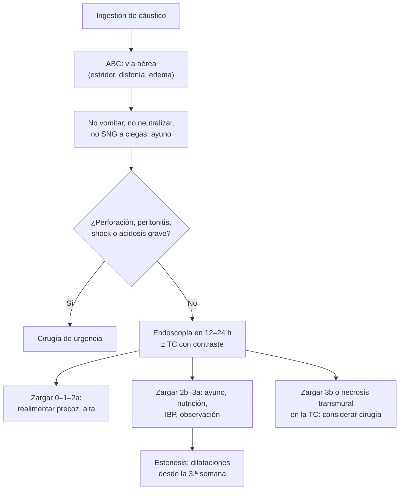

---
tags:
  - Cirugía
  - Urgencia
---

# Esofagitis cáustica (ingestión de cáusticos)

**Subespecialidad**
Cirugía digestiva alta · Gastroenterología · Urgencia

**Guías principales**
Consenso de la WSES sobre lesiones cáusticas del tubo digestivo alto (*World J Emerg Surg* 2015) · Revisión de la ingestión de cáusticos (*Lancet* 2017)

**Otras fuentes**
Clasificación endoscópica de Zargar (*Gastrointest Endosc* 1991)

**GES**
No.

**EUNACOM**
4.01.2.001 Esofagitis cáustica (diagnóstico específico, tratamiento inicial)

**Revisado**
Octubre 2026

!!! abstract "Resumen en 60 segundos"
    - **Álcalis** (soda cáustica, destapacañerías, lavalozas industriales): **necrosis por licuefacción**, penetran en profundidad y dañan más el **esófago**. **Ácidos** (ácido muriático, limpiadores de baño, baterías): **necrosis por coagulación**, dañan más el **estómago**.
    - **Niños**: ingestión **accidental**, pequeña cantidad. **Adultos**: casi siempre **intencional** (intento suicida), gran cantidad y lesiones **graves**.
    - **No hacer**: **no inducir el vómito**, **no neutralizar**, no dar carbón activado, no pasar una sonda nasogástrica a ciegas.
    - **ABC**: evaluar la **vía aérea** (estridor, disfonía, edema) e **intubar con fibroscopio** si está comprometida.
    - **Endoscopía** en las primeras **12–24 h** (y evitarla entre los días 5 y 15, cuando la pared está más débil). **Clasificación de Zargar** (0 a 3b). La **TC con contraste** ayuda a detectar la **necrosis transmural**.
    - **Perforación, peritonitis, mediastinitis o necrosis transmural** = **cirugía de urgencia** (esofagogastrectomía).
    - Complicación tardía: **estenosis** esofágica (dilataciones) y mayor riesgo de **cáncer escamoso** de esófago décadas después.

## Definición

- **Ingestión de cáusticos**: ingestión de una sustancia con **pH extremo** (álcalis con pH > 11–12 o ácidos con pH < 2) capaz de producir **necrosis** del tubo digestivo.
- **Esofagitis cáustica**: lesión inflamatoria y necrótica del esófago producida por la sustancia.
- **Gastropatía cáustica**: lesión del estómago, más frecuente con los ácidos.

## Epidemiología

### Mundial

- Hay dos poblaciones distintas:
    - **Niños menores de 5 años**: la mayoría de las ingestiones; **accidentales**, de **poco volumen**, con lesiones habitualmente **leves**.
    - **Adultos**: **intencionales** (intento suicida, a menudo con antecedentes psiquiátricos o alcohol), de **gran volumen**, con lesiones graves y **mortalidad** significativa.
- En los países de altos ingresos predominan los **álcalis** de uso doméstico; en otros, los ácidos.

### Chile

!!! chile "Datos nacionales"
    - No se encontraron series nacionales recientes publicadas.
    - La **soda cáustica** (hidróxido de sodio) y los destapacañerías son productos domésticos de venta libre, a menudo **trasvasijados** a botellas de bebida, un mecanismo clásico de ingestión accidental.
    - Las intoxicaciones se pueden consultar con el **CITUC** (Centro de Información Toxicológica de la Pontificia Universidad Católica), que atiende consultas de todo el país.

## Etiología y factores de riesgo

| Tipo | Ejemplos | Lesión |
|---|---|---|
| **Álcalis** | **Soda cáustica** (NaOH), potasa, **destapacañerías**, detergentes industriales, lavavajillas, **pilas de botón** (daño por corriente y álcali) | **Licuefacción**: penetra en profundidad; **esófago** |
| **Ácidos** | **Ácido muriático** (clorhídrico), sulfúrico (baterías), limpiadores de baño, antisarro | **Coagulación**: escara que limita la penetración; **estómago** (antro, píloro) |
| **Otros** | Cloro doméstico (hipoclorito diluido) | Generalmente **leve** |

**Factores de gravedad**: **intención suicida**, **gran volumen**, sustancia **concentrada** (sólida o en gel, que se adhiere), pH extremo, estómago vacío.

## Fisiopatología

- **Álcalis**: **saponifican** las grasas y **desnaturalizan** las proteínas → **necrosis por licuefacción** que avanza en profundidad por horas → riesgo de **perforación** y **mediastinitis**.
- **Ácidos**: **necrosis por coagulación** con escara; el tránsito rápido por el esófago lleva el daño al **estómago** (sobre todo al antro, por el pilorospasmo).
- **Evolución de la lesión**:
    - **Días 1–4**: necrosis, trombosis vascular e inflamación.
    - **Días 5–15**: caída de la escara, tejido de granulación; la pared es **más débil** (máximo riesgo de **perforación** con la endoscopía).
    - **Desde la 3.ª semana**: depósito de colágeno y **cicatrización** → **estenosis** (en las semanas o meses siguientes).

*Figura 1. Manejo de la ingestión de cáusticos. Esquema propio basado en el consenso WSES 2015 y Chirica (Lancet 2017).*

## Clasificación

**Clasificación endoscópica de Zargar (modificada)**:

| Grado | Hallazgo | Pronóstico |
|---|---|---|
| **0** | Mucosa normal | Sin secuelas |
| **1** | **Edema** e **hiperemia** | Sin secuelas |
| **2a** | Friabilidad, hemorragias, erosiones, **úlceras superficiales**, exudado | Bajo riesgo de estenosis |
| **2b** | Igual a 2a más **úlceras profundas o circunferenciales** | **Alto riesgo de estenosis** |
| **3a** | **Necrosis focal** (áreas pardas, negras o grisáceas) | Alto riesgo de estenosis |
| **3b** | **Necrosis extensa** | Riesgo de **perforación** y muerte; candidato a cirugía |
| **4** (en algunas versiones) | **Perforación** | Cirugía |

## Clínica

- **Orofaringe**: lesiones en los labios, la boca y la faringe (su **ausencia no descarta** lesiones esofágicas graves).
- **Síntomas esofágicos**: **odinofagia**, **disfagia**, **sialorrea** (no puede tragar la saliva), dolor **retroesternal**.
- **Síntomas gástricos**: dolor epigástrico, náuseas, **hematemesis**.
- **Vía aérea**: **estridor**, **disfonía**, disnea (edema de la laringe y la epiglotis): **gravedad**.
- **Signos de perforación**:
    - **Esofágica**: dolor torácico intenso, **enfisema subcutáneo**, **mediastinitis**, derrame pleural.
    - **Gástrica**: **peritonitis**, abdomen en tabla.
- **Gravedad sistémica**: shock, **acidosis metabólica**, falla multiorgánica, CID.

## Diagnóstico

!!! guia "Puntos clave (WSES 2015, Chirica 2017)"
    - **Historia**: sustancia (pedir el **envase**), cantidad, hora, intención y otras sustancias o fármacos.
    - **Laboratorio**: gases con **lactato** (la **acidosis** sugiere necrosis grave), hemograma, función renal y hepática, coagulación; alcoholemia y paracetamol en el intento suicida.
    - **Endoscopía** precoz (idealmente en las primeras **12–24 horas**, no después de las 48 h y **nunca entre los días 5 y 15**) para la clasificación de Zargar. No hacerla en el paciente con **perforación** ya evidente.
    - **TC de cuello, tórax y abdomen con contraste**: complementa o reemplaza la endoscopía para detectar la **necrosis transmural** y la **perforación** (engrosamiento de la pared sin realce, aire extraluminal, colecciones); ayuda a evitar cirugías innecesarias.
    - **Radiografía de tórax y abdomen de pie**: neumomediastino o neumoperitoneo.
    - **Laringoscopía** si hay síntomas respiratorios.

## Laboratorio

| Examen | Uso |
|---|---|
| **Gases arteriales y lactato** | **Acidosis** = necrosis profunda, mal pronóstico |
| **Hemograma**, PCR | Leucocitosis (necrosis, infección) |
| **Coagulación** | CID en las lesiones graves |
| **Creatinina, electrolitos, pruebas hepáticas** | Falla orgánica |
| **Alcoholemia, niveles de paracetamol** | Coingesta en el intento suicida |

## Imágenes

| Examen | Uso |
|---|---|
| **Endoscopía digestiva alta** | **Estándar** para el grado de la lesión (Zargar) |
| **TC con contraste** | Necrosis transmural, perforación, mediastinitis; selección de los pacientes que necesitan cirugía |
| **Radiografía de tórax y abdomen** | Neumomediastino, neumoperitoneo, derrame pleural |
| **Esofagograma** (a las 3 semanas o más) | **Estenosis** |

<figure markdown>
{ loading=lazy }
<figcaption>Figura 2. Algoritmo de la WSES para la ingestión de cáusticos (en inglés), que combina la TC y la endoscopía. Solo cuando ambas muestran necrosis (TC con necrosis y endoscopía grado 3b) se indica la cirugía de urgencia; en los hallazgos concordantes sin necrosis y en los discordantes se recomienda el manejo no operatorio. Tomada de Bonavina L, Chirica M, Skrobic O, et al. <em>Foregut caustic injuries: results of the world society of emergency surgery consensus conference.</em> World J Emerg Surg. 2015;10:44 (figura 1). Licencia CC BY 4.0.</figcaption>
</figure>

## Diagnóstico diferencial

| Cuadro | Claves |
|---|---|
| **Impactación de bolo o cuerpo extraño** | Afagia brusca tras comer; antecedente claro (ver [disfagia y afagia](../../gastroenterologia/disfagia-y-afagia-aguda.md)) |
| **Ingestión de pila de botón** | Imagen de "doble halo" en la radiografía; **endoscopía urgente** (< 2 h) |
| **Perforación esofágica espontánea** (Boerhaave) | Vómitos intensos seguidos de dolor torácico y enfisema subcutáneo |
| **Esofagitis infecciosa o por fármacos** | Odinofagia sin antecedente de ingestión |
| **Angioedema** | Edema de la vía aérea sin lesiones mucosas |

## Tratamiento

### Lo que no se debe hacer

!!! alarma "Contraindicado"
    - **Inducir el vómito**: re-expone el esófago y la vía aérea.
    - **Neutralizar** con ácidos o álcalis débiles: reacción exotérmica que agrava la lesión.
    - **Dilución** con grandes volúmenes de agua o leche: puede inducir el vómito (solo pequeños sorbos, en la primera media hora, si no hay síntomas de vía aérea; en general, **ayuno**).
    - **Carbón activado**: no adsorbe los cáusticos y dificulta la endoscopía.
    - **Sonda nasogástrica a ciegas**: riesgo de perforación.

### Manejo inicial

- **ABC**: si hay **compromiso de la vía aérea**, **intubación** (idealmente con **fibroscopio**, por el edema); evitar la intubación nasotraqueal a ciegas.
- **Monitorización**, vía venosa, **ayuno**, analgesia y **IBP** IV.
- Retirar la ropa contaminada y lavar la piel y los ojos expuestos.
- **Evaluación psiquiátrica** en toda ingestión intencional (una vez estable).

### Según el grado

| Grado | Manejo |
|---|---|
| **0–1** | **Realimentación precoz**, alta en 24–48 h |
| **2a** | Dieta líquida y progresiva, IBP; observación breve |
| **2b–3a** | **Hospitalizar**: ayuno inicial, **nutrición** (enteral por sonda puesta bajo visión endoscópica o yeyunostomía, o parenteral), **IBP**; vigilar los signos de perforación; endoscopía o esofagograma a las 3 semanas para la **estenosis** |
| **3b / necrosis transmural** | Evaluación **quirúrgica**; cirugía si la TC confirma la necrosis transmural o hay deterioro clínico |
| **Perforación, peritonitis, mediastinitis, shock** | **Cirugía de urgencia**: **esofagectomía** y/o **gastrectomía** total con esofagostomía cervical y yeyunostomía de alimentación; reconstrucción diferida |

- **Corticoides**: **no** se recomiendan de rutina en los adultos para prevenir la estenosis (no han demostrado beneficio claro y aumentan las infecciones).
- **Antibióticos**: solo con perforación, infección o si se usan corticoides.

### Estenosis

- **Dilataciones endoscópicas** (bujías o balón) desde la **3.ª semana**, repetidas.
- Estenosis refractarias: prótesis, o **esofagocoloplastía** (sustitución del esófago por colon) en centros especializados.

## Complicaciones

- **Precoces**: **obstrucción de la vía aérea**, **perforación** esofágica o gástrica, **mediastinitis**, **peritonitis**, hemorragia, fístula traqueoesofágica o aortoentérica, falla multiorgánica, **muerte**.
- **Tardías**:
    - **Estenosis esofágica**: la más frecuente; muy probable en los grados **2b y 3**.
    - **Estenosis pilórica** (gastric outlet obstruction), sobre todo con los ácidos.
    - **Carcinoma escamoso de esófago**: riesgo **aumentado** que aparece **décadas** después; endoscopía de vigilancia en el seguimiento a largo plazo.

## Pronóstico y seguimiento

- **Grados 0–2a**: excelente pronóstico, sin secuelas.
- **Grados 2b–3**: alto riesgo de **estenosis**; los grados **3b** tienen la mayor mortalidad.
- Seguimiento con endoscopía o esofagograma a las **3 semanas** en los grados ≥ 2b, dilataciones según la clínica y **seguimiento psiquiátrico** en los intentos suicidas.

## Perlas para el internado

!!! perla "Para recordar en la sala"
    - **No vomitar, no neutralizar, no carbón activado, no SNG a ciegas.**
    - **Álcali = esófago (licuefacción). Ácido = estómago (coagulación).**
    - **Sin lesiones en la boca no se descarta** una lesión esofágica grave.
    - **Estridor o disfonía** = vía aérea en riesgo: intubar con fibroscopio.
    - **Endoscopía en 12–24 h; nunca entre los días 5 y 15.**
    - **Acidosis metabólica** tras una ingestión de cáusticos = necrosis grave.
    - **Grados 2b y 3 hacen estenosis** a las semanas: controlar con esofagograma.
    - **Ingestión intencional = evaluación psiquiátrica.**
    - **Cáncer escamoso** de esófago décadas después: seguimiento a largo plazo.

## Preguntas de repaso

??? repaso "1. Mujer de 30 años que ingirió soda cáustica en un intento suicida hace 2 horas. Tiene sialorrea, odinofagia y dolor retroesternal, sin estridor; está estable. ¿Qué hace?"
    - **ABC**, ayuno, vía venosa, analgesia e **IBP**. **No** inducir el vómito, no neutralizar ni pasar una SNG.
    - Gases con lactato, laboratorio y **endoscopía en las primeras 12–24 h** (± **TC con contraste**).
    - Evaluación **psiquiátrica** cuando esté estable.

??? repaso "2. La endoscopía del caso anterior muestra úlceras profundas y circunferenciales en el esófago medio, sin necrosis. ¿Qué grado es, cómo la maneja y qué complicación espera?"
    - **Zargar 2b**.
    - Hospitalización, **nutrición** (sonda bajo visión o parenteral), IBP y vigilancia de la perforación.
    - Alto riesgo de **estenosis**: esofagograma o endoscopía a las **3 semanas** y **dilataciones**.

??? repaso "3. Hombre de 45 años que bebió ácido muriático hace 6 horas. Tiene dolor abdominal intenso, abdomen en tabla, PA 85/50 y lactato de 7 mmol/L. ¿Conducta?"
    - **Perforación gástrica** con **peritonitis** y shock (los ácidos dañan más el estómago).
    - Reanimación, antibióticos y **cirugía de urgencia** (gastrectomía, evaluar el esófago). No hacer endoscopía.

??? repaso "4. Niño de 2 años que tomó un sorbo de destapacañerías guardado en una botella de bebida. Está asintomático, sin lesiones en la boca. ¿Puede darlo de alta sin más estudio?"
    - **No** de inmediato: la ausencia de lesiones orales **no descarta** una lesión esofágica.
    - Observación; la indicación de endoscopía depende de los **síntomas** (sialorrea, disfagia, vómitos, estridor, dolor) y de la sustancia; consultar con pediatría o gastroenterología. Educar a la familia: **no trasvasijar** productos tóxicos.

??? repaso "5. ¿Por qué no se debe hacer la endoscopía al décimo día de una ingestión de cáusticos?"
    - Entre los días **5 y 15** la escara se desprende y la pared tiene tejido de granulación débil, con el **máximo riesgo de perforación**.

## Referencias

1. Bonavina L, Chirica M, Skrobic O, et al. Foregut caustic injuries: results of the world society of emergency surgery consensus conference. *World J Emerg Surg.* 2015;10:44. doi:[10.1186/s13017-015-0039-0](https://doi.org/10.1186/s13017-015-0039-0)
2. Chirica M, Bonavina L, Kelly MD, et al. Caustic ingestion. *Lancet.* 2017;389(10083):2041–2052. doi:[10.1016/S0140-6736(16)30313-0](https://doi.org/10.1016/S0140-6736(16)30313-0)
3. Zargar SA, Kochhar R, Mehta S, et al. The role of fiberoptic endoscopy in the management of corrosive ingestion and modified endoscopic classification of burns. *Gastrointest Endosc.* 1991;37(2):165–169. doi:[10.1016/s0016-5107(91)70678-0](https://doi.org/10.1016/s0016-5107(91)70678-0)
