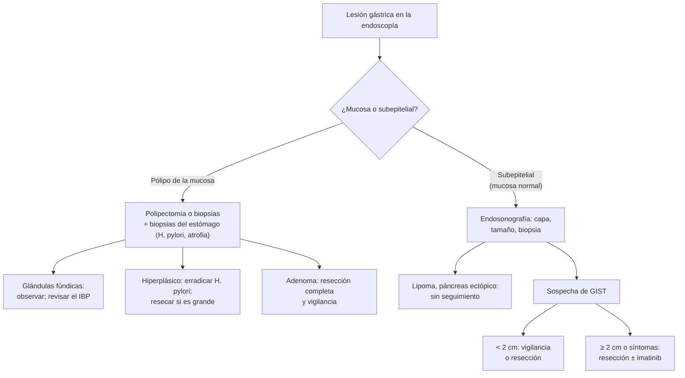

---
tags:
  - Cirugía
---

# Tumores gástricos benignos: pólipos, GIST y tumores subepiteliales

**Subespecialidad**
Cirugía digestiva alta · Gastroenterología

**Guías principales**
Guía ESGE/EHMSG/ESP de condiciones precancerosas y neoplasia precoz del estómago, MAPS III (*Endoscopy* 2025) · Guía ESMO-EURACAN-GENTURIS de GIST (*Ann Oncol* 2022) · Guía ENETS 2023 de tumores neuroendocrinos gastroduodenales

**Otras fuentes**
Guía de cáncer gástrico (ver [dispepsia y cáncer gástrico](../../gastroenterologia/dispepsia-ulcera-peptica-y-cancer-gastrico.md))

**GES**
No (el **cáncer gástrico** sí es GES, N.° 27).

**EUNACOM**
4.01.1.007 Tumores gástricos benignos (sospecha, inicial)

**Revisado**
Octubre 2026

!!! abstract "Resumen en 60 segundos"
    - Casi siempre son **hallazgos** de una endoscopía; a veces dan **anemia**, **hemorragia digestiva** u **obstrucción**.
    - **Pólipos epiteliales**:
        - **De glándulas fúndicas**: los más frecuentes; asociados al uso de **IBP**; casi nunca malignos.
        - **Hiperplásicos**: asociados a ***H. pylori*** y gastritis atrófica; **erradicar** *H. pylori*; resecar los grandes.
        - **Adenomas**: **premalignos**: **resecar** siempre.
    - **Tumores subepiteliales** (bajo la mucosa): **GIST** (el más importante: potencial maligno), leiomioma, lipoma, páncreas ectópico, tumor neuroendocrino.
    - **Endosonografía** para los subepiteliales: capa de origen, tamaño y biopsia.
    - **GIST**: **CD117 (c-KIT)** y DOG1 positivos. El riesgo depende del **tamaño**, las **mitosis** y la ubicación. Los **≥ 2 cm** se **resecan**; **imatinib** en los de alto riesgo o irresecables.

## Definición

- **Tumor gástrico benigno**: lesión del estómago sin capacidad de invadir ni dar metástasis. Algunos son **premalignos** (adenomas) o tienen un **potencial maligno** variable (GIST, tumores neuroendocrinos).
- **Pólipo gástrico**: lesión que protruye hacia la luz desde la **mucosa**.
- **Lesión subepitelial**: protrusión cubierta por **mucosa normal**, que se origina en capas más profundas (submucosa, muscular) o es una compresión extrínseca.
- **GIST** (tumor del estroma gastrointestinal): tumor **mesenquimático** originado en las **células intersticiales de Cajal**, con mutaciones de **KIT** o **PDGFRA**.

## Epidemiología

### Mundial

- Se encuentran pólipos gástricos en una pequeña proporción de las endoscopías.
- Los pólipos de **glándulas fúndicas** son hoy los más frecuentes en los países donde se usan mucho los **IBP** y bajó la prevalencia de *H. pylori*; en las zonas con alta prevalencia de *H. pylori* predominan los **hiperplásicos**.
- **GIST**: el tumor **mesenquimático** más frecuente del tubo digestivo; el **estómago** es su ubicación más frecuente (~ 60 %), seguido del intestino delgado. Edad media ~ 60 años.

### Chile

!!! chile "Datos nacionales"
    - Chile tiene una **alta incidencia de cáncer gástrico** y una prevalencia alta de *H. pylori*; por eso los pólipos **hiperplásicos** y los **adenomas** importan más que en otros países.
    - El **cáncer gástrico** es GES (N.° 27); los tumores benignos no, pero su estudio es el mismo: **endoscopía con biopsia**.
    - No se encontraron datos nacionales recientes de prevalencia de pólipos gástricos ni de GIST.

## Etiología y factores de riesgo

| Tumor | Factores asociados | Potencial maligno |
|---|---|---|
| **Pólipo de glándulas fúndicas** | **IBP** prolongados; **poliposis adenomatosa familiar** (si son muchos en un joven) | Muy bajo (salvo en la poliposis familiar) |
| **Pólipo hiperplásico** | ***H. pylori***, **gastritis atrófica**, gastrectomía previa | Bajo; aumenta en los **> 1 cm** |
| **Adenoma** | **Gastritis atrófica** y **metaplasia intestinal**, *H. pylori* | **Premaligno** (displasia) |
| **GIST** | Esporádico; raro en la neurofibromatosis tipo 1 | **Variable**: según el tamaño, las mitosis y la ubicación |
| **Tumor neuroendocrino gástrico** | Tipo 1: **gastritis atrófica autoinmune** (hipergastrinemia); tipo 2: **Zollinger-Ellison** en la MEN1; tipo 3: esporádico | Tipo 1 bajo; tipo 3 **alto** |
| **Leiomioma, lipoma, páncreas ectópico** | — | Benignos |

## Fisiopatología

- **Pólipos de glándulas fúndicas**: los IBP elevan la gastrina y producen dilatación quística de las glándulas oxínticas.
- **Hiperplásicos**: respuesta regenerativa excesiva a la **inflamación crónica** de la mucosa.
- **Adenomas**: proliferación **displásica** sobre un estómago con atrofia y metaplasia (la secuencia de Correa: gastritis crónica → atrofia → metaplasia intestinal → displasia → cáncer).
- **GIST**: la mutación activadora de **KIT** o **PDGFRA** estimula la proliferación; por eso responden al **imatinib** (inhibidor de tirosina kinasa).
- **Neuroendocrinos tipo 1**: la aclorhidria de la gastritis atrófica autoinmune eleva la **gastrina**, que estimula las células enterocromafines.

*Figura 1. Enfoque de las lesiones gástricas benignas. Esquema propio basado en las guías MAPS III 2025, ESMO GIST 2022 y ENETS 2023.*

## Clasificación

**Riesgo de recurrencia del GIST** (según la guía ESMO, a partir de los criterios de Miettinen):

| Factor | Menor riesgo | Mayor riesgo |
|---|---|---|
| **Tamaño** | ≤ 2 cm | **> 5 cm**, y sobre todo **> 10 cm** |
| **Mitosis** (por 5 mm²) | ≤ 5 | **> 5** |
| **Ubicación** | **Estómago** | Intestino delgado, recto |
| **Rotura tumoral** | No | **Sí** (riesgo muy alto) |

**Tumores neuroendocrinos gástricos**:

| Tipo | Contexto | Gastrina | Conducta habitual |
|---|---|---|---|
| **1** (el más frecuente) | Gastritis atrófica autoinmune | **Alta** | Pequeños: resección endoscópica o vigilancia |
| **2** | Zollinger-Ellison (MEN1) | Alta | Tratar el gastrinoma; resección |
| **3** | Esporádico | **Normal** | **Cirugía oncológica** (comportamiento agresivo) |

## Clínica

- **Asintomáticos**: la mayoría; hallazgo endoscópico o en una TC.
- **Anemia ferropénica** por sangrado crónico (pólipos grandes, GIST ulcerado).
- **Hemorragia digestiva alta**: GIST con **ulceración** de la mucosa (ver [HDA](../../gastroenterologia/hemorragia-digestiva-alta.md)).
- **Obstrucción** del vaciamiento gástrico (pólipos antrales o pediculados que prolapsan por el píloro; GIST grandes).
- **Masa abdominal** o saciedad precoz (GIST grandes).

## Diagnóstico

!!! guia "Puntos clave (MAPS III 2025, ESMO 2022, ENETS 2023)"
    - **Pólipos**: **endoscopía** con **resección** o biopsia del pólipo, y **biopsias** del resto del estómago (antro y cuerpo) para ***H. pylori***, **atrofia** y **metaplasia intestinal**.
    - **Lesión subepitelial**: **endosonografía** (capa de origen, tamaño, características) y **biopsia** guiada si cambia la conducta. El lipoma y el páncreas ectópico tienen un aspecto típico y no requieren seguimiento.
    - **Sospecha de GIST**:
        - **< 2 cm**: vigilancia con endosonografía o resección, según el paciente.
        - **≥ 2 cm**, crecimiento o síntomas: **resección**; biopsia previa si se plantea un tratamiento neoadyuvante.
        - Confirmación con **inmunohistoquímica** (**CD117/KIT**, **DOG1**) y **análisis mutacional**.
    - **Tumor neuroendocrino**: gastrina sérica, cromogranina A, pH gástrico; TC o PET con análogos de somatostatina según el tipo.

## Laboratorio

| Examen | Uso |
|---|---|
| **Hemograma**, ferritina | Anemia ferropénica |
| **Búsqueda de *H. pylori*** (biopsia, test de ureasa) | Pólipos hiperplásicos, adenomas |
| **Gastrina**, anticuerpos anticélulas parietales, **vitamina B12** | Gastritis atrófica autoinmune (neuroendocrino tipo 1) |
| **Inmunohistoquímica** CD117, DOG1; mutaciones KIT/PDGFRA | **GIST** |

## Imágenes

| Examen | Uso |
|---|---|
| **Endoscopía** | Detección, polipectomía, biopsias |
| **Endosonografía** | Lesiones **subepiteliales**: capa de origen (el GIST nace de la **muscular propia**), tamaño, biopsia |
| **TC de abdomen con contraste** | GIST grandes, extensión, metástasis (hígado, peritoneo) |
| **PET-TC** | Respuesta temprana al imatinib (casos seleccionados) |

## Diagnóstico diferencial

| Hallazgo | Diferenciales |
|---|---|
| **Pólipo gástrico** | Glándulas fúndicas, hiperplásico, adenoma, **cáncer gástrico precoz** polipoideo, tumor neuroendocrino |
| **Lesión subepitelial** | **GIST**, leiomioma, schwannoma, lipoma, páncreas ectópico, tumor neuroendocrino, **compresión extrínseca** (bazo, vesícula, vasos) |
| **Úlcera sobre una masa** | GIST ulcerado frente a **cáncer gástrico** o **linfoma** |

## Tratamiento

| Lesión | Tratamiento |
|---|---|
| **Pólipo de glándulas fúndicas** | Habitualmente nada; reevaluar la indicación del **IBP**; si son muchos en un joven, **colonoscopía** (poliposis adenomatosa familiar) |
| **Pólipo hiperplásico** | **Erradicar *H. pylori*** (muchos regresan); **resecar** los grandes (habitualmente > 1 cm) o con síntomas |
| **Adenoma** | **Resección endoscópica completa**, erradicación de *H. pylori* y **vigilancia endoscópica** |
| **GIST localizado** | **Resección quirúrgica** con márgenes negativos (en cuña o gastrectomía parcial; **sin linfadenectomía**, porque no da metástasis ganglionares); evitar la **rotura** |
| **GIST de alto riesgo** | **Imatinib adyuvante** por **3 años** (según el riesgo y la mutación) |
| **GIST irresecable o metastásico** | **Imatinib** (400 mg/día habitualmente); neoadyuvante para hacerlo resecable |
| **Neuroendocrino tipo 1 pequeño** | **Resección endoscópica** o vigilancia; vitamina B12 si hay déficit |
| **Neuroendocrino tipo 3** | **Gastrectomía** oncológica con linfadenectomía |
| **Lipoma, páncreas ectópico** | Nada, salvo síntomas |

!!! alarma "Derivar con prioridad"
    - **Hemorragia digestiva** o **anemia** con una lesión gástrica.
    - Pólipo con **displasia de alto grado**, ulcerado o > 2 cm.
    - Lesión subepitelial **≥ 2 cm**, que **crece** o con rasgos de alto riesgo en la endosonografía (bordes irregulares, quistes, ecogenicidad heterogénea).
    - Tumor neuroendocrino **tipo 3**.

## Complicaciones

- **Hemorragia** (GIST, pólipos grandes).
- **Obstrucción** pilórica, **invaginación** de pólipos pediculados.
- **Transformación maligna** (adenomas, hiperplásicos grandes).
- **GIST**: recurrencia local, metástasis **hepáticas** y **peritoneales** (no ganglionares); resistencia al imatinib.
- Complicaciones de la **polipectomía** (sangrado, perforación).

## Pronóstico y seguimiento

- **Pólipos benignos**: excelente pronóstico; vigilancia según la histología y el estado del resto de la mucosa (**atrofia** y **metaplasia** extensas: vigilancia endoscópica según MAPS III).
- **GIST**: el pronóstico depende del riesgo; los gástricos pequeños con pocas mitosis tienen muy buen pronóstico. Seguimiento con **TC** por años tras la resección.
- **Neuroendocrinos tipo 1**: excelente pronóstico; tipo 3: similar a un adenocarcinoma.

## Perlas para el internado

!!! perla "Para recordar en la sala"
    - **Pólipos de glándulas fúndicas = IBP**: casi nunca malignos.
    - **Pólipo hiperplásico = *H. pylori***: erradicar.
    - **Adenoma gástrico = premaligno**: resecar.
    - **Lesión subepitelial con mucosa normal = endosonografía.**
    - **GIST: CD117 positivo, muscular propia, estómago; ≥ 2 cm se reseca; imatinib si es de alto riesgo.**
    - **GIST no da metástasis ganglionares**: se reseca sin linfadenectomía; metastiza al **hígado** y al **peritoneo**.
    - **Muchos pólipos fúndicos en un joven**: pensar en **poliposis adenomatosa familiar** y pedir colonoscopía.

## Preguntas de repaso

??? repaso "1. Mujer de 55 años que usa omeprazol hace 6 años. La endoscopía muestra varios pólipos sésiles de 3–4 mm en el cuerpo gástrico, de glándulas fúndicas. ¿Qué hace?"
    - Lesiones **benignas** asociadas a los **IBP**: no requieren resección ni vigilancia especial.
    - **Revisar la indicación** del omeprazol y bajar la dosis o suspenderlo si es posible.

??? repaso "2. Hombre de 62 años con anemia ferropénica. La endoscopía muestra un pólipo hiperplásico de 15 mm en el antro y la biopsia del antro es positiva para *H. pylori*. ¿Conducta?"
    - **Erradicar *H. pylori*** y **resecar** el pólipo (> 1 cm, sangrante).
    - Biopsias del resto del estómago (atrofia, metaplasia) y tratamiento de la anemia.

??? repaso "3. Hombre de 58 años con melena. La endoscopía muestra una lesión subepitelial de 4 cm en el fondo gástrico con una úlcera central. ¿Qué sospecha y cómo la estudia?"
    - **GIST gástrico** ulcerado (causa de la hemorragia).
    - Estabilizar y hacer la hemostasia; **endosonografía** y **TC** de abdomen.
    - **Resección quirúrgica** con márgenes negativos; inmunohistoquímica (CD117, DOG1) y análisis mutacional; **imatinib adyuvante** según el riesgo.

??? repaso "4. Mujer de 50 años con anemia por déficit de vitamina B12, gastritis atrófica del cuerpo, gastrina muy alta y tres nódulos de 5 mm en el cuerpo gástrico. ¿Qué son?"
    - **Tumores neuroendocrinos gástricos tipo 1** (por la hipergastrinemia de la gastritis atrófica autoinmune).
    - Bajo potencial maligno: **resección endoscópica** o vigilancia; reponer la **vitamina B12**.

??? repaso "5. ¿Por qué la cirugía del GIST no incluye una linfadenectomía?"
    - Porque el GIST **casi nunca da metástasis ganglionares**; se disemina a **hígado** y **peritoneo**. Basta una resección con **márgenes negativos** sin romper el tumor.

## Referencias

1. Dinis-Ribeiro M, Libânio D, Uchima H, et al. Management of epithelial precancerous conditions and early neoplasia of the stomach (MAPS III): European Society of Gastrointestinal Endoscopy (ESGE), European Helicobacter and Microbiota Study Group (EHMSG) and European Society of Pathology (ESP) Guideline update 2025. *Endoscopy.* 2025;57(5):504–554. doi:[10.1055/a-2529-5025](https://doi.org/10.1055/a-2529-5025)
2. Casali PG, Blay JY, Abecassis N, et al. Gastrointestinal stromal tumours: ESMO–EURACAN–GENTURIS Clinical Practice Guidelines for diagnosis, treatment and follow-up. *Ann Oncol.* 2022;33(1):20–33. doi:[10.1016/j.annonc.2021.09.005](https://doi.org/10.1016/j.annonc.2021.09.005)
3. Panzuto F, Ramage J, Pritchard DM, et al. European Neuroendocrine Tumor Society (ENETS) 2023 guidance paper for gastroduodenal neuroendocrine tumours (NETs) G1–G3. *J Neuroendocrinol.* 2023;35(8):e13306. doi:[10.1111/jne.13306](https://doi.org/10.1111/jne.13306)
4. Superintendencia de Salud. Problema de salud GES N.° 27: cáncer gástrico. [superdesalud.gob.cl](https://www.superdesalud.gob.cl/orientacion-en-salud/cancer-gastrico/)
