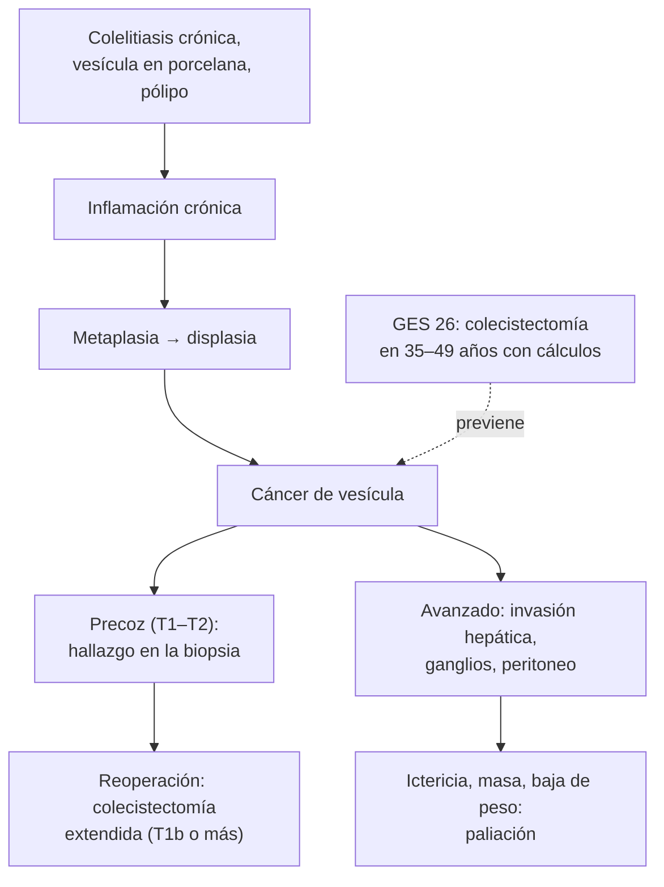

---
tags:
  - Cirugía
  - GES
---

# Cáncer de vesícula y vías biliares (con pólipos vesiculares)

**Subespecialidad**
Cirugía hepatobiliopancreática · Oncología

**Guías principales**
Guía ESMO de cáncer de vías biliares (*Ann Oncol* 2023) · Guía conjunta ESGAR/EAES/EFISDS/ESGE de pólipos vesiculares (*Eur Radiol* 2022)

**Otras fuentes**
Revisión de cáncer de vesícula (*Nat Rev Dis Primers* 2022) · Mortalidad por cáncer de vesícula y GES en Chile (*Rev Med Chile* 2019)

**GES**
Sí: **colecistectomía preventiva del cáncer de vesícula** en personas de **35 a 49 años** con cálculos en la vesícula o las vías biliares (N.° 26).

**EUNACOM**
4.01.1.028 Cáncer de vesícula y vías biliares (sospecha, inicial)

**Revisado**
Octubre 2026

!!! abstract "Resumen en 60 segundos"
    - **Chile** tiene una de las **tasas de mortalidad por cáncer de vesícula más altas del mundo**, sobre todo en **mujeres** y en la población **mapuche**. El principal factor de riesgo es la **colelitiasis**.
    - **Prevención**: **GES 26**, colecistectomía en las personas de **35–49 años** con cálculos.
    - **Precoz**: **asintomático**; muchas veces es un **hallazgo en la biopsia** de una colecistectomía. **Siempre enviar la vesícula a biopsia.**
    - **Avanzado**: **ictericia**, baja de peso, **masa** en el hipocondrio derecho, dolor persistente. Pronóstico **malo**.
    - **Colangiocarcinoma**: **ictericia indolora** progresiva; el **hiliar** (tumor de Klatskin) da dilatación de la vía intrahepática con vesícula colapsada. Factor de riesgo: **colangitis esclerosante primaria**.
    - **Pólipos vesiculares**: **≥ 10 mm** = **colecistectomía**; 6–9 mm con factores de riesgo = colecistectomía; el resto, ecografías de control.
    - Tratamiento curativo: **cirugía** (colecistectomía extendida con resección hepática y linfadenectomía). Adyuvancia con **capecitabina**. Avanzado: **gemcitabina-cisplatino + inmunoterapia**.

## Definición

- **Cáncer de vesícula**: neoplasia maligna de la vesícula biliar; en su gran mayoría **adenocarcinoma**.
- **Colangiocarcinoma**: adenocarcinoma del epitelio de los conductos biliares.
    - **Intrahepático**: dentro del hígado (masa hepática; ver [masa hepática](../../gastroenterologia/masa-hepatica-y-hepatocarcinoma.md)).
    - **Perihiliar** (**tumor de Klatskin**): en la confluencia de los hepáticos; el más frecuente.
    - **Distal**: colédoco distal.
- **Cáncer de vesícula incidental**: el que se descubre en el estudio histológico de una vesícula extirpada por una supuesta enfermedad benigna.
- **Pólipo vesicular**: lesión que protruye desde la pared hacia la luz; la mayoría son **seudopólipos** (de colesterol) sin riesgo, y una minoría son adenomas con potencial maligno.

## Epidemiología

### Mundial

- El cáncer de vesícula es el cáncer **más frecuente de la vía biliar**, con una distribución geográfica muy desigual: alto en **Chile**, el norte de la India, Bolivia, Japón y Corea.
- Es **más frecuente en mujeres** (al revés que el colangiocarcinoma) y después de los **60 años**.
- La mayoría se diagnostica en etapas **avanzadas**, cuando ya no es resecable.

### Chile

!!! chile "Datos nacionales"
    - Chile tiene una de las tasas de **mortalidad por cáncer de vesícula más altas del mundo**, sobre todo en **mujeres** del centro y sur del país y en la población **mapuche**, en relación con la altísima prevalencia de **litiasis biliar** (ver [litiasis biliar](../../gastroenterologia/litiasis-biliar-colecistitis-colangitis.md)).
    - **GES N.° 26**: **colecistectomía preventiva** en las personas de **35 a 49 años** con cálculos en la vesícula o las vías biliares, desde la sospecha.
    - Tras el GES, la tendencia de la mortalidad por cáncer de vesícula en las personas de **35–49 años** bajó más que antes de su implementación, y aumentaron las colecistectomías en ese grupo (Mardones y Frenz, 2019).

## Etiología y factores de riesgo

| Cáncer de vesícula | Colangiocarcinoma |
|---|---|
| **Colelitiasis** (sobre todo cálculos **grandes**, > 3 cm, y de larga data) | **Colangitis esclerosante primaria** (con colitis ulcerosa) |
| **Vesícula en porcelana** (calcificación de la pared) | **Quistes de colédoco** (enfermedad de Caroli) |
| **Pólipos** ≥ 10 mm | Parásitos hepáticos (*Clonorchis*, *Opisthorchis*) en Asia |
| **Unión pancreatobiliar anómala** | Hepatolitiasis |
| Sexo **femenino**, **etnia mapuche**, obesidad, multiparidad | Cirrosis, VHB, VHC, MASLD (intrahepático) |
| Infección crónica por *Salmonella* Typhi (portador) | |

## Fisiopatología

- La **inflamación crónica** de la mucosa (por los cálculos, la infección o el reflujo de jugo pancreático) lleva a **metaplasia**, **displasia** y **carcinoma** a lo largo de muchos años.
- La vesícula tiene una pared **delgada**, **sin muscular de la mucosa** bien definida y sin serosa en la cara hepática → el tumor invade pronto el **hígado** (segmentos IVb y V) y los **ganglios**.
- **Colangiocarcinoma**: obstrucción de la vía biliar → **ictericia colestásica** indolora, colangitis.

*Figura 1. Secuencia del cáncer de vesícula y dónde actúa la prevención. Esquema propio basado en Roa (2022), la guía ESMO 2023 y el GES 26.*

## Clasificación

**Etapificación T del cáncer de vesícula (simplificada) y conducta**:

| T | Invasión | Conducta habitual |
|---|---|---|
| **Tis** | Carcinoma in situ | Colecistectomía simple |
| **T1a** | Lámina propia | **Colecistectomía simple** (con márgenes y cístico negativos) |
| **T1b** | **Capa muscular** | **Colecistectomía extendida**: resección hepática (IVb–V) y linfadenectomía |
| **T2** | Tejido conectivo perimuscular | **Colecistectomía extendida** |
| **T3** | Serosa, hígado o un órgano vecino | Resección extendida si es posible |
| **T4** | Vena porta, arteria hepática o ≥ 2 órganos | Habitualmente **irresecable** |

**Colangiocarcinoma perihiliar**: la **clasificación de Bismuth-Corlette** (tipos I a IV) describe la extensión hacia los conductos hepáticos y guía la resección.

## Clínica

- **Cáncer de vesícula precoz**: **asintomático**, o con síntomas de la **colelitiasis** asociada (cólicos).
- **Avanzado**:
    - **Dolor** persistente en el hipocondrio derecho, **baja de peso**, anorexia.
    - **Ictericia** (invasión de la vía biliar o del hilio): signo de **mal pronóstico**.
    - **Masa** palpable, hepatomegalia, ascitis.
- **Colangiocarcinoma**: **ictericia indolora** progresiva, **prurito**, coluria, acolia, baja de peso; a veces colangitis.
- **Signo de Courvoisier-Terrier** (vesícula palpable no dolorosa con ictericia): sugiere una obstrucción **distal** (páncreas, ampolla, colédoco distal); en el tumor de Klatskin la vesícula está **colapsada**.

## Diagnóstico

!!! guia "Puntos clave (ESMO 2023, ESGAR 2022)"
    - **Toda vesícula extirpada debe enviarse a biopsia**: así se detectan los cánceres incidentales.
    - **Ecografía**: engrosamiento focal de la pared, masa que reemplaza la vesícula, pólipo, dilatación de la vía biliar.
    - **TC trifásica de tórax, abdomen y pelvis** y **RM con colangio-RM**: extensión local, invasión vascular, ganglios y metástasis; resecabilidad.
    - **Cáncer incidental T1b o más**: etapificación con TC o RM y **reoperación** (colecistectomía extendida).
    - **Biopsia** antes de la quimioterapia en la enfermedad irresecable (y estudio **molecular**: FGFR2, IDH1, HER2, MSI).
    - **Pólipos vesiculares**: ecografía; conducta según el **tamaño** y los factores de riesgo (Figura 2).

## Laboratorio

| Examen | Uso |
|---|---|
| **Pruebas hepáticas** | Patrón **colestásico** (FA, GGT, bilirrubina directa) |
| **CA 19-9** y CEA | Apoyo y seguimiento; no diagnósticos (se elevan también en la colestasis benigna) |
| **Hemograma**, albúmina, coagulación | Estado general, déficit de vitamina K por colestasis |

## Imágenes

| Examen | Uso |
|---|---|
| **Ecografía abdominal** | Primer examen: masa, engrosamiento de la pared, pólipos, cálculos, dilatación de la vía biliar |
| **TC con contraste** | Etapificación y resecabilidad |
| **RM con colangio-RM** | Extensión en la vía biliar (colangiocarcinoma) |
| **Endosonografía** | Pólipos dudosos, ganglios, biopsia |
| **CPRE** | Drenaje biliar (prótesis) y cepillado o biopsia de las estenosis |
| **PET-TC** | Metástasis ocultas antes de una cirugía mayor |

<figure markdown>
{ loading=lazy }
<figcaption>Figura 2. Manejo y seguimiento de los pólipos vesiculares según las guías ESGAR/EAES/EFISDS/ESGE (en inglés). Pólipos ≥ 10 mm: colecistectomía. Menores de 10 mm con síntomas atribuibles a la vesícula: colecistectomía. Sin síntomas: si hay factores de riesgo (edad > 60 años, colangitis esclerosante primaria, etnia asiática, lesión sésil), los de 6–9 mm se operan y los ≤ 5 mm se controlan con ecografía; sin factores de riesgo, los ≤ 5 mm no requieren seguimiento y los de 6–9 mm se controlan a los 6 meses, 1 y 2 años. Tomada de Foley KG, Lahaye MJ, Thoeni RF, et al. <em>Management and follow-up of gallbladder polyps: updated joint guidelines between the ESGAR, EAES, EFISDS and ESGE.</em> Eur Radiol. 2022;32(5):3358–3368 (figura 1). Licencia CC BY 4.0.</figcaption>
</figure>

## Diagnóstico diferencial

| Hallazgo | Diferenciales |
|---|---|
| **Engrosamiento de la pared vesicular** | **Cáncer**, colecistitis aguda o crónica, **colecistitis xantogranulomatosa** (imita un cáncer), adenomiomatosis, hipoalbuminemia, hepatitis, insuficiencia cardíaca |
| **Pólipo vesicular** | Seudopólipo de **colesterol** (el más frecuente), adenomiomatosis focal, adenoma, cáncer, **barro biliar** o cálculo adherido (se mueve con los cambios de posición) |
| **Ictericia indolora** | **Cáncer de cabeza de páncreas**, colangiocarcinoma, ampuloma, cáncer de vesícula avanzado, **coledocolitiasis**, síndrome de Mirizzi, colangitis esclerosante (ver [colestasia](../../gastroenterologia/colestasia.md)) |

## Tratamiento

| Situación | Tratamiento |
|---|---|
| **Prevención** | **Colecistectomía** en la colelitiasis según el **GES 26** (35–49 años) y en las demás indicaciones (sintomáticos, **vesícula en porcelana**, **pólipo ≥ 10 mm**) |
| **Hallazgo incidental T1a** | Colecistectomía simple suficiente si los márgenes son negativos |
| **Incidental T1b o más** | **Reoperación**: resección hepática (segmentos IVb–V) + **linfadenectomía** del pedículo hepático |
| **Sospecha preoperatoria de cáncer** | Cirugía **abierta** oncológica en un centro especializado (evitar la rotura de la vesícula y la diseminación) |
| **Colangiocarcinoma resecable** | Resección de la vía biliar con **hepatectomía** (perihiliar) o **duodenopancreatectomía** (distal) |
| **Adyuvancia** | **Capecitabina** por 6 meses tras la resección |
| **Irresecable o metastásico** | **Gemcitabina + cisplatino** con **inmunoterapia** (durvalumab o pembrolizumab); terapias dirigidas según el perfil molecular en segunda línea |
| **Ictericia obstructiva** | **Drenaje biliar**: **prótesis** por CPRE o drenaje percutáneo; en la colangitis, drenaje urgente |

!!! alarma "Derivar con prioridad"
    - **Ictericia indolora** con dilatación de la vía biliar.
    - **Masa** o engrosamiento focal de la pared vesicular en la ecografía.
    - **Pólipo ≥ 10 mm** o que crece.
    - **Biopsia de vesícula con cáncer**: derivar a cirugía hepatobiliar para etapificar y reoperar si corresponde.
    - **Fiebre con ictericia** en un paciente con una obstrucción biliar maligna: **colangitis** (drenaje urgente).

## Complicaciones

- **Obstrucción biliar**: ictericia, **prurito**, **colangitis**, déficit de vitamina K.
- **Obstrucción duodenal** (vaciamiento gástrico).
- **Carcinomatosis peritoneal**, ascitis.
- **Diseminación** en los puertos de la laparoscopía o el peritoneo si la vesícula se rompe durante la cirugía.
- **Caquexia**.

## Pronóstico y seguimiento

- El pronóstico depende de la **etapa**: los tumores **T1** detectados incidentalmente tienen muy buena sobrevida; los avanzados, muy mala.
- La **ictericia** al diagnóstico es un signo de enfermedad avanzada.
- Seguimiento con clínica, CA 19-9 e imágenes tras la resección.
- **Cuidados paliativos** precoces en la enfermedad avanzada (alivio del dolor y cuidados paliativos por cáncer avanzado: GES N.° 4).

## Perlas para el internado

!!! perla "Para recordar en la sala"
    - **Chile = alto riesgo de cáncer de vesícula**: **colelitiasis entre 35 y 49 años = GES 26** (colecistectomía preventiva).
    - **Toda vesícula extirpada va a biopsia.**
    - **Cáncer incidental T1b o más = reoperar** (resección hepática y linfadenectomía).
    - **Pólipo vesicular ≥ 10 mm = colecistectomía.**
    - **Vesícula en porcelana = colecistectomía.**
    - **Ictericia indolora con vesícula colapsada y vía intrahepática dilatada = tumor de Klatskin.** Con vesícula palpable: obstrucción distal (páncreas, ampolla).
    - **Engrosamiento de la pared vesicular**: puede ser un cáncer o una colecistitis xantogranulomatosa; derivar.

## Preguntas de repaso

??? repaso "1. Mujer de 42 años con colelitiasis asintomática en una ecografía. ¿Tiene indicación de colecistectomía en Chile?"
    - **Sí**: entra en el **GES 26** (colecistectomía preventiva del cáncer de vesícula en personas de **35–49 años** con cálculos en la vesícula o las vías biliares).
    - El objetivo es **prevenir** el cáncer de vesícula, muy frecuente en Chile.

??? repaso "2. La biopsia de una colecistectomía laparoscópica por cólicos informa un adenocarcinoma que invade la capa muscular (T1b). ¿Qué hace?"
    - **Cáncer de vesícula incidental T1b**.
    - Etapificación con **TC** o RM y **reoperación**: resección hepática de los segmentos **IVb–V** y **linfadenectomía** del pedículo hepático, en un centro especializado.

??? repaso "3. Hombre de 55 años con ictericia indolora progresiva, prurito y baja de peso. La ecografía muestra dilatación de la vía biliar intrahepática con colédoco y vesícula no dilatados. ¿Qué sospecha?"
    - **Colangiocarcinoma perihiliar** (**tumor de Klatskin**).
    - **Colangio-RM** y **TC** para la extensión y la resecabilidad; **CA 19-9**; derivar a cirugía hepatobiliar.

??? repaso "4. Ecografía con un pólipo vesicular de 7 mm en una mujer de 65 años sin síntomas. ¿Conducta?"
    - Tiene un **factor de riesgo** (edad > 60 años) y un pólipo de **6–9 mm**: la guía sugiere **colecistectomía** si acepta y es apta para la cirugía.
    - Sin factores de riesgo, un pólipo de este tamaño se controlaría con ecografías a los 6 meses, 1 y 2 años.

??? repaso "5. ¿Cuáles son los principales factores de riesgo del cáncer de vesícula?"
    - **Colelitiasis** (cálculos grandes y de larga data), **vesícula en porcelana**, **pólipos ≥ 10 mm**, unión pancreatobiliar anómala, **sexo femenino**, **etnia mapuche**, obesidad y el estado de portador de *Salmonella* Typhi.

## Referencias

1. Vogel A, Bridgewater J, Edeline J, et al. Biliary tract cancer: ESMO Clinical Practice Guideline for diagnosis, treatment and follow-up. *Ann Oncol.* 2023;34(2):127–140. doi:[10.1016/j.annonc.2022.10.506](https://doi.org/10.1016/j.annonc.2022.10.506)
2. Foley KG, Lahaye MJ, Thoeni RF, et al. Management and follow-up of gallbladder polyps: updated joint guidelines between the ESGAR, EAES, EFISDS and ESGE. *Eur Radiol.* 2022;32(5):3358–3368. doi:[10.1007/s00330-021-08384-w](https://doi.org/10.1007/s00330-021-08384-w)
3. Roa JC, García P, Kapoor VK, et al. Gallbladder cancer. *Nat Rev Dis Primers.* 2022;8(1):69. doi:[10.1038/s41572-022-00398-y](https://doi.org/10.1038/s41572-022-00398-y)
4. Mardones ML, Frenz P. Mortalidad por cáncer de vesícula y egresos hospitalarios por patología biliar en Chile 2002-2014, en relación a la garantía GES colecistectomía preventiva. *Rev Med Chile.* 2019;147(7):860–869. doi:[10.4067/S0034-98872019000700860](https://doi.org/10.4067/S0034-98872019000700860)
5. Superintendencia de Salud. Problema de salud GES N.° 26: colecistectomía preventiva del cáncer de vesícula en personas de 35 a 49 años. [superdesalud.gob.cl](https://www.superdesalud.gob.cl/orientacion-en-salud/colecistectomia-preventiva-del-cancer-de-vesicula-en-personas-de-35-a-49-anos/)
