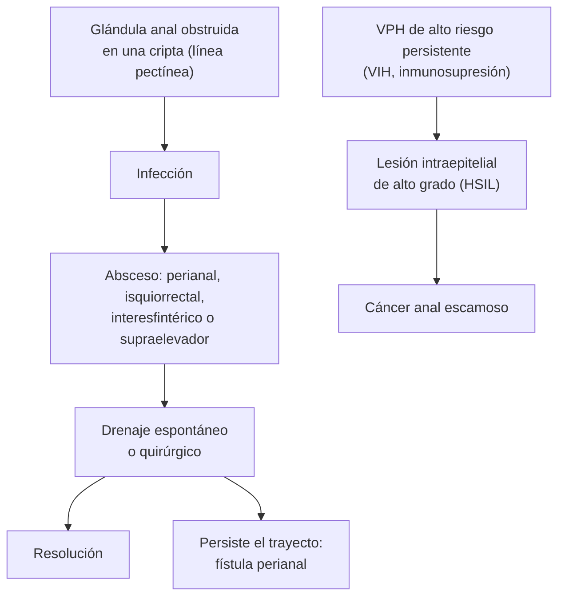

---
tags:
  - Cirugía
  - Urgencia
---

# Abscesos y fístulas anorrectales, enfermedad pilonidal, prolapso rectal, cáncer anal y condilomas

**Subespecialidad**
Cirugía general · Coloproctología

**Guías principales**
Guía ASCRS de absceso anorrectal, fístula perianal y fístula rectovaginal (*Dis Colon Rectum* 2022) · Guía de la European Society of Coloproctology de enfermedad pilonidal (*Br J Surg* 2024) · Guía ASCRS de prolapso rectal (*Dis Colon Rectum* 2017) · Guía ESMO de cáncer anal (*Ann Oncol* 2021) · Guía IUSTI-Europa de verrugas anogenitales (2019)

**Otras fuentes**
Ensayo ANCHOR de tratamiento de lesiones precursoras del cáncer anal en personas con VIH (*N Engl J Med* 2022)

**GES**
No.

**EUNACOM**
4.01.1.017 Abscesos y fístulas anorrectales · 4.01.1.018 Enfermedades del seno pilonidal · 4.01.2.009 Prolapso rectal (diagnóstico específico) · 4.01.1.019 Cáncer anal · 4.01.1.058 Condilomas (sospecha)

**Revisado**
Octubre 2026

!!! abstract "Resumen en 60 segundos"
    - **Absceso perianal**: dolor anal **constante** (no solo al defecar), aumento de volumen **eritematoso** y fluctuante, a veces fiebre. Tratamiento: **drenaje quirúrgico precoz**. Los antibióticos solos **no** lo resuelven.
    - **Fístula perianal**: aparece en una parte de los abscesos drenados; **orificio externo** con secreción **intermitente**. Tratamiento quirúrgico: **fistulotomía** (simple) o **sedal** (compleja, para proteger el esfínter).
    - **Enfermedad pilonidal**: infección de folículos en el **surco interglúteo** de adultos jóvenes. Absceso: **incisión y drenaje**; crónica: cirugía con **cierre fuera de la línea media**.
    - **Prolapso rectal**: protrusión del recto con **pliegues circulares**, típico en **mujeres mayores**. Tratamiento **quirúrgico** (rectopexia abdominal o técnica perineal en frágiles).
    - **Cáncer anal**: escamoso, ligado al **VPH**. Riesgo alto en **personas con VIH** y hombres que tienen sexo con hombres. Tratamiento: **quimiorradioterapia** (no cirugía de entrada).
    - **Condilomas acuminados**: **VPH 6 y 11**; tratamiento local (imiquimod, podofilotoxina, crioterapia o cirugía). Se previenen con la **vacuna contra el VPH**.

## Definición

- **Absceso anorrectal**: colección purulenta en los espacios alrededor del ano y el recto, originada casi siempre en una **glándula anal** infectada (teoría criptoglandular).
- **Fístula perianal (fístula in ano)**: trayecto que comunica una **cripta anal** (orificio interno) con la **piel perianal** (orificio externo). Es la forma **crónica** del absceso.
- **Enfermedad pilonidal**: infección crónica de la piel y el subcutáneo del **surco interglúteo**, con **pelos** incrustados y senos (orificios en la línea media).
- **Prolapso rectal**: protrusión de **todas las capas** del recto a través del ano (prolapso completo). El prolapso **mucoso** compromete solo la mucosa.
- **Cáncer anal**: tumor maligno del **canal anal** o del margen anal, casi siempre **carcinoma escamoso**.
- **Condilomas acuminados**: verrugas anogenitales causadas por el **virus papiloma humano** (VPH) de bajo riesgo.

## Epidemiología

### Mundial

- **Absceso y fístula**: más frecuentes en **hombres** de 20 a 50 años. Una parte importante de los abscesos drenados evoluciona a **fístula**.
- **Enfermedad pilonidal**: adultos jóvenes, más en **hombres**, con mucho vello, obesidad o trabajos sentados.
- **Prolapso rectal**: sobre todo en **mujeres mayores de 50 años**; también en niños pequeños (se resuelve solo en la mayoría).
- **Cáncer anal**: poco frecuente en la población general, pero su incidencia **aumenta**. El riesgo es mucho mayor en **personas con VIH**, sobre todo en **hombres que tienen sexo con hombres**, en mujeres con lesiones por VPH en el cuello uterino o la vulva, y en trasplantados.
- **Verrugas anogenitales**: la ITS viral más frecuente; disminuyen donde hay vacunación contra el VPH.

### Chile

!!! chile "Datos nacionales"
    - No se encontraron estudios poblacionales chilenos de absceso, fístula, enfermedad pilonidal ni prolapso rectal.
    - Hay casos chilenos publicados de **tuberculosis perianal**, que se presentó como una **úlcera perianal** crónica (Urrejola 2010): pensar en ella ante lesiones anales que no cicatrizan.
    - El **Programa Nacional de Inmunizaciones** vacuna contra el VPH a niñas y niños en edad escolar, lo que con el tiempo reducirá los condilomas y los cánceres asociados al VPH.

## Etiología y factores de riesgo

| Enfermedad | Causa y factores de riesgo |
|---|---|
| **Absceso y fístula criptoglandular** | Obstrucción e infección de una **glándula anal**. Bacterias intestinales (*E. coli*, anaerobios, enterococos) |
| **Absceso y fístula secundarios** | **Enfermedad de Crohn**, **TBC**, VIH, cáncer, trauma, radioterapia, cuerpo extraño |
| **Enfermedad pilonidal** | Pelos que penetran la piel del surco interglúteo; **vello abundante**, **obesidad**, sudoración, **trabajo sentado**, antecedente familiar |
| **Prolapso rectal** | **Constipación crónica** y pujo, **multiparidad**, debilidad del piso pélvico, edad, enfermedades neurológicas; en niños, fibrosis quística y diarrea |
| **Cáncer anal** | **VPH** de alto riesgo (16 y 18), **VIH**, sexo anal receptivo, muchas parejas sexuales, **tabaco**, **inmunosupresión** (trasplante), lesiones precursoras (HSIL anal) |
| **Condilomas** | **VPH 6 y 11** (bajo riesgo), transmisión **sexual**, inmunosupresión |

## Fisiopatología

- **Absceso y fístula**: la glándula anal se abre en una **cripta** a nivel de la **línea pectínea**. Si se obstruye y se infecta, el pus se extiende por los planos de menor resistencia:
    - **Perianal** (el más frecuente, superficial), **isquiorrectal**, **interesfintérico** o **supraelevador** (profundo).
    - Si se drena solo por la piel o el cirujano drena el absceso, el trayecto puede persistir → **fístula**.
- **Enfermedad pilonidal**: el roce y la presión hacen que los **pelos sueltos** penetren la piel del surco → reacción a **cuerpo extraño** e infección → **senos** y abscesos recurrentes.
- **Prolapso rectal**: debilidad de los medios de fijación del recto y del piso pélvico + pujo crónico → **intususcepción** del recto que termina protruyendo por el ano. El esfínter se distiende → **incontinencia**.
- **Cáncer anal**: la infección persistente por **VPH de alto riesgo** en la zona de transformación anal produce **lesiones intraepiteliales escamosas** (LSIL → **HSIL**) que pueden progresar a cáncer, más rápido en la inmunosupresión.

*Figura 1. Origen criptoglandular del absceso y la fístula, y progresión del VPH al cáncer anal. Esquema propio basado en las guías ASCRS 2022 y ESMO 2021.*

## Clasificación

| Enfermedad | Clasificación |
|---|---|
| **Absceso anorrectal** | **Perianal** · **isquiorrectal** · **interesfintérico** · **supraelevador** |
| **Fístula perianal (Parks)** | **Interesfintérica** (la más frecuente) · **transesfintérica** · **supraesfintérica** · **extraesfintérica** |
| **Fístula simple frente a compleja** | **Simple**: interesfintérica o transesfintérica baja (menos de un tercio del esfínter externo), sin factores de riesgo. **Compleja**: compromete más esfínter, es alta, anterior en la mujer, múltiple, recidivada, o asociada a Crohn, radiación o incontinencia previa |
| **Prolapso rectal** | **Mucoso** (parcial, pliegues radiales) · **completo** (todas las capas, pliegues **circulares**) · **interno** (intususcepción sin salir por el ano) |
| **Cáncer anal** | **Canal anal** frente a **margen anal**; estadificación TNM |

## Clínica

- **Absceso perianal**:
    - **Dolor anal o perianal constante**, pulsátil, que **empeora al sentarse** y no solo al defecar.
    - **Aumento de volumen eritematoso, caliente y fluctuante**; fiebre en los abscesos más profundos.
    - **Absceso profundo** (isquiorrectal alto, supraelevador): dolor rectal, fiebre y **retención urinaria**, con poco hallazgo externo; se palpa al **tacto rectal**.
- **Fístula perianal**: **secreción purulenta o serosa intermitente** por un orificio perianal, prurito, episodios de absceso recurrente.
    - **Regla de Goodsall**: los orificios externos **posteriores** a una línea transversal que pasa por el ano tienen un trayecto **curvo** hacia la línea media posterior; los **anteriores**, un trayecto **recto** y radial (con excepciones).
- **Enfermedad pilonidal**:
    - **Absceso agudo**: dolor y aumento de volumen eritematoso en el surco interglúteo, a veces lateral a la línea media.
    - **Crónica**: **orificios (senos) en la línea media** del surco, con pelos y secreción intermitente.
- **Prolapso rectal**: masa que **sale por el ano** con la defecación (al principio se reduce sola, luego requiere reducción manual o queda afuera), con **pliegues circulares**; **secreción mucosa**, sangrado, **incontinencia** fecal y constipación.
    - **Prolapso atascado**: irreductible, edematoso; puede necrosarse.
- **Cáncer anal**: **sangrado**, dolor, masa o **úlcera** anal, prurito, tenesmo, **adenopatías inguinales**. Se confunde con hemorroides o fisuras.
- **Condilomas**: **verrugas** rosadas o color piel, pediculadas o en "coliflor", perianales o intraanales; prurito, sangrado, molestia.

## Diagnóstico

!!! guia "Puntos clave (ASCRS 2022 y 2017, ESCP 2024, ESMO 2021)"
    - **Absceso**: diagnóstico **clínico**. **Imagen** (RM pélvica, ecografía endoanal o TC) si se sospecha un **absceso profundo**, recurrente o en Crohn.
    - **Fístula**: examen y anoscopía; la **RM pélvica** o la ecografía endoanal definen el trayecto en las fístulas **complejas** o recidivadas.
    - **Fístula recurrente, múltiple o atípica**: estudiar **Crohn** (colonoscopía), **TBC** y VIH.
    - **Prolapso rectal**: examen en **cuclillas** con pujo; **colonoscopía** antes de operar (descartar una lesión que actúe de cabeza de la intususcepción).
    - **Cáncer anal**: **biopsia** de toda lesión anal sospechosa; **RM pélvica** para la extensión local, **TC de tórax y abdomen** o PET-TC; **VIH** a todos.
    - **Condilomas**: diagnóstico **clínico**; biopsia si son atípicos, pigmentados, ulcerados o no responden. **Anoscopía** para buscar lesiones intraanales; estudiar otras **ITS** (VIH, sífilis).

## Laboratorio

| Examen | Uso |
|---|---|
| **Hemograma, PCR** | Absceso profundo, sepsis |
| **Glicemia y HbA1c** | Diabetes no conocida (abscesos recurrentes o extensos) |
| **VIH, VDRL o RPR, hepatitis B** | Fístulas atípicas, condilomas, cáncer anal |
| **Cultivo del pus** | Abscesos recurrentes, inmunosuprimidos, sospecha de TBC (baciloscopía y cultivo de Koch) |
| **Biopsia** | Cáncer anal, condilomas atípicos, fístula crónica de larga data (rara transformación maligna) |

## Imágenes

| Examen | Uso |
|---|---|
| **RM pélvica** | **Estándar** para el trayecto de las fístulas complejas, abscesos profundos y estadificación local del cáncer anal |
| **Ecografía endoanal** | Alternativa para fístulas y abscesos; evalúa los esfínteres |
| **TC de pelvis** | Absceso profundo con sepsis cuando no hay RM disponible |
| **Defecografía** | Prolapso interno y trastornos de la evacuación |
| **TC de tórax y abdomen o PET-TC** | Estadificación del cáncer anal |

## Diagnóstico diferencial

| Diagnóstico | Diferencias |
|---|---|
| **Hemorroide externa trombosada** | Nódulo azulado, dolor brusco, sin eritema ni fiebre (ver [hemorroides y fisura](hemorroides-y-fisura-anal.md)) |
| **Fisura anal** | Dolor al defecar que cede en horas; desgarro visible |
| **Hidradenitis supurativa** | Lesiones múltiples en zonas con glándulas apocrinas (axilas, ingles), sin comunicación con el canal anal |
| **Forúnculo** o quiste sebáceo infectado | Superficial, sin relación con el ano |
| **Enfermedad de Crohn perianal** | Fístulas múltiples y complejas, fisuras atípicas, diarrea (ver [EII](../../gastroenterologia/enfermedad-inflamatoria-intestinal.md)) |
| **Hemorroides prolapsadas** (frente a prolapso rectal) | Pliegues **radiales** y nódulos separados; en el prolapso rectal, pliegues **circulares** concéntricos |
| **Molusco contagioso, condiloma plano sifilítico** (frente a condilomas) | Pápulas umbilicadas (molusco); placas lisas y húmedas con VDRL positivo (sífilis secundaria) |
| **Fascitis necrotizante perineal (gangrena de Fournier)** | Dolor desproporcionado, crepitación, necrosis, shock: **urgencia** (ver [piel y partes blandas](../../infectologia/infecciones-piel-partes-blandas.md)) |

## Tratamiento

### Absceso anorrectal

- **Drenaje quirúrgico precoz** (ASCRS 2022): **no** esperar a que "madure" y **no** tratar solo con antibióticos.
    - Absceso perianal superficial: **incisión y drenaje** con anestesia local, cerca del margen anal (deja un trayecto corto si se forma una fístula).
    - Absceso profundo: drenaje en **pabellón**.
- **Antibióticos** solo si hay **celulitis** extensa, **signos sistémicos**, **inmunosupresión**, **diabetes**, valvulopatía o prótesis.
- **Fistulotomía** en el mismo acto solo si la fístula es evidente y **simple**, y el cirujano tiene experiencia.

### Fístula perianal

- **Fístula simple**: **fistulotomía** (abrir el trayecto). Alta tasa de curación con bajo riesgo de incontinencia.
- **Fístula compleja**: técnicas que **preservan el esfínter**:
    - **Sedal** (seton) **laxo** de drenaje como primer paso.
    - **Colgajo de avance** endorrectal, **LIFT** (ligadura interesfintérica del trayecto), sellantes.
- **Crohn**: sedal de drenaje + tratamiento médico (antibióticos, biológicos), coordinado con gastroenterología.

### Enfermedad pilonidal (ESCP 2024)

- **Asintomática** (senos sin síntomas): no requiere tratamiento.
- **Absceso agudo**: **incisión y drenaje**, idealmente **lateral** a la línea media.
- **Crónica o recurrente**:
    - Técnicas mínimamente invasivas (extracción de senos, *pit picking*, láser) en la enfermedad leve.
    - **Escisión con cierre fuera de la línea media** (colgajo de Karydakis, Limberg, Bascom) en la enfermedad extensa: menos recidivas que el cierre en la línea media.
    - Evitar el cierre primario en la línea media.
- **Depilación** de la zona (láser o química) y buena higiene para prevenir recidivas.

### Prolapso rectal (ASCRS 2017)

- **Tratamiento quirúrgico**; las medidas médicas (fibra, evitar el pujo) solo alivian.
    - **Abordaje abdominal** (rectopexia ventral con malla, idealmente laparoscópica): **menos recidivas**; preferido en pacientes en buenas condiciones.
    - **Abordaje perineal** (Delorme, Altemeier): menos invasivo; para pacientes **frágiles** o de alto riesgo, con más recidivas.
- **Prolapso atascado**: reducción manual con sedación (el **azúcar** sobre la mucosa reduce el edema); si hay **necrosis**, **cirugía urgente** (rectosigmoidectomía perineal).
- **Niños**: la mayoría se resuelve con manejo de la constipación; descartar **fibrosis quística**.

### Cáncer anal (ESMO 2021)

- **Quimiorradioterapia** (radioterapia + **5-fluorouracilo** o capecitabina + **mitomicina C**): tratamiento estándar del carcinoma escamoso del canal anal, **conservando el esfínter**.
- **Cirugía** (amputación abdominoperineal): para la **enfermedad persistente o recidivada** tras la quimiorradioterapia.
- Tumores pequeños del **margen anal**: escisión local.
- **Prevención**:
    - **Vacuna contra el VPH**.
    - En **personas con VIH**: tamizaje de lesiones anales y **tratamiento de las HSIL**, que en el ensayo **ANCHOR** redujo el riesgo de progresión a cáncer anal en **57 %** frente a la observación.

### Condilomas acuminados (IUSTI-Europa 2019)

- Tratamientos **aplicados por el paciente**: **imiquimod 5 %** crema o **podofilotoxina 0,5 %**.
- Tratamientos **del profesional**: **crioterapia**, **ácido tricloroacético**, **escisión** o electrocoagulación (lesiones grandes, intraanales o resistentes).
- **Recidivas frecuentes**. Estudiar otras ITS, **examinar a la pareja** y usar preservativo.
- **Vacuna contra el VPH** para la prevención (no trata las lesiones existentes).

!!! dosis "Medicamentos habituales en el adulto"
    | Indicación | Esquema |
    |---|---|
    | **Absceso con celulitis, sepsis, inmunosupresión o diabetes** | **Amoxicilina/ácido clavulánico 875/125 mg cada 12 h VO** por 5–7 días, o **ciprofloxacino 500 mg cada 12 h + metronidazol 500 mg cada 8 h** VO. Sepsis: ceftriaxona 2 g IV cada 24 h + metronidazol 500 mg IV cada 8 h |
    | **Analgesia tras el drenaje** | Paracetamol 1 g cada 8 h + AINE; baños de asiento |
    | **Condilomas: imiquimod 5 %** | Aplicar en la noche **3 veces por semana**, lavar a las 6–10 h, hasta **16 semanas**. No en el embarazo |
    | **Condilomas: podofilotoxina 0,5 %** | **2 veces al día por 3 días**, luego 4 días de descanso; hasta **4 ciclos**. No en el embarazo |
    | **Condilomas: ácido tricloroacético 80–90 %** | Aplicación semanal por el profesional; se puede usar en el embarazo |

!!! alarma "Derivar de urgencia"
    - **Absceso perianal**: drenaje el **mismo día**.
    - **Dolor perineal intenso, crepitación, necrosis, fiebre o shock**: **gangrena de Fournier** (cirugía urgente y antibióticos de amplio espectro).
    - **Absceso con retención urinaria o fiebre alta** (absceso profundo), o en un **diabético** o inmunosuprimido.
    - **Prolapso rectal irreductible**, violáceo o necrótico.
    - **Lesión anal ulcerada, indurada o que sangra** y no cicatriza: biopsia (cáncer anal).

## Complicaciones

- **Absceso**: **fístula**, extensión (absceso en herradura), **sepsis**, **gangrena de Fournier** (sobre todo en diabéticos).
- **Fístula**: abscesos recurrentes; **incontinencia** tras la cirugía si se secciona mucho esfínter; recidiva.
- **Enfermedad pilonidal**: recidiva (frecuente), heridas que no cicatrizan.
- **Prolapso rectal**: **incontinencia**, úlcera, sangrado, **atascamiento** y necrosis.
- **Cáncer anal**: metástasis inguinales y a distancia; toxicidad de la quimiorradioterapia (proctitis, dermatitis, estenosis).
- **Condilomas**: recidiva, obstrucción, transformación (los de bajo riesgo rara vez, salvo el tumor de Buschke-Löwenstein).

## Pronóstico y seguimiento

- **Absceso**: el drenaje precoz resuelve el cuadro agudo; una parte desarrolla una **fístula** que requiere cirugía.
- **Fístula simple**: la fistulotomía cura la gran mayoría. Las **complejas** requieren a menudo varias cirugías.
- **Enfermedad pilonidal**: recidivas frecuentes; menos con técnicas de cierre fuera de la línea media y depilación.
- **Cáncer anal**: buen pronóstico en etapas localizadas con quimiorradioterapia; seguimiento con examen, tacto rectal, anoscopía e imagen por al menos 5 años.
- **Condilomas**: recidivan con frecuencia los primeros meses; control hasta la desaparición de las lesiones.

## Perlas para el internado

!!! perla "Para recordar en la sala"
    - **Dolor anal constante que empeora al sentarse + aumento de volumen eritematoso** = absceso: **drenaje**, no antibióticos solos.
    - **Absceso profundo**: poco hallazgo afuera, pero **fiebre, dolor rectal y retención urinaria**; el **tacto rectal** lo descubre.
    - **Diabético con dolor perineal intenso y crepitación** = **gangrena de Fournier**: urgencia.
    - **Fístula**: orificio externo con secreción intermitente. La **fistulotomía** cura la simple; la compleja necesita **sedal**.
    - **Fístulas múltiples o recidivadas** = pensar en **Crohn** o TBC.
    - **Pliegues circulares = prolapso rectal**; radiales = hemorroides.
    - **Cáncer anal**: escamoso, por **VPH**; se trata con **quimiorradioterapia**, no con cirugía de entrada.
    - **Toda úlcera anal crónica en una persona con VIH**: biopsia.

## Preguntas de repaso

??? repaso "1. Hombre de 35 años con dolor perianal intenso y constante de 3 días, que no lo deja sentarse, y fiebre de 38 °C. Al examen hay un aumento de volumen eritematoso, caliente y fluctuante a 2 cm del margen anal. ¿Qué tiene y cómo lo trata?"
    - **Absceso perianal**.
    - **Incisión y drenaje** precoz (no esperar ni tratar solo con antibióticos), con anestesia local o en pabellón.
    - Antibióticos solo si hay celulitis extensa, signos sistémicos, diabetes o inmunosupresión.
    - Advertirle que puede quedar una **fístula**.

??? repaso "2. Seis meses después del drenaje de un absceso, el paciente tiene secreción purulenta intermitente por un orificio perianal. ¿Qué tiene y cuál es el tratamiento?"
    - **Fístula perianal**.
    - Si es **simple** (interesfintérica o transesfintérica baja): **fistulotomía**.
    - Si es **compleja**: RM pélvica, **sedal** de drenaje y técnicas que preservan el esfínter (colgajo de avance, LIFT).
    - Si es recidivada o múltiple: estudiar **Crohn**.

??? repaso "3. Hombre de 22 años, obeso y con mucho vello, con dolor y aumento de volumen eritematoso en el surco interglúteo. Ya tuvo dos episodios. ¿Qué tiene y cómo lo maneja?"
    - **Enfermedad pilonidal** con un **absceso** agudo recurrente.
    - Ahora: **incisión y drenaje** lateral a la línea media.
    - Después: cirugía programada de la enfermedad crónica, con técnicas mínimamente invasivas o **escisión con cierre fuera de la línea media**, más **depilación**.

??? repaso "4. Mujer de 76 años, multípara y constipada, con una masa que sale por el ano al defecar y que debe reducir con la mano. Tiene incontinencia fecal. Al pujar en cuclillas aparece una protrusión con pliegues circulares. ¿Qué tiene y qué le ofrece?"
    - **Prolapso rectal completo**.
    - **Colonoscopía** y evaluación preoperatoria.
    - **Cirugía**: **rectopexia** abdominal (laparoscópica) si está en buenas condiciones; técnica **perineal** (Delorme o Altemeier) si es frágil.

??? repaso "5. Hombre de 45 años con VIH y sangrado anal con una úlcera indurada en el canal anal. ¿Qué sospecha y cuál es el tratamiento habitual?"
    - **Cáncer anal escamoso** (VPH, VIH).
    - **Biopsia**, RM pélvica y TC o PET-TC de estadificación.
    - Tratamiento estándar: **quimiorradioterapia** con 5-fluorouracilo y mitomicina C; la cirugía queda para la enfermedad persistente o recidivada.

??? repaso "6. Mujer de 24 años con varias verrugas perianales tipo coliflor. ¿Qué tiene, qué estudia y cómo la trata?"
    - **Condilomas acuminados** (VPH 6 y 11).
    - Estudiar otras **ITS** (VIH, sífilis, hepatitis B), **anoscopía** y examen ginecológico con **PAP** según la edad.
    - Tratamiento: **imiquimod** o **podofilotoxina** (no en el embarazo), o **crioterapia**, ácido tricloroacético o escisión.
    - Preservativo, evaluación de la pareja y **vacuna contra el VPH** si no está vacunada.

## Referencias

1. Gaertner WB, Burgess PL, Davids JS, et al. The American Society of Colon and Rectal Surgeons Clinical Practice Guidelines for the Management of Anorectal Abscess, Fistula-in-Ano, and Rectovaginal Fistula. *Dis Colon Rectum.* 2022;65(8):964–985. doi:[10.1097/DCR.0000000000002473](https://doi.org/10.1097/DCR.0000000000002473)
2. Ojo D, Gallo G, Kleijnen J, et al. European Society of Coloproctology guidelines for the management of pilonidal disease. *Br J Surg.* 2024;111(10):znae237. doi:[10.1093/bjs/znae237](https://doi.org/10.1093/bjs/znae237)
3. Bordeianou L, Paquette I, Johnson E, et al. Clinical Practice Guidelines for the Treatment of Rectal Prolapse. *Dis Colon Rectum.* 2017;60(11):1121–1131. doi:[10.1097/DCR.0000000000000889](https://doi.org/10.1097/DCR.0000000000000889)
4. Rao S, Guren MG, Khan K, et al. Anal cancer: ESMO Clinical Practice Guidelines for diagnosis, treatment and follow-up. *Ann Oncol.* 2021;32(9):1087–1100. doi:[10.1016/j.annonc.2021.06.015](https://doi.org/10.1016/j.annonc.2021.06.015)
5. Palefsky JM, Lee JY, Jay N, et al. Treatment of Anal High-Grade Squamous Intraepithelial Lesions to Prevent Anal Cancer. *N Engl J Med.* 2022;386(24):2273–2282. doi:[10.1056/NEJMoa2201048](https://doi.org/10.1056/NEJMoa2201048)
6. Gilson R, Nugent D, Werner RN, et al. 2019 IUSTI-Europe guideline for the management of anogenital warts. *J Eur Acad Dermatol Venereol.* 2020;34(8):1644–1653. doi:[10.1111/jdv.16522](https://doi.org/10.1111/jdv.16522)
7. Urrejola G, Villalón R, Rodríguez N. Ulceración perianal: Dos casos de una rara manifestación de tuberculosis extrapulmonar. *Rev Med Chil.* 2010;138(2):220–222. [PubMed](https://pubmed.ncbi.nlm.nih.gov/20461312/)
