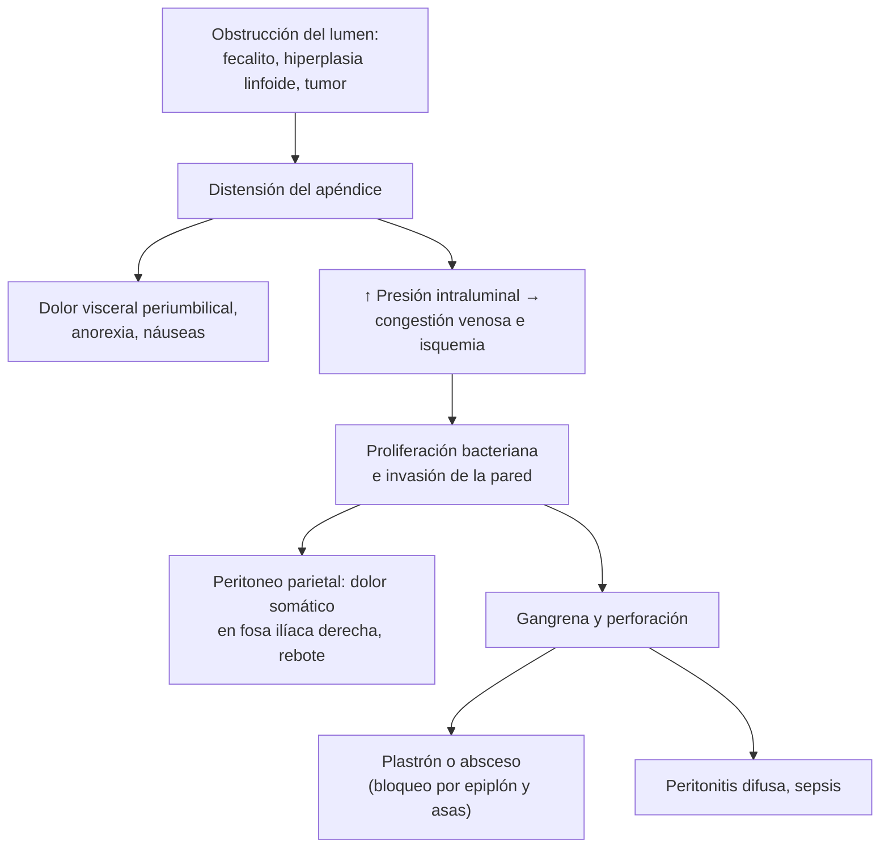
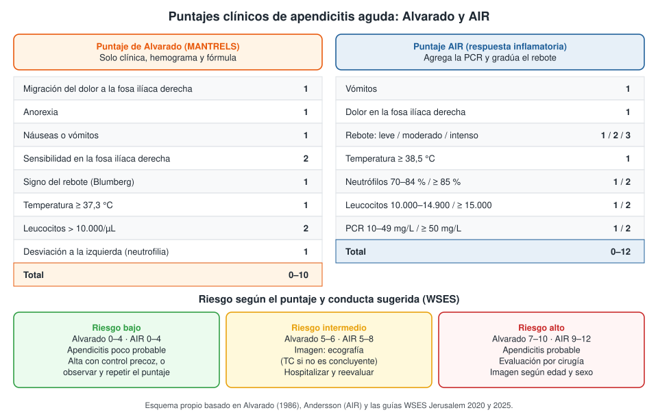

---
tags:
  - Cirugía
  - Urgencia
  - Frecuente en sala
---

# Apendicitis aguda

**Subespecialidad**
Cirugía general · Cirugía digestiva · Urgencia

**Guías principales**
Guías WSES Jerusalem de diagnóstico y tratamiento de la apendicitis aguda, edición 2025 (*JAMA Surg* 2026) y actualización 2020 (*World J Emerg Surg*)

**Otras fuentes**
Ensayos APPAC (*JAMA* 2015 y seguimiento a 5 años 2018) y CODA (*N Engl J Med* 2020) · Metaanálisis de datos individuales de antibióticos frente a apendicectomía (*Lancet Gastroenterol Hepatol* 2025) · Revisión del *Lancet* 2015 · Revisión sistemática de la incidencia mundial (*Ann Surg* 2017) · Puntajes de Alvarado (1986) y AIR · Serie chilena en embarazadas (*Rev Med Chil* 2006)

**GES**
No.

**EUNACOM**
4.01.2.006 Apendicitis aguda (diagnóstico específico, tratamiento inicial, derivar)

**Revisado**
Octubre 2026

!!! abstract "Resumen en 60 segundos"
    - **La urgencia quirúrgica abdominal más frecuente** del mundo. En Chile su incidencia es de las más altas descritas: **202 por 100.000** personas al año.
    - **Clínica clásica**:
        - Dolor **periumbilical** que **migra a la fosa ilíaca derecha** (punto de McBurney).
        - **Anorexia**, náuseas o vómitos **después** del dolor, fiebre baja.
        - **Signo de Blumberg** (rebote).
    - **Diagnóstico**: clínica + **puntaje** (Alvarado o AIR) + **imagen** según el riesgo. Primero **ecografía** y, si no es concluyente, **TC**. En la embarazada, **RM**.
    - **Tratamiento estándar**: **apendicectomía laparoscópica**, con **profilaxis antibiótica** preoperatoria.
        - Sin complicación: **sin antibióticos** después de la cirugía.
        - Complicada: antibióticos por **2–3 días** después de la cirugía.
    - **Antibióticos sin cirugía**: alternativa segura en la apendicitis **no complicada confirmada por imagen y sin apendicolito**. Uno de cada tres pacientes termina operado durante el primer año.
    - **Plastrón o absceso**: antibióticos ± **drenaje percutáneo**. Después de los 40 años, estudiar el colon (riesgo de **neoplasia**).
    - **Perforación** más frecuente en **niños pequeños, adultos mayores y embarazadas** (presentación atípica).

## Definición

- **Apendicitis aguda**: inflamación aguda del **apéndice cecal**, casi siempre por **obstrucción de su lumen**.
- **No complicada (simple)**: apéndice inflamado sin gangrena, perforación, absceso ni peritonitis. Incluye las formas **congestiva** y **flegmonosa (supurada)**.
- **Complicada**: **gangrenosa**, **perforada**, con **absceso**, **plastrón** (masa inflamatoria de asas y epiplón) o **peritonitis** localizada o difusa.
- **Apendicectomía negativa (en blanco)**: cirugía por sospecha de apendicitis con un apéndice sano en la biopsia. Los puntajes y la imagen buscan reducirla.

## Epidemiología

### Mundial

- **La causa más frecuente de abdomen agudo quirúrgico** y de cirugía abdominal de urgencia.
- **Incidencia** (Ferris 2017, revisión de estudios poblacionales):
    - **100 por 100.000** personas-año en Norteamérica y **105 a 151** en Europa.
    - Más alta en países recientemente industrializados: Corea del Sur **206**, Turquía **160**.
- En los países occidentales, la **incidencia de apendicectomías bajó** desde 1990, mientras la de apendicitis se estabilizó.
- Es más frecuente entre los **10 y 30 años**, y algo más en **hombres**.
- El **riesgo de perforación** es mayor en los **extremos de la vida** y con el **retraso** de la consulta o del diagnóstico.

### Chile

!!! chile "Datos nacionales"
    - **Incidencia**: **202 por 100.000** personas-año, una de las más altas del mundo en la revisión de Ferris (2017).
    - **Embarazo** (Butte 2006; hospital público chileno, 1998–2002):
        - **46** embarazadas operadas por sospecha de apendicitis entre **47.322 partos**, con una edad gestacional media de **21 semanas**.
        - **87 %** tuvo apendicitis confirmada por biopsia y **25 %** de ellas estaba perforada.
        - **15 %** tuvo parto prematuro y hubo **una muerte fetal** (2,2 %).

## Etiología y factores de riesgo

- **Obstrucción del lumen apendicular**, la causa principal:
    - **Fecalito** (apendicolito): el más frecuente en adultos.
    - **Hiperplasia linfoide**: más frecuente en niños y adolescentes, a menudo tras infecciones virales.
    - Otras: **tumores** (neuroendocrino o carcinoide, adenocarcinoma, mucocele), parásitos (*Enterobius*, áscaris), cuerpos extraños, bario.
- **Sin obstrucción demostrable** en una parte de los casos (factores infecciosos, dieta, genética).
- **Grupos de riesgo de apendicitis complicada**: niños menores de 5 años, **adultos mayores**, **embarazadas**, **inmunosuprimidos**, diabéticos, y el retraso en la consulta.
- **Neoplasia apendicular**: más frecuente **después de los 40 años** y en la apendicitis complicada con absceso o plastrón.

## Fisiopatología

- **Obstrucción** del lumen → la mucosa sigue secretando moco → **distensión** del apéndice.
- La distensión estimula las fibras **viscerales** (T10): dolor **sordo, mal localizado, periumbilical**, con náuseas y anorexia.
- **Aumenta la presión** dentro del apéndice → **congestión venosa** y luego **isquemia arterial** → **proliferación bacteriana** e invasión de la pared.
- La inflamación llega a la **serosa** y al **peritoneo parietal**: el dolor se vuelve **somático**, intenso y **localizado en la fosa ilíaca derecha**.
- Si progresa: **gangrena** → **perforación** → **absceso** localizado (si el epiplón y las asas lo bloquean: plastrón) o **peritonitis difusa**.
- La **posición del apéndice** cambia la clínica:
    - **Retrocecal**: dolor en el flanco o lumbar, signo del psoas.
    - **Pélvico**: disuria, tenesmo, diarrea, signo del obturador; dolor al tacto rectal.
    - **Embarazo**: el útero desplaza el apéndice hacia arriba; el dolor puede estar en el flanco o el hipocondrio derecho.

*Figura 1. Fisiopatología y evolución de la apendicitis aguda. Esquema propio basado en Bhangu 2015 y las guías WSES.*

## Clasificación

| Tipo | Hallazgos | Manejo |
|---|---|---|
| **No complicada** | Congestiva o flegmonosa (supurada); sin perforación | Apendicectomía sin antibióticos posoperatorios, o antibióticos sin cirugía en casos seleccionados |
| **Gangrenosa** | Necrosis de la pared, sin perforación | Apendicectomía; antibióticos posoperatorios cortos |
| **Perforada con peritonitis localizada** | Perforación con pus localizado | Apendicectomía + aseo; antibióticos 2–3 días |
| **Plastrón** | Masa inflamatoria de epiplón y asas, sin pus drenable | Antibióticos (manejo no operatorio) o cirugía según la experiencia del equipo |
| **Absceso apendicular** | Colección organizada | Antibióticos + **drenaje percutáneo** si es grande; o cirugía |
| **Peritonitis difusa** | Pus libre en la cavidad | **Cirugía urgente**, reanimación y antibióticos (ver [sepsis](../../infectologia/sepsis-y-shock-septico.md)) |

## Clínica

- **Secuencia típica** (presente en una parte de los pacientes):
    1. **Dolor periumbilical o epigástrico**, sordo.
    2. **Anorexia** (casi constante), **náuseas** o vómitos **después** del dolor. Vómitos antes del dolor orientan a otra causa.
    3. **Migración del dolor a la fosa ilíaca derecha** en horas, más intenso y constante.
    4. **Fiebre baja** (37,5–38 °C). Fiebre alta sugiere perforación.
- **Examen físico**:
    - **Punto de McBurney** doloroso (unión del tercio externo con los dos tercios internos de la línea entre la espina ilíaca anterosuperior y el ombligo).
    - **Signo de Blumberg**: dolor al descomprimir bruscamente (irritación peritoneal).
    - **Signo de Rovsing**: dolor en la fosa ilíaca derecha al comprimir la izquierda.
    - **Signo del psoas**: dolor al extender la cadera derecha (apéndice retrocecal).
    - **Signo del obturador**: dolor al rotar internamente la cadera flexionada (apéndice pélvico).
    - **Resistencia muscular** (defensa) y, en la peritonitis difusa, **abdomen en tabla**.
    - **Tacto rectal** doloroso a la derecha en el apéndice pélvico (no es obligatorio en todos).
- **Presentaciones atípicas**:
    - **Adulto mayor**: dolor leve, poca fiebre, leucocitos normales; **perforación más frecuente** (ver [abdomen agudo en el adulto mayor](../../gastroenterologia/abdomen-agudo.md)).
    - **Embarazo**: dolor más alto, náuseas confundidas con las del embarazo, leucocitosis fisiológica.
    - **Niños pequeños**: irritabilidad, vómitos, diarrea; se perforan con frecuencia.
    - **Inmunosuprimidos y diabéticos**: pocos signos peritoneales.

## Diagnóstico

!!! guia "Enfoque diagnóstico (WSES Jerusalem 2020 y 2025)"
    - El diagnóstico se basa en la **clínica**, un **puntaje de riesgo** y la **imagen**. La combinación reduce las apendicectomías negativas.
    - **Puntajes recomendados**: **Alvarado**, **AIR** (*Appendicitis Inflammatory Response*) o **AAS** (*Adult Appendicitis Score*). El AIR y el AAS clasifican mejor que el Alvarado. No basta con un puntaje para indicar la cirugía.
    - **Riesgo bajo**: alta con control precoz o observación con reevaluación, según los síntomas.
    - **Riesgo intermedio**: **ecografía** (idealmente en el punto de atención); **TC** si no es concluyente.
    - **Riesgo alto**: evaluación por cirugía. En los **menores de 40 años** con puntaje muy alto se puede operar sin TC; en los **mayores de 40 años**, **TC** antes de la cirugía (descartar neoplasia y otras causas).
    - **Embarazadas**: **ecografía** y, si no es concluyente, **RM** sin contraste.
    - **Niños**: ecografía primero; evitar la TC cuando sea posible.

<figure markdown>
{ loading=lazy }
<figcaption>Figura 2. Puntajes de Alvarado y AIR, y conducta según el riesgo. Esquema propio basado en Alvarado (1986), Andersson (AIR) y las guías WSES Jerusalem.</figcaption>
</figure>

<figure markdown>
{ loading=lazy }
<figcaption>Figura 3. Algoritmo práctico de la WSES para adultos jóvenes con sospecha de apendicitis aguda (en inglés). Según el riesgo por puntaje: el riesgo bajo se observa o se da de alta con control; el intermedio se estudia con ecografía; en el alto, los menores de 40 años con puntaje muy alto pueden operarse y los mayores de 40 años requieren TC. AA: apendicitis aguda; NOM: manejo no operatorio. Tomada de Di Saverio S, Podda M, De Simone B, et al. <em>Diagnosis and treatment of acute appendicitis: 2020 update of the WSES Jerusalem guidelines.</em> World J Emerg Surg. 2020;15(1):27 (figura 1). Licencia CC BY 4.0.</figcaption>
</figure>

## Laboratorio

| Examen | Interpretación |
|---|---|
| **Hemograma** | **Leucocitosis** con **neutrofilia** en la mayoría; un recuento normal **no descarta** la apendicitis, sobre todo al inicio y en el adulto mayor |
| **PCR** | Elevada; valores altos (≥ 50 mg/L) sugieren apendicitis **complicada**. Parte del puntaje AIR |
| **Orina completa** | Descarta ITU y litiasis. Puede haber **piuria o hematuria leve** si el apéndice inflamado está junto al uréter o la vejiga |
| **Test de embarazo (β-hCG)** | **Obligatorio** en toda mujer en edad fértil (descartar **embarazo ectópico**) |
| **Electrolitos, creatinina, lactato** | En la apendicitis complicada, la sepsis y el adulto mayor |
| **Pruebas de coagulación** | Si usa anticoagulantes o hay hepatopatía (preoperatorio) |

## Imágenes

| Examen | Hallazgos y uso |
|---|---|
| **Ecografía abdominal** | **Primer examen** en niños, embarazadas y adultos jóvenes. Apéndice **no compresible**, diámetro **> 6 mm**, apendicolito, líquido o colección periapendicular. Depende del operador; un apéndice no visualizado no descarta la apendicitis |
| **TC de abdomen y pelvis con contraste** | El examen **más exacto**. Confirma, detecta **complicaciones** (perforación, absceso) y otros diagnósticos. Indicada si la ecografía no es concluyente y en los **mayores de 40 años**. Protocolos de **baja dosis** en jóvenes |
| **RM sin contraste** | **Embarazadas** con ecografía no concluyente |
| **Radiografía de abdomen** | Poco útil; puede mostrar un fecalito o signos de obstrucción |

## Diagnóstico diferencial

| Grupo | Diagnósticos | Pistas |
|---|---|---|
| **Ginecológico** | **Embarazo ectópico**, **torsión ovárica**, quiste ovárico roto, **enfermedad inflamatoria pélvica**, dolor ovulatorio (*mittelschmerz*), endometriosis | β-hCG, dolor bilateral o anexial, flujo, ecografía transvaginal |
| **Urológico** | **Cólico renal**, ITU alta, **torsión testicular** | Hematuria, dolor lumbar irradiado, examen genital (ver [cólico renal](../../nefrologia/urolitiasis-y-colico-renal.md)) |
| **Digestivo** | **Adenitis mesentérica** (niños), gastroenteritis, ileítis de **Crohn**, **diverticulitis** (cecal o sigmoidea redundante), divertículo de Meckel, colecistitis, úlcera perforada, obstrucción intestinal | Diarrea, antecedentes, TC (ver [abdomen agudo](../../gastroenterologia/abdomen-agudo.md)) |
| **Médico** | Neumonía basal derecha, cetoacidosis diabética, porfiria, púrpura de Schönlein-Henoch | Radiografía de tórax, glicemia y cetonas |
| **Adulto mayor** | **Cáncer de colon** (ciego), isquemia mesentérica, diverticulitis | TC; colonoscopía posterior |

## Tratamiento

### Medidas iniciales

- **Régimen cero**, **hidratación** IV, **analgesia** (los opioides **no** enmascaran el diagnóstico y no deben postergarse).
- **Antieméticos** si hay vómitos.
- **Evaluación por cirugía** de toda sospecha de riesgo intermedio o alto.
- En la **peritonitis difusa** o la sepsis: reanimación, **antibióticos de inmediato** y **cirugía urgente**.

### Apendicitis no complicada

- **Apendicectomía laparoscópica**: el **estándar** (WSES 2025). Menos dolor, menos infección de la herida, alta más precoz.
    - La **apendicectomía abierta** sigue siendo válida si no hay laparoscopía disponible.
    - Puede **postergarse hasta 24 horas** sin aumentar las complicaciones (por ejemplo, para operar de día), con antibióticos desde el diagnóstico.
    - **Profilaxis antibiótica preoperatoria** en dosis única; **sin antibióticos posoperatorios**.
- **Manejo no operatorio con antibióticos**: alternativa **segura** en pacientes **seleccionados** (decisión compartida con el paciente).
    - **Requisitos**: apendicitis **confirmada por imagen** (TC en adultos), **no complicada** y **sin apendicolito**.
    - **Resultados**:
        - En el ensayo **APPAC** (Finlandia), **27 %** fue operado en el primer año y la **recurrencia acumulada a 5 años** fue de **39 %**. La mayoría de las recurrencias fueron no complicadas.
        - En el ensayo **CODA** (EE. UU.), **29 %** fue operado a los 90 días: **41 %** con apendicolito y **25 %** sin él. Con apendicolito hubo **más complicaciones**.
        - En el **metaanálisis de datos individuales** (2025; 2.101 pacientes), cerca de **dos tercios** evitaron la cirugía durante el primer año. Las complicaciones fueron similares, salvo con apendicolito.
    - **Evitarlo** en: **apendicolito**, embarazo, inmunosupresión, sospecha de neoplasia (mayores de 40 años sin TC), y cuando no hay seguimiento posible.

### Apendicitis complicada

- **Perforada con peritonitis**: **apendicectomía** (laparoscópica si es posible) con **aseo** de la cavidad.
    - **Antibióticos posoperatorios por 2–3 días** si se controló el foco (WSES 2025). No prolongarlos sin necesidad.
- **Absceso apendicular**:
    - **Antibióticos + drenaje percutáneo** guiado por imagen si el absceso es grande.
    - O cirugía de entrada, según la experiencia del equipo.
- **Plastrón**: manejo **no operatorio** con antibióticos en la mayoría.
- **Después del manejo no operatorio de un absceso o plastrón**:
    - La **apendicectomía de intervalo** no es rutinaria en los jóvenes.
    - En los **mayores de 40 años**, **colonoscopía y TC de control** por el riesgo de **neoplasia** apendicular o de colon.

!!! dosis "Antibióticos habituales en el adulto (ajustar según la función renal y los protocolos locales)"
    | Indicación | Esquema |
    |---|---|
    | **Profilaxis preoperatoria** (dosis única, 30–60 min antes de la incisión) | **Cefazolina 2 g IV + metronidazol 500 mg IV**, o **cefoxitina 2 g IV**. Alergia a betalactámicos: clindamicina 900 mg IV + gentamicina 5 mg/kg IV |
    | **Apendicitis complicada** (tratamiento) | **Ceftriaxona 2 g IV cada 24 h + metronidazol 500 mg IV cada 8 h**, o **ampicilina/sulbactam 3 g IV cada 6 h**. Sepsis grave o riesgo de resistentes: **piperacilina/tazobactam 4,5 g IV cada 6 h** o **ertapenem 1 g IV cada 24 h** |
    | **Paso a la vía oral** | **Amoxicilina/ácido clavulánico 875/125 mg cada 8–12 h**, o **ciprofloxacino 500 mg cada 12 h + metronidazol 500 mg cada 8 h** |
    | **Manejo no operatorio de la no complicada** (ejemplo, APPAC) | **Ertapenem 1 g IV cada 24 h por 3 días**, luego **levofloxacino 500 mg cada 24 h + metronidazol 500 mg cada 8 h** VO hasta completar **10 días**. El APPAC II mostró resultados similares con **moxifloxacino 400 mg VO** desde el inicio |
    | **Analgesia** | Paracetamol 1 g IV cada 8 h + **opioide** si el dolor es intenso (morfina 2–4 mg IV, repetir según respuesta); metamizol 1 g IV cada 8 h |

!!! alarma "Derivar a cirugía de urgencia"
    - **Peritonitis difusa**, abdomen en tabla, **sepsis** o shock.
    - Dolor en la fosa ilíaca derecha con **puntaje intermedio o alto**.
    - **Embarazada**, **adulto mayor**, **niño** o **inmunosuprimido** con dolor abdominal y sospecha de apendicitis (presentación atípica, más perforación).
    - Masa en la fosa ilíaca derecha con fiebre (**plastrón o absceso**).
    - Fracaso del manejo no operatorio: dolor o fiebre que no ceden en **24–48 h**.

## Complicaciones

- **De la enfermedad**:
    - **Perforación**, **peritonitis** y **sepsis**.
    - **Absceso** apendicular o **pélvico**, **plastrón**.
    - **Pileflebitis** (tromboflebitis séptica de la vena porta) y **abscesos hepáticos**, raros.
    - **Obstrucción intestinal** por el proceso inflamatorio o por bridas (tardía).
    - En el **embarazo**: **parto prematuro** y pérdida fetal, más con perforación.
- **De la cirugía**:
    - **Infección del sitio operatorio**: la más frecuente, sobre todo en la complicada y la cirugía abierta.
    - **Absceso intraabdominal** posoperatorio: fiebre, dolor e íleo hacia el **5.º–7.º día**; TC y drenaje.
    - **Íleo** posoperatorio, **filtración del muñón**, hemorragia, **hernia incisional**, **bridas** (obstrucción tardía).
- **Del manejo no operatorio**: **recurrencia**, fracaso y retraso del diagnóstico de una **neoplasia**.

## Pronóstico y seguimiento

- **Apendicitis no complicada operada**: excelente pronóstico, con alta en **24–48 h** y retorno rápido a las actividades.
- **Mortalidad** muy baja en la no complicada; aumenta en la **perforada**, el **adulto mayor** y con la **sepsis**.
- **Manejo no operatorio**: riesgo de **recurrencia** (39 % a 5 años en el APPAC). La recurrencia se trata con apendicectomía o un nuevo ciclo de antibióticos.
- **Seguimiento**:
    - Control ambulatorio a los **7–14 días**: herida, fiebre, dolor, tolerancia a la alimentación.
    - **Biopsia**: revisar siempre el informe (tumores neuroendocrinos, mucinosos o adenocarcinoma del apéndice).
    - Tras un **absceso o plastrón** tratado sin cirugía en **mayores de 40 años**: **colonoscopía** y **TC** de control.
    - Educar sobre los signos de alarma tras el alta: **fiebre**, **dolor creciente**, vómitos, secreción de la herida.

## Perlas para el internado

!!! perla "Para recordar en la sala"
    - **Dolor que empieza en el ombligo, migra a la fosa ilíaca derecha y viene con anorexia** = apendicitis hasta demostrar lo contrario.
    - **Si tiene hambre, probablemente no es apendicitis** (la anorexia es casi constante).
    - **Vómitos antes del dolor** orientan a gastroenteritis más que a apendicitis.
    - **β-hCG en toda mujer en edad fértil** con dolor abdominal: el **embarazo ectópico** es el diferencial que no se puede pasar.
    - **No retrasar la analgesia** (incluidos los opioides): no oculta el diagnóstico.
    - **Leucocitos normales no descartan** la apendicitis, sobre todo en el adulto mayor.
    - **Mayor de 40 años**: TC antes de operar y, si se trató sin cirugía, **colonoscopía** después.
    - **Apendicolito** = mejor operar que tratar solo con antibióticos.
    - **Fiebre y dolor al 5.º–7.º día del posoperatorio** = absceso intraabdominal hasta demostrar lo contrario.

## Preguntas de repaso

??? repaso "1. Hombre de 22 años con dolor periumbilical de 14 horas que migró a la fosa ilíaca derecha, anorexia y un vómito. T 37,8 °C, McBurney y Blumberg positivos. Leucocitos 14.500/µL con 82 % de neutrófilos; PCR 35 mg/L. ¿Cuál es su puntaje y qué conducta corresponde?"
    - **Alvarado**: migración 1 + anorexia 1 + vómitos 1 + sensibilidad 2 + rebote 1 + fiebre 1 + leucocitos 2 + neutrofilia 1 = **10** (riesgo alto).
    - **AIR**: vómitos 1 + dolor 1 + rebote (≥ 1) + temperatura 0 + neutrófilos 1 + leucocitos 1 + PCR 1 = **≥ 6** (intermedio a alto).
    - **Evaluación por cirugía**, régimen cero, hidratación y analgesia. En un hombre joven con alta probabilidad, la **ecografía** confirma; la TC no es obligatoria.
    - **Apendicectomía laparoscópica** con **profilaxis antibiótica**.

??? repaso "2. Mujer de 26 años con dolor en la fosa ilíaca derecha de 10 horas, náuseas y fiebre de 37,6 °C. Su última regla fue hace 7 semanas. ¿Qué examen pide primero y por qué?"
    - **β-hCG**: hay que descartar un **embarazo ectópico**, que puede ser mortal.
    - Si es positiva: **ecografía transvaginal** urgente.
    - Si es negativa: completar con hemograma, PCR, orina y ecografía; considerar también la patología ovárica (torsión, quiste roto) y la enfermedad inflamatoria pélvica.

??? repaso "3. Hombre de 30 años con apendicitis no complicada confirmada por TC, sin apendicolito. Pregunta si puede tratarse sin cirugía. ¿Qué le responde?"
    - **Sí, es una alternativa segura** (WSES 2025; APPAC, CODA y metaanálisis 2025), decidida en conjunto con él.
    - Le explica que cerca de **1 de cada 3** termina operado durante el primer año y que la **recurrencia a 5 años** es de alrededor de **39 %**.
    - Esquema: antibióticos (por ejemplo, ertapenem IV y luego levofloxacino + metronidazol, o moxifloxacino oral) por unos 10 días, con control clínico en 24–48 h.
    - Si tuviera **apendicolito**, sería preferible la cirugía (más fracaso y complicaciones con antibióticos).

??? repaso "4. Mujer de 72 años con dolor abdominal de 5 días, ahora localizado en la fosa ilíaca derecha, con una masa palpable dolorosa y fiebre de 38,3 °C. La TC muestra un absceso periapendicular de 5 cm. ¿Cómo la maneja y qué seguimiento indica?"
    - **Apendicitis complicada con absceso** en una adulta mayor (presentación tardía, típica de la edad).
    - **Antibióticos IV** (ceftriaxona + metronidazol o piperacilina/tazobactam) + **drenaje percutáneo** guiado por TC.
    - Después: **colonoscopía y TC de control** por el riesgo de **neoplasia** apendicular o de colon. La apendicectomía de intervalo se decide caso a caso.

??? repaso "5. Paciente operado de una apendicitis perforada hace 6 días. Recibió antibióticos por 3 días. Ahora tiene fiebre de 38,8 °C, dolor hipogástrico, diarrea y tenesmo. ¿Qué sospecha y qué hace?"
    - **Absceso intraabdominal posoperatorio**, probablemente **pélvico** (la diarrea y el tenesmo sugieren irritación del recto).
    - **TC de abdomen y pelvis** con contraste.
    - **Drenaje percutáneo** (o transrectal o quirúrgico) y reiniciar **antibióticos** según los cultivos.

??? repaso "6. Embarazada de 24 semanas con dolor en el flanco derecho, náuseas y fiebre baja. La ecografía no logra visualizar el apéndice. ¿Qué hace?"
    - La apendicitis es la **urgencia quirúrgica no obstétrica más frecuente** del embarazo, y el útero desplaza el apéndice hacia arriba.
    - **RM sin contraste** para confirmar el diagnóstico.
    - Si se confirma: **apendicectomía** (laparoscópica es segura) sin retraso, porque la **perforación** aumenta el riesgo de parto prematuro y de pérdida fetal.
    - Coordinar con obstetricia (monitoreo fetal).

## Referencias

1. Podda M, Ceresoli M, De Simone B, et al. Diagnosis and Treatment of Acute Appendicitis: 2025 Edition of the World Society of Emergency Surgery Jerusalem Guidelines. *JAMA Surg.* 2026;161(3):283–295. doi:[10.1001/jamasurg.2025.6218](https://doi.org/10.1001/jamasurg.2025.6218)
2. Di Saverio S, Podda M, De Simone B, et al. Diagnosis and treatment of acute appendicitis: 2020 update of the WSES Jerusalem guidelines. *World J Emerg Surg.* 2020;15(1):27. doi:[10.1186/s13017-020-00306-3](https://doi.org/10.1186/s13017-020-00306-3)
3. Bhangu A, Søreide K, Di Saverio S, et al. Acute appendicitis: modern understanding of pathogenesis, diagnosis, and management. *Lancet.* 2015;386(10000):1278–1287. doi:[10.1016/S0140-6736(15)00275-5](https://doi.org/10.1016/S0140-6736(15)00275-5)
4. Ferris M, Quan S, Kaplan BS, et al. The Global Incidence of Appendicitis: A Systematic Review of Population-based Studies. *Ann Surg.* 2017;266(2):237–241. doi:[10.1097/SLA.0000000000002188](https://doi.org/10.1097/SLA.0000000000002188)
5. Salminen P, Paajanen H, Rautio T, et al. Antibiotic Therapy vs Appendectomy for Treatment of Uncomplicated Acute Appendicitis: The APPAC Randomized Clinical Trial. *JAMA.* 2015;313(23):2340–2348. doi:[10.1001/jama.2015.6154](https://doi.org/10.1001/jama.2015.6154)
6. Salminen P, Tuominen R, Paajanen H, et al. Five-Year Follow-up of Antibiotic Therapy for Uncomplicated Acute Appendicitis in the APPAC Randomized Clinical Trial. *JAMA.* 2018;320(12):1259–1265. doi:[10.1001/jama.2018.13201](https://doi.org/10.1001/jama.2018.13201)
7. CODA Collaborative; Flum DR, Davidson GH, et al. A Randomized Trial Comparing Antibiotics with Appendectomy for Appendicitis. *N Engl J Med.* 2020;383(20):1907–1919. doi:[10.1056/NEJMoa2014320](https://doi.org/10.1056/NEJMoa2014320)
8. Sippola S, Haijanen J, Grönroos J, et al. Effect of Oral Moxifloxacin vs Intravenous Ertapenem Plus Oral Levofloxacin for Treatment of Uncomplicated Acute Appendicitis: The APPAC II Randomized Clinical Trial. *JAMA.* 2021;325(4):353–362. doi:[10.1001/jama.2020.23525](https://doi.org/10.1001/jama.2020.23525)
9. Scheijmans JCG, Haijanen J, Flum DR, et al. Antibiotic treatment versus appendicectomy for acute appendicitis in adults: an individual patient data meta-analysis. *Lancet Gastroenterol Hepatol.* 2025;10(3):222–233. doi:[10.1016/S2468-1253(24)00349-2](https://doi.org/10.1016/S2468-1253(24)00349-2)
10. Alvarado A. A practical score for the early diagnosis of acute appendicitis. *Ann Emerg Med.* 1986;15(5):557–564. doi:[10.1016/s0196-0644(86)80993-3](https://doi.org/10.1016/s0196-0644(86)80993-3)
11. Andersson RE, Stark J. Diagnostic value of the appendicitis inflammatory response (AIR) score. A systematic review and meta-analysis. *World J Emerg Surg.* 2025;20(1):12. doi:[10.1186/s13017-025-00582-x](https://doi.org/10.1186/s13017-025-00582-x)
12. Butte JM, Bellolio MF, Fernández F, et al. Apendicectomía en la embarazada: Experiencia en un hospital público chileno. *Rev Med Chil.* 2006;134(2):145–151. doi:[10.4067/s0034-98872006000200002](https://doi.org/10.4067/s0034-98872006000200002)
