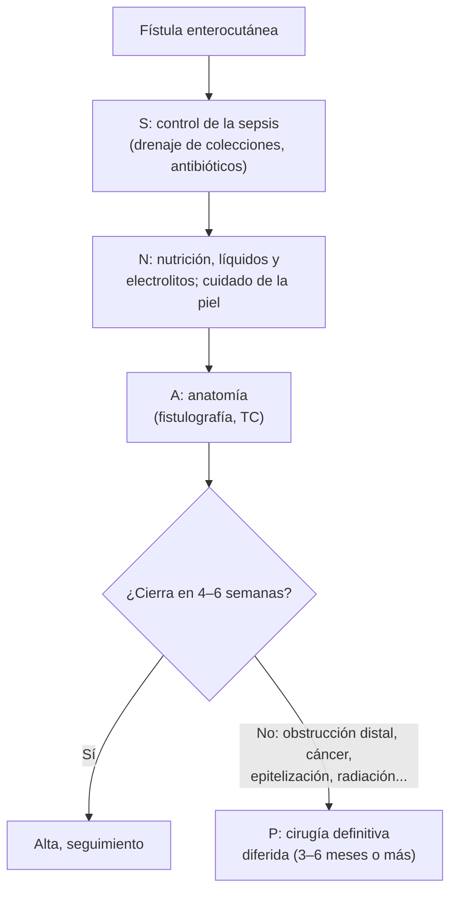

---
tags:
  - Cirugía
---

# Divertículo de Meckel, tumores y fístulas del intestino delgado

**Subespecialidad**
Cirugía digestiva · Coloproctología

**Guías principales**
Guía ENETS 2024 de tumores neuroendocrinos del intestino delgado (*J Neuroendocrinol* 2024) · Guía ASPEN-FELANPE de terapia nutricional en fístulas enterocutáneas (2017; versión en español 2020) · Consenso ESCP de falla intestinal en adultos (*Colorectal Dis* 2016)

**Otras fuentes**
Revisión sistemática del divertículo de Meckel (*J R Soc Med* 2006) · Guía ESMO de GIST 2022

**GES**
No.

**EUNACOM**
4.01.1.003 Divertículo de Meckel · 4.01.1.009 Tumores del intestino delgado · 4.01.1.011 Fístulas del intestino delgado (sospecha, inicial)

**Revisado**
Octubre 2026

!!! abstract "Resumen en 60 segundos"
    - **Divertículo de Meckel**: la malformación congénita más frecuente del tubo digestivo (resto del conducto onfalomesentérico). "**Regla de los 2**": ~ **2 %** de la población, a ~ **60 cm** de la válvula ileocecal, **2** tipos de mucosa ectópica (gástrica y pancreática), síntomas sobre todo **antes de los 2 años**.
        - **Niño** con **rectorragia indolora** abundante = Meckel: **cintigrafía con tecnecio** (pertecnetato).
        - **Adulto**: **obstrucción** (invaginación, vólvulo, bridas) o **diverticulitis** que imita una apendicitis.
    - **Tumores del intestino delgado**: raros. **Anemia** o **sangrado oculto**, **obstrucción intermitente**, **invaginación** en el adulto. El más frecuente maligno es el **neuroendocrino** del íleon (síndrome carcinoide si hay metástasis hepáticas); luego **adenocarcinoma**, **linfoma** y **GIST**.
    - **Fístula enterocutánea**: casi siempre **posoperatoria**. Manejo en orden **SNAP**: controlar la **sepsis**, **nutrición** y electrolitos, cuidado de la **piel**, definir la **anatomía** y, si no cierra, **cirugía** diferida (3–6 meses o más).
    - **No cierran** si hay obstrucción distal, cuerpo extraño, cáncer, radiación, inflamación o infección activa, epitelización o trayecto corto.

## Definición

- **Divertículo de Meckel**: divertículo **verdadero** (con todas las capas) del **borde antimesentérico** del íleon distal, por la persistencia parcial del **conducto onfalomesentérico** (vitelino).
- **Tumores del intestino delgado**: neoplasias benignas o malignas del duodeno, el yeyuno o el íleon.
- **Fístula enterocutánea**: comunicación anormal entre el intestino y la piel.
    - **Enteroatmosférica**: el intestino se abre directamente en una herida abierta (abdomen abierto), sin trayecto; la de manejo más difícil.
    - Otras fístulas del intestino: **enteroentéricas**, **enterovesicales**, **enterovaginales** (frecuentes en la enfermedad de Crohn).

## Epidemiología

### Mundial

- **Meckel**: presente en ~ **2 %** de la población; la mayoría nunca da síntomas. Las complicaciones son más frecuentes en **niños** y en **hombres**.
- **Tumores del intestino delgado**: representan una **pequeña fracción** de los tumores digestivos pese a la gran longitud del intestino delgado. El **neuroendocrino** es hoy el maligno más frecuente, seguido del adenocarcinoma.
- **Fístulas enterocutáneas**: la gran mayoría son **posoperatorias** (filtración de una anastomosis, lesión inadvertida del intestino); el resto son **espontáneas** (enfermedad de Crohn, cáncer, radiación, diverticulitis, tuberculosis).

### Chile

!!! chile "Datos nacionales"
    - No se encontraron datos nacionales recientes publicados sobre estas entidades.
    - La **tuberculosis intestinal** y la **enfermedad de Crohn** (ver [enfermedad inflamatoria intestinal](../../gastroenterologia/enfermedad-inflamatoria-intestinal.md)) son causas de fístulas espontáneas que también se ven en Chile.
    - Los pacientes con **falla intestinal** (fístulas de alto débito, intestino corto) se manejan en centros con equipos de nutrición especializados.

## Etiología y factores de riesgo

| Entidad | Causas y factores de riesgo |
|---|---|
| **Divertículo de Meckel** | Congénito; **mucosa gástrica ectópica** (secreción de ácido → **úlcera** del íleon vecino → sangrado) o **pancreática** |
| **Adenocarcinoma de intestino delgado** | **Duodeno** sobre todo; **poliposis adenomatosa familiar**, **síndrome de Lynch**, **enfermedad de Crohn**, **enfermedad celíaca**, Peutz-Jeghers |
| **Tumor neuroendocrino** | **Íleon** distal; esporádico la mayoría |
| **Linfoma** | **Enfermedad celíaca** (linfoma T asociado a enteropatía), inmunosupresión, VIH, linfoma MALT |
| **GIST** | Esporádico; neurofibromatosis tipo 1 |
| **Tumores benignos** | Adenomas, **lipomas**, leiomiomas, **hamartomas** (Peutz-Jeghers), hemangiomas |
| **Metástasis** | **Melanoma** (la más típica), pulmón, mama |
| **Fístula enterocutánea** | **Cirugía** abdominal (filtración anastomótica), **enfermedad de Crohn**, **radiación**, **cáncer**, abdomen abierto, desnutrición, infección |

## Fisiopatología

- **Meckel**:
    - **Hemorragia**: la mucosa gástrica ectópica secreta ácido que **ulcera** el íleon adyacente.
    - **Obstrucción**: **invaginación** (el divertículo actúa como cabeza), **vólvulo** alrededor de una banda fibrosa al ombligo, o atrapamiento en una hernia (**hernia de Littré**).
    - **Diverticulitis**: obstrucción de la boca del divertículo, como en la apendicitis.
- **Tumores**: el intestino delgado tiene un tránsito rápido, contenido líquido y abundante tejido linfoide; los tumores dan síntomas **tarde** e inespecíficos.
- **Neuroendocrino**: secreta **serotonina**, que el hígado inactiva; cuando hay **metástasis hepáticas**, la serotonina llega a la circulación sistémica → **síndrome carcinoide** (rubor, diarrea, broncoespasmo, valvulopatía **derecha**). Produce **fibrosis mesentérica** con retracción del intestino.
- **Fístula**: pérdida de **líquido**, **electrolitos** y **proteínas** → deshidratación, **desnutrición**, **sepsis** y daño de la **piel**.

*Figura 1. Manejo de la fístula enterocutánea en orden SNAP. Esquema propio basado en el consenso ESCP 2016 y la guía ASPEN-FELANPE.*

## Clasificación

**Fístulas enterocutáneas según el débito**:

| Débito diario | Clasificación | Comentario |
|---|---|---|
| **< 200 mL** | Bajo | Mayor probabilidad de cierre espontáneo |
| **200–500 mL** | Moderado | |
| **> 500 mL** | **Alto** | Deshidratación, trastornos electrolíticos, desnutrición; menor cierre espontáneo |

**Factores que impiden el cierre espontáneo** (nemotecnia en inglés **FRIENDS**):

| Factor | Ejemplo |
|---|---|
| **F**oreign body | Cuerpo extraño (malla, sutura) |
| **R**adiation | Intestino irradiado |
| **I**nflammation / **I**nfection | Enfermedad de Crohn activa, absceso no drenado |
| **E**pithelialization | Trayecto epitelizado |
| **N**eoplasia | Cáncer en el trayecto |
| **D**istal obstruction | **Obstrucción distal** |
| **S**hort tract / **S**teroids | Trayecto **< 2 cm**, corticoides |

## Clínica

- **Meckel**:
    - **Niño** con **hemorragia digestiva baja indolora**, a menudo abundante (sangre roja o "en jalea de grosella").
    - **Obstrucción intestinal** (invaginación, vólvulo).
    - **Diverticulitis**: dolor periumbilical o en la fosa ilíaca derecha, idéntico a una **apendicitis** (ver [apendicitis](apendicitis-aguda.md)): si en la cirugía el apéndice es normal, **revisar el íleon** buscando un Meckel.
- **Tumores del intestino delgado**:
    - **Anemia ferropénica** o **hemorragia digestiva** de origen **oculto** (endoscopía alta y colonoscopía normales).
    - **Obstrucción intermitente** con dolor cólico, baja de peso.
    - **Invaginación intestinal en el adulto**: casi siempre tiene una **causa orgánica** (tumor).
    - **Síndrome carcinoide** (neuroendocrino con metástasis hepáticas): **rubor**, **diarrea**, broncoespasmo, insuficiencia **tricuspídea**.
    - Ictericia (tumores periampulares del duodeno).
- **Fístula enterocutánea**: salida de **contenido intestinal** (bilioso o fecaloideo) por la herida o un drenaje, habitualmente entre el **5.º y 10.º día** posoperatorio, a menudo precedida de **fiebre** y dolor; irritación de la piel.

## Diagnóstico

!!! guia "Puntos clave"
    - **Meckel en el niño con sangrado**: **cintigrafía con pertecnetato de Tc-99m** (capta la mucosa gástrica ectópica). En el adulto: TC, entero-TC, cápsula endoscópica, angiografía o laparoscopía diagnóstica.
    - **Sangrado digestivo de origen oculto**: tras una endoscopía alta y una colonoscopía normales, **cápsula endoscópica** o **entero-TC**; luego **enteroscopía** para biopsia o tratamiento.
    - **Tumor de intestino delgado**: **TC** o **entero-TC/entero-RM**; **biopsia** por enteroscopía. Neuroendocrino: **ácido 5-hidroxiindolacético (5-HIAA)** en orina de 24 h, **PET con análogos de somatostatina** (Ga-68 DOTATATE) para la etapificación (ENETS 2024).
    - **Fístula**: **TC con contraste** (colecciones, obstrucción distal) y **fistulografía** (trayecto, longitud, continuidad del intestino).

## Laboratorio

| Examen | Uso |
|---|---|
| **Hemograma**, ferritina | Anemia por sangrado (Meckel, tumores) |
| **5-HIAA urinario**, cromogranina A | Tumor neuroendocrino y síndrome carcinoide |
| **Electrolitos** (Na, K, Mg), **creatinina**, gases | Fístula de alto débito: **deshidratación**, **hipokalemia**, hipomagnesemia, acidosis metabólica |
| **Albúmina**, prealbúmina | Estado nutricional |
| **Débito** diario de la fístula | Clasificación y respuesta al tratamiento |

## Imágenes

| Examen | Uso |
|---|---|
| **Cintigrafía con Tc-99m pertecnetato** | **Meckel** con mucosa gástrica (sobre todo en niños) |
| **Entero-TC / entero-RM** | Tumores, Crohn, obstrucción |
| **Cápsula endoscópica** | Sangrado oculto, tumores (contraindicada si hay estenosis) |
| **Enteroscopía** | Biopsia y tratamiento |
| **PET con análogos de somatostatina** | Etapificación del neuroendocrino |
| **TC con contraste y fistulografía** | Fístulas: colecciones, anatomía, obstrucción distal |

## Diagnóstico diferencial

| Cuadro | Diferenciales |
|---|---|
| **Rectorragia indolora en un niño** | **Meckel**, pólipo juvenil, fisura anal (dolorosa), invaginación (dolor cólico, masa), duplicación intestinal |
| **Dolor en la fosa ilíaca derecha** | Apendicitis, **diverticulitis de Meckel**, Crohn ileal, adenitis mesentérica, patología ginecológica |
| **Sangrado digestivo oculto** | **Angiodisplasias** (la causa más frecuente en mayores), tumores del intestino delgado, Meckel (jóvenes), Crohn, úlceras por AINE |
| **Rubor y diarrea** | **Síndrome carcinoide**, menopausia, mastocitosis, feocromocitoma, cáncer medular de tiroides |

## Tratamiento

### Divertículo de Meckel

- **Sintomático** (sangrado, obstrucción, diverticulitis): **resección** (diverticulectomía o resección segmentaria del íleon, que incluye la úlcera en el sangrado).
- **Hallazgo incidental** en una cirugía: decisión individual del cirujano (se tiende a resecarlo en los **niños** y en los adultos jóvenes, o si es palpable una mucosa ectópica o tiene una base estrecha).

### Tumores del intestino delgado

| Tumor | Tratamiento |
|---|---|
| **Benigno sintomático** | Resección endoscópica o segmentaria |
| **Adenocarcinoma** | **Resección segmentaria con linfadenectomía** (duodenopancreatectomía en el duodeno periampular); quimioterapia según la etapa |
| **Neuroendocrino** | **Resección** con linfadenectomía del mesenterio (incluso con metástasis, para evitar la obstrucción y la fibrosis); **análogos de somatostatina** (octreotide, lanreotide) para el síndrome carcinoide y el control del crecimiento |
| **Linfoma** | **Quimioterapia**; cirugía si hay perforación, obstrucción o sangrado |
| **GIST** | Resección; **imatinib** según el riesgo (ver [tumores gástricos benignos](../esofago-y-estomago/tumores-gastricos-benignos.md)) |
| **Invaginación en el adulto** | **Resección** sin reducir previamente si se sospecha un cáncer |

### Fístula enterocutánea (SNAP)

!!! dosis "Manejo inicial"
    - **S, sepsis**: drenaje **percutáneo** de las colecciones, antibióticos si hay infección; es la principal causa de muerte.
    - **N, nutrición y líquidos**:
        - Reponer el **débito** con soluciones isotónicas (ricas en **sodio**) y corregir el K y el Mg.
        - **Nutrición enteral** cuando sea posible (aun en fístulas distales); **parenteral** en las de alto débito o proximales.
        - Aporte proteico alto (del orden de **1,5–2,5 g/kg/día** según el débito, ASPEN-FELANPE).
        - Reducir el débito: **IBP**, loperamida; el **octreotide** puede bajar el débito, pero no aumenta el cierre.
    - **Piel**: bolsas de ostomía, barreras protectoras, **terapia de presión negativa** adaptada.
    - **A, anatomía**: fistulografía y TC cuando el paciente esté estable.
    - **P, procedimiento**: cirugía definitiva (resección del segmento con anastomosis) **diferida**, en general a los **3–6 meses o más**, con el paciente nutrido y el abdomen "blando".

!!! alarma "Derivar con prioridad"
    - **Rectorragia** abundante en un niño.
    - **Invaginación** en un adulto (sospecha de tumor).
    - **Sangrado digestivo oculto** recurrente con estudio endoscópico normal.
    - **Fístula** con **sepsis**, débito **alto** o deshidratación.

## Complicaciones

- **Meckel**: hemorragia masiva, obstrucción, perforación, hernia de Littré.
- **Tumores**: obstrucción, perforación, sangrado, **fibrosis mesentérica** e **isquemia** (neuroendocrino), **cardiopatía carcinoide**, metástasis hepáticas.
- **Fístula**: **sepsis**, **deshidratación**, **trastornos electrolíticos**, **desnutrición**, dermatitis grave, **falla intestinal** (intestino corto funcional), trombosis del catéter de nutrición parenteral.

## Pronóstico y seguimiento

- **Meckel** resecado: curación.
- **Tumores**: los **neuroendocrinos** bien diferenciados tienen evolución lenta y sobrevida larga, incluso con metástasis; el **adenocarcinoma** suele diagnosticarse tarde y tiene peor pronóstico.
- **Fístulas**: una proporción importante cierra espontáneamente en **4–6 semanas** con el control de la sepsis y una buena nutrición; si no, se necesita la cirugía diferida. La **mortalidad** se asocia sobre todo a la sepsis y la desnutrición.

## Perlas para el internado

!!! perla "Para recordar en la sala"
    - **Rectorragia indolora en un niño = Meckel** → cintigrafía con tecnecio.
    - **Regla de los 2**: 2 %, a 60 cm (2 pies) de la válvula ileocecal, 2 mucosas ectópicas, antes de los 2 años.
    - **Apéndice normal en una apendicectomía**: buscar un Meckel en el íleon.
    - **Invaginación en el adulto = tumor** hasta demostrar lo contrario.
    - **Rubor + diarrea + soplo tricuspídeo = carcinoide con metástasis hepáticas** → 5-HIAA urinario.
    - **Fístula enterocutánea: SNAP** (sepsis, nutrición, anatomía, procedimiento). **No operar pronto**: esperar 3–6 meses.
    - **FRIENDS**: lo que impide que una fístula cierre.

## Preguntas de repaso

??? repaso "1. Niño de 2 años con una deposición abundante de sangre roja, sin dolor abdominal y hemodinámicamente estable. ¿Qué sospecha y qué examen pide?"
    - **Divertículo de Meckel** con mucosa gástrica ectópica (úlcera ileal).
    - **Cintigrafía con pertecnetato de Tc-99m**. Tratamiento: **resección** quirúrgica.

??? repaso "2. Durante una apendicectomía laparoscópica por sospecha de apendicitis, el apéndice está normal. ¿Qué debe revisar el cirujano?"
    - El **íleon distal** (unos 60–100 cm desde la válvula ileocecal) buscando un **divertículo de Meckel inflamado**, además de los anexos en la mujer y el mesenterio (adenitis).

??? repaso "3. Mujer de 60 años con rubor facial y diarrea acuosa episódica, hepatomegalia nodular y un soplo de insuficiencia tricuspídea. ¿Qué sospecha y cómo lo confirma?"
    - **Síndrome carcinoide** por un **tumor neuroendocrino** del intestino delgado con **metástasis hepáticas**.
    - **5-HIAA** en orina de 24 horas, **TC** y **PET con análogos de somatostatina**; ecocardiograma (cardiopatía carcinoide). Tratamiento con **análogos de somatostatina** y evaluación quirúrgica.

??? repaso "4. Paciente operado de una resección intestinal hace 7 días. Tiene fiebre y sale contenido bilioso por la herida, con un débito de 700 mL/día. ¿Cómo lo maneja?"
    - **Fístula enterocutánea de alto débito** posoperatoria.
    - **SNAP**: buscar y drenar colecciones (**TC**), antibióticos si hay sepsis; reponer **líquidos y electrolitos**; **nutrición parenteral** (alto débito); IBP; proteger la **piel** con una bolsa.
    - Fistulografía cuando esté estable; **cirugía diferida** (3–6 meses) si no cierra.

??? repaso "5. Hombre de 45 años con dolor abdominal cólico intermitente y anemia ferropénica. La TC muestra una invaginación yeyunoyeyunal con una masa en la cabeza de la invaginación. ¿Conducta?"
    - La **invaginación en el adulto** suele deberse a un **tumor** (benigno o maligno).
    - **Resección** del segmento sin reducción previa (por la posibilidad de un cáncer), con estudio histológico.

## Referencias

1. Sagar J, Kumar V, Shah DK. Meckel's diverticulum: a systematic review. *J R Soc Med.* 2006;99(10):501–505. doi:[10.1177/014107680609901011](https://doi.org/10.1177/014107680609901011)
2. Lamarca A, Bartsch DK, Caplin M, et al. European Neuroendocrine Tumor Society (ENETS) 2024 guidance paper for the management of well-differentiated small intestine neuroendocrine tumours. *J Neuroendocrinol.* 2024;36(9):e13423. doi:[10.1111/jne.13423](https://doi.org/10.1111/jne.13423)
3. Díaz-Pizarro Graf JI, Kumpf VJ, de Aguilar-Nascimento JE, et al. Guías Clínicas ASPEN-FELANPE: Terapia Nutricional en Pacientes Adultos con Fístulas Enterocutáneas. *Nutr Hosp.* 2020;37(4):875–885. doi:[10.20960/nh.03116](https://doi.org/10.20960/nh.03116)
4. ESCP Intestinal Failure Group, Vaizey CJ, Maeda Y, et al. European Society of Coloproctology consensus on the surgical management of intestinal failure in adults. *Colorectal Dis.* 2016;18(6):535–548. doi:[10.1111/codi.13321](https://doi.org/10.1111/codi.13321)
5. Casali PG, Blay JY, Abecassis N, et al. Gastrointestinal stromal tumours: ESMO–EURACAN–GENTURIS Clinical Practice Guidelines for diagnosis, treatment and follow-up. *Ann Oncol.* 2022;33(1):20–33. doi:[10.1016/j.annonc.2021.09.005](https://doi.org/10.1016/j.annonc.2021.09.005)
