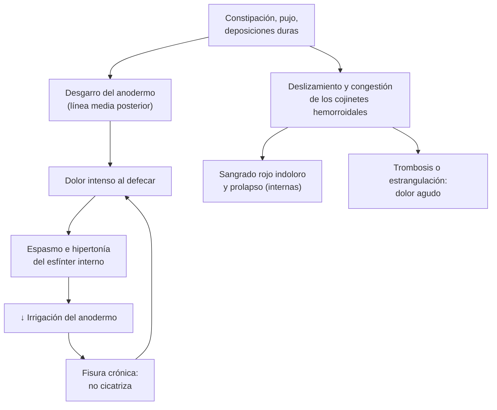

---
tags:
  - Cirugía
  - Frecuente en sala
---

# Hemorroides y fisura anal

**Subespecialidad**
Cirugía general · Coloproctología

**Guías principales**
Guía ASCRS de manejo de las hemorroides (*Dis Colon Rectum* 2024) · Guía ASCRS de manejo de la fisura anal (*Dis Colon Rectum* 2023)

**Otras fuentes**
Guía ASCRS de hemorroides 2018 · Revisión Cochrane del tratamiento no quirúrgico de la fisura anal (2012)

**GES**
No.

**EUNACOM**
4.01.1.016 Hemorroides - fisura anal · 4.01.1.020 Fisura anorrectal (ambas: diagnóstico específico, tratamiento inicial, seguimiento completo)

**Revisado**
Octubre 2026

!!! abstract "Resumen en 60 segundos"
    - **Hemorroides**: todos las tenemos (son cojinetes vasculares normales). La **enfermedad hemorroidal** es cuando dan síntomas.
        - **Internas**: **sangrado rojo indoloro** al defecar y **prolapso** (grados I a IV de Goligher). No duelen salvo que se trombosen o estrangulen.
        - **Externas**: bajo la línea pectínea; dan **dolor intenso** cuando se **trombosan**.
    - **Fisura anal**: desgarro del anodermo, casi siempre en la **línea media posterior**. **Dolor intenso al defecar** que dura minutos a horas, con sangrado escaso.
    - **Sangrado rectal**: descartar un **cáncer colorrectal** con **colonoscopía** si hay **edad ≥ 45 años**, anemia, cambio del hábito intestinal, baja de peso o antecedente familiar.
    - **Tratamiento base de ambas**: **fibra** (25–35 g/día), **agua**, **baños de asiento** y evitar el pujo.
    - **Hemorroides internas grado I–III** que no ceden: **ligadura elástica** en el box. **Grado III–IV** o fracaso: **hemorroidectomía**.
    - **Hemorroide externa trombosada** de menos de **72 h**: **escisión** con anestesia local; después, manejo médico.
    - **Fisura crónica** (más de 6–8 semanas): **nifedipino o diltiazem tópico** (o nitroglicerina), luego **toxina botulínica** o **esfinterotomía lateral interna**.
    - **Fisura lateral o atípica**: pensar en **Crohn**, **TBC**, **VIH**, **sífilis** o **cáncer**.

## Definición

- **Hemorroides**: cojinetes **vasculares** submucosos del canal anal (plexos arteriovenosos con músculo liso y tejido conectivo). Contribuyen a la continencia.
- **Enfermedad hemorroidal**: hemorroides **sintomáticas** (sangrado, prolapso, dolor, prurito).
    - **Internas**: **sobre la línea pectínea**, cubiertas por **mucosa** (inervación visceral: **no duelen**).
    - **Externas**: **bajo la línea pectínea**, cubiertas por **anodermo** (inervación somática: **duelen**).
    - **Mixtas**: ambos componentes.
- **Fisura anal**: **desgarro lineal del anodermo** distal a la línea pectínea.
    - **Aguda**: menos de **6–8 semanas**, bordes netos.
    - **Crónica**: más de 6–8 semanas, con **bordes indurados**, **fibras del esfínter interno** visibles en el fondo, **papila hipertrófica** y **plicoma centinela**.

## Epidemiología

### Mundial

- La enfermedad hemorroidal es una de las consultas proctológicas más frecuentes; su prevalencia aumenta con la edad (peak entre los **45 y 65 años**).
- La fisura anal es una causa frecuente de **dolor anal** en adultos jóvenes y de mediana edad, sin diferencia por sexo. En niños es la causa más común de sangrado rectal.
- Las fisuras se ubican en la **línea media posterior** en la mayoría de los casos; la **anterior** es más frecuente en mujeres, sobre todo tras el **parto**.

### Chile

!!! chile "Datos nacionales"
    - No se encontraron estudios poblacionales chilenos recientes de prevalencia de hemorroides o fisura anal.
    - Ambas se manejan en la **APS** (manejo médico) y en el policlínico de coloproctología (ligadura, cirugía).
    - El **cáncer colorrectal** es una de las primeras causas de muerte por cáncer en Chile: todo sangrado rectal en mayores de 45 años, o con signos de alarma, merece **colonoscopía** antes de atribuirlo a las hemorroides (ver [cáncer colorrectal](../../gastroenterologia/tumores-de-colon-y-cancer-colorrectal.md)).

## Etiología y factores de riesgo

| Enfermedad hemorroidal | Fisura anal |
|---|---|
| **Constipación** y **pujo** prolongado | **Paso de deposiciones duras** (constipación) |
| **Diarrea crónica** | Diarrea explosiva |
| Tiempo prolongado sentado en el baño (celular) | **Parto** (fisura anterior) |
| **Embarazo** y puerperio | **Hipertonía del esfínter anal interno** |
| Dieta pobre en **fibra**, obesidad | **Fisura atípica**: Crohn, TBC, VIH, sífilis, herpes, cáncer anal, leucemia |
| Edad (debilidad del tejido de sostén), hipertensión portal (várices rectales, distintas de las hemorroides) | |

## Fisiopatología

- **Hemorroides**: el **pujo** y la **presión** repetida debilitan el tejido de sostén (ligamento de Treitz) → los cojinetes **se deslizan** hacia abajo, se congestionan y **sangran** (sangre **arterial**, roja brillante).
    - Si el prolapso queda atrapado por el esfínter: **edema**, **trombosis** y, rara vez, **necrosis** (hemorroides estranguladas).
    - **Hemorroide externa trombosada**: un coágulo en el plexo externo, bajo el anodermo sensitivo → **dolor intenso** de inicio brusco.
- **Fisura anal**: el trauma de una deposición dura desgarra el anodermo → el dolor produce **espasmo** del esfínter interno → **hipertonía** → **menor irrigación** del anodermo (la línea media posterior es la peor irrigada) → la fisura **no cicatriza** → círculo vicioso.
    - Por eso el tratamiento busca **relajar el esfínter** (química o quirúrgicamente).

*Figura 1. Fisiopatología de la fisura anal (círculo vicioso de dolor, espasmo e isquemia) y de la enfermedad hemorroidal. Esquema propio basado en las guías ASCRS.*

## Clasificación

| Hemorroides internas (Goligher) | Descripción | Tratamiento sugerido |
|---|---|---|
| **Grado I** | Sangran, **no prolapsan** | Médico; ligadura si persiste |
| **Grado II** | Prolapsan con el pujo y **se reducen solas** | Médico + **ligadura elástica** |
| **Grado III** | Prolapsan y requieren **reducción manual** | Ligadura o **hemorroidectomía** |
| **Grado IV** | Prolapso **irreductible** | **Hemorroidectomía** |

| Fisura anal | Características |
|---|---|
| **Aguda** | Menos de 6–8 semanas; bordes netos, fondo rosado |
| **Crónica** | Más de 6–8 semanas; bordes indurados, fibras del esfínter visibles, **plicoma centinela**, papila hipertrófica |
| **Típica** | Línea media posterior (o anterior) |
| **Atípica** | **Lateral**, múltiple, grande o indolora: estudiar causas secundarias |

## Clínica

- **Hemorroides internas**:
    - **Sangrado rojo brillante, indoloro**, que **cubre las deposiciones**, gotea en el WC o mancha el papel.
    - **Prolapso**, sensación de bulto, humedad, **prurito**, manchado mucoso.
- **Hemorroides externas trombosadas**:
    - **Dolor anal intenso** de inicio brusco, con un **nódulo azulado**, duro y doloroso en el margen anal.
    - El dolor es máximo en las primeras **48–72 h** y luego cede.
- **Hemorroides internas estranguladas**: prolapso irreductible, edematoso y muy doloroso; puede haber necrosis.
- **Fisura anal**:
    - **Dolor intenso, "como vidrio cortando", durante y después de la defecación**, que dura **minutos a horas**.
    - **Sangrado escaso** rojo en el papel.
    - Miedo a defecar → más **constipación** → empeora el cuadro.
- **Examen**:
    - **Inspección** separando suavemente los glúteos: la fisura suele **verse** sin tacto.
    - En la fisura, **evitar el tacto rectal y la anoscopía** por el dolor (o hacerlos con anestesia tópica).
    - Las hemorroides internas se ven con **anoscopía**; no se palpan salvo trombosadas.

## Diagnóstico

!!! guia "Evaluación (ASCRS 2024 y 2023)"
    - El diagnóstico es **clínico**: anamnesis, **inspección**, **tacto rectal** y **anoscopía** (en la fisura, solo la inspección si hay mucho dolor).
    - **Evaluación del colon** (colonoscopía) en pacientes con sangrado rectal y **factores de riesgo** de cáncer colorrectal: **edad ≥ 45 años** (o según el tamizaje vigente), **anemia ferropénica**, cambio del hábito intestinal, baja de peso, antecedente familiar o sangrado que no corresponde a hemorroides.
    - **Fisura atípica** (lateral, múltiple, indolora o que no cicatriza): examen bajo anestesia y **biopsia**; estudiar **Crohn**, **TBC**, **VIH**, **sífilis** y **cáncer**.

## Laboratorio

| Examen | Uso |
|---|---|
| **Hemograma** | Anemia en el sangrado crónico (no atribuir una anemia ferropénica a las hemorroides sin estudiar el colon) |
| **VIH, VDRL o RPR** | Fisuras atípicas o úlceras anales |
| **Coagulación** | Sangrado importante o uso de anticoagulantes |
| **Biopsia** | Fisura atípica o lesión sospechosa |

## Imágenes

- **Anoscopía** y **rectosigmoidoscopía**: ven las hemorroides internas y lesiones del recto distal.
- **Colonoscopía**: en el sangrado con factores de riesgo o según el tamizaje de cáncer colorrectal.
- **Ecografía endoanal o RM pélvica**: no se necesitan en la enfermedad hemorroidal ni en la fisura típica; útiles si se sospecha una fístula o un absceso (ver [abscesos y fístulas](abscesos-fistulas-y-otras-patologias-anorrectales.md)).

## Diagnóstico diferencial

| Diagnóstico | Diferencias |
|---|---|
| **Cáncer colorrectal o anal** | Edad, anemia, baja de peso, cambio del hábito, sangre mezclada con las deposiciones; colonoscopía y biopsia |
| **Absceso perianal** | Dolor **constante** (no solo al defecar), fiebre, aumento de volumen eritematoso y fluctuante |
| **Fístula perianal** | Orificio externo con secreción purulenta intermitente |
| **Prolapso rectal** | Pliegues **circulares** concéntricos (en las hemorroides, los pliegues son **radiales**) |
| **Pólipo rectal prolapsado** o papila hipertrófica | Anoscopía |
| **Plicoma** | Pliegue cutáneo residual, indoloro, sin sangrado |
| **Condilomas** | Lesiones verrugosas (ver [patología anorrectal](abscesos-fistulas-y-otras-patologias-anorrectales.md)) |
| **Enfermedad inflamatoria intestinal** | Diarrea, fisuras atípicas, fístulas (ver [EII](../../gastroenterologia/enfermedad-inflamatoria-intestinal.md)) |
| **Proctalgia fugaz** | Dolor anal breve, sin relación con la defecación y sin lesión |

## Tratamiento

### Medidas para todos

- **Fibra** en la dieta o suplementos (psyllium) para llegar a **25–35 g/día**, con **abundante agua**: recomendación fuerte en ambas enfermedades.
- **Ablandadores** de deposiciones si se necesita (polietilenglicol).
- **Baños de asiento** con agua tibia, 2–3 veces al día y después de defecar.
- **No pujar** y no permanecer mucho tiempo sentado en el baño.
- **Analgesia** (paracetamol, AINE). Evitar los opioides que constipan.

### Enfermedad hemorroidal

- **Tópicos** (cremas con corticoide y anestésico local): alivian los síntomas **pocos días**; no tratan la causa. No usar corticoides por más de 1 semana (atrofia de la piel).
- **Flavonoides** (diosmina-hesperidina): pueden aliviar los síntomas agudos.
- **Procedimientos en el box** para las **internas grado I–III** que no responden al manejo médico:
    - **Ligadura con banda elástica**: el procedimiento de elección.
    - Escleroterapia o fotocoagulación infrarroja: alternativas, sobre todo en grados I–II o en anticoagulados (escleroterapia).
- **Hemorroidectomía quirúrgica** (Milligan-Morgan o Ferguson): grado **III–IV**, **mixtas** grandes, fracaso de la ligadura o **estranguladas**. Es la técnica más eficaz, pero con más **dolor** posoperatorio.
- Alternativas: desarterialización hemorroidal guiada por Doppler o hemorroidopexia con stapler (más recidivas).
- **Hemorroide externa trombosada**:
    - **Menos de 72 h** de evolución: **escisión** completa (no la simple incisión) con anestesia local, con alivio rápido y menos recidiva.
    - **Más de 72 h**: **manejo médico**, porque el dolor ya está cediendo.
- **Embarazo**: manejo médico; la cirugía se posterga hasta después del parto.

### Fisura anal

- **Aguda**: **medidas generales** (fibra, baños de asiento, analgesia). Muchas cicatrizan en semanas.
- **Crónica** (o aguda que no cicatriza):
    1. **Tópicos que relajan el esfínter** por **6–8 semanas**: **bloqueadores de calcio** (nifedipino o diltiazem) o **nitroglicerina**. Los bloqueadores de calcio dan **menos cefalea**.
    2. **Toxina botulínica** en el esfínter interno si fracasan los tópicos (riesgo bajo de incontinencia transitoria).
    3. **Esfinterotomía lateral interna** (ELI): la más eficaz (cicatriza la gran mayoría), con riesgo pequeño de **incontinencia** a gases o líquidos. Es la primera opción quirúrgica en pacientes sin factores de riesgo de incontinencia.
- **Fisura con esfínter normotónico, mujeres después del parto o riesgo de incontinencia**: preferir colgajo de avance (anoplastía) en vez de esfinterotomía.

!!! dosis "Medicamentos habituales en el adulto"
    | Fármaco | Dosis | Comentario |
    |---|---|---|
    | **Psyllium** | 1 sobre (3,5–5 g) 1–3 veces al día, con abundante agua | Base del tratamiento |
    | **Polietilenglicol 3350** | 17 g/día en agua | Si persiste la constipación |
    | **Nifedipino 0,2–0,3 % o diltiazem 2 %** en crema o gel (preparado magistral) | Aplicar en el margen anal **2–3 veces al día por 6–8 semanas** | **Fisura crónica**; menos cefalea que la nitroglicerina |
    | **Nitroglicerina 0,2–0,4 %** en pomada | 2 veces al día por 6–8 semanas | **Cefalea** frecuente; no usar con sildenafil |
    | **Lidocaína 2 %** en gel | Antes de defecar | Alivio del dolor |
    | **Crema de hidrocortisona + anestésico** | 2 veces al día por **máximo 7 días** | Síntomas hemorroidales agudos |
    | **Diosmina + hesperidina** (Daflon 500 mg) | Crisis: **3 g/día por 4 días** y luego 2 g/día por 3 días; mantención 1 g/día | Hemorroides agudas (alivio sintomático) |
    | **Toxina botulínica A** | 20–100 UI inyectadas en el esfínter interno (especialista) | Fisura crónica refractaria |

!!! alarma "Derivar"
    - **Sangrado rectal** con **edad ≥ 45 años**, **anemia**, baja de peso, cambio del hábito intestinal o antecedente familiar de cáncer colorrectal: **colonoscopía**.
    - **Hemorroides estranguladas** o necróticas, o sangrado masivo: **urgencia** (cirugía).
    - **Hemorroide externa trombosada** de menos de 72 h: escisión (derivación a cirugía o al box).
    - **Fisura atípica** o que no cicatriza con tratamiento médico: coloproctología.
    - Dolor anal **constante** con **fiebre** o aumento de volumen: **absceso** (drenaje urgente).

## Complicaciones

- **Enfermedad hemorroidal**: **trombosis**, **estrangulación** y necrosis, **anemia** por sangrado crónico (rara), prurito.
- **Ligadura elástica**: dolor, sangrado tardío (al caer la escara, día 7–10), retención urinaria y, rara vez, **sepsis pélvica** (fiebre, dolor y retención urinaria después de una ligadura: urgencia).
- **Hemorroidectomía**: **dolor** intenso, **retención urinaria**, sangrado, **estenosis anal**, **incontinencia**.
- **Fisura**: cronicidad, **fístula** subcutánea (rara).
- **Esfinterotomía**: **incontinencia** a gases o deposiciones líquidas (poco frecuente), recurrencia.

## Pronóstico y seguimiento

- **Hemorroides**: excelente pronóstico con fibra y procedimientos; la ligadura puede requerir **varias sesiones** y hay **recidivas**, que se tratan con nuevas ligaduras o cirugía.
- **Fisura aguda**: la mayoría cicatriza con medidas generales.
- **Fisura crónica**: cicatriza con tópicos en una parte de los casos; la **esfinterotomía** logra la tasa más alta de curación.
- **Seguimiento**: control a las **6–8 semanas** del tratamiento tópico; mantener la fibra **de por vida** para evitar las recidivas.

## Perlas para el internado

!!! perla "Para recordar en la sala"
    - **Hemorroides internas no duelen; las externas trombosadas sí.** Si duele mucho al defecar y no hay un nódulo, piense en **fisura**.
    - **Dolor al defecar que dura horas + sangre en el papel** = fisura anal.
    - **Fisura que no está en la línea media** = buscar Crohn, TBC, VIH, sífilis o cáncer.
    - **No atribuir un sangrado o una anemia a las hemorroides sin descartar un cáncer colorrectal** en mayores de 45 años o con signos de alarma.
    - **Hemorroide externa trombosada < 72 h**: escisión, no solo incisión.
    - **Pliegues radiales = hemorroides; pliegues circulares = prolapso rectal.**
    - **Fibra y agua** son el tratamiento de base de ambas.
    - **Fiebre, dolor y retención urinaria tras una ligadura** = sepsis pélvica: urgencia.

## Preguntas de repaso

??? repaso "1. Hombre de 32 años con dolor anal intenso al defecar desde hace 3 meses, que dura 2 horas, con sangre roja en el papel. Al separar los glúteos se ve un desgarro en la línea media posterior con un plicoma. ¿Qué tiene y cómo lo trata?"
    - **Fisura anal crónica** (más de 8 semanas, con plicoma centinela).
    - **Fibra**, agua, baños de asiento y analgesia.
    - **Nifedipino o diltiazem tópico** (o nitroglicerina) por **6–8 semanas**.
    - Si no cicatriza: **toxina botulínica** o **esfinterotomía lateral interna**.

??? repaso "2. Mujer de 40 años con un nódulo anal azulado, duro y muy doloroso desde hace 36 horas. ¿Qué tiene y qué hace?"
    - **Hemorroide externa trombosada**.
    - Por tener **menos de 72 h**: **escisión** del trombo y la hemorroide con **anestesia local** (alivio rápido, menos recidiva).
    - Después: fibra, baños de asiento y analgesia.

??? repaso "3. Hombre de 58 años con sangrado rojo indoloro al defecar desde hace 2 meses. Hemoglobina 10,5 g/dL, ferritina baja. En la anoscopía hay hemorroides internas grado II. ¿Basta con tratar las hemorroides?"
    - **No**. Tiene **más de 45 años** y **anemia ferropénica**: hay que hacer una **colonoscopía** para descartar un **cáncer colorrectal** antes de atribuir el sangrado a las hemorroides.
    - Las hemorroides grado II se pueden tratar con fibra y **ligadura elástica**.

??? repaso "4. Paciente con hemorroides internas grado IV, con prolapso irreductible y episodios de sangrado repetidos pese a la fibra. ¿Cuál es el tratamiento?"
    - **Hemorroidectomía quirúrgica** (Milligan-Morgan o Ferguson).
    - Advertir sobre el **dolor posoperatorio** y la **retención urinaria**; analgesia multimodal, fibra y baños de asiento.

??? repaso "5. Hombre de 29 años, VIH positivo, con una fisura anal lateral izquierda indolora que no cicatriza tras 2 meses. ¿Qué hace?"
    - **Fisura atípica**: no tratar como una fisura común.
    - **Examen bajo anestesia** con **biopsia** y cultivo; **VDRL/RPR**, PCR de herpes, estudio de **TBC**; descartar **Crohn** y **cáncer anal** (más frecuente en personas con VIH).

??? repaso "6. Paciente con fiebre de 38,6 °C, dolor perineal y retención urinaria 2 días después de una ligadura elástica de hemorroides. ¿Qué sospecha?"
    - **Sepsis pélvica** tras la ligadura: complicación rara pero grave.
    - **Hospitalizar**, **antibióticos de amplio espectro** IV, TC pélvica y evaluación por cirugía (puede requerir desbridamiento).

## Referencias

1. Hawkins AT, Davis BR, Bhama AR, et al. The American Society of Colon and Rectal Surgeons Clinical Practice Guidelines for the Management of Hemorrhoids. *Dis Colon Rectum.* 2024;67(5):614–623. doi:[10.1097/DCR.0000000000003276](https://doi.org/10.1097/DCR.0000000000003276)
2. Davis BR, Lee-Kong SA, Migaly J, et al. The American Society of Colon and Rectal Surgeons Clinical Practice Guidelines for the Management of Hemorrhoids. *Dis Colon Rectum.* 2018;61(3):284–292. doi:[10.1097/DCR.0000000000001030](https://doi.org/10.1097/DCR.0000000000001030)
3. Davids JS, Hawkins AT, Bhama AR, et al. The American Society of Colon and Rectal Surgeons Clinical Practice Guidelines for the Management of Anal Fissures. *Dis Colon Rectum.* 2023;66(2):190–199. doi:[10.1097/DCR.0000000000002664](https://doi.org/10.1097/DCR.0000000000002664)
4. Stewart DB Sr, Gaertner W, Glasgow S, et al. Clinical Practice Guideline for the Management of Anal Fissures. *Dis Colon Rectum.* 2017;60(1):7–14. doi:[10.1097/DCR.0000000000000735](https://doi.org/10.1097/DCR.0000000000000735)
5. Nelson RL, Thomas K, Morgan J, Jones A. Non surgical therapy for anal fissure. *Cochrane Database Syst Rev.* 2012;(2):CD003431. doi:[10.1002/14651858.CD003431.pub3](https://doi.org/10.1002/14651858.CD003431.pub3)
