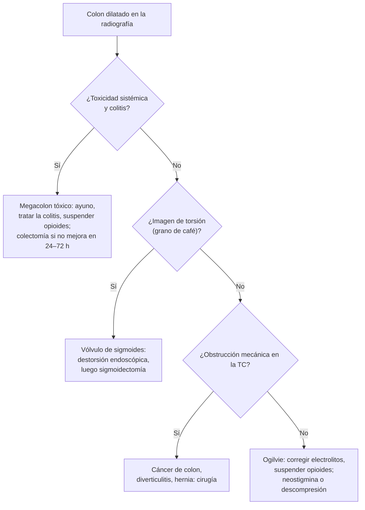

---
tags:
  - Cirugía
  - Urgencia
---

# Megacolon, colostomías e ileostomías

**Subespecialidad**
Coloproctología · Cirugía digestiva

**Guías principales**
Guía ASGE de seudoobstrucción colónica aguda y vólvulo (*Gastrointest Endosc* 2020) · Guía ERNICA de enfermedad de Hirschsprung (*Orphanet J Rare Dis* 2020) · Guía ASCRS de cirugía de ostomías (*Dis Colon Rectum* 2022)

**Otras fuentes**
Alteraciones motoras digestivas en la enfermedad de Chagas en Chile (*Rev Med Chile* 2004)

**GES**
No.

**EUNACOM**
4.01.1.012 Megacolon (sospecha, inicial) · 4.01.3.004 Colostomías · 4.01.3.015 Ileostomías (conocimiento general)

**Revisado**
Octubre 2026

!!! abstract "Resumen en 60 segundos"
    - **Megacolon**: dilatación del colon. **Agudo** o **crónico**, **tóxico** o no.
        - **Megacolon tóxico**: colon **> 6 cm** con **toxicidad sistémica** (colitis ulcerosa grave, *C. difficile*): urgencia; si no mejora en 24–72 h o se perfora, **colectomía**.
        - **Seudoobstrucción aguda (Ogilvie)**: adulto mayor **hospitalizado** o posoperado; ciego **> 12 cm** = riesgo de perforación. Corregir la causa y, si no responde, **neostigmina** o descompresión endoscópica.
        - **Vólvulo de sigmoides**: adulto mayor **constipado**, institucionalizado; "**grano de café**" en la radiografía. **Destorsión endoscópica** y luego **sigmoidectomía** electiva.
        - **Crónico**: **Hirschsprung** (recién nacido sin meconio en 48 h; zona **aganglionar**; biopsia rectal) y **chagásico** (en Chile la manifestación digestiva más frecuente de la enfermedad de Chagas).
    - **Ostomías**:
        - **Colostomía**: deposición **formada**, **sin** espolón; en el colon izquierdo (Hartmann, cáncer de recto bajo).
        - **Ileostomía**: débito **líquido** y abundante, **con espolón** (protruye 2–3 cm) para proteger la piel; riesgo de **deshidratación**.
        - Complicaciones: **dermatitis**, **hernia paraostomal**, prolapso, retracción, necrosis, estenosis, **alto débito**.

## Definición

- **Megacolon**: dilatación del colon que se define, en la radiografía, por un diámetro **> 6 cm** en el colon transverso o descendente, o **> 12 cm** en el ciego.
- **Megacolon tóxico**: dilatación colónica **total o segmentaria** no obstructiva con **toxicidad sistémica**.
- **Seudoobstrucción colónica aguda** (síndrome de Ogilvie): dilatación aguda del colon **sin obstrucción mecánica**.
- **Vólvulo**: torsión de un segmento del colon sobre su mesenterio; el más frecuente es el de **sigmoides**, luego el de **ciego**.
- **Enfermedad de Hirschsprung**: ausencia congénita de **células ganglionares** (plexos mientérico y submucoso) en un segmento distal del intestino.
- **Ostomía**: abocamiento quirúrgico del intestino a la piel.
    - **Terminal**: un solo cabo abierto.
    - **En asa** (lateral): el asa se exterioriza y se abre; habitualmente **transitoria** (protección de una anastomosis).
    - **Colostomía**, **ileostomía**; **operación de Hartmann** (resección del sigmoides con colostomía terminal y cierre del muñón rectal).

## Epidemiología

### Mundial

- **Megacolon tóxico**: complicación de las **colitis graves** (colitis ulcerosa, *C. difficile*, colitis infecciosas, isquémica).
- **Ogilvie**: adultos mayores hospitalizados con múltiples comorbilidades, tras cirugías (ortopédicas, cesárea, cardíacas), traumas o con fármacos (**opioides**, anticolinérgicos).
- **Vólvulo de sigmoides**: adulto mayor, institucionalizado, con **constipación crónica**, enfermedad neurológica o psiquiátrica; más frecuente en regiones con dieta alta en fibra y en la altura (el "**cinturón del vólvulo**", que incluye zonas andinas).
- **Hirschsprung**: alrededor de **1 por cada 5000** recién nacidos, más en varones; asociado al síndrome de Down.

### Chile

!!! chile "Datos nacionales"
    - En Chile, la **enfermedad de Chagas** compromete con frecuencia el **colon** (megacolon) y rara vez el esófago (acalasia), a diferencia de otros países sudamericanos (Madrid, 2004).
    - No se encontraron datos nacionales recientes sobre el número de personas ostomizadas.

## Etiología y factores de riesgo

| Tipo | Causas |
|---|---|
| **Megacolon tóxico** | **Colitis ulcerosa** grave, **colitis por *C. difficile*** (ver [diarrea y *C. difficile*](../../gastroenterologia/diarrea-aguda-y-clostridioides-difficile.md)), colitis infecciosas (*Salmonella*, *Shigella*, CMV en inmunosuprimidos), isquémica. Precipitantes: **opioides**, antidiarreicos, anticolinérgicos, hipokalemia, colonoscopía |
| **Seudoobstrucción aguda (Ogilvie)** | Posoperatorio, trauma, infecciones graves, cardiopatía, **opioides**, anticolinérgicos, **trastornos electrolíticos** (K, Mg, Ca), hipotiroidismo |
| **Vólvulo** | Sigmoides redundante con mesenterio largo y base estrecha; constipación crónica, Chagas, institucionalización |
| **Megacolon crónico adquirido** | **Chagas**, constipación crónica grave, enfermedades neurológicas (Parkinson, lesión medular), hipotiroidismo, fármacos |
| **Megacolon congénito** | **Enfermedad de Hirschsprung** |

## Fisiopatología

- **Hirschsprung**: la migración de las células de la cresta neural se detiene → el segmento **aganglionar** (siempre incluye el **recto**) queda **contraído** y sin peristalsis → obstrucción funcional y **dilatación** del colon sano proximal.
- **Chagas**: *Trypanosoma cruzi* destruye las neuronas del plexo mientérico → hipomotilidad y dilatación progresiva (sigmoides y recto).
- **Megacolon tóxico**: la inflamación transmural daña el músculo liso y los plexos → **parálisis** y dilatación → riesgo de **perforación**.
- **Ogilvie**: desequilibrio autonómico (predominio simpático) → colon sin peristalsis; por la **ley de Laplace**, el **ciego** (mayor diámetro) es el que se perfora.
- **Vólvulo**: la torsión produce una **obstrucción en asa cerrada** → distensión, compromiso vascular → **isquemia** y perforación.

*Figura 1. Enfoque del colon dilatado en el adulto. Esquema propio basado en la guía ASGE 2020.*

## Clasificación

**Ostomías: diferencias prácticas**:

| | **Colostomía** | **Ileostomía** |
|---|---|---|
| **Ubicación habitual** | Fosa ilíaca **izquierda** (sigmoides o descendente) | Fosa ilíaca **derecha** |
| **Débito** | **Formado** o pastoso; 200–300 g/día | **Líquido**; habitualmente **0,5–1,2 L/día** |
| **Forma** | A ras de la piel o levemente elevada | Con **espolón** (protruye **2–3 cm**) para que el efluente no dañe la piel |
| **Efluente** | Menos irritante | **Rico en enzimas**: muy irritante para la piel |
| **Riesgo principal** | Hernia paraostomal, prolapso | **Deshidratación**, **alto débito** (> 1,5–2 L/día), hipokalemia, hipomagnesemia, lesión renal aguda |
| **Usos típicos** | **Operación de Hartmann**, cáncer de recto bajo (amputación abdominoperineal), protección de lesiones perianales | **Protección** de una anastomosis colorrectal baja o ileoanal; **colectomía total** (colitis ulcerosa, poliposis) |

## Clínica

- **Megacolon tóxico**: diarrea con sangre que **disminuye** (signo engañoso), **distensión abdominal**, dolor, **fiebre**, **taquicardia**, compromiso de conciencia, hipotensión; signos peritoneales si se perfora (pueden estar enmascarados por los corticoides).
- **Ogilvie**: **distensión abdominal** progresiva e indolora o poco dolorosa en un paciente hospitalizado; puede seguir eliminando gases y deposiciones. Dolor, fiebre o peritonitis sugieren **isquemia** o perforación.
- **Vólvulo de sigmoides**: **distensión abdominal** marcada y **asimétrica**, dolor cólico, **ausencia de deposiciones y gases**, timpanismo; peritonitis si hay gangrena.
- **Hirschsprung**: recién nacido que **no elimina meconio en las primeras 48 h**, distensión, vómitos biliosos; en niños mayores, **constipación crónica grave** desde el nacimiento. Complicación grave: **enterocolitis**.
- **Megacolon chagásico**: **constipación crónica** progresiva en un adulto de zona endémica, distensión, **fecalomas**, vólvulo de sigmoides.

## Diagnóstico

!!! guia "Puntos clave (ASGE 2020, ERNICA 2020)"
    - **Radiografía de abdomen**: diámetro del colon y del **ciego**; **grano de café** u "**omega**" (vólvulo de sigmoides); neumoperitoneo.
    - **TC de abdomen y pelvis con contraste**: descarta una **obstrucción mecánica**, confirma el vólvulo (signo del **remolino**) y muestra signos de **isquemia** o perforación.
    - **Megacolon tóxico**: radiografía seriada, laboratorio, **toxina o PCR de *C. difficile***; **no** hacer colonoscopía completa (riesgo de perforación); rectosigmoidoscopía con cuidado para biopsias.
    - **Hirschsprung**: **biopsia rectal por succión** (ausencia de células ganglionares, aumento de la acetilcolinesterasa); enema baritado (zona de transición) y manometría anorrectal (ausencia del reflejo rectoanal inhibitorio) como apoyo.
    - **Chagas**: **serología** para *T. cruzi*, enema baritado (dolicomegacolon), ECG y ecocardiograma (miocardiopatía).

## Laboratorio

| Examen | Uso |
|---|---|
| **Hemograma, PCR** | Leucocitosis (megacolon tóxico, isquemia) |
| **Electrolitos** (K, Mg, Ca) | **Hipokalemia** e hipomagnesemia (Ogilvie, megacolon tóxico, ileostomía de alto débito) |
| **Lactato**, gases | **Isquemia** |
| **Toxina o PCR de *C. difficile*** | Megacolon tóxico |
| **TSH** | Hipotiroidismo (Ogilvie, megacolon crónico) |
| **Serología para *T. cruzi*** | Megacolon chagásico |
| **Creatinina**, Na urinario | Deshidratación en la ileostomía de alto débito |

## Imágenes

| Examen | Uso |
|---|---|
| **Radiografía de abdomen** | Diámetro del colon, grano de café, neumoperitoneo |
| **TC con contraste** | Obstrucción mecánica, vólvulo, isquemia, perforación |
| **Enema contrastado** | Zona de transición (Hirschsprung), dolicomegacolon (Chagas) |
| **Colonoscopía** | Descompresión (Ogilvie) y **destorsión** (vólvulo de sigmoides); contraindicada en el megacolon tóxico |

## Diagnóstico diferencial

| Colon dilatado | Claves |
|---|---|
| **Obstrucción mecánica** (cáncer de colon, diverticulitis, hernia) | Punto de transición en la TC (ver [cáncer colorrectal](../../gastroenterologia/tumores-de-colon-y-cancer-colorrectal.md)) |
| **Vólvulo de sigmoides o de ciego** | Asa en grano de café o en riñón, signo del remolino |
| **Ogilvie** | Hospitalizado, sin obstrucción, sin colitis |
| **Megacolon tóxico** | Colitis con toxicidad sistémica |
| **Íleo paralítico** | Dilatación del intestino delgado y del colon en el posoperatorio |
| **Fecaloma** | Adulto mayor, tacto rectal con heces impactadas (ver [constipación y fecaloma](../../gastroenterologia/constipacion-intestino-irritable-y-diarrea-cronica.md)) |

## Tratamiento

### Megacolon tóxico

- **Hospitalizar** con cirugía y gastroenterología: ayuno, sonda nasogástrica, **fluidos y electrolitos** (corregir el **potasio**), **suspender opioides, anticolinérgicos y antidiarreicos**.
- **Tratar la causa**: corticoides IV (colitis ulcerosa), **vancomicina oral** o fidaxomicina (*C. difficile*), antibióticos de amplio espectro si hay toxicidad.
- **Colectomía subtotal con ileostomía** si hay **perforación**, hemorragia masiva, deterioro clínico o **falta de mejoría en 24–72 h**.

### Seudoobstrucción colónica aguda (Ogilvie)

- **Medidas conservadoras** (24–48 h si el ciego mide < 12 cm y no hay isquemia): ayuno, sonda nasogástrica y rectal, **corregir electrolitos**, **suspender opioides** y anticolinérgicos, movilizar, posición prona o rodilla-pecho.
- **Neostigmina** IV (2 mg en 3–5 minutos) si no responde, con **monitorización cardíaca** y **atropina** disponible (bradicardia); contraindicada si hay obstrucción mecánica.
- **Descompresión colonoscópica** si falla la neostigmina o está contraindicada.
- **Cirugía** (cecostomía o resección) si hay **perforación**, **isquemia** o fracaso del manejo.

### Vólvulo de sigmoides

- **Sin peritonitis ni isquemia**: **destorsión endoscópica** (sigmoidoscopía flexible) con sonda rectal; luego **sigmoidectomía electiva** en la misma hospitalización (recurrencia muy alta si no se opera).
- **Con gangrena o perforación**: **cirugía urgente** (operación de Hartmann).
- **Vólvulo de ciego**: **cirugía** (hemicolectomía derecha); la destorsión endoscópica no se recomienda.

### Hirschsprung y megacolon crónico

- **Hirschsprung**: **descenso endorrectal** (resección del segmento aganglionar y descenso del colon sano); tratar y prevenir la **enterocolitis**.
- **Megacolon chagásico**: dieta, laxantes y enemas; **cirugía** (resección del segmento dilatado) en los casos complicados o con vólvulo.

### Cuidado de las ostomías

!!! dosis "Cuidados básicos"
    - **Marcación preoperatoria** del sitio de la ostomía por un especialista (lejos de pliegues, cicatrices y prominencias óseas, visible para el paciente).
    - **Educación** por enfermería de ostomías: cambio de la bolsa, cuidado de la **piel** periestomal, dieta.
    - **Ileostomía**: controlar el **débito**; si es **alto** (> 1,5–2 L/día): **soluciones de rehidratación oral** con sodio, **restringir los líquidos hipotónicos** (agua, té, bebidas), **loperamida** antes de las comidas, y corregir el K y el Mg.
    - **Cierre** de una ostomía transitoria en asa: habitualmente a las **8–12 semanas** o más, tras confirmar la integridad de la anastomosis.

!!! alarma "Derivar de urgencia"
    - **Megacolon tóxico** o colitis grave que no responde.
    - **Ciego > 12 cm**, dolor, fiebre o peritonitis en una seudoobstrucción.
    - **Vólvulo** con signos de gangrena.
    - **Ostomía** de color **oscuro o negro** (necrosis), **retraída** o con **obstrucción**.
    - **Ileostomía de alto débito** con deshidratación o alza de la creatinina.

## Complicaciones

- **Megacolon tóxico y Ogilvie**: **perforación** (sobre todo del **ciego**), peritonitis, sepsis, muerte.
- **Vólvulo**: gangrena, perforación, **recurrencia**.
- **Hirschsprung**: **enterocolitis** (diarrea explosiva, fiebre, distensión: grave), constipación persistente tras la cirugía.
- **Ostomías**:
    - **Precoces**: **necrosis** (isquemia), **retracción**, edema, sangrado, **dermatitis** periestomal, **alto débito** (ileostomía).
    - **Tardías**: **hernia paraostomal** (la más frecuente), **prolapso**, **estenosis**, retracción, impacto psicológico y en la imagen corporal.

## Pronóstico y seguimiento

- **Megacolon tóxico**: mortalidad alta si se perfora; la colectomía oportuna la reduce.
- **Vólvulo de sigmoides**: la sigmoidectomía electiva evita la recurrencia.
- **Ostomías**: con educación y apoyo, la mayoría de los pacientes recupera su vida habitual; seguimiento por enfermería de ostomías y control de la hernia paraostomal.

## Perlas para el internado

!!! perla "Para recordar en la sala"
    - **Colitis + distensión + fiebre y taquicardia = megacolon tóxico**: radiografía, **no colonoscopía**, suspender opioides y antidiarreicos.
    - **Ciego > 12 cm = riesgo de perforación.**
    - **Distensión abdominal en un adulto mayor hospitalizado con opioides = Ogilvie**: corregir el K y el Mg, suspender los opioides; neostigmina con monitor y atropina.
    - **Grano de café = vólvulo de sigmoides**: destorsión endoscópica y luego sigmoidectomía.
    - **Recién nacido sin meconio en 48 h = Hirschsprung** → biopsia rectal.
    - **Megacolon en un adulto chileno de zona rural = pensar en Chagas** → serología.
    - **Ileostomía = espolón y débito líquido**: vigilar la deshidratación; **colostomía = deposición formada, a ras de piel**.
    - **Ileostomía de alto débito: no dar agua sola**, sino soluciones con sodio.
    - **Ostomía negra = necrosis**: avisar al cirujano.

## Preguntas de repaso

??? repaso "1. Paciente de 30 años con colitis ulcerosa grave en tratamiento con corticoides IV. Su diarrea disminuyó, pero tiene distensión abdominal, fiebre de 39 °C, FC 125 y el colon transverso mide 8 cm. ¿Qué tiene y qué hace?"
    - **Megacolon tóxico** (la disminución de la diarrea es engañosa).
    - Ayuno, SNG, fluidos, **corregir el potasio**, suspender opioides y anticolinérgicos, antibióticos, descartar *C. difficile* y CMV; evaluación quirúrgica.
    - **Colectomía subtotal con ileostomía** si no mejora en 24–72 h o hay perforación.

??? repaso "2. Hombre de 80 años operado de una fractura de cadera, con morfina, que al tercer día tiene distensión abdominal progresiva poco dolorosa. La radiografía muestra un colon muy dilatado con el ciego de 10 cm; la TC no muestra obstrucción. ¿Diagnóstico y manejo?"
    - **Seudoobstrucción colónica aguda (Ogilvie)**.
    - Ayuno, sonda nasogástrica y rectal, **corregir K y Mg**, **suspender los opioides**, movilizar.
    - Si no mejora en 24–48 h: **neostigmina** IV con monitorización y atropina; descompresión endoscópica si falla.

??? repaso "3. Mujer de 82 años institucionalizada, con constipación crónica, distensión abdominal asimétrica y sin deposiciones ni gases. La radiografía muestra una asa en grano de café. Sin peritonitis. ¿Conducta?"
    - **Vólvulo de sigmoides** sin signos de gangrena.
    - **Destorsión endoscópica** con sonda rectal y luego **sigmoidectomía electiva** en la misma hospitalización (por la alta recurrencia).

??? repaso "4. Recién nacido de término que no ha eliminado meconio a las 48 horas, con distensión abdominal y vómitos biliosos. ¿Qué sospecha y cómo confirma el diagnóstico?"
    - **Enfermedad de Hirschsprung**.
    - **Biopsia rectal por succión** (ausencia de células ganglionares). Tratamiento quirúrgico: **descenso endorrectal**. Vigilar la **enterocolitis**.

??? repaso "5. Paciente con una ileostomía en asa reciente, con un débito de 2,5 L/día, sed, mareo y creatinina que subió de 0,8 a 1,9 mg/dL. ¿Qué hace?"
    - **Ileostomía de alto débito** con **deshidratación** y **lesión renal aguda** prerrenal.
    - Hidratación IV, corregir el **K** y el **Mg**; **restringir los líquidos hipotónicos**, dar **soluciones de rehidratación oral con sodio** y **loperamida** antes de las comidas; buscar causas (infección, *C. difficile*, fármacos).

## Referencias

1. Naveed M, Jamil LH, Fujii-Lau LL, et al. American Society for Gastrointestinal Endoscopy guideline on the role of endoscopy in the management of acute colonic pseudo-obstruction and colonic volvulus. *Gastrointest Endosc.* 2020;91(2):228–235. doi:[10.1016/j.gie.2019.09.007](https://doi.org/10.1016/j.gie.2019.09.007)
2. Kyrklund K, Sloots CEJ, de Blaauw I, et al. ERNICA guidelines for the management of rectosigmoid Hirschsprung's disease. *Orphanet J Rare Dis.* 2020;15(1):164. doi:[10.1186/s13023-020-01362-3](https://doi.org/10.1186/s13023-020-01362-3)
3. Davis BR, Valente MA, Goldberg JE, et al. The American Society of Colon and Rectal Surgeons Clinical Practice Guidelines for Ostomy Surgery. *Dis Colon Rectum.* 2022;65(10):1173–1190. doi:[10.1097/DCR.0000000000002498](https://doi.org/10.1097/DCR.0000000000002498)
4. Madrid AM, Quera R, Defilippi C, et al. Alteraciones motoras gastrointestinales en la enfermedad de Chagas. *Rev Med Chile.* 2004;132(8):939–946. doi:[10.4067/s0034-98872004000800005](https://doi.org/10.4067/s0034-98872004000800005)
