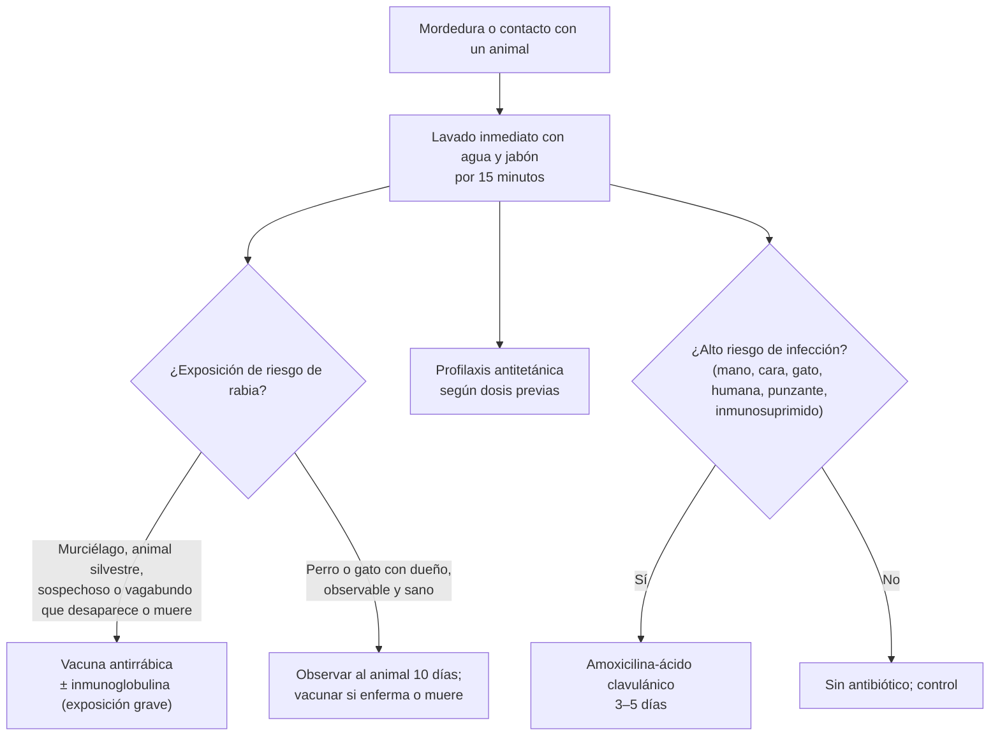

---
tags:
  - Cirugía
  - Urgencia
  - Frecuente en sala
---

# Heridas y contusiones menores, mordeduras, profilaxis antitetánica y antirrábica, y onicocriptosis

**Subespecialidad**
Cirugía general · Cirugía menor · Urgencia

**Guías principales**
Recomendación del CAVEI sobre vacunación antirrábica posexposición (*Rev Chilena Infectol* 2025) y Norma Técnica N.° 169 de vacunación antirrábica en humanos (MINSAL, 2014) · Documento de posición de la OMS sobre vacunas antirrábicas (2018) · ACIP 2018: profilaxis antitetánica en heridas · Guía IDSA de infecciones de piel y partes blandas (2014): mordeduras

**Otras fuentes**
Revisión Cochrane de intervenciones para la uña encarnada (2012) · Revisión del manejo de las laceraciones (*J Emerg Med* 2017)

**GES**
No.

**EUNACOM**
4.01.2.025 Heridas y contusiones menores (específico, completo) · 4.01.1.059 Onicocriptosis · 4.01.3.018 Tratamiento antitetánico y antirrábico (conocimiento general)

**Revisado**
Octubre 2026

!!! abstract "Resumen en 60 segundos"
    - **Toda herida**: **lavado** abundante con suero o agua potable, **explorar** (tendones, nervios, vasos, cuerpos extraños), **desbridar** lo desvitalizado y decidir el cierre.
    - **Cierre primario** en las heridas limpias y recientes; las contaminadas o de muchas horas pueden quedar para **cierre primario diferido** o **segunda intención**. La **cara** y el **cuero cabelludo** se pueden cerrar tarde por su irrigación.
    - **Retiro de los puntos**: cara **5 días**, cuero cabelludo **7–10**, tronco y extremidades **10–14**, sobre articulaciones **14**.
    - **Tétanos**: con **< 3 dosis o desconocidas**: **vacuna** siempre, y **inmunoglobulina** si la herida es **sucia**. Con **≥ 3 dosis**: vacuna si la última fue hace **> 10 años** (limpia) o **≥ 5 años** (sucia).
    - **Mordeduras**: lavado intenso; **amoxicilina-ácido clavulánico** profiláctico en las de riesgo (mano, cara, gato, humana, punzantes, inmunosuprimidos). **No suturar** las mordeduras de la **mano**.
    - **Rabia en Chile**: el reservorio actual es el **murciélago**. Profilaxis con **vacuna** si hay mordedura de animal **sospechoso**, **vagabundo** que desaparece o muere, **silvestre**, o **contacto con murciélagos**. Esquema vigente de **5 dosis** (días 0, 3, 7, 14 y 28); el CAVEI recomendó en 2025 pasar a **4 dosis** (Zagreb: 2 el día 0, 1 el día 7 y 1 el día 21), manteniendo 5 en los inmunocomprometidos. **Inmunoglobulina** en las exposiciones graves.
    - **Onicocriptosis** (uña encarnada): ortejo mayor; leve → conservador; con granuloma o recurrente → **resección parcial de la uña con matricectomía** (fenol).

## Definición

- **Herida**: solución de continuidad de la piel o las mucosas.
    - **Limpia**: corte reciente con un objeto limpio.
    - **Contaminada / sucia**: con tierra, heces, saliva, cuerpos extraños o tejido desvitalizado, o de muchas horas.
- **Contusión**: lesión por un golpe **sin** solución de continuidad de la piel (equimosis, **hematoma**).
- **Abrasión** (erosión): pérdida de la epidermis por fricción.
- **Laceración**: herida de bordes irregulares por desgarro o aplastamiento.
- **Cierre primario**: sutura inmediata. **Primario diferido**: sutura a los 3–5 días, tras observar la herida. **Segunda intención**: cicatrización espontánea por granulación.
- **Onicocriptosis** (uña encarnada): penetración del borde lateral de la lámina ungueal en el pliegue periungueal, con inflamación e infección.
- **Profilaxis posexposición antirrábica**: vacunación (± inmunoglobulina) tras una exposición de riesgo.

## Epidemiología

### Mundial

- Las heridas menores y las mordeduras son motivos de consulta muy frecuentes en los servicios de urgencia.
- Las **mordeduras de perro** son las más frecuentes; las de **gato** se infectan más (dientes finos y punzantes, *Pasteurella*).
- La **rabia** causa unas **59.000 muertes al año** en el mundo, casi todas por perros en Asia y África; es **casi siempre letal** una vez que aparecen los síntomas, pero **prevenible** con la profilaxis oportuna (CAVEI, 2025).
- La **onicocriptosis** es frecuente en adolescentes y adultos jóvenes.

### Chile

!!! chile "Datos nacionales (CAVEI, 2025)"
    - El último caso de **rabia humana por variante canina** fue en **1972** (Chillán); las variantes caninas se eliminaron en **1990**. En **1996** hubo un caso por virus de **murciélago**, y el último caso del país (N.° 80 desde 1950) fue en **2013** (Quilpué), tras la mordida de un perro callejero, sin confirmación virológica.
    - Hoy el **principal reservorio** es el **murciélago**: en 2023 todas las muestras positivas del ISP fueron de murciélagos, el **92,4 %** de la especie *Tadarida brasiliensis*.
    - En **2023** se administraron **81.864 primeras dosis** de vacuna antirrábica, pero solo el **43 %** completó el esquema de 5 dosis.
    - Los adultos **no tienen refuerzos antitetánicos programados** en el PNI: la profilaxis se hace al consultar por una herida (ver [tétanos](../../infectologia/tetanos.md)).

## Etiología y factores de riesgo

| Situación | Factores de riesgo de complicación |
|---|---|
| **Infección de la herida** | Contaminación, **tiempo** desde la herida, cuerpos extraños, tejido desvitalizado, **mordeduras**, ubicación (**manos**, **pies**, periné), **diabetes**, inmunosupresión, desnutrición |
| **Mordeduras** | **Gato** (alto riesgo de infección), **humana** (puño contra dientes: "**mordedura de pelea**"), **perro** (más desgarro); *Pasteurella*, *Capnocytophaga*, estreptococos, *S. aureus*, anaerobios, *Eikenella* (humana) |
| **Tétanos** | Heridas **punzantes**, contaminadas con **tierra** o **heces**, **quemaduras**, necrosis; vacunación incompleta (adultos mayores, migrantes) |
| **Rabia** | Mordedura o contacto con **murciélagos**, animales **silvestres**, perros **vagabundos**, viajes a zonas con rabia canina |
| **Onicocriptosis** | **Corte de la uña en curva** o muy corto, **calzado estrecho**, hiperhidrosis, trauma, uñas en pinza, obesidad |

## Fisiopatología

- **Cicatrización**: hemostasia → **inflamación** (días 1–4) → **proliferación** (granulación, epitelización, días 4–21) → **remodelación** (meses; la cicatriz llega a ~ 80 % de la fuerza original).
- **Infección**: la carga bacteriana supera las defensas locales cuando hay tejido necrótico, cuerpos extraños o mala irrigación.
- **Rabia**: el virus entra por la herida, se replica en el músculo y **asciende por los nervios** al SNC (incubación de semanas a meses; más corta en las heridas de **cabeza** y **cuello**) → encefalitis casi siempre mortal. La vacuna induce anticuerpos antes de que el virus llegue al SNC; la **inmunoglobulina** neutraliza el virus en la herida mientras se generan los anticuerpos.
- **Onicocriptosis**: el borde lateral de la uña perfora el pliegue → inflamación → infección → **granuloma piogénico**.

*Figura 1. Manejo de una mordedura: rabia, tétanos e infección. Esquema propio basado en la Norma Técnica N.° 169 (MINSAL, según CAVEI 2025), la OMS 2018, ACIP 2018 e IDSA 2014.*

## Clasificación

**Categorías de exposición a la rabia (OMS 2018)**:

| Categoría | Tipo de contacto | Profilaxis |
|---|---|---|
| **I** | Tocar o alimentar al animal, lamido sobre **piel intacta** | **Ninguna** |
| **II** | Mordisqueo de piel descubierta, **rasguños menores sin sangrado** | **Vacuna** |
| **III** | **Mordeduras o rasguños transdérmicos**, lamido en **piel lesionada**, contaminación de **mucosas** con saliva, **contacto directo con murciélagos** | **Vacuna + inmunoglobulina antirrábica** |

**Indicaciones de la profilaxis antirrábica en Chile** (Norma Técnica N.° 169, citada por el CAVEI 2025):

| Situación |
|---|
| Persona **mordida, rasguñada o lamida** en piel lesionada o mucosa por un animal **con sospecha o diagnóstico de rabia** |
| Persona mordida por un **animal vagabundo** que **desaparece o muere** después de la mordedura |
| Persona mordida por un **mamífero silvestre** |
| Persona mordida o que tuvo **contacto con murciélagos**: manipulación a manos desnudas, ingreso a lugares cerrados con colonias sin protección respiratoria, o **murciélagos en la habitación** |

**Onicocriptosis (etapas clínicas)**:

| Etapa | Hallazgos | Manejo |
|---|---|---|
| **Leve** | Eritema, edema y dolor en el pliegue | **Conservador** |
| **Moderada** | Más dolor, **secreción**, infección | Conservador ± antibiótico; considerar cirugía |
| **Grave** | **Granuloma**, hipertrofia crónica del pliegue | **Cirugía** |

## Clínica

- **Herida**: tamaño, profundidad, bordes, contaminación, sangrado; evaluar la **función distal** (sensibilidad, movilidad, pulsos, llene capilar) **antes** de anestesiar.
- **Signos de lesión profunda**: déficit de **flexión o extensión** (tendón), hipoestesia distal (nervio), sangrado pulsátil o hematoma expansivo (arteria), herida sobre una **articulación** (artrotomía).
- **Contusión**: dolor, equimosis, hematoma; descartar fracturas y **síndrome compartimental** en las extremidades (dolor desproporcionado, dolor con el estiramiento pasivo).
- **Infección de la herida**: eritema que se extiende, calor, dolor creciente, **secreción purulenta**, fiebre, linfangitis (ver [infecciones de piel y partes blandas](../../infectologia/infecciones-piel-partes-blandas.md)).
- **Mordedura de pelea** (puño contra dientes): herida pequeña sobre los **nudillos** que puede comprometer la **articulación metacarpofalángica**: alto riesgo de artritis séptica.
- **Onicocriptosis**: dolor, eritema y edema del **pliegue lateral** del **ortejo mayor**, secreción, **granuloma** sangrante.

## Diagnóstico

!!! guia "Puntos clave"
    - **Anamnesis**: **mecanismo**, **tiempo**, objeto (vidrio, metal, madera), animal (tipo, dueño, vacunado, observable), **estado de vacunación antitetánica**, comorbilidades (diabetes, inmunosupresión) y alergias.
    - **Examen**: función **neurovascular** y **tendinosa** distal, profundidad, cuerpos extraños.
    - **Radiografía** si se sospecha un **cuerpo extraño radiopaco** (vidrio, metal), una **fractura**, o en la mordedura de pelea (fractura del metacarpiano, diente).
    - **Ecografía** para los cuerpos extraños **radiolúcidos** (madera, espinas).
    - **Rabia**: clasificar la **exposición** y el **animal**; notificar y coordinar la observación del animal con la autoridad sanitaria.

## Laboratorio

| Examen | Uso |
|---|---|
| **Ninguno** de rutina | Heridas simples |
| **Cultivo** | Heridas **infectadas** (no en las mordeduras recientes no infectadas) |
| **Glicemia** | Diabéticos, infecciones recurrentes |

## Imágenes

| Examen | Uso |
|---|---|
| **Radiografía** | Cuerpo extraño radiopaco, fractura, gas en los tejidos |
| **Ecografía** | Cuerpo extraño radiolúcido, colecciones, lesión tendinosa |

## Diagnóstico diferencial

| Situación | Considerar |
|---|---|
| **Dolor desproporcionado tras una contusión** | **Síndrome compartimental**, fractura |
| **Herida que no cicatriza** | Infección, cuerpo extraño, isquemia, diabetes, **cáncer** (úlcera de Marjolin) |
| **Inflamación periungueal** | **Onicocriptosis**, **paroniquia** (aguda bacteriana, crónica candidiásica), panadizo herpético, **melanoma subungueal** (banda pigmentada que se extiende a la piel) |
| **Granuloma del pliegue ungueal** | Onicocriptosis, **granuloma piogénico**, **melanoma amelanótico** |

## Tratamiento

### Heridas

!!! dosis "Manejo de la herida"
    - **Hemostasia** por compresión.
    - **Anestesia local**: **lidocaína 1–2 %** (máximo **4,5 mg/kg** sin epinefrina y **7 mg/kg** con epinefrina; la epinefrina puede usarse en los dedos según la evidencia actual, pero evitarla si hay compromiso vascular).
    - **Lavado** con **suero fisiológico** o **agua potable** a presión (jeringa de 20–60 mL con aguja o catéter).
    - **Desbridamiento** del tejido desvitalizado y retiro de **cuerpos extraños**.
    - **Cierre**:
        - **Suturas** (monofilamento no reabsorbible en la piel: nylon 3-0/4-0 en el cuerpo, 5-0/6-0 en la cara; reabsorbible en los planos profundos).
        - **Adhesivo tisular** o **tiras adhesivas** en las heridas pequeñas, lineales y sin tensión.
        - **Corchetes** en el cuero cabelludo y el tronco.
    - **No suturar**: mordeduras de la **mano**, heridas **punzantes**, heridas muy **contaminadas** o de muchas horas fuera de la cara (cierre diferido o segunda intención).
    - **Curación**: mantener limpia y seca 24–48 h; luego lavado diario.

| Zona | Retiro de puntos |
|---|---|
| **Cara** | **5 días** (párpados 3–5) |
| **Cuero cabelludo** | **7–10 días** |
| **Tronco y extremidades** | **10–14 días** |
| **Sobre articulaciones**, palmas y plantas | **14 días** |

### Contusiones y hematomas

- **Reposo**, **frío** local en las primeras 48 h, **elevación**, **compresión** y analgesia (paracetamol, AINE).
- **Drenaje** de los hematomas grandes o a tensión (y del **hematoma subungueal** doloroso: trepanación de la uña).
- Vigilar el **síndrome compartimental**.

### Mordeduras (IDSA 2014)

- **Lavado** inmediato y abundante con **agua y jabón** (por ~ 15 minutos) y luego suero.
- **Desbridamiento**; **cierre primario** solo en la **cara** (por estética) y heridas limpias seleccionadas; **no** en la mano.
- **Antibiótico profiláctico (3–5 días)** en las mordeduras de **alto riesgo**: **amoxicilina-ácido clavulánico 875/125 mg c/12 h**. Alternativas en alergia: **doxiciclina**, o **cotrimoxazol** + **clindamicina** o **metronidazol** (cobertura de *Pasteurella* y anaerobios). **No usar** cefalexina, dicloxacilina ni eritromicina solas (no cubren bien *Pasteurella*).
- **Mordedura de pelea** o infectada en la mano: **derivar** a traumatología o cirugía de la mano (exploración, lavado articular).

### Profilaxis antitetánica (ACIP 2018)

| Dosis previas | Herida **limpia y menor** | **Otras heridas** (sucias, punzantes, mordeduras, quemaduras, aplastamiento) |
|---|---|---|
| **Desconocidas o < 3** | **Vacuna** (dT) | **Vacuna + inmunoglobulina antitetánica 250 UI IM** |
| **≥ 3** | Vacuna solo si la última fue hace **> 10 años** | Vacuna solo si la última fue hace **≥ 5 años** |

- Completar el esquema primario (0, 1 y 6–12 meses) si tenía menos de 3 dosis. Detalles en [tétanos](../../infectologia/tetanos.md).

### Profilaxis antirrábica (Chile)

!!! dosis "Vacuna antirrábica posexposición"
    - **Vacuna** inactivada en cultivo de células Vero, **intramuscular** (deltoides).
    - **Esquema del fabricante vigente en Chile**: **5 dosis** los días **0, 3, 7, 14 y 28** (Essen).
    - **Recomendación del CAVEI (2025)**: reducir a **4 dosis**, de preferencia esquema **Zagreb** (**2 dosis el día 0**, **1 el día 7** y **1 el día 21**); mantener **5 dosis** en los **inmunocomprometidos**. Verificar el esquema vigente en el vacunatorio.
    - **Inmunoglobulina antirrábica**: en las exposiciones **graves** (categoría III de la OMS), infiltrada **en y alrededor de la herida** el día 0 (o hasta el día 7 de la vacuna).
    - **Completar el esquema**: en Chile, menos de la mitad lo completa.
    - **Perro o gato con dueño, sano y observable**: **observación del animal por 10 días** (coordinada con la autoridad sanitaria); si enferma, muere o desaparece, iniciar la vacuna.
    - **Notificar** la mordedura según la normativa.

### Onicocriptosis

- **Conservador** (leve a moderada): **baños tibios** con agua y jabón, **algodón o hilo dental bajo el borde** de la uña, **mechas** o férulas (canaletas), calzado holgado, **corte recto** de la uña; antibiótico tópico o sistémico si hay celulitis.
- **Quirúrgico** (moderada a grave, recurrente o con granuloma):
    - **Onicectomía parcial** (resección del borde lateral de la uña) bajo **bloqueo digital**.
    - Con **matricectomía química con fenol** o quirúrgica para disminuir la recurrencia (Cochrane 2012).
    - Los antibióticos antes o después de la cirugía no mejoran los resultados de forma clara.
- **Prevención**: cortar la uña **recta**, sin redondear las esquinas ni dejarla muy corta.

!!! alarma "Derivar"
    - Lesión de **tendones**, **nervios**, **arterias** o compromiso **articular**.
    - **Mordedura de la mano** con infección o de pelea.
    - Heridas con **pérdida de tejido**, en la **cara** con estructuras nobles (ver [heridas de cara](../cabeza-cuello-tiroides-y-mama/heridas-de-cara-y-trauma-maxilofacial.md)).
    - **Síndrome compartimental**.
    - Exposición a **rabia** de categoría III: vacuna + inmunoglobulina.

## Complicaciones

- **Infección** de la herida, celulitis, absceso, **artritis séptica** (mordedura de pelea), osteomielitis.
- **Dehiscencia**, cicatriz **hipertrófica** o **queloide** (ver [quemaduras y cicatrices](quemaduras-secuelas-y-cicatrices.md)).
- **Tétanos** y **rabia** (prevenibles).
- **Síndrome compartimental** tras una contusión.
- **Onicocriptosis**: infección recurrente, **paroniquia**, osteomielitis de la falange distal (diabéticos), recurrencia tras la cirugía.

## Pronóstico y seguimiento

- Las heridas menores bien tratadas cicatrizan sin complicaciones en la gran mayoría.
- Control a las **48–72 h** en las heridas de riesgo (mordeduras, contaminadas) y para el retiro de los puntos.
- **Rabia**: la profilaxis completa y oportuna es muy eficaz.
- **Onicocriptosis**: la matricectomía reduce mucho la recurrencia.

## Perlas para el internado

!!! perla "Para recordar en la sala"
    - **Lavar, explorar, desbridar, cerrar.** Examinar la función distal **antes** de anestesiar.
    - **Puntos**: cara 5 días; cuero cabelludo 7–10; tronco y extremidades 10–14; articulaciones 14.
    - **Mordedura de la mano: no suturar** y dar amoxicilina-ácido clavulánico.
    - **Gato y humana > perro** en riesgo de infección.
    - **Herida en los nudillos tras una pelea = mordedura humana** con posible compromiso articular.
    - **Tétanos: < 3 dosis + herida sucia = vacuna + inmunoglobulina.**
    - **Rabia en Chile = murciélagos**: un murciélago en la habitación es una exposición.
    - **Perro con dueño sano: observar 10 días.**
    - **Uña encarnada recurrente**: onicectomía parcial con **fenol**.

## Preguntas de repaso

??? repaso "1. Jardinero de 65 años con una herida punzante con un clavo oxidado en el pie. No recuerda haber recibido vacunas antitetánicas. ¿Qué profilaxis indica?"
    - Herida **sucia** (punzante, con tierra) y vacunación **desconocida**.
    - **Vacuna dT** + **inmunoglobulina antitetánica 250 UI IM** en otro sitio; completar el esquema (0, 1 y 6–12 meses). Lavado y debridamiento.

??? repaso "2. Mujer de 30 años mordida en la mano por su gato hace 4 horas, con dos heridas punzantes. ¿Qué hace?"
    - **Alto riesgo de infección** (gato, mano, punzante).
    - Lavado intenso, **no suturar**, **amoxicilina-ácido clavulánico** por 3–5 días, profilaxis antitetánica según el esquema.
    - Rabia: gato con dueño, sano y observable → **observación del animal por 10 días**.

??? repaso "3. Un estudiante encontró un murciélago en el suelo y lo tomó con las manos desnudas. No ve heridas. ¿Indica la profilaxis antirrábica?"
    - **Sí**: la **manipulación de murciélagos a manos desnudas** es una indicación de profilaxis en Chile (y la OMS la considera categoría III).
    - **Vacuna** (5 dosis según el folleto vigente, o 4 dosis Zagreb si se adoptó la recomendación del CAVEI) e **inmunoglobulina antirrábica**. Enviar el murciélago al ISP si es posible.

??? repaso "4. Hombre de 22 años con una herida de 1 cm sobre el nudillo del dedo medio tras golpear a otra persona en la boca. ¿Qué sospecha y qué hace?"
    - **Mordedura humana de pelea**, con riesgo de **artritis séptica** de la metacarpofalángica.
    - **Radiografía** (fractura, diente), lavado, **no suturar**, **amoxicilina-ácido clavulánico** y derivación a cirugía de la mano para la exploración.

??? repaso "5. Adolescente de 16 años con dolor, eritema, secreción y un granuloma en el borde lateral del ortejo mayor, con varios episodios previos. ¿Cuál es el tratamiento?"
    - **Onicocriptosis** grave y recurrente.
    - **Onicectomía parcial con matricectomía química (fenol)** bajo bloqueo digital; educación sobre el **corte recto** de la uña y el calzado.

## Referencias

1. Luchsinger V, Leal P, Ibáñez C, et al. Recomendación del CAVEI sobre vacunación antirrábica post-exposición. *Rev Chilena Infectol.* 2025;42(4):419–423. doi:[10.4067/s0716-10182025000400159](https://doi.org/10.4067/s0716-10182025000400159)
2. World Health Organization. Rabies vaccines: WHO position paper, April 2018 – Recommendations. *Vaccine.* 2018;36(37):5500–5503. doi:[10.1016/j.vaccine.2018.06.061](https://doi.org/10.1016/j.vaccine.2018.06.061)
3. Liang JL, Tiwari T, Moro P, et al. Prevention of pertussis, tetanus, and diphtheria with vaccines in the United States: recommendations of the Advisory Committee on Immunization Practices (ACIP). *MMWR Recomm Rep.* 2018;67(2):1–44. doi:[10.15585/mmwr.rr6702a1](https://doi.org/10.15585/mmwr.rr6702a1)
4. Stevens DL, Bisno AL, Chambers HF, et al. Practice Guidelines for the Diagnosis and Management of Skin and Soft Tissue Infections: 2014 Update by the Infectious Diseases Society of America. *Clin Infect Dis.* 2014;59(2):e10–e52. doi:[10.1093/cid/ciu296](https://doi.org/10.1093/cid/ciu296)
5. Eekhof JA, Van Wijk B, Knuistingh Neven A, et al. Interventions for ingrowing toenails. *Cochrane Database Syst Rev.* 2012;(4):CD001541. doi:[10.1002/14651858.CD001541.pub3](https://doi.org/10.1002/14651858.CD001541.pub3)
6. Mankowitz SL. Laceration Management. *J Emerg Med.* 2017;53(3):369–382. doi:[10.1016/j.jemermed.2017.05.026](https://doi.org/10.1016/j.jemermed.2017.05.026)
7. Ministerio de Salud de Chile. Decreto Exento N.° 614 (2014): aprueba la Norma Técnica N.° 169 sobre vacunación antirrábica en humanos (citado por el CAVEI, 2025). [vacunas.minsal.cl](https://vacunas.minsal.cl/)
