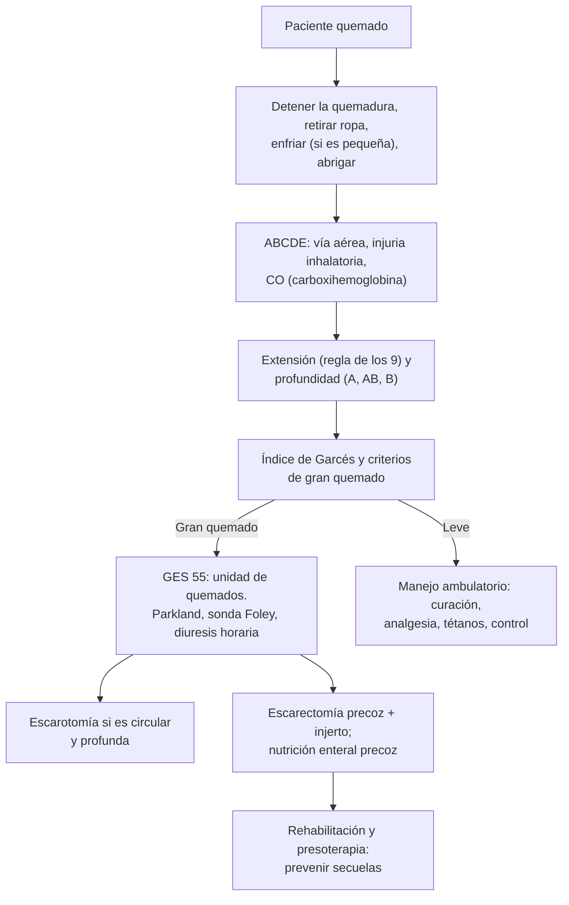

---
tags:
  - Cirugía
  - GES
  - Urgencia
---

# Quemaduras, secuelas, cicatrices viciosas, injertos y colgajos

**Subespecialidad**
Cirugía plástica · Quemados · Urgencia

**Guías principales**
Guía clínica MINSAL Gran Quemado (2007) · Guías de práctica de la International Society for Burn Injuries (ISBI), partes 1 y 2 (*Burns* 2016 y 2018)

**Otras fuentes**
Revisiones de *Nature Reviews Disease Primers*: quemaduras (2020) y cicatrices (2023)

**GES**
Sí: **gran quemado** (N.° 55), a cualquier edad: quemaduras que pueden comprometer la vida o dejar secuelas graves y permanentes.

**EUNACOM**
4.01.2.026 Quemaduras (específico, inicial) · 4.01.1.056 Secuelas de quemaduras · 4.01.1.057 Cicatrices viciosas · 4.01.3.011 Conceptos generales sobre injertos y colgajos

**Revisado**
Octubre 2026

!!! abstract "Resumen en 60 segundos"
    - **Primero**: detener la quemadura (apagar, retirar ropa y anillos), **enfriar** con agua (no hielo) las quemaduras pequeñas, y luego **ABCDE**: la **vía aérea** se compromete rápido en la **injuria inhalatoria** (espacio cerrado, hollín, vibrisas quemadas, disfonía) → **intubar precoz**. Medir la **carboxihemoglobina**.
    - **Extensión**: **regla de los 9** en el adulto (palma de la mano del paciente = **1 %**); **Lund-Browder** en el niño. No se cuenta el eritema (tipo A).
    - **Profundidad (Benaim)**: **A** (epidérmica: eritema, dolor; cura en ~ 7 días), **AB-A** (dérmica superficial: **flictenas**, muy dolorosa; cura en ~ 15 días), **AB-B** (dérmica profunda: suele requerir injerto), **B** (espesor total: blanca o acartonada, **indolora**; escarectomía e injerto).
    - **Gravedad en Chile: índice de Garcés** (adulto: edad + %A × 1 + %AB × 2 + %B × 3). **> 70 = grave** → GES gran quemado.
    - **Reanimación**: **Parkland** = **4 mL × kg × %SCQ** de Ringer lactato en 24 h (la mitad en las primeras 8 h desde la quemadura); ajustar por la **diuresis** (adulto **0,5 mL/kg/h**; niño ~ 1 mL/kg/h).
    - **Escarotomía** en las quemaduras profundas **circulares** que comprometen la circulación o la ventilación.
    - **No** antibióticos profilácticos. **Sí** profilaxis antitetánica, nutrición enteral precoz y **escarectomía precoz** con injerto.
    - **Cicatriz hipertrófica** (dentro de los límites, mejora con el tiempo) frente a **queloide** (sobrepasa los bordes). Prevención con **presoterapia** y silicona.
    - **Injerto**: tejido **sin** irrigación propia (depende del lecho). **Colgajo**: tejido **con** irrigación propia.

## Definición

- **Quemadura**: lesión de los tejidos por agentes **térmicos** (llama, líquidos, sólidos calientes, frío), **eléctricos**, **químicos** o **radiación**.
- **Gran quemado**: paciente con quemaduras que comprometen la vida o pueden dejar secuelas graves. En Chile (MINSAL 2007) incluye:
    - **Índice de gravedad > 70** o quemaduras **AB o B > 20 %** de la superficie corporal.
    - **> 65 años** con **≥ 10 %** de quemaduras AB o B.
    - **Injuria inhalatoria**.
    - **Quemaduras eléctricas de alta tensión**.
    - **Politraumatizados** quemados o con **patologías graves** asociadas.
    - Quemaduras intermedias o profundas **complejas** de **cabeza, manos, pies o periné**.
- **Secuelas de quemaduras**: cicatrices hipertróficas, **bridas** y **retracciones** que limitan el movimiento, alteraciones estéticas y psicológicas.
- **Cicatriz viciosa**: cicatriz con alteración estética o funcional: **hipertrófica**, **queloide**, **retráctil**, ensanchada, deprimida.
- **Injerto**: tejido separado completamente de su sitio de origen, **sin pedículo vascular**, que se nutre del **lecho** receptor.
- **Colgajo**: tejido trasladado con su **propia irrigación** (pedículo).

## Epidemiología

### Mundial

- Las quemaduras son una causa importante de muerte y discapacidad, sobre todo en **niños** y adultos mayores de países de ingresos bajos y medios.
- En los niños predominan las **escaldaduras** (líquidos calientes); en los adultos, el **fuego** y la **electricidad** (accidentes laborales).
- Las principales causas de muerte precoz son el **shock hipovolémico** y la **injuria inhalatoria**; las tardías, la **sepsis** y la falla multiorgánica.

### Chile

!!! chile "Datos nacionales (guía clínica MINSAL 2007)"
    - La **mortalidad** por quemaduras muestra una tendencia al **descenso** en todos los grupos de edad, excepto en los **mayores de 60 años**.
    - Los egresos hospitalarios aumentaron sobre todo en los **menores de 5 años** y los **mayores de 60**, que explican la mayor parte de la tendencia.
    - Las **quemaduras eléctricas** han aumentado desde 1982, sobre todo en el grupo **laboralmente activo** (20–59 años).
    - Las quemaduras son la **tercera causa de hospitalización y muerte por trauma en los niños** chilenos.
    - **GES N.° 55**: gran quemado, a cualquier edad, desde la confirmación diagnóstica.

## Etiología y factores de riesgo

| Tipo | Ejemplos | Particularidades |
|---|---|---|
| **Escaldadura** | Agua o líquidos hirvientes | La más frecuente en los niños (cocina, baño); sospechar **maltrato** si el patrón no concuerda |
| **Llama** | Incendios, braseros, combustibles | **Injuria inhalatoria** e intoxicación por CO en espacios cerrados |
| **Contacto** | Estufas, planchas | Profundas y pequeñas |
| **Eléctrica** | Baja tensión (doméstica), **alta tensión** (laboral) | Lesión **interna** mayor que la visible: arritmias, **rabdomiólisis**, síndrome compartimental |
| **Química** | Ácidos, álcalis (soda cáustica) | Los **álcalis** penetran más; irrigación prolongada |
| **Radiación** | Sol, radioterapia | Habitualmente superficiales |
| **Frío** | Congelamiento | Ver [hipotermia](../../geriatria/hipotermia.md) |

**Factores de mal pronóstico**: **edades extremas** (< 2 años y > 60 años), gran **extensión** y **profundidad**, **injuria inhalatoria**, comorbilidades, retraso en la reanimación.

## Fisiopatología

- **Zonas de Jackson**: **coagulación** (necrosis irreversible, centro), **estasis** (isquemia reversible: se puede salvar o perder según la reanimación) e **hiperemia** (periferia, se recupera).
- **Shock por quemadura**: la liberación de mediadores aumenta la **permeabilidad capilar** → paso masivo de líquido al intersticio (edema) en las primeras 24 h → **hipovolemia**. En las quemaduras > 20–30 % la respuesta es **sistémica**.
- **Hipermetabolismo** prolongado (aumento del gasto energético y del catabolismo proteico) → necesidad de **nutrición** precoz.
- **Inmunosupresión** y pérdida de la barrera cutánea → **infección** y **sepsis**.
- **Escara circular**: rígida e inextensible; el edema subyacente comprime → **isquemia** de la extremidad o **restricción** ventilatoria (tórax).
- **Cicatrización**: las quemaduras que tardan **> 2–3 semanas** en epitelizar tienen alto riesgo de **cicatriz hipertrófica** (exceso de colágeno por fibroblastos activados).

*Figura 1. Manejo del paciente quemado. Esquema propio basado en la guía MINSAL Gran Quemado (2007) y las guías ISBI.*

## Clasificación

**Profundidad (equivalencias usadas en Chile)**:

| Benaim | Converse-Smith | ABA | Nivel | Clínica | Evolución |
|---|---|---|---|---|---|
| **A** | Primer grado | Epidérmica | Epidermis | **Eritema**, dolor, sin flictenas | Cura en **~ 7 días** sin secuelas |
| **AB-A** | Segundo grado superficial | Dérmica superficial | Dermis papilar | **Flictenas**, rosado, húmedo, **muy doloroso**, llene capilar presente | Epiteliza en **~ 15 días**; puede profundizarse si se complica |
| **AB-B** | Segundo grado profundo | Dérmica profunda | Dermis reticular | Blanquecino-rosado, menos doloroso, llene lento | Suele requerir **escarectomía e injerto**; secuelas |
| **B** | Tercer grado | Espesor total | Toda la piel ± tejidos profundos | **Blanco nacarado** o carbonizado, **acartonado**, **indoloro**, sin llene | **Escarectomía precoz e injerto o colgajo** |

**Extensión (regla de los 9, adulto)**: cabeza y cuello **9 %**; cada extremidad superior **9 %**; tronco anterior **18 %**; tronco posterior **18 %**; cada extremidad inferior **18 %**; periné **1 %**. **Palma de la mano** del paciente (con los dedos) = **1 %**. En los niños, la **cabeza** es proporcionalmente mayor: usar la tabla de **Lund-Browder**.

**Índice de gravedad (MINSAL 2007)**:

| Edad | Índice |
|---|---|
| **Adultos** (Garcés) | Edad + %A × 1 + %AB × 2 + %B × 3 |
| **2–20 años** (Garcés modificado por Artigas) | 40 − edad + %A × 1 + %AB × 2 + %B × 3 |
| **< 2 años** (Artigas y consenso MINSAL 1999) | 40 − edad + %A × 2 + %AB × 2 + %B × 3 + 20 |

| Puntaje | Pronóstico |
|---|---|
| **21–40** | Leve: sin riesgo vital |
| **41–70** | Moderado: sin riesgo vital, salvo complicaciones |
| **71–100** | **Grave**: mortalidad < 30 % |
| **101–150** | **Crítico**: mortalidad 30–50 % |
| **> 150** | Sobrevida excepcional: mortalidad > 50 % |

**Zonas especiales** (estética y función): **cara**, **cuello**, **manos y pies**, **pliegues articulares**, **genitales y periné**, **mamas**.

## Clínica

- **Injuria inhalatoria**: incendio en **espacio cerrado**, compromiso de conciencia, **quemaduras faciales**, **vibrisas chamuscadas**, **esputo carbonáceo** o hollín en la orofaringe, **disfonía**, **estridor**, disnea, sibilancias.
- **Intoxicación por CO**: cefalea, náuseas, confusión, coma; la **oximetría de pulso es falsamente normal** (medir la carboxihemoglobina; ver [intoxicación por CO](../../respiratorio/intoxicacion-por-co-ahogamiento-y-cuerpo-extrano.md)).
- **Shock**: taquicardia, oliguria, hipotensión en las primeras horas si la reanimación es insuficiente.
- **Quemadura eléctrica**: lesiones de **entrada y salida** pequeñas con **gran daño interno**; **arritmias**, **mioglobinuria** (orina oscura), síndrome compartimental, fracturas por la caída o la tetania.
- **Escara circular** en una extremidad: dolor, parestesias, frialdad, pulsos débiles; en el tórax, **restricción ventilatoria**.
- **Signos de infección de la quemadura**: cambio de color, profundización, separación precoz de la escara, celulitis del borde, fiebre o hipotermia, deterioro clínico.

## Diagnóstico

!!! guia "Puntos clave (MINSAL 2007, ISBI)"
    - El manejo inicial es el de un **paciente de trauma** (ABCDE).
    - Calcular la **extensión** (regla de los 9; Lund-Browder en niños), la **profundidad**, la **localización**, la **edad** y el **índice de gravedad**.
    - Ante la **sospecha de injuria inhalatoria**, sobre todo en niños, **intubar** hasta comprobar la indemnidad de la vía aérea (fibrobroncoscopía o clínica). **Oxígeno al 100 %** a todos.
    - **Exámenes**: hemograma, **gases arteriales**, electrolitos, coagulación, perfil bioquímico, grupo y Rh, **radiografía de tórax**, **carboxihemoglobina**; **ECG** y enzimas cardíacas en las **eléctricas de alta tensión**; CK y mioglobinuria.
    - **Sonda Foley** para la **diuresis horaria** en el gran quemado.

## Laboratorio

| Examen | Uso |
|---|---|
| **Carboxihemoglobina** | Intoxicación por CO (la saturación por oximetría no sirve) |
| **Gases arteriales y lactato** | Perfusión, acidosis (considerar cianuro en los incendios con plásticos si hay acidosis láctica grave) |
| **Hemograma, electrolitos, creatinina** | Hemoconcentración inicial, función renal |
| **CK y mioglobina urinaria** | **Quemaduras eléctricas**, rabdomiólisis |
| **Glicemia, proteínas, albúmina** | Hipermetabolismo, nutrición |
| **Cultivos** | Sospecha de infección (no de rutina como profilaxis) |

## Imágenes

| Examen | Uso |
|---|---|
| **Radiografía de tórax** | Basal (puede ser normal al inicio en la injuria inhalatoria) |
| **Fibrobroncoscopía** | Diagnóstico de la **injuria inhalatoria** y aseo de la vía aérea |
| **ECG y monitor** | Arritmias en las quemaduras eléctricas |

## Diagnóstico diferencial

| Situación | Considerar |
|---|---|
| **Quemaduras en un niño** con patrón en "guante" o "calcetín", bordes netos, de cigarrillo o en los glúteos | **Maltrato infantil**: notificar |
| **Ampollas extensas sin quemadura** | **Síndrome de Stevens-Johnson / NET**, pénfigo, síndrome de piel escaldada estafilocócica |
| **Compromiso de conciencia en un quemado** | **CO**, cianuro, TEC, hipoxia, hipovolemia, intoxicación |
| **Cicatriz que crece** | **Cicatriz hipertrófica** frente a **queloide**; úlcera crónica sobre una cicatriz: **úlcera de Marjolin** (carcinoma escamoso) |

## Tratamiento

### Primeros auxilios y quemaduras menores

- **Detener la quemadura**: apagar las llamas, retirar la ropa y los **anillos** (el edema hace de torniquete); en las **químicas**, retirar la ropa e **irrigar con abundante agua** al menos **30 minutos** (sin neutralizar); en las **eléctricas**, cortar la corriente antes de tocar al paciente.
- **Enfriar** con agua corriente fresca (no hielo) por ~ 20 minutos en las quemaduras **pequeñas**; en las extensas (> 10 %), **no**: riesgo de **hipotermia**.
- **Quemaduras menores** (superficiales y poco extensas, fuera de zonas especiales):
    - **Analgesia** (paracetamol, AINE).
    - **Aseo** con suero o agua y jabón suave; las **flictenas** grandes o rotas se debridan (las pequeñas e intactas pueden mantenerse).
    - **Apósitos** que mantengan un ambiente húmedo (gasa vaselinada, apósitos de hidrocoloide o espuma, membranas); las de **cara** pueden dejarse expuestas con emolientes.
    - **Profilaxis antitetánica** según el esquema (ver [heridas menores](heridas-menores-mordeduras-y-onicocriptosis.md)).
    - **Control** a las 48–72 h para reevaluar la profundidad (las intermedias evolucionan).
    - **Fotoprotección** de la zona por meses.

### Gran quemado (GES 55)

!!! dosis "Reanimación con volumen (MINSAL 2007)"
    | Paso | Indicación |
    |---|---|
    | **Prehospitalario** | Suero fisiológico o Ringer lactato **500 mL/h** en el adulto, o bolos de **20 mL/kg** en el niño |
    | **Fórmula de Parkland (adulto)** | **4 mL × kg × %SCQ** de **Ringer lactato** en 24 h, contadas **desde la hora de la quemadura**: **50 % en las primeras 8 h** y 50 % en las 16 h siguientes. Con injuria inhalatoria o reanimación tardía, los requerimientos aumentan |
    | **Niños** | Parkland + **requerimientos basales** (100 mL/kg los primeros 10 kg, 50 mL/kg los siguientes 10 kg, 20 mL/kg sobre 20 kg) |
    | **Meta** | **Diuresis 0,5–1 mL/kg/h** en el adulto (≥ 1 mL/kg/h en el niño); evitar el exceso de volumen (edema, síndrome compartimental) |
    | **Quemadura eléctrica de alta tensión** | Parkland no aplica: diuresis **~ 100 mL/h** por la **mioglobinuria** |
    | **Albúmina** | Evitar en las primeras 24 h |

- **Vía aérea**: **intubación precoz** si hay injuria inhalatoria o edema progresivo (tubo grueso); **O2 al 100 %** en la intoxicación por CO.
- **Accesos venosos** en piel sana idealmente; **sonda Foley**; sonda nasogástrica.
- **Analgesia** potente (opioides, ketamina) y **sedación** para los procedimientos.
- **Escarotomía** urgente en las quemaduras profundas **circulares** de extremidades (compromiso circulatorio) o del **tórax** (restricción ventilatoria); **fasciotomía** en las eléctricas con síndrome compartimental.
- **No usar antibióticos profilácticos** (MINSAL, grado A); tratar las infecciones demostradas.
- **Nutrición enteral precoz** (idealmente en las primeras horas).
- **Normotermia**: abrigo, ambiente cálido.
- **Escarectomía precoz** (reduce la mortalidad y la estadía) y **cobertura**: transitoria (aloinjerto, xenoinjerto, sustitutos) y definitiva (**autoinjerto**).
- **Rehabilitación** desde el ingreso: kinesioterapia, terapia ocupacional, posicionamiento antirretracción, **presoterapia** y apoyo psicológico.

!!! alarma "Derivar a unidad de quemados (GES 55)"
    - **Índice de Garcés > 70** o quemaduras AB/B **> 20 %**.
    - **> 65 años** con ≥ 10 % AB/B.
    - **Injuria inhalatoria**, intoxicación por CO.
    - **Eléctricas de alta tensión**, químicas extensas.
    - Quemaduras profundas de **cara**, **manos**, **pies**, **periné** o pliegues.
    - **Circulares** profundas.
    - Politraumatizados o con comorbilidades graves; sospecha de **maltrato**.

### Cicatrices viciosas y secuelas

| Condición | Características | Tratamiento |
|---|---|---|
| **Cicatriz hipertrófica** | Elevada, roja, pruriginosa, **dentro de los límites** de la herida; aparece en semanas; **mejora** con el tiempo | **Presoterapia** (prendas a medida), **láminas o gel de silicona**, masaje; **corticoide intralesional** (triamcinolona); láser |
| **Queloide** | **Sobrepasa los bordes** de la herida; aparece tarde, **no regresa**; predisposición genética, **piel oscura**; lóbulo de la oreja, esternón, hombros | **Corticoide intralesional**, silicona, presión; **cirugía** solo combinada con corticoide o radioterapia (recurre mucho si se reseca sola) |
| **Brida o retracción** | Cicatriz que limita el movimiento (cuello, axila, codo, mano) | **Z-plastía**, injertos o colgajos; rehabilitación |
| **Cicatriz ensanchada o deprimida** | Tensión, mala técnica | Revisión quirúrgica |
| **Úlcera de Marjolin** | Úlcera crónica sobre una cicatriz de quemadura antigua | **Biopsia**: carcinoma escamoso |

**Prevención**: buena técnica (bordes evertidos, sin tensión, siguiendo las **líneas de tensión de la piel**), epitelización **< 2–3 semanas** (injertar precozmente las quemaduras profundas), **presoterapia** en las quemaduras que tardan más de 14–21 días en cerrar, **fotoprotección**.

### Injertos y colgajos (conceptos generales)

| | **Injerto** | **Colgajo** |
|---|---|---|
| **Irrigación** | **No** tiene: depende del **lecho** (imbibición plasmática las primeras 48 h, luego neovascularización) | **Propia** (pedículo) |
| **Lecho receptor** | Debe estar **vascularizado** (no prende sobre hueso sin periostio, tendón sin paratendón, cartílago sin pericondrio, ni lechos irradiados o infectados) | Puede cubrir hueso, tendón, implantes y lechos mal irrigados |
| **Tipos** | **Piel parcial** (dermoepidérmico: epidermis + parte de la dermis; prende mejor, se **retrae** más; puede **expandirse** en malla) y **piel total** (epidermis + toda la dermis; mejor resultado estético, se retrae menos; cara, manos) | **Locales** (avance, rotación, transposición, **Z-plastía**), **regionales** (pediculados) y **libres** (microcirugía) |
| **Usos** | Quemaduras, heridas extensas con buen lecho | Defectos complejos, estructuras nobles expuestas |

- **Escalera reconstructiva**: del procedimiento más simple al más complejo: cierre por segunda intención → cierre primario → injerto → colgajo local → colgajo regional → colgajo libre.
- **Causas de pérdida del injerto**: **hematoma** o seroma bajo el injerto (la causa más frecuente), **infección**, **cizallamiento** (movimiento), lecho mal irrigado.

## Complicaciones

- **Precoces**: shock, **insuficiencia respiratoria** (injuria inhalatoria, SDRA), intoxicación por CO o cianuro, **síndrome compartimental** (extremidades, abdomen), **LRA** (hipovolemia, mioglobinuria), arritmias (eléctricas), hipotermia.
- **Tardías**: **sepsis** (la principal causa de muerte tardía), neumonía, úlcera de estrés (de **Curling**), trombosis, desnutrición, falla multiorgánica.
- **Secuelas**: **cicatrices hipertróficas**, **bridas** y **retracciones**, alteración estética, prurito crónico, dolor neuropático, **estrés postraumático**, **úlcera de Marjolin**.

## Pronóstico y seguimiento

- El pronóstico depende de la **extensión** y **profundidad**, la **edad**, la **injuria inhalatoria** y las comorbilidades (índice de Garcés).
- La **escarectomía precoz**, la nutrición y las unidades especializadas mejoraron la sobrevida.
- Seguimiento prolongado en el **policlínico de quemados**: rehabilitación, **presoterapia** (meses), cirugía reconstructiva de las secuelas y apoyo psicológico.

## Perlas para el internado

!!! perla "Para recordar en la sala"
    - **Quemado = paciente de trauma**: ABCDE; la vía aérea se cierra en horas en la injuria inhalatoria → **intubar precoz**.
    - **Oximetría normal no descarta el CO**: medir la carboxihemoglobina.
    - **Regla de los 9**; **palma = 1 %**; el eritema (tipo A) **no se cuenta** para la reanimación.
    - **Parkland: 4 × kg × %SCQ**, la mitad en las primeras **8 h desde la quemadura**; guiarse por la **diuresis**.
    - **Garcés > 70 = grave = GES gran quemado.**
    - **Flictenas y mucho dolor = intermedia superficial (AB-A). Blanca, acartonada e indolora = profunda (B).**
    - **Escara circular = escarotomía.**
    - **Eléctrica: lo que se ve es la punta del iceberg** → ECG, CK, diuresis alta.
    - **No antibióticos profilácticos**; **sí** toxoide antitetánico.
    - **Quemaduras en un niño con patrón sospechoso = pensar en maltrato.**
    - **Hipertrófica: dentro de los bordes y mejora. Queloide: sobrepasa los bordes y no regresa.**
    - **Injerto = sin irrigación propia; colgajo = con irrigación propia.**

## Preguntas de repaso

??? repaso "1. Hombre de 40 años, 70 kg, con quemaduras por fuego del 30 % de la superficie corporal (20 % AB y 10 % B), ocurridas hace 2 horas. ¿Cuál es su índice de Garcés y cuánto volumen indica en las primeras 24 horas?"
    - **Garcés (adulto)** = edad + %A × 1 + %AB × 2 + %B × 3 = 40 + 0 + 40 + 30 = **110** → **crítico** (GES gran quemado).
    - **Parkland** = 4 × 70 × 30 = **8.400 mL** de Ringer lactato en 24 h: **4.200 mL en las primeras 8 h desde la quemadura** (como ya pasaron 2 h, en las 6 h restantes) y 4.200 mL en las 16 h siguientes; **ajustar por la diuresis** (0,5–1 mL/kg/h).

??? repaso "2. Mujer rescatada de un incendio en su departamento, con quemaduras faciales, vibrisas chamuscadas, hollín en la boca y disfonía, con saturación de 98 %. ¿Qué hace?"
    - Sospecha de **injuria inhalatoria** e **intoxicación por CO** (la saturación por oximetría es engañosa).
    - **O2 al 100 %**, **intubación precoz** (antes de que el edema cierre la vía aérea), **carboxihemoglobina** y gases arteriales; derivar a una unidad de quemados.

??? repaso "3. Niño de 3 años con una escaldadura en el antebrazo, con flictenas, rosada, húmeda y muy dolorosa, de 2 % de la superficie corporal. ¿Qué profundidad tiene y cómo la maneja?"
    - **Intermedia superficial (AB-A)**.
    - Analgesia, aseo, manejo de las flictenas, **apósito** que mantenga la humedad, profilaxis antitetánica según el PNI y **control en 48–72 h** (puede profundizarse). Debería epitelizar en ~ 2 semanas. Evaluar si el mecanismo es concordante con el relato.

??? repaso "4. Trabajador de 35 años que sufrió una descarga eléctrica de alta tensión, con una pequeña lesión de entrada en la mano y de salida en el pie, y orina de color oscuro. ¿Qué le preocupa y qué hace?"
    - Lesión **interna extensa**: **rabdomiólisis** con **mioglobinuria**, riesgo de **LRA**, **arritmias** y **síndrome compartimental**.
    - **ECG** y monitorización, CK, creatinina, **reanimación** con volumen para una **diuresis ~ 100 mL/h**, evaluar **fasciotomía**; derivar a una unidad de quemados (GES).

??? repaso "5. Mujer de 25 años con una cicatriz de una herida en el lóbulo de la oreja que creció por fuera de los bordes originales durante meses. ¿Qué es y cómo se trata?"
    - **Queloide** (sobrepasa los bordes, no regresa).
    - **Corticoide intralesional** (triamcinolona), silicona y presión; la **resección sola recurre**: si se opera, combinarla con corticoide o radioterapia.

## Referencias

1. Ministerio de Salud de Chile. Guía Clínica Gran Quemado. Serie Guías Clínicas MINSAL N.° 55. Santiago: MINSAL; 2007. [supersalud.gob.cl](https://www.supersalud.gob.cl/difusion/572/articles-3812_recurso_1.pdf)
2. ISBI Practice Guidelines Committee. ISBI Practice Guidelines for Burn Care. *Burns.* 2016;42(5):953–1021. doi:[10.1016/j.burns.2016.05.013](https://doi.org/10.1016/j.burns.2016.05.013)
3. ISBI Practice Guidelines Committee. ISBI Practice Guidelines for Burn Care, Part 2. *Burns.* 2018;44(7):1617–1706. doi:[10.1016/j.burns.2018.09.012](https://doi.org/10.1016/j.burns.2018.09.012)
4. Jeschke MG, van Baar ME, Choudhry MA, et al. Burn injury. *Nat Rev Dis Primers.* 2020;6(1):11. doi:[10.1038/s41572-020-0145-5](https://doi.org/10.1038/s41572-020-0145-5)
5. Jeschke MG, Wood FM, Middelkoop E, et al. Scars. *Nat Rev Dis Primers.* 2023;9(1):64. doi:[10.1038/s41572-023-00474-x](https://doi.org/10.1038/s41572-023-00474-x)
6. Superintendencia de Salud. Problema de salud GES N.° 55: gran quemado. [superdesalud.gob.cl](https://www.superdesalud.gob.cl/orientacion-en-salud/gran-quemado/)
