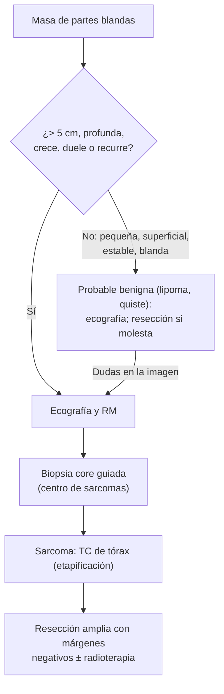

---
tags:
  - Cirugía
---

# Tumores benignos y malignos de partes blandas

**Subespecialidad**
Cirugía general · Oncología quirúrgica · Cirugía plástica

**Guías principales**
Guía ESMO-EURACAN-GENTURIS de sarcomas de partes blandas y viscerales (*Ann Oncol* 2021)

**Otras fuentes**
Ver [heridas menores](heridas-menores-mordeduras-y-onicocriptosis.md) y [tumores gástricos y GIST](../esofago-y-estomago/tumores-gastricos-benignos.md)

**GES**
No en el adulto (el GES **cáncer en menores de 15 años** incluye los sarcomas pediátricos).

**EUNACOM**
4.01.1.053 Tumores benignos de partes blandas · 4.01.1.054 Tumores malignos de partes blandas (sospecha, inicial)

**Revisado**
Octubre 2026

!!! abstract "Resumen en 60 segundos"
    - La gran mayoría de los tumores de partes blandas son **benignos**: **lipoma** (el más frecuente), **quiste epidérmico** ("sebáceo"), fibromas, neurofibromas, schwannomas, hemangiomas, **ganglión**.
    - **Sarcoma**: tumor maligno **raro** de origen mesenquimático. **Sospechar** si la masa es:
        - **> 5 cm**,
        - **profunda** (bajo la fascia),
        - **crece**,
        - o **duele**, o **recurre** tras una resección.
    - **Estudio** de la masa sospechosa: **ecografía** y luego **RM**; **biopsia con aguja gruesa (core)** **antes** de cualquier cirugía, idealmente en un **centro de sarcomas**.
    - **Nunca** resecar "a ciegas" (**enucleación**) una masa sospechosa: una resección inadecuada (*whoops*) contamina los tejidos y empeora el pronóstico.
    - **Tratamiento del sarcoma**: **resección amplia con márgenes negativos** ± **radioterapia**; quimioterapia en casos seleccionados. Metastatiza sobre todo al **pulmón** (TC de tórax).
    - **Lipoma** y **quiste epidérmico**: resección si molestan, crecen o hay dudas; el quiste inflamado o infectado se **drena** y se reseca después.

## Definición

- **Tumor de partes blandas**: neoplasia de los tejidos extraesqueléticos no epiteliales (grasa, músculo, tejido fibroso, vasos, nervios periféricos).
- **Sarcoma de partes blandas**: neoplasia **maligna** de origen **mesenquimático**; hay más de 50 subtipos histológicos.
- **Lipoma**: tumor benigno de **adipocitos** maduros.
- **Quiste epidérmico** (de inclusión, mal llamado "sebáceo"): quiste revestido de epitelio escamoso lleno de queratina, con un **poro central** (punctum).
- **Ganglión**: quiste con contenido mucinoso relacionado con una articulación o una vaina tendinosa (dorso de la muñeca).

## Epidemiología

### Mundial

- Los tumores **benignos** son muchísimo más frecuentes que los sarcomas (del orden de **100 a 1**).
- Los **sarcomas** representan **~ 1 %** de los cánceres del adulto; se ubican sobre todo en las **extremidades** (en especial el **muslo**), el tronco y el **retroperitoneo**.
- Los subtipos más frecuentes en el adulto son el **liposarcoma**, el **leiomiosarcoma**, el **sarcoma pleomorfo indiferenciado** y el sarcoma sinovial; en los niños, el **rabdomiosarcoma**.

### Chile

!!! chile "Datos nacionales"
    - No se encontraron datos nacionales recientes de incidencia de los sarcomas de partes blandas del adulto.
    - Los sarcomas **pediátricos** están cubiertos por el GES **cáncer en personas menores de 15 años**.
    - Por su rareza, se recomienda el manejo en **centros con experiencia** (en Chile, hospitales de referencia oncológica).

## Etiología y factores de riesgo

| Factor | Asociación |
|---|---|
| **Radioterapia previa** | Sarcoma posradiación (años después) |
| **Linfedema crónico** | **Angiosarcoma** (síndrome de Stewart-Treves, tras la mastectomía) |
| **Síndromes genéticos** | **Neurofibromatosis tipo 1** (tumor maligno de la vaina nerviosa periférica), **Li-Fraumeni** (TP53), retinoblastoma hereditario, poliposis adenomatosa familiar (**tumores desmoides**) |
| **Exposiciones químicas** | Cloruro de vinilo (angiosarcoma hepático) |
| **VIH / VHH-8** | **Sarcoma de Kaposi** |
| **Benignos** | Lipomatosis familiar; quistes epidérmicos (acné, trauma); neurofibromas (NF1) |

## Fisiopatología

- Los sarcomas crecen de forma **centrífuga**, comprimiendo los tejidos vecinos y formando una **seudocápsula** que contiene células tumorales (por eso la enucleación deja tumor).
- Se diseminan por vía **hematógena** (sobre todo al **pulmón**); las metástasis **ganglionares** son raras (excepto en algunos subtipos: rabdomiosarcoma, sarcoma epitelioide, de células claras y sinovial).
- El **grado histológico** (diferenciación, mitosis, necrosis) es el principal factor pronóstico.

*Figura 1. Enfoque de una masa de partes blandas. Esquema propio basado en la guía ESMO-EURACAN-GENTURIS 2021.*

## Clasificación

**Tumores benignos más frecuentes**:

| Tumor | Características |
|---|---|
| **Lipoma** | **Blando**, móvil, indoloro, subcutáneo; tronco, hombros, cuello; crecimiento lento |
| **Quiste epidérmico** | Nódulo dérmico con **poro central**; puede inflamarse, infectarse y drenar material "caseoso" maloliente |
| **Quiste triquilemal** (pilar) | **Cuero cabelludo**, sin poro, múltiple, familiar |
| **Ganglión** | Dorso de la **muñeca**, transiluminable, puede variar de tamaño |
| **Neurofibroma** | Blando, múltiple en la NF1 (con manchas café con leche) |
| **Schwannoma** | Sobre el trayecto de un nervio; **signo de Tinel** al percutirlo |
| **Hemangioma / malformaciones vasculares** | Compresibles, coloración azulada |
| **Fibromatosis (desmoide)** | Localmente agresivo, **no metastatiza**; pared abdominal (embarazo), poliposis adenomatosa familiar |
| **Dermatofibroma** | Nódulo firme pequeño en las piernas, "signo del hoyuelo" |

**Sarcomas de partes blandas más frecuentes (adulto)**: liposarcoma (bien diferenciado, mixoide, desdiferenciado, pleomórfico), leiomiosarcoma, sarcoma pleomorfo indiferenciado, sarcoma sinovial, tumor maligno de la vaina nerviosa periférica, angiosarcoma, dermatofibrosarcoma protuberans, sarcoma de Kaposi.

## Clínica

- **Benignos**: masa **blanda**, móvil, **superficial**, indolora, estable en el tiempo.
- **Sarcoma**: masa **indolora** en la mayoría (no esperar el dolor), que **crece**, **firme**, **profunda** y **fija**; a veces tras un trauma que solo "llamó la atención" sobre la masa. Retroperitoneales: masa abdominal grande, saciedad precoz, síntomas compresivos.
- **Quiste epidérmico infectado**: eritema, dolor, fluctuación.

## Diagnóstico

!!! guia "Puntos clave (ESMO-EURACAN-GENTURIS 2021)"
    - Toda masa de partes blandas **> 5 cm**, **profunda**, que **crece** o **duele** debe estudiarse como un posible **sarcoma**.
    - **Ecografía** como primer examen; **RM** con contraste como imagen de elección en las extremidades y el tronco; **TC** en el retroperitoneo y el abdomen.
    - **Biopsia con aguja gruesa (core)** guiada por imagen, planificada por el equipo que hará la cirugía (el trayecto debe poder resecarse); evitar la biopsia escisional de las masas sospechosas.
    - **Histología con inmunohistoquímica y estudio molecular** (traslocaciones, amplificación de MDM2 en el liposarcoma) por un **patólogo experto**.
    - **Etapificación**: **TC de tórax** (metástasis pulmonares).

## Laboratorio

| Examen | Uso |
|---|---|
| **No hay marcadores** tumorales útiles | El diagnóstico es histológico |
| **Hemograma, función renal** | Antes de la quimioterapia |
| **VIH** | Sarcoma de Kaposi |

## Imágenes

| Examen | Uso |
|---|---|
| **Ecografía** | Primer examen: quiste o sólido, profundidad, vascularización |
| **RM con contraste** | **Elección** en extremidades y tronco: tamaño, relación con la fascia, vasos y nervios |
| **TC de abdomen y pelvis** | Sarcomas retroperitoneales |
| **TC de tórax** | **Metástasis pulmonares** |

## Diagnóstico diferencial

| Masa | Diferenciales |
|---|---|
| **Masa subcutánea blanda** | Lipoma, quiste, **liposarcoma bien diferenciado** (si es grande o profunda) |
| **Masa que aparece tras un trauma** | **Hematoma** (debe resolverse en semanas; si no, estudiar como sarcoma), miositis osificante |
| **Masa en la ingle o la axila** | **Adenopatías**, hernia, absceso, linfoma |
| **Masa dolorosa y caliente** | Absceso, quiste infectado, piomiositis |
| **Masa retroperitoneal** | **Liposarcoma**, leiomiosarcoma, linfoma, tumor de células germinales, tumor renal o suprarrenal |

## Tratamiento

### Benignos

| Tumor | Tratamiento |
|---|---|
| **Lipoma** | Observación; **resección** si molesta, crece, es > 5 cm o es profundo (descartar liposarcoma) |
| **Quiste epidérmico** | Resección **completa con su pared** (si no, recurre); si está **inflamado o infectado**: **incisión y drenaje**, y resección diferida |
| **Ganglión** | Observación, aspiración o resección si molesta |
| **Neurofibroma / schwannoma** | Observación o resección (el schwannoma se enuclea preservando el nervio); vigilar la transformación maligna en la NF1 (dolor, crecimiento) |
| **Desmoide** | **Vigilancia activa** inicial; tratamiento sistémico o cirugía si progresa |

### Sarcomas

- **Equipo multidisciplinario** en un **centro de referencia**.
- **Cirugía**: **resección amplia** con un margen de tejido sano (R0), preservando la extremidad cuando es posible (la amputación es rara).
- **Radioterapia** pre o posoperatoria en los sarcomas **profundos**, **> 5 cm** o de **alto grado**.
- **Quimioterapia** (antraciclinas e ifosfamida) en casos seleccionados de alto riesgo y en la enfermedad metastásica.
- **Metástasis pulmonares** aisladas: metastasectomía en casos seleccionados.

!!! alarma "Derivar a un centro con experiencia en sarcomas"
    - Masa **> 5 cm**, **profunda**, que **crece** o **duele**.
    - **Recurrencia** de una masa resecada.
    - **Hematoma** "espontáneo" que no se resuelve.
    - Resultado inesperado de **sarcoma** tras resecar un "lipoma".

## Complicaciones

- **Benignos**: infección del quiste, recurrencia, compresión nerviosa.
- **Sarcomas**: **recurrencia local** (sobre todo tras resecciones inadecuadas), **metástasis pulmonares**, compromiso de vasos y nervios, secuelas de la cirugía y la radioterapia (linfedema, fibrosis, fracturas).

## Pronóstico y seguimiento

- **Benignos**: excelente pronóstico.
- **Sarcomas**: el pronóstico depende del **grado**, el **tamaño**, la **profundidad**, el **subtipo** y los **márgenes**; los de bajo grado tienen buena sobrevida, los de alto grado tienen alto riesgo de metástasis.
- Seguimiento con examen clínico, imagen local y **TC de tórax** periódica por años.

## Perlas para el internado

!!! perla "Para recordar en la sala"
    - **> 5 cm, profunda, que crece o duele = sospechar sarcoma.**
    - **El sarcoma suele ser indoloro**: no esperar el dolor.
    - **RM y biopsia core antes de operar.** Nunca enuclear una masa sospechosa.
    - **El lipoma es blando, superficial y estable.** Un "lipoma" grande y profundo = liposarcoma hasta demostrar lo contrario.
    - **Quiste epidérmico infectado: drenar ahora, resecar después.**
    - **Hematoma que no se resuelve = estudiar.**
    - **Sarcomas metastatizan al pulmón**: TC de tórax.

## Preguntas de repaso

??? repaso "1. Mujer de 45 años con un nódulo subcutáneo de 2 cm en la espalda, blando, móvil, indoloro y estable desde hace años. ¿Qué es lo más probable y qué hace?"
    - **Lipoma**.
    - Ecografía si hay dudas; **observación** o resección electiva si molesta.

??? repaso "2. Hombre de 55 años con una masa en el muslo de 8 cm, firme, indolora, que creció en los últimos 4 meses. ¿Qué sospecha y cómo la estudia?"
    - **Sarcoma de partes blandas** (> 5 cm, profunda, crece).
    - **RM** con contraste y **biopsia core** guiada, en un **centro de sarcomas**; **TC de tórax** para etapificar. **No** resecarla sin estudio.

??? repaso "3. Tras la resección de un supuesto "lipoma" profundo del muslo en un consultorio, la biopsia informa un liposarcoma. ¿Qué hace?"
    - Derivar a un **centro de sarcomas**: **RM** y TC de tórax; probablemente **reresección amplia** del lecho y radioterapia (la resección inadecuada aumenta el riesgo de recurrencia).

??? repaso "4. Hombre de 30 años con un nódulo dérmico con un poro central en la espalda, ahora rojo, doloroso y fluctuante. ¿Conducta?"
    - **Quiste epidérmico infectado**.
    - **Incisión y drenaje**; la **resección completa** del quiste con su pared se hace después, cuando se resuelva la inflamación.

??? repaso "5. Mujer con linfedema crónico del brazo tras una mastectomía con vaciamiento axilar hace 10 años, con lesiones violáceas nodulares en el brazo. ¿Qué debe descartar?"
    - **Angiosarcoma** (síndrome de **Stewart-Treves**): biopsia y derivación urgente.

## Referencias

1. Gronchi A, Miah AB, Dei Tos AP, et al. Soft tissue and visceral sarcomas: ESMO–EURACAN–GENTURIS Clinical Practice Guidelines for diagnosis, treatment and follow-up. *Ann Oncol.* 2021;32(11):1348–1365. doi:[10.1016/j.annonc.2021.07.006](https://doi.org/10.1016/j.annonc.2021.07.006)
2. Superintendencia de Salud. Problema de salud GES: cáncer en personas menores de 15 años. [superdesalud.gob.cl](https://www.superdesalud.gob.cl/orientacion-en-salud/cancer-en-personas-menores-de-15-anos/)
