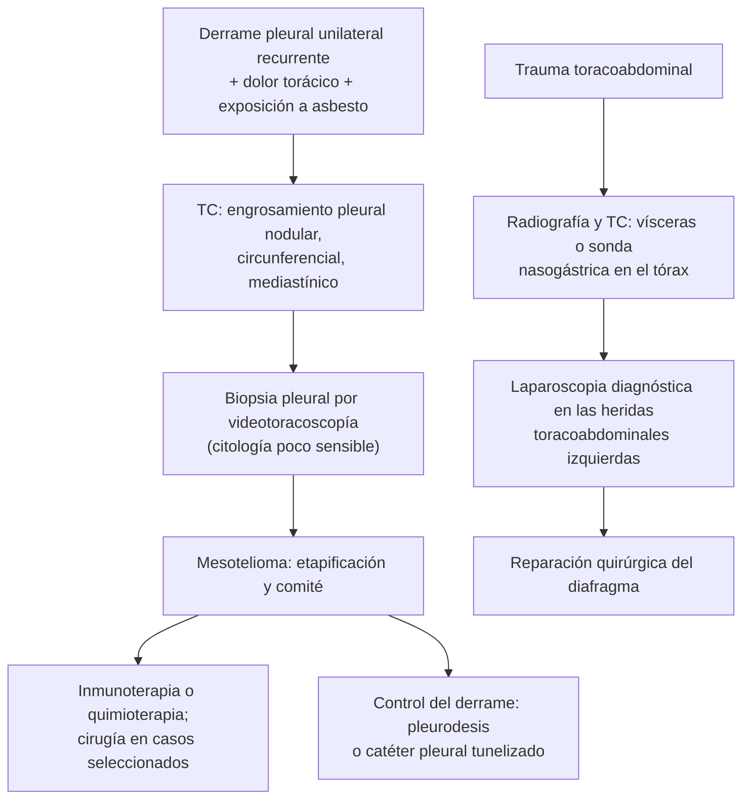

---
tags:
  - Cirugía
---

# Mesotelioma pleural y hernias diafragmáticas traumáticas y congénitas

**Subespecialidad**
Cirugía de tórax · Oncología · Trauma

**Guías principales**
Guía ESMO de mesotelioma pleural maligno (*Ann Oncol* 2022) · Guía EAST de lesiones diafragmáticas traumáticas (*J Trauma Acute Care Surg* 2018) · Consenso CDH EURO de hernia diafragmática congénita, actualización 2015 (*Neonatology* 2016)

**Otras fuentes**
Decreto Supremo 656 (2000, publicado en 2001): prohibición del asbesto en Chile · Ver [derrame pleural](../../respiratorio/derrame-pleural.md) y [trauma torácico](../../respiratorio/neumotorax-y-trauma-toracico.md)

**GES**
No como tal (el politraumatizado grave, N.° 48, incluye el trauma toracoabdominal).

**EUNACOM**
4.01.1.042 Mesotelioma pleural · 4.01.1.040 Hernias diafragmáticas traumáticas y congénitas (sospecha, inicial)

**Revisado**
Octubre 2026

!!! abstract "Resumen en 60 segundos"
    - **Mesotelioma pleural**: cáncer de la pleura asociado a la **exposición al asbesto** (latencia de **20–50 años**). Hombre mayor con antecedente laboral (construcción, astilleros, frenos, aislantes).
        - **Disnea**, **dolor torácico** sordo persistente, **derrame pleural unilateral** recurrente, baja de peso.
        - **TC**: engrosamiento pleural **nodular**, circunferencial, que compromete la pleura **mediastínica**. La **citología** del líquido tiene baja sensibilidad: **biopsia pleural** (videotoracoscopía).
        - Pronóstico **malo**. Tratamiento: **inmunoterapia** (nivolumab + ipilimumab) o quimioterapia (platino + pemetrexed); cirugía en casos muy seleccionados; **pleurodesis** o catéter pleural para el derrame.
    - **Hernia diafragmática traumática**: por trauma **cerrado** (aumento brusco de la presión abdominal) o **penetrante** **toracoabdominal**. Más frecuente a **izquierda** (el hígado protege la derecha). Puede pasar **inadvertida** y manifestarse años después con estrangulación.
        - **Radiografía**: vísceras en el tórax, sonda nasogástrica sobre el diafragma. **TC**. **Laparoscopia** en las heridas toracoabdominales izquierdas.
        - Tratamiento: **reparación quirúrgica** (las lesiones del diafragma no cierran solas).
    - **Hernia diafragmática congénita**: recién nacido con **dificultad respiratoria**, **abdomen excavado** y ruidos intestinales en el tórax; **Bochdalek** (posterolateral, izquierda, la más frecuente) y **Morgagni** (anterior, retroesternal). **No ventilar con bolsa y mascarilla**: intubar y descomprimir con sonda.

## Definición

- **Mesotelioma pleural maligno**: neoplasia maligna de las células **mesoteliales** de la pleura; subtipos **epitelioide** (mejor pronóstico), **sarcomatoide** y **bifásico**.
- **Hernia diafragmática**: paso de vísceras abdominales al tórax a través de un defecto del diafragma.
    - **Traumática**: por rotura del diafragma.
    - **Congénita**: por un defecto del desarrollo; **Bochdalek** (posterolateral) y **Morgagni** (anterior paraesternal).
    - La **hernia hiatal** (por el hiato esofágico) se trata en [ERGE](../../gastroenterologia/reflujo-gastroesofagico.md).

## Epidemiología

### Mundial

- El mesotelioma es **raro**; su incidencia refleja la **exposición al asbesto** de décadas antes, por lo que persiste pese a las prohibiciones. Predomina en **hombres** mayores de 60 años.
- Las **lesiones diafragmáticas** ocurren en una pequeña proporción de los traumas; son más frecuentes en el trauma **penetrante** toracoabdominal y en los accidentes de tránsito de alta energía.
- La **hernia diafragmática congénita** afecta a alrededor de **1 de cada 2.500–4.000** recién nacidos; la mayoría son **izquierdas** (Bochdalek).

### Chile

!!! chile "Datos nacionales"
    - El **asbesto** se usó en Chile sin mayores restricciones (construcción, techumbres, cañerías, aislantes, frenos) hasta el **Decreto Supremo 656**, firmado en 2000 y publicado en **2001**, que prohibió su producción, importación, distribución y venta en materiales de construcción.
    - Por la **latencia** de décadas, se siguen diagnosticando mesoteliomas en personas expuestas antes de la prohibición; muchas viviendas y redes antiguas aún contienen asbesto.
    - No se encontraron datos nacionales confiables de incidencia del mesotelioma.
    - Las enfermedades por asbesto pueden ser **enfermedades profesionales** (Ley 16.744).

## Etiología y factores de riesgo

| Entidad | Causas y factores |
|---|---|
| **Mesotelioma pleural** | **Asbesto** (ocupacional: construcción, astilleros, frenos y embragues, aislación, minería; también exposición **doméstica** o ambiental); radiación torácica previa; predisposición genética (mutación germinal de **BAP1**) |
| **Hernia diafragmática traumática** | **Trauma cerrado** de alta energía (choque lateral, aplastamiento: estallido por aumento de la presión abdominal); **trauma penetrante** toracoabdominal (arma blanca, de fuego) |
| **Hernia diafragmática congénita** | Defecto del cierre de los canales pleuroperitoneales (**Bochdalek**) o del septum transverso anterior (**Morgagni**); a veces asociada a cromosomopatías y cardiopatías |

## Fisiopatología

- **Mesotelioma**: las fibras de asbesto (sobre todo las **anfíboles**) se depositan en la pleura, producen **inflamación crónica**, estrés oxidativo y daño del ADN → transformación maligna tras décadas. El tumor crece envolviendo el pulmón ("**pulmón encarcelado**") e invade la pared torácica y el mediastino.
- **Diafragma traumático**: el diafragma izquierdo está menos protegido (el **hígado** protege el derecho). La **presión negativa** del tórax "aspira" las vísceras (estómago, colon, bazo, epiplón) a través del defecto, que **no cicatriza** espontáneamente y tiende a **agrandarse** → riesgo de **incarceración** y **estrangulación**, a veces años después.
- **Hernia diafragmática congénita**: las vísceras en el tórax durante la vida fetal producen **hipoplasia pulmonar** e **hipertensión pulmonar** persistente, que determinan el pronóstico.

*Figura 1. Enfoque del mesotelioma pleural y de la lesión diafragmática traumática. Esquema propio basado en las guías ESMO 2022 y EAST 2018.*

## Clasificación

**Mesotelioma**: subtipos histológicos **epitelioide** (el más frecuente, mejor pronóstico), **sarcomatoide** (peor pronóstico) y **bifásico**; etapificación TNM.

**Hernias diafragmáticas**:

| Tipo | Ubicación | Características |
|---|---|---|
| **Traumática** | **Izquierda** con más frecuencia | Estómago, colon, bazo; diagnóstico a veces tardío (estrangulación) |
| **Bochdalek** (congénita) | **Posterolateral**, sobre todo **izquierda** | La más frecuente; **recién nacido** con dificultad respiratoria |
| **Morgagni** (congénita) | **Anterior** retroesternal, más a derecha | Poco frecuente; a menudo **asintomática** en el adulto, hallazgo en la radiografía |
| **Hiatal** | Hiato esofágico | Ver [ERGE](../../gastroenterologia/reflujo-gastroesofagico.md) |

## Clínica

- **Mesotelioma**:
    - **Disnea** progresiva (derrame), **dolor torácico** sordo y persistente (invasión de la pared), tos.
    - **Baja de peso**, sudoración, fiebre.
    - Hipoventilación y matidez del hemitórax; en etapas avanzadas, masa en la pared torácica, retracción del hemitórax.
- **Hernia diafragmática traumática**:
    - **Aguda**: disnea, dolor torácico o abdominal, **ruidos intestinales en el tórax**, murmullo disminuido; puede quedar enmascarada por otras lesiones.
    - **Tardía** (meses o años): dolor epigástrico o torácico tras comer, síntomas obstructivos, **incarceración** o **estrangulación** (vómitos, dolor intenso, shock).
- **Hernia congénita (Bochdalek)**: recién nacido con **dificultad respiratoria grave**, cianosis, **abdomen excavado**, tórax abombado, ruidos cardíacos desplazados a la derecha.

## Diagnóstico

!!! guia "Puntos clave (ESMO 2022, EAST 2018)"
    - **Mesotelioma**: **TC de tórax** con contraste; **toracocentesis** (exudado; la **citología** es positiva en una minoría); el diagnóstico requiere **biopsia pleural**, preferentemente por **videotoracoscopía** (VATS), con **inmunohistoquímica** (calretinina, WT1, D2-40; pérdida de BAP1); PET-TC y estudio de etapificación en los candidatos a tratamiento radical.
    - **Lesión diafragmática traumática**: **radiografía de tórax** (sonda nasogástrica o asas en el tórax, elevación del hemidiafragma), **TC**; en las **heridas penetrantes toracoabdominales izquierdas** en pacientes estables sin indicación de laparotomía, **laparoscopia diagnóstica** (la TC puede no detectar lesiones pequeñas).
    - **Congénita**: diagnóstico **prenatal** por ecografía en muchos casos; al nacer, radiografía de tórax y abdomen.

## Laboratorio

| Examen | Uso |
|---|---|
| **Líquido pleural**: LDH, proteínas, glucosa, citología | Exudado; citología de baja sensibilidad en el mesotelioma |
| **Biopsia con inmunohistoquímica** | **Diagnóstico** del mesotelioma |
| **Mesotelina** sérica | Apoyo, no diagnóstica |
| **Gases arteriales** | Hipoxemia (hernia congénita, derrame masivo) |

## Imágenes

| Examen | Uso |
|---|---|
| **Radiografía de tórax** | Derrame; vísceras en el tórax; placas pleurales calcificadas (exposición a asbesto) |
| **TC de tórax** | Engrosamiento pleural nodular (mesotelioma); defecto diafragmático, herniación |
| **PET-TC** | Etapificación del mesotelioma |
| **Ecografía prenatal** | Hernia diafragmática congénita |

## Diagnóstico diferencial

| Hallazgo | Diferenciales |
|---|---|
| **Engrosamiento pleural** | **Mesotelioma**, **metástasis pleurales** (pulmón, mama), placas pleurales benignas por asbesto, empiema crónico, fibrotórax, TBC |
| **Derrame pleural unilateral en un adulto mayor** | Neoplásico (pulmón, mama, linfoma, mesotelioma), paraneumónico, TBC, TEP (ver [derrame pleural](../../respiratorio/derrame-pleural.md)) |
| **Imagen aérea en la base pulmonar izquierda tras un trauma** | **Hernia diafragmática**, neumotórax, contusión, elevación del hemidiafragma por parálisis frénica |
| **Masa cardiofrénica derecha** | **Morgagni**, quiste pericárdico, lipoma, masa mediastínica |

## Tratamiento

### Mesotelioma pleural

- **Comité multidisciplinario**; la mayoría de los pacientes tiene enfermedad no resecable.
- **Enfermedad irresecable**: **inmunoterapia** (**nivolumab + ipilimumab**, sobre todo en el no epitelioide) o **quimioterapia** con **platino + pemetrexed** (± bevacizumab).
- **Cirugía** (pleurectomía/decorticación) en casos muy seleccionados en centros especializados, como parte de un tratamiento multimodal.
- **Paliación del derrame**: **pleurodesis** con talco o **catéter pleural tunelizado**.
- **Analgesia** (el dolor de la pared torácica es difícil de controlar), **radioterapia** paliativa; **cuidados paliativos** precoces (GES N.° 4 en el cáncer avanzado).
- Orientar sobre la **notificación** como **enfermedad profesional**.

### Hernia diafragmática traumática

- Toda lesión diafragmática traumática **se repara** (no cicatriza sola): por **laparotomía** o **laparoscopia** en la fase aguda (permite revisar las vísceras abdominales), o por **toracotomía** o toracoscopía en las hernias crónicas.
- **Incarceración o estrangulación**: **cirugía urgente**; **descompresión** gástrica con sonda.
- Con el **estómago herniado y distendido** que produce compromiso respiratorio (simula un neumotórax a tensión): **sonda nasogástrica**; **no** colocar un drenaje pleural a ciegas sin descartar la víscera herniada.

### Hernia diafragmática congénita

- En sala de partos: **intubación** inmediata, **no ventilar con bolsa y mascarilla** (distiende las vísceras intratorácicas), **sonda orogástrica** para descomprimir; manejo de la **hipertensión pulmonar** en UCI neonatal.
- **Reparación quirúrgica diferida** tras la estabilización.
- **Morgagni** en el adulto: reparación electiva si da síntomas (habitualmente laparoscópica).

!!! alarma "Derivar"
    - **Derrame pleural** unilateral recurrente con exposición a asbesto o engrosamiento pleural nodular: neumología o cirugía de tórax (biopsia).
    - Paciente con trauma toracoabdominal y **vísceras en el tórax**, o con dolor y vómitos con antecedente de trauma o herida torácica antigua: **hernia diafragmática incarcerada**.
    - Recién nacido con dificultad respiratoria y abdomen excavado.

## Complicaciones

- **Mesotelioma**: derrame recurrente, **pulmón atrapado**, invasión de la pared torácica y del mediastino, caquexia, insuficiencia respiratoria.
- **Hernia diafragmática traumática**: **estrangulación** de vísceras huecas, perforación, compromiso respiratorio y cardiovascular.
- **Hernia congénita**: hipoplasia e **hipertensión pulmonar**, recurrencia, reflujo gastroesofágico, alteraciones del neurodesarrollo.

## Pronóstico y seguimiento

- **Mesotelioma**: pronóstico **malo** (sobrevida de pocos años en promedio), mejor en el subtipo **epitelioide**; la inmunoterapia mejoró la sobrevida en una parte de los pacientes.
- **Hernia traumática** reparada: buen pronóstico; el retraso diagnóstico aumenta la morbimortalidad.
- **Hernia congénita**: la sobrevida depende del grado de **hipoplasia pulmonar**; seguimiento multidisciplinario.

## Perlas para el internado

!!! perla "Para recordar en la sala"
    - **Derrame pleural recurrente + dolor torácico + asbesto = mesotelioma** hasta demostrar lo contrario.
    - **Citología negativa no descarta mesotelioma**: biopsia por **VATS**.
    - **Latencia de décadas**: en Chile se siguen viendo casos pese a la prohibición del asbesto (2001).
    - **Hernia diafragmática traumática = izquierda** con más frecuencia; **sonda nasogástrica en el tórax** en la radiografía.
    - **Herida toracoabdominal izquierda en un paciente estable = laparoscopia** (descartar la lesión diafragmática).
    - **No colocar un drenaje pleural a ciegas** si hay sospecha de víscera herniada.
    - **Recién nacido con dificultad respiratoria y abdomen excavado = Bochdalek: intubar, no ventilar con bolsa.**

## Preguntas de repaso

??? repaso "1. Hombre de 70 años, ex trabajador de la construcción, con disnea, dolor torácico derecho persistente y derrame pleural derecho recurrente. La citología del líquido fue negativa dos veces. La TC muestra engrosamiento pleural nodular que compromete la pleura mediastínica. ¿Qué sospecha y cómo lo confirma?"
    - **Mesotelioma pleural** (exposición a asbesto).
    - **Biopsia pleural por videotoracoscopía** con inmunohistoquímica; en el mismo procedimiento, **pleurodesis** o catéter pleural para el derrame.

??? repaso "2. Motociclista con trauma toracoabdominal cerrado. La radiografía de tórax muestra la sonda nasogástrica enrollada sobre el hemidiafragma izquierdo, en el tórax. ¿Diagnóstico y conducta?"
    - **Rotura diafragmática izquierda** con herniación gástrica.
    - **Reparación quirúrgica** (habitualmente por laparotomía, revisando las vísceras abdominales). No colocar un drenaje pleural a ciegas.

??? repaso "3. Hombre de 25 años con una herida por arma blanca en el 7.º espacio intercostal izquierdo, línea axilar anterior. Estable, sin peritonitis; la radiografía es normal. ¿Qué estudio indica para descartar una lesión diafragmática?"
    - **Laparoscopia diagnóstica**: las heridas toracoabdominales izquierdas tienen riesgo de lesión diafragmática oculta que la TC puede no detectar.

??? repaso "4. Hombre de 45 años con dolor epigástrico y vómitos de inicio brusco; hace 5 años tuvo una herida por arma blanca en el hemitórax izquierdo. La radiografía muestra un nivel hidroaéreo en el hemitórax izquierdo. ¿Qué sospecha?"
    - **Hernia diafragmática traumática tardía** con **incarceración** gástrica (el defecto no cicatrizó y creció).
    - Sonda nasogástrica, TC y **cirugía urgente**.

??? repaso "5. Recién nacido con dificultad respiratoria grave, abdomen excavado y ruidos cardíacos desplazados a la derecha. ¿Qué no debe hacer?"
    - Sospecha de **hernia diafragmática congénita (Bochdalek)**.
    - **No ventilar con bolsa y mascarilla** (distiende las vísceras herniadas): **intubar** de inmediato y colocar una **sonda orogástrica**; UCI neonatal.

## Referencias

1. Popat S, Baas P, Faivre-Finn C, et al. Malignant pleural mesothelioma: ESMO Clinical Practice Guidelines for diagnosis, treatment and follow-up. *Ann Oncol.* 2022;33(2):129–142. doi:[10.1016/j.annonc.2021.11.005](https://doi.org/10.1016/j.annonc.2021.11.005)
2. McDonald AA, Robinson BRH, Alarcon L, et al. Evaluation and management of traumatic diaphragmatic injuries: A Practice Management Guideline from the Eastern Association for the Surgery of Trauma. *J Trauma Acute Care Surg.* 2018;85(1):198–207. doi:[10.1097/TA.0000000000001924](https://doi.org/10.1097/TA.0000000000001924)
3. Snoek KG, Reiss IK, Greenough A, et al. Standardized Postnatal Management of Infants with Congenital Diaphragmatic Hernia in Europe: The CDH EURO Consortium Consensus – 2015 Update. *Neonatology.* 2016;110(1):66–74. doi:[10.1159/000444210](https://doi.org/10.1159/000444210)
4. Ministerio de Salud de Chile. Decreto Supremo 656 (2000), sobre la prohibición del asbesto en materiales de construcción; publicado en el Diario Oficial en enero de 2001. [Búsqueda en bcn.cl](https://www.bcn.cl/leychile/consulta/listaresultadosimple?cadena=decreto%20656%20asbesto)
