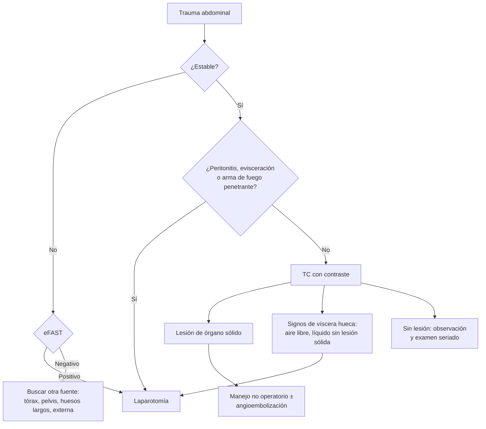

---
tags:
  - Cirugía
  - Urgencia
---

# Trauma abdominal abierto y cerrado

**Subespecialidad**
Trauma · Cirugía general · Urgencia

**Guías principales**
ATLS, 10.ª edición (actualización resumida en 2019) · Guías WSES de trauma esplénico (2017) y hepático (2020) · Guía EAST de manejo no operatorio selectivo del trauma abdominal penetrante (2010)

**Otras fuentes**
Guía europea de hemorragia masiva en el trauma, 6.ª edición (2023)

**GES**
Sí, dentro del **politraumatizado grave** (N.° 48) cuando corresponde (ver [trauma y politraumatizado](trauma-y-politraumatizado.md)).

**EUNACOM**
4.01.2.010 Trauma abdominal abierto y cerrado (sospecha, tratamiento inicial)

**Revisado**
Octubre 2026

!!! abstract "Resumen en 60 segundos"
    - **Cerrado**: lesiona sobre todo el **bazo** y el **hígado** (órganos sólidos). **Abierto** (penetrante): el **intestino delgado** y el **colon** en las heridas por arma blanca, y el hígado en las de arma de fuego.
    - **Inestable + eFAST positivo** = **laparotomía** de inmediato. **Estable** = **TC con contraste**.
    - **Laparotomía sin estudio** si hay **shock**, **peritonitis** o **evisceración**, o una **herida por arma de fuego** que penetra el peritoneo.
    - **Lesión de bazo o hígado en un paciente estable**: **manejo no operatorio** (observación, ± **angioembolización**), en un centro con UCI y pabellón disponibles.
    - **Arma blanca** estable y sin peritonitis: **manejo no operatorio selectivo** con examen abdominal **seriado** (o TC, o exploración de la herida).
    - El **signo del cinturón** obliga a buscar una lesión de **víscera hueca** y del **mesenterio**, que la TC y el eFAST pueden pasar por alto.

## Definición

- **Trauma abdominal cerrado** (contuso): sin solución de continuidad de la pared; por **compresión**, **aplastamiento** o **desaceleración**.
- **Trauma abdominal abierto** (penetrante): con herida de la pared; **penetrante** si atraviesa el **peritoneo parietal**. Por **arma blanca** (baja energía) o **arma de fuego** (alta energía, trayectos impredecibles).
- **Abdomen** en el trauma: incluye el **toracoabdomen** (bajo el 4.º espacio intercostal por delante y la punta de la escápula por detrás, porque el diafragma sube en la espiración), el **flanco**, el **dorso** y la **pelvis**.

## Epidemiología

### Mundial

- En el trauma **cerrado**, los órganos más lesionados son el **bazo** y el **hígado**, seguidos del intestino delgado.
- En las heridas por **arma blanca**: hígado, intestino delgado, diafragma y colon. Por **arma de fuego**: intestino delgado, colon, hígado y estructuras vasculares.
- Una parte importante de las heridas por arma blanca **no penetra** el peritoneo o no causa lesiones que requieran cirugía; de ahí el **manejo no operatorio selectivo**.
- El **manejo no operatorio** es hoy el estándar en la mayoría de las lesiones de bazo e hígado en pacientes estables.

### Chile

!!! chile "Datos nacionales"
    - No se encontraron series nacionales recientes que describan el trauma abdominal en conjunto.
    - En Chile predominan las **heridas por arma blanca** en el trauma penetrante (ver la serie de Concepción en [trauma torácico](../../respiratorio/neumotorax-y-trauma-toracico.md)).
    - El politraumatizado grave está cubierto por el **GES N.° 48**.

## Etiología y factores de riesgo

| Mecanismo | Lesión típica |
|---|---|
| **Golpe directo** (volante, manubrio, patada) | Bazo, hígado, **duodeno y páncreas** (manubrio de bicicleta) |
| **Desaceleración** | Desgarro del **mesenterio**, del pedículo renal, del hígado en sus ligamentos |
| **Cinturón de seguridad** | **Víscera hueca** (intestino delgado), mesenterio, fractura de Chance |
| **Aumento brusco de la presión** | **Rotura diafragmática** (más a izquierda), estallido vesical |
| **Arma blanca** | Hígado, intestino delgado, colon, diafragma |
| **Arma de fuego** | Intestino delgado, colon, hígado, vasos |
| **Fractura costal baja** | Izquierda: **bazo**; derecha: **hígado** |

## Fisiopatología

- **Órgano sólido** (bazo, hígado, riñón, páncreas): **hemorragia** → hemoperitoneo y **shock**.
- **Víscera hueca** (intestino, colon, estómago): **contaminación** → **peritonitis**; los signos aparecen en **horas**, por lo que el examen inicial puede ser normal.
- **Retroperitoneo** (duodeno, páncreas, colon ascendente y descendente, riñón, grandes vasos): lesiones **silentes**, con pocos signos peritoneales y difíciles de ver en el eFAST.

*Figura 1. Enfoque del trauma abdominal según la estabilidad hemodinámica. Esquema propio basado en el ATLS y las guías WSES y EAST.*

## Clasificación

**Lesión esplénica (AAST)**:

| Grado | Lesión |
|---|---|
| **I** | Hematoma subcapsular < 10 % de la superficie; laceración < 1 cm de profundidad |
| **II** | Hematoma subcapsular 10–50 %; intraparenquimatoso < 5 cm; laceración 1–3 cm |
| **III** | Hematoma subcapsular > 50 % o expansivo; intraparenquimatoso ≥ 5 cm; laceración > 3 cm |
| **IV** | Laceración de vasos segmentarios o hiliares con desvascularización > 25 % |
| **V** | Bazo **estallado**; lesión vascular hiliar que desvasculariza el órgano |

La **WSES** agrega la **fisiología**. En el paciente **estable**: **WSES I** = AAST I–II (menor), **WSES II** = AAST III y **WSES III** = AAST IV–V (moderadas); todas con manejo no operatorio, y angiografía en las moderadas. **Cualquier** grado en un paciente **inestable** es **WSES IV** (cirugía).

## Clínica

- **Hemoperitoneo**: shock, distensión, dolor difuso; el abdomen puede ser **poco expresivo** al inicio.
- **Signo de Kehr**: dolor referido al **hombro izquierdo** (irritación diafragmática por sangre esplénica).
- **Peritonitis**: dolor, **resistencia muscular**, **rebote** (víscera hueca; aparece en horas).
- **Signo del cinturón**: equimosis en la pared abdominal por el cinturón; alto riesgo de lesión **intestinal** y **mesentérica**.
- **Equimosis en el flanco** (Grey Turner) o **periumbilical** (Cullen): hemorragia **retroperitoneal**.
- **Evisceración** de epiplón o intestino por la herida.
- Herida **toracoabdominal** izquierda: sospechar una lesión del **diafragma**.
- **Limitaciones del examen**: TEC, alcohol y drogas, lesión medular, intubación o lesiones distractoras dolorosas.

## Diagnóstico

!!! guia "Puntos clave (ATLS, WSES y EAST)"
    - **Inestable**: **eFAST**; si es **positivo**, **laparotomía** sin otros estudios.
    - **Laparotomía de inmediato**, sin estudio, si hay **shock** con sospecha de fuente abdominal, **peritonitis**, **evisceración**, **sangrado** por la sonda gástrica o el tacto rectal, o una **herida por arma de fuego** que penetra el peritoneo.
    - **Estable**: **TC de abdomen y pelvis con contraste IV**; es el examen para clasificar las lesiones sólidas y decidir el manejo no operatorio.
    - **Arma blanca** en un paciente estable, sin peritonitis ni evisceración: **manejo no operatorio selectivo**, con **examen físico seriado** (o TC, o exploración local de la herida para ver si penetra la fascia).
    - **Herida toracoabdominal izquierda**: **laparoscopia** diagnóstica para descartar una lesión diafragmática.

## Laboratorio

| Examen | Uso |
|---|---|
| **Grupo, Rh y pruebas cruzadas** | Transfusión |
| **Hemoglobina seriada** | Control del manejo no operatorio |
| **Gases con lactato y déficit de base** | Shock oculto |
| **Pruebas de coagulación** | Coagulopatía |
| **Amilasa y lipasa** | Lesión de **páncreas** o duodeno (poco sensibles al inicio) |
| **Orina completa** | Hematuria (ver [trauma urológico](../urologia/trauma-urologico.md)) |
| **Pruebas hepáticas** | Lesión hepática |
| **Test de embarazo** | Mujer en edad fértil |

## Imágenes

| Examen | Uso |
|---|---|
| **eFAST** | Líquido libre en el **inestable**; rápido, repetible. **No** descarta lesiones de víscera hueca, páncreas ni retroperitoneo |
| **TC con contraste** | Paciente **estable**: grado de la lesión sólida, **extravasación** de contraste (sangrado activo), aire libre, líquido sin lesión sólida (sospechar víscera hueca) |
| **Radiografía de tórax** | **Neumoperitoneo** bajo el diafragma, rotura diafragmática (vísceras en el tórax), lesiones torácicas asociadas |
| **Angiografía** | **Embolización** del sangrado esplénico o hepático en el paciente estable o que responde |
| **Laparoscopia diagnóstica** | Herida toracoabdominal (diafragma), duda de penetración peritoneal |
| **Lavado peritoneal diagnóstico** | Casi reemplazado por el eFAST; útil si no hay ecografía |

<figure markdown>
{ loading=lazy }
<figcaption>Figura 2. Algoritmo de la WSES para el trauma esplénico del adulto (en inglés). El paciente estable se estudia con TC: las lesiones menores (WSES I) y moderadas (WSES II) se manejan sin cirugía (NOM), las moderadas WSES III con angiografía y angioembolización si hay *blush*; el inestable (WSES IV) va a laparotomía con esplenectomía o salvataje esplénico. NOM: manejo no operatorio; SW: herida por arma blanca. Tomada de Coccolini F, Montori G, Catena F, et al. <em>Splenic trauma: WSES classification and guidelines for adult and pediatric patients.</em> World J Emerg Surg. 2017;12:40 (figura 2). Licencia CC BY 4.0.</figcaption>
</figure>

## Diagnóstico diferencial

| Situación | Considerar |
|---|---|
| **Shock con eFAST negativo** | Sangrado en el **tórax**, la **pelvis** o el **retroperitoneo**, huesos largos, externo; shock **obstructivo** o **neurogénico** |
| **Dolor abdominal con TC sin lesión sólida** | **Víscera hueca** o mesenterio (líquido libre sin lesión sólida, engrosamiento intestinal), páncreas, diafragma |
| **Dolor en el flanco y hematuria** | **Trauma renal** |
| **Dolor abdominal en una embarazada** | Lesión materna, **desprendimiento de placenta**, rotura uterina |

## Tratamiento

### Inicial

- **ABCDE** y reanimación con **control del daño** (ver [trauma y politraumatizado](trauma-y-politraumatizado.md)): hipotensión permisiva, **tranexámico**, transfusión balanceada.
- **Ayuno**, **sonda gástrica** (descomprime; sangre sugiere lesión gastroduodenal) y **sonda vesical** si no hay sangre en el meato.
- **Evisceración**: **no reintroducir** las vísceras en urgencia; cubrir con **compresas húmedas estériles** y llevar a pabellón.
- **Objeto empalado**: **no retirarlo** fuera del pabellón; fijarlo.
- **Antibiótico profiláctico** en el trauma **penetrante** (cobertura de flora intestinal, dosis única o < 24 h si no hay contaminación mantenida).
- **Profilaxis antitetánica** según las heridas.

### Definitivo

| Situación | Conducta |
|---|---|
| **Inestable con eFAST positivo**, peritonitis, evisceración, arma de fuego penetrante | **Laparotomía** (control del daño si hay tríada letal) |
| **Bazo o hígado lesionado, paciente estable** | **Manejo no operatorio**: UCI o intermedio, hemoglobina y examen seriados, reposo relativo; **angioembolización** si hay sangrado activo |
| **Fracaso del manejo no operatorio** (inestabilidad, caída de la hemoglobina pese a la transfusión, peritonitis) | **Laparotomía** |
| **Arma blanca**, estable, sin peritonitis | **Manejo no operatorio selectivo**: examen seriado ~24 h; cirugía si aparece peritonitis o inestabilidad |
| **Víscera hueca** | Reparación o resección intestinal |
| **Diafragma** | Reparación (laparoscópica o abierta) |

!!! alarma "Laparotomía urgente"
    - **Shock** con eFAST positivo o sin otra fuente que lo explique.
    - **Peritonitis**, **evisceración**, **neumoperitoneo**.
    - **Herida por arma de fuego** que penetra el peritoneo.
    - **Sangre** en la sonda gástrica o en el tacto rectal tras una herida penetrante.
    - **Fracaso del manejo no operatorio**.

## Complicaciones

- **Hemorragia** tardía (rotura del hematoma subcapsular, seudoaneurisma).
- **Peritonitis** y **abscesos** intraabdominales por una lesión de víscera hueca **inadvertida**.
- **Síndrome compartimental abdominal** (presión intraabdominal elevada con falla orgánica): abdomen abierto o descompresión.
- **Fístulas**, pancreatitis y seudoquiste traumático.
- Tras una **esplenectomía**: riesgo de **sepsis fulminante postesplenectomía** (neumococo, meningococo, *H. influenzae*): **vacunar**.
- **Bilioma** y hemobilia en el trauma hepático.

## Pronóstico y seguimiento

- El **manejo no operatorio** de las lesiones de bazo e hígado tiene **altas tasas de éxito** en pacientes bien seleccionados; los fracasos ocurren sobre todo en los **primeros días**.
- Tras el alta: evitar los deportes de contacto por algunas semanas, según el grado de la lesión.
- **Esplenectomizados**: vacunas antineumocócica, antimeningocócica y anti-*Haemophilus*, y educación sobre la fiebre (consulta precoz).

## Perlas para el internado

!!! perla "Para recordar en la sala"
    - **Inestable + eFAST positivo = pabellón.** No llevar a la TC a un paciente inestable.
    - **Estable = TC con contraste**; la mayoría de las lesiones de bazo e hígado se maneja **sin cirugía**.
    - **eFAST negativo no descarta** una lesión de víscera hueca, páncreas o retroperitoneo.
    - **Signo del cinturón**: buscar intestino, mesenterio y fractura de Chance.
    - **Kehr**: dolor en el hombro izquierdo = bazo.
    - **Evisceración**: cubrir con compresas húmedas y no reintroducir. **Objeto empalado**: no sacarlo.
    - **Arma de fuego penetrante = laparotomía**; **arma blanca estable sin peritonitis = examen seriado**.
    - **Esplenectomía = vacunas** (neumococo, meningococo, *Haemophilus*).

## Preguntas de repaso

??? repaso "1. Ciclista de 22 años chocó contra un auto. PA 80/50, FC 135, dolor en el hipocondrio izquierdo y el hombro izquierdo. El eFAST muestra líquido en el espacio esplenorrenal. ¿Conducta?"
    - **Shock hemorrágico** por probable **lesión esplénica** (signo de Kehr).
    - Reanimación con control del daño (tranexámico, sangre) y **laparotomía** inmediata. No llevarlo a la TC.

??? repaso "2. Mujer de 35 años estable tras un choque, con dolor leve en el hipocondrio derecho. La TC muestra una laceración hepática de 2 cm sin extravasación de contraste. ¿Cómo la maneja?"
    - Lesión hepática de bajo grado en un paciente **estable**.
    - **Manejo no operatorio**: observación en una unidad monitorizada, hemoglobina y examen abdominal seriados; angiografía si aparece sangrado activo.

??? repaso "3. Hombre de 28 años con una herida por arma blanca en el flanco derecho, estable, sin peritonitis ni evisceración. ¿Qué opciones tiene?"
    - **Manejo no operatorio selectivo**: exploración local de la herida (¿penetra la fascia?), **TC** y/o **examen físico seriado** por ~24 horas.
    - Laparotomía si aparece **peritonitis**, inestabilidad o caída de la hemoglobina.

??? repaso "4. Conductor con equimosis en banda en el abdomen inferior por el cinturón. La TC muestra líquido libre sin lesión de hígado ni de bazo. ¿Qué sospecha?"
    - Lesión de **víscera hueca** o del **mesenterio** (signo del cinturón con líquido libre sin lesión sólida).
    - Examen seriado o **laparoscopia/laparotomía**; buscar también una **fractura de Chance**.

??? repaso "5. Herido por arma blanca con asas intestinales que protruyen por la herida, estable. ¿Qué hace en la urgencia?"
    - **No reintroducir** las asas: cubrirlas con **compresas húmedas estériles**.
    - Antibiótico profiláctico, profilaxis antitetánica y **laparotomía**.

## Referencias

1. Galvagno SM, Nahmias JT, Young DA. Advanced Trauma Life Support® Update 2019: Management and Applications for Adults and Special Populations. *Anesthesiol Clin.* 2019;37(1):13–32. doi:[10.1016/j.anclin.2018.09.009](https://doi.org/10.1016/j.anclin.2018.09.009)
2. Coccolini F, Montori G, Catena F, et al. Splenic trauma: WSES classification and guidelines for adult and pediatric patients. *World J Emerg Surg.* 2017;12:40. doi:[10.1186/s13017-017-0151-4](https://doi.org/10.1186/s13017-017-0151-4)
3. Coccolini F, Coimbra R, Ordonez C, et al. Liver trauma: WSES 2020 guidelines. *World J Emerg Surg.* 2020;15(1):24. doi:[10.1186/s13017-020-00302-7](https://doi.org/10.1186/s13017-020-00302-7)
4. Como JJ, Bokhari F, Chiu WC, et al. Practice management guidelines for selective nonoperative management of penetrating abdominal trauma. *J Trauma.* 2010;68(3):721–733. doi:[10.1097/TA.0b013e3181cf7d07](https://doi.org/10.1097/TA.0b013e3181cf7d07)
5. Rossaint R, Afshari A, Bouillon B, et al. The European guideline on management of major bleeding and coagulopathy following trauma: sixth edition. *Crit Care.* 2023;27(1):80. doi:[10.1186/s13054-023-04327-7](https://doi.org/10.1186/s13054-023-04327-7)
