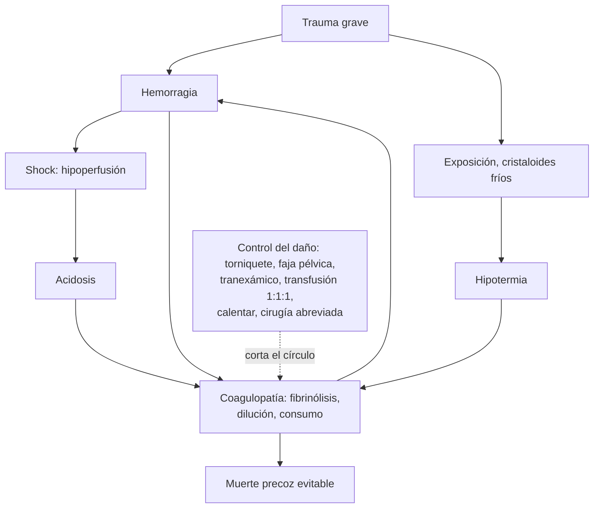

---
tags:
  - Cirugía
  - GES
  - Urgencia
---

# Trauma, politraumatizado y manejo en catástrofes

**Subespecialidad**
Trauma · Urgencia · Cirugía general

**Guías principales**
ATLS, 10.ª edición (American College of Surgeons; actualización resumida en 2019) · Guía europea de hemorragia masiva y coagulopatía en el trauma, 6.ª edición (*Crit Care* 2023)

**Otras fuentes**
Ensayo CRASH-2 (*Lancet* 2010): ácido tranexámico · Propuesta de triage masivo SALT (*Disaster Med Public Health Prep* 2008)

**GES**
Sí: **politraumatizado grave** (N.° 48), a cualquier edad. El **TEC moderado o grave** es el N.° 49.

**EUNACOM**
4.01.2.027 Trauma (sospecha, tratamiento inicial) · 4.01.3.008 Conceptos de manejo en situación de catástrofe (triage, extricación, inmovilización y transporte)

**Revisado**
Octubre 2026

!!! abstract "Resumen en 60 segundos"
    - **Evaluación primaria** en orden de lo que mata primero: **x** (hemorragia externa exanguinante), **A** (vía aérea con **restricción del movimiento cervical**), **B** (ventilación), **C** (circulación y control de la hemorragia), **D** (neurológico), **E** (exposición y **evitar la hipotermia**).
    - **Shock en el trauma = hemorrágico** hasta demostrar lo contrario. Buscar el sangrado en **cinco lugares**: externo, **tórax**, **abdomen**, **pelvis** y **huesos largos**.
    - **Reanimación con control del daño**: **torniquete** o compresión, **faja pélvica**, **hipotensión permisiva** (PAS **80–90 mmHg** si no hay TEC), cristaloides **restringidos**, **transfusión precoz** de glóbulos rojos, plasma y plaquetas.
    - **Ácido tranexámico** **1 g IV en 10 min** + **1 g en 8 h**, dentro de las **3 horas** del trauma.
    - Paciente inestable con **FAST positivo** = **pabellón**. Estable = **TC**.
    - **Catástrofe**: **triage START**: camina = **verde**; no respira tras abrir la vía aérea = **negro**; FR > 30, llene capilar > 2 s o no obedece = **rojo**; el resto = **amarillo**.

## Definición

- **Trauma**: lesión del organismo por una energía externa (mecánica, térmica, eléctrica, química).
- **Politraumatizado**: paciente con lesiones de **dos o más** sistemas, de las cuales al menos una, o su suma, **compromete la vida**.
- **Politraumatizado grave** (definición operativa del GES): politraumatizado con riesgo vital, que requiere manejo en un centro con capacidad de resolución (equipo de trauma, pabellón y UCI).
- **Shock hemorrágico**: hipoperfusión de los tejidos por pérdida aguda de sangre.
- **Catástrofe (víctimas en masa)**: situación en que el número de víctimas **supera la capacidad** de respuesta del sistema; obliga a priorizar según el **beneficio esperado**, no según la gravedad individual.

## Epidemiología

### Mundial

- El trauma es una de las primeras causas de **muerte** y de **años de vida perdidos** en personas **jóvenes**.
- La **hemorragia** es la principal causa de **muerte evitable** después del trauma; la mayoría de esas muertes ocurre en las **primeras horas** (la base de la "hora dorada").
- La **coagulopatía inducida por el trauma** está presente al ingreso en una proporción importante de los traumas graves y aumenta la mortalidad.

### Chile

!!! chile "Datos nacionales"
    - El **politraumatizado grave** es el problema de salud **GES N.° 48** y el **TEC moderado o grave** el **N.° 49**, ambos a cualquier edad.
    - Según la guía MINSAL del TEC (2013), el TEC explica **~ 40 %** de las muertes por **accidentes de tránsito**, y otro **~ 40 %** corresponde a politraumatizados (ver [TEC](../../neurologia/tec-e-hipertension-endocraneana.md)).
    - La atención prehospitalaria se activa por el **SAMU (131)**; el rescate y la extricación, por **Bomberos (132)**.

## Etiología y factores de riesgo

| Mecanismo | Lesiones que hay que buscar |
|---|---|
| **Choque frontal** de alta energía | Volante: tórax (contusión, neumotórax, **lesión aórtica**), hígado, bazo; rodilla contra el tablero: fractura de fémur y **luxación de cadera** |
| **Choque lateral** | Tórax y abdomen del lado del impacto, pelvis, columna cervical |
| **Eyección del vehículo**, **muerte de un ocupante**, **volcamiento** | Lesiones graves múltiples: mecanismos de **alta energía** |
| **Atropello** | Tríada de Waddell en niños: fémur, tórax o abdomen y cabeza |
| **Caída de altura** (> 3 m o > 2 pisos) | Calcáneo, **columna** (toracolumbar), pelvis, desaceleración (aorta, riñón) |
| **Cinturón de seguridad** abdominal | Signo del cinturón: **víscera hueca**, mesenterio, fractura de Chance (L1–L2) |
| **Herida por arma blanca** | Trayecto: tórax (neumotórax, **taponamiento**), abdomen |
| **Herida por arma de fuego** | Lesiones múltiples, trayecto impredecible |

Factores que empeoran el pronóstico: **edad avanzada**, **anticoagulantes** y antiagregantes, **betabloqueadores** (enmascaran la taquicardia), alcohol y drogas, embarazo, hipotermia.

## Fisiopatología

- **Distribución trimodal de las muertes** (clásica): inmediatas (lesiones incompatibles con la vida), **precoces** (primeras horas: hemorragia, TEC, neumotórax a tensión; las más **evitables** con un buen manejo inicial) y tardías (sepsis, falla multiorgánica).
- **Tríada letal**: **hipotermia**, **acidosis** y **coagulopatía**; cada una empeora a las otras.
- **Coagulopatía inducida por el trauma**: el daño tisular y el shock activan la proteína C y la **fibrinólisis**; se agrava con la **dilución** (cristaloides) y la hipotermia. Por eso el **tranexámico** y la **transfusión balanceada** precoz.
- **Hipocalcemia**: la transfusión con citrato baja el calcio iónico, que es necesario para la coagulación y la contractilidad.

*Figura 1. Tríada letal del trauma y cómo la corta la reanimación con control del daño. Esquema propio basado en la guía europea de hemorragia en el trauma 2023 y el ATLS.*

## Clasificación

**Clases de shock hemorrágico (ATLS)**, en un adulto de 70 kg:

| | **Clase I** | **Clase II** | **Clase III** | **Clase IV** |
|---|---|---|---|---|
| **Pérdida de sangre** | < 15 % (< 750 mL) | 15–30 % (750–1500 mL) | 31–40 % (1500–2000 mL) | > 40 % (> 2000 mL) |
| **Frecuencia cardíaca** | Normal | Normal o ↑ | ↑ | ↑↑ |
| **Presión arterial** | Normal | Normal | Normal o **↓** | **↓** |
| **Presión de pulso** | Normal | ↓ | ↓ | ↓ |
| **Frecuencia respiratoria** | Normal | Normal | Normal o ↑ | ↑ |
| **Diuresis** | Normal | Normal | ↓ | ↓↓ |
| **Conciencia** | Normal | Algo ansioso | Ansioso, confuso | Confuso, letárgico |
| **Déficit de base** | 0 a −2 | −2 a −6 | −6 a −10 | < −10 |
| **Transfusión** | Observar | Posible | **Sí** | **Transfusión masiva** |

**Respuesta a la reanimación inicial** (bolo de cristaloides o de sangre): **respondedor rápido**, **respondedor transitorio** (sigue sangrando: sangre y cirugía o angiografía) o **no respondedor** (pabellón inmediato).

**Triage START en catástrofes (adultos)**:

| Color | Prioridad | Criterio |
|---|---|---|
| **Verde** | Diferida ("heridos que caminan") | **Camina** |
| **Negro** | Fallecido o expectante | **No respira** tras abrir la vía aérea |
| **Rojo** | **Inmediata** | Respira con **FR > 30**, o **llene capilar > 2 s** o sin pulso radial, o **no obedece órdenes simples** |
| **Amarillo** | Urgente, puede esperar | Resto: FR ≤ 30, perfunde bien y obedece órdenes |

Existen otros sistemas (SALT, JumpSTART en niños); todos clasifican en pocos segundos por víctima y solo permiten maniobras salvadoras rápidas (abrir la vía aérea, controlar una hemorragia).

## Clínica

- **Signos de shock**: taquicardia, piel fría y pálida, **llene capilar lento**, ansiedad o confusión, **oliguria**; la **hipotensión** es **tardía** (clase III).
- **Índice de shock** (FC/PAS) **> 1**: predice transfusión masiva y mortalidad.
- **Lesiones que matan en la evaluación primaria** y que hay que tratar de inmediato:
    - Obstrucción de la **vía aérea**.
    - **Neumotórax a tensión**, neumotórax abierto, hemotórax masivo, tórax volante (ver [neumotórax y trauma torácico](../../respiratorio/neumotorax-y-trauma-toracico.md)).
    - **Taponamiento cardíaco**: tríada de Beck (hipotensión, ingurgitación yugular, ruidos apagados).
    - **Hemorragia**: externa, intraabdominal, **pélvica**, de huesos largos.
    - **TEC** con herniación (ver [TEC](../../neurologia/tec-e-hipertension-endocraneana.md)).
- Signos que sugieren lesiones ocultas: **signo del cinturón**, equimosis en el flanco o periumbilical, **sangre en el meato** (no sondear; ver [trauma urológico](../urologia/trauma-urologico.md)), inestabilidad pélvica, **déficit neurológico**.

## Diagnóstico

!!! guia "Secuencia ATLS"
    1. **Evaluación primaria (xABCDE)** con reanimación simultánea: cada problema se trata cuando se encuentra, antes de pasar a la letra siguiente.
    2. **Complementos de la evaluación primaria**: monitor, oximetría, capnografía si está intubado, **sonda gástrica** y **vesical** (si no hay contraindicación), gases arteriales con **lactato** y **déficit de base**, **radiografía de tórax y de pelvis** y **FAST** (eFAST).
    3. **¿Necesita traslado** a un centro de mayor complejidad? Decidirlo **precozmente**; no retrasar el traslado por exámenes.
    4. **Evaluación secundaria** solo cuando el paciente está reanimado: examen de **cabeza a pies**, historia **AMPLE** (alergias, medicamentos, patologías previas, *last meal*/última comida, eventos y entorno del trauma).
    5. **Reevaluación** continua y **TC** en el paciente estable.

| Letra | Qué se evalúa | Qué se hace |
|---|---|---|
| **x** | Hemorragia **externa exanguinante** | **Compresión directa**, **torniquete** en las extremidades |
| **A** | Vía aérea permeable; ¿habla? | Aspirar, tracción mandibular, cánula; **intubación** si GCS ≤ 8 o vía aérea amenazada; **collar cervical** y restricción del movimiento de la columna |
| **B** | FR, saturación, simetría, ingurgitación yugular, desviación traqueal | O2; **descompresión** del neumotórax a tensión; **drenaje pleural**; sellar el neumotórax abierto |
| **C** | Pulso, presión, llene capilar, conciencia; sitios de sangrado | **Dos vías venosas gruesas** (o intraósea); muestras (grupo y pruebas cruzadas); **faja pélvica**; sangre; buscar el sangrado |
| **D** | **GCS**, pupilas, focalidad, glicemia | Evitar la hipoxia y la hipotensión (lesión cerebral secundaria) |
| **E** | Desvestir completo, **rodar en bloque** | **Calentar**: frazadas, fluidos tibios; evitar la hipotermia |

## Laboratorio

| Examen | Uso |
|---|---|
| **Grupo, Rh y pruebas cruzadas** | Transfusión |
| **Hemoglobina** seriada | La inicial puede ser **normal** pese a una hemorragia grave (aún no hay hemodilución) |
| **Gases con lactato y déficit de base** | Grado de shock y respuesta a la reanimación |
| **Pruebas de coagulación** (TP, TTPa, fibrinógeno, plaquetas) o **viscoelásticas** (ROTEM, TEG) | Coagulopatía; guían la transfusión |
| **Calcio iónico** | Hipocalcemia por citrato en la transfusión masiva |
| **Alcoholemia** y toxicológico | Contexto médico-legal y clínico |
| **Test de embarazo** | Toda mujer en edad fértil |

## Imágenes

| Examen | Uso |
|---|---|
| **eFAST** | Líquido libre en el **pericardio**, el **abdomen** (hepatorrenal, esplenorrenal, pelvis) y el **tórax**; neumotórax. Rápido y repetible; **no** descarta lesiones de víscera hueca ni retroperitoneales |
| **Radiografía de tórax** | Neumotórax, hemotórax, mediastino ancho, fracturas costales |
| **Radiografía de pelvis** | Fractura pélvica inestable (causa de shock) |
| **TC de cuerpo entero** con contraste | Paciente **estable** o que respondió a la reanimación; estándar para el diagnóstico de las lesiones |
| **Angiografía** | Diagnóstico y **embolización** del sangrado (pelvis, bazo, hígado, riñón) |

## Diagnóstico diferencial

| Shock en el trauma | Claves |
|---|---|
| **Hemorrágico** (el más frecuente) | Taquicardia, piel fría, yugulares **planas**; buscar sangre en tórax, abdomen, pelvis, huesos largos y externa |
| **Neumotórax a tensión** (obstructivo) | Yugulares **ingurgitadas**, murmullo abolido, desviación traqueal: **descomprimir** sin esperar la radiografía |
| **Taponamiento** (obstructivo) | Tríada de Beck, herida precordial, eFAST con derrame pericárdico |
| **Neurogénico** | **Hipotensión con bradicardia** y piel **caliente**; lesión medular cervical o torácica alta (ver [trauma raquimedular](../../neurologia/debilidad-aguda-guillain-barre-y-mielopatias.md)) |
| **Contusión miocárdica** | Arritmias, ECG alterado, troponina |
| El **TEC aislado** no causa shock (salvo en la etapa terminal o en lactantes): buscar otra causa | |

## Tratamiento

### Prehospitalario, extricación, inmovilización y transporte

- **Seguridad de la escena** primero (tránsito, fuego, violencia); nadie entra a una escena insegura.
- **Extricación**: sacar a la víctima atrapada con **restricción del movimiento de la columna** (collar cervical, tabla o dispositivos de extricación); la **extricación rápida** se reserva para el peligro inminente o el paro.
- **Inmovilización**: collar cervical y alineación de la columna en el trauma con riesgo de lesión espinal; **férulas** en las fracturas de extremidades; **faja pélvica** si se sospecha una fractura de pelvis con shock. La tabla espinal sirve para el **traslado**, no para dejar al paciente sobre ella por horas (úlceras por presión, dolor, restricción respiratoria).
- **Transporte** al centro **adecuado** (no necesariamente el más cercano), avisando antes; los tiempos en la escena deben ser cortos.

### Reanimación con control del daño

!!! guia "Guía europea de hemorragia en el trauma (6.ª edición, 2023)"
    - **Minimizar el tiempo** entre el trauma y el control quirúrgico del sangrado.
    - **Torniquete** en la hemorragia de extremidades que amenaza la vida; **faja pélvica** en la sospecha de fractura pélvica con hemorragia.
    - **Hipotensión permisiva**: PAS **80–90 mmHg** (PAM 50–60) hasta controlar el sangrado, **si no hay TEC**; con **TEC grave**, PAM **≥ 80 mmHg**.
    - **Cristaloides restringidos**; evitar los coloides y las soluciones hipotónicas en el TEC.
    - **Ácido tranexámico** **lo antes posible**, dentro de las **3 horas**.
    - Monitorizar y corregir el **calcio iónico**; evitar la **hipotermia** y la acidosis.
    - Medir la coagulación precozmente (laboratorio o viscoelásticas) para guiar la transfusión.

!!! dosis "Dosis y metas"
    | Medida | Dosis o meta |
    |---|---|
    | **Ácido tranexámico** | **1 g IV en 10 min**, luego **1 g IV en 8 horas**; iniciar dentro de las **3 h** (después de las 3 h, no se recomienda) |
    | **Cristaloides** | Bolo inicial limitado (**1 L** en el adulto en el ATLS 10.ª edición); pasar pronto a **sangre** si no responde |
    | **Transfusión masiva** | Activar el **protocolo**: glóbulos rojos, plasma y plaquetas en proporción cercana a **1:1:1** |
    | **Fibrinógeno** | Concentrado o crioprecipitado si el fibrinógeno es **< 1,5 g/L** con sangrado |
    | **Hemoglobina meta** | **7–9 g/dL** |
    | **Calcio** | Mantener el calcio iónico en el rango normal (gluconato o cloruro de calcio) |
    | **Temperatura** | Normotermia: fluidos tibios, frazadas, sala caliente |

### Control definitivo de la hemorragia

- **Inestable con eFAST abdominal positivo**: **laparotomía** (ver [trauma abdominal](trauma-abdominal.md)).
- **Fractura de pelvis con shock**: faja pélvica, **angioembolización**, fijación externa o **packing preperitoneal**.
- **Cirugía de control del daño**: cirugía **abreviada** (detener el sangrado y la contaminación, cierre temporal), corrección en la **UCI** de la tríada letal y cirugía **definitiva** en 24–48 h.
- **Hemotórax masivo** (> 1500 mL al drenar o > 200 mL/h): **toracotomía**.

### Otras medidas

- **Analgesia** precoz (opioides en dosis tituladas, ketamina).
- **Profilaxis antitetánica** según las heridas (ver [tétanos](../../infectologia/tetanos.md)).
- **Antibióticos** en las fracturas expuestas y las heridas penetrantes abdominales.
- **Profilaxis de la trombosis** venosa apenas se controle el sangrado.

!!! alarma "Derivar o activar al equipo de trauma"
    - **Shock**, índice de shock > 1 o respuesta **transitoria** a la reanimación.
    - **GCS ≤ 13**, focalidad o anisocoria.
    - **Vía aérea** comprometida o FR < 10 o > 29.
    - **Heridas penetrantes** de cabeza, cuello, tórax o abdomen.
    - Tórax volante, **pelvis inestable**, dos o más fracturas de huesos largos proximales, amputación o extremidad sin pulso.
    - **Mecanismo de alta energía**, adultos mayores y embarazadas con trauma relevante.

## Complicaciones

- **Tríada letal** y muerte precoz por hemorragia.
- **Síndrome compartimental** abdominal y de las extremidades.
- **Lesión pulmonar** por transfusión (TRALI), sobrecarga (TACO), **SDRA**.
- **Rabdomiólisis** y lesión renal aguda.
- **Tromboembolismo** venoso (riesgo muy alto tras la fase hemorrágica).
- **Infecciones**, sepsis y **falla multiorgánica** (muertes tardías).
- **Lesiones inadvertidas**: se reducen con la **evaluación terciaria** (examen completo a las 24 h).
- Secuelas físicas y **estrés postraumático**.

## Pronóstico y seguimiento

- El pronóstico depende de la **gravedad anatómica** (ISS), la **fisiología al ingreso** (shock, GCS), la **edad** y el **tiempo hasta el control del sangrado**.
- El **ácido tranexámico** dentro de las 3 horas redujo la mortalidad por hemorragia en el CRASH-2; el beneficio es mayor mientras más precoz.
- Seguimiento por las especialidades según las lesiones, **rehabilitación** precoz y pesquisa de **estrés postraumático**.

## Perlas para el internado

!!! perla "Para recordar en la sala"
    - **Shock en el trauma = sangrado** hasta demostrar lo contrario. **Cinco lugares**: piso (externo), tórax, abdomen, pelvis y huesos largos.
    - **La presión baja es tardía**: la taquicardia, la piel fría y la ansiedad llegan antes.
    - **Hemoglobina normal no descarta** una hemorragia aguda.
    - **Tranexámico: 1 g + 1 g, antes de las 3 horas.**
    - **No inundar con cristaloides**: sangre, plasma y plaquetas temprano.
    - **Yugulares ingurgitadas + shock**: neumotórax a tensión o taponamiento. **Bradicardia + hipotensión + piel caliente**: neurogénico.
    - **Sangre en el meato: no sondear.**
    - **Abrigar al paciente**: la hipotermia mata en el trauma.
    - **START**: camina = verde; no respira = negro; FR > 30, llene > 2 s o no obedece = rojo; el resto = amarillo.

## Preguntas de repaso

??? repaso "1. Hombre de 30 años tras un choque frontal en moto. FC 130, PA 85/50, frío y ansioso. Murmullo pulmonar simétrico, yugulares planas, pelvis inestable a la compresión. ¿Qué tiene y qué hace?"
    - **Shock hemorrágico clase III** con probable **fractura de pelvis** como fuente.
    - **Faja pélvica**, dos vías gruesas, **ácido tranexámico** 1 g en 10 min, **sangre** (protocolo de transfusión masiva), **hipotensión permisiva**, eFAST, radiografía de pelvis y tórax.
    - **Angioembolización**, fijación externa o packing preperitoneal según el centro. No sondear sin descartar una lesión uretral.

??? repaso "2. Herido por arma blanca en el hemitórax izquierdo, con hipotensión, ingurgitación yugular y ruidos cardíacos apagados. El murmullo pulmonar es simétrico. ¿Diagnóstico y conducta?"
    - **Taponamiento cardíaco** (tríada de Beck).
    - eFAST confirma el derrame pericárdico. **Pericardiocentesis** como puente y **toracotomía o esternotomía** urgente.

??? repaso "3. Accidente con 20 víctimas. Una mujer no camina, respira con FR de 24, tiene pulso radial y obedece órdenes. Otro paciente no respira y tampoco lo hace tras abrir la vía aérea. ¿Cómo los clasifica con START?"
    - La mujer: **amarillo** (no camina, FR ≤ 30, perfunde y obedece).
    - El segundo: **negro** (no respira tras abrir la vía aérea).

??? repaso "4. Hombre de 25 años tras caer de un tercer piso con PA 80/50, FC 55, piel caliente y seca, y sin movilidad en las cuatro extremidades. ¿Qué tipo de shock sospecha y qué no debe olvidar?"
    - **Shock neurogénico** por lesión medular cervical (hipotensión con bradicardia y vasodilatación).
    - Restricción del movimiento cervical, fluidos, **vasopresores** (con atropina si hay bradicardia sintomática). Pero **descartar primero una hemorragia** oculta, que es más frecuente.

??? repaso "5. Politraumatizado que llegó hace 1 hora en shock. ¿Qué dosis de ácido tranexámico indica y hasta cuándo sirve?"
    - **1 g IV en 10 minutos** y **1 g IV en 8 horas**.
    - Iniciarlo **lo antes posible** y **dentro de las 3 horas** del trauma; después de las 3 horas no se recomienda.

## Referencias

1. Galvagno SM, Nahmias JT, Young DA. Advanced Trauma Life Support® Update 2019: Management and Applications for Adults and Special Populations. *Anesthesiol Clin.* 2019;37(1):13–32. doi:[10.1016/j.anclin.2018.09.009](https://doi.org/10.1016/j.anclin.2018.09.009)
2. Rossaint R, Afshari A, Bouillon B, et al. The European guideline on management of major bleeding and coagulopathy following trauma: sixth edition. *Crit Care.* 2023;27(1):80. doi:[10.1186/s13054-023-04327-7](https://doi.org/10.1186/s13054-023-04327-7)
3. CRASH-2 trial collaborators. Effects of tranexamic acid on death, vascular occlusive events, and blood transfusion in trauma patients with significant haemorrhage (CRASH-2): a randomised, placebo-controlled trial. *Lancet.* 2010;376(9734):23–32. doi:[10.1016/S0140-6736(10)60835-5](https://doi.org/10.1016/S0140-6736(10)60835-5)
4. Carsetti A, Antolini R, Casarotta E, et al. Shock index as predictor of massive transfusion and mortality in patients with trauma: a systematic review and meta-analysis. *Crit Care.* 2023;27(1):85. doi:[10.1186/s13054-023-04386-w](https://doi.org/10.1186/s13054-023-04386-w)
5. Lerner EB, Schwartz RB, Coule PL, et al. Mass casualty triage: an evaluation of the data and development of a proposed national guideline. *Disaster Med Public Health Prep.* 2008;2(Suppl 1):S25–S34. doi:[10.1097/DMP.0b013e318182194e](https://doi.org/10.1097/DMP.0b013e318182194e)
6. Ministerio de Salud de Chile. Guía de práctica clínica AUGE: traumatismo cráneo encefálico moderado o grave. Santiago: MINSAL; 2013. [diprece.minsal.cl](https://diprece.minsal.cl/wrdprss_minsal/wp-content/uploads/2014/12/Traumatismo-Cr%C3%A1neoencefalico.pdf)
7. Superintendencia de Salud. Problema de salud GES N.° 48: politraumatizado grave. [superdesalud.gob.cl](https://www.superdesalud.gob.cl/orientacion-en-salud/politraumatizado-grave/)
