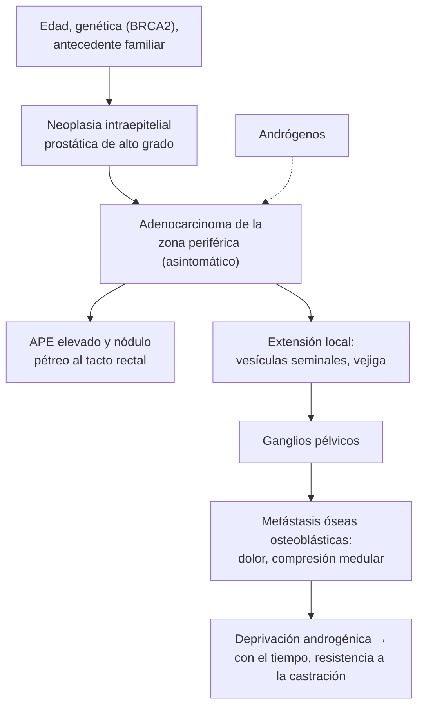

---
tags:
  - Cirugía
  - GES
---

# Cáncer de próstata y tamizaje

**Subespecialidad**
Urología · Oncología

**Guías principales**
Guía EAU-EANM-ESTRO-ESUR-ISUP-SIOG de cáncer de próstata, actualización 2024, parte I: tamizaje, diagnóstico y tratamiento local (*Eur Urol* 2024)

**Otras fuentes**
Ensayo europeo de tamizaje ERSPC, seguimiento a 23 años (*N Engl J Med* 2025) · Revisión Cochrane de tamizaje con APE (2026) · Ensayo PRECISION de biopsia dirigida por RM (*N Engl J Med* 2018) · Tendencias de mortalidad en Chile 1955–2019 (*Rev Med Chil* 2022) · Etapa al diagnóstico en una cohorte chilena (*Ecancermedicalscience* 2026) · Ficha GES 28

**GES**
Sí: **cáncer de próstata en personas de 15 años y más (GES 28)**. Etapificación en **45 días** desde la confirmación y tratamiento primario en **60 días** desde la etapificación.

**EUNACOM**
4.03.1.002 Cáncer de próstata (sospecha, inicial, derivar) · 4.03.3.001 Epidemiología del cáncer de próstata · 4.03.3.005 Tamizaje (screening) de cáncer de próstata

**Revisado**
Octubre 2026

!!! abstract "Resumen en 60 segundos"
    - **El cáncer más frecuente en los hombres chilenos** y una de las principales causas de muerte por cáncer. La mortalidad ajustada **baja** en Chile desde 1996.
    - Es casi siempre un **adenocarcinoma** de la **zona periférica** (se palpa al tacto rectal). En etapas precoces es **asintomático**.
    - **Sospecha**: **APE elevado** para la edad o **tacto rectal** con un **nódulo pétreo**, asimetría o induración.
    - **Tamizaje con APE**: reduce la **mortalidad por cáncer de próstata** (ERSPC: **13 %** menos a 23 años), a costa de **sobrediagnóstico**. Se ofrece como **decisión compartida** a hombres de **50 a 69–70 años** con expectativa de vida de 10–15 años (desde los **45** si hay antecedente familiar o ascendencia africana).
    - **Diagnóstico**: **RM multiparamétrica** antes de la biopsia y **biopsia dirigida** (mejor que la biopsia sistemática sola). La clasificación de riesgo usa el **APE**, el **Gleason/grupo ISUP** y el estadio.
    - **Tratamiento** según el riesgo y la expectativa de vida: **vigilancia activa** (bajo riesgo), **prostatectomía radical** o **radioterapia** (localizado), **deprivación androgénica** ± nuevos antiandrógenos (avanzado). Cubierto por el **GES 28**.

## Definición

- **Cáncer de próstata**: tumor maligno de la próstata; más del **95 %** son **adenocarcinomas acinares**, la mayoría en la **zona periférica**.
- **Antígeno prostático específico (APE)**: glicoproteína producida por el epitelio prostático. **No es específico de cáncer**: sube en la HPB, la prostatitis, la retención urinaria y tras la instrumentación.
- **Tamizaje**: búsqueda del cáncer en hombres **asintomáticos** con el APE (± tacto rectal).
- **Sobrediagnóstico**: detección de cánceres que no habrían dado síntomas ni causado la muerte durante la vida del paciente.

## Epidemiología

### Mundial

- Uno de los **cánceres más frecuentes** en los hombres del mundo; la incidencia sube mucho después de los **50 años**.
- Gran parte de los cánceres detectados por tamizaje son de **bajo riesgo** y crecen lentamente.
- **ERSPC** (162.236 hombres de 55 a 69 años, seguimiento de **23 años**):
    - El tamizaje con APE redujo la **mortalidad por cáncer de próstata** en **13 %** (razón de tasas 0,87).
    - Se evita **1 muerte** por cada **456 hombres invitados** al tamizaje y por cada **12 cánceres diagnosticados**.
    - Aumentó la incidencia en **30 %** (sobrediagnóstico).
- **Revisión Cochrane 2026** (6 ensayos, 789.086 hombres): el tamizaje con APE **probablemente reduce** la mortalidad por cáncer de próstata (unas **2 muertes menos por 1.000** hombres) y **podría** reducir la mortalidad global, con un intervalo de confianza que incluye la ausencia de efecto.

### Chile

!!! chile "Datos nacionales"
    - El cáncer de próstata es el **tumor de mayor incidencia en los hombres** chilenos y una de las principales causas de muerte (López 2022).
    - **Tendencia de la mortalidad** (López 2022; 1955–2019):
        - La tasa **ajustada** subió hasta mediados de los 90 (12,1 % por año entre 1993 y 1996).
        - Desde **1996 baja** a razón de **1,2 % por año**, en todos los grupos de edad, como en los países desarrollados.
    - **Etapa al diagnóstico** (Muñoz-Navarro 2026; beneficiarios de un seguro de cáncer, 2018–2022): **40 %** de los cánceres de próstata se diagnosticaron en **etapa avanzada** (III o IV).
    - **GES 28**: cubre la confirmación, la etapificación (45 días), el tratamiento primario (60 días desde la etapificación), los tratamientos complementarios y el seguimiento.

## Etiología y factores de riesgo

| Factor | Comentario |
|---|---|
| **Edad** | El principal; raro antes de los 50 años |
| **Antecedente familiar** | Padre o hermano con cáncer de próstata, sobre todo diagnosticado antes de los 60 años |
| **Ascendencia africana** | Mayor incidencia y agresividad |
| **Mutaciones germinales** | **BRCA2** (y BRCA1, ATM, genes de reparación del ADN), síndrome de Lynch |
| **Otros** | Obesidad (cáncer más agresivo), dieta occidental; los 5-ARI reducen la incidencia de tumores de bajo grado |

## Fisiopatología

- Se origina en el **epitelio glandular** de la **zona periférica** (por eso se palpa al tacto rectal y **no** da síntomas obstructivos precoces).
- Lesión precursora: **neoplasia intraepitelial prostática** de alto grado.
- Crecimiento **dependiente de andrógenos**: la base de la **deprivación androgénica**. Con el tiempo aparece la **resistencia a la castración**.
- Diseminación: **local** (vesículas seminales, vejiga), **linfática** (ganglios pélvicos) y **hematógena**, sobre todo a **hueso** (metástasis **osteoblásticas** en la columna, la pelvis y las costillas).

*Figura 1. Historia natural del cáncer de próstata. Esquema propio basado en la guía EAU 2024.*

## Clasificación

| Grupo de grado ISUP | Gleason | Agresividad |
|---|---|---|
| **1** | 3 + 3 = 6 | Bajo grado |
| **2** | 3 + 4 = 7 | Intermedio favorable |
| **3** | 4 + 3 = 7 | Intermedio desfavorable |
| **4** | 8 | Alto grado |
| **5** | 9–10 | Alto grado |

| Riesgo (EAU, enfermedad localizada) | Criterios |
|---|---|
| **Bajo** | APE < 10 ng/mL **y** ISUP 1 **y** cT1–cT2a |
| **Intermedio** | APE 10–20 **o** ISUP 2–3 **o** cT2b |
| **Alto** | APE > 20 **o** ISUP 4–5 **o** cT2c |
| **Localmente avanzado** | cT3–cT4 o ganglios positivos (cN+) |

## Clínica

- **Etapa precoz**: **asintomático** (la mayoría se detecta por el APE o el tacto rectal).
- **Etapa local avanzada**: STUI obstructivos, **hematuria**, **hemospermia**, retención urinaria, hidronefrosis (obstrucción ureteral).
- **Enfermedad metastásica**:
    - **Dolor óseo** (columna lumbar, pelvis), **fracturas patológicas**.
    - **Compresión medular**: dolor de espalda, debilidad de las piernas, retención urinaria (**urgencia oncológica**, ver [urgencias oncológicas](../../hematologia/urgencias-oncologicas.md)).
    - Anemia, baja de peso, insuficiencia renal, CID.
- **Tacto rectal**: **nódulo pétreo**, irregular, asimétrico, con pérdida de los límites o fijo.

## Diagnóstico

!!! guia "Tamizaje y diagnóstico (EAU 2024)"
    - **No** hacer tamizaje masivo con APE **sin informar** al paciente de los beneficios y riesgos (sobrediagnóstico y sobretratamiento).
    - **Ofrecer un tamizaje basado en el riesgo**, con decisión compartida, a hombres **bien informados** desde los **50 años**; desde los **45 años** con **antecedente familiar** o **ascendencia africana**; desde los **40 años** con mutación **BRCA2**.
    - No ofrecerlo a hombres con **expectativa de vida menor de 15 años**.
    - Ante un **APE elevado**: **repetirlo** en unas semanas (en el mismo laboratorio, sin infección ni instrumentación reciente) antes de seguir el estudio.
    - Hacer una **RM multiparamétrica** de próstata **antes de la biopsia**: si es sospechosa (PI-RADS ≥ 3), **biopsia dirigida** + sistemática; si es negativa y el riesgo clínico es bajo, se puede **omitir la biopsia** tras conversarlo con el paciente.
    - Biopsia por vía **transperineal** de preferencia (menos infecciones que la transrectal).
    - **Etapificación**: en el riesgo intermedio desfavorable y alto, **imagen** de extensión (TC y cintigrafía ósea, o **PET-PSMA**).

- **Ensayo PRECISION** (2018): la **biopsia dirigida por RM** detectó **más cánceres clínicamente significativos** y **menos insignificantes** que la biopsia sistemática estándar.

## Laboratorio

| Examen | Interpretación |
|---|---|
| **APE total** | No hay un corte perfecto. Valores > **3–4 ng/mL** (o elevados para la edad) llevan a repetir el examen y estudiar. Sube en la **HPB**, la **prostatitis**, la **retención urinaria**, tras una **sonda**, una **biopsia** o la eyaculación reciente |
| **Densidad del APE** (APE / volumen prostático) | > 0,15–0,20 ng/mL/mL aumenta la sospecha |
| **Velocidad del APE** | Un ascenso rápido aumenta la sospecha |
| **Con finasterida o dutasterida** | **Multiplicar el APE por 2** |
| **Creatinina, hemograma, fosfatasa alcalina** | Enfermedad avanzada (obstrucción, metástasis óseas) |
| **Testosterona** | Seguimiento de la deprivación androgénica |
| **Estudio genético germinal** | Enfermedad metastásica, antecedente familiar fuerte |

## Imágenes

| Examen | Uso |
|---|---|
| **RM multiparamétrica de próstata** (PI-RADS) | **Antes de la biopsia**; dirige la biopsia; etapificación local |
| **Ecografía transrectal** | Guía la biopsia; mide el volumen prostático |
| **TC de abdomen y pelvis + cintigrafía ósea** | Etapificación del riesgo intermedio desfavorable y alto |
| **PET-PSMA** | Etapificación más sensible; recaída bioquímica |
| **RM de columna** | **Sospecha de compresión medular** (urgente) |

## Diagnóstico diferencial

| Diagnóstico | Diferencias |
|---|---|
| **Hiperplasia prostática benigna** | Próstata **lisa, elástica**, simétrica; APE levemente elevado proporcional al volumen (ver [HPB](hiperplasia-prostatica-retencion-urinaria-y-prostatitis.md)) |
| **Prostatitis aguda o crónica** | Fiebre, dolor, urocultivo positivo; APE elevado transitoriamente |
| **Cálculos prostáticos** | Crepitación al tacto; imagen |
| **Metástasis óseas de otro origen** | Pulmón, mama, riñón (líticas); en el cáncer de próstata son **osteoblásticas** |
| **Mieloma múltiple** | Lesiones **líticas**, anemia, hipercalcemia, proteína monoclonal (ver [mieloma](../../hematologia/gammapatias-monoclonales-y-mieloma-multiple.md)) |

## Tratamiento

!!! guia "Tratamiento según el riesgo (EAU 2024)"
    - **Riesgo bajo**: **vigilancia activa** (APE, tacto rectal, RM y biopsias periódicas) como opción preferida; tratamiento radical si progresa.
    - **Expectativa de vida corta**: **observación (espera vigilada)** y tratamiento de los síntomas si aparecen.
    - **Riesgo intermedio y alto localizado**: **prostatectomía radical** (con linfadenectomía según el riesgo) o **radioterapia** + **deprivación androgénica** (corta en el intermedio, larga de 2–3 años en el alto).
    - **Localmente avanzado**: radioterapia + deprivación androgénica prolongada, o prostatectomía como parte de un tratamiento multimodal.
    - **Metastásico**: **deprivación androgénica** (agonista o antagonista de la LHRH, u orquiectomía) **siempre combinada** con un **inhibidor de la vía androgénica** (abiraterona, enzalutamida, apalutamida, darolutamida) ± docetaxel. Radioterapia a la próstata en la enfermedad de bajo volumen.
    - **Resistente a la castración**: nuevos agentes hormonales, docetaxel o cabazitaxel, **lutecio-PSMA**, inhibidores de PARP (mutaciones BRCA), ácido zoledrónico o denosumab (prevención de eventos óseos).

- **Efectos adversos del tratamiento local**: **incontinencia urinaria** y **disfunción eréctil** (prostatectomía); **proctitis**, cistitis, disfunción eréctil (radioterapia).
- **Efectos de la deprivación androgénica**: **bochornos**, pérdida de la libido, **osteoporosis**, síndrome metabólico, riesgo cardiovascular, anemia, sarcopenia.
- Al iniciar un **agonista de la LHRH**: **fenómeno de llamarada** (*flare*) por el aumento inicial de testosterona; usar un **antiandrógeno** (bicalutamida) las primeras semanas en la enfermedad metastásica sintomática, o un antagonista (degarelix).

!!! dosis "Fármacos frecuentes (indicados por urología u oncología)"
    | Fármaco | Dosis | Comentario |
    |---|---|---|
    | **Leuprolide** (agonista LHRH) | 22,5 mg IM o SC cada 3 meses (o depósitos de 1 o 6 meses) | Deprivación androgénica; cubrir el *flare* |
    | **Degarelix** (antagonista LHRH) | 240 mg SC de carga, luego 80 mg SC mensual | Sin *flare*; útil en la compresión medular inminente |
    | **Bicalutamida** | 50 mg/día | Cobertura del *flare* (2–4 semanas) |
    | **Abiraterona + prednisona** | 1.000 mg/día + prednisona 5 mg/día | Enfermedad metastásica; controlar la presión, el potasio y las pruebas hepáticas |
    | **Enzalutamida** | 160 mg/día | Enfermedad metastásica; riesgo de convulsiones y caídas |
    | **Denosumab** | 60 mg SC cada 6 meses (osteoporosis por deprivación) o 120 mg mensual (metástasis óseas) | Calcio y vitamina D; riesgo de hipocalcemia y de osteonecrosis mandibular |

!!! alarma "Derivar"
    - **Tacto rectal sospechoso** o **APE elevado confirmado**: urología (**GES 28** al confirmarse).
    - **Dolor de espalda + déficit neurológico** en un paciente con cáncer de próstata: **compresión medular**. Dexametasona, **RM urgente** y radioterapia o neurocirugía.
    - **Retención urinaria** o **hidronefrosis** bilateral con insuficiencia renal.
    - **Hipercalcemia**, anemia grave o CID en la enfermedad avanzada.

## Complicaciones

- **De la enfermedad**: obstrucción urinaria y **hidronefrosis**, **metástasis óseas** (dolor, **fracturas**, **compresión medular**), anemia, CID.
- **De la biopsia**: hematuria, hemospermia, **sepsis** (sobre todo por vía transrectal), retención.
- **De la cirugía**: **incontinencia urinaria**, **disfunción eréctil**, estenosis de la anastomosis.
- **De la radioterapia**: proctitis y cistitis actínicas, hematuria, disfunción eréctil, segundas neoplasias.
- **De la deprivación androgénica**: osteoporosis y fracturas, síndrome metabólico, diabetes, eventos cardiovasculares, deterioro cognitivo, anemia.

## Pronóstico y seguimiento

- **Enfermedad localizada de bajo riesgo**: excelente sobrevida; muchos pacientes **no** necesitan tratamiento radical.
- **Enfermedad metastásica**: la sobrevida mejoró mucho con la combinación de la deprivación androgénica con los nuevos agentes hormonales.
- **Seguimiento** tras el tratamiento radical:
    - **APE** cada 3–6 meses los primeros años y luego anual. Tras la prostatectomía, el APE debe ser **indetectable**; su aumento es una **recaída bioquímica**.
    - Control de los efectos adversos (continencia, función sexual) y, con deprivación androgénica, de la **densidad ósea**, la glicemia, los lípidos y el riesgo cardiovascular.

## Perlas para el internado

!!! perla "Para recordar en la sala"
    - **Nódulo pétreo al tacto rectal = cáncer** hasta demostrar lo contrario, aunque el APE sea normal.
    - **Un APE alto se repite** antes de seguir estudiando, y nunca se mide durante una prostatitis, una retención o tras una sonda.
    - **El tamizaje con APE es una decisión compartida**: reduce la mortalidad por cáncer de próstata, pero con sobrediagnóstico.
    - **RM antes de la biopsia.**
    - **Bajo riesgo = vigilancia activa**, no siempre cirugía.
    - **Dolor de espalda + debilidad de piernas en un hombre con cáncer de próstata = compresión medular**: urgencia.
    - **Al iniciar un agonista LHRH en metástasis sintomáticas**, cubrir el *flare* con bicalutamida (o usar degarelix).
    - **Deprivación androgénica = osteoporosis**: calcio, vitamina D, densitometría y antirresortivos.

## Preguntas de repaso

??? repaso "1. Hombre de 58 años, sin síntomas, pregunta si debe hacerse el APE. Su padre tuvo cáncer de próstata a los 62 años. ¿Qué le responde?"
    - El tamizaje con APE **reduce la mortalidad por cáncer de próstata** (ERSPC: 13 % menos a 23 años), pero tiene riesgo de **sobrediagnóstico** y de tratamientos con efectos adversos.
    - Con su **antecedente familiar** y su edad, es razonable **ofrecerlo** tras una **decisión compartida**, con tacto rectal.
    - Si el APE sale alto: repetirlo y, si se confirma, **RM** antes de la biopsia.

??? repaso "2. Hombre de 65 años con un APE de 7,8 ng/mL (repetido: 7,5) y tacto rectal con un nódulo duro en el lóbulo derecho. ¿Cuál es el estudio?"
    - **Sospecha de cáncer de próstata**: derivar a urología.
    - **RM multiparamétrica** de próstata y **biopsia dirigida + sistemática** (idealmente transperineal).
    - Con la confirmación, **GES 28**: etapificación según el riesgo (TC y cintigrafía ósea o PET-PSMA) y tratamiento.

??? repaso "3. La biopsia muestra un adenocarcinoma ISUP 1 (Gleason 3+3) en 2 de 12 cilindros, APE 6, cT1c. Tiene 62 años y está sano. ¿Qué tratamiento corresponde?"
    - **Cáncer de próstata de bajo riesgo**.
    - **Vigilancia activa** (opción preferida): APE, tacto rectal, RM y biopsias periódicas, con tratamiento radical si progresa.
    - Evita los efectos adversos (incontinencia, disfunción eréctil) de un tratamiento que muchas veces no necesitará.

??? repaso "4. Hombre de 74 años con cáncer de próstata metastásico conocido consulta por dolor lumbar de 2 semanas que empeoró, con debilidad de ambas piernas y retención urinaria desde ayer. ¿Qué hace?"
    - **Compresión medular metastásica**: urgencia oncológica.
    - **Dexametasona** IV, **RM de columna completa urgente** y evaluación por **radioterapia** y **neurocirugía**.
    - Sonda Foley; iniciar deprivación androgénica sin *flare* (**degarelix**, u orquiectomía) si no la recibía.

??? repaso "5. Paciente en tratamiento con leuprolide por cáncer de próstata. ¿Qué efectos adversos debe vigilar y prevenir?"
    - **Osteoporosis** y fracturas: densitometría, **calcio**, **vitamina D**, ejercicio y antirresortivos (denosumab o bifosfonato) si corresponde.
    - **Síndrome metabólico**, diabetes y **riesgo cardiovascular**: glicemia, lípidos y presión.
    - **Bochornos**, pérdida de la libido, disfunción eréctil, **anemia**, sarcopenia, ánimo.

## Referencias

1. Cornford P, van den Bergh RCN, Briers E, et al. EAU-EANM-ESTRO-ESUR-ISUP-SIOG Guidelines on Prostate Cancer-2024 Update. Part I: Screening, Diagnosis, and Local Treatment with Curative Intent. *Eur Urol.* 2024;86(2):148–163. doi:[10.1016/j.eururo.2024.03.027](https://doi.org/10.1016/j.eururo.2024.03.027)
2. Roobol MJ, de Vos II, Månsson M, et al. European Study of Prostate Cancer Screening - 23-Year Follow-up. *N Engl J Med.* 2025;393(17):1669–1680. doi:[10.1056/NEJMoa2503223](https://doi.org/10.1056/NEJMoa2503223)
3. Franco JV, Hwang EC, Jung JH, et al. Prostate-specific antigen (PSA) test for prostate cancer screening. *Cochrane Database Syst Rev.* 2026;(5):CD004720. doi:[10.1002/14651858.CD004720.pub4](https://doi.org/10.1002/14651858.CD004720.pub4)
4. Kasivisvanathan V, Rannikko AS, Borghi M, et al. MRI-Targeted or Standard Biopsy for Prostate-Cancer Diagnosis. *N Engl J Med.* 2018;378(19):1767–1777. doi:[10.1056/NEJMoa1801993](https://doi.org/10.1056/NEJMoa1801993)
5. López JF, Fernández MI, Coz F. Mortalidad por cáncer de próstata en Chile: tendencias del período 1955-2019. *Rev Med Chil.* 2022;150(10):1370–1379. doi:[10.4067/S0034-98872022001001370](https://doi.org/10.4067/S0034-98872022001001370)
6. Muñoz-Navarro S, Caglevic C, Sapunar J. Extent of cancer at the time of diagnosis in older adults: a cohort of a Chilean cancer insurance program (2018–2022). *Ecancermedicalscience.* 2026;20:2114. doi:[10.3332/ecancer.2026.2114](https://doi.org/10.3332/ecancer.2026.2114)
7. Superintendencia de Salud. Problema de salud 28: Cáncer de próstata en personas de 15 años y más. [Superintendencia de Salud](https://www.superdesalud.gob.cl/orientacion-en-salud/cancer-de-prostata-en-personas-de-15-anos-y-mas/)
