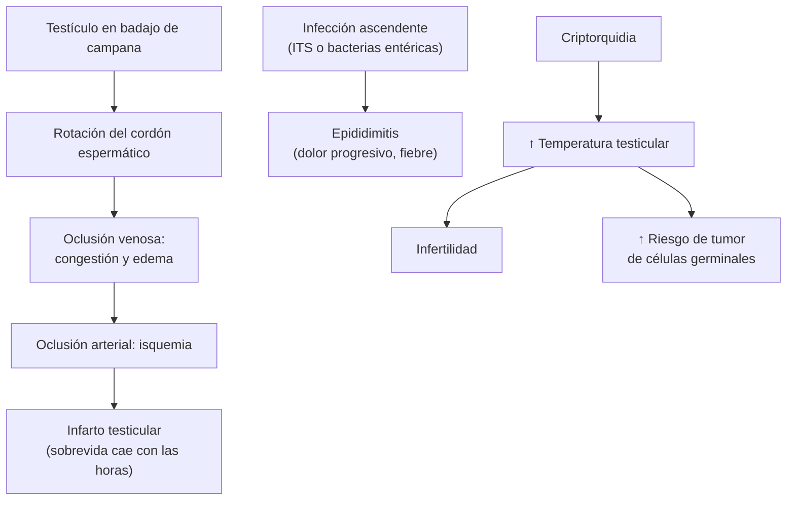

---
tags:
  - Cirugía
  - Urgencia
  - GES
---

# Escroto agudo y patología testicular

**Subespecialidad**
Urología · Urgencia

**Guías principales**
Guía EAU de cáncer de testículo, resumen 2026 (*Eur Urol*) · Guía EAU de salud sexual y reproductiva masculina: infertilidad, actualización 2025 (*Eur Urol*) · Guía CDC 2021 de infecciones de transmisión sexual (epididimitis)

**Otras fuentes**
Revisión sistemática del tiempo de sobrevida testicular tras la torsión (*Pediatr Emerg Care* 2019) · Puntaje TWIST (*J Urol* 2013) · Cohorte chilena de tumores germinales (*JCO Glob Oncol* 2026) · Estudio latinoamericano de edad de la orquidopexia (*J Pediatr Urol* 2026)

**GES**
Sí: **cáncer de testículo en personas de 15 años y más (GES 16)**, con acceso desde la **sospecha** médica.

**EUNACOM**
4.03.2.007 Torsión testicular · 4.03.1.007 Epididimitis · 4.03.1.011 Hidrocele · 4.03.1.028 Varicocele · 4.03.1.020 Quistes del epidídimo · 4.03.1.004 Criptorquidia (diagnóstico específico) · 4.03.1.024 Tumor testicular · 4.03.1.017 Infertilidad masculina (sospecha) · 4.03.3.003 Epidemiología del cáncer testicular

**Revisado**
Octubre 2026

!!! abstract "Resumen en 60 segundos"
    - **Escroto agudo = torsión testicular hasta demostrar lo contrario**, sobre todo en **adolescentes**. Dolor testicular **brusco** e intenso, con náuseas y vómitos, testículo **alto y horizontal**, **reflejo cremasteriano ausente**.
        - **Cirugía urgente** (exploración y orquidopexia) **sin esperar la ecografía** si la sospecha es alta. La sobrevida del testículo cae con las horas: **97 %** en las primeras 6 h y **42 %** a las 19–24 h.
    - **Epididimitis**: dolor **progresivo**, fiebre, disuria, **signo de Prehn** positivo (alivio al elevar el testículo). Menores de 35 años: **clamidia y gonococo**; mayores: **bacterias entéricas**.
    - **Hidrocele**: aumento de volumen indoloro que **transilumina**. **Varicocele**: "**bolsa de gusanos**", casi siempre **izquierdo**; uno **derecho o que no se vacía al acostarse** obliga a buscar una **masa retroperitoneal**.
    - **Tumor testicular**: **masa testicular dura e indolora** en un hombre de **15 a 35 años**. **Ecografía**, **marcadores** (AFP, β-hCG, LDH) y **orquiectomía radical por vía inguinal**. Nunca biopsiar por el escroto. Cubierto por el **GES 16**.
    - **Criptorquidia**: **orquidopexia entre los 6 y 18 meses** (más riesgo de **infertilidad** y **cáncer**).
    - **Infertilidad masculina**: **espermiograma** (2 muestras), examen físico (varicocele, tamaño testicular) y estudio de la pareja en paralelo.

## Definición

- **Escroto agudo**: dolor escrotal agudo, con o sin aumento de volumen, que requiere evaluación urgente.
- **Torsión testicular**: rotación del **cordón espermático** que interrumpe la irrigación del testículo. La forma más frecuente es la **intravaginal** (adolescentes); la **extravaginal** ocurre en recién nacidos.
- **Torsión de apéndices testiculares** (hidátide de Morgagni): torsión de un resto embrionario; causa frecuente de escroto agudo en niños prepúberes.
- **Epididimitis**: inflamación del epidídimo, casi siempre **infecciosa**; **orquiepididimitis** si compromete el testículo.
- **Hidrocele**: acumulación de **líquido** entre las capas de la **túnica vaginal**.
- **Varicocele**: dilatación del **plexo venoso pampiniforme**.
- **Quiste de epidídimo (espermatocele)**: quiste lleno de líquido en el epidídimo, separado del testículo.
- **Criptorquidia**: testículo que **no descendió** al escroto (intraabdominal, inguinal o ectópico). El **testículo retráctil** baja con la tracción y se queda abajo: no es criptorquidia.
- **Tumor testicular**: casi siempre **tumor de células germinales** (**seminoma** o **no seminoma**).
- **Infertilidad**: imposibilidad de lograr un embarazo tras **12 meses** de relaciones sexuales regulares sin protección.

## Epidemiología

### Mundial

- **Torsión testicular**: peak en la **adolescencia** (12–18 años) y en el período neonatal.
- **Epididimitis**: la causa más frecuente de dolor escrotal en **adultos**.
- **Criptorquidia**: la anomalía urogenital más frecuente en los niños varones; más común en **prematuros**.
- **Varicocele**: frecuente en la población masculina general y mucho más en los hombres con infertilidad; en **90 %** de los casos es **izquierdo** (drenaje de la vena gonadal izquierda a la renal en ángulo recto).
- **Cáncer de testículo**: el **tumor sólido más frecuente en hombres jóvenes** (15–35 años). Es raro en números absolutos, pero tiene **altísima curabilidad**, incluso con metástasis.

### Chile

!!! chile "Datos nacionales"
    - **Cáncer de testículo**: está cubierto por el **GES 16** (personas de 15 años y más), con acceso desde la **sospecha**.
    - **Cohorte chilena** (Ríos-Correa 2026; **628** pacientes con tumores germinales en dos centros):
        - Sobrevida global a 5 años de **98,8 %** en el **seminoma estadio I** y de **98,0 %** en el **no seminoma estadio I**, similar a la del resto del mundo.
        - En la **enfermedad avanzada**, los resultados fueron **peores** que en las cohortes internacionales. Los autores lo atribuyen a la falta de centralización de la atención.
        - En Latinoamérica, incluido Chile, la mortalidad por cáncer testicular es más alta que en otras regiones.
    - **Criptorquidia en Latinoamérica** (Oliveros-Rivero 2026; 4.481 niños de 14 países): solo el **18 %** se operó antes de los **18 meses**, como recomiendan las guías. La mediana de edad fue de **50 meses**, sobre todo por **derivación tardía**.

## Etiología y factores de riesgo

| Enfermedad | Causa y factores de riesgo |
|---|---|
| **Torsión testicular** | Anomalía en **"badajo de campana"**: el testículo queda libre dentro de la túnica vaginal y gira. Desencadenantes: frío, trauma, ejercicio, sueño (contracción del cremáster) |
| **Epididimitis** | **< 35 años o con riesgo sexual**: *Chlamydia trachomatis*, *Neisseria gonorrhoeae*. **> 35 años**, sexo anal insertivo o con patología urinaria: **bacterias entéricas** (*E. coli*). Otras: TBC, brucelosis, parotiditis (orquitis), amiodarona |
| **Hidrocele** | Niños: **conducto peritoneovaginal** permeable (comunicante). Adultos: idiopático o **secundario** a epididimitis, trauma, **tumor**, torsión |
| **Varicocele** | Incompetencia de las válvulas de la vena gonadal; anatomía de la vena gonadal izquierda. **Secundario**: compresión por un **tumor renal** o retroperitoneal |
| **Criptorquidia** | Prematurez, bajo peso al nacer, antecedente familiar, alteraciones hormonales |
| **Tumor testicular** | **Criptorquidia** (aun corregida), **antecedente personal** o **familiar**, infertilidad, microlitiasis testicular con otros factores de riesgo, VIH |
| **Infertilidad masculina** | Varicocele, criptorquidia, infecciones, alteraciones genéticas (Klinefelter, microdeleciones del cromosoma Y), obstrucción (vasectomía, fibrosis quística), fármacos (**testosterona exógena**, anabólicos), tabaco, calor, quimioterapia |

## Fisiopatología

- **Torsión**: la rotación del cordón **ocluye primero las venas** (congestión y edema) y luego las **arterias** → **isquemia** e **infarto** del testículo. El daño depende del **tiempo** y del grado de rotación.
- **Epididimitis**: infección ascendente desde la uretra o la vejiga por el conducto deferente → inflamación del epidídimo (y del testículo).
- **Varicocele**: el reflujo venoso aumenta la **temperatura** escrotal y el estrés oxidativo → alteración de la **espermatogénesis**.
- **Criptorquidia**: el testículo fuera del escroto está a mayor temperatura → daño de las células germinales (infertilidad) y mayor riesgo de **tumor**.
- **Tumor de células germinales**: deriva de la **neoplasia de células germinales in situ**; produce **marcadores** (**β-hCG** en el coriocarcinoma y algunos seminomas; **AFP** en el tumor del saco vitelino y otros no seminomas; nunca AFP en el seminoma puro).

*Figura 1. Fisiopatología de la torsión testicular, la epididimitis y las consecuencias de la criptorquidia. Esquema propio basado en las guías EAU.*

## Clasificación

| Tumores testiculares | Características |
|---|---|
| **Seminoma** | Más frecuente; edad algo mayor (30–40 años); **muy radiosensible y quimiosensible**; **AFP normal** |
| **No seminoma** | Carcinoma embrionario, tumor del saco vitelino (**AFP**), coriocarcinoma (**β-hCG** muy alta), teratoma; más joven; puede tener AFP elevada |
| **No germinales** | Tumores de células de Leydig y Sertoli (pueden producir hormonas), linfoma testicular (adultos mayores) |

| Varicocele | Grado |
|---|---|
| **Subclínico** | Solo en la ecografía |
| **Grado I** | Palpable solo con **Valsalva** |
| **Grado II** | Palpable sin Valsalva |
| **Grado III** | **Visible** a simple vista |

## Clínica

| Hallazgo | Torsión testicular | Epididimitis | Torsión de apéndice testicular |
|---|---|---|---|
| **Edad** | Adolescente (y neonato) | Adulto sexualmente activo o adulto mayor | Niño prepúber (7–12 años) |
| **Inicio del dolor** | **Brusco**, intenso, a veces nocturno | **Progresivo** (horas a días) | Brusco o gradual, localizado en el polo superior |
| **Náuseas y vómitos** | **Frecuentes** | Raros | Raros |
| **Fiebre, disuria** | Rara | **Frecuente** | No |
| **Posición del testículo** | **Alto y horizontal** | Normal | Normal |
| **Reflejo cremasteriano** | **Ausente** | Presente | Presente |
| **Signo de Prehn** (alivio al elevar) | Negativo | **Positivo** | — |
| **Otros** | — | Epidídimo engrosado, uretritis | **"Punto azul"** en el polo superior |

- **Hidrocele**: aumento de volumen **indoloro**, **liso**, que **transilumina**; el testículo puede no palparse. El comunicante (niño) **cambia de tamaño** durante el día.
- **Varicocele**: "**bolsa de gusanos**" sobre el testículo izquierdo, que **aumenta de pie y con Valsalva** y **se vacía al acostarse**. A veces dolor sordo; puede haber **testículo más pequeño** e infertilidad.
- **Quiste de epidídimo**: nódulo **separado del testículo**, liso, que transilumina.
- **Criptorquidia**: **bolsa escrotal vacía**; el testículo puede palparse en el canal inguinal o no palparse (intraabdominal).
- **Tumor testicular**:
    - **Masa testicular dura, indolora**, a veces con sensación de peso; puede debutar con un hidrocele reactivo.
    - **Ginecomastia** (β-hCG), dolor lumbar (adenopatías retroperitoneales), tos o disnea (metástasis pulmonares).
- **Infertilidad masculina**: generalmente asintomática; buscar varicocele, testículos pequeños, ausencia de deferentes, signos de hipogonadismo.

## Diagnóstico

!!! guia "Claves diagnósticas (EAU 2025 y 2026)"
    - **Torsión**: diagnóstico **clínico**. Si la sospecha es **alta**, **exploración quirúrgica inmediata**; la **ecografía Doppler** no debe retrasar la cirugía. Puntajes como el **TWIST** (aumento de volumen, testículo duro, reflejo cremasteriano ausente, náuseas o vómitos, testículo alto) ayudan a estratificar.
    - **Masa testicular**: **ecografía testicular** bilateral (incluso si el examen es evidente); **marcadores séricos** (**AFP**, **β-hCG** y **LDH**) **antes y después** de la orquiectomía; **TC de tórax, abdomen y pelvis** para la etapificación.
    - **Biopsia transescrotal: no**. La confirmación es la **orquiectomía radical por vía inguinal**.
    - **Infertilidad**: anamnesis, examen físico, **al menos un espermiograma** según los criterios de la OMS (repetir si es alterado), hormonas (FSH, LH, testosterona) si el espermiograma es anormal, y estudio genético en la azoospermia o la oligospermia grave.
    - **Varicocele**: diagnóstico **clínico**; la ecografía Doppler confirma los dudosos.

## Laboratorio

| Examen | Uso |
|---|---|
| **Orina completa y urocultivo** | Epididimitis por bacterias entéricas |
| **PCR para clamidia y gonococo** (orina de primer chorro o hisopado uretral) | Epididimitis en menores de 35 años o con riesgo sexual |
| **VIH y VDRL** | Si hay ITS |
| **AFP, β-hCG, LDH** | **Masa testicular**: diagnóstico, pronóstico y seguimiento |
| **Espermiograma** | Infertilidad, después del tratamiento del varicocele |
| **FSH, LH, testosterona** | Infertilidad con espermiograma alterado, testículos pequeños o hipogonadismo |

## Imágenes

| Examen | Hallazgos |
|---|---|
| **Ecografía Doppler testicular** | **Torsión**: flujo **ausente o disminuido**, signo del **remolino** del cordón. **Epididimitis**: epidídimo engrosado con **flujo aumentado**. **Tumor**: masa **hipoecogénica** intratesticular. Hidrocele, quistes, varicocele (venas > 3 mm con reflujo) |
| **TC de tórax, abdomen y pelvis** | Etapificación del cáncer de testículo (adenopatías retroperitoneales, metástasis pulmonares) |
| **Ecografía o TC abdominal** | **Varicocele derecho, unilateral derecho o que no se vacía al acostarse**: buscar una **masa renal o retroperitoneal** |
| **Ecografía inguinal y laparoscopía** | Testículo no palpable (la laparoscopía es diagnóstica y terapéutica) |

## Diagnóstico diferencial

| Cuadro | Diagnósticos |
|---|---|
| **Escroto agudo** | **Torsión testicular**, torsión de apéndice, **epididimitis**, orquitis (parotiditis), **hernia inguinal atascada**, trauma testicular, tumor con hemorragia, púrpura de Schönlein-Henoch, edema escrotal idiopático, **gangrena de Fournier** |
| **Masa escrotal indolora** | **Tumor testicular** (intratesticular), hidrocele, espermatocele, varicocele, hernia inguinoescrotal, epididimitis crónica (TBC) |
| **Dolor referido al testículo** | **Cólico renal**, aneurisma de la aorta abdominal, apendicitis retrocecal, radiculopatía (ver [cólico renal](../../nefrologia/urolitiasis-y-colico-renal.md)) |

## Tratamiento

### Torsión testicular

- **Cirugía urgente**: **exploración escrotal**, **destorsión** y **orquidopexia bilateral** (el otro testículo tiene la misma anomalía). **Orquiectomía** si el testículo no es viable.
- **Destorsión manual** (rotar "abriendo el libro", de medial a lateral) solo como **medida transitoria** mientras se prepara el pabellón; **no reemplaza** la cirugía.
- La sobrevida del testículo depende del tiempo (Mellick 2019): **97 %** en 0–6 h, **79 %** en 7–12 h, **61 %** en 13–18 h, **42 %** en 19–24 h y **24 %** en 25–48 h. **Operar aunque hayan pasado muchas horas**.

### Torsión de apéndice testicular

- **Manejo conservador**: analgesia (AINE), reposo; se resuelve en días. Explorar si no se puede descartar una torsión testicular.

### Epididimitis (CDC 2021)

- **Reposo**, **elevación escrotal**, frío local, **AINE**.
- **Antibióticos** según la causa probable:
    - **Riesgo de ITS** (clamidia y gonococo): **ceftriaxona** IM + **doxiciclina**.
    - **Bacterias entéricas** (mayores de 35 años o con patología urinaria): **levofloxacino**.
    - **Sexo anal insertivo**: ceftriaxona + levofloxacino.
- **Tratar a las parejas** si es una ITS. Reevaluar en **72 h** si no mejora (absceso, infarto, tumor).

### Hidrocele

- **Niños**: la mayoría se resuelve **antes de los 1–2 años**. Operar si persiste, es comunicante o se asocia a una hernia.
- **Adultos**: **ecografía** para descartar un tumor. **Hidrocelectomía** si es sintomático o grande. La punción-aspiración tiene muchas recidivas.

### Varicocele

- **Reparación** (microcirugía subinguinal o embolización) si hay **infertilidad** con varicocele **palpable** y espermiograma alterado, **dolor** que no cede, o en **adolescentes** con **disminución del tamaño testicular**.
- No se tratan los subclínicos.

### Quiste de epidídimo

- **Observación**; extirpar si es grande o sintomático (puede afectar la fertilidad).

### Criptorquidia

- **Orquidopexia** entre los **6 y 18 meses** de edad (EAU).
- No se recomienda el tratamiento hormonal de rutina.
- Testículo **no palpable**: laparoscopía.
- **Criptorquidia bilateral no palpable** en un recién nacido: estudiar un **trastorno del desarrollo sexual** (hiperplasia suprarrenal congénita) de inmediato.
- Seguimiento a largo plazo y **autoexamen** testicular desde la adolescencia.

### Tumor testicular (EAU 2026, GES 16)

- **Orquiectomía radical por vía inguinal** (con ligadura alta del cordón).
- Ofrecer **criopreservación de espermatozoides** antes del tratamiento.
- Después, según la histología y el estadio: **vigilancia activa** (estadio I), **quimioterapia** (BEP: bleomicina, etopósido, cisplatino), **radioterapia** (seminoma) o **cirugía** de masas residuales.
- **Alta curabilidad**, incluso con metástasis.

### Infertilidad masculina (EAU 2025)

- Evaluar **siempre a ambos miembros de la pareja**.
- Tratar las causas corregibles: **varicocele** clínico con espermiograma alterado, **suspender la testosterona exógena** y los anabólicos, tratar las infecciones y el hipogonadismo hipogonadotrópico.
- Derivar a **medicina reproductiva** (técnicas de reproducción asistida) según el caso.
- Aconsejar sobre los riesgos de salud asociados a un espermiograma alterado.

!!! dosis "Antibióticos de la epididimitis en el adulto (CDC 2021)"
    | Situación | Esquema |
    |---|---|
    | **Probable clamidia o gonococo** | **Ceftriaxona 500 mg IM** (1 g si pesa ≥ 150 kg) dosis única **+ doxiciclina 100 mg VO cada 12 h por 10 días** |
    | **Probable bacteria entérica** (sin riesgo de gonococo) | **Levofloxacino 500 mg VO cada 24 h por 10 días** |
    | **Riesgo de ITS y de bacterias entéricas** (sexo anal insertivo) | **Ceftriaxona 500 mg IM** dosis única **+ levofloxacino 500 mg VO cada 24 h por 10 días** |
    | **Analgesia** | Ibuprofeno 400–600 mg cada 8 h, elevación escrotal, frío local |

!!! alarma "Derivar de urgencia"
    - **Dolor testicular brusco**, sobre todo en un adolescente, con testículo alto u horizontal, reflejo cremasteriano ausente o vómitos: **torsión** → urólogo y pabellón **de inmediato**, sin esperar la ecografía si la sospecha es alta.
    - **Masa testicular dura**: ecografía y derivación **GES 16** a urología (sospecha de cáncer).
    - **Varicocele de aparición brusca**, **derecho** o que no se vacía al acostarse: estudio de una masa retroperitoneal.
    - Dolor y eritema escrotal con **necrosis o crepitación**: gangrena de Fournier.

## Complicaciones

- **Torsión**: **pérdida del testículo**, atrofia, disminución de la fertilidad.
- **Epididimitis**: **absceso**, infarto testicular, epididimitis crónica, **infertilidad** (obstrucción).
- **Hidrocele y varicocele**: recidiva después de la cirugía, hidrocele posoperatorio (varicocelectomía).
- **Criptorquidia**: **infertilidad**, **cáncer testicular**, torsión, hernia inguinal asociada.
- **Tumor testicular**: metástasis retroperitoneales y pulmonares; efectos tardíos del tratamiento (infertilidad, toxicidad cardiovascular y renal del cisplatino, segundas neoplasias).

## Pronóstico y seguimiento

- **Torsión**: excelente si se opera en las primeras horas; la orquidopexia bilateral previene la recurrencia.
- **Epididimitis**: mejora en días con el tratamiento; el aumento de volumen puede tardar semanas.
- **Cáncer de testículo**: sobrevida a 5 años de **casi 99 %** en el estadio I (también en Chile). Seguimiento con **marcadores**, examen y **TC** según el protocolo del especialista; autoexamen del testículo contralateral.
- **Criptorquidia**: control urológico y autoexamen testicular desde la adolescencia.
- **Infertilidad tratada**: espermiograma de control **3–6 meses** después de reparar un varicocele.

## Perlas para el internado

!!! perla "Para recordar en la sala"
    - **Escroto agudo en un adolescente = torsión hasta demostrar lo contrario.** El tiempo es testículo.
    - **Reflejo cremasteriano ausente + testículo alto y horizontal + vómitos** = torsión.
    - **No esperar la ecografía** si la sospecha de torsión es alta: al pabellón.
    - **Prehn positivo, fiebre y disuria** orientan a epididimitis, pero no descartan la torsión.
    - **Masa testicular dura e indolora en un hombre joven = cáncer** hasta demostrar lo contrario: ecografía, marcadores y orquiectomía **inguinal** (GES 16).
    - **Nunca biopsiar un testículo por el escroto.**
    - **Varicocele derecho o que no se vacía al acostarse** = buscar un tumor renal o retroperitoneal.
    - **Hidrocele en un adulto**: ecografía para descartar un tumor detrás.
    - **Testosterona exógena** produce infertilidad: preguntarla siempre.

## Preguntas de repaso

??? repaso "1. Adolescente de 15 años despierta con dolor testicular izquierdo intenso de 3 horas y vómitos. El testículo está alto, horizontal y muy doloroso; el reflejo cremasteriano está ausente. ¿Qué hace?"
    - **Torsión testicular** (cuadro clásico).
    - **Exploración quirúrgica urgente** con destorsión y **orquidopexia bilateral**, sin esperar la ecografía.
    - Mientras se prepara el pabellón, puede intentarse la destorsión manual, que no reemplaza la cirugía.

??? repaso "2. Hombre de 24 años con dolor testicular derecho progresivo de 3 días, fiebre de 38 °C y disuria. Tiene parejas sexuales nuevas. El epidídimo está engrosado y doloroso; el dolor cede al elevar el testículo. ¿Qué tiene y cómo lo trata?"
    - **Epididimitis**, probablemente por **clamidia o gonococo**.
    - PCR para clamidia y gonococo, orina completa, VIH y VDRL.
    - **Ceftriaxona 500 mg IM** dosis única **+ doxiciclina 100 mg cada 12 h por 10 días**, AINE y elevación escrotal; tratar a las parejas.
    - Si hay duda con una torsión: ecografía Doppler urgente.

??? repaso "3. Hombre de 28 años nota un aumento de volumen duro e indoloro en el testículo izquierdo. ¿Qué estudia y cuál es la conducta?"
    - **Sospecha de cáncer de testículo** (GES 16).
    - **Ecografía testicular**, **AFP, β-hCG y LDH**, TC de tórax, abdomen y pelvis.
    - **Orquiectomía radical por vía inguinal** (no biopsia transescrotal), ofreciendo antes la criopreservación de espermatozoides.

??? repaso "4. Hombre de 55 años con un varicocele derecho de aparición reciente, que no disminuye al acostarse. ¿Qué le preocupa?"
    - Un varicocele **derecho**, **reciente** y que **no se vacía** en decúbito sugiere una **compresión venosa** por una **masa retroperitoneal o renal** (tumor renal con trombo en la vena cava).
    - **Ecografía y TC abdominal**.

??? repaso "5. Lactante de 8 meses con el testículo derecho no palpable en el escroto ni en el canal inguinal. ¿Qué hace?"
    - **Criptorquidia con testículo no palpable**.
    - Derivar a cirugía infantil: **laparoscopía** diagnóstica y terapéutica, con **orquidopexia** idealmente **antes de los 18 meses**.
    - Si fuera **bilateral no palpable**, estudiar de inmediato un trastorno del desarrollo sexual.

??? repaso "6. Pareja que no logra un embarazo tras 14 meses. Él tiene un varicocele izquierdo grado III y su espermiograma muestra oligoastenozoospermia. ¿Qué le ofrece?"
    - **Infertilidad masculina** con **varicocele clínico** y espermiograma alterado.
    - Confirmar con un **segundo espermiograma**, hormonas y estudio de la pareja en paralelo.
    - **Reparación del varicocele** (microcirugía o embolización) puede mejorar los parámetros seminales; derivar a urología y a medicina reproductiva según la edad de la pareja.

## Referencias

1. Patrikidou A, Cazzaniga W, Oing C, et al. European Association of Urology Guidelines on Testicular Cancer: Summary of the 2026 Guidelines. *Eur Urol.* 2026;90(2):163–174. doi:[10.1016/j.eururo.2026.03.021](https://doi.org/10.1016/j.eururo.2026.03.021)
2. Minhas S, Boeri L, Capogrosso P, et al. European Association of Urology Guidelines on Male Sexual and Reproductive Health: 2025 Update on Male Infertility. *Eur Urol.* 2025;87(5):601–616. doi:[10.1016/j.eururo.2025.02.026](https://doi.org/10.1016/j.eururo.2025.02.026)
3. Workowski KA, Bachmann LH, Chan PA, et al. Sexually Transmitted Infections Treatment Guidelines, 2021. *MMWR Recomm Rep.* 2021;70(4):1–187. doi:[10.15585/mmwr.rr7004a1](https://doi.org/10.15585/mmwr.rr7004a1)
4. Mellick LB, Sinex JE, Gibson RW, et al. A Systematic Review of Testicle Survival Time After a Torsion Event. *Pediatr Emerg Care.* 2019;35(12):821–825. doi:[10.1097/PEC.0000000000001287](https://doi.org/10.1097/PEC.0000000000001287)
5. Barbosa JA, Tiseo BC, Barayan GA, et al. Development and initial validation of a scoring system to diagnose testicular torsion in children. *J Urol.* 2013;189(5):1859–1864. doi:[10.1016/j.juro.2012.10.056](https://doi.org/10.1016/j.juro.2012.10.056)
6. Ríos-Correa V, Bennett-Laso J, Guerra-Pérez D, et al. Prognostic Factors for Relapse and Mortality Risk in Chilean Patients With Testicular Cancer: A Retrospective Cohort Study. *JCO Glob Oncol.* 2026;12:e2600061. doi:[10.1200/GO-26-00061](https://doi.org/10.1200/GO-26-00061)
7. Oliveros-Rivero J, Cabrera-Johnson M, Gonzalez ST, et al. Timing of orchiopexy in children with congenital undescended testis in Latin America: A multicenter retrospective study. *J Pediatr Urol.* 2026;22(6):106201. doi:[10.1016/j.jpurol.2026.106201](https://doi.org/10.1016/j.jpurol.2026.106201)
8. Superintendencia de Salud. Problema de salud 16: Cáncer de testículo en personas de 15 años y más. [Superintendencia de Salud](https://www.superdesalud.gob.cl/orientacion-en-salud/cancer-de-testiculo-en-personas-de-15-anos-y-mas/)
