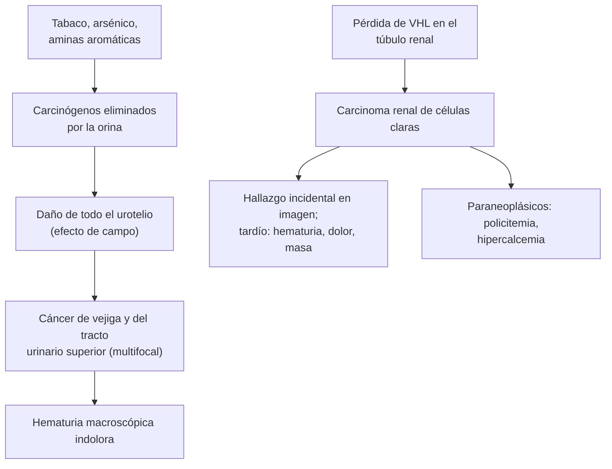

---
tags:
  - Cirugía
  - GES
  - Urgencia
---

# Hematuria, cáncer de vejiga, tumor renal y tuberculosis urogenital

**Subespecialidad**
Urología · Oncología · Nefrología

**Guías principales**
Guía AUA/SUFU de microhematuria, actualización 2025 (*J Urol*) · Guía EAU de cáncer de vejiga no músculo invasor 2024 (*Eur Urol*) · Guía EAU de carcinoma de células renales, actualización 2025 (*Eur Urol*) · Guía EAU de carcinoma urotelial del tracto urinario superior 2025 (*Eur Urol*)

**Otras fuentes**
Estudios chilenos sobre arsénico y cáncer urotelial en Antofagasta (*Urol Oncol* 2020) · Fichas GES 72 y 83

**GES**
Sí: **cáncer vesical en personas de 15 años y más (GES 72)** y **cáncer renal en personas de 15 años y más (GES 83)**.

**EUNACOM**
4.03.1.010 Hematuria · 4.03.2.002 Hematuria masiva · 4.03.1.016 Infección urinaria específica (diagnóstico específico) · 4.03.1.003 Cáncer de vejiga y urotelio · 4.03.1.022 Tumor renal (sospecha)

**Revisado**
Octubre 2026

!!! abstract "Resumen en 60 segundos"
    - **Hematuria macroscópica** sin causa evidente en un adulto = **cáncer urotelial** hasta demostrar lo contrario: **cistoscopía** + **uro-TC**.
    - **Microhematuria**: **3 o más glóbulos rojos por campo** en un sedimento bien tomado. Se estudia según el **riesgo** (edad, sexo, **tabaco**, magnitud).
    - **Primero descartar**: ITU, menstruación, ejercicio intenso, trauma y causas **glomerulares** (glóbulos rojos dismórficos, cilindros hemáticos, proteinuria: derivar a nefrología).
    - **Los anticoagulantes no explican una hematuria**: siempre se estudia.
    - **Cáncer de vejiga**: **fumador** con **hematuria indolora**. En Chile, el **arsénico** del agua de **Antofagasta** aumentó el riesgo (tumores de alto grado y del tracto urinario superior). **RTU vesical** para el diagnóstico y el tratamiento (GES 72).
    - **Tumor renal**: hoy casi siempre un **hallazgo incidental** en una ecografía o TC. La tríada clásica (hematuria, dolor en el flanco, masa) es rara y tardía. **Nefrectomía parcial** si es posible (GES 83).
    - **Hematuria masiva con coágulos**: **sonda de tres vías** e **irrigación** continua, corregir la coagulación y transfundir si es necesario.
    - **TBC urogenital**: **piuria estéril** con orina ácida, hematuria y cistitis que no responde; **cultivo de Koch en orina** (3 muestras).

## Definición

- **Hematuria**: presencia de **sangre** en la orina.
    - **Macroscópica**: visible (orina roja, rosada o "color coca-cola").
    - **Microscópica**: **≥ 3 glóbulos rojos por campo de alto aumento** en el sedimento de una muestra bien tomada (AUA). La tira reactiva sola no basta: confirmar con el **sedimento**.
- **Hematuria masiva**: sangrado urinario abundante, con **coágulos**, que puede causar **retención** (taponamiento vesical) y **anemia**.
- **Seudohematuria**: orina roja sin glóbulos rojos (**mioglobinuria**, **hemoglobinuria**, betarraga, rifampicina, fenazopiridina, porfiria).
- **Cáncer urotelial**: carcinoma del epitelio de transición de la **vejiga** (el 90–95 %) o del **tracto urinario superior** (pelvis renal y uréter).
- **Carcinoma de células renales**: adenocarcinoma del parénquima renal; el subtipo **de células claras** es el más frecuente.
- **Tuberculosis urogenital**: infección por *Mycobacterium tuberculosis* del riñón, el uréter, la vejiga y los genitales, por **diseminación hematógena**.

## Epidemiología

### Mundial

- La **microhematuria** es frecuente en la población general; la mayoría no tiene una causa grave.
- La **hematuria macroscópica** tiene un riesgo mucho mayor de **cáncer** que la microscópica.
- **Cáncer de vejiga**: más frecuente en **hombres** y después de los **60 años**. El **tabaco** es el principal factor de riesgo.
- **Carcinoma renal**: aumentó su diagnóstico por el uso de la **imagen**; más en hombres, obesos, hipertensos y fumadores.
- **TBC urogenital**: una de las formas más frecuentes de TBC extrapulmonar en países con TBC endémica.

### Chile

!!! chile "Datos nacionales"
    - **Arsénico en el agua de Antofagasta**: la población estuvo expuesta durante décadas a niveles muy altos de arsénico en el agua potable, hasta que se instaló su tratamiento.
        - **Cáncer de vejiga** (Fernández 2020; 285 pacientes): los pacientes **expuestos** tuvieron más tumores **localmente avanzados** (T3/4: **10,8 %** frente a 1,8 % y 0,7 % en Santiago) y de **alto grado** (**79,5 %** frente a 63–64 %), pese a que fumaban **menos**. El arsénico fue el **único predictor** independiente de alto grado.
        - **Carcinoma urotelial del tracto superior** (López 2020): entre 1990 y 2016, el **34 %** de las muertes del país ocurrieron en **Antofagasta**, donde vive el **3,5 %** de la población; la mortalidad fue **17,6 veces** mayor que en el resto de Chile, **25 años después** de controlado el arsénico.
    - **GES 72**: cáncer vesical en personas de 15 años y más. **GES 83**: cáncer renal en personas de 15 años y más.
    - La **TBC** sigue presente en Chile (ver [tuberculosis](../../respiratorio/tuberculosis.md)); la forma urogenital se debe sospechar en la piuria estéril.

## Etiología y factores de riesgo

| Origen | Causas |
|---|---|
| **Vejiga y uretra** | **Cáncer de vejiga**, **cistitis** (bacteriana, actínica, por ciclofosfamida), cálculos vesicales, **HPB** (várices prostáticas), trauma, sonda |
| **Riñón y uréter** | **Litiasis**, **carcinoma renal**, carcinoma urotelial del tracto superior, **pielonefritis**, **TBC**, poliquistosis, infarto renal, trombosis de la vena renal, necrosis papilar (AINE, diabetes, anemia falciforme), malformaciones arteriovenosas |
| **Glomerular** | **Nefropatía por IgA**, glomerulonefritis, membrana basal delgada, síndrome de Alport (ver [síndromes glomerulares](../../nefrologia/sindromes-glomerulares.md)) |
| **Sistémicas** | **Coagulopatías**, **anticoagulantes** (desenmascaran una lesión, no la causan), ejercicio intenso, fiebre |

| Cáncer | Factores de riesgo |
|---|---|
| **Vejiga** | **Tabaco** (el principal), **arsénico** en el agua, **aminas aromáticas** (industria de colorantes, caucho, cuero, pinturas), ciclofosfamida, radioterapia pélvica, **esquistosomiasis** (carcinoma escamoso), sonda crónica |
| **Tracto urinario superior** | Tabaco, **arsénico**, ácido aristolóquico, síndrome de Lynch |
| **Riñón** | **Tabaco**, **obesidad**, **hipertensión**, enfermedad renal crónica y diálisis (enfermedad quística adquirida), **von Hippel-Lindau** y otros síndromes hereditarios |

## Fisiopatología

- **Cáncer urotelial**: los carcinógenos (tabaco, arsénico, aminas) se eliminan por la orina y dañan **todo el urotelio** ("efecto de campo") → tumores **multifocales** y **recurrentes** en la vejiga y el tracto superior.
- **Carcinoma renal de células claras**: pérdida de la función del gen **VHL** → acumulación del factor inducible por hipoxia → **angiogénesis** (base de los tratamientos antiangiogénicos).
    - **Síndromes paraneoplásicos**: **policitemia** (eritropoyetina), **hipercalcemia** (PTHrP), hipertensión, fiebre, disfunción hepática (síndrome de Stauffer).
    - Puede invadir la **vena renal** y la **vena cava** (trombo tumoral) → varicocele que no se vacía, edema de las piernas.
- **TBC urogenital**: siembra hematógena del riñón → granulomas → **necrosis caseosa** de las papilas → **estenosis** del uréter (hidronefrosis), **vejiga retraída** y fibrosis; puede llegar al epidídimo (epididimitis crónica) y la próstata.

*Figura 1. Fisiopatología del cáncer urotelial y del carcinoma renal. Esquema propio basado en las guías EAU 2024 y 2025.*

## Clasificación

| Hematuria | Características |
|---|---|
| **Inicial** | Al comienzo de la micción: origen **uretral** o prostático |
| **Terminal** | Al final: **cuello vesical**, trígono, próstata (cálculo, cistitis) |
| **Total** | Durante toda la micción: **vejiga**, uréter o riñón |
| **Glomerular** | Orina color coca-cola, **glóbulos rojos dismórficos**, **cilindros hemáticos**, **proteinuria** |
| **No glomerular** | Glóbulos rojos de forma normal, **coágulos** (los coágulos casi nunca son glomerulares) |

| Riesgo de cáncer en la microhematuria (AUA 2025, simplificado) | Criterios | Estudio |
|---|---|---|
| **Bajo** | Mujer < 50 o hombre < 40 años, nunca fumador o < 10 paquetes-año, 3–10 GR/campo, sin factores de riesgo | Repetir el examen en 6 meses o estudio compartido |
| **Intermedio** | Mujer 50–59 o hombre 40–59 años, 10–30 paquetes-año, 11–25 GR/campo | **Cistoscopía** + **ecografía renal** |
| **Alto** | ≥ 60 años, > 30 paquetes-año, > 25 GR/campo o **hematuria macroscópica** | **Cistoscopía** + **uro-TC** |

| Cáncer de vejiga | Implicancia |
|---|---|
| **No músculo invasor** (Ta, T1, carcinoma in situ) | La mayoría al diagnóstico; RTU ± instilaciones intravesicales; **recurre** con frecuencia |
| **Músculo invasor** (T2 o más) | **Cistectomía radical** con quimioterapia neoadyuvante, o tratamiento trimodal |

## Clínica

- **Hematuria macroscópica**: el síntoma más frecuente del cáncer de vejiga; suele ser **indolora** e **intermitente** (no tranquilizarse si desaparece).
- **Síntomas irritativos** (urgencia, polaquiuria, disuria) **sin infección**: carcinoma in situ.
- **Cólico** por **coágulos** (hematuria del tracto superior) o **retención** por coágulos.
- **Tumor renal**:
    - Casi siempre **asintomático**, hallado en una imagen por otro motivo.
    - **Tríada clásica** (hematuria, **dolor en el flanco** y **masa palpable**): rara, indica enfermedad **avanzada**.
    - Síndromes paraneoplásicos, **varicocele** de aparición brusca que **no se vacía** al acostarse, edema de las piernas (trombo en la vena cava).
- **TBC urogenital**: **cistitis** que no responde a los antibióticos habituales, **piuria estéril**, **hematuria**, dolor lumbar, **epididimitis crónica** o fístulas escrotales; síntomas generales (fiebre, sudoración, baja de peso) poco frecuentes.
- **Hematuria masiva**: orina con **coágulos**, **retención urinaria** dolorosa (vejiga llena de coágulos), anemia y, a veces, shock.

## Diagnóstico

!!! guia "Estudio de la hematuria (AUA/SUFU 2025, EAU)"
    1. **Confirmar** con un **sedimento** de orina (la tira reactiva no basta) y descartar la **seudohematuria**.
    2. Descartar causas **benignas transitorias**: ITU (tratar y repetir el sedimento a las 6 semanas), menstruación, ejercicio intenso, trauma, instrumentación.
    3. Buscar signos de causa **glomerular**: GR **dismórficos**, **cilindros hemáticos**, **proteinuria**, aumento de la creatinina o hipertensión → **nefrología**.
    4. **Hematuria macroscópica** o microhematuria de **riesgo alto**: **cistoscopía** + **uro-TC** (TC de abdomen y pelvis con fase excretora).
    5. **Microhematuria de riesgo intermedio**: cistoscopía + ecografía renal.
    6. **Anticoagulantes o antiagregantes**: **no** excluyen el estudio.
    7. La **citología urinaria** no reemplaza a la cistoscopía; útil en el carcinoma in situ y el tracto superior.

- **Tumor renal**: **TC trifásica** con contraste (o RM): una masa sólida que **capta contraste** es maligna hasta demostrar lo contrario. Clasificación de **Bosniak** para los quistes complejos.
- **TBC urogenital**: **baciloscopía y cultivo de Koch en orina** (**3 muestras** de la primera orina de la mañana), **PCR** para micobacterias; uro-TC (estenosis, calcificaciones, riñón "mastic").

## Laboratorio

| Examen | Uso |
|---|---|
| **Orina completa con sedimento** | Confirma la hematuria; GR dismórficos, cilindros, proteinuria, leucocitos |
| **Urocultivo** | ITU; **piuria estéril** (cultivo corriente negativo) orienta a TBC, cálculos, carcinoma in situ, clamidia |
| **Creatinina, índice proteinuria/creatininuria** | Causa glomerular, función renal antes del contraste |
| **Hemograma y coagulación (TP/INR, TTPA)** | Hematuria masiva, anticoagulados |
| **Citología urinaria** | Carcinoma in situ, tumores de alto grado, tracto superior |
| **Baciloscopía y cultivo de Koch en orina (3 muestras), PCR** | **TBC urogenital** |
| **Calcio, hemoglobina, pruebas hepáticas** | Síndromes paraneoplásicos del carcinoma renal |

## Imágenes

| Examen | Uso |
|---|---|
| **Uro-TC** (fase excretora) | **Estándar** para el tracto urinario superior en la hematuria de alto riesgo |
| **Ecografía renal y vesical** | Primer examen o en el riesgo intermedio; embarazo; ERC o alergia al contraste |
| **Cistoscopía** | **Estándar** para la vejiga (ninguna imagen la reemplaza) |
| **TC trifásica o RM renal** | Caracteriza una masa renal; etapificación |
| **Uro-RM** | Si no se puede usar el contraste yodado |

## Diagnóstico diferencial

| Diagnóstico | Pistas |
|---|---|
| **ITU (cistitis)** | Disuria, urocultivo positivo; la hematuria **desaparece** tras el tratamiento |
| **Litiasis** | **Cólico** renal; TC sin contraste (ver [cólico renal](../../nefrologia/urolitiasis-y-colico-renal.md)) |
| **Glomerulonefritis** | GR dismórficos, cilindros hemáticos, proteinuria, edema, hipertensión |
| **HPB** | Hombre mayor, STUI, várices prostáticas; diagnóstico **de exclusión** tras el estudio (ver [HPB](hiperplasia-prostatica-retencion-urinaria-y-prostatitis.md)) |
| **Cistitis actínica o por ciclofosfamida** | Antecedente de radioterapia pélvica o de quimioterapia |
| **Rabdomiólisis** (seudohematuria) | Tira positiva sin GR en el sedimento, CK muy alta |
| **Trauma renal** | Antecedente traumático (ver [trauma urológico](trauma-urologico.md)) |

## Tratamiento

### Hematuria masiva

1. **Reanimación** si hay inestabilidad: accesos venosos, fluidos, **transfusión** según la hemoglobina.
2. **Sonda Foley de tres vías** (20–24 Fr), **evacuación de los coágulos** con jeringa y **irrigación vesical continua** con suero fisiológico.
3. **Corregir la coagulación**: suspender o revertir los anticoagulantes según el riesgo (ver [reversión de anticoagulantes](../../hematologia/coagulopatias-cid-y-reversion-de-anticoagulantes.md)).
4. **Urología**: cistoscopía con evacuación de coágulos y **fulguración** del punto sangrante; en la cistitis actínica, instilaciones o cámara hiperbárica; embolización arterial si es renal.
5. Buscar la **causa** una vez estabilizado.

### Cáncer de vejiga (EAU 2024, GES 72)

- **RTU vesical** (resección transuretral): diagnóstico, etapificación y tratamiento de los tumores no músculo invasores.
- **No músculo invasor**:
    - **Bajo riesgo**: una instilación de **quimioterapia** (mitomicina C) en las primeras horas tras la RTU y control cistoscópico.
    - **Riesgo intermedio y alto**: **BCG intravesical** (inducción y mantención).
    - Si fracasa la BCG en el alto riesgo: **cistectomía**.
- **Músculo invasor**: **cistectomía radical** con **quimioterapia neoadyuvante** basada en cisplatino; en pacientes seleccionados, tratamiento **trimodal** (RTU máxima + quimiorradioterapia) con preservación vesical.
- **Dejar de fumar**: reduce la recurrencia.

### Tumor renal (EAU 2025, GES 83)

- **Masa pequeña** (T1a, ≤ 4 cm): **nefrectomía parcial** (preserva la función renal); en adultos mayores o con comorbilidad, **vigilancia activa** o ablación.
- **Tumores mayores o centrales**: **nefrectomía radical** (laparoscópica o abierta).
- **Enfermedad metastásica**: **inmunoterapia** (inhibidores de puntos de control) combinada con antiangiogénicos; nefrectomía citorreductora en casos seleccionados.

### Tuberculosis urogenital

- **Esquema antituberculoso** estándar del programa nacional (ver [tuberculosis](../../respiratorio/tuberculosis.md)).
- **Cirugía** de las secuelas: catéter doble J o reconstrucción en las **estenosis ureterales**, nefrectomía del riñón no funcionante, ampliación vesical en la vejiga retraída.

!!! dosis "Medidas y fármacos frecuentes"
    | Situación | Medida |
    |---|---|
    | **Hematuria con coágulos** | Sonda Foley de **tres vías 20–24 Fr**, lavado con jeringa e **irrigación continua** con suero fisiológico, a un ritmo que mantenga la orina rosada clara |
    | **Anticoagulado con hematuria masiva** | Suspender el anticoagulante; **vitamina K** 5–10 mg IV + **concentrado de complejo protrombínico** si toma warfarina con INR elevado y sangrado grave; idarucizumab (dabigatrán) o andexanet o CCP (anti-Xa) según disponibilidad |
    | **BCG intravesical** | Lo indica y administra urología (inducción semanal por 6 semanas y luego mantención) |
    | **TBC urogenital** | Esquema del Programa Nacional de Control de la TBC (isoniazida, rifampicina, pirazinamida, etambutol) |

!!! alarma "Derivar"
    - **Hematuria macroscópica** sin causa clara en un adulto: **urología** (cistoscopía y uro-TC).
    - **Hematuria masiva con coágulos**, retención o anemia: **urgencia**.
    - **Masa renal sólida** en una imagen: urología (**GES 83**).
    - **Tumor vesical** en la cistoscopía o en una imagen: urología (**GES 72**).
    - Hematuria con **proteinuria**, cilindros hemáticos o caída de la función renal: **nefrología** (glomerulopatía).

## Complicaciones

- **Hematuria masiva**: **taponamiento vesical** (retención por coágulos), **anemia**, shock, insuficiencia renal.
- **Cáncer de vejiga**: **recurrencia** frecuente, progresión a músculo invasor, hidronefrosis, metástasis; complicaciones de la BCG (cistitis, BCGitis sistémica).
- **Tumor renal**: metástasis (pulmón, hueso, cerebro), trombo en la vena cava, síndromes paraneoplásicos.
- **Cistectomía**: derivación urinaria (conducto ileal o neovejiga), infecciones, alteraciones metabólicas, disfunción sexual.
- **TBC urogenital**: **estenosis ureteral**, **hidronefrosis**, riñón no funcionante, **vejiga retraída** (microvejiga), **infertilidad**.

## Pronóstico y seguimiento

- **Microhematuria de bajo riesgo** con estudio negativo: el riesgo de cáncer es bajo; repetir el sedimento si persisten los factores de riesgo.
- **Cáncer de vejiga no músculo invasor**: buena sobrevida, pero **recurre** a menudo. Exige **cistoscopías periódicas** (cada 3–6 meses al inicio) y **uro-TC** periódica en el alto riesgo.
- **Músculo invasor**: pronóstico más reservado; mejora con la quimioterapia neoadyuvante.
- **Carcinoma renal localizado**: buen pronóstico tras la cirugía; seguimiento con TC según el riesgo.
- **TBC urogenital**: buena respuesta al tratamiento; controlar las estenosis con imagen.

## Perlas para el internado

!!! perla "Para recordar en la sala"
    - **Hematuria macroscópica indolora en un fumador = cáncer de vejiga** hasta demostrar lo contrario.
    - **Que la hematuria desaparezca no significa que no haya un cáncer**: se estudia igual.
    - **El anticoagulante no explica la hematuria**: solo la desenmascara.
    - **Tira reactiva positiva sin glóbulos rojos en el sedimento** = mioglobina o hemoglobina.
    - **Coágulos** = origen **no glomerular**. GR dismórficos y cilindros hemáticos = **glomerular**.
    - **Cistoscopía + uro-TC** para la hematuria de alto riesgo.
    - **Piuria estéril** = pensar en **TBC urogenital** (cultivo de Koch en 3 muestras de orina).
    - **Antofagasta + arsénico** = mayor riesgo de cáncer urotelial, más agresivo.
    - **Masa renal sólida que capta contraste** = carcinoma hasta demostrar lo contrario.
    - **Hematuria con coágulos y retención** = sonda de tres vías e irrigación.

## Preguntas de repaso

??? repaso "1. Hombre de 66 años, fumador de 40 paquetes-año, con un episodio de orina roja con coágulos, indoloro, que desapareció solo. ¿Qué hace?"
    - **Hematuria macroscópica** en un paciente de **alto riesgo** (edad, tabaco): sospecha de **cáncer urotelial**.
    - **Sedimento**, urocultivo, creatinina.
    - **Cistoscopía** + **uro-TC**, aunque la hematuria haya desaparecido. Derivar a urología.

??? repaso "2. Mujer de 35 años, no fumadora, con 5 GR/campo en un examen de orina de control, sin síntomas. ¿Cómo sigue?"
    - **Microhematuria de bajo riesgo**.
    - Descartar causas transitorias (menstruación, ejercicio, ITU) y signos glomerulares (proteinuria, GR dismórficos, creatinina).
    - **Repetir el sedimento** en unos meses; si persiste o aumenta, estudiar con imagen y evaluar la cistoscopía.

??? repaso "3. Hombre de 72 años anticoagulado con warfarina (INR 5,8) con hematuria abundante con coágulos y dolor suprapúbico intenso. No orina hace 4 horas. ¿Qué hace?"
    - **Hematuria masiva con retención por coágulos** (taponamiento vesical), en un paciente sobreanticoagulado.
    - **Sonda Foley de tres vías**, **evacuación de los coágulos** e **irrigación continua**.
    - **Suspender la warfarina**; **vitamina K** IV y **concentrado de complejo protrombínico** si el sangrado es grave.
    - Hemograma, transfusión si corresponde, urología. Una vez estabilizado, **estudiar** la causa (el INR alto no la explica).

??? repaso "4. En una ecografía por dolor abdominal se encuentra una masa sólida de 3,5 cm en el riñón derecho. ¿Qué estudio y qué tratamiento corresponden?"
    - **Sospecha de carcinoma renal** (masa sólida incidental): **TC trifásica** con contraste (o RM).
    - Si capta contraste: derivar a urología (**GES 83**).
    - Para un tumor de **≤ 4 cm**: **nefrectomía parcial** (o vigilancia activa o ablación en pacientes de alto riesgo quirúrgico).

??? repaso "5. Mujer de 40 años con disuria y polaquiuria de 3 meses que no ceden con varios ciclos de antibióticos. Tiene piuria con urocultivos negativos y microhematuria. ¿Qué sospecha y qué pide?"
    - **Piuria estéril**: sospechar **TBC urogenital** (también cálculos, carcinoma in situ, clamidia).
    - **Baciloscopía y cultivo de Koch en 3 muestras de orina**, PCR para micobacterias, radiografía de tórax, uro-TC (estenosis, calcificaciones).
    - Si se confirma: esquema antituberculoso del programa nacional.

??? repaso "6. Hombre de 62 años, que vivió hasta los 30 años en Antofagasta, con hematuria. ¿Por qué es relevante ese antecedente?"
    - La exposición al **arsénico** del agua de Antofagasta aumenta el riesgo de **cáncer de vejiga** y de **carcinoma urotelial del tracto superior**, con tumores más agresivos, incluso décadas después.
    - Refuerza el estudio completo: **cistoscopía** + **uro-TC** (para ver también el tracto urinario superior).

## Referencias

1. Barocas DA, Lotan Y, Matulewicz RS, et al. Updates to Microhematuria: AUA/SUFU Guideline (2025). *J Urol.* 2025;213(5):547–557. doi:[10.1097/JU.0000000000004490](https://doi.org/10.1097/JU.0000000000004490)
2. Gontero P, Birtle A, Capoun O, et al. European Association of Urology Guidelines on Non-muscle-invasive Bladder Cancer (TaT1 and Carcinoma In Situ)-A Summary of the 2024 Guidelines Update. *Eur Urol.* 2024;86(6):531–549. doi:[10.1016/j.eururo.2024.07.027](https://doi.org/10.1016/j.eururo.2024.07.027)
3. Bex A, Ghanem YA, Albiges L, et al. European Association of Urology Guidelines on Renal Cell Carcinoma: The 2025 Update. *Eur Urol.* 2025;87(6):683–696. doi:[10.1016/j.eururo.2025.02.020](https://doi.org/10.1016/j.eururo.2025.02.020)
4. Masson-Lecomte A, Birtle A, Pradere B, et al. European Association of Urology Guidelines on Upper Urinary Tract Urothelial Carcinoma: Summary of the 2025 Update. *Eur Urol.* 2025;87(6):697–716. doi:[10.1016/j.eururo.2025.02.023](https://doi.org/10.1016/j.eururo.2025.02.023)
5. Fernández MI, Valdebenito P, Delgado I, et al. Impact of arsenic exposure on clinicopathological characteristics of bladder cancer: A comparative study between patients from an arsenic-exposed region and nonexposed reference sites. *Urol Oncol.* 2020;38(2):40.e1–40.e7. doi:[10.1016/j.urolonc.2019.09.013](https://doi.org/10.1016/j.urolonc.2019.09.013)
6. López JF, Fernández MI, Coz LF, et al. Arsenic exposure is associated with significant upper tract urothelial carcinoma health care needs and elevated mortality rates. *Urol Oncol.* 2020;38(7):638.e7–638.e13. doi:[10.1016/j.urolonc.2020.01.014](https://doi.org/10.1016/j.urolonc.2020.01.014)
