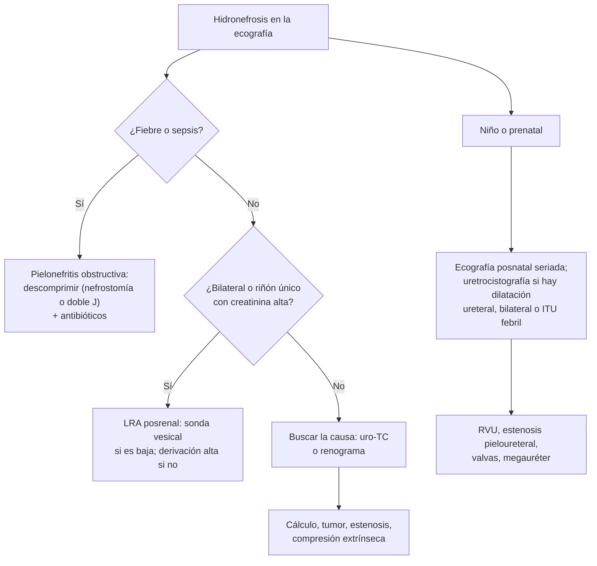

---
tags:
  - Cirugía
---

# Hidronefrosis, uropatía obstructiva alta, malformaciones nefrourológicas y reflujo vesicoureteral

**Subespecialidad**
Urología · Urología pediátrica · Nefrología

**Guías principales**
Guía EAU/ESPU de urología pediátrica: reflujo vesicoureteral (*Eur Urol* 2024) · Guía AUA de reflujo vesicoureteral primario (*J Urol* 2010) · Clasificación UTD de la dilatación de la vía urinaria (*J Pediatr Urol* 2014, actualizada en 2021)

**Otras fuentes**
Guía EAU de urolitiasis (ver [urolitiasis](../../nefrologia/urolitiasis-y-colico-renal.md))

**GES**
No como tal.

**EUNACOM**
4.03.1.012 Hidronefrosis · 4.03.1.026 Uropatía alta · 4.03.1.019 Malformaciones congénitas nefrourológicas · 4.03.1.021 Reflujo vesicoureteral

**Revisado**
Octubre 2026

!!! abstract "Resumen en 60 segundos"
    - **Hidronefrosis**: dilatación de la pelvis y los cálices. Es un **hallazgo**, no un diagnóstico: puede deberse a una **obstrucción** o a un **reflujo**, o no tener importancia.
    - **Uropatía obstructiva alta**: obstrucción por encima de la vejiga. En el adulto: **cálculos**, **tumores** (urotelial, cervicouterino, próstata, colon), **fibrosis retroperitoneal**, estenosis. En el niño: **estenosis pieloureteral**.
    - **Obstrucción + infección = urgencia**: pielonefritis obstructiva o pionefrosis → **descomprimir** (nefrostomía o catéter doble J) y antibióticos.
    - **Obstrucción bilateral** (o en riñón único) → **lesión renal aguda posrenal**; tras liberarla, vigilar la **poliuria posobstructiva**.
    - **Malformaciones**: **estenosis pieloureteral** (la más frecuente), **valvas de uretra posterior** (varón, la más grave), megauréter, duplicación, riñón en herradura, agenesia y displasia.
    - **Reflujo vesicoureteral**: paso de orina de la vejiga al uréter. Se diagnostica con **uretrocistografía miccional**, se gradúa de **I a V** y predispone a **pielonefritis** y **cicatrices renales**. Muchos se resuelven solos.

## Definición

- **Hidronefrosis**: dilatación del sistema pielocaliciario. **Ureterohidronefrosis**: dilatación también del uréter (sugiere un problema **distal**: unión ureterovesical, vejiga, uretra o reflujo).
- **Uropatía obstructiva**: alteración estructural o funcional que impide el flujo de la orina. **Nefropatía obstructiva**: el daño renal que resulta de ella.
- **Uropatía alta**: obstrucción por encima de la vejiga (riñón, unión pieloureteral, uréter). **Baja**: vejiga y uretra (ver [HPB y retención urinaria](hiperplasia-prostatica-retencion-urinaria-y-prostatitis.md)).
- **Reflujo vesicoureteral (RVU)**: paso retrógrado de orina de la vejiga al uréter y la pelvis renal.
    - **Primario**: por una unión ureterovesical incompetente (túnel submucoso corto).
    - **Secundario**: por una **presión vesical alta** (valvas de uretra posterior, vejiga neurogénica, disfunción miccional).

## Epidemiología

### Mundial

- La **dilatación de la vía urinaria** es una de las anomalías más frecuentes en la **ecografía prenatal**; la mayoría es **transitoria** o leve y se resuelve sin tratamiento.
- **Estenosis pieloureteral**: la causa más frecuente de hidronefrosis **congénita** significativa; más en varones y en el lado izquierdo.
- **Valvas de uretra posterior**: la causa más frecuente de **obstrucción uretral congénita** en varones y una causa importante de ERC en la infancia.
- **RVU**: se encuentra en una proporción importante de los niños con **ITU febril**.
- **En el adulto**, la uropatía obstructiva se debe sobre todo a **cálculos** (jóvenes), **HPB** y **tumores** pélvicos y retroperitoneales (mayores).

### Chile

!!! chile "Datos nacionales"
    - No se encontraron datos nacionales recientes de prevalencia.
    - La **ecografía obstétrica** de rutina detecta la mayoría de las dilataciones de la vía urinaria antes del nacimiento; el seguimiento posnatal se hace con **ecografía** y nefrología o urología infantil.
    - El **cáncer cervicouterino** avanzado sigue siendo una causa de obstrucción ureteral bilateral en mujeres en Chile.

## Etiología y factores de riesgo

| Nivel | Niño | Adulto |
|---|---|---|
| **Pelvis y unión pieloureteral** | **Estenosis pieloureteral**, vaso polar inferior | Cálculo, estenosis pieloureteral de presentación tardía, tumor urotelial |
| **Uréter** | **Megauréter** obstructivo, **ureterocele**, uréter ectópico | **Cálculo**, tumor urotelial, compresión extrínseca (**cáncer cervicouterino**, colon, linfoma, **fibrosis retroperitoneal**), **embarazo**, lesión iatrogénica, endometriosis |
| **Vejiga y uretra** (causan dilatación bilateral) | **Valvas de uretra posterior**, vejiga neurogénica (mielomeningocele) | **HPB**, cáncer de próstata, vejiga neurogénica, estenosis uretral |
| **Sin obstrucción** | **RVU**, megauréter no obstructivo, dilatación transitoria | Embarazo (fisiológica), diuresis alta, vejiga llena |

**Otras malformaciones nefrourológicas**:

| Malformación | Comentario |
|---|---|
| **Agenesia renal** | Unilateral: compensación del riñón contralateral; bilateral: incompatible con la vida (secuencia de Potter) |
| **Displasia renal multiquística** | Riñón sin función, con quistes; suele involucionar |
| **Riñón en herradura** | Fusión de los polos inferiores; más **cálculos**, hidronefrosis e infección; asociado a Turner |
| **Riñón ectópico** (pélvico) | Más obstrucción y reflujo |
| **Duplicación pieloureteral** | El polo superior se obstruye (ureterocele, uréter ectópico) y el inferior refluye (regla de Weigert-Meyer) |
| **Uréter ectópico** | En la niña, **incontinencia continua** con micciones normales |
| **Hipospadias**, **extrofia vesical**, criptorquidia | Ver [escroto agudo y patología testicular](escroto-agudo-y-patologia-testicular.md) para la criptorquidia |

## Fisiopatología

- La obstrucción **aumenta la presión** en la vía urinaria → cae la **filtración glomerular** y el flujo renal (vasoconstricción) → **atrofia tubular** y **fibrosis** si persiste.
- La recuperación de la función depende de la **duración** y el **grado** de la obstrucción; las obstrucciones completas de varias semanas dejan daño permanente.
- **Orina estancada** → **infección** (pionefrosis) y **cálculos**.
- **RVU**: la orina infectada sube al riñón → **pielonefritis** → **cicatrices** renales (nefropatía por reflujo) → HTA y ERC.
- **Poliuria posobstructiva**: tras liberar una obstrucción bilateral se eliminan el agua y los solutos retenidos, y los túbulos no concentran bien; puede causar **deshidratación** y trastornos electrolíticos.

*Figura 1. Enfoque de la hidronefrosis. Esquema propio basado en las guías EAU/ESPU 2024, AUA 2010 y la clasificación UTD.*

## Clasificación

**Grados de reflujo vesicoureteral** (clasificación internacional, en la uretrocistografía miccional):

| Grado | Hallazgo |
|---|---|
| **I** | Reflujo solo al **uréter**, sin dilatación |
| **II** | Llega a la **pelvis** y los cálices, **sin dilatación** |
| **III** | Dilatación **leve a moderada** del uréter y la pelvis; fórnices algo romos |
| **IV** | Dilatación **moderada**, uréter tortuoso, fórnices **romos** pero papilas visibles |
| **V** | Dilatación **grave**, uréter muy tortuoso, se pierde la impresión **papilar** |

**Grado de la hidronefrosis**: la clasificación **UTD** (2014, actualizada en 2021) usa el diámetro anteroposterior de la pelvis, la dilatación de los cálices, el espesor y aspecto del parénquima, el uréter y la vejiga para separar riesgo **bajo**, **intermedio** y **alto**. La escala de la **SFU** (grados 1–4) es la clásica.

## Clínica

- **Asintomática**: hallazgo de una ecografía (prenatal o por otro motivo).
- **Obstrucción aguda**: **cólico renal** (ver [urolitiasis](../../nefrologia/urolitiasis-y-colico-renal.md)), náuseas.
- **Obstrucción crónica**: dolor sordo en el flanco, a veces **masa** palpable (niño), **ITU recurrente**, cálculos, **HTA**.
- **Estenosis pieloureteral del adulto**: dolor en el flanco tras **ingerir mucho líquido** o alcohol (diuresis alta).
- **Obstrucción bilateral**: **oliguria** o **anuria**, **LRA** (ver [LRA](../../nefrologia/lesion-renal-aguda.md)); en la obstrucción parcial, a veces **poliuria**.
- **Pielonefritis obstructiva**: **fiebre**, dolor en el flanco, **sepsis**.
- **Valvas de uretra posterior**: diagnóstico prenatal (hidronefrosis bilateral, vejiga engrosada, **oligohidramnios**); al nacer, chorro débil, globo vesical, LRA, **hipoplasia pulmonar**.
- **RVU**: **ITU febril** (pielonefritis) en un niño, a menudo recurrente; en el adulto, cicatrices, HTA o proteinuria.

## Diagnóstico

!!! guia "Puntos clave (EAU/ESPU 2024, AUA 2010)"
    - **Ecografía renal y vesical**: primer examen en todos.
    - **Creatinina** y electrolitos; **orina completa** y **urocultivo**.
    - **Adulto con hidronefrosis**: **uro-TC** (o TC sin contraste si se sospecha un cálculo) para la **causa**.
    - **Renograma diurético** (MAG3): confirma una **obstrucción** funcional y mide la **función diferencial** de cada riñón; decide la cirugía de la estenosis pieloureteral.
    - **Uretrocistografía miccional** (UCGM): **diagnóstico y grado del RVU**; además muestra las **valvas** de uretra posterior. Indicarla en el niño con **ITU febril recurrente**, o con ITU febril y una **ecografía alterada** (hidronefrosis, cicatrices), o con dilatación prenatal de **alto riesgo**.
    - **Cintigrafía DMSA**: **cicatrices** renales y función diferencial.

## Laboratorio

| Examen | Uso |
|---|---|
| **Creatinina, BUN, electrolitos** | Función renal; **hiperkalemia** y **acidosis** en la LRA posrenal |
| **Orina completa y urocultivo** | ITU asociada |
| **Hemograma, PCR, hemocultivos** | Pielonefritis obstructiva, sepsis |
| **Proteinuria** | Nefropatía por reflujo |
| **Electrolitos y diuresis horaria tras liberar la obstrucción** | Poliuria posobstructiva |

## Imágenes

| Examen | Uso |
|---|---|
| **Ecografía** | Hidronefrosis, grado, parénquima, vejiga, residuo posmiccional |
| **Uro-TC** | Causa de la obstrucción en el adulto (cálculo, tumor, compresión) |
| **Renograma MAG3 con diurético** | Obstrucción funcional y función diferencial |
| **Uretrocistografía miccional** | **RVU** y su grado; **valvas** de uretra posterior |
| **Cintigrafía DMSA** | Cicatrices renales, función diferencial |
| **Uro-RM** | Anatomía en niños, sin radiación |

## Diagnóstico diferencial

| Hallazgo | Diferenciales |
|---|---|
| **Hidronefrosis unilateral** | Cálculo, estenosis pieloureteral, tumor urotelial, compresión extrínseca, RVU |
| **Hidronefrosis bilateral** | Obstrucción **baja** (HPB, valvas, vejiga neurogénica, retención), embarazo, fibrosis retroperitoneal, cáncer pélvico avanzado, RVU bilateral |
| **Imagen quística renal** | **Hidronefrosis** frente a quistes simples, riñón poliquístico (ver [riñón poliquístico](../../nefrologia/rinon-poliquistico.md)), displasia multiquística |
| **ITU febril recurrente en un niño** | **RVU**, obstrucción, **disfunción vesical e intestinal** (constipación) |

## Tratamiento

### Uropatía obstructiva del adulto

!!! alarma "Urgencias"
    - **Obstrucción + fiebre** (pielonefritis obstructiva, pionefrosis): **descompresión urgente** con **nefrostomía percutánea** o **catéter doble J**, más **antibióticos** (ver [ITU](../../nefrologia/infeccion-urinaria.md)). Los antibióticos solos no bastan.
    - **Obstrucción bilateral** o de riñón **único** con **LRA**: sonda vesical si la obstrucción es baja; nefrostomía o doble J si es alta.
    - **Hiperkalemia** o acidosis graves: tratamiento médico y diálisis si es necesario mientras se libera la obstrucción.

- **Poliuria posobstructiva**: diuresis horaria, electrolitos y reposición con **solución salina** (habitualmente una fracción de la diuresis, para no perpetuar la poliuria); suele resolverse en días.
- **Tratamiento de la causa**: cálculo (ureteroscopía, litotricia), tumor, **pieloplastía** (estenosis pieloureteral; laparoscópica o robótica), reimplante ureteral, catéter doble J permanente o nefrostomía en las compresiones malignas.

### Hidronefrosis prenatal y malformaciones

- **Profilaxis antibiótica** en los lactantes con dilatación de **alto riesgo** o RVU de alto grado mientras se estudian (según el especialista).
- **Estenosis pieloureteral**: **pieloplastía** si la función diferencial cae, aumenta la dilatación, hay **síntomas** (dolor, infección, cálculos).
- **Valvas de uretra posterior**: **sonda vesical** al nacer y **resección endoscópica** de las valvas; seguimiento de por vida (riesgo de ERC y vejiga disfuncional).

### Reflujo vesicoureteral

- **Objetivo**: prevenir las **pielonefritis** y las **cicatrices** renales.
- **Tratar la disfunción vesical e intestinal**: micción horaria, tratar la **constipación**.
- **Profilaxis antibiótica continua** (por ejemplo, **nitrofurantoína** o cotrimoxazol en dosis bajas, según la edad) en los niños pequeños con RVU de **alto grado** o ITU recurrente; no se indica en todos.
- **Circuncisión** en los lactantes varones con RVU e ITU recurrente (según la guía EAU/ESPU).
- **Cirugía** (inyección endoscópica subureteral o **reimplante** ureteral) si hay **ITU febriles a pesar de la profilaxis**, cicatrices nuevas o RVU de alto grado persistente.
- Los grados **bajos** (I–III) se **resuelven solos** en una proporción alta con el crecimiento.

## Complicaciones

- **Pielonefritis**, **pionefrosis**, **sepsis** de foco urinario.
- **LRA** y **ERC** (nefropatía obstructiva o por reflujo).
- **Cálculos** por estasis.
- **HTA** (cicatrices renales).
- **Valvas de uretra posterior**: ERC, vejiga disfuncional, hipoplasia pulmonar en las formas graves.
- **Embarazo** en mujeres con cicatrices por RVU: más pielonefritis y preeclampsia.

## Pronóstico y seguimiento

- La mayoría de las dilataciones prenatales **leves** se resuelven; las de alto riesgo requieren seguimiento con ecografía y renograma.
- La función renal se recupera bien si la obstrucción se libera **pronto**.
- **RVU**: muchos grados bajos se resuelven; los pacientes con **cicatrices** necesitan control de la **presión arterial**, la **proteinuria** y la creatinina a largo plazo.

## Perlas para el internado

!!! perla "Para recordar en la sala"
    - **Hidronefrosis es un hallazgo**: siempre buscar la **causa**.
    - **Fiebre + hidronefrosis = descomprimir** (nefrostomía o doble J) + antibióticos. Un riñón obstruido e infectado no se esteriliza con antibióticos solos.
    - **Hidronefrosis bilateral en un hombre mayor**: primero la **sonda vesical** (HPB, retención).
    - **LRA en un paciente con cáncer pélvico**: pedir una **ecografía** (obstrucción ureteral bilateral).
    - **Tras liberar una obstrucción bilateral**: vigilar la **diuresis** y los **electrolitos** (poliuria posobstructiva).
    - **Hidronefrosis bilateral prenatal en un varón con vejiga engrosada**: **valvas de uretra posterior**.
    - **ITU febril recurrente en un niño**: ecografía y **uretrocistografía** (RVU).
    - **Niña con incontinencia continua pero micciones normales**: **uréter ectópico**.

## Preguntas de repaso

??? repaso "1. Mujer de 45 años con fiebre de 39,5 °C, dolor en el flanco derecho e hipotensión. La ecografía muestra hidronefrosis derecha y un cálculo de 8 mm en el uréter proximal. ¿Conducta?"
    - **Pielonefritis obstructiva** con sepsis: **urgencia**.
    - Reanimación, hemocultivos, urocultivo y **antibióticos IV** de amplio espectro.
    - **Descompresión urgente**: **nefrostomía percutánea** o **catéter doble J**. El cálculo se trata después, cuando la infección se resuelva.

??? repaso "2. Hombre de 74 años con creatinina de 4,8 mg/dL (basal 1,1), oliguria y dolor suprapúbico. La ecografía muestra hidronefrosis bilateral y una vejiga muy distendida. ¿Qué hace primero y qué vigila después?"
    - **LRA posrenal** por obstrucción **baja** (probable **HPB**).
    - **Sonda vesical**.
    - Vigilar la **poliuria posobstructiva**: diuresis horaria, electrolitos y reposición de volumen.

??? repaso "3. Niña de 2 años con su segunda pielonefritis en 6 meses. La ecografía muestra una dilatación leve de la pelvis derecha. ¿Qué estudio pide y qué busca?"
    - **Uretrocistografía miccional**: busca un **reflujo vesicoureteral** y su grado.
    - **DMSA** para las cicatrices. Tratar la disfunción vesical e intestinal (constipación) y considerar la **profilaxis antibiótica**.

??? repaso "4. Hombre de 25 años con dolor en el flanco izquierdo cada vez que toma mucha cerveza. La ecografía muestra hidronefrosis izquierda sin dilatación del uréter ni cálculos. ¿Qué sospecha y cómo lo confirma?"
    - **Estenosis pieloureteral** de presentación tardía (síntomas con la diuresis alta).
    - **Renograma MAG3 con diurético** (obstrucción y función diferencial); uro-TC para la anatomía (vaso polar).
    - Tratamiento: **pieloplastía**.

??? repaso "5. Ecografía prenatal de un feto varón con hidronefrosis bilateral, vejiga engrosada y oligohidramnios. ¿Cuál es el diagnóstico más probable y qué se hace al nacer?"
    - **Valvas de uretra posterior**.
    - Al nacer: **sonda vesical**, creatinina, ecografía y **uretrocistografía**; **resección endoscópica** de las valvas y seguimiento nefrourológico de por vida.

## Referencias

1. Gnech M, 't Hoen L, Zachou A, et al. Update and Summary of the European Association of Urology/European Society of Paediatric Urology Paediatric Guidelines on Vesicoureteral Reflux in Children. *Eur Urol.* 2024;85(5):433–442. doi:[10.1016/j.eururo.2023.12.005](https://doi.org/10.1016/j.eururo.2023.12.005)
2. Peters CA, Skoog SJ, Arant BS Jr, et al. Summary of the AUA Guideline on Management of Primary Vesicoureteral Reflux in Children. *J Urol.* 2010;184(3):1134–1144. doi:[10.1016/j.juro.2010.05.065](https://doi.org/10.1016/j.juro.2010.05.065)
3. Nguyen HT, Benson CB, Bromley B, et al. Multidisciplinary consensus on the classification of prenatal and postnatal urinary tract dilation (UTD classification system). *J Pediatr Urol.* 2014;10(6):982–998. doi:[10.1016/j.jpurol.2014.10.002](https://doi.org/10.1016/j.jpurol.2014.10.002)
4. Nguyen HT, Phelps A, Coley B, et al. 2021 update on the urinary tract dilation (UTD) classification system: clarifications, review of the literature, and practical suggestions. *Pediatr Radiol.* 2022;52(4):740–751. doi:[10.1007/s00247-021-05263-w](https://doi.org/10.1007/s00247-021-05263-w)
