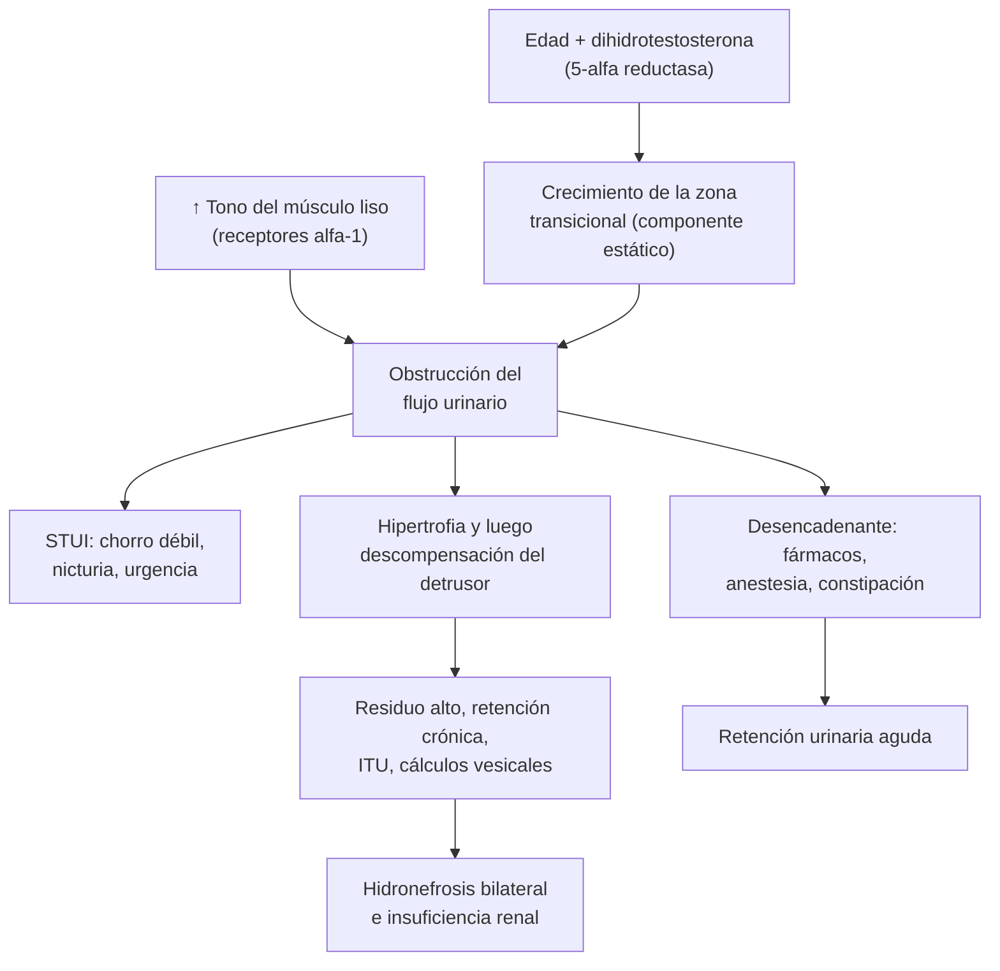

---
tags:
  - Cirugía
  - GES
  - Urgencia
  - Frecuente en sala
---

# Hiperplasia prostática benigna, retención urinaria, uropatía obstructiva baja y prostatitis

**Subespecialidad**
Urología · Geriatría · Urgencia

**Guías principales**
Guía EAU de síntomas del tracto urinario inferior masculino no neurogénicos, resumen 2026 (*Eur Urol*) · Guía AUA de hiperplasia prostática benigna, enmienda 2023 (*J Urol* 2024)

**Otras fuentes**
Ensayo MTOPS de doxazosina, finasterida y terapia combinada (*N Engl J Med* 2003) · Ensayo ALFAUR de alfuzosina en la retención urinaria aguda (*Urology* 2005) · Ficha GES 35 de la Superintendencia de Salud

**GES**
Sí: **tratamiento de la hiperplasia benigna de la próstata en personas sintomáticas (GES 35)**. Tratamiento médico en **7 días** y quirúrgico en **90 días** desde la indicación.

**EUNACOM**
4.03.1.013 Hiperplasia prostática benigna · 4.03.1.027 Uropatía obstructiva baja · 4.03.1.008 Estenosis uretral (sospecha) · 4.03.2.006 Retención urinaria aguda · 4.03.2.005 Prostatitis aguda (diagnóstico específico) · 4.03.3.002 Epidemiología del adenoma de próstata

**Revisado**
Octubre 2026

!!! abstract "Resumen en 60 segundos"
    - **Hiperplasia prostática benigna (HPB)**: crecimiento de la **zona transicional** de la próstata con la **edad**. Produce **síntomas del tracto urinario inferior** (STUI): chorro débil, latencia, goteo, sensación de vaciado incompleto, **nicturia**, urgencia y polaquiuria.
    - **Evaluación**: puntaje de síntomas (**IPSS**), **tacto rectal**, **orina completa**, creatinina y **APE** si el resultado cambia la conducta. **Residuo posmiccional** por ecografía.
    - **Tratamiento**:
        - Síntomas leves: **observación** y cambios de hábitos.
        - Moderados a graves: **alfabloqueador** (tamsulosina), efecto en días.
        - Próstata **grande** (> 30–40 mL o APE > 1,5 ng/mL): **inhibidor de la 5-alfa reductasa** (finasterida), que reduce la progresión y la retención; **combinados** con el alfabloqueador son mejores.
        - **Cirugía** (**RTU de próstata**, enucleación con láser) si hay complicaciones o fracaso. Cubierto por el **GES 35**.
    - **Retención urinaria aguda**: dolor suprapúbico y **globo vesical** palpable. **Sonda Foley de inmediato**, alfabloqueador e **intento de retiro de la sonda** a los 2–3 días.
    - **Estenosis uretral** (si no pasa la sonda): **no forzarla**. Urología o **cistostomía suprapúbica**.
    - **Prostatitis aguda**: fiebre alta, dolor perineal, disuria y **próstata muy dolorosa**. **No masajear la próstata**. **Fluoroquinolona** por **2–4 semanas**.

## Definición

- **Hiperplasia prostática benigna**: diagnóstico **histológico** de proliferación del estroma y del epitelio de la **zona transicional**.
    - **Crecimiento prostático benigno**: aumento del tamaño de la próstata.
    - **Obstrucción prostática benigna**: obstrucción del flujo urinario por el crecimiento benigno.
    - **STUI**: síntomas de **vaciado** (chorro débil, latencia, intermitencia, esfuerzo, goteo terminal), de **llenado** (urgencia, polaquiuria, **nicturia**, incontinencia de urgencia) y **posmiccionales** (vaciado incompleto, goteo posmiccional).
- **Uropatía obstructiva baja**: obstrucción del flujo urinario **bajo la vejiga** (cuello vesical, próstata, uretra, meato).
- **Retención urinaria aguda**: incapacidad **súbita** y **dolorosa** de orinar con la vejiga llena.
- **Retención urinaria crónica**: vejiga distendida, **indolora**, con **residuo** alto; puede causar **incontinencia por rebalse** e **insuficiencia renal**.
- **Estenosis uretral**: estrechamiento de la uretra por **fibrosis** del cuerpo esponjoso.
- **Prostatitis bacteriana aguda**: infección aguda de la próstata, casi siempre por **bacterias gramnegativas**.

## Epidemiología

### Mundial

- La **prevalencia histológica** de la HPB aumenta con la edad: es rara antes de los 40 años y afecta a la **mayoría de los hombres de más de 70 y 80 años**.
- Los **STUI moderados a graves** son frecuentes en los hombres mayores y aumentan con la edad.
- La **retención urinaria aguda** es una de las complicaciones de la HPB; su riesgo aumenta con la **edad**, los **síntomas**, el **volumen prostático** y el **APE**.
- **Estenosis uretral**: hoy sobre todo **iatrogénica** (sondas, instrumentación, resecciones) e **idiopática**; antes, por uretritis gonocócica.
- **Prostatitis bacteriana aguda**: más frecuente en hombres jóvenes y de mediana edad, y después de una **biopsia prostática** transrectal.

### Chile

!!! chile "Datos nacionales"
    - **GES 35**: tratamiento de la HPB en personas **sintomáticas**, a cualquier edad, con diagnóstico confirmado por un médico.
        - **Tratamiento médico** dentro de **7 días** desde la indicación.
        - **Tratamiento quirúrgico** dentro de **90 días** desde la indicación, en casos como la **retención urinaria aguda repetida**, la retención crónica, la **hematuria** macroscópica recurrente, los **cálculos vesicales**, las **ITU recurrentes** y la **insuficiencia renal** por obstrucción prostática.
    - Una síntesis chilena de evidencia (Medwave 2018) comparó la **RTU bipolar** con la **monopolar**, las dos técnicas de resección transuretral disponibles en el país.

## Etiología y factores de riesgo

| Enfermedad | Causa y factores de riesgo |
|---|---|
| **HPB** | **Edad** y **andrógenos** (dihidrotestosterona); obesidad, síndrome metabólico, diabetes, antecedentes familiares |
| **Retención urinaria aguda** | **HPB** (la más frecuente), **fármacos** (**anticolinérgicos**, antihistamínicos, **opioides**, descongestionantes **simpaticomiméticos**, antidepresivos tricíclicos), **anestesia** y posoperatorio, **constipación** o fecaloma, alcohol, frío, ITU o prostatitis, coágulos (hematuria), estenosis uretral, **compresión medular** o síndrome de cauda equina, inmovilidad |
| **Uropatía obstructiva baja** | HPB, **cáncer de próstata**, **estenosis uretral**, esclerosis del cuello vesical, cálculo vesical, fimosis o estenosis del meato, válvulas de uretra posterior (niños), vejiga neurogénica (diabetes, lesión medular) |
| **Estenosis uretral** | **Iatrogénica** (sonda Foley, cistoscopía, RTU, prostatectomía), **trauma** (fractura de pelvis, caída "a horcajadas"), **uretritis** (gonococo), liquen escleroso, idiopática |
| **Prostatitis aguda** | **E. coli** y otras enterobacterias, *Pseudomonas*, enterococo; en jóvenes con riesgo sexual, gonococo y clamidia. Factores: **biopsia prostática**, sonda vesical, instrumentación, ITU, VIH |

## Fisiopatología

- **HPB**: la **dihidrotestosterona** (producida por la **5-alfa reductasa**) estimula el crecimiento de la zona transicional, que rodea la uretra.
    - **Componente estático**: el tamaño de la próstata comprime la uretra (por eso sirve la **finasterida**, que reduce el volumen prostático).
    - **Componente dinámico**: el **tono del músculo liso** prostático, mediado por receptores **alfa-1** (por eso sirven los **alfabloqueadores**).
    - La vejiga se adapta a la obstrucción: **hipertrofia del detrusor**, trabeculación, **divertículos**, **inestabilidad** (urgencia) y, al final, **descompensación** (vejiga hipocontráctil, residuo alto).
    - La presión elevada se transmite a los uréteres: **hidronefrosis** bilateral e **insuficiencia renal** (uropatía obstructiva).
- **Retención aguda**: un **desencadenante** (fármaco, anestesia, constipación, infección) sobre una obstrucción previa → la vejiga no logra vaciarse.
- **Prostatitis**: reflujo de orina infectada a los conductos prostáticos o inoculación directa (biopsia) → infección del parénquima → **absceso** prostático si no se trata.

*Figura 1. Fisiopatología de la obstrucción prostática benigna y sus complicaciones. Esquema propio basado en las guías EAU 2026 y AUA 2023.*

## Clasificación

| Puntaje IPSS (síntomas prostáticos) | Gravedad |
|---|---|
| **0–7** | Leves |
| **8–19** | Moderados |
| **20–35** | Graves |

| Tamaño prostático | Utilidad |
|---|---|
| **< 30 mL** | Próstata pequeña: alfabloqueadores; la finasterida no aporta |
| **> 30–40 mL** (o APE > 1,5 ng/mL) | Agregar un **inhibidor de la 5-alfa reductasa** |
| **> 80 mL** | Enucleación (láser o abierta) en lugar de la RTU convencional |

## Clínica

- **HPB**:
    - **STUI** de vaciado y de llenado, de evolución **lenta**.
    - **Tacto rectal**: próstata **aumentada de tamaño**, **lisa**, **elástica**, **simétrica**, indolora, con el **surco medio** borrado. Una próstata **pétrea, nodular o asimétrica** sugiere **cáncer** (ver [cáncer de próstata](cancer-de-prostata.md)).
- **Retención urinaria aguda**:
    - **Imposibilidad súbita de orinar**, **dolor suprapúbico** intenso, inquietud.
    - **Globo vesical** palpable y mate a la percusión.
    - En adultos mayores con demencia puede presentarse como **delirium** o agitación.
- **Retención crónica**: vejiga distendida **indolora**, **incontinencia por rebalse** (goteo continuo), ITU recurrente, **insuficiencia renal**.
- **Estenosis uretral**: chorro **fino** y débil, que se divide o "en spray", con esfuerzo, ITU recurrente; antecedente de sonda, instrumentación o trauma. La sonda Foley **no pasa**.
- **Prostatitis aguda**:
    - **Fiebre alta**, **calofríos**, malestar.
    - **Disuria**, polaquiuria, urgencia, **dolor perineal** o rectal, chorro débil o **retención**.
    - **Tacto rectal**: próstata **muy dolorosa**, caliente, aumentada de tamaño. Hacerlo **suave**, **sin masaje** (riesgo de bacteriemia).

## Diagnóstico

!!! guia "Evaluación de los STUI masculinos (EAU 2026 y AUA 2023)"
    - **Anamnesis** (incluidos los **fármacos**), **puntaje de síntomas** (IPSS) y **diario miccional** si predomina la nicturia o la polaquiuria.
    - **Examen físico** con **tacto rectal**.
    - **Orina completa** (ITU, hematuria) en todos.
    - **APE** si su resultado cambia la conducta (sospecha de cáncer, estimación del volumen prostático, decisión de usar finasterida), tras explicar sus implicancias.
    - **Creatinina** si se sospecha un daño renal (retención, hidronefrosis).
    - **Residuo posmiccional** por **ecografía** y, si está disponible, **flujometría**.
    - **Ecografía** del aparato urinario si el residuo es alto, hay hematuria, ITU recurrente o daño renal.
    - **Cistoscopía**, uretrografía o estudio urodinámico según el caso (estenosis, cirugía, dudas diagnósticas).

- **Retención urinaria aguda**: diagnóstico **clínico**; la ecografía vesical confirma el volumen.
- **Prostatitis aguda**: **urocultivo** (y hemocultivos si hay fiebre alta); **ecografía transrectal o TC** si no mejora en 48–72 h (**absceso**).
- **Estenosis uretral**: **uretrocistografía retrógrada** y miccional, o **uretroscopía**.

## Laboratorio

| Examen | Uso |
|---|---|
| **Orina completa y urocultivo** | ITU, hematuria, prostatitis |
| **Creatinina y electrolitos** | Uropatía obstructiva (insuficiencia renal posrenal); **diuresis postobstructiva** |
| **APE** | Sospecha de cáncer; estima el volumen prostático; **está elevado** en la prostatitis aguda, la retención y tras la sonda o la biopsia (no medirlo en esas situaciones) |
| **Hemocultivos** | Prostatitis con fiebre alta o sepsis |
| **Glicemia** | Diabetes (poliuria, vejiga neurogénica) |

## Imágenes

| Examen | Uso |
|---|---|
| **Ecografía vesical (residuo posmiccional)** | Residuo **alto** (por ejemplo, > 200–300 mL) sugiere retención crónica |
| **Ecografía renal y vesical** | **Hidronefrosis**, cálculos, divertículos, engrosamiento vesical, volumen prostático |
| **Ecografía transrectal** | Volumen prostático; **absceso prostático** |
| **Uretrocistografía retrógrada** | Ubicación y longitud de la **estenosis uretral** |
| **TC de pelvis** | Absceso prostático, causas de obstrucción |

## Diagnóstico diferencial

| Diagnóstico | Diferencias |
|---|---|
| **Cáncer de próstata** | Próstata **pétrea**, nodular, asimétrica; APE alto (ver [cáncer de próstata](cancer-de-prostata.md)) |
| **Vejiga hiperactiva** | Urgencia y polaquiuria **sin** obstrucción ni residuo alto |
| **Poliuria nocturna** | Nicturia por insuficiencia cardíaca, ERC, diabetes, diuréticos, apnea del sueño (diario miccional) |
| **Vejiga neurogénica** | Diabetes, lesión medular, Parkinson, esclerosis múltiple |
| **ITU o prostatitis** | Disuria, fiebre, urocultivo positivo (ver [ITU](../../nefrologia/infeccion-urinaria.md)) |
| **Cáncer de vejiga** | **Hematuria** y síntomas irritativos en un fumador (ver [hematuria](hematuria-y-tumores-urologicos.md)) |
| **Cálculo vesical** | Interrupción brusca del chorro, hematuria terminal |
| **Fármacos** | Anticolinérgicos, antihistamínicos, opioides, descongestionantes |

## Tratamiento

### HPB (EAU 2026, AUA 2023)

- **Síntomas leves** o que no molestan: **observación vigilada** con **cambios de hábitos**:
    - Reducir los líquidos en la noche, evitar la **cafeína** y el **alcohol**, orinar antes de dormir.
    - Revisar y suspender los **fármacos** que empeoran los síntomas.
    - Tratar la constipación.
- **Síntomas moderados a graves que molestan**:
    - **Alfabloqueador** (tamsulosina, alfuzosina, doxazosina): alivio en **días**. Efectos: hipotensión ortostática, mareos, **eyaculación retrógrada**. Avisar antes de una **cirugía de cataratas** (síndrome del iris flácido).
    - **Inhibidor de la 5-alfa reductasa** (finasterida, dutasterida) si la **próstata es grande** (> 30–40 mL o APE > 1,5 ng/mL): reduce el **volumen prostático**, el riesgo de **retención** y de **cirugía**; efecto en **3–6 meses**. **Reduce el APE a la mitad** (multiplicarlo por 2 al interpretarlo).
    - **Terapia combinada** (alfabloqueador + 5-ARI) en próstatas grandes y riesgo de progresión. En el ensayo **MTOPS**, la combinación redujo la progresión clínica más que cada fármaco por separado.
    - **Síntomas de llenado** persistentes: agregar un **antimuscarínico** o **mirabegrón**, con residuo bajo.
    - **Tadalafilo 5 mg/día**: si además hay disfunción eréctil.
- **Cirugía** (GES 35, en 90 días): **retención urinaria recurrente**, **insuficiencia renal** por obstrucción, **cálculos vesicales**, **ITU recurrentes**, **hematuria recurrente**, o síntomas que no responden a los fármacos.
    - **RTU de próstata** (monopolar o bipolar): el estándar en próstatas de 30–80 mL.
    - **Enucleación con láser** (HoLEP) o adenomectomía abierta en próstatas grandes.
    - Alternativas menos invasivas: vaporización con láser, terapia con vapor de agua, embolización de las arterias prostáticas.

### Retención urinaria aguda

1. **Sondeo vesical** inmediato con **sonda Foley** (14–16 Fr). Si no pasa, **no forzar**: probar con una sonda de punta curva (Coudé) o llamar a urología; **cistostomía suprapúbica** si no se logra.
2. Registrar el **volumen** drenado (diagnóstico) y vigilar la **diuresis postobstructiva** y la **hematuria ex vacuo** si el volumen es grande.
3. Buscar y tratar el **desencadenante** (fármacos, constipación, infección).
4. Iniciar un **alfabloqueador** (alfuzosina o tamsulosina) e **intentar retirar la sonda a los 2–3 días** (TWOC). En el ensayo ALFAUR, la alfuzosina aumentó el éxito del retiro de **48 %** a **62 %**.
5. Si fracasa: **sonda permanente** o **cateterismo intermitente** y derivación a urología (indicación quirúrgica GES 35).

### Estenosis uretral

- **No forzar la sonda**: riesgo de **falsa vía**.
- **Urgencia**: cistostomía suprapúbica si hay retención y no pasa la sonda.
- **Electivo** (urología): **dilatación** o **uretrotomía endoscópica** (estenosis cortas de la uretra bulbar, primer episodio); **uretroplastía** (estenosis largas o recidivadas), con mejores resultados a largo plazo.

### Prostatitis bacteriana aguda

- **Hospitalizar** si hay sepsis, retención, intolerancia oral o factores de riesgo.
- **Antibióticos** según el urocultivo, por **2–4 semanas** (penetran bien a la próstata: **fluoroquinolonas**, cotrimoxazol).
- **Retención urinaria**: preferir el **catéter suprapúbico** o una sonda uretral fina por corto tiempo.
- **Absceso prostático**: **drenaje** (transrectal o transuretral).
- **No hacer masaje prostático** ni medir el APE en el cuadro agudo.

!!! dosis "Medicamentos habituales en el adulto"
    | Fármaco | Dosis | Comentario |
    |---|---|---|
    | **Tamsulosina** | **0,4 mg/día** después de una comida | Alfabloqueador uroselectivo; eyaculación retrógrada, mareo |
    | **Alfuzosina** | **10 mg/día** | Útil en la retención aguda antes del retiro de la sonda |
    | **Doxazosina** | 1 mg/día, subir hasta 4–8 mg/día | Más hipotensión ortostática |
    | **Finasterida** | **5 mg/día** | Próstata > 30–40 mL; efecto en 3–6 meses; reduce el APE ~50 % |
    | **Dutasterida** | 0,5 mg/día | Alternativa a la finasterida |
    | **Tadalafilo** | 5 mg/día | STUI con disfunción eréctil; no con nitratos |
    | **Solifenacina** o **mirabegrón** | 5 mg/día o 25–50 mg/día | Síntomas de llenado con **residuo bajo** |
    | **Prostatitis aguda: ciprofloxacino** | **500 mg cada 12 h VO por 2–4 semanas** (400 mg IV cada 12 h si está hospitalizado) | Según el antibiograma; alternativa: cotrimoxazol forte cada 12 h |
    | **Prostatitis grave o sepsis** | **Ceftriaxona 2 g IV cada 24 h** (± gentamicina) o piperacilina/tazobactam | Pasar a oral según el cultivo |

!!! alarma "Derivar o hospitalizar"
    - **Retención urinaria aguda**: sondeo **inmediato**; urología si la sonda **no pasa** (cistostomía).
    - **Retención con insuficiencia renal**, hidronefrosis o diuresis postobstructiva importante: hospitalizar.
    - **Prostatitis aguda** con **fiebre alta**, sepsis o retención: hospitalizar.
    - **Tacto rectal sospechoso** (pétreo, nodular) o APE elevado para la edad: urología (sospecha de cáncer, GES 28).
    - **Retención** con **déficit neurológico** de las piernas o anestesia en silla de montar: **compresión medular o cauda equina** (urgencia neuroquirúrgica).

## Complicaciones

- **HPB**: **retención urinaria aguda**, retención crónica, **ITU recurrente**, **cálculos vesicales**, **hematuria**, divertículos vesicales, **insuficiencia renal** obstructiva.
- **Sondeo en la retención**: **hematuria ex vacuo**, **diuresis postobstructiva** (poliuria con riesgo de deshidratación e hipokalemia), ITU, **falsa vía** y estenosis uretral.
- **RTU de próstata**: sangrado, **eyaculación retrógrada**, estenosis uretral, **incontinencia** (rara), **síndrome post-RTU** (hiponatremia por absorción del líquido de irrigación, menos con la RTU bipolar).
- **Prostatitis aguda**: **sepsis**, **absceso prostático**, retención, **prostatitis crónica**.
- **Estenosis uretral**: retención, ITU, cálculos, divertículo uretral, recidiva tras la uretrotomía.

## Pronóstico y seguimiento

- **HPB**: enfermedad **progresiva** en una parte de los pacientes; los 5-ARI reducen la progresión y la necesidad de cirugía.
- **Seguimiento** del tratamiento médico: IPSS, efectos adversos y residuo a las **4–12 semanas** y luego **anual**.
- **Retención aguda**: alto riesgo de recurrencia si no se trata la HPB; una parte termina en cirugía.
- **Prostatitis aguda**: buena respuesta a los antibióticos; urocultivo de control al terminar el tratamiento.
- **Estenosis uretral**: recidivas frecuentes tras la uretrotomía; la uretroplastía tiene mejores resultados a largo plazo.

## Perlas para el internado

!!! perla "Para recordar en la sala"
    - **Adulto mayor con delirium o agitación: palpar el hipogastrio.** El globo vesical es una causa clásica.
    - **Revisar los fármacos** en toda retención: anticolinérgicos, antihistamínicos, opioides, descongestionantes, tricíclicos.
    - **Retención aguda: sonda, alfabloqueador y retiro de la sonda a los 2–3 días.**
    - **Si la sonda no pasa, no forzar**: falsa vía. Urología o cistostomía.
    - **Drenaje de más de 1 L**: vigilar la **diuresis postobstructiva** (balance hídrico y electrolitos).
    - **Próstata dura y nodular** = cáncer hasta demostrar lo contrario; lisa y elástica = HPB.
    - **No medir el APE** en la retención aguda, la prostatitis ni después de una sonda: estará falsamente alto.
    - **Finasterida baja el APE a la mitad**: multiplicar por 2 al interpretarlo.
    - **Prostatitis aguda: no masajear la próstata**; fluoroquinolona por 2–4 semanas.
    - **Avisar al oftalmólogo** si el paciente usa tamsulosina antes de operar una catarata.

## Preguntas de repaso

??? repaso "1. Hombre de 68 años con chorro débil, latencia, nicturia de 3 veces y sensación de vaciado incompleto. IPSS 18. Tacto rectal: próstata aumentada, lisa y elástica (unos 50 mL). Orina normal, residuo posmiccional de 80 mL. ¿Cómo lo trata?"
    - **HPB con síntomas moderados** y próstata **grande**.
    - **Medidas generales** (menos líquido en la noche, menos cafeína y alcohol, revisar fármacos).
    - **Terapia combinada**: **tamsulosina 0,4 mg/día + finasterida 5 mg/día**, porque la próstata es mayor de 30–40 mL (reduce la progresión y el riesgo de retención).
    - Control a las 4–12 semanas. Cubierto por el **GES 35**.

??? repaso "2. Hombre de 75 años, operado ayer de una hernia inguinal con anestesia raquídea y con morfina para el dolor, no orina hace 10 horas y tiene dolor suprapúbico. Se palpa un globo vesical. ¿Qué hace?"
    - **Retención urinaria aguda** (anestesia, opioides, probable HPB de base).
    - **Sonda Foley** de inmediato, registrar el volumen y vigilar la diuresis postobstructiva.
    - Ajustar la analgesia (reducir el opioide), iniciar **alfuzosina o tamsulosina** e intentar retirar la sonda en 2–3 días.

??? repaso "3. Al intentar sondear a un paciente en retención, la sonda no avanza. Tiene antecedente de RTU de próstata. ¿Qué hace?"
    - Probable **estenosis uretral** (o del cuello vesical) posoperatoria.
    - **No forzar** (riesgo de falsa vía). Probar una sonda más fina o de punta curva **solo si se tiene experiencia**; llamar a **urología**.
    - Si no se logra, **cistostomía suprapúbica**. Después, estudio con uretrocistografía.

??? repaso "4. Hombre de 45 años con fiebre de 39,5 °C, calofríos, disuria, dolor perineal y chorro débil. Al tacto rectal suave, la próstata está muy dolorosa y caliente. ¿Qué tiene y cómo lo trata?"
    - **Prostatitis bacteriana aguda**.
    - **Urocultivo** y **hemocultivos**; no masajear la próstata ni medir el APE.
    - Hospitalizar si hay sepsis o retención: **ceftriaxona IV**, luego **ciprofloxacino** oral hasta completar **2–4 semanas**.
    - Si no mejora en 48–72 h: ecografía transrectal o TC (absceso).

??? repaso "5. Hombre de 80 años con goteo de orina constante, creatinina de 2,8 mg/dL (basal 1,0) y una vejiga palpable hasta el ombligo, indolora. ¿Qué pasa y qué riesgo hay tras sondearlo?"
    - **Retención urinaria crónica con incontinencia por rebalse** e **insuficiencia renal posrenal** (uropatía obstructiva baja por HPB).
    - **Sonda Foley**; ecografía renal (hidronefrosis).
    - Riesgo de **diuresis postobstructiva** (poliuria con deshidratación e hipokalemia) y de **hematuria ex vacuo**: balance hídrico, electrolitos y reposición.
    - Derivar a urología: indicación **quirúrgica** (GES 35).

??? repaso "6. Paciente en tratamiento con finasterida hace 2 años tiene un APE de 2,5 ng/mL. ¿Cómo lo interpreta?"
    - La finasterida **reduce el APE cerca de 50 %**.
    - El valor equivalente es de unos **5 ng/mL**: puede estar elevado para la edad y obliga a evaluar un **cáncer de próstata** (tacto rectal, urología).

## Referencias

1. Baboudjian M, Creta M, Pyrgidis N, et al. Summary Paper on the 2026 European Association of Urology Guidelines on the Management of Non-neurogenic Male Lower Urinary Tract Symptoms. *Eur Urol.* 2026;90(1):44–59. doi:[10.1016/j.eururo.2026.03.020](https://doi.org/10.1016/j.eururo.2026.03.020)
2. Sandhu JS, Bixler BR, Dahm P, et al. Management of Lower Urinary Tract Symptoms Attributed to Benign Prostatic Hyperplasia (BPH): AUA Guideline Amendment 2023. *J Urol.* 2024;211(1):11–19. doi:[10.1097/JU.0000000000003698](https://doi.org/10.1097/JU.0000000000003698)
3. McConnell JD, Roehrborn CG, Bautista OM, et al. The long-term effect of doxazosin, finasteride, and combination therapy on the clinical progression of benign prostatic hyperplasia. *N Engl J Med.* 2003;349(25):2387–2398. doi:[10.1056/NEJMoa030656](https://doi.org/10.1056/NEJMoa030656)
4. McNeill SA, Hargreave TB, Roehrborn CG; Alfaur Study Group. Alfuzosin 10 mg once daily in the management of acute urinary retention: results of a double-blind placebo-controlled study. *Urology.* 2005;65(1):83–89. doi:[10.1016/j.urology.2004.07.042](https://doi.org/10.1016/j.urology.2004.07.042)
5. Inzunza G, Rada G, Majerson A. ¿Resección transuretral bipolar o monopolar para hiperplasia prostática benigna? *Medwave.* 2018;18(1):e7134. [PubMed](https://pubmed.ncbi.nlm.nih.gov/29351269/)
6. Superintendencia de Salud. Problema de salud 35: Tratamiento de la hiperplasia benigna de la próstata en personas sintomáticas. [Superintendencia de Salud](https://www.superdesalud.gob.cl/orientacion-en-salud/tratamiento-de-la-hiperplasia-benigna-de-la-prostata-en-personas-sintomaticas)
