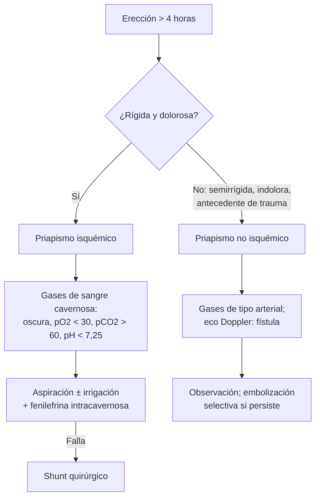

---
tags:
  - Cirugía
  - Urgencia
---

# Patología del pene: fimosis, parafimosis, balanitis, priapismo y disfunción eréctil

**Subespecialidad**
Urología · Andrología

**Guías principales**
Guía EAU de salud sexual y reproductiva masculina, actualización 2025 (*Eur Urol* 2025) · Guía AUA de disfunción eréctil (*J Urol* 2018) · Guías AUA/SMSNA de priapismo (*J Urol* 2021 y 2022)

**Otras fuentes**
Guía europea de balanopostitis 2022 (*J Eur Acad Dermatol Venereol* 2023)

**GES**
No.

**EUNACOM**
4.03.2.003 Parafimosis (específico, completo) · 4.03.2.004 Priapismo (sospecha, inicial) · 4.03.1.009 Fimosis, parafimosis · 4.03.1.001 Balanitis, balanopostitis · 4.03.1.005 Disfunción sexual de causa orgánica

**Revisado**
Octubre 2026

!!! abstract "Resumen en 60 segundos"
    - **Fimosis**: el prepucio no se retrae. En el niño pequeño es **fisiológica** y se resuelve sola. La **patológica** (anillo blanco cicatricial, **liquen escleroso**) se trata con **corticoide tópico** y, si falla, **circuncisión**.
    - **Parafimosis**: prepucio retraído que **no vuelve** y estrangula el glande. **Urgencia**: compresión del edema y **reducción manual**; incisión dorsal si falla. Evitable: **devolver siempre el prepucio** tras un sondeo o un aseo.
    - **Balanitis** en el adulto: la causa más frecuente es la **candidiasis**, y obliga a buscar **diabetes**. Lesión que no mejora en 4–6 semanas: **biopsia**.
    - **Priapismo**: erección **> 4 horas** sin estímulo. El **isquémico** (rígido y **doloroso**) es una **urgencia**: **aspiración** de los cuerpos cavernosos e inyección de **fenilefrina**. El **no isquémico** (tras un trauma perineal, indoloro) no es urgente.
    - **Disfunción eréctil orgánica**: es un **marcador de riesgo cardiovascular**. Evaluar factores de riesgo, fármacos y testosterona. Tratamiento: estilo de vida e **inhibidores de la PDE5** (sildenafil, tadalafilo), **contraindicados con nitratos**.

## Definición

- **Fimosis**: imposibilidad de retraer el prepucio sobre el glande.
    - **Fisiológica**: adherencias normales en el niño; el prepucio se vuelve retráctil con el crecimiento.
    - **Patológica** (secundaria): anillo **fibroso** cicatricial por inflamación crónica, **liquen escleroso** (balanitis xerótica obliterante) o retracciones forzadas.
- **Parafimosis**: prepucio retraído por detrás del surco balanoprepucial que no puede volver a su posición; el anillo estrecho produce **edema** progresivo del prepucio y del glande, con riesgo de **isquemia**.
- **Balanitis**: inflamación del **glande**. **Postitis**: del prepucio. **Balanopostitis**: de ambos.
- **Priapismo**: erección **persistente** (más de **4 horas**) **sin relación** con el deseo o la estimulación sexual.
    - **Isquémico** (bajo flujo, veno-oclusivo): síndrome compartimental del pene; el más frecuente y una urgencia.
    - **No isquémico** (alto flujo, arterial): por una fístula arterio-cavernosa, casi siempre tras un trauma.
    - **Intermitente** (*stuttering*): episodios isquémicos recurrentes y autolimitados (típico de la **drepanocitosis**).
- **Disfunción eréctil**: incapacidad **persistente** de lograr o mantener una erección suficiente para una actividad sexual satisfactoria.

## Epidemiología

### Mundial

- **Fimosis**: la mayoría de los recién nacidos tiene un prepucio no retráctil, y la proporción baja con la edad; la fimosis verdadera en la adolescencia es poco frecuente.
- **Balanitis**: afecta a hombres **no circuncidados**; la **candidiasis** es la causa infecciosa más frecuente, sobre todo en **diabéticos** y en usuarios de **iSGLT2** (glucosuria).
- **Priapismo**: raro en la población general; frecuente en la **drepanocitosis**.
- **Disfunción eréctil**: muy frecuente y **aumenta con la edad**; comparte factores de riesgo con la **enfermedad cardiovascular** (diabetes, HTA, tabaco, dislipidemia, obesidad, sedentarismo).

### Chile

!!! chile "Datos nacionales"
    - No se encontraron datos nacionales recientes de prevalencia de estas condiciones.
    - Ninguna es GES; la circuncisión y el estudio de la disfunción eréctil se derivan a **urología**.
    - El alto número de personas con **diabetes** en Chile (ver [diabetes tipo 2](../../endocrinologia/diabetes-mellitus-tipo-2.md)) hace que la balanitis candidiásica y la disfunción eréctil vascular sean consultas habituales en APS.

## Etiología y factores de riesgo

| Condición | Causas y factores de riesgo |
|---|---|
| **Fimosis patológica** | **Liquen escleroso**, balanopostitis a repetición, **diabetes**, retracción forzada en la infancia |
| **Parafimosis** | Prepucio **dejado retraído** tras un **sondeo vesical**, un aseo o un examen; actividad sexual; piercings |
| **Balanitis** | **Candida** (diabetes, iSGLT2, antibióticos), bacterias (estreptococo, anaerobios), **ITS** (sífilis, herpes, tricomonas), **irritantes** (jabones, higiene excesiva), dermatosis (psoriasis, liquen plano, **liquen escleroso**, balanitis de Zoon), exantema fijo por fármacos, **lesiones premalignas** (eritroplasia de Queyrat) |
| **Priapismo isquémico** | **Drogas intracavernosas** (alprostadil, papaverina), **trazodona**, **antipsicóticos** y otros alfabloqueadores, **cocaína** y otras drogas, **drepanocitosis**, **leucemias** (hiperviscosidad), nutrición parenteral, idiopático |
| **Priapismo no isquémico** | **Trauma perineal** o peneano (caída a horcajadas) que crea una fístula arterio-cavernosa |
| **Disfunción eréctil orgánica** | **Vascular** (aterosclerosis: diabetes, HTA, tabaco, dislipidemia), **neurológica** (diabetes, lesión medular, Parkinson, esclerosis múltiple, cirugía pélvica o **prostatectomía radical**), **hormonal** (hipogonadismo, hiperprolactinemia, hipotiroidismo), **fármacos** (tiazidas, betabloqueadores, ISRS, antiandrógenos, opioides, alcohol), **anatómica** (Peyronie) |

## Fisiopatología

- **Erección normal**: el estímulo parasimpático libera **óxido nítrico**, que aumenta el **GMPc**, relaja el músculo liso cavernoso y llena los sinusoides; la expansión comprime las venas de salida (veno-oclusión). La **PDE5** degrada el GMPc y termina la erección; los **iPDE5** la prolongan.
- **Priapismo isquémico**: falla el drenaje venoso → sangre estancada, **hipoxia**, **acidosis** y trombosis → **necrosis y fibrosis** del músculo cavernoso. Después de **24–48 h**, la mayoría queda con **disfunción eréctil** permanente.
- **Parafimosis**: el anillo prepucial actúa como un **torniquete**: edema → más compresión → isquemia del glande.

*Figura 1. Enfoque del priapismo. Esquema propio basado en las guías AUA/SMSNA 2021–2022 y EAU 2025.*

## Clasificación

| | **Priapismo isquémico** | **Priapismo no isquémico** |
|---|---|---|
| **Frecuencia** | El más frecuente (> 95 %) | Raro |
| **Pene** | **Rígido**, glande blando | Semirrígido |
| **Dolor** | **Sí** (progresivo) | No o poco |
| **Antecedente** | Fármacos, drogas, drepanocitosis | **Trauma** perineal o peneano |
| **Gases cavernosos** | **Hipoxia**, hipercapnia, **acidosis** (sangre oscura) | Similares a la sangre **arterial** (roja) |
| **Doppler** | Flujo cavernoso **ausente** | Flujo **alto**, fístula |
| **Urgencia** | **Sí** | No |

## Clínica

- **Fimosis**: prepucio no retráctil, a veces con **dificultad para orinar** ("prepucio en globo"), balanitis recurrente o dolor en la erección. El **anillo blanco cicatricial** sugiere liquen escleroso.
- **Parafimosis**: glande y prepucio **edematosos** y dolorosos con un **anillo** constrictivo detrás del glande; en el paciente **sondado**, confuso o demente, puede pasar inadvertida.
- **Balanitis**:
    - **Candidiásica**: eritema con **pápulas** o pústulas satélites y placas blanquecinas, prurito.
    - **Bacteriana**: eritema, edema, secreción purulenta, mal olor.
    - **Liquen escleroso**: placas **blanquecinas** atróficas, fimosis, estenosis del meato.
    - **Eritroplasia de Queyrat**: placa **roja aterciopelada** persistente (carcinoma in situ).
- **Priapismo**: erección prolongada; la anamnesis busca **fármacos** (intracavernosos, trazodona, antipsicóticos), **drogas**, **drepanocitosis**, leucemia y **trauma**.
- **Disfunción eréctil**: preguntar el **inicio** (brusco y situacional sugiere causa **psicógena**; gradual y con pérdida de las **erecciones matinales** sugiere causa **orgánica**), la libido (baja: hipogonadismo), los fármacos y los síntomas cardiovasculares.

## Diagnóstico

!!! guia "Puntos clave (EAU 2025, AUA)"
    - **Fimosis, parafimosis y balanitis**: diagnóstico **clínico**.
    - **Balanitis**: **glicemia** o HbA1c; cultivo o KOH si hay dudas; **serología de sífilis** y estudio de ITS según el riesgo; **biopsia** si la lesión persiste pese al tratamiento o se sospecha una lesión premaligna o liquen escleroso.
    - **Priapismo**: **anamnesis**, examen y **gases de la sangre cavernosa** (aspirada del cuerpo cavernoso) para distinguir el isquémico; **eco Doppler** si hay dudas. Hemograma (leucemia, drepanocitosis) y toxicológico según el contexto.
    - **Disfunción eréctil**: historia sexual y médica, cuestionario **IIEF-5**, examen físico (genitales, caracteres sexuales, pulsos, presión arterial). Laboratorio: **glicemia** o HbA1c, **perfil lipídico** y **testosterona total matinal**. Evaluar el **riesgo cardiovascular**.

## Laboratorio

| Examen | Uso |
|---|---|
| **Glicemia / HbA1c** | Balanitis candidiásica, fimosis del adulto, disfunción eréctil |
| **Perfil lipídico** | Riesgo cardiovascular en la disfunción eréctil |
| **Testosterona total matinal** (repetir si está baja; LH y prolactina según el caso) | Hipogonadismo (ver [hipogonadismo masculino](../../endocrinologia/hipogonadismo-masculino-y-ginecomastia.md)) |
| **Gases de sangre cavernosa** | Priapismo: isquémico (pO2 < 30, pCO2 > 60, pH < 7,25) frente a no isquémico |
| **Hemograma**, electroforesis de hemoglobina | Priapismo: leucemia, drepanocitosis |
| **VDRL/RPR, VIH** | Balanitis con sospecha de ITS |

## Imágenes

| Examen | Uso |
|---|---|
| **Eco Doppler peneana** | Priapismo (flujo ausente o alto, fístula); estudio vascular de la disfunción eréctil en casos seleccionados |
| **Angiografía** | Priapismo **no isquémico** para la **embolización** de la fístula |

## Diagnóstico diferencial

| Cuadro | Diferenciales |
|---|---|
| **Pene edematoso agudo** | **Parafimosis**, balanopostitis con edema, angioedema, picadura, **fractura de pene** (ver [trauma urológico](trauma-urologico.md)), torniquete por un pelo o un anillo |
| **Lesión del glande** | Candidiasis, **sífilis primaria** (chancro), **herpes**, psoriasis, liquen, exantema fijo por fármacos, **eritroplasia de Queyrat**, **cáncer de pene** |
| **Erección prolongada** | Priapismo isquémico frente a no isquémico; erección prolongada tras una inyección intracavernosa |
| **Disfunción eréctil** | Orgánica frente a **psicógena** (ansiedad de desempeño, depresión); **eyaculación precoz**; baja libido |

## Tratamiento

### Fimosis

- **Fisiológica** en el niño: **no retraer a la fuerza**; higiene y observación.
- **Patológica** o sintomática: **corticoide tópico** (por ejemplo, **betametasona 0,05 %** 2 veces al día por **4–8 semanas**) con retracción suave.
- **Circuncisión** si falla el corticoide, hay cicatriz o liquen escleroso extenso, o balanitis a repetición.

### Parafimosis

!!! dosis "Reducción de la parafimosis"
    1. **Analgesia**: bloqueo dorsal del pene con lidocaína **sin vasoconstrictor**, o analgesia sistémica.
    2. **Reducir el edema**: **compresión manual** sostenida del glande por varios minutos, hielo o vendaje compresivo; punciones múltiples del edema con aguja fina en casos difíciles.
    3. **Reducción manual**: los pulgares empujan el **glande** hacia dentro mientras los dedos traccionan el prepucio hacia adelante.
    4. Si falla: **incisión dorsal** del anillo bajo anestesia, con **circuncisión diferida**.
    5. **Prevención**: **devolver el prepucio** siempre tras un sondeo, un aseo o un examen.

### Balanitis

- **Medidas generales**: lavado con agua y un emoliente, **sin jabones** irritantes, secar bien; **control de la diabetes**.
- **Candidiásica**: **clotrimazol 1 % crema** 2 veces al día por 7–14 días (o miconazol); alternativa **fluconazol 150 mg VO** en dosis única. Tratar a la pareja si tiene síntomas.
- **Bacteriana**: según el cultivo (por ejemplo, **metronidazol** para los anaerobios).
- **ITS**: tratamiento específico (ver [ITS y sífilis](../../infectologia/infecciones-de-transmision-sexual-y-sifilis.md)).
- **Liquen escleroso**: **corticoide tópico potente** (clobetasol 0,05 %); circuncisión si hay fimosis; seguimiento por el riesgo de **carcinoma**.
- **Persistente** o sospechosa: **biopsia** y derivación.

### Priapismo isquémico (urgencia)

!!! dosis "Manejo inicial (AUA/SMSNA 2021)"
    - **Analgesia** y **bloqueo** dorsal del pene.
    - **Aspiración** de sangre de los cuerpos cavernosos (con o sin **irrigación** con suero fisiológico).
    - **Fenilefrina intracavernosa**: solución de **100–500 µg/mL**, **1 mL** cada **3–5 minutos**, hasta por **1 hora**, con monitorización de la **presión** y la **frecuencia cardíaca**.
    - Si falla: **shunt** quirúrgico (distal y luego proximal); en los casos prolongados, considerar una **prótesis** precoz.
    - **Drepanocitosis**: además del manejo local, hidratación, oxígeno y manejo hematológico (puede requerir **exanguinotransfusión**), sin retrasar la aspiración.
    - **Medidas no útiles por sí solas**: hielo, ejercicio, terbutalina oral: no deben **retrasar** la derivación.

### Priapismo no isquémico

- **No es urgente**: muchos se resuelven solos. **Observación**; **embolización** arterial selectiva si persiste o lo desea el paciente.

### Disfunción eréctil

- **Estilo de vida**: bajar de peso, ejercicio, **dejar el tabaco**, reducir el alcohol; tratar la HTA, la diabetes y la dislipidemia; cambiar los fármacos causantes si es posible.
- **Tratar la causa**: hipogonadismo (testosterona), hiperprolactinemia, depresión.
- **Inhibidores de la PDE5** (primera opción habitual):

!!! dosis "Inhibidores de la PDE5"
    | Fármaco | Dosis | Comentario |
    |---|---|---|
    | **Sildenafil** | **50 mg** (25–100) VO, **~1 h antes** | Acción ~4–6 h; las comidas grasas lo retrasan |
    | **Tadalafilo** | **10–20 mg** a demanda o **5 mg/día** continuo | Acción hasta **36 h**; útil si además hay **HPB** |
    | **Contraindicación absoluta** | **Nitratos** (riesgo de hipotensión grave), riociguat | Si un usuario de iPDE5 tiene una angina: no dar nitratos en 24 h (sildenafil) o 48 h (tadalafilo) |
    | **Precaución** | Alfabloqueadores (hipotensión), cardiopatía con contraindicación de la actividad sexual | Efectos adversos: cefalea, rubor, congestión nasal, dispepsia, alteración visual |

- **Si fallan**: **alprostadil intracavernoso** o intrauretral, **dispositivos de vacío**, y **prótesis peneana** en los casos refractarios (urología).
- **Apoyo psicológico** o terapia sexual, solo o combinado.

!!! alarma "Derivar de urgencia"
    - **Priapismo** de más de **4 horas**: urgencia urológica.
    - **Parafimosis** que no se reduce o con glande **oscuro** (isquemia).
    - **Fractura de pene** (chasquido, detumescencia y hematoma).
    - **Dolor torácico** en un usuario de iPDE5: **no usar nitratos**.

## Complicaciones

- **Fimosis**: balanitis a repetición, retención urinaria, parafimosis tras la retracción forzada, **cáncer de pene** (asociado a la fimosis y a la mala higiene).
- **Parafimosis**: **necrosis del glande**, infección.
- **Balanitis crónica**: estenosis del meato, fimosis adquirida; **liquen escleroso** y lesiones premalignas que pueden progresar a **carcinoma escamoso**.
- **Priapismo isquémico**: **fibrosis** de los cuerpos cavernosos y **disfunción eréctil** permanente (mayor riesgo mientras más tiempo dure).
- **Disfunción eréctil**: impacto en la calidad de vida y la pareja; puede ser la **primera manifestación** de una enfermedad cardiovascular.

## Pronóstico y seguimiento

- **Fimosis**: el corticoide tópico resuelve la mayoría de los casos sin cicatriz; la circuncisión es curativa.
- **Priapismo isquémico**: el resultado funcional depende del **tiempo** hasta el tratamiento.
- **Disfunción eréctil**: los iPDE5 son eficaces en la mayoría; menos en los diabéticos y tras la prostatectomía radical. **Controlar el riesgo cardiovascular** en todos.

## Perlas para el internado

!!! perla "Para recordar en la sala"
    - **Tras pasar una sonda Foley, devolver el prepucio**: la parafimosis es casi siempre iatrogénica o por descuido.
    - **Balanitis candidiásica en un adulto = buscar diabetes** (y revisar si usa iSGLT2).
    - **Lesión del glande que no mejora en 4–6 semanas = biopsia** (eritroplasia de Queyrat, cáncer de pene).
    - **Priapismo rígido y doloroso = isquémico = urgencia**: aspiración y fenilefrina. **Tras un trauma e indoloro = no isquémico**, no urgente.
    - **Trazodona, antipsicóticos y cocaína** son causas frecuentes de priapismo en el adulto.
    - **Disfunción eréctil = marcador cardiovascular**: evaluar el riesgo.
    - **iPDE5 + nitratos = contraindicado.**
    - **No retraer a la fuerza** el prepucio de un niño.

## Preguntas de repaso

??? repaso "1. Hombre de 78 años hospitalizado con sonda Foley desde hace 2 días, con el glande y el prepucio muy edematosos y un anillo constrictivo tras el glande. ¿Qué tiene y qué hace?"
    - **Parafimosis** (prepucio dejado retraído tras el sondeo).
    - Analgesia (bloqueo peneano), **compresión** del edema y **reducción manual**. Si falla o el glande está oscuro: urología para una **incisión dorsal**.

??? repaso "2. Hombre de 55 años con eritema del glande con pápulas satélites y prurito. ¿Qué causa sospecha y qué examen pide?"
    - **Balanitis candidiásica**.
    - **Glicemia o HbA1c** (diabetes); revisar el uso de iSGLT2. Tratamiento: **clotrimazol tópico** e higiene sin jabones irritantes.

??? repaso "3. Hombre de 34 años con una erección dolorosa y rígida de 6 horas tras usar cocaína. ¿Qué tipo de priapismo es y cuál es el tratamiento?"
    - **Priapismo isquémico** (urgencia).
    - **Aspiración** de los cuerpos cavernosos (con gases que confirman la isquemia) e inyección de **fenilefrina intracavernosa** (100–500 µg/mL, 1 mL cada 3–5 minutos); shunt quirúrgico si falla.

??? repaso "4. Hombre de 25 años con una erección semirrígida e indolora de 2 días, que comenzó días después de caer a horcajadas en la barra de su bicicleta. ¿Qué tiene?"
    - **Priapismo no isquémico** (fístula arterio-cavernosa traumática).
    - **No es urgente**: eco Doppler, observación y **embolización** selectiva si persiste.

??? repaso "5. Hombre de 58 años, fumador, hipertenso y diabético, con disfunción eréctil progresiva y sin erecciones matinales. Usa isosorbide por angina. ¿Qué hace?"
    - **Disfunción eréctil orgánica** de probable causa **vascular**: es un **marcador de riesgo cardiovascular**.
    - Evaluar el riesgo cardiovascular, glicemia, lípidos y **testosterona**; estilo de vida, dejar el tabaco.
    - **Los iPDE5 están contraindicados** porque usa **nitratos**: derivar a urología para otras opciones (alprostadil intracavernoso, vacío, prótesis) y revisar el tratamiento de la angina con cardiología.

## Referencias

1. Salonia A, Capogrosso P, Boeri L, et al. European Association of Urology Guidelines on Male Sexual and Reproductive Health: 2025 Update on Male Hypogonadism, Erectile Dysfunction, Premature Ejaculation, and Peyronie's Disease. *Eur Urol.* 2025;88(1):76–102. doi:[10.1016/j.eururo.2025.04.010](https://doi.org/10.1016/j.eururo.2025.04.010)
2. Burnett AL, Nehra A, Breau RH, et al. Erectile Dysfunction: AUA Guideline. *J Urol.* 2018;200(3):633–641. doi:[10.1016/j.juro.2018.05.004](https://doi.org/10.1016/j.juro.2018.05.004)
3. Bivalacqua TJ, Allen BK, Brock G, et al. Acute Ischemic Priapism: An AUA/SMSNA Guideline. *J Urol.* 2021;206(5):1114–1121. doi:[10.1097/JU.0000000000002236](https://doi.org/10.1097/JU.0000000000002236)
4. Bivalacqua TJ, Allen BK, Brock GB, et al. The Diagnosis and Management of Recurrent Ischemic Priapism, Priapism in Sickle Cell Patients, and Non-Ischemic Priapism: An AUA/SMSNA Guideline. *J Urol.* 2022;208(1):43–52. doi:[10.1097/JU.0000000000002767](https://doi.org/10.1097/JU.0000000000002767)
5. Edwards SK, Bunker CB, van der Snoek EM, et al. 2022 European guideline for the management of balanoposthitis. *J Eur Acad Dermatol Venereol.* 2023;37(6):1104–1117. doi:[10.1111/jdv.18954](https://doi.org/10.1111/jdv.18954)
