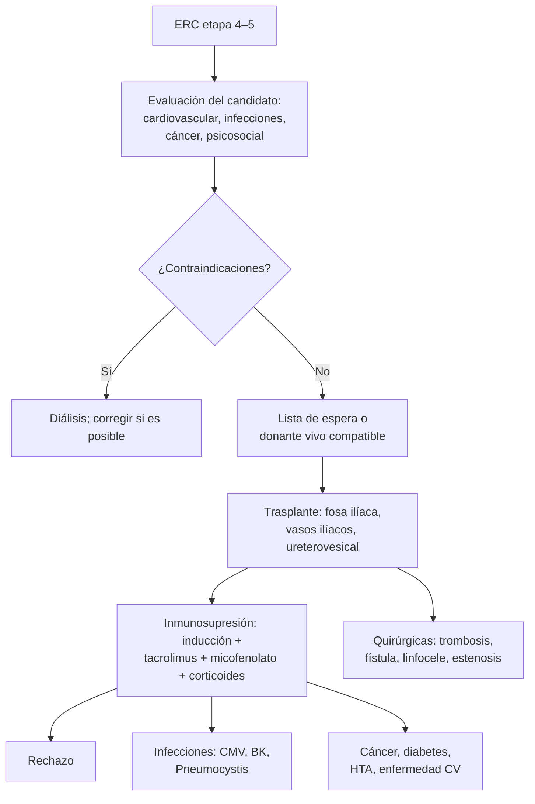

---
tags:
  - Cirugía
  - GES
---

# Trasplante renal: indicaciones y complicaciones

**Subespecialidad**
Urología · Nefrología · Trasplante

**Guías principales**
KDIGO 2020: evaluación y manejo de candidatos a trasplante renal · KDIGO 2009: cuidado del receptor de trasplante renal

**Otras fuentes**
Guía GES de enfermedad renal crónica etapas 4 y 5 (MINSAL) · Ley 20.413 (2010) sobre donación de órganos

**GES**
Sí: la **ERC etapas 4 y 5** incluye el **trasplante renal** como terapia de reemplazo (ver [ERC](../../nefrologia/enfermedad-renal-cronica.md)).

**EUNACOM**
4.03.3.006 Trasplante renal, indicaciones y complicaciones (conocimiento general)

**Revisado**
Octubre 2026

!!! abstract "Resumen en 60 segundos"
    - El trasplante es la **mejor terapia de reemplazo renal**: más **sobrevida** y **calidad de vida** que la diálisis, y menor costo a largo plazo.
    - **Indicación**: **ERC etapa 5** (o etapa 4 avanzada con TFGe **< 20 mL/min**, para un trasplante **anticipado**, ojalá antes de iniciar la diálisis), sin contraindicaciones.
    - **Contraindicaciones**: **cáncer activo**, **infección activa** no controlada, enfermedad cardiovascular o pulmonar grave no corregible, **expectativa de vida corta**, no adherencia, consumo activo de drogas.
    - **Donante vivo** (mejor resultado) o **fallecido**. En Chile toda persona mayor de 18 años es **donante**, salvo que haya manifestado lo contrario (Ley 20.413).
    - El injerto se coloca en la **fosa ilíaca**, con anastomosis a los **vasos ilíacos** y el uréter a la vejiga.
    - **Complicaciones**: **rechazo**, **infecciones** (CMV, BK, *Pneumocystis*), **toxicidad de los inhibidores de calcineurina**, complicaciones **quirúrgicas** (trombosis, fístula urinaria, linfocele, estenosis ureteral), **cáncer** (piel, linfoproliferativo) y **enfermedad cardiovascular** (la primera causa de muerte con injerto funcionante).

## Definición

- **Trasplante renal**: implante de un riñón de un **donante vivo** o **fallecido** en un paciente con ERC terminal.
- **Trasplante anticipado** (*preemptive*): antes de iniciar la diálisis; tiene los mejores resultados.
- **Rechazo**: respuesta inmunológica del receptor contra el injerto.
    - **Hiperagudo**: minutos a horas, por **anticuerpos preformados** (evitado con la **prueba cruzada**).
    - **Agudo**: días a meses; **celular** (linfocitos T) o **mediado por anticuerpos**.
    - **Crónico**: meses a años; fibrosis y pérdida progresiva de la función.

## Epidemiología

### Mundial

- El número de pacientes en **lista de espera** supera con creces la disponibilidad de órganos en casi todos los países.
- La sobrevida del injerto a 1 año supera el **90 %** en la mayoría de los centros; los injertos de **donante vivo** duran más.
- La primera causa de pérdida del injerto a largo plazo es la **muerte con injerto funcionante** (sobre todo cardiovascular) y el **rechazo crónico**.

### Chile

!!! chile "Datos nacionales"
    - El trasplante renal está incluido en el **GES de ERC etapas 4 y 5**.
    - La **Ley 20.413** (2010) estableció que toda persona mayor de 18 años es **donante** de órganos al fallecer, salvo que haya manifestado su voluntad contraria.
    - La procuración y la lista de espera se coordinan a nivel nacional por el MINSAL; la tasa de donantes fallecidos sigue siendo **baja** en comparación con los países con más trasplantes, y la mayoría de los pacientes en lista espera **años** en diálisis.

## Etiología y factores de riesgo

**Causas de ERC terminal que llevan al trasplante**: **nefropatía diabética** (la más frecuente), **nefroesclerosis hipertensiva**, **glomerulopatías**, **riñón poliquístico**, uropatías obstructivas y por reflujo, causa desconocida.

**Factores que empeoran el resultado**: edad avanzada del donante o del receptor, tiempo prolongado en **diálisis**, **sensibilización** (transfusiones, embarazos o trasplantes previos), **isquemia fría** prolongada, **no adherencia** a la inmunosupresión, obesidad, diabetes.

## Fisiopatología

- El sistema inmune del receptor reconoce los **antígenos HLA** del donante como extraños.
- La **inmunosupresión** bloquea la activación de los linfocitos T (**inhibidores de calcineurina**: tacrolimus, ciclosporina), su proliferación (**micofenolato**, azatioprina, inhibidores de mTOR) y la inflamación (**corticoides**). Se agrega una **inducción** (basiliximab o globulina antitimocítica) en el trasplante.
- El precio de la inmunosupresión: **infecciones oportunistas**, **cánceres** asociados a virus (piel, linfoproliferativo por VEB) y efectos metabólicos (diabetes postrasplante, HTA, dislipidemia).

*Figura 1. Etapas del trasplante renal y sus complicaciones. Esquema propio basado en las guías KDIGO 2009 y 2020.*

## Clasificación

**Complicaciones según el tiempo desde el trasplante**:

| Período | Complicaciones principales |
|---|---|
| **Primer mes** | **Quirúrgicas** (sangrado, **trombosis** arterial o venosa, **fístula urinaria**, obstrucción), **función retardada del injerto** (necrosis tubular aguda), rechazo hiperagudo o agudo, infecciones **nosocomiales** (herida, ITU, neumonía, catéter) |
| **1–6 meses** | **Rechazo agudo**, infecciones **oportunistas** (**CMV**, **virus BK**, *Pneumocystis*, *Listeria*, hongos), reactivación de TBC y hepatitis, **toxicidad por inhibidores de calcineurina**, **linfocele**, estenosis ureteral |
| **> 6 meses** | **Rechazo crónico**, infecciones comunitarias, **cánceres** (piel no melanoma, **enfermedad linfoproliferativa postrasplante**), **enfermedad cardiovascular**, diabetes postrasplante, recurrencia de la enfermedad original |

## Clínica

- **Rechazo agudo**: a menudo **asintomático**, con **aumento de la creatinina**; a veces oliguria, fiebre o dolor sobre el injerto.
- **Trombosis vascular**: **anuria** brusca y dolor en el injerto en los primeros días.
- **Fístula urinaria**: salida de líquido por la herida o el drenaje, dolor, caída de la diuresis.
- **Linfocele**: colección junto al injerto que puede comprimir el uréter (hidronefrosis), la vena ilíaca (edema de la pierna) o la vejiga.
- **CMV**: fiebre, leucopenia, compromiso gastrointestinal, hepatitis, neumonitis.
- **Virus BK**: aumento de la creatinina (nefropatía por BK), estenosis ureteral.
- **Toxicidad por tacrolimus/ciclosporina**: aumento de la creatinina, **HTA**, **hiperkalemia**, **temblor**, **diabetes**, hipomagnesemia.

## Diagnóstico

!!! guia "Puntos clave (KDIGO 2020 y 2009)"
    - **Evaluar para trasplante** a todo paciente con ERC progresiva y TFGe **< 30 mL/min**; derivar para el **trasplante anticipado** cuando la TFGe sea **< 20 mL/min** o se espere diálisis en 6–12 meses.
    - **Evaluación del candidato**: riesgo **cardiovascular** (estudio de isquemia en los de alto riesgo), pesquisa de **cáncer** según la edad, **infecciones** (VIH, VHB, VHC, sífilis, TBC latente, CMV, VEB), vacunas al día, evaluación **psicosocial** y de adherencia, compatibilidad **ABO** y **HLA**, anticuerpos anti-HLA y **prueba cruzada**.
    - **Disfunción del injerto** (alza de la creatinina): descartar **obstrucción** (ecografía), problemas **vasculares** (Doppler), **niveles** de tacrolimus, **infección** (urocultivo, PCR de CMV y BK) y, si no se explica, **biopsia del injerto** (rechazo).

## Laboratorio

| Examen | Uso |
|---|---|
| **Creatinina** seriada | Función del injerto |
| **Niveles plasmáticos** de tacrolimus o ciclosporina | Toxicidad o inmunosupresión insuficiente |
| **PCR de CMV y de virus BK** en sangre | Infección y nefropatía por BK |
| **Orina completa, proteinuria, urocultivo** | ITU, recurrencia glomerular, rechazo |
| **Anticuerpos anti-HLA donante específicos** | Rechazo mediado por anticuerpos |
| **Glicemia, potasio, magnesio, lípidos** | Efectos metabólicos de la inmunosupresión |

## Imágenes

| Examen | Uso |
|---|---|
| **Ecografía Doppler del injerto** | Hidronefrosis, linfocele, colecciones, **trombosis** y estenosis de la arteria renal |
| **Biopsia del injerto** | Rechazo, nefropatía por BK, toxicidad por inhibidores de calcineurina, recurrencia |
| **Cintigrafía renal** | Perfusión y función en el posoperatorio inmediato (según el centro) |

## Diagnóstico diferencial

| Alza de la creatinina en un trasplantado | Pista |
|---|---|
| **Rechazo agudo** | Biopsia; anticuerpos donante específicos |
| **Toxicidad por inhibidores de calcineurina** | **Niveles altos**; mejora al bajar la dosis |
| **Obstrucción** (estenosis ureteral, linfocele) | Hidronefrosis en la ecografía |
| **Estenosis o trombosis vascular** | Doppler; HTA de difícil manejo |
| **Infección** (pielonefritis del injerto, BK, CMV) | Urocultivo, PCR |
| **Prerrenal** | Diarrea, deshidratación, fármacos (IECA, AINE) |
| **Recurrencia** de la enfermedad original | Proteinuria (GEFS, nefropatía por IgA, membranosa) |

## Tratamiento

- **Inmunosupresión de mantención** habitual: **tacrolimus + micofenolato + corticoides** en dosis decrecientes.
- **Profilaxis de las infecciones**: **cotrimoxazol** (*Pneumocystis*), **valganciclovir** o vigilancia de CMV según el riesgo (donante positivo y receptor negativo), vacunas inactivadas (las **vivas** están **contraindicadas** tras el trasplante).
- **Rechazo agudo**: **pulsos de corticoides** (rechazo celular); plasmaféresis e inmunoglobulina en el mediado por anticuerpos.
- **Complicaciones quirúrgicas**: reoperación (trombosis, fístula), drenaje o fenestración del **linfocele**, dilatación o reimplante en la estenosis ureteral.
- **Control cardiovascular y metabólico**: presión arterial, lípidos (estatinas), diabetes, peso, **no fumar**.
- **Pesquisa de cáncer**: examen de la **piel** anual (fotoprotección), PAP y mamografía según la edad, vigilancia de la enfermedad linfoproliferativa.
- **Interacciones**: muchos fármacos alteran los niveles de tacrolimus (**macrólidos**, **azoles**, diltiazem y verapamilo los **suben**; **rifampicina** y anticonvulsivantes los **bajan**). Revisar siempre antes de prescribir.

!!! alarma "Consultar de inmediato al equipo de trasplante"
    - **Fiebre** en un trasplantado (riesgo de infección oportunista).
    - **Alza de la creatinina**, **oliguria** o **anuria**.
    - **Dolor** o aumento de volumen sobre el injerto.
    - **Diarrea** o vómitos que impiden tomar la inmunosupresión.
    - Inicio de cualquier fármaco que interactúe con los inhibidores de calcineurina.

## Complicaciones

- **Quirúrgicas**: hemorragia, **trombosis** arterial o venosa, **estenosis de la arteria renal**, **fístula urinaria**, **estenosis ureteral**, **linfocele**, infección de la herida, hernia incisional.
- **Inmunológicas**: rechazo hiperagudo, agudo (celular o humoral) y crónico.
- **Infecciosas**: bacterianas (ITU, la más frecuente), **CMV**, **BK**, *Pneumocystis*, TBC, hongos.
- **Neoplásicas**: **cáncer de piel** no melanoma (el más frecuente), **enfermedad linfoproliferativa postrasplante** (VEB), sarcoma de Kaposi.
- **Metabólicas y cardiovasculares**: **diabetes postrasplante**, HTA, dislipidemia, obesidad, **enfermedad cardiovascular**.
- **Óseas**: osteoporosis (corticoides), hiperparatiroidismo persistente.

## Pronóstico y seguimiento

- El trasplante mejora la **sobrevida** frente a seguir en diálisis en la mayoría de los candidatos.
- Los injertos de **donante vivo** y el trasplante **anticipado** tienen los mejores resultados.
- Seguimiento **de por vida** con el equipo de trasplante: controles frecuentes al inicio y luego más espaciados; la **adherencia** a la inmunosupresión es crítica.

## Perlas para el internado

!!! perla "Para recordar en la sala"
    - **El trasplante es la mejor terapia de reemplazo renal**; derivar para la evaluación cuando la TFGe sea **< 30**, y el trasplante anticipado con TFGe **< 20**.
    - **Fiebre en un trasplantado = infección oportunista** hasta demostrar lo contrario: avisar al equipo de trasplante.
    - **Alza de la creatinina**: ecografía Doppler, niveles de tacrolimus, infecciones y **biopsia**.
    - **Antes de prescribir a un trasplantado, revisar las interacciones** con tacrolimus (claritromicina, fluconazol, rifampicina).
    - **Vacunas vivas contraindicadas** tras el trasplante: vacunar **antes**.
    - **Primera causa de muerte con injerto funcionante: cardiovascular.**
    - **Cáncer más frecuente**: piel no melanoma.

## Preguntas de repaso

??? repaso "1. Paciente diabético con ERC y TFGe de 18 mL/min, sin diálisis aún. ¿Cuándo debe derivarse para un trasplante?"
    - **Ya**: con TFGe **< 20 mL/min** se debe referir para un **trasplante anticipado** (antes de la diálisis), que tiene los mejores resultados.
    - Evaluación cardiovascular, de infecciones y de cáncer, y búsqueda de un **donante vivo**.

??? repaso "2. Trasplantada renal hace 3 meses con fiebre, leucopenia y diarrea. ¿Qué infección sospecha primero?"
    - **CMV** (período de 1–6 meses, máxima inmunosupresión).
    - PCR de CMV en sangre y avisar al equipo de trasplante; tratamiento con **ganciclovir** IV o **valganciclovir**.

??? repaso "3. Trasplantado renal estable que recibe claritromicina por una neumonía. A los 5 días tiene temblor, hiperkalemia y alza de la creatinina. ¿Qué pasó?"
    - **Toxicidad por tacrolimus**: la claritromicina **inhibe el CYP3A4** y sube sus niveles.
    - Medir los **niveles**, ajustar la dosis y elegir un antibiótico sin esta interacción.

??? repaso "4. Paciente trasplantado hace 3 semanas con aumento de volumen de la pierna del lado del injerto, hidronefrosis del injerto y una colección anecoica a su lado en la ecografía. ¿Qué sospecha?"
    - **Linfocele** que comprime el uréter y la vena ilíaca.
    - Drenaje percutáneo o **fenestración** laparoscópica al peritoneo.

??? repaso "5. ¿Cuáles son las principales contraindicaciones del trasplante renal?"
    - **Cáncer activo**, **infección activa** no controlada, enfermedad **cardiovascular** o pulmonar grave no corregible, **expectativa de vida corta**, **no adherencia** grave y consumo activo de drogas.

## Referencias

1. Chadban SJ, Ahn C, Axelrod DA, et al. KDIGO Clinical Practice Guideline on the Evaluation and Management of Candidates for Kidney Transplantation. *Transplantation.* 2020;104(4S1 Suppl 1):S11–S103. doi:[10.1097/TP.0000000000003136](https://doi.org/10.1097/TP.0000000000003136)
2. Kidney Disease: Improving Global Outcomes (KDIGO) Transplant Work Group. KDIGO clinical practice guideline for the care of kidney transplant recipients. *Am J Transplant.* 2009;9(Suppl 3):S1–S155. doi:[10.1111/j.1600-6143.2009.02834.x](https://doi.org/10.1111/j.1600-6143.2009.02834.x)
3. Biblioteca del Congreso Nacional de Chile. Ley 20.413 (2010), sobre donación de órganos. [Búsqueda en bcn.cl](https://www.bcn.cl/leychile/consulta/listaresultadosimple?cadena=20413)
