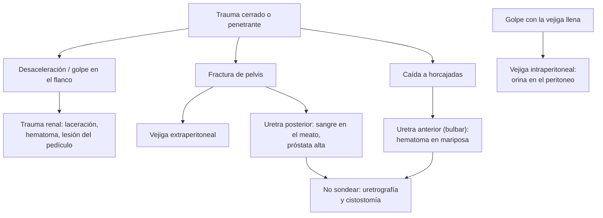

---
tags:
  - Cirugía
  - Urgencia
---

# Trauma urológico (renal, ureteral, vesical, uretral y genital)

**Subespecialidad**
Urología · Trauma · Urgencia

**Guías principales**
Guía EAU de trauma urológico, actualización 2023 (*Eur Urol Focus* 2024) · Guía AUA de urotrauma 2020 (*J Urol* 2021)

**Otras fuentes**
Revisiones del panel de trauma de la EAU sobre lesiones del tracto urinario superior e inferior (*Eur Urol* 2015)

**GES**
Sí, dentro del **politraumatizado grave** (N.° 48) cuando corresponde (ver [trauma](../trauma-y-shock/trauma-y-politraumatizado.md)).

**EUNACOM**
4.03.2.008 Trauma urológico (sospecha) · 4.03.2.009 Traumatismo uretral (diagnóstico específico)

**Revisado**
Octubre 2026

!!! abstract "Resumen en 60 segundos"
    - Se maneja dentro del **ABCDE del trauma**: primero la vía aérea, la ventilación y la **hemorragia**.
    - **Trauma renal**: el más frecuente del trauma urológico. **Hematuria** tras un trauma con **desaceleración** o golpe en el flanco. **TC con contraste y fase tardía** si hay hematuria macroscópica, o microscópica con **shock**, o un mecanismo de alta energía.
        - La mayoría se maneja **sin cirugía** (observación o **angioembolización**). Cirugía solo con **inestabilidad** o hemorragia que no se controla.
    - **Trauma vesical**: asociado a la **fractura de pelvis**. **Cistografía por TC** con contraste por la sonda.
        - **Extraperitoneal**: **sonda Foley** por 2 semanas.
        - **Intraperitoneal**: **cirugía**.
    - **Trauma de uretra**: **sangre en el meato**, imposibilidad de orinar, hematoma perineal "en mariposa" o próstata alta al tacto rectal.
        - **No pasar una sonda Foley** a ciegas: primero **uretrografía retrógrada**. Si hay rotura: **cistostomía suprapúbica**.
    - **Fractura de pene**: chasquido durante el coito, detumescencia inmediata y hematoma "en berenjena": **cirugía urgente**.

## Definición

- **Trauma urológico**: lesión del riñón, el uréter, la vejiga, la uretra o los genitales externos, por **trauma cerrado**, **penetrante** o **iatrogénico** (cirugía, instrumentación).
- **Trauma de uretra posterior**: uretra **membranosa** y prostática; casi siempre con **fractura de pelvis**.
- **Trauma de uretra anterior**: uretra **bulbar** y peneana; típico de la **caída "a horcajadas"** (a caballo sobre un objeto) o de la instrumentación.
- **Fractura de pene**: rotura de la **túnica albugínea** de los cuerpos cavernosos con el pene en **erección**.

## Epidemiología

### Mundial

- El **riñón** es el órgano urológico que más se lesiona en el trauma; la mayoría de las lesiones se deben a **trauma cerrado** (accidentes de tránsito, caídas, deportes).
- Las lesiones de **vejiga** y de **uretra posterior** se asocian sobre todo a la **fractura de pelvis**.
- El **uréter** se lesiona con más frecuencia en forma **iatrogénica** (cirugía ginecológica, colorrectal, urológica) que por trauma externo.
- Las lesiones urológicas muchas veces acompañan a lesiones de otros órganos en el **politraumatizado**.

### Chile

!!! chile "Datos nacionales"
    - No se encontraron series nacionales recientes de trauma urológico.
    - El trauma (accidentes de tránsito, caídas, violencia) es una de las principales causas de muerte en adultos jóvenes en Chile; el manejo inicial del **politraumatizado grave** está cubierto por el GES (ver [trauma](../trauma-y-shock/trauma-y-politraumatizado.md)).

## Etiología y factores de riesgo

| Órgano | Mecanismo típico |
|---|---|
| **Riñón** | **Desaceleración** brusca (accidente de tránsito, caída de altura), golpe directo en el flanco, heridas penetrantes. Más riesgo con un riñón **anormal** (hidronefrosis, tumor) |
| **Uréter** | **Iatrogénico** (histerectomía, cirugía colorrectal, ureteroscopía), heridas penetrantes |
| **Vejiga** | **Fractura de pelvis** (extraperitoneal); golpe con la **vejiga llena** (intraperitoneal: estallido de la cúpula); iatrogénico (cesárea, RTU) |
| **Uretra posterior** | **Fractura de pelvis** con disrupción del anillo pélvico |
| **Uretra anterior** | **Caída a horcajadas**, instrumentación, **sonda** inflada en la uretra, fractura de pene |
| **Pene** | Coito con el pene en erección (flexión brusca), masturbación |
| **Testículo** | Golpe directo (deportes, agresión) |

## Fisiopatología

- **Riñón**: la **desaceleración** puede romper el parénquima (laceraciones, hematoma) o lesionar el **pedículo** (estiramiento de la arteria renal → disección de la íntima y **trombosis**, sin hematuria a veces).
- **Vejiga**:
    - **Extraperitoneal**: un fragmento óseo o el cizallamiento rompe la pared anterior o lateral; la orina queda en el espacio perivesical.
    - **Intraperitoneal**: un golpe con la vejiga **llena** aumenta bruscamente su presión y rompe la **cúpula**; la orina pasa al **peritoneo** (ascitis urinosa, peritonitis química, aumento de la creatinina por reabsorción).
- **Uretra posterior**: la disrupción del anillo pélvico **cizalla** la uretra membranosa del ápex prostático → la próstata queda "**alta**".
- **Uretra anterior**: el bulbo se comprime contra el pubis → contusión o rotura; la sangre y la orina se extienden bajo la fascia de Buck o de Colles (hematoma **en mariposa** en el periné).

*Figura 1. Mecanismos del trauma urológico y su consecuencia práctica. Esquema propio basado en las guías EAU 2023 y AUA 2020.*

## Clasificación

| Trauma renal (AAST) | Lesión | Manejo habitual |
|---|---|---|
| **Grado I** | Contusión o hematoma subcapsular no expansivo | Observación |
| **Grado II** | Laceración < 1 cm sin extravasación urinaria; hematoma perirrenal no expansivo | Observación |
| **Grado III** | Laceración > 1 cm sin compromiso del sistema colector | Observación; angioembolización si hay sangrado activo |
| **Grado IV** | Laceración del **sistema colector** (extravasación de orina), lesión de una arteria o vena segmentaria | Observación ± catéter doble J; angioembolización |
| **Grado V** | Riñón **estallado**, avulsión o trombosis del **pedículo** | Cirugía o angioembolización si hay inestabilidad |

| Trauma vesical | Tratamiento |
|---|---|
| **Contusión** | Observación |
| **Extraperitoneal** (la más frecuente) | **Sonda Foley** por **10–14 días**; cirugía si compromete el cuello vesical, hay fragmentos óseos o se opera por otra causa |
| **Intraperitoneal** | **Reparación quirúrgica** |

## Clínica

- **Trauma renal**:
    - **Hematuria** (macroscópica o microscópica); **su ausencia no descarta** una lesión grave del pedículo.
    - Dolor y **equimosis en el flanco**, fracturas de costillas bajas o de apófisis transversas.
    - **Shock** hemorrágico en las lesiones graves.
- **Trauma ureteral**: a menudo **silente**; se descubre tarde por **fiebre**, dolor en el flanco, urinoma, fístula o hidronefrosis tras una cirugía.
- **Trauma vesical**: **hematuria macroscópica** (casi siempre), dolor suprapúbico, imposibilidad de orinar; en la intraperitoneal, **distensión**, ascitis urinosa y signos peritoneales.
- **Trauma uretral**:
    - **Sangre en el meato uretral**: el signo clave.
    - **Imposibilidad de orinar** con globo vesical.
    - **Hematoma perineal** o escrotal "**en mariposa**" (uretra anterior).
    - **Próstata alta** o no palpable al tacto rectal (uretra posterior; signo poco sensible).
- **Fractura de pene**: **chasquido** durante el coito, **dolor** y **detumescencia** inmediata, hematoma que deforma el pene ("**en berenjena**"); si hay sangre en el meato, sospechar una **lesión uretral** asociada.
- **Trauma testicular**: dolor, hematoma escrotal; sospechar una **rotura testicular** si el testículo no se palpa bien.

## Diagnóstico

!!! guia "Puntos clave (EAU 2023 y AUA 2020)"
    - **TC de abdomen y pelvis con contraste IV y fase tardía (excretora)** en el trauma cerrado con **hematuria macroscópica**, o con **microhematuria y shock** (PAS < 90 mmHg), o con un mecanismo de **desaceleración** importante o lesiones asociadas que sugieran un trauma renal; y en todo trauma **penetrante** del flanco o el abdomen con sospecha de lesión renal.
    - **Cistografía retrógrada** (preferir la **cistografía por TC**, llenando la vejiga con contraste por la sonda) en la **fractura de pelvis con hematuria macroscópica**.
    - **Sangre en el meato** o sospecha de trauma uretral: **uretrografía retrógrada antes** de cualquier intento de sondeo.
    - **Ecografía** en la sospecha de rotura testicular; en la fractura de pene, el diagnóstico es **clínico** (ecografía o RM si hay dudas).

## Laboratorio

| Examen | Uso |
|---|---|
| **Orina completa** (o tira) | Hematuria micro o macroscópica |
| **Hemoglobina seriada**, grupo y Rh | Hemorragia |
| **Creatinina** | Función renal basal; aumento en la rotura **intraperitoneal** de vejiga (reabsorción de orina) |
| **Creatinina en el líquido de drenaje** | Confirma una fuga de **orina** (urinoma, fístula) si es mucho mayor que la plasmática |

## Imágenes

| Examen | Uso |
|---|---|
| **TC con contraste trifásica** (arterial, venosa y excretora) | **Estándar** en el trauma renal y ureteral; detecta extravasación de orina, sangrado activo y lesión del pedículo |
| **Cistografía por TC** | Trauma vesical (intraperitoneal frente a extraperitoneal) |
| **Uretrografía retrógrada** | **Trauma uretral** (antes de sondear) |
| **FAST** | Líquido libre en el politraumatizado; **no** evalúa bien el riñón ni la vejiga |
| **Angiografía** | Diagnóstico y **angioembolización** del sangrado renal |
| **Ecografía escrotal** | Rotura testicular, hematocele |

## Diagnóstico diferencial

| Hallazgo | Diagnósticos |
|---|---|
| **Hematuria tras un trauma** | Trauma renal, vesical o uretral; hematuria por una lesión previa (tumor, hidronefrosis) que el trauma desenmascara |
| **Imposibilidad de orinar tras un trauma** | **Rotura uretral**, lesión medular (vejiga neurogénica), retención por dolor u opioides |
| **Abdomen agudo tras un trauma** | Lesión de vísceras huecas o sólidas (ver [trauma abdominal](../trauma-y-shock/trauma-abdominal.md)), rotura vesical intraperitoneal |
| **Hematoma peneano** | **Fractura de pene** frente a rotura de la vena dorsal (sin chasquido ni detumescencia) |

## Tratamiento

- **ABCDE** y control de la **hemorragia** (ver [trauma](../trauma-y-shock/trauma-y-politraumatizado.md)).
- **Trauma renal**:
    - **Paciente estable**: **manejo no operatorio** (reposo, hemoglobina seriada, control de la hematuria), incluso en los grados altos.
    - **Sangrado activo** en la TC con estabilidad relativa: **angioembolización**.
    - **Inestabilidad** pese a la reanimación, hematoma **expansivo o pulsátil** en la laparotomía, o avulsión del pedículo: **exploración quirúrgica** (reparación o nefrectomía).
    - Extravasación de orina persistente o urinoma: **catéter doble J** o drenaje percutáneo.
- **Trauma ureteral**: catéter doble J en las lesiones parciales; reparación quirúrgica (anastomosis, reimplante) en las completas; nefrostomía si el paciente está inestable o se diagnostica tarde.
- **Trauma vesical**:
    - **Extraperitoneal**: **sonda Foley** por 10–14 días y cistografía antes de retirarla.
    - **Intraperitoneal**: **cirugía** (sutura en dos planos) y sonda.
- **Trauma uretral**:
    - **No forzar** una sonda uretral.
    - **Cistostomía suprapúbica** (percutánea o abierta) para derivar la orina.
    - **Realineación endoscópica** precoz en casos seleccionados por urología.
    - **Uretroplastía diferida** (a los 3 meses o más) para la estenosis secundaria.
- **Fractura de pene**: **reparación quirúrgica urgente** de la túnica albugínea (menos curvatura y disfunción eréctil que el manejo conservador).
- **Rotura testicular**: exploración y reparación quirúrgica precoz.

!!! alarma "Derivar de urgencia"
    - **Hematuria macroscópica** tras un trauma, o microscópica con **shock**: TC y urología.
    - **Sangre en el meato**, imposibilidad de orinar o hematoma perineal: **no sondear**; uretrografía y urología.
    - **Fractura de pelvis con hematuria**: cistografía por TC.
    - **Fractura de pene** o sospecha de **rotura testicular**: cirugía urgente.
    - **Fiebre, dolor en el flanco o salida de orina por un drenaje** tras una cirugía pélvica: lesión **ureteral** iatrogénica.

## Complicaciones

- **Trauma renal**: **hemorragia tardía** (seudoaneurisma, fístula arteriovenosa), **urinoma**, absceso, **hipertensión** (riñón de Page), pérdida de la función renal.
- **Trauma ureteral**: **estenosis**, fístula, urinoma, pérdida renal.
- **Trauma vesical**: fístula, infección, peritonitis (intraperitoneal no tratada).
- **Trauma uretral**: **estenosis uretral**, **disfunción eréctil**, **incontinencia** (uretra posterior).
- **Fractura de pene**: curvatura, nódulos, **disfunción eréctil**.

## Pronóstico y seguimiento

- **Trauma renal manejado sin cirugía**: preserva el riñón en la gran mayoría. Control de la **presión arterial** y, en los grados altos, imagen de control por el riesgo de complicaciones.
- **Trauma uretral**: casi todos necesitan seguimiento por la **estenosis**; la uretroplastía tiene buenos resultados.
- **Fractura de pene reparada**: buena función eréctil en la mayoría.

## Perlas para el internado

!!! perla "Para recordar en la sala"
    - **Sangre en el meato = no pasar la sonda Foley.** Primero uretrografía; si no se puede, cistostomía.
    - **Fractura de pelvis + hematuria = cistografía por TC.**
    - **Hematuria macroscópica tras un trauma = TC con fase tardía.**
    - **La ausencia de hematuria no descarta** una lesión del pedículo renal (desaceleración).
    - **La mayoría del trauma renal se maneja sin cirugía**; la angioembolización detiene el sangrado activo.
    - **Vejiga intraperitoneal = cirugía; extraperitoneal = sonda.**
    - **Chasquido + detumescencia + hematoma en berenjena = fractura de pene**: pabellón.
    - **Fiebre y dolor en el flanco tras una histerectomía**: pensar en una lesión del **uréter**.

## Preguntas de repaso

??? repaso "1. Motociclista de 28 años con fractura de pelvis tras un choque. Tiene sangre en el meato uretral, no ha orinado y la próstata está alta al tacto rectal. ¿Qué hace?"
    - Sospecha de **rotura de la uretra posterior** (fractura de pelvis, sangre en el meato).
    - **No pasar una sonda Foley**. **Uretrografía retrógrada** cuando esté estable.
    - Derivar la orina con una **cistostomía suprapúbica**; urología. Evaluar también la vejiga (cistografía por TC).

??? repaso "2. Conductor de 35 años con choque frontal, estable, con hematuria macroscópica y dolor en el flanco izquierdo. La TC muestra una laceración renal de 2 cm sin extravasación de orina ni sangrado activo. ¿Cómo lo maneja?"
    - **Trauma renal grado III** en un paciente **estable**.
    - **Manejo no operatorio**: reposo, hemoglobina seriada, control de la hematuria y de los signos vitales.
    - Angioembolización si aparece un sangrado activo; cirugía solo si se vuelve inestable.

??? repaso "3. Hombre de 40 años con dolor abdominal difuso y distensión tras un golpe en el hipogastrio con la vejiga llena (estaba ebrio). Tiene hematuria y la creatinina subió. La cistografía por TC muestra contraste entre las asas intestinales. ¿Qué tiene y cómo se trata?"
    - **Rotura vesical intraperitoneal** (ascitis urinosa; la creatinina sube por la reabsorción de orina).
    - **Reparación quirúrgica** de la cúpula vesical y sonda.

??? repaso "4. Hombre de 32 años sintió un chasquido durante el coito, con dolor intenso, pérdida inmediata de la erección y un hematoma que deforma el pene. ¿Qué tiene y qué hace?"
    - **Fractura de pene** (rotura de la túnica albugínea).
    - **Cirugía urgente** para reparar la albugínea. Si hay sangre en el meato o no puede orinar, evaluar una **lesión uretral** asociada.

??? repaso "5. Mujer operada de una histerectomía hace 5 días con fiebre, dolor en el flanco derecho y salida de líquido claro por la vagina. ¿Qué sospecha?"
    - **Lesión ureteral iatrogénica** con **fístula** ureterovaginal (o urinoma).
    - **Uro-TC** (fase excretora) y creatinina en el líquido.
    - Urología: **catéter doble J** o nefrostomía y reparación según la lesión.

## Referencias

1. Serafetinidis E, Campos-Juanatey F, Hallscheidt P, et al. Summary Paper of the Updated 2023 European Association of Urology Guidelines on Urological Trauma. *Eur Urol Focus.* 2024;10(3):475–485. doi:[10.1016/j.euf.2023.08.011](https://doi.org/10.1016/j.euf.2023.08.011)
2. Morey AF, Broghammer JA, Hollowell CMP, et al. Urotrauma Guideline 2020: AUA Guideline. *J Urol.* 2021;205(1):30–35. doi:[10.1097/JU.0000000000001408](https://doi.org/10.1097/JU.0000000000001408)
3. Serafetinides E, Kitrey ND, Djakovic N, et al. Review of the current management of upper urinary tract injuries by the EAU Trauma Guidelines Panel. *Eur Urol.* 2015;67(5):930–936. doi:[10.1016/j.eururo.2014.12.034](https://doi.org/10.1016/j.eururo.2014.12.034)
4. Lumen N, Kuehhas FE, Djakovic N, et al. Review of the current management of lower urinary tract injuries by the EAU Trauma Guidelines Panel. *Eur Urol.* 2015;67(5):925–929. doi:[10.1016/j.eururo.2014.12.035](https://doi.org/10.1016/j.eururo.2014.12.035)
