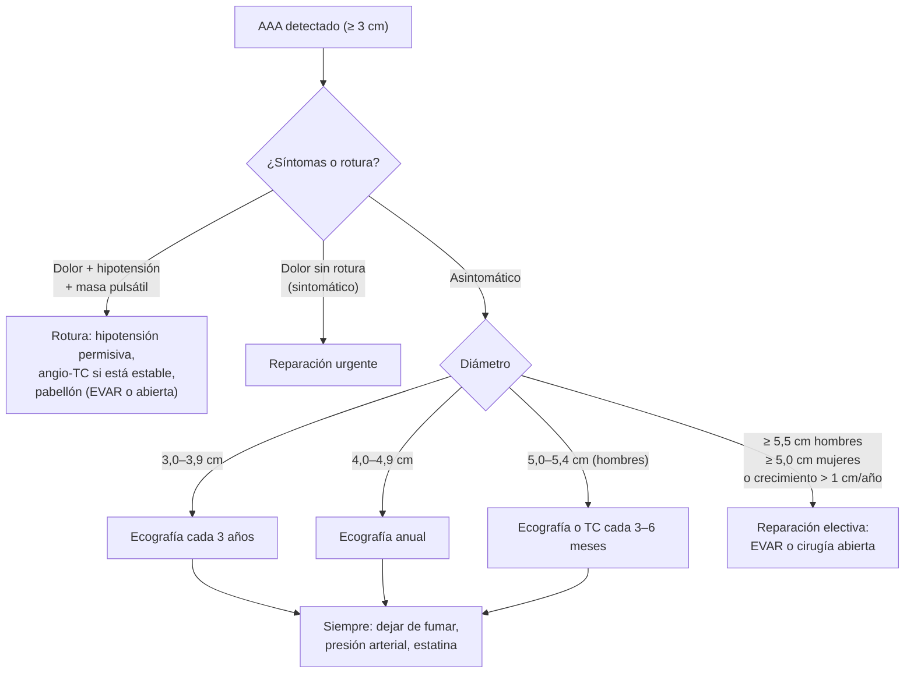

---
tags:
  - Cirugía
  - Urgencia
---

# Aneurisma de aorta abdominal, torácica, femoral y poplítea

**Subespecialidad**
Cirugía vascular · Urgencia

**Guías principales**
Guía ESVS 2024 de aneurismas aortoilíacos abdominales (*Eur J Vasc Endovasc Surg* 2024) · Guía ESVS 2026 de enfermedad de la aorta torácica descendente y toracoabdominal (*Eur J Vasc Endovasc Surg* 2026) · USPSTF 2019: pesquisa del aneurisma de aorta abdominal

**Otras fuentes**
Ver [síndrome aórtico agudo](../../cardiologia/sindrome-aortico-agudo.md)

**GES**
No.

**EUNACOM**
4.01.2.022 Aneurisma de aorta abdominal (sospecha, inicial) · 4.01.1.044 Aneurisma de aorta torácica, femoral y poplítea (sospecha, inicial)

**Revisado**
Octubre 2026

!!! abstract "Resumen en 60 segundos"
    - **Aneurisma**: dilatación permanente de una arteria **≥ 50 %** de su diámetro normal. En la **aorta abdominal**: diámetro **≥ 3 cm**.
    - **AAA**: hombre **> 65 años**, **fumador**, hipertenso, con historia familiar. Casi siempre **asintomático**: se descubre por imagen o como **masa pulsátil** en el epigastrio.
    - **Pesquisa**: **ecografía** única en los **hombres de 65–75 años que han fumado** (USPSTF 2019).
    - **Seguimiento con ecografía** según el diámetro; **reparación** (EVAR o cirugía abierta) cuando mide **≥ 5,5 cm en hombres** o **≥ 5,0 cm en mujeres**, crece **> 1 cm/año** o da **síntomas**.
    - **Rotura**: **dolor abdominal o lumbar** súbito + **hipotensión** + **masa pulsátil** = **pabellón**. **Hipotensión permisiva**; no retrasar con exámenes si está inestable.
    - Manejo médico: **dejar de fumar**, control de la **presión** arterial, **estatinas** y antiagregación.
    - **Aneurisma poplíteo**: el periférico más frecuente; a menudo **bilateral** y asociado a un **AAA**; su riesgo es la **trombosis** y la **embolia** (isquemia aguda), no la rotura.
    - **Femoral**: muchos son **seudoaneurismas** tras una **punción** arterial (masa pulsátil en la ingle tras un cateterismo).

## Definición

- **Aneurisma verdadero**: dilatación de **las tres capas** de la pared arterial, **≥ 1,5 veces** el diámetro normal.
- **AAA**: aorta abdominal infrarrenal con diámetro **≥ 3,0 cm**.
- **Seudoaneurisma** (falso aneurisma): **hematoma pulsátil** contenido por tejidos vecinos, comunicado con la luz arterial por un defecto de la pared (punción, trauma, infección, dehiscencia de una anastomosis).
- **Aneurisma de aorta torácica**: de la aorta ascendente, del arco o descendente; **toracoabdominal** si compromete ambos segmentos.
- **Aneurisma micótico**: aneurisma de origen **infeccioso**.

## Epidemiología

### Mundial

- La prevalencia del AAA en los hombres mayores de 65 años **ha disminuido** en las últimas décadas, en paralelo a la baja del **tabaquismo**.
- Es varias veces **más frecuente en hombres**, pero en las **mujeres** tiene mayor riesgo de **rotura** con diámetros menores.
- La **rotura** tiene una mortalidad global muy alta (muchos pacientes mueren antes de llegar al hospital).
- El riesgo de rotura aumenta con el **diámetro**: es bajo bajo los 5 cm y sube marcadamente sobre los 5,5–6 cm.
- El **aneurisma poplíteo** es el periférico más frecuente; se asocia con frecuencia a aneurismas **contralaterales** y a **AAA**.

### Chile

!!! chile "Datos nacionales"
    - No se encontraron datos nacionales recientes de prevalencia ni un programa de pesquisa poblacional del AAA en Chile.
    - Los factores de riesgo principales (**tabaquismo**, **HTA**, edad) son frecuentes en la población chilena (ver [HTA](../../cardiologia/hipertension-arterial.md)).
    - El AAA no es un problema de salud GES.

## Etiología y factores de riesgo

| Factor | Comentario |
|---|---|
| **Tabaquismo** | El **más importante**: aumenta la aparición, el crecimiento y la rotura |
| **Edad > 65 años** y **sexo masculino** | |
| **Historia familiar** de AAA | Riesgo en los familiares de primer grado |
| **Hipertensión**, aterosclerosis, EPOC | |
| **Enfermedades del tejido conectivo** | **Marfan**, Ehlers-Danlos vascular, Loeys-Dietz, válvula aórtica bicúspide (aorta torácica) |
| **Infección** | Aneurisma **micótico** (endocarditis, *Salmonella*), **sífilis** (aorta ascendente) |
| **Vasculitis** | Arteritis de células gigantes, Takayasu (aorta torácica) |
| **Diabetes** | Asociada a **menor** riesgo de AAA |

## Fisiopatología

- **Degradación de la matriz** de la media (elastina y colágeno) por **inflamación crónica** y **metaloproteinasas**, más el estrés hemodinámico.
- **Ley de Laplace**: la tensión de la pared aumenta con el **radio** → mientras más grande el aneurisma, más rápido crece y más riesgo de **rotura**.
- **Trombo mural**: fuente de **embolias** distales (dedo azul) y, en el poplíteo, de **trombosis** completa.
- **Rotura**: hacia el **retroperitoneo** (contenida transitoriamente: permite llegar al hospital) o hacia la cavidad peritoneal (muerte rápida).

*Figura 1. Manejo del aneurisma de aorta abdominal según el diámetro. Esquema propio basado en la guía ESVS 2024.*

## Clasificación

**AAA según el diámetro (ESVS 2024)**:

| Diámetro | Conducta |
|---|---|
| **< 3,0 cm** | No es aneurisma |
| **3,0–3,9 cm** | Ecografía cada **3 años** |
| **4,0–4,9 cm** | Ecografía **anual** |
| **5,0–5,4 cm** (hombres) | Ecografía o TC cada **3–6 meses** |
| **≥ 5,5 cm (hombres) / ≥ 5,0 cm (mujeres)** | **Reparación electiva** |
| **Crecimiento > 1 cm/año** o **síntomas** | **Reparación** |

**Aneurismas periféricos**:

| Aneurisma | Características | Riesgo principal |
|---|---|---|
| **Poplíteo** | Masa pulsátil en el hueco poplíteo; con frecuencia **bilateral** y con AAA asociado | **Trombosis** y **embolia distal** (isquemia aguda); rara vez rotura |
| **Femoral verdadero** | Masa pulsátil en la ingle; asociado a otros aneurismas | Trombosis, embolia, rotura |
| **Seudoaneurisma femoral** | Tras un **cateterismo** o punción | Crecimiento, rotura, compresión |
| **Aorta torácica** | Habitualmente asintomático; a veces **disfonía** (recurrente izquierdo), disfagia, tos, dolor | **Rotura** y **disección** |

## Clínica

- **AAA no roto**: **asintomático** en la mayoría; **masa pulsátil** y **expansiva** en el epigastrio o periumbilical (difícil de palpar en los obesos); embolias distales ("**síndrome del dedo azul**").
- **AAA sintomático** sin rotura: **dolor** abdominal o lumbar nuevo, sensibilidad a la palpación del aneurisma: reparación **urgente**.
- **AAA roto**: tríada clásica de **dolor abdominal o lumbar** súbito (a veces irradiado al flanco o la ingle, simulando un **cólico renal**), **hipotensión/shock** y **masa pulsátil**; equimosis en el flanco o periumbilical.
- **Aneurisma poplíteo**: masa pulsátil en el hueco poplíteo, a menudo asintomática; o **isquemia aguda** de la pierna por trombosis o embolia.
- **Seudoaneurisma femoral**: masa **pulsátil** y dolorosa en la ingle con **soplo**, días después de un cateterismo.
- **Aneurisma de aorta torácica**: casi siempre hallazgo; ensanchamiento mediastínico en la radiografía; síntomas compresivos.

## Diagnóstico

!!! guia "Puntos clave (ESVS 2024, USPSTF 2019)"
    - **Pesquisa**: ecografía **única** en los **hombres de 65–75 años que han fumado** (USPSTF 2019, recomendación B); individualizar en los hombres que nunca fumaron y en las mujeres con factores de riesgo.
    - **Ecografía abdominal**: diagnóstico y **seguimiento** del AAA.
    - **Angio-TC**: planificación de la reparación (anatomía para EVAR) y sospecha de **rotura** en el paciente **estable**.
    - **Paciente inestable** con sospecha de rotura y AAA conocido o masa pulsátil: **pabellón** directo (eco al lado de la cama si está disponible).
    - **Aneurisma poplíteo**: **eco Doppler**; buscar un aneurisma **contralateral** y un **AAA**.
    - **Pacientes con AAA**: evaluar el riesgo cardiovascular (alta prevalencia de cardiopatía coronaria).

## Laboratorio

| Examen | Uso |
|---|---|
| **Hemograma, grupo y Rh, pruebas cruzadas** | Rotura; preoperatorio |
| **Creatinina** | Antes del contraste y la cirugía |
| **Perfil lipídico, glicemia** | Riesgo cardiovascular |
| **Hemocultivos, VDRL** | Sospecha de aneurisma micótico o sifilítico |

## Imágenes

| Examen | Uso |
|---|---|
| **Ecografía abdominal** | **Pesquisa** y **seguimiento** del AAA |
| **Angio-TC** | Planificación de la reparación; **rotura** en el paciente estable |
| **Eco Doppler** | Aneurismas **poplíteos** y **femorales**; seudoaneurismas |
| **Radiografía de tórax** | Mediastino ancho (aneurisma torácico) |
| **Angio-RM** | Alternativa sin contraste yodado |

## Diagnóstico diferencial

| Cuadro | Claves |
|---|---|
| **Cólico renal** | El AAA roto puede imitarlo: en un **hombre > 60 años** con "primer cólico renal", **descartar un AAA** (ecografía) |
| **Disección aórtica** | Dolor desgarrador, asimetría de pulsos (ver [síndrome aórtico agudo](../../cardiologia/sindrome-aortico-agudo.md)) |
| **Pancreatitis**, úlcera perforada, isquemia mesentérica | Dolor abdominal con shock |
| **Masa pulsátil transmitida** | Aorta normal en una persona delgada o con lordosis; tumor sobre la aorta |
| **Masa poplítea** | **Quiste de Baker** (no pulsátil) |
| **Masa inguinal** | Hernia, adenopatía, seudoaneurisma (pulsátil, soplo) |

## Tratamiento

### Manejo médico (todos)

- **Dejar de fumar** (la medida más importante).
- Control de la **presión arterial**.
- **Estatina** y **antiagregación** (aspirina) por el riesgo cardiovascular.
- Ningún fármaco ha demostrado frenar de forma clara el crecimiento del aneurisma.

### Reparación del AAA

| Técnica | Características |
|---|---|
| **EVAR** (reparación endovascular) | **Endoprótesis** por vía femoral; **menor mortalidad precoz**; requiere anatomía adecuada y **seguimiento** de por vida con imágenes (endofugas) |
| **Cirugía abierta** | Interposición de una **prótesis** vascular; mayor morbilidad inicial, más durable, menos reintervenciones |

### AAA roto

!!! dosis "Manejo"
    - **Llamar a cirugía vascular** y activar el pabellón.
    - **Hipotensión permisiva**: PAS en torno a **70–90 mmHg** con el paciente consciente; evitar la sobrecarga de fluidos (empeora el sangrado).
    - Dos vías venosas gruesas, **sangre** y hemoderivados (protocolo de transfusión masiva), ácido tranexámico según el protocolo local.
    - **Angio-TC** solo si está **estable**; si está inestable, **pabellón** directo.
    - **Reparación** urgente: **EVAR** si la anatomía lo permite (preferida por la ESVS 2024) o **cirugía abierta**.

### Aneurismas periféricos y torácicos

| Aneurisma | Tratamiento |
|---|---|
| **Poplíteo** | Reparación (bypass con exclusión o endoprótesis) en los **sintomáticos** y en los asintomáticos grandes o con trombo; **isquemia aguda**: trombólisis o trombectomía y bypass |
| **Seudoaneurisma femoral iatrogénico** | **Compresión guiada por ecografía** o **inyección de trombina** guiada por ecografía; cirugía si es grande, infectado o hay compromiso cutáneo |
| **Aorta torácica descendente** | Seguimiento con imágenes; reparación (**TEVAR** u abierta) sobre el umbral de diámetro según la ubicación y el riesgo, o si crece rápido o da síntomas |

!!! alarma "Derivar de urgencia"
    - **Dolor abdominal o lumbar con hipotensión** en un adulto mayor: descartar un **AAA roto**.
    - **AAA conocido con dolor** (sintomático).
    - **Isquemia aguda** de la pierna con masa poplítea pulsátil.
    - **Masa inguinal pulsátil** que crece tras un cateterismo.

## Complicaciones

- **Rotura** (la más grave).
- **Embolia distal** (dedo azul) y **trombosis**.
- **Fístula aortoentérica** (hemorragia digestiva en un paciente con prótesis aórtica) o aortocava.
- **Posoperatorias**: **isquemia de colon** (sobre todo sigmoides), **LRA**, isquemia medular (aorta torácica), **endofugas** y migración tras el EVAR, infección de la prótesis.

## Pronóstico y seguimiento

- Los AAA pequeños tienen bajo riesgo de rotura y se siguen con ecografía.
- La reparación **electiva** tiene baja mortalidad; la del AAA **roto**, alta.
- Tras el **EVAR**: imágenes de control de por vida (endofugas, crecimiento del saco).
- Controlar el **riesgo cardiovascular**: la causa de muerte más frecuente en estos pacientes es cardiovascular.

## Perlas para el internado

!!! perla "Para recordar en la sala"
    - **AAA = ≥ 3 cm.** Reparar con **≥ 5,5 cm** (hombres) o **≥ 5,0 cm** (mujeres), crecimiento **> 1 cm/año** o **síntomas**.
    - **Pesquisa: ecografía única en hombres de 65–75 años que han fumado.**
    - **"Primer cólico renal" en un hombre mayor = descartar AAA roto.**
    - **AAA roto inestable = pabellón**, no TC. **Hipotensión permisiva.**
    - **Dejar de fumar** es lo más eficaz para frenar el crecimiento.
    - **Aneurisma poplíteo: buscar el contralateral y el AAA**; su riesgo es la isquemia aguda.
    - **Masa pulsátil en la ingle tras un cateterismo = seudoaneurisma** → eco Doppler.

## Preguntas de repaso

??? repaso "1. Hombre de 68 años, exfumador, sin estudios previos, en un control de salud. ¿Qué pesquisa le ofrece?"
    - **Ecografía abdominal única** para descartar un **AAA** (hombre de 65–75 años que ha fumado).

??? repaso "2. Ecografía con un AAA de 4,3 cm en un hombre de 70 años asintomático. ¿Conducta?"
    - **Seguimiento** con ecografía **anual** (4,0–4,9 cm), **dejar de fumar**, control de la presión arterial, **estatina** y aspirina.
    - Reparar si llega a **5,5 cm**, crece **> 1 cm/año** o da síntomas.

??? repaso "3. Hombre de 74 años, hipertenso y fumador, con dolor lumbar izquierdo súbito, sudoroso, PA 80/50 y una masa pulsátil periumbilical. ¿Diagnóstico y manejo?"
    - **AAA roto**.
    - Llamar a cirugía vascular, **hipotensión permisiva**, sangre y hemoderivados, y **pabellón inmediato** (EVAR o abierta). No retrasar con una TC si está inestable.

??? repaso "4. Hombre de 72 años con dolor brusco, frialdad y palidez de la pierna derecha. Se palpa una masa pulsátil en el hueco poplíteo izquierdo. ¿Qué sospecha?"
    - **Isquemia aguda por trombosis o embolia de un aneurisma poplíteo** derecho (los aneurismas poplíteos suelen ser **bilaterales**).
    - Heparina, cirugía vascular (trombólisis o trombectomía y bypass); estudiar el poplíteo contralateral y la **aorta abdominal**.

??? repaso "5. Mujer de 65 años con una masa pulsátil, dolorosa y con soplo en la ingle derecha, 3 días después de una angiografía coronaria por vía femoral. ¿Qué es y cómo se trata?"
    - **Seudoaneurisma femoral** iatrogénico.
    - **Eco Doppler**; **compresión guiada por ecografía** o **inyección de trombina** guiada por ecografía; cirugía si falla o hay complicaciones.

## Referencias

1. Wanhainen A, Van Herzeele I, Bastos Goncalves F, et al. Editor's Choice – European Society for Vascular Surgery (ESVS) 2024 Clinical Practice Guidelines on the Management of Abdominal Aorto-Iliac Artery Aneurysms. *Eur J Vasc Endovasc Surg.* 2024;67(2):192–331. doi:[10.1016/j.ejvs.2023.11.002](https://doi.org/10.1016/j.ejvs.2023.11.002)
2. Wanhainen A, Gombert A, Antoniou GA, et al. European Society for Vascular Surgery (ESVS) 2026 Clinical Practice Guidelines on the Management of Descending Thoracic and Thoraco-Abdominal Aortic Diseases – Editor's Choice. *Eur J Vasc Endovasc Surg.* 2026;71(2):172–270. doi:[10.1016/j.ejvs.2025.12.050](https://doi.org/10.1016/j.ejvs.2025.12.050)
3. US Preventive Services Task Force, Owens DK, Davidson KW, et al. Screening for Abdominal Aortic Aneurysm: US Preventive Services Task Force Recommendation Statement. *JAMA.* 2019;322(22):2211–2218. doi:[10.1001/jama.2019.18928](https://doi.org/10.1001/jama.2019.18928)
