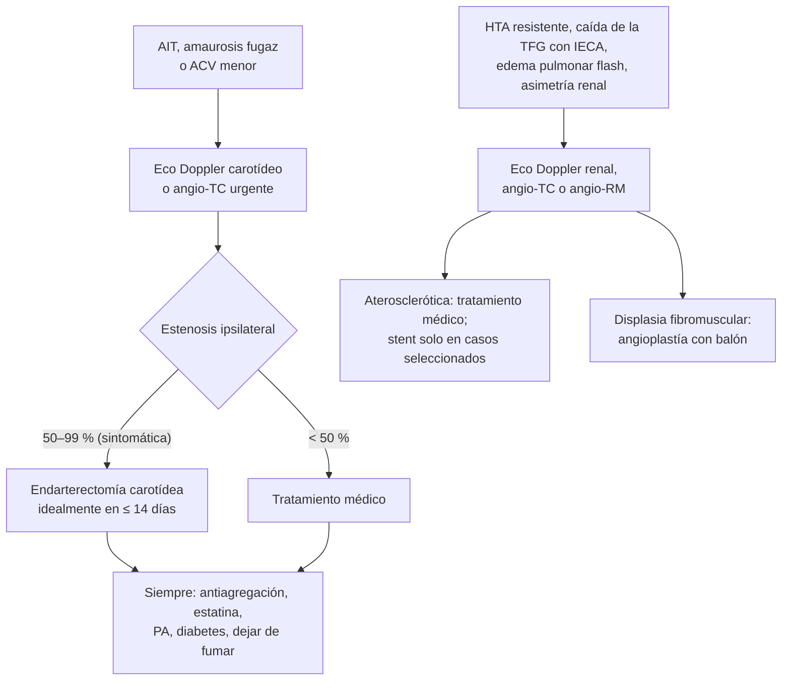

---
tags:
  - Cirugía
---

# Enfermedad renovascular e insuficiencia cerebrovascular (estenosis carotídea)

**Subespecialidad**
Cirugía vascular · Nefrología · Neurología

**Guías principales**
Guía ESC 2024 de enfermedad arterial periférica y aórtica (*Eur Heart J* 2024) · Guía ESVS 2023 de enfermedad aterosclerótica carotídea y vertebral (*Eur J Vasc Endovasc Surg* 2023)

**Otras fuentes**
Ensayos ASTRAL (2009) y CORAL (2014) en la estenosis de arteria renal · Ver [HTA](../../cardiologia/hipertension-arterial.md) y [ACV](../../neurologia/accidente-cerebrovascular.md)

**GES**
No como tal (el **ACV isquémico** en personas de 15 años y más sí es GES).

**EUNACOM**
4.01.1.045 Enfermedad renovascular · 4.01.1.046 Insuficiencia cerebrovascular (sospecha, inicial)

**Revisado**
Octubre 2026

!!! abstract "Resumen en 60 segundos"
    - **Estenosis de arteria renal**: causa de **HTA secundaria** y de **nefropatía isquémica**.
        - **Aterosclerótica** (la más frecuente): adulto mayor con vasculopatía, **HTA resistente**, **caída de la función renal > 30 % al iniciar un IECA/ARA-II**, **edema pulmonar súbito** ("flash"), asimetría renal.
        - **Displasia fibromuscular**: **mujer joven** con HTA, imagen "en **collar de perlas**".
        - Diagnóstico: **eco Doppler**, angio-TC o angio-RM.
        - Tratamiento de la aterosclerótica: **médico** (antihipertensivos, estatina, antiagregante) en la mayoría: la **angioplastía con stent no mostró beneficio** en general (ASTRAL, CORAL); reservarla para el edema pulmonar recurrente o el deterioro renal rápido. La **displasia fibromuscular** responde bien a la **angioplastía** sin stent.
    - **Estenosis carotídea**: causa de **ACV isquémico** y **AIT** por embolia desde la placa.
        - **Sintomática** (AIT, amaurosis fugaz o ACV menor del territorio en los últimos 6 meses) con estenosis **50–99 %** → **endarterectomía** (idealmente **en las primeras 2 semanas**) o stent.
        - **Asintomática**: tratamiento médico intensivo; la endarterectomía se considera en casos seleccionados de alto riesgo (estenosis 60–99 %).
        - **Todos**: **antiagregación**, **estatina** de alta intensidad, control de la PA y la diabetes, **dejar de fumar**.

## Definición

- **Enfermedad renovascular**: estrechamiento de la arteria renal o sus ramas que puede causar **hipertensión renovascular** y/o **nefropatía isquémica**.
- **Hipertensión renovascular**: HTA causada por la **hipoperfusión renal** con activación del sistema renina-angiotensina.
- **Insuficiencia cerebrovascular**: disminución del flujo sanguíneo cerebral por enfermedad de las arterias carótidas o vertebrales (estenosis, oclusión), que produce **AIT** o **ACV**.
- **Estenosis carotídea sintomática**: con un evento isquémico **ipsilateral** (AIT, amaurosis fugaz, ACV no discapacitante) en los **últimos 6 meses**.

## Epidemiología

### Mundial

- La **estenosis aterosclerótica** de la arteria renal es frecuente en los adultos mayores con enfermedad vascular en otros territorios (coronaria, periférica), y es una causa de HTA secundaria.
- La **displasia fibromuscular** afecta sobre todo a **mujeres** de 15 a 50 años.
- La **enfermedad carotídea** aterosclerótica causa una proporción importante de los **ACV isquémicos**; el riesgo de un nuevo evento es **máximo en los primeros días** tras un AIT o un ACV menor.

### Chile

!!! chile "Datos nacionales"
    - El **ACV isquémico** es GES y una de las primeras causas de muerte y discapacidad en Chile (ver [ACV](../../neurologia/accidente-cerebrovascular.md)).
    - La **HTA** es muy prevalente en la población adulta chilena; la estenosis de la arteria renal se busca en la HTA **resistente** o con las claves clínicas (ver [HTA](../../cardiologia/hipertension-arterial.md)).
    - No se encontraron datos nacionales recientes de prevalencia de la estenosis carotídea ni renovascular.

## Etiología y factores de riesgo

| Entidad | Causas |
|---|---|
| **Estenosis de arteria renal** | **Aterosclerosis** (~ 90 %: ostial, adulto mayor), **displasia fibromuscular** (mujer joven, tercio medio-distal), vasculitis (Takayasu), disección, compresión extrínseca |
| **Estenosis carotídea** | **Aterosclerosis** de la bifurcación carotídea; disección (jóvenes, trauma cervical), vasculitis, radioterapia cervical, displasia fibromuscular |
| **Factores de riesgo comunes** | **Tabaco**, **HTA**, **diabetes**, **dislipidemia**, edad, sexo masculino |

## Fisiopatología

- **Renovascular**: la hipoperfusión renal activa el sistema **renina-angiotensina-aldosterona** → vasoconstricción y retención de sodio → **HTA**. Si la estenosis es bilateral (o de riñón único), los **IECA/ARA-II** bloquean la vasoconstricción de la arteriola eferente que mantiene la filtración → **caída brusca de la TFG**. La retención de volumen favorece el **edema pulmonar súbito**.
- **Carotídea**: la placa de la bifurcación provoca sobre todo **embolias** (trombo o fragmentos de placa) hacia la arteria cerebral media o la oftálmica (**amaurosis fugaz**); con menos frecuencia, hipoperfusión por estenosis crítica u oclusión.

*Figura 1. Enfoque de la estenosis carotídea sintomática y de la estenosis de la arteria renal. Esquema propio basado en las guías ESVS 2023 y ESC 2024.*

## Clasificación

| | **Aterosclerótica renal** | **Displasia fibromuscular** |
|---|---|---|
| **Paciente** | Hombre mayor, vasculopatía, fumador, diabético | **Mujer joven** (15–50 años) |
| **Ubicación** | **Ostial** o tercio proximal | **Tercio medio y distal** |
| **Imagen** | Estenosis focal ostial | "**Collar de perlas**" |
| **Respuesta a la revascularización** | Pobre en general | **Buena** (angioplastía con balón; curación de la HTA en muchos) |

**Estenosis carotídea**:

| Situación | Conducta habitual (ESVS 2023) |
|---|---|
| **Sintomática 70–99 %** | **Endarterectomía** recomendada, lo antes posible (**≤ 14 días**) |
| **Sintomática 50–69 %** | Endarterectomía **recomendable** (beneficio menor) |
| **Sintomática < 50 %** | **Tratamiento médico** |
| **Asintomática 60–99 %** | **Tratamiento médico intensivo**; endarterectomía en pacientes seleccionados con características de alto riesgo de ACV y expectativa de vida razonable |
| **Oclusión completa** | Tratamiento médico |

## Clínica

- **Renovascular**:
    - **HTA de inicio** antes de los 30 años (displasia fibromuscular) o después de los 55 años, **HTA resistente** o acelerada, HTA que empeora bruscamente.
    - **Caída de la TFG > 30 %** al iniciar un **IECA o ARA-II**.
    - **Edema pulmonar súbito** ("flash") recurrente sin cardiopatía que lo explique.
    - **Asimetría renal** (> 1,5 cm) en la ecografía.
    - **Soplo abdominal** (sistólico-diastólico).
    - **Hipokalemia** (hiperaldosteronismo secundario).
- **Carotídea**:
    - **Asintomática**: soplo carotídeo (poco sensible y poco específico) o hallazgo de imagen.
    - **AIT** del territorio carotídeo: **debilidad** o **alteración sensitiva** de un hemicuerpo, **afasia** (hemisferio dominante).
    - **Amaurosis fugaz**: pérdida visual **monocular** transitoria "como una cortina" (embolia a la arteria oftálmica).
    - **ACV** isquémico del territorio de la arteria cerebral media.
- **Vertebrobasilar**: vértigo con otros signos de tronco, diplopía, disartria, ataxia, déficits bilaterales.

## Diagnóstico

!!! guia "Puntos clave (ESC 2024, ESVS 2023)"
    - **Renovascular**: **eco Doppler renal** (primer examen); **angio-TC** o **angio-RM** para confirmar; angiografía si se planifica una revascularización. Buscar la estenosis solo si el resultado **cambiaría el manejo**.
    - **Carotídea**: **eco Doppler carotídeo** urgente tras un AIT o ACV del territorio carotídeo; **angio-TC** o **angio-RM** para confirmar el grado y planificar la cirugía.
    - **No se recomienda la pesquisa poblacional** de la estenosis carotídea en personas asintomáticas.

## Laboratorio

| Examen | Uso |
|---|---|
| **Creatinina, TFG**, electrolitos | Función renal; **hipokalemia** |
| **Orina completa, albuminuria** | Daño renal |
| **Perfil lipídico, glicemia, HbA1c** | Riesgo cardiovascular |
| **Aldosterona y renina** | Diferencial con el hiperaldosteronismo primario en la HTA resistente |

## Imágenes

| Examen | Uso |
|---|---|
| **Eco Doppler renal** | Velocidades de flujo, índices de resistencia, tamaño renal |
| **Angio-TC / angio-RM renal** | Confirmación anatómica |
| **Eco Doppler carotídeo** | **Grado** de estenosis, características de la placa |
| **Angio-TC / angio-RM de vasos del cuello** | Confirmación y planificación |
| **TC o RM de cerebro** | Infartos previos, diferencial |

## Diagnóstico diferencial

| Cuadro | Diferenciales |
|---|---|
| **HTA secundaria** | **Hiperaldosteronismo primario**, **apnea del sueño**, enfermedad renal parenquimatosa, feocromocitoma, Cushing, coartación aórtica, fármacos (AINE, anticonceptivos) |
| **Caída de la TFG con IECA** | Estenosis renal bilateral, hipovolemia, AINE, insuficiencia cardíaca |
| **Déficit neurológico transitorio** | **AIT**, migraña con aura, **crisis epiléptica** (parálisis de Todd), **hipoglicemia**, síncope, vértigo periférico |
| **Pérdida visual monocular transitoria** | **Amaurosis fugaz**, arteritis de células gigantes, oclusión de la arteria central de la retina, glaucoma agudo |

## Tratamiento

### Estenosis de la arteria renal

- **Aterosclerótica**: **tratamiento médico óptimo** en la mayoría:
    - **Antihipertensivos** (incluidos **IECA/ARA-II** con control de la creatinina y el potasio, si se toleran).
    - **Estatina**, **antiagregante**, **dejar de fumar**, control de la diabetes.
    - **Angioplastía con stent**: **no** de rutina (los ensayos ASTRAL y CORAL no mostraron beneficio en la presión, la función renal ni los eventos frente al tratamiento médico). Considerar en casos seleccionados: **edema pulmonar súbito recurrente**, **deterioro renal rápido** inexplicado o HTA verdaderamente refractaria con estenosis significativa.
- **Displasia fibromuscular**: **angioplastía con balón** (sin stent) en la HTA de reciente comienzo o difícil de controlar.

### Estenosis carotídea

!!! dosis "Manejo médico intensivo (todos)"
    - **Antiagregación**: aspirina o clopidogrel; **doble antiagregación** de corta duración tras un AIT o ACV menor según el protocolo de ACV.
    - **Estatina de alta intensidad** (meta de C-LDL según el riesgo, < 55 mg/dL en prevención secundaria).
    - **Presión arterial** < 130/80 mmHg en general, **control de la diabetes**, **dejar de fumar**, actividad física.

- **Endarterectomía carotídea**: resección de la placa de la bifurcación; en la estenosis **sintomática 50–99 %**, **lo antes posible** (idealmente en las **primeras 2 semanas**), cuando el beneficio es máximo.
- **Stent carotídeo**: alternativa en pacientes de **alto riesgo quirúrgico**, cuello hostil (radioterapia, cirugía previa) o reestenosis.

!!! alarma "Derivar con prioridad"
    - **AIT** o **amaurosis fugaz**: estudio urgente (eco Doppler carotídeo) y evaluación por neurología y cirugía vascular.
    - **Edema pulmonar súbito** recurrente o **deterioro rápido** de la función renal con HTA.
    - **Caída de la TFG > 30 %** al iniciar un IECA/ARA-II.
    - **HTA en una mujer joven** sin otra causa (displasia fibromuscular).

## Complicaciones

- **Renovascular**: **ERC** (nefropatía isquémica), **edema pulmonar**, HTA maligna, complicaciones de la angioplastía (disección, ateroembolia).
- **Carotídea**: **ACV** isquémico; complicaciones de la endarterectomía (**ACV perioperatorio**, infarto, **hematoma cervical** con compromiso de la vía aérea, lesión de nervios craneales —hipogloso, laríngeo recurrente—, **síndrome de hiperperfusión** cerebral).

## Pronóstico y seguimiento

- La estenosis aterosclerótica renal marca un **alto riesgo cardiovascular**; el control de los factores de riesgo es lo más importante.
- La **displasia fibromuscular** tratada tiene buen pronóstico de la presión arterial.
- Tras un AIT con estenosis carotídea significativa, la **endarterectomía precoz** reduce mucho el riesgo de ACV.
- Seguimiento con eco Doppler y control del riesgo cardiovascular.

## Perlas para el internado

!!! perla "Para recordar en la sala"
    - **Creatinina que sube > 30 % al iniciar un IECA = pensar en estenosis renal bilateral.**
    - **Edema pulmonar flash con riñones asimétricos = estenosis de arteria renal.**
    - **Mujer joven con HTA = displasia fibromuscular** (collar de perlas): angioplastía con balón.
    - **Estenosis renal aterosclerótica: el stent no es la regla** (ASTRAL, CORAL).
    - **Amaurosis fugaz = AIT carotídeo** → eco Doppler carotídeo urgente.
    - **Estenosis carotídea sintomática 70–99 % = endarterectomía en ≤ 14 días.**
    - **Soplo carotídeo** no es sinónimo de estenosis importante (ni su ausencia la descarta).
    - **Todos: estatina, antiagregante, PA y dejar de fumar.**

## Preguntas de repaso

??? repaso "1. Hombre de 68 años, fumador, con HTA resistente a tres fármacos. Al iniciar enalapril, su creatinina sube de 1,2 a 2,0 mg/dL. Tuvo dos episodios de edema pulmonar súbito con función ventricular normal. ¿Qué sospecha y cómo lo estudia?"
    - **Estenosis aterosclerótica de la arteria renal** (probablemente bilateral).
    - **Eco Doppler renal** y **angio-TC o angio-RM**; suspender o ajustar el IECA. Por el **edema pulmonar recurrente**, es candidato a evaluar una **revascularización** (stent).

??? repaso "2. Mujer de 28 años con HTA de reciente diagnóstico, sin antecedentes familiares, con un soplo abdominal. ¿Qué sospecha y cuál es el tratamiento?"
    - **Displasia fibromuscular** de la arteria renal.
    - Angio-TC o angio-RM ("collar de perlas") y **angioplastía con balón** (sin stent).

??? repaso "3. Hombre de 70 años con dos episodios de pérdida de visión del ojo derecho "como una cortina" que duraron 5 minutos. ¿Qué es y qué examen pide?"
    - **Amaurosis fugaz** (AIT retiniano) por embolia desde la **carótida derecha**.
    - **Eco Doppler carotídeo urgente**; manejo como AIT (antiagregación, estatina) y evaluación por cirugía vascular.

??? repaso "4. El eco Doppler del caso anterior muestra una estenosis de 80 % de la carótida interna derecha. ¿Conducta?"
    - **Estenosis carotídea sintomática 70–99 %**: **endarterectomía carotídea** lo antes posible (idealmente en **≤ 14 días**), además del tratamiento médico intensivo.

??? repaso "5. Hombre de 66 años asintomático con una estenosis carotídea de 65 % detectada en un examen de rutina. ¿Qué indica?"
    - **Tratamiento médico intensivo** (estatina de alta intensidad, antiagregante, PA, diabetes, dejar de fumar).
    - La endarterectomía se considera solo en casos seleccionados con características de alto riesgo de ACV; control con eco Doppler.

## Referencias

1. Mazzolai L, Teixido-Tura G, Lanzi S, et al. 2024 ESC Guidelines for the management of peripheral arterial and aortic diseases. *Eur Heart J.* 2024;45(36):3538–3700. doi:[10.1093/eurheartj/ehae179](https://doi.org/10.1093/eurheartj/ehae179)
2. Naylor R, Rantner B, Ancetti S, et al. Editor's Choice – European Society for Vascular Surgery (ESVS) 2023 Clinical Practice Guidelines on the Management of Atherosclerotic Carotid and Vertebral Artery Disease. *Eur J Vasc Endovasc Surg.* 2023;65(1):7–111. doi:[10.1016/j.ejvs.2022.04.011](https://doi.org/10.1016/j.ejvs.2022.04.011)
3. ASTRAL Investigators. Revascularization versus Medical Therapy for Renal-Artery Stenosis. *N Engl J Med.* 2009;361(20):1953–1962. doi:[10.1056/NEJMoa0905368](https://doi.org/10.1056/NEJMoa0905368)
4. Cooper CJ, Murphy TP, Cutlip DE, et al. Stenting and Medical Therapy for Atherosclerotic Renal-Artery Stenosis. *N Engl J Med.* 2014;370(1):13–22. doi:[10.1056/NEJMoa1310753](https://doi.org/10.1056/NEJMoa1310753)
