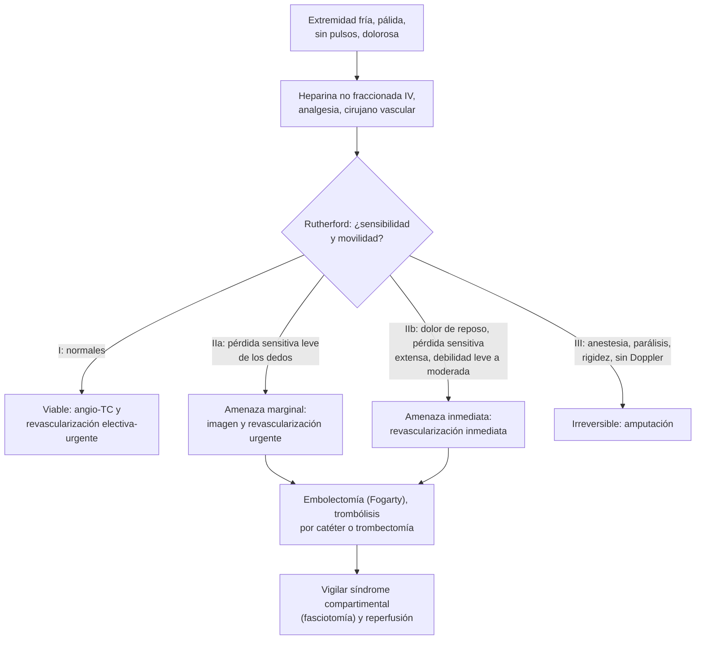

---
tags:
  - Cirugía
  - Urgencia
---

# Insuficiencia arterial aguda (embolia y trombosis) y trauma vascular

**Subespecialidad**
Cirugía vascular · Urgencia · Trauma

**Guías principales**
Guía ESVS 2020 de isquemia aguda de extremidades (*Eur J Vasc Endovasc Surg* 2020) · Guía ESVS 2025 de trauma vascular (*Eur J Vasc Endovasc Surg* 2025)

**Otras fuentes**
Ver [fibrilación auricular](../../cardiologia/fibrilacion-auricular.md) y [enfermedad arterial periférica](../../endocrinologia/complicaciones-cronicas-de-la-diabetes.md)

**GES**
No como tal (el trauma vascular puede estar dentro del **politraumatizado grave**, N.° 48).

**EUNACOM**
4.01.2.021 Insuficiencia arterial aguda: embolia, trombosis, traumatismos · 4.01.2.023 Traumatismos vasculares (sospecha, tratamiento inicial)

**Revisado**
Octubre 2026

!!! abstract "Resumen en 60 segundos"
    - **Isquemia aguda de una extremidad**: caída brusca de la perfusión (< 2 semanas) que **amenaza la viabilidad** de la extremidad. Es una **urgencia**: el músculo tolera ~ **6 horas** de isquemia.
    - **Las 6 P**: dolor (*pain*), **palidez**, **ausencia de pulsos**, **parestesias**, **parálisis** y frialdad (*poikilothermia*). **Parestesias y parálisis = extremidad amenazada.**
    - **Embolia** (fibrilación auricular, IAM reciente): comienzo **brusco**, sin claudicación previa, **pulsos contralaterales normales**. **Trombosis** (sobre una enfermedad arterial previa): claudicación previa, pulsos contralaterales disminuidos, comienzo más gradual.
    - **Tratamiento inmediato**: **heparina no fraccionada IV** (bolo **5.000 UI**), analgesia, extremidad en declive, y **cirujano vascular**.
    - **Clasificación de Rutherford**: **I** viable; **IIa** amenazada marginalmente (imagen y revascularización urgente); **IIb** amenaza inmediata (revascularización **inmediata**: embolectomía con catéter de Fogarty o endovascular); **III** irreversible (**amputación**).
    - Tras revascularizar: vigilar el **síndrome compartimental** (fasciotomía) y la **reperfusión** (hiperkalemia, mioglobinuria).
    - **Trauma vascular**: **signos duros** (hemorragia pulsátil, hematoma expansivo, soplo o frémito, ausencia de pulsos, isquemia) = **pabellón**. **Signos blandos**: índice tobillo-brazo (**< 0,9**) y **angio-TC**. **Torniquete** en la hemorragia de extremidades.

## Definición

- **Isquemia aguda de una extremidad**: disminución **súbita** de la perfusión que amenaza su viabilidad, con síntomas de **menos de 2 semanas** de evolución.
- **Embolia arterial**: oclusión por un **émbolo** originado a distancia (habitualmente el **corazón**), que se impacta en una **bifurcación** (femoral común, poplítea, braquial, aórtica).
- **Trombosis arterial**: oclusión **in situ** sobre una arteria enferma (aterosclerosis), un **bypass** o un **stent**, o un **aneurisma poplíteo** trombosado.
- **Isquemia crónica que amenaza la extremidad**: dolor de reposo o lesiones de más de 2 semanas (ver [complicaciones crónicas de la diabetes](../../endocrinologia/complicaciones-cronicas-de-la-diabetes.md)); no es el tema de esta página.
- **Trauma vascular**: lesión de una arteria o vena por trauma **penetrante**, **cerrado** o **iatrogénico** (punciones, catéteres).

## Epidemiología

### Mundial

- La isquemia aguda de extremidades afecta sobre todo a **adultos mayores**; tiene **alta morbimortalidad**: una proporción importante de los pacientes pierde la extremidad o muere en el primer año, por la gravedad de sus comorbilidades.
- La **trombosis in situ** (sobre enfermedad arterial periférica o injertos) es hoy más frecuente que la **embolia**, aunque la embolia por **fibrilación auricular** sigue siendo causa importante.
- La extremidad **inferior** se afecta mucho más que la superior.
- El **trauma vascular** se concentra en hombres jóvenes (heridas por arma blanca y de fuego) y en las lesiones **iatrogénicas** (procedimientos endovasculares).

### Chile

!!! chile "Datos nacionales"
    - No se encontraron series nacionales recientes publicadas sobre la isquemia aguda de extremidades.
    - La **fibrilación auricular** sin anticoagulación y la **enfermedad arterial periférica** de los diabéticos y fumadores son las causas habituales en la práctica chilena.
    - El trauma vascular de las extremidades por **arma blanca** es frecuente en los servicios de urgencia de las grandes ciudades.

## Etiología y factores de riesgo

| Causa | Ejemplos |
|---|---|
| **Embolia** | **Fibrilación auricular** (la más frecuente), **IAM** reciente con trombo ventricular, valvulopatía, prótesis valvular, endocarditis, aneurisma aórtico o poplíteo (ateroembolia), embolia paradójica |
| **Trombosis** | **Enfermedad arterial periférica** aterosclerótica, oclusión de **bypass** o **stent**, **aneurisma poplíteo** trombosado, estados protrombóticos (cáncer, síndrome antifosfolípido, trombocitopenia por heparina), deshidratación, bajo gasto |
| **Trauma** | Heridas penetrantes, **luxación de rodilla** (arteria poplítea), fractura supracondílea del húmero (arteria braquial en niños), fracturas desplazadas, iatrogenia |
| **Otras** | **Disección aórtica** (ver [síndrome aórtico agudo](../../cardiologia/sindrome-aortico-agudo.md)), compresión extrínseca, vasoespasmo (ergotamina, cocaína) |

## Fisiopatología

- Los tejidos toleran la isquemia de forma diferente: el **nervio** primero (minutos a horas: **parestesias** y **parálisis**), luego el **músculo** (daño irreversible en **~ 6 horas**) y la **piel** al final. Por eso los **signos neurológicos** marcan la gravedad.
- En la **embolia** no hay colaterales desarrolladas → isquemia más **grave** y brusca. En la **trombosis** sobre una arteria enferma hay colaterales → cuadro a veces menos grave.
- **Síndrome de reperfusión**: al restablecer el flujo, el músculo isquémico libera **potasio**, **ácido**, **mioglobina** y mediadores → **hiperkalemia**, acidosis, arritmias, **LRA** por mioglobinuria, y **edema** del músculo → **síndrome compartimental**.

*Figura 1. Manejo de la isquemia aguda de una extremidad según Rutherford. Esquema propio basado en la guía ESVS 2020.*

## Clasificación

**Clasificación clínica de Rutherford (isquemia aguda)**:

| Categoría | Pronóstico | Sensibilidad | Motor | Doppler arterial | Doppler venoso |
|---|---|---|---|---|---|
| **I. Viable** | Sin amenaza inmediata | Normal | Normal | **Audible** | Audible |
| **IIa. Amenaza marginal** | Salvable si se trata pronto | Mínima (dedos) o ausente | Normal | A menudo **inaudible** | Audible |
| **IIb. Amenaza inmediata** | Salvable con revascularización **inmediata** | Más allá de los dedos, **dolor de reposo** | **Debilidad** leve a moderada | Inaudible | Audible |
| **III. Irreversible** | Pérdida de tejido o daño nervioso permanente inevitable | **Anestesia** | **Parálisis**, **rigidez** muscular | Inaudible | **Inaudible** |

**Embolia frente a trombosis**:

| | **Embolia** | **Trombosis** |
|---|---|---|
| **Comienzo** | **Brusco** (minutos) | Más gradual (horas a días) |
| **Fuente** | **FA**, IAM, valvulopatía | Enfermedad arterial previa, bypass, stent |
| **Claudicación previa** | **No** | **Sí** |
| **Pulsos contralaterales** | **Normales** | **Disminuidos** |
| **Gravedad** | Mayor (sin colaterales) | Menor (con colaterales) |
| **Tratamiento** | **Embolectomía** con catéter de **Fogarty** | Trombólisis por catéter, angioplastía o **bypass** |

**Trauma vascular: signos**:

| **Signos duros** (indican cirugía o control inmediato) | **Signos blandos** (indican estudio) |
|---|---|
| **Hemorragia activa pulsátil** | Antecedente de sangrado en la escena |
| **Hematoma expansivo** o pulsátil | Hematoma pequeño y estable |
| **Soplo o frémito** | Déficit neurológico (nervio vecino) |
| **Ausencia de pulsos** distales | Pulso **disminuido** |
| **Signos de isquemia** | Herida cercana a un trayecto vascular mayor |

## Clínica

- **Las 6 P**: dolor, palidez, ausencia de pulsos, **parestesias**, **parálisis**, poiquilotermia (frialdad).
- **Dolor** intenso y súbito (que puede disminuir cuando el nervio se daña: signo **ominoso**).
- **Palidez** cerúlea → luego **livideces** fijas (isquemia irreversible).
- Buscar la **fuente**: pulso irregular (**FA**), soplos, antecedente de IAM, claudicación, cirugías vasculares previas.
- **Trauma vascular**: herida en el trayecto de una arteria, **sangrado pulsátil**, hematoma, pulsos distales disminuidos o ausentes; **luxación de rodilla** (incluso reducida) → lesión de la **arteria poplítea** hasta demostrar lo contrario.

## Diagnóstico

!!! guia "Puntos clave (ESVS 2020 y 2025)"
    - El diagnóstico de la isquemia aguda es **clínico**; clasificarla con **Rutherford** decide la urgencia.
    - **Doppler** arterial y venoso de bolsillo junto a la cama.
    - **Angio-TC** en las categorías **I y IIa** (y IIb si **no retrasa** la revascularización), para planificar el tratamiento.
    - **ECG** (FA), **ecocardiograma** (fuente embólica) después.
    - **Trauma**: los **signos duros** van a **pabellón** (o al control endovascular) sin más estudio; con signos blandos, **índice tobillo-brazo** (o índice de presión arterial lesionado/sano): **< 0,9** obliga a **angio-TC**.

## Laboratorio

| Examen | Uso |
|---|---|
| **Hemograma, coagulación**, grupo y Rh | Basal antes de la heparina y la cirugía; plaquetas (trombocitopenia por heparina) |
| **Creatinina, potasio, CK, gases y lactato** | **Reperfusión**, rabdomiólisis, acidosis |
| **Mioglobina urinaria** | Rabdomiólisis |
| **ECG, troponina** | FA, IAM |

## Imágenes

| Examen | Uso |
|---|---|
| **Doppler de bolsillo** | Señal arterial y venosa (Rutherford) |
| **Eco Doppler** | Nivel de la oclusión |
| **Angio-TC** | Mapa anatómico para planificar la revascularización; trauma con signos blandos |
| **Angiografía** | Diagnóstico y tratamiento endovascular (trombólisis, trombectomía) |
| **Ecocardiograma** | Fuente embólica |

## Diagnóstico diferencial

| Cuadro | Claves |
|---|---|
| **Trombosis venosa profunda masiva** (flegmasia cerulea dolens) | Extremidad **edematosa** y cianótica, venas distendidas |
| **Disección aórtica** con isquemia de extremidad | Dolor torácico o dorsal, asimetría de pulsos |
| **Compresión nerviosa** o radiculopatía | Pulsos presentes |
| **Bajo gasto cardíaco** o shock con vasoconstricción | Ambas extremidades, contexto sistémico |
| **Isquemia crónica** reagudizada | Antecedente de claudicación, cambios tróficos |
| **Síndrome compartimental** | Dolor desproporcionado con pulsos a veces presentes |

## Tratamiento

!!! dosis "Manejo inicial de la isquemia aguda"
    - **Heparina no fraccionada IV**: bolo de **5.000 UI** (o ~ 80 UI/kg), seguido de infusión; salvo contraindicación (disección aórtica, trauma con sangrado).
    - **Analgesia** con opioides.
    - Extremidad en posición **declive** y **protegida** del calor y la presión.
    - **Hidratación**, oxígeno, monitorización.
    - **Interconsulta inmediata a cirugía vascular**.

| Categoría | Conducta |
|---|---|
| **I** | Anticoagulación; **imagen** y revascularización en horas o días |
| **IIa** | **Imagen** y **revascularización urgente**: trombólisis dirigida por catéter, trombectomía percutánea o cirugía |
| **IIb** | **Revascularización inmediata**: **embolectomía con catéter de Fogarty** o trombectomía endovascular; bypass si es trombosis sobre una arteria enferma |
| **III** | **Amputación** primaria (la revascularización desencadenaría un síndrome de reperfusión letal) |

- **Fasciotomía** profiláctica o terapéutica en las isquemias de varias horas o con signos de **síndrome compartimental** tras la revascularización.
- **Prevención secundaria**: **anticoagulación** indefinida en la **embolia por FA**; tratamiento de la enfermedad arterial (antiagregación, estatinas, dejar de fumar).

### Trauma vascular

- **Control de la hemorragia**: **compresión directa**, **torniquete** en las extremidades (ver [trauma y politraumatizado](../trauma-y-shock/trauma-y-politraumatizado.md)).
- **Signos duros**: **pabellón** (reparación primaria, injerto venoso, **shunt temporal** en el control del daño, o tratamiento endovascular).
- **Signos blandos**: índice tobillo-brazo y **angio-TC**.
- Fasciotomía si la isquemia fue prolongada o hay lesión combinada arterial y venosa.
- Reparar la **fractura** y la arteria en una estrategia coordinada (habitualmente revascularizar primero o con shunt temporal).

!!! alarma "Derivar de urgencia a cirugía vascular"
    - **Extremidad fría, pálida y sin pulsos**, sobre todo con **parestesias** o **debilidad**.
    - **Signos duros** de trauma vascular.
    - **Luxación de rodilla** o fractura desplazada con pulsos alterados.
    - Dolor desproporcionado tras una revascularización (**síndrome compartimental**).

## Complicaciones

- **Amputación**.
- **Síndrome de reperfusión**: **hiperkalemia**, acidosis, arritmias, **mioglobinuria** y **LRA**.
- **Síndrome compartimental**.
- Sangrado por la anticoagulación o la trombólisis (incluido el intracraneal).
- **Muerte** (comorbilidades cardiovasculares).
- **Trauma vascular**: seudoaneurisma, fístula arteriovenosa, trombosis tardía.

## Pronóstico y seguimiento

- El resultado depende del **tiempo** hasta la revascularización y de la **categoría de Rutherford**.
- La mortalidad y la tasa de amputación siguen siendo altas por la gravedad de las comorbilidades.
- Seguimiento con eco Doppler, control de los factores de riesgo, **anticoagulación** en las embolias cardíacas.

## Perlas para el internado

!!! perla "Para recordar en la sala"
    - **Las 6 P**: dolor, palidez, sin pulso, parestesias, parálisis, frialdad. **Parestesias o parálisis = urgencia.**
    - **Heparina IV 5.000 UI** apenas se sospecha (si no hay contraindicación).
    - **Embolia**: brusca, FA, pulsos contralaterales normales → **Fogarty**.
    - **Trombosis**: claudicación previa, pulsos contralaterales malos.
    - **Rutherford III** (anestesia, parálisis, rigidez, sin Doppler venoso) = **amputación**, no revascularizar.
    - **Tras revascularizar**: vigilar el **potasio**, la **CK**, la orina y los **compartimentos**.
    - **Luxación de rodilla = buscar lesión de la arteria poplítea** (índice tobillo-brazo).
    - **Trauma con signos duros = pabellón.** **Signos blandos = índice tobillo-brazo; < 0,9 = angio-TC.**
    - **Embolia por FA = anticoagulación de por vida.**

## Preguntas de repaso

??? repaso "1. Mujer de 78 años con FA no anticoagulada, con dolor brusco hace 3 horas en la pierna derecha, que está fría y pálida, sin pulso femoral ni distales. Tiene hipoestesia de los dedos pero mueve el pie; pulsos de la pierna izquierda normales. ¿Diagnóstico y conducta?"
    - **Isquemia aguda por embolia** (FA, comienzo brusco, pulsos contralaterales normales), **Rutherford IIa**.
    - **Heparina IV** (bolo 5.000 UI), analgesia, cirujano vascular; **revascularización urgente**: **embolectomía femoral con catéter de Fogarty**. Luego anticoagulación indefinida.

??? repaso "2. Hombre de 70 años, fumador, con claudicación de la pantorrilla izquierda de años, que hace 24 horas presenta dolor de reposo, frialdad y palidez de esa pierna. Pulsos femorales débiles en ambos lados. ¿Embolia o trombosis?"
    - **Trombosis** in situ sobre una enfermedad arterial periférica (claudicación previa, pulsos contralaterales disminuidos).
    - Heparina, **angio-TC** y revascularización (trombólisis por catéter, angioplastía o bypass) según la categoría.

??? repaso "3. Paciente con 12 horas de isquemia aguda de la pierna, con anestesia, parálisis, rigidez muscular y sin señal Doppler arterial ni venosa. ¿Qué hace?"
    - **Rutherford III** (irreversible).
    - **Amputación primaria**: revascularizar provocaría un síndrome de reperfusión (hiperkalemia, acidosis, mioglobinuria) potencialmente letal.

??? repaso "4. Tras una embolectomía femoral en un paciente con 8 horas de isquemia, aparece dolor intenso de la pantorrilla al estirar pasivamente los dedos y la pierna está tensa. ¿Qué sospecha?"
    - **Síndrome compartimental** por reperfusión.
    - **Fasciotomía** de los cuatro compartimentos de la pierna; controlar el **potasio**, la **CK** y la función renal.

??? repaso "5. Hombre de 25 años con una herida por arma blanca en la cara medial del muslo, con sangrado pulsátil y un hematoma que crece. ¿Conducta?"
    - **Signos duros** de lesión arterial (femoral).
    - **Compresión directa** o **torniquete**, reanimación y **pabellón** inmediato, sin estudios previos.

## Referencias

1. Björck M, Earnshaw JJ, Acosta S, et al. Editor's Choice – European Society for Vascular Surgery (ESVS) 2020 Clinical Practice Guidelines on the Management of Acute Limb Ischaemia. *Eur J Vasc Endovasc Surg.* 2020;59(2):173–218. doi:[10.1016/j.ejvs.2019.09.006](https://doi.org/10.1016/j.ejvs.2019.09.006)
2. Wahlgren CM, Aylwin C, Davenport RA, et al. Editor's Choice – European Society for Vascular Surgery (ESVS) 2025 Clinical Practice Guidelines on the Management of Vascular Trauma. *Eur J Vasc Endovasc Surg.* 2025;69(2):179–237. doi:[10.1016/j.ejvs.2024.12.018](https://doi.org/10.1016/j.ejvs.2024.12.018)
