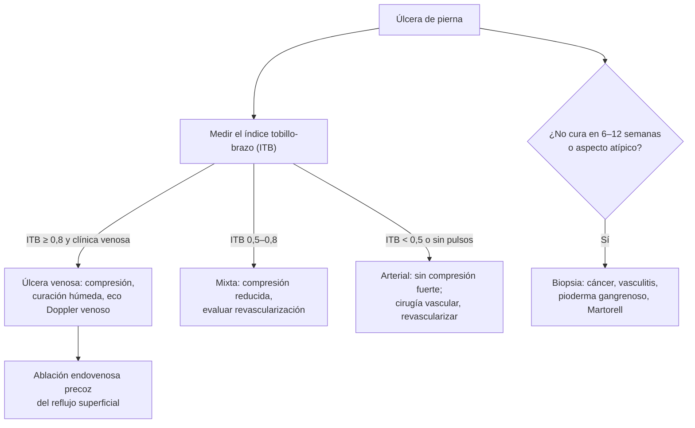

---
tags:
  - Cirugía
  - Frecuente en sala
---

# Várices, insuficiencia venosa crónica y úlceras de las piernas

**Subespecialidad**
Cirugía vascular · Heridas

**Guías principales**
Guía ESVS 2022 de enfermedad venosa crónica de las extremidades inferiores (*Eur J Vasc Endovasc Surg* 2022) · Clasificación CEAP, actualización 2020 (*J Vasc Surg Venous Lymphat Disord* 2020)

**Otras fuentes**
Ensayo EVRA: ablación endovenosa precoz en la úlcera venosa (*N Engl J Med* 2018) · Ver [complicaciones de la diabetes: pie diabético y EAP](../../endocrinologia/complicaciones-cronicas-de-la-diabetes.md)

**GES**
No (el **pie diabético** se maneja en el GES de diabetes).

**EUNACOM**
4.01.1.048 Várices. Insuficiencia venosa crónica · 4.01.1.050 Úlceras de las piernas (venosas, varicosas, hipertensivas y específicas) (sospecha, inicial)

**Revisado**
Octubre 2026

!!! abstract "Resumen en 60 segundos"
    - **Insuficiencia venosa crónica**: **reflujo** (válvulas incompetentes) u **obstrucción** venosa → **hipertensión venosa** en las piernas. Va de las telangiectasias y **várices** al **edema**, los **cambios cutáneos** (hiperpigmentación, eczema, lipodermatoesclerosis) y la **úlcera venosa** (clasificación **CEAP C0–C6**).
    - Síntomas: **pesadez**, dolor, calambres, prurito, edema **vespertino** que mejora al elevar las piernas.
    - **Eco Doppler venoso**: examen de elección (reflujo, obstrucción, trombosis previa).
    - **Tratamiento**: **compresión elástica**, elevación, ejercicio, bajar de peso; **ablación endovenosa** (térmica) de la safena incompetente como primera opción invasiva; escleroterapia; cirugía.
    - **Úlcera venosa** (la más frecuente): **maléolo medial**, bordes irregulares, poco dolorosa, con piel alrededor dañada. **Compresión** + curación húmeda; **ablación precoz** del reflujo acelera la cicatrización (EVRA).
    - **Antes de comprimir: medir el índice tobillo-brazo (ITB)**. Si es **< 0,5–0,6**, no usar compresión fuerte (componente **arterial**).
    - **Úlcera arterial**: dedos, talón o zona pretibial, **muy dolorosa**, bordes netos, sin pulsos. **Úlcera hipertensiva de Martorell**: cara lateral de la pierna, muy dolorosa, en hipertensos y diabéticos. **Úlcera que no cura en 6–12 semanas o atípica: biopsia** (cáncer, vasculitis, pioderma gangrenoso).

## Definición

- **Enfermedad venosa crónica**: alteraciones morfológicas y funcionales del sistema venoso de larga duración, con síntomas y/o signos.
- **Insuficiencia venosa crónica**: formas avanzadas de la enfermedad venosa crónica (**CEAP C3–C6**: edema, cambios cutáneos y úlcera).
- **Várices**: venas subcutáneas **dilatadas** (≥ 3 mm de diámetro en bipedestación) y tortuosas.
- **Telangiectasias** (< 1 mm) y **venas reticulares** (1–3 mm).
- **Úlcera de pierna**: pérdida de sustancia de la piel de la pierna o el pie que **no cicatriza en 4–6 semanas**.
- **Síndrome postrombótico**: insuficiencia venosa crónica secundaria a una **trombosis venosa profunda** previa.

## Epidemiología

### Mundial

- La enfermedad venosa crónica es **muy frecuente**: las várices afectan a una proporción importante de los adultos y aumentan con la **edad**.
- Es más frecuente en **mujeres** (embarazos) y en personas con **historia familiar**.
- Las **úlceras venosas** son la causa más frecuente de **úlcera de pierna** (la mayoría), seguidas de las **arteriales** y **mixtas**; son crónicas y recurrentes, con alto costo para los sistemas de salud.

### Chile

!!! chile "Datos nacionales"
    - No se encontraron datos nacionales recientes publicados sobre la prevalencia de la enfermedad venosa crónica.
    - En la atención primaria chilena, las **curaciones avanzadas** de úlceras venosas y de **pie diabético** son una actividad habitual de enfermería.
    - El **pie diabético** tiene manejo dentro del GES de diabetes (ver [complicaciones crónicas de la diabetes](../../endocrinologia/complicaciones-cronicas-de-la-diabetes.md)).

## Etiología y factores de riesgo

| Factor | Comentario |
|---|---|
| **Primaria** | Debilidad de la pared y de las **válvulas** venosas (la más frecuente) |
| **Secundaria** | **Trombosis venosa profunda** previa (síndrome postrombótico), trauma |
| **Congénita** | Malformaciones venosas (Klippel-Trénaunay) |
| **Factores de riesgo** | **Edad**, **sexo femenino**, **embarazos**, **historia familiar**, **obesidad**, **bipedestación** prolongada (trabajos de pie), sedentarismo |

**Úlceras de pierna según la causa**:

| Tipo | Causa |
|---|---|
| **Venosa** (la más frecuente) | Insuficiencia venosa crónica |
| **Arterial** | **Enfermedad arterial periférica** (aterosclerosis) |
| **Mixta** | Venosa + arterial |
| **Hipertensiva de Martorell** | **Arteriolosclerosis** de las arteriolas subcutáneas en **hipertensos** (y diabéticos) |
| **Neuropática** | **Diabetes** (pie), lepra, alcohol: en zonas de **apoyo** |
| **Específicas** | **Vasculitis**, **pioderma gangrenoso** (enfermedad inflamatoria intestinal), **neoplásica** (carcinoma escamoso o basocelular, úlcera de **Marjolin**), infecciosa, hematológica (anemia falciforme), por **presión**, calcifilaxis (ERC) |

## Fisiopatología

- Normalmente, la **bomba muscular** de la pantorrilla y las **válvulas** impulsan la sangre hacia el corazón; al caminar, la presión venosa del tobillo **baja**.
- En la insuficiencia venosa, el **reflujo** (válvulas incompetentes) o la **obstrucción** impiden esa caída → **hipertensión venosa ambulatoria**.
- La hipertensión venosa produce **extravasación** de líquido, glóbulos rojos (hemosiderina: **hiperpigmentación**) y proteínas, e **inflamación** leucocitaria → **lipodermatoesclerosis**, **atrofia blanca** y finalmente **úlcera**.

*Figura 1. Enfoque de la úlcera de pierna. Esquema propio basado en la guía ESVS 2022.*

## Clasificación

**CEAP (clínica, actualización 2020)**:

| Clase | Hallazgo |
|---|---|
| **C0** | Sin signos visibles |
| **C1** | **Telangiectasias** o venas reticulares |
| **C2** | **Várices** (C2r: recurrentes) |
| **C3** | **Edema** |
| **C4** | **Cambios cutáneos**: C4a pigmentación o eczema; C4b **lipodermatoesclerosis** o atrofia blanca; C4c corona flebectásica |
| **C5** | **Úlcera cicatrizada** |
| **C6** | **Úlcera activa** (C6r: recurrente) |

Se agrega "s" (sintomático) o "a" (asintomático); la clasificación completa incluye la **E**tiología, la **A**natomía y la **P**atofisiología.

**Úlcera venosa frente a arterial y de Martorell**:

| | **Venosa** | **Arterial** | **Martorell (hipertensiva)** |
|---|---|---|---|
| **Ubicación** | **Maléolo medial**, tercio inferior de la pierna (zona de la polaina) | **Dedos**, talón, zonas de presión, pretibial | Cara **lateral** o posterolateral de la pierna |
| **Dolor** | Leve a moderado; mejora al **elevar** | **Intenso**, empeora al elevar, mejora en declive | **Muy intenso**, desproporcionado |
| **Aspecto** | Bordes **irregulares**, poco profunda, fondo con fibrina o granulación, **exudativa** | Bordes **netos** ("en sacabocado"), fondo pálido o necrótico, seca | Bordes violáceos, necrosis, a veces bilateral |
| **Piel vecina** | **Hiperpigmentación**, eczema, lipodermatoesclerosis, várices, edema | Piel **fina**, brillante, sin vello, fría | Normal |
| **Pulsos / ITB** | **Presentes**, ITB normal | **Ausentes**, **ITB bajo** | Presentes |

## Clínica

- **Síntomas venosos**: **pesadez**, cansancio, dolor, **calambres** nocturnos, prurito, sensación de hinchazón; **empeoran al final del día** y con el calor, y **mejoran al elevar** las piernas y caminar.
- **Signos**: telangiectasias, **várices**, **edema** de tobillo, **hiperpigmentación** ocre, eczema, **lipodermatoesclerosis** (piel indurada, "botella de champaña invertida"), **atrofia blanca**, úlcera.
- **Complicaciones de las várices**: **tromboflebitis superficial** (cordón doloroso, eritematoso), **varicorragia** (sangrado de una várice, a veces abundante: compresión y elevación).

## Diagnóstico

!!! guia "Puntos clave (ESVS 2022)"
    - **Historia y examen** en **bipedestación**; clasificar con **CEAP**.
    - **Eco Doppler venoso** (de pie) en los pacientes con várices que se consideran para tratamiento o con signos de insuficiencia venosa crónica: reflujo (> 0,5 segundos en las venas superficiales), obstrucción y TVP previa.
    - **Úlcera de pierna**: medir el **índice tobillo-brazo** en todos (descartar la enfermedad arterial antes de la compresión).
    - **Biopsia** de las úlceras que **no cicatrizan** pese al tratamiento adecuado (6–12 semanas) o que tienen aspecto **atípico** (bordes elevados, tejido exuberante).

## Laboratorio

| Examen | Uso |
|---|---|
| **Glicemia / HbA1c** | Diabetes (cicatrización, neuropatía) |
| **Hemograma, albúmina** | Anemia, desnutrición |
| **Cultivo** | Solo si hay signos clínicos de **infección** (no colonización) |
| **Estudio de vasculitis o de trombofilia** | Úlceras atípicas o TVP recurrente |

## Imágenes

| Examen | Uso |
|---|---|
| **Eco Doppler venoso** | **Examen de elección**: reflujo, obstrucción, TVP |
| **Índice tobillo-brazo** | **Componente arterial**: normal 0,9–1,3; < 0,9 EAP; < 0,5 isquemia grave; > 1,3 arterias calcificadas (diabéticos, ERC) |
| **Angio-TC o flebografía** | Obstrucción venosa ilíaca (síndrome postrombótico, May-Thurner) |
| **Biopsia** | Úlceras atípicas |

## Diagnóstico diferencial

| Hallazgo | Diferenciales |
|---|---|
| **Edema de piernas** | **Insuficiencia venosa**, insuficiencia cardíaca, síndrome nefrótico, cirrosis, hipoalbuminemia, **fármacos** (bloqueadores de calcio), linfedema, **TVP** (unilateral agudo), lipedema |
| **Pierna roja y caliente** | **Celulitis**, **dermatitis de estasis** (bilateral, pruriginosa), lipodermatoesclerosis aguda, TVP, tromboflebitis |
| **Úlcera de pierna** | Venosa, arterial, mixta, **Martorell**, neuropática, **pioderma gangrenoso**, vasculitis, **cáncer** |

## Tratamiento

### Enfermedad venosa crónica

| Medida | Indicación |
|---|---|
| **Medidas generales** | **Elevar** las piernas, **ejercicio** (caminar, bomba muscular), **bajar de peso**, evitar la bipedestación prolongada |
| **Compresión elástica** | Medias de compresión graduada (habitualmente **20–30** o **30–40 mmHg**) para los síntomas, el edema y la prevención de la recurrencia de úlceras |
| **Fármacos venoactivos** | Pueden aliviar los síntomas y el edema (por ejemplo, la fracción flavonoide purificada micronizada) |
| **Ablación endovenosa térmica** (láser o radiofrecuencia) | **Primera opción** para el reflujo de la **safena** sintomática (ESVS 2022) |
| **Escleroterapia** (líquida o con espuma) | Telangiectasias, venas reticulares, várices pequeñas o recurrentes |
| **Cirugía** (safenectomía, flebectomías) | Cuando no es posible la ablación |
| **Venoplastía con stent** | Obstrucción ilíaca seleccionada |

### Úlcera venosa

!!! dosis "Pilares"
    - **Compresión** (vendaje multicapa o medias) de **~ 40 mmHg** en el tobillo si el **ITB es ≥ 0,8**; reducida (≤ 20–30 mmHg) si el ITB está entre 0,5 y 0,8 y bajo supervisión; **no** si es **< 0,5**.
    - **Curación avanzada**: limpieza, **desbridamiento** del tejido desvitalizado, apósitos que mantengan la **humedad** y controlen el exudado, cuidado de la piel vecina.
    - **Ablación precoz** del reflujo superficial: **acelera la cicatrización** y reduce la recurrencia (ensayo EVRA).
    - **Antibióticos** solo si hay **infección** clínica (celulitis), no por colonización.
    - **Prevenir la recurrencia**: compresión de por vida, tratar el reflujo.

### Otras úlceras

- **Arterial**: **revascularización** (cirugía vascular), control de los factores de riesgo, **no comprimir**; curación seca si hay necrosis seca hasta revascularizar.
- **Martorell**: control de la **presión arterial**, analgesia potente, curación; a veces **injerto** cutáneo.
- **Neuropática (pie diabético)**: **descarga**, control metabólico, desbridamiento, tratar la infección y la isquemia (ver [complicaciones de la diabetes](../../endocrinologia/complicaciones-cronicas-de-la-diabetes.md)).
- **Pioderma gangrenoso**: **no desbridar** (patergia); corticoides o inmunosupresores.
- **Neoplásica**: resección.

### Complicaciones agudas de las várices

- **Varicorragia**: **elevación** y **compresión directa**; después, tratamiento de la várice.
- **Tromboflebitis superficial**: AINE, calor local, compresión; **eco Doppler** (descartar la extensión a las venas profundas); **anticoagulación** (fondaparinux) si es extensa (≥ 5 cm) o cercana a la unión safeno-femoral.

!!! alarma "Derivar"
    - **Úlcera con ITB < 0,8** o sin pulsos: cirugía vascular.
    - Úlcera que **no cicatriza** en 6–12 semanas o de aspecto atípico: **biopsia**.
    - **Celulitis** extensa, fiebre u osteomielitis.
    - **Pierna edematosa aguda unilateral**: descartar **TVP** (ver [TEP y TVP](../../respiratorio/tromboembolismo-pulmonar.md)).

## Complicaciones

- **Úlcera** crónica y recurrente.
- **Tromboflebitis superficial**, **TVP**.
- **Varicorragia**.
- **Celulitis** y erisipela recurrentes.
- **Dermatitis de contacto** por los tópicos.
- **Úlcera de Marjolin** (carcinoma escamoso) en úlceras de muchos años.

## Pronóstico y seguimiento

- La enfermedad venosa crónica es **progresiva**; la compresión y el tratamiento del reflujo mejoran los síntomas y reducen las úlceras.
- Las úlceras venosas **recurren con frecuencia**; la ablación del reflujo y la compresión mantenida disminuyen la recurrencia.
- Seguimiento en APS (curaciones) y con cirugía vascular.

## Perlas para el internado

!!! perla "Para recordar en la sala"
    - **Úlcera en el maléolo medial con piel pigmentada = venosa.**
    - **Medir el ITB antes de comprimir.** ITB < 0,5 = no comprimir.
    - **Úlcera dolorosa, de bordes netos, en los dedos y sin pulsos = arterial.**
    - **Úlcera lateral de la pierna, muy dolorosa, en un hipertenso = Martorell.**
    - **Úlcera que no cura o atípica = biopsia** (cáncer, pioderma, vasculitis).
    - **Pioderma gangrenoso: no desbridar.**
    - **Eco Doppler venoso** de pie para estudiar las várices.
    - **Ablación endovenosa** precoz del reflujo acelera la cicatrización de la úlcera venosa.
    - **Edema de piernas en un usuario de amlodipino**: pensar en el fármaco.

## Preguntas de repaso

??? repaso "1. Mujer de 55 años con várices, pesadez vespertina, edema de tobillos e hiperpigmentación ocre en ambas piernas, sin úlceras. ¿Qué clase CEAP tiene y cómo la maneja?"
    - **CEAP C4a** (cambios cutáneos: pigmentación).
    - **Eco Doppler venoso**, medidas generales, **compresión elástica**; ablación endovenosa de la safena si hay reflujo y síntomas.

??? repaso "2. Hombre de 68 años con una úlcera de 4 cm sobre el maléolo medial izquierdo de 3 meses, exudativa, con piel pigmentada e indurada alrededor. ¿Qué examen pide antes de indicar compresión?"
    - El **índice tobillo-brazo**: si es **≥ 0,8**, compresión (~ 40 mmHg) + curación húmeda; además **eco Doppler venoso** y **ablación precoz** del reflujo.

??? repaso "3. Mujer de 72 años, hipertensa y diabética, con una úlcera muy dolorosa en la cara lateral de la pierna, de bordes violáceos, con pulsos presentes e ITB normal. ¿Qué sospecha?"
    - **Úlcera hipertensiva de Martorell**.
    - Control de la presión arterial, **analgesia** potente, curación; biopsia si hay dudas (vasculitis, pioderma); a veces injerto.

??? repaso "4. Hombre de 70 años, fumador, con una úlcera seca y muy dolorosa en el dorso del primer ortejo, que empeora al elevar la pierna. No tiene pulsos pedios. ¿Qué tipo de úlcera es y qué hace?"
    - **Úlcera arterial** por enfermedad arterial periférica.
    - **ITB**, eco Doppler arterial y derivación a **cirugía vascular** (revascularización); **no comprimir**; dejar de fumar, estatina y antiagregación.

??? repaso "5. Paciente con una úlcera venosa de 15 años que en los últimos meses desarrolló bordes elevados y tejido exuberante. ¿Qué debe descartar?"
    - **Úlcera de Marjolin** (carcinoma escamoso sobre una úlcera crónica): **biopsia** de los bordes.

## Referencias

1. De Maeseneer MG, Kakkos SK, Aherne T, et al. Editor's Choice – European Society for Vascular Surgery (ESVS) 2022 Clinical Practice Guidelines on the Management of Chronic Venous Disease of the Lower Limbs. *Eur J Vasc Endovasc Surg.* 2022;63(2):184–267. doi:[10.1016/j.ejvs.2021.12.024](https://doi.org/10.1016/j.ejvs.2021.12.024)
2. Lurie F, Passman M, Meisner M, et al. The 2020 update of the CEAP classification system and reporting standards. *J Vasc Surg Venous Lymphat Disord.* 2020;8(3):342–352. doi:[10.1016/j.jvsv.2019.12.075](https://doi.org/10.1016/j.jvsv.2019.12.075)
3. Gohel MS, Heatley F, Liu X, et al. A Randomized Trial of Early Endovenous Ablation in Venous Ulceration. *N Engl J Med.* 2018;378(22):2105–2114. doi:[10.1056/NEJMoa1801214](https://doi.org/10.1056/NEJMoa1801214)
